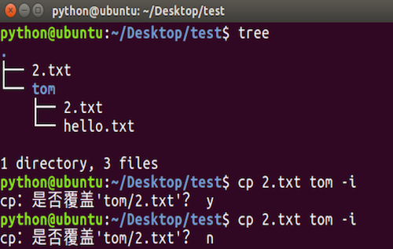
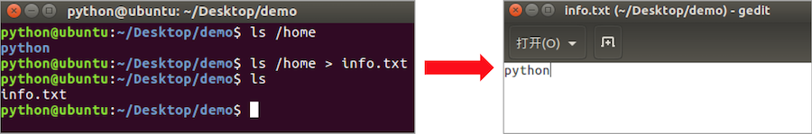

# Linux必备知识点

Ubuntu 没有盘符这个概念，只有一个根目录 / 。

**Linux主要目录介绍效果图:**

**主要目录说明:**

- /：根目录

- /bin：可执行二进制文件的目录

- /etc：系统配置文件存放的目录

- /home：用户家目录

  

1. ### 查看目录命令的使用

| 命令 | 说明                   |
| :--- | :--------------------- |
| ls   | 查看当前目录信息       |
| tree | 以树状方式显示目录信息 |

### 2. 查看当前目录路径

| 命令 | 说明             |
| :--- | :--------------- |
| pwd  | 查看当前目录路径 |

### 3. 清除终端内容

| 命令  | 说明         |
| :---- | :----------- |
| clear | 清除终端内容 |

### 4. 小结

- ls和tree是我们查看目录信息最常用的命令
- ls只能查看一层目录信息
- tree可以查看多层目录信息。

------

### 1. 切换目录命令的使用

| 命令    | 说明                   |
| :------ | :--------------------- |
| cd 目录 | 切换到指定目录         |
| cd ~    | 切换到当前用户的主目录 |
| cd ..   | 切换到上一级目录       |
| cd .    | 切换到当前目录         |
| cd -    | 切换到上一次目录       |

**注意:**

- cd命令切换目录时，这个目录必须存在。
- **cd 后面不写目录等价于cd ~**

#### 绝对路径和相对路径

- 绝对路径和相对路径是路径的两种表现形式，应遵循最短路径原则(使用最短的路径操作某个文件或者目录)。
  - 如果切换的目录离当前目录近可以使用相对路径
  - 如果切换的目录离根目录近可以使用绝对路径
  - 如果切换的目录离根目录和当前目录都一样那么使用绝对路径，因为这样路径很清楚和明确，方便阅读。

### 1. 创建、删除文件及目录命令的使用

| 命令                | 说明                 |
| :------------------ | :------------------- |
| touch 文件名        | 创建指定文件         |
| mkdir 目录名        | 创建目录(文件夹)     |
| rm 文件名或者目录名 | 删除指定文件或者目录 |
| rmdir 目录名        | 删除空目录           |

### 2. 小结

- touch 表示创建文件
- mkdir 表示创建目录
- rm 表示删除文件或者目录，如果删除目录需要使用 -r 选项，-r 表示递归删除目录及其内容
- rmdir 表示删除空目录

- 

------

### 1. 复制、移动文件及目录命令的使用

| 命令 | 说明                       |
| :--- | :------------------------- |
| cp   | 拷贝文件、拷贝目录         |
| mv   | 移动文件、移动目录、重命名 |

**说明:**

- 拷贝目录需要加上-r选项，-r表示递归拷贝目录及其内容

- cp：拷贝目录需要加上 –r 选项
- mv：移动目录不需要加选项
- mv：命令还可以重命名文件和目录
- 

### 1. 终端命令格式说明

**command** [-options] [parameter]

**每项信息的说明:**

- command：命令名, 比如: ls、pwd
- [-options]：选项，可以有零个、一个或者多个选项，多个选项可以合并，比如使用的 -r 就是选项。
- [parameter]：参数，可以有零个、一个 或者 多个参数， 比如: touch 文件名、mkdir 目录名、cd 目标目录(路径)，这些文件名和目录名都是参数。
- []：代表可选

### 2. 小结

- 终端命令完整格式: 命令名 选项(可选) 参数(可选)
- 选项：用于调整命令的功能，比如：-r选项调整cp命令的功能。
- 选项可以分为短选项和长选项
  1. 短选项的格式: '-'后面接单个字母, 比如:-r
  2. 长选项的格式: '--'后面接单词, 比如:--help
- 参数：命令的操作对象，一般是文件名或者目录名。
- 对于命令，它的选项和参数一般情况下没有顺序要求，但是scp命令是必须先选项然后在跟上参数。

### 1. 查看命令帮助方式

- --help 使用说明: 命令 --help
- man 使用说明: man 命令

**查看命令帮助的目的说明:**

- 查看命令帮助目的是查看命令选项信息的

**man命令的说明:**

| 操作键 | 说明           |
| :----- | :------------- |
| 空格   | 显示下一屏信息 |
| 回车   | 显示下一行信息 |
| b      | 显示上一屏信息 |
| f      | 显示下一屏信息 |
| q      | 退出           |

### 2. 小结

- --help和man是查看命令帮助的两种方式，主要是查看命令所对应的选项信息

# ls命令选项

**学习目标**

- 能够说出查看目录中隐藏文件的命令选项

------

### 1. ls命令选项使用

| 命令选项 | 说明                       |
| :------- | :------------------------- |
| -l       | 以列表方式显示             |
| -h       | 件大小单位显示，默认是字节 |
| -a       | 显示隐藏文件和隐藏目录     |

**每项信息说明:**

### 2. 小结

- ls不同选项会呈现不同的显示方式，其中-l和-a选项最常用

# mkdir和rm命令选项

**学习目标**

- 能够说出删除文件有提醒信息的命令选项

------

### 1. mkdir命令选项

| 命令选项 | 说明               |
| :------- | :----------------- |
| -p       | 创建所依赖的文件夹 |

### 2. rm命令选项

| 命令选项 | 说明                                 |
| :------- | :----------------------------------- |
| -i       | 交互式提示                           |
| -r       | 递归删除目录及其内容                 |
| -f       | 强制删除，忽略不存在的文件，无需提示 |
| -d       | 删除空目录                           |

**rm -i命令选项效果图:**

### 3. 小结

- 创建嵌套文件夹使用 **“mkdir –p”** 嵌套目录
- 删除空目录使用 **“rmdir 目录名”** 或者 **“rm –d 目录名”**
- 删除非空目录使用 **“rm –r 目录名”**

- 

------

### 1. cp命令选项

| 命令选项 | 说明                 |
| :------- | :------------------- |
| -i       | 交互式提示           |
| -r       | 递归拷贝目录及其内容 |
| -v       | 显示拷贝后的路径描述 |
| -a       | 保留文件的原有权限   |

**cp -i命令选项效果图:**

**-a选项说明:**

- -a 选项还支持拷贝文件夹并且文件夹中的文件权限不丢失

### 2. mv命令选项

| 命令选项 | 说明                 |
| :------- | :------------------- |
| -i       | 交互式提示           |
| -v       | 显示移动后的路径描述 |

**mv -i命令选项效果图:**

### 3. 小结

- 拷贝文件防止覆盖使用 **“cp –i”** 操作
- 拷贝文件夹使用 **“cp –r”** 操作，拷贝文件夹并且文件权限不丢失使用 **“cp –a”** 操作。
- 移动文件防止覆盖使用 **“mv –i”** 操作
- 移动文件夹直接使用 **“mv”** 即可，**“mv”** 还可以给文件和文件夹重命名。

# 重定向命令

**学习目标**

- 能够使用重定向命令将终端显示内容重定向到文件

------

### 1. 重定向命令的介绍

重定向也称为输出重定向，把在终端执行命令的结果保存到目标文件。

### 2. 重定向命令的使用

| 命令 | 说明                                                       |
| :--- | :--------------------------------------------------------- |
| >    | 如果文件存在会覆盖原有文件内容，相当于文件操作中的‘w’模式  |
| >>   | 如果文件存在会追加写入文件末尾，相当于文件操作中的‘a’ 模式 |

**重定向命令效果图:**

**说明:**

只要在终端能显示信息的命令都可以使用重定向，比如: tree

### 3. 小结

- 终端内容保存到文件使用重定向有两种方式: **>** 和 **>>**
- **>** 表示每次只写入最新的数据，原有数据不保留。
- **>>** 表示每次在原有数据的基础上进行追加，原有数据会保留。

# 查看文件内容命令

**学习目标**

- 能够说出查看大文件分屏显示使用的命令

------

### 1. 查看文件内容命令的使用

| 命令 | 说明             |
| :--- | :--------------- |
| cat  | 查看小型文件     |
| more | 分屏查看大型文件 |

**cat命令的效果图**

**说明:**

- cat命令结合重定向可以完成多个文件的合并
- gedit 文件编辑命令，可以查看和编辑文件

**more命令的效果图**

当查看内容信息过长无法在一屏上显示时，可以使用 more 命令在终端分配显示文件内容。

**操作键说明:**

| 操作键 | 说明           |
| :----- | :------------- |
| 空格   | 显示下一屏信息 |
| 回车   | 显示下一行信息 |
| b      | 显示上一屏信息 |
| f      | 显示下一屏信息 |
| q      | 退出           |

### 2. 管道(|)命令的使用

管道(|)：一个命令的输出可以通过管道做为另一个命令的输入，可以理解成是一个容器，存放在终端显示的内容。

**管道命令的效果图:**

**说明:**

管道(|)一般结合 more 命令使用，主要是分配查看终端显示内容。

### 3. 小结

- 查看小文件使用 **cat** 命令
- 分屏查看大型文件使用 **more** 命令，
- 查看终端显示内容并分屏展示，使用 **管道(|)** 结合 **more** 命令。

# 链接命令

- 

| 命令  | 说明       |
| :---- | :--------- |
| ln -s | 创建软链接 |
| ln    | 创建硬链接 |

### 2. 软链接

类似于**Windows下的快捷方式**，当一个源文件的目录层级比较深，我们想要方便使用它可以给源文件创建一个软链接。

**软链接效果图:**

**注意点:**

- **如果软链接和源文件不在同一个目录，源文件要使用绝对路径，不能使用相对路径。**
- **删除源文件则软链接失效**
- **可以给目录创建软链接**

### 3. 软链接小结

- 软链接的作用是方便文件的快速访问，比如:给一个复杂路径下的文件创建一个软链接，以后就可以通过软链接完成快速访问操作。
- 创建软链接命令格式: ln -s 源文件路径(使用绝对路径) 软链接

### 4. 硬链接

类似于**源文件的一个别名**，也就是说这两个名字指向的是同一个文件数据。

**硬链接效果图:**

**注意点:**

- **创建硬链接使用相对路径和绝对路径都可以**
- **删除源文件，硬链接还可以访问到数据。**
- **创建硬链接，硬链接数会加1，删除源文件或者硬链接，硬链接数会减1。**
- **创建软链接，硬链接数不会加1**
- **不能给目录创建硬链接**

**硬链接数:**

**硬链接数就是文件数据被文件名使用的次数, 好比引用计数**

### 5. 硬链接小结

- 硬链接的作用是可以给重要文件创建硬链接，能够防止文件数据被误删。
- 删除源文件，软链接失效，但是硬链接依然可以使用。
- 创建硬链接命令格式: ln 源文件路径 硬链接

# 文本搜索命令

**学习目标**

- 能够知道文本搜索使用的命令

------

### 1. grep命令的使用

| 命令 | 说明     |
| :--- | :------- |
| grep | 文本搜索 |

**grep命令效果图:**

![grep命令](../2、数据库/imgs/grep.png)

### 2. grep命令选项的使用

| 命令选项 | 说明                       |
| :------- | :------------------------- |
| -i       | 忽略大小写                 |
| -n       | 显示匹配行号               |
| -v       | 显示不包含匹配文本的所有行 |

**-i命令选项效果图:**

**-n命令选项效果图:**

**-v命令选项效果图:**

![grep命令选项](../2、数据库/imgs/grep选项-3.png)

### 3. grep命令结合正则表达式的使用

| 正则表达式 | 说明                   |
| :--------- | :--------------------- |
| ^          | 以指定字符串开头       |
| $          | 以指定字符串结尾       |
| .          | 匹配一个非换行符的字符 |

**正则表达式‘^’的效果图:**

**正则表达式‘$’的效果图:**

**正则表达式‘.’的效果图:**

![grep正则](../2、数据库/imgs/grep正则-3.png)

### 4. 扩展

- **grep** 命令还可以文本搜索管道中的内容，比如: **ls / | grep ‘lib’**
- 在使用 **grep** 命令的时候还可以省略搜索内容的引号，比如: **ls / | grep lib**， **grep hello 1.txt**

### 5. 小结

- grep 命令是完成文本搜索操作的
- 文本搜索的命令格式: grep 选项 文本搜索内容

# 查找文件命令

**学习目标**

- 能够说出查找文件使用的命令

------

### 1. find命令及选项的使用

| 命令 | 说明                           |
| :--- | :----------------------------- |
| find | 在指定目录下查找文件(包括目录) |

**find命令选项:**

| 选项  | 说明                         |
| :---- | :--------------------------- |
| -name | 根据文件名(包括目录名)字查找 |

### 2. find命令结合通配符的使用

**通配符:**

是一种特殊语句，主要有星号(*)和问号(?)，用来模糊搜索文件

| 通配符 | 说明                  |
| :----- | :-------------------- |
| *      | 代表0个或多个任意字符 |
|        |                       |
| ?      | 代表任意一个字符      |

***通配符的效果图:**

**扩展:**

通配符不仅能结合 **find** 命令使用，还可以结合其它命令使用, 比如: **ls、mv、cp** 等，这里需要注意只有 **find** 命令使用通配符需要加上引号。

### 3. 小结

- find命令是完成查找文件操作的
- 查找文件的命令格式: find 指定查找目录 -name "文件名"

# 压缩和解压缩命令

**学习目标**

- 能够使用tar命令完成文件的压缩和解压缩

------

### 1. 压缩格式的介绍

Linux默认支持的压缩格式:

- .gz
- .bz2
- .zip

**说明:**

- .gz和.bz2的压缩包需要使用tar命令来压缩和解压缩
- .zip的压缩包需要使用zip命令来压缩，使用unzip命令来解压缩

**压缩目的:**

- 节省磁盘空间

### 2. tar命令及选项的使用

| 命令 | 说明             |
| :--- | :--------------- |
| tar  | 压缩和解压缩命令 |

**tar命令选项:**

| 选项 | 说明                               |
| :--- | :--------------------------------- |
| -c   | 创建打包文件                       |
| -v   | 显示打包或者解包的详细信息         |
| -f   | 指定文件名称, 必须放到所有选项后面 |
| -z   | 压缩或解压缩(.gz)                  |
| -j   | 压缩或解压缩(.bz2)                 |
| -x   | 解包                               |
| -C   | 解压缩到指定目录                   |

### 3. zip和unzip命令及选项的使用

| 命令  | 说明               |
| :---- | :----------------- |
| zip   | 压缩成.zip格式文件 |
| unzip | 解压缩.zip格式文件 |

**unzip命令选项:**

| 选项 | 说明             |
| :--- | :--------------- |
| -d   | 解压缩到指定目录 |

**解压缩.zip到指定目录效果图:**

![unz![](file:///D:/hgx%E7%A

**说明:**

- 压缩文件尽量使用.gz格式，因为占用空间较少
- 使用zip命令压缩的文件占用空间比较多, 当时比较通用，操作更加简单。

### 4. 小结

- .gz和.bz2的压缩文件使用tar命令来完成压缩和解压缩
- .zip的压缩文件使用zip和unzip命令来完成压缩和解压缩

# 文件权限命令

**学习目标**

- 能够使用chmod命令完成文件权限的修改

------

### 1. chmod命令的介绍

| 命令  | 说明         |
| :---- | :----------- |
| chmod | 修改文件权限 |

chmod修改文件权限有两种方式:

- 字母法
- 数字法

### 2. chmod 字母法的使用

**角色说明:**

| 角色 | 说明                     |
| :--- | :----------------------- |
| u    | user, 表示该文件的所有者 |
| g    | group, 表示用户组        |
| o    | other, 表示其他用户      |
| a    | all, 表示所有用户        |

**权限设置说明:**

| 操作符 | 说明     |
| :----- | :------- |
| +      | 增加权限 |
| -      | 撤销权限 |
| =      | 设置权限 |

**权限说明:**

| 权限 | 说明       |
| :--- | :--------- |
| r    | 可读       |
| w    | 可写       |
| x    | 可执行     |
| -    | 无任何权限 |

### 3. chmod 数字法的使用

数字法就是“rwx” 这些权限也可以用**数字来代替**

**权限说明:**

| 权限 | 说明                  |
| :--- | :-------------------- |
| r    | 可读，权限值是4       |
|      |                       |
| w    | 可写，权限值是2       |
| x    | 可执行，权限值是1     |
| -    | 无任何权限，权限值是0 |

### 4. 小结

- 利用 **chmod** 命令可以控制文件的操作权限。
- 字母法格式: chmod 不同角色设置的权限 文件
- 数字法格式: chmod 不同角色的权限值 文件名

# 获取管理员权限的相关命令

**学习目标**

- 能够知道切换到管理员用户的命令

------

### 1. sudo命令的使用

| 命令    | 说明                                                       |
| :------ | :--------------------------------------------------------- |
| sudo -s | 切换到root用户，获取管理员权限                             |
| sudo    | 某个命令的执行需要获取管理员权限可以在执行命令前面加上sudo |

**说明:**

- 如果只是某次操作需要使用管理员权限建议使用 sudo , 也就是说临时使用管理器权限。
- 如果大量操作都需要使用管理员权限 sudo –s, 但是操作需谨慎。

### 2. whoami命令的使用

| 命令   | 说明           |
| :----- | :------------- |
| whoami | 查看当前用户限 |

### 3. exit命令的使用

| 命令 | 说明         |
| :--- | :----------- |
| exit | 退出登录用户 |

**说明:**

- 如果是切换后的登陆用户，退出则返回上一个登陆账号。
- 如果是终端界面，退出当前终端。

### 4. who命令的使用

| 命令 | 说明               |
| :--- | :----------------- |
| who  | 查看所有的登录用户 |

### 5. passwd命令的使用

| 命令   | 说明                                             |
| :----- | :----------------------------------------------- |
| passwd | 修改用户密码，不指定用户默认修改当前登录用户密码 |

### 6. which命令的使用

| 命令  | 说明         |
| :---- | :----------- |
| which | 查看命令位置 |

### 7. 关机和重启命令的使用

| 命令            | 说明     |
| :-------------- | :------- |
| shutdown –h now | 立刻关机 |
| reboot          | 重启     |

### 8. 小结

- sudo 是临时获取管理员权限
- sudo -s 是切换到管理员用户，一直使用管理员权限，需要谨慎操作。
- exit 是退出当前用户
- passwd 默认修改当前用户密码

# 用户相关操作

**学习目标**

- 能够知道创建用户的命令

------

### 1. 创建用户

| 命令    | 说明           |
| :------ | :------------- |
| useradd | 创建(添加)用户 |

**useradd命令选项:**

| 选项 | 说明                                                       |
| :--- | :--------------------------------------------------------- |
| -m   | 自动创建用户主目录,主目录的名字就是用户名                  |
| -g   | 指定用户所属的用户组，默认不指定会自动创建一个同名的用户组 |

**说明:**

- **useradd** 命令的使用需要使用管理员权限，前面需要加上 **sudo**
- 创建用户如果不指定用户组，默认会自动创建一个同名的用户组
- 查看用户是否创建成功，可以查看**/etc/passwd**这个文件
- 查看用户组是否创建成功，可以查看**/etc/group**这个文件

**passwd文件中的每项信息说明,以root:x:0:0:root:/root:/bin/bash为例:**

- 第一个：用户名
- 第二个：密码占位符
- 第三个：uid, 用户id
- 第四个：gid, 用户所在组id
- 第五个：用户描述, 可选，
- 第六个：用户的主目录所在位置
- 第七个：用户所用 shell 的类型，一般由bash或者sh，默认不设置是sh类型

**group文件中的每项信息说明, 以laowang:x:1001:为例:**

- 第一个：用户组名
- 第二个：用户组密码占位符，一般Linux系统的用户组都没有密码的
- 第三个：组id

**id命令查看用户信息:**

| 命令 | 说明         |
| :--- | :----------- |
| id   | 查看用户信息 |

# **---------------------------------------------------------**

**每项信息说明:**

uid=1001(laowang) gid=1001(laowang) 组=1001(laowang)

- 第一个: uid 表示用户id
- 第二个: gid 表示用户组id
- 第三个: 组 表示用户所在的用户组

### 2. 设置密码

给其它用户设置密码，需要使用: **sudo passwd 用户名**

**设置密码效果图:** 

### 3. 切换用户

| 命令 | 说明     |
| :--- | :------- |
| su   | 切换用户 |

**语法格式: su - 用户名**

**切换用户效果图:**

**在laowang用户使用sudo -s效果图:**

解决办法:

- 给laowang用户设置一个sudo附加组， 需要使用usermod修改用户信息

### 4. 修改用户信息

| 命令    | 说明         |
| :------ | :----------- |
| usermod | 修改用户信息 |

**usermod选项:**

| 命令 | 说明           |
| :--- | :------------- |
| -G   | 设置一个附加组 |
| -g   | 修改用户组     |

**usermod命令效果图:**

**设置附加组sudo以后，在sudo -s切换到管理员用户效果图:**

### 5. 扩展: 删除附加组

| 命令    | 说明                 |
| :------ | :------------------- |
| gpasswd | 添加和删除附加组信息 |

**gpasswd命令选项:**

| 选项      | 说明             |
| :-------- | :--------------- |
| -a 用户名 | 给用户添加附加组 |
| -d 用户名 | 给用户删除附加组 |

**删除附加组效果图:**

**删除附加组再次使用 sudo -s 效果图:**

### 5. 删除用户

| 命令    | 说明     |
| :------ | :------- |
| userdel | 删除用户 |

**userdel命令选项:**

| 选项      | 说明                                               |
| :-------- | :------------------------------------------------- |
| -r 用户名 | 删除用户主目录，必须要设置，否则用户主目录不会删除 |

**删除用户效果图:**

**id查看用户信息效果图:**

**查看group文件信息效果图:**

**说明:**

- 删除用户，默认同名的用户组也会被删除

### 6. 小结

- 创建用户命令格式: **sudo useradd -m 用户名**, 默认会创建一个同名的用户组。
- 查看用户信息使用 **id** 命令或者 **/etc/passwd文件**
- 查看用户组信息使用 **/etc/group文件**
- 给用户设置密码使用 **sudo passwd 用户名**
- 切换用户使用 **su - 用户名**
- 设置附加组使用 **sudo usermod -G** 组名 用户名
- 删除用户使用 **sudo userdel -r 用户名**，默认会删除同名的用户组。

# 用户组相关操作

**学习目标**

- 能够知道创建用户组的命令

------

### 1. 创建用户组

| 命令     | 说明             |
| :------- | :--------------- |
| groupadd | 创建(添加)用户组 |

**创建用户组效果图:**

### 2. 创建用户并指定用户组

**创建用户并指定用户组效果图:**

### 3. 修改用户组

**修改用户组效果图:**

### 4. 删除用户组

| 命令     | 说明       |
| :------- | :--------- |
| groupdel | 删除用户组 |

**删除用户组效果图:**

**说明:**

- 如果用户组下面有用户先删除用户在删除用户组

### 5. 小结

- 创建用户组使用: **sudo groupadd 用户组名**
- 创建用户并指定用户组使用: **sudo useradd -m -g 用户组 用户名**
- 修改用户组使用: **sudo usermod -g 用户组 用户名**
- 删除用户组使用: **sudo groupdel 用户组名**

# 远程登录、远程拷贝命令

**学习目标**

- 能够写出远程拷贝、远程登录命令

------

### 1. 远程登录、远程拷贝命令的介绍

| 命令 | 说明     |
| :--- | :------- |
| ssh  | 远程登录 |
| scp  | 远程拷贝 |

### 2. ssh命令的使用

ssh是专门为远程登录提供的一个安全性协议，常用于远程登录，想要使用ssh服务，需要安装相应的服务端和客户端软件，当软件安装成功以后就可以使用ssh命令了，以后可以通过远程登录之间操作远程的服务器。

**远程登录效果图:**

**软件安装步骤:**

1. 假如Ubuntu作为服务端,需要安装ssh服务端软件. 执行命令: **sudo apt-get install openssh-server**
2. 客户端电脑如果是 **macOS** 系统则不需要安装 ssh 客户端软件，默认已经安装过了，**直接可以使用 ssh 命令**
3. 客户端电脑如果是Windows系统则需要安装**OpenSSH for Windows**这个软件

**ssh命令格式:**

ssh 用户名@ip地址

**ssh命令效果图:**

**说明:**

- 在一台电脑上可以安装安装ssh客户端和ssh服务端软件
- 在Ubuntu安装ssh客户端命令: sudo apt-get install openssh-client

### 3. scp命令的使用

scp是基于ssh进行远程文件拷贝的命令，也就是说需要保证服务端和客户端电脑安装了相应的ssh软件，以后可以把我们写代码远程拷贝到服务器。

**scp命令格式:**

- 远程拷贝文件
  - scp 本地文件 远程服务器用户名@远程服务器ip地址:指定拷贝到远程服务器的路径
  - scp 远程服务器用户名@远程服务器ip地址:远程服务器文件 指定拷贝到本地电脑的路径
- 远程拷贝目标
  - scp -r 本地目录 远程服务器用户名@远程服务器ip地址:指定拷贝到远程服务器的路径
  - scp -r 远程服务器用户名@远程服务器ip地址:远程服务器目录 指定拷贝到本地电脑的路径
  - -r 表示递归拷贝整个目录

**本地文件远程拷贝到服务器效果图:**

**服务器文件远程拷贝到本地效果图:**

**本地目录远程拷贝到服务器效果图:**

**服务器目录远程拷贝到本地效果图:**

### 4. FileZilla软件的使用

FileZilla 是一个免费开源的FTP软件, 使用可视化方式进行上传和下载文件。以后可以通过 FileZilla 来代替 **scp** 命令

**FileZilla使用效果图:**

![FileZilla](../2、数据库/imgs/f1.png)   

### 5. 小结

- ssh命令是远程登录主机电脑，相当于直接操作的是远程电脑。
- scp命令是可以完成远程拷贝操作，注意:拷贝文件夹需要加-r选项。
- 大量的文件上传和下载可以通过可视化工具FileZilla来完成。

# 编辑器 vim

**学习目标**

- 能够说出vim的三种工作模式
- 能够说出vim对应复制和粘贴命令

------

### 1. vim 的介绍

vim 是一款功能强大的文本编辑器，也是早年 Vi 编辑器的加强版，它的最大特色就是使用命令进行编辑，完全脱离了鼠标的操作。

### 2. vim 的工作模式

- 命令模式
- 编辑模式
- 末行模式

**说明:**

vim 打开文件进入的是命令模式

**工作模式效果图:**

**注意点:**

编辑模式和末行模式之间不能直接进行切换，都需要通过命令模式来完成。

### 3. vim 的末行模式命令

- :w 保存
- :wq 保存退出
- :x 保存退出
- :q! 强制退出

### 4. vim 的常用命令

| 命令                                          | 说明               |
| :-------------------------------------------- | :----------------- |
| yy                                            | 复制光标所在行     |
| p                                             | 粘贴               |
| dd                                            | 删除/剪切当前行    |
| V                                             | 按行选中           |
| u                                             | 撤销               |
| ctr+r                                         | 反撤销             |
| >>                                            | 往右缩进           |
| <<                                            | 往左缩进           |
| :/搜索的内容                                  | 搜索指定内容       |
| :%s/要替换的内容/替换后的内容/g               | 全局替换           |
| :开始行数,结束行数s/要替换的内容/替换后的内容 | 局部替换           |
| .                                             | 重复上一次命令操作 |
| G                                             | 回到最后一行       |
| gg                                            | 回到第一行         |
| 数字+G                                        | 回到指定行         |
| shift+6                                       | 回到当前行的行首   |
| shift+4                                       | 回到当前行的行末   |
| ctr+f                                         | 下一屏             |
| ctr+b                                         | 上一屏             |

### 5. 小结

vim 是一款功能强大的命令文本编辑器，可以对远程服务器的代码直接进行修改，这样操作起来更加快速和方便。

# 软件安装

**学习目标**

- 能够使用apt-get命令安装软件

------

### 1. 软件安装的介绍

Ubuntu软件安装有两种方式:

- 离线安装(deb文件格式安装）
- 在线安装(apt-get方式安装)

### 2. deb文件格式安装

是 Ubuntu 的安装包格式，可以使用 **dpkg** 命令进行软件的安装和卸载。

| 命令 | 说明                |
| :--- | :------------------ |
| dpkg | 安装和卸载deb安装包 |

**dpkg命令选项:**

| 选项 | 说明              |
| :--- | :---------------- |
| -i   | 离线安装deb安装包 |

**dpkg命令效果图:**

### 3. apt-get方式安装

是在线安装deb软件包的命令，主要用于在线从互联网的软件仓库中**搜索、安装、升级、卸载**软件。

**在线安装软件命令格式:**

- **sudo apt–get install 安装包** , 表示在线安装deb安装包

### 4. 更改镜像源

因为使用 apt-get 命令默认是从国外的服务器下载安装软件的，会导致下载安装速度很慢，所以需要更改成国内的镜像源服务器。

**镜像源说明:**

镜像源就是下载软件来源的服务器。

**镜像源效果图:**

**更改镜像源的方式:**

1. 可视化方式更改镜像源
2. 手动方式更改镜像源

**可视化方式更改镜像源:**

      

**手动方式更改镜像源:**

      

**说明:**

1. 手动修改镜像源，配置完成以后需要执行 **sudo apt-get update** 这个命令，更新镜像源保证可以下载最新的软件。
2. **使用apt-get方式安装软件一定要联网**

### 5. 小结

1. Ubuntu 操作系统安装软件有两种方式:
   - **sudo dpkg -i 安装包** 命令
   - **sudo apt-get install 安装包** 命令卸载
2. 使用 **apt-get** 命令也就是在线安装需要更改镜像源，提高下载和安装速度。

# 软件卸载

**学习目标**

- 能够使用apt-get命令卸载软件

------

### 1. 软件卸载的介绍

Ubuntu软件卸载有两种方式:

- 离线安装包的卸载(deb 文件格式卸载）
- 在线安装包的卸载(apt-get 方式卸载)

### 2. deb 文件格式卸载

**命令格式:**

**sudo dpkg –r 安装包名**

-r 选项表示安装的卸载

**dpkg 卸载效果图:**

### 3. apt-get 方式卸载

**命令格式:**

**sudo apt-get remove 安装包名**

**apt-get 卸载效果图:**

### 4. 小结

- Ubuntu 操作系统卸载软件有两种方式:
  - **dpkg -r 安装包** 命令
  - **apt-get remove 安装包** 命令卸载

sudo是[linux系统](https://baike.baidu.com/item/linux系统/1732935?fromModule=lemma_inlink)管理指令，是允许[系统管理员](https://baike.baidu.com/item/系统管理员/1503845?fromModule=lemma_inlink)让普通用户执行一些或者全部的root命令的一个工具，如halt，reboot，su等等。这样不仅减少了root用户的登录 和管理时间，同样也提高了安全性。sudo不是对shell的一个代替，它是面向每个命令的。

**su 命令**
su是最简单的身份切换命令，一般都是su - username，然后输入password就ok了

su UserName：非登录式切换，即不会读取目标用户的配置文件
su - UserName：登录式切换，会读取目标用户的配置文件；完全切换