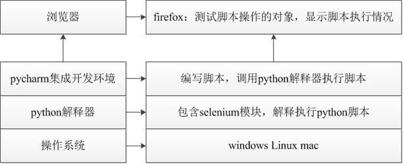

# 自动化测试

### WebDriverAPI 支持的浏览器

```
1. Firefox （FirefoxDriver）【推荐-本阶段学习使用】
2. IE（InternetExplorerDriver）
3. Opera（OperaDriver）
4. Chrome （ChromeDriver）
5. safari（SafariDriver）
6. HtmlUnit (HtmlUnit Driver)
```


```
1. 自动化测试概念
2. WebDriver-定位元素
3. WebDriver-操作元素
```


```
ndows系统（在这里我们以Windows7为案例）需要安装的工具
1. Python 3.5（以上版本）    --- python解释器      --- 用于解释执行python脚本
2. 安装selenium包            --- selenium库      --- 提供了众多的api用于实现对web页面的操作
3. 浏览器                   --- 测试对象          --- 是web测试脚本的操作对象
4. 安装PyCharm              --- 集成开发环境      --- 用于编辑、执行python脚本
```


!


#### 4.1 selenium 安装、卸载、查看命令

```
安装：pip install selenium==2.48.0
      1). pip:通用的 Python 包管理工具。提供了对 Python 包的查找、下载、安装、卸载的功能。 
      2). install: 安装命令
      3). selenium==2.48.0: 指定安装selenium2.48.0版本（如果不指定版本默认为最新版本）
卸载：pip uninstall selenium
查看：pip show selenium
```


#### 4.5 浏览器-总结

各个驱动下载地址： http://www.seleniumhq.org/download/

```
1. 浏览器的版本和驱动版本要一致！ 
        （如果是32bit浏览器而Driver是64bit则会导致脚本运行失败！）
2. 浏览器驱动下载好后需要添加Path环境便令中，或者直接放到Python安装目录，因为Python以添加到Path中
3. 推荐使用火狐浏览器
```


# WebDriver-元素定位

------

## 目标

```
1. 了解元素各种定位方法
2. 掌握id、name、class_name、tag_name、link_text、partial_link_text定位的使用
```


## 2. WebDriver 元素定位方式

```
1. id
2. name
3. class_name
4. tag_name
5. link_text
6. partial_link_text
7. Xpath
8. Css
```


### 定位方式分类-汇总：

```
1). id、name、class_name：为元素属性定位
2). tag_name：为元素标签名称
3). link_text、partial_link_text：为超链接定位(a标签)
4). Xpath：为元素路径定位
5). Css：为CSS选择器定位
```


#### id定位方法

```
find_element_by_id()
```

#### id定位实现 步骤分析

```
1. 导入selenium包 --> from selenium import webdriver
2. 导入time包 --> from time import sleep
3. 实例化火狐浏览器 --> driver=webdriver.Firefox()
4. 打开注册A.html --> driver.get(url)
5. 调用id定位方法 --> driver.find_element_by_id("")
6. 使用send_keys()方法发送数据 --> .send_keys("admin")
7. 暂停3秒 --> sleep(3)
8. 关闭浏览器 --> quit()
```

#### id定位 案例-1代码：

```
from selenium import webdriver
from time import sleep
driver=webdriver.Firefox()
url='E:\\测试\\课件\\Web自动化\\Web自动化课件\\02img\\注册A.html'
driver.get(url)
user=driver.find_element_by_id("userA")
user.send_keys("admin")
pwd=driver.find_element_by_id("passwordA")
pwd.send_keys("123456")
sleep(3)
driver.quit()
```

#### id定位-总结

```
1. 导包
2. url中\\转义
3. id定位方法
3. 发送内容方法
4. 暂停方法
5. 关闭浏览器
```

------

### 2.2 name定位

```
说明：HTML规定name属性来指定元素名称，因此它的作用更像人名，name的属性值在当前文档中可以不是唯一的
      ，name定位就是根据元素name属性来定位
前提：元素有name属性

实现案例-1需求：
    1). 打开注册A.html页面，使用name定位，自动填写(账号A：admin、密码A:123456)
    2). 填写完毕后，3秒钟关闭浏览器窗口            
```

#### name定位方法

```
find_element_by_name()
```

#### name定位实现 步骤分析

```
1. 参考id定位
```

### 2.3 class_name定位

```
说明：HTML规定了class来指定元素的类名，用法和name、id类似；
前提：元素有class属性

实现案例-1需求：
    通过class_name定位电话号码A，并发送18611111111            
```

#### class_name定位方法

```
find_element_by_class_name()
```

#### class_name定位实现 步骤分析

```
1. 参考id定位
```

### 2.4 tag_name定位

```
说明：HTML本质就是由不同的tag(标签)组成，而每个tag都是指同一类，所以tag定位效率低，
      一般不建议使用；tag_name定位就是通过标签名来定位；
实现案例-1需求：
    1). 打开注册A.html页面，使用tag_name定位，自动填写(账号A：admin)
    2). 填写完毕后，3秒钟关闭浏览器窗口
```

#### tag_name定位方法

```
1. find_element_by_tag_name()
        返回：符合条件的第一个标签
2. 如何获取第二个元素？稍后(2.7节)讲解
```

#### tag_name定位实现 步骤分析

```
1. 参考id定位
```

### 2.5 link_text定位

```
说明：link_text定位与前面4个定位有所不同，它专门用来定位超链接文本（<a>标签</a>）。

实现案例-1需求：
    1). 打开注册A.html页面，使用link_text定位(访问 新浪 网站)超链接
    2). 3秒钟关闭浏览器窗口    
```

#### link_text定位方法

```
1. 方法：find_element_by_link_text()    
2. 说明：需要传入a标签全部文本(访问 新浪 网站)    
```

#### link_text 步骤分析

```
1. 参考id定位
2. 点击 --> click()
```

### 2.6 partial_link_text定位

```
说明：partial_link_text定位是对link_text定位的补充，partial_like_text为模糊匹配；link_text全部匹配

实现案例-1需求：
    1). 打开注册A.html页面，使用partial_link_text定位(访问 新浪 网站)超链接
    2). 3秒钟关闭浏览器窗口    
```

#### partial_link_text定位方法

```
1. 方法：find_element_by_partial_link_text()    
2. 说明：需要传入a标签局部文本-能表达唯一性(访问 新浪 网站)
```

#### partial_link_text 步骤分析

```
1. 参考link_text定位
```

### 提示

```
在我们学习使用以上方法的时候，发现有个共同的相似方法：
```


#### 2.7 find_element[s]_by_XXX()

```
作用：
    1). 查找定位所有符合条件的元素
    2). 返回的定位元素格式为数组(列表)格式；
说明：
    1). 列表数据格式的读取需要指定下标(下标从0开始)
```

#### 操作(2.4 tag_name)

```
说明：使用tag_name获取第二个元素(密码框)

代码：
    ...
    driver.find_elements_by_tag_name("input")[1].send_keys("123456")
    ...
```

------

## 3. 2.1-2.6定位 总结

```
1. id、name、class_name
2. tag_name
3. link_text、partial_link_text
4. find_elements_by_XXX()
```

------

## 思考？

```
1. 在实际项目中标签没有id、name、class属性改如何定位？
2. id、name、class属性值为动态获取，随着刷新或加载而变化，改如何定位？
```

## 目标

```
1. 熟悉Xpath定位策略
2. 熟悉CSS定位策略
```

------

# 为什么要学习XPath、CSS定位？

```
1. 在实际项目中标签没有id、name、class属性
2. id、name、class属性值为动态获取，随着刷新或加载而变化    
```

------

## 1. 什么是Xpath？

```
1. XPath即为XML Path 的简称，它是一种用来确定XML/HTML文档中某部分位置的语言。
2. HTML可以看做是XML的一种实现，所以Selenium用户可以使用这种强大的语言在Web应用中定位元素。

Xpath用途：
基于HTML文档结构使用XPath进行元素定位

提示：Xpath为强大的语言，那是因为它有非常灵活定位策略；
```

### 思考

```
Xpath有那些策略呢？
```

## 2. HTML文档结构

```
1. HTML DOM
    HTML DOM（HTML document object model）：HTML文档对象模型，定义了访问和操作HTML文件的标准。
    DOM 定义了访问 HTML 和 XML 文档的标准：
    “W3C 文档对象模型 （DOM） 是中立于平台和语言的接口，它允许程序和脚本动态地访问和更新文档的内容、结构和样式。”
2. HTML DOM特点
    HTML DOM 是：
    HTML 的标准对象模型 
    HTML 的标准编程接口 
HTML DOM 定义了所有 HTML 元素的对象和属性，以及访问它们的方法。换言之，HTML DOM 是关于如何获取、修改、添加或删除 HTML 元素的标准。

在 HTML DOM 中，所有事物都是节点。DOM 是被视为节点树的 HTML。
根据 W3C 的 HTML DOM 标准，HTML 文档中的所有内容都是节点：
    1). 整个文档是一个文档节点 
    2). 每个 HTML元素是元素节点 
    3). HTML元素内的文本是文本节点 
    4). 每个 HTML 属性是属性节点 
    5). 注释是注释节点 
DOM的说明：
    1. 将HTML中所有内容均看待成节点
    2. 将所有节点按照层次结构组织成一棵树
    从DOM树的根节点开始描绘出一条通往指定节点的路径，该路径信息称作为指定节点的Xpath路径。
```

### HTML DOM范例

```
<html>
 <head>
     <title>DOM 介绍</title>
 </head> 
<body> 
    <h1>DOM 结构</h1> 
    <p>Hello world!</p> 
    <a href=“#”>link text</a>
</body> 
</html> 

范例文档对应的DOM结构：
```


## 3. Xpath定位策略(方式)

```
1. 路径-定位
    1). 绝对路径
    2). 相对路径 
2. 利用元素属性-定位
3. 层级与属性结合-定位
4. 属性与逻辑结合-定位
```

### Xpath定位 方法

```
driver.find_element_by_xpath()
```

### 3.1 路径(绝对路径、相对路径)

```
绝对路径：从最外层元素到指定元素之间所有经过元素层级路径 ；如:/html/body/div/p[2]
          提示：
              1). 绝对路径以/开始
              2). 使用Firebug可以快速生成，元素XPath绝对路径

相对路径：从第一个符合条件元素开始(一般配合属性来区分)；如：//input[@id='kw']
          提示：
              1). 相对路径以//开始
              2). 使用Friebug扩展插件FirePaht可快速生成，元素相对路径
```

### 使用Xpath实现 案例-1

```
需求：
    1). 使用绝对路径和相对路径分别实现，账号A：admin;密码A：123456；自动化脚本设计
```

### 3.2 利用元素属性

```
说明：快速定位元素，利用元素唯一属性；
示例：//*[@id='userA']    
```

### 3.3 层级与属性结合

```
说明：要找的元素没有属性，但是它的父级有；
示例：//*[@id='p1']/input
```

### 3.4 属性与逻辑结合

```
说明：解决元素之间个相同属性重名问题
示例：//*[@id='telA' and @class='telA']
```

### 3.5 Xpath-延伸

```
//*[text()="xxx"]                            文本内容是xxx的元素

//*[starts-with(@attribute,'xxx')]                属性以xxx开头的元素

//*[contains(@attribute,'Sxxx')]                属性中含有xxx的元素
```

### 练习

```
用尽可能多的方法编写xpath路径定位css_example.html文件元素：
    1. div1标签
    2. div1中p1的a标签        
    3. 最后一个a标签
```

### 3.6 Xpath-总结

```
1. 如何通过Friebug快速生成绝对路径
2. 如果通过Friebug快速生成相对路径
3. Xpath策略有那些
```

------

## 3. CSS定位

### 3.1 什么是CSS？

```
CSS 中选择器是一种模式，用于选择需要添加样式的元素。计算机能够通过CSS选择器定位到相应元素，我们在编写自动化测试脚本时是在不断地找到CSS选择器对应的元素。
CSS中通过各种选择器选择不同的页面元素，完成了颜色、字体、宽高等的设定，既然可以通过CSS选择器完成元素选择及样式设定，则也可利用CSS选择器的规则完成自动化测试脚本中的元素定位。
1. CSS（Cascading Style Sheets）是一种语言，它用来描述HTML和XML的元素显示样式；
   (css语言书写两个格式：
                           1. 写在HTML语言中<style type="text/css">...    
                           2. 写在单独文件中 后缀.css
       )
2. 而在CSS语言中有CSS选择器(不同的策略选择元素)，在Selenium中也可以使用这种选择器；
提示：
    1. 在selenium中极力推荐CSS定位，因为它比XPath定位速度要快
    2. css选择器语法非常强大，在这里我们只学习在测试中常用的几个
```

#### CSS定位 方法

```
driver.find_element_by_css_selector()
```

### 3.2 CSS定位常用策略 (方式)

```
1. id选择器
2. class选择器
3. 元素选择器
4. 属性选择器
5. 层级选择器
```

### 使用CSS实现 案例-2

```
需求：
    1). 使用CSSid定位实现，账号A：admin;密码A：123456；自动化脚本设计
```

#### 通过伪类名、id、标签名定位


#### class选择器

```
说明：根据元素class属性来选择
格式：.class 如：.telA <选择class属性值为telA的所有元素>
```

#### 元素选择器

```
说明：根据元素的标签名选择
格式：element 如：input <选择所有input元素>
```

#### 属性选择器

```
说明：根据元素的属性名和值来选择
格式：[attribute=value] 如：[type="password"] <选择所有type属性值为password的值>
```

#### 层级选择器

```
说明：根据元素的父子关系来选择
格式：element>element 如：p>input <返回所有p元素下所有的input元素>
提示：> 可以用空格代替 如：p input 或者 p [type='password']
```

#### 通过元素之前嵌套关系


#### 通过属性

 

#### 通过父子关系


#### 元素状态


#### 3.3 练习

```
1. 在百度首页通过css的标签定位方式定位input标签，并且证明首个input标签是name属性值为ie的标签。
2. 使用css定位方式依次访问sample_test.html中的元素
    1. div1使用id定位方式
    2. div1中p1的a标签采用层级定位方式（多层级定位）
    3. 最后一个a标签应该采用何种定位方式？（无特定属性）
```

### 3.4 CSS总结

| 选择器            | 例子              | 描述                                    |
| ----------------- | ----------------- | --------------------------------------- |
| #id               | #userA            | id选择器，选择id="userA"的所有元素      |
| .class            | .telA             | class选择器，选择class="telA"的所有元素 |
| element           | input             | 选择所有input元素                       |
| [attribute=value] | [type="password"] | 选择type="password"的所有元素           |
| element>element   | p>input           | 选择所有父元素为p元素的input元素        |

------

## 4. XPath与CSS类似功能对比

| 定位方式 | XPath                                                        | CSS                                                         |
| -------- | ------------------------------------------------------------ | ----------------------------------------------------------- |
| 元素名   | //input                                                      | input                                                       |
| id       | //input[@id='userA']                                         | #userA                                                      |
| class    | //*[@class='telA']                                           | .telA                                                       |
| 属性     | 1. //※[text()="xxx"] 2. //※[starts-with(@attribute,'xxx')] 3. //※[contains(@attribute,'xxx')] | 1. input[type^='p'] 2. input[type$='d'] 3. input[type*='w'] |

```
说明：由于显示排版原因以上所有(※)号代替(*)
```

## 5. 八种元素定位总结：

```
1. id
2. name
3. class_name
4. tag_name
5. link_text
6. partial_link_text
7. Xpath
8. Css

说明：
    1). 元素定位我们就学到这里了
    2). WebDriver除了提供以上定位API方法(driver.find_element_by_xxx())
        外，还提供了另外一套写法；
    3). 调用find_element()方法，通过By来声明定位的方法，并且传入对应的方法和参数（了解-熟悉即可）
```

------

## 6. 定位(另一种写法)-延伸【了解】

```
说明：第二种方法使用By类的封装的方法,所以需要导入By类包
```

### 6.1 导入By类

```
导包：from selenium.webdriver.common.by import By
```

### 6.2 By类的方法

```
方法：find_element(By.ID,"userA") 
      备注：需要两个参数，第一个参数为定位的类型由By提供，第二个参数为定位的具体方式
示例：
    1. driver.find_element(By.CSS_SELECTOR,'#kw').send_keys("python")
    2. driver.find_element(By.XPATH,'//*[@id="kw"]').send_keys('python')
    3. driver.find_element(By.ID,"kw").send_keys("python")
    4. driver.find_element(By.NAME,"用户名标签name属性值").send_keys("123456")
    5. driver.find_element(By.CLASS_NAME,"用户名标签class属性值").send_keys("18611111111")
    6. driver.find_element(By.TAG_NAME,'input').send_keys("python")
    7. driver.find_element(By.LINK_TEXT,'hao123').click()
    8. driver.find_element(By.PARTIAL_LINK_TEXT,'hao').click()
```

### 6.3 find_element_by_xxx()和find_element() 区别

```
说明：通过查看find_element_by_id底层实现方法，发现底层也是调用的By类方法进行的封装；

    def find_element_by_id(self, id_):
    """Finds an element by id.

    :Args:
     - id\_ - The id of the element to be found.

    :Usage:
        driver.find_element_by_id('foo')
    """
    return self.find_element(by=By.ID, value=id_)

总结：虽然方法一样，但WebDriver推荐 find_element_by_xxx()这种方法
```

### 练习

```
1. 在百度首页定位一组input标签并且找出”type”属性不是”hidden”的标签。
2. 操作斗鱼页面
    验证经过点击“下一页”确实由第一页切换到了第二页(用xpath规则完成)
3. 将八种元素定位方式封装为一个功能函数，定义为一个模块
    以课程演示的范例作为应用访问该模块，完成元素定位及操作
    也可以将八个小的范例也定义为函数分别完成调用
4. 获取58“个人房源”元素列表并显示房屋链接文本。
5. 附加：
    跟踪find_element_by_xxx()方法：
        1). 该方法使用了哪一个下级方法
        2). class、tag_name、id定位方式在find_element_by_xxx()的下级方法中是使用了哪种定位方式？


总结：虽然方法一样，但WebDriver推荐 find_element_by_xxx()这种方法
```


## 目标

```
1. 掌握WebDriver常用的元素操作方法
2. 掌握WebDriver常用的操作浏览器方法
```

------

## 1. 为什么要学习操作元素的方法？

```
1. 需要让脚本模拟用户给浏览器指定元素输入值
2. 需要让脚本模拟人为删除元素的内容
3. 需要让脚本模拟点击按钮    
```

## 2. 元素常用操作方法

```
1. clear()            清除文本
2. send_keys()        模拟输入
3. click()            单击元素

说明：由于这三个方法非常简单，并且有些之前已经使用过，所以在这里用一个案例一起来讲解
```

### 2.1 案例-1 用户注册A

```
需求：
    1. 通过脚本执行输入 用户名：admin；密码：123456；电话号码：18611111111；电子邮件：123@qq.com;
    2. 间隔3秒后，修改电话号码为：18600000000
    3. 间隔3秒，点击注册用户A
    4. 间隔3秒，关闭浏览器
    5. 元素定位方法不限
```

### 2.2 案例-1 实现步骤难点分析：

```
1. 间隔3秒 --> sleep(3)
2. 修改电话号码，先清除在输入新的号码； 清除  --> clear()
3. 点击按钮  --> click()
```

### 问题

```
1. 脚本启动浏览器窗口大小默认不是全屏？
2. 脚本执行结束如何关闭浏览器？
```

------

## 3. 浏览器常用方法

```
说明：主要了解通过WebDriver操作浏览器的常用方法
```

### 3.1 WebDriver操作浏览器常用方法

```
1. maximize_window()                最大化 --> 模拟浏览器最大化按钮
2. set_window_size(100,100)            浏览器大小 --> 设置浏览器宽、高(像素点)
3. set_window_position(300,200)     浏览器位置 --> 设置浏览器位置
4. back()                             后退 --> 模拟浏览器后退按钮
5. forward()                         前进 --> 模拟浏览器前进按钮
6. refresh()                         刷新 --> 模拟浏览器F5刷新
7. close()                            关闭 --> 模拟浏览器关闭按钮(关闭单个窗口)
8. quit()                            关闭 --> 关闭所有WebDriver启动的窗口
```

### 3.2 WebDriver 操作浏览器方式-总结

```
# 最大化浏览器
driver.maximize_window()
# 刷新
driver.refresh()
# 后退
driver.back()
# 前进
driver.forward()
# 设置浏览器大小
driver.set_window_size(300,300)
# 设置浏览器位置
driver.set_window_position(300,200)
# 关闭浏览器单个窗口
driver.close()
# 关闭浏览器所有窗口
driver.quit()
```

## 4. WebDriver 其他常用的方法

### 4.1 为什么要学习WebDriver其他方法？

```
1. 如何获取元素大小？
2. 如果获取元素的文本？
3. 如何获取元素属性值？
4. 如果让程序判断元素是否为可见状态？

我们想解决以上问题，就需要学习WebDriver封装其他操纵元素的方法
```

### 4.2 WebDriver其他常用方法

```
1. size                 返回元素大小
2. text                 获取元素的文本
3. title                 获取页面title
4. current_url            获取当前页面URL
5. get_attribute("xxx") 获取属性值;xxx：要获取的属性
6. is_display()            判断元素是否可见
7. is_enabled()            判断元素是否可用

提示：
    1. size、text、title、current_url：为属性，调用时无括号；如：xxx.size
    2. title、current_url：使用浏览器实例化对象直接调用；    如： driver.title
```

### 4.3 WebDriver其他常用方法 总结

```
....
# 获取用户名文本框大小
size=driver.find_element_by_id("userA").size
print('size:',size)
# 获取a标签内容
text=driver.find_element_by_id("fwA").text
print('a标签text:',text)
# 获取title
title=driver.title
print('title:',title)
# 获取当前页面url
url=driver.current_url
print('url:',url)
# 获取a标签href属性值
href=driver.find_element_by_id("fwA").get_attribute("href")
print('href属性值为:',href)
# 判断span是否显示
display=driver.find_element_by_css_selector('span').is_displayed()
print('span标签是否显示：',display)
# 判断取消按钮是否可用
enabled=driver.find_element_by_id('cancelA').is_enabled()
print('取消按钮是否可用：',enabled)

执行结果：
size: {'height': 30, 'width': 163}
a标签text: 访问 新浪 网站
title: 注册A
url: file:///E:/%E6%B5%8B%E8%AF%95/%E8%AF%BE%E4%BB%B6/Web%E8%87%AA%E5%8A%A8%E5%8C%96/Web%E8%87%AA%E5%8A%A8%E5%8C%96%E8%AF%BE%E4%BB%B6/02img/%E6%B3%A8%E5%86%8CA.html
href属性值为: http://www.sina.com.cn/
span标签是否显示： False
取消按钮是否可用： False
```


## 目标

```
1. 了解WebDriver操作鼠标方法
2. 了解WebDriver操作键盘方法
```

------

### 1. 鼠标事件

```
说明：WebDriver库对模拟鼠标操作封装的一些方法，此知识点作为了解
```

#### 1.1 WebDriver为什么要操作鼠标？

```
说明：现在Web产品中提供了丰富的鼠标交互方式，如：双击、悬停、拖拽等功能，做为Web产品测试框架，需要
      应对这些Web产品应用场景，所以在WebDriver类库中封装了相应的鼠标交互方法。

疑问: WebDriver提供了那些操作鼠标事件的方法？
```

#### 1.2 WebDriver操作鼠标方法

```
说明：在WebDriver中将操作鼠标的方法封装在ActionChains类中

1. context_click()            右击 --> 此方法模拟鼠标右键点击效果
2. double_click()            双击 --> 此方法模拟双标双击效果
3. drag_and_drop()            拖动 --> 此方法模拟双标拖动效果
4. move_to_element()        悬停 --> 此方法模拟鼠标悬停效果
5. perform()                执行 --> 此方法用来执行以上所有鼠标方法

为了更好的学习其他方法，我们先学习perform()执行方法,因为所有的方法都需要执行才能生效
```

#### 1.3 鼠标执行-perform()

```
说明：在ActionChains类中所有提供的鼠标事件方法，在调用的时候所有的行为都存储在ActionChains类中，
      而perform()方法就是执行所有ActionChains中的行为

提示：必须调用perform()方法才能执行鼠标事件
```

#### 1.4 鼠标右键-context_click()

```
说明：在ActionChains类中的鼠标右键方法是个已知的bug，因为它能点击右键出现菜单，但无法选择右键菜单选
      项，因此方法了解即可

需求：
    案例-1注册页面A,在用户名文本框上点击鼠标右键
```

##### 代码实现关键点分析

```
1. 导包：from selenium.webdriver.common.action_chains import ActionChains
2. 实例化ActionChains对象：Action=ActionChains(driver)
3. 调用右键方法：element=Action.context_click(username)
4. 执行：element.perform()
```

#### 1.5 鼠标双击-double_click()

```
说明：模拟双击鼠标左键操作

需求：
    案例-1注册页面A，给用户名设置为admin,暂停3秒钟后双击鼠标左键，选中admin；
```

##### 代码实现关键点分析

```
1. 导包...
2. 实例化...
3. 调用双击方法：element=Action.double_click(username)
4. 执行...
```

#### 1.6 鼠标拖动-drag_and_drop()

```
说明：模拟鼠标拖动动作，选定拖动源元素释放到目标元素
```

##### 拖动关键点分析

```
1. 源元素   socure=driver.find_element_by_id(xxx)
2. 目标元素 target=driver.find_element_by_id(xxx)
3. 调用方法 Action.drag_and_drop(source,target).perform()
```

#### 1.7 鼠标悬停-move_to_element()

```
说明: 模拟鼠标悬停在选中的元素

需求：
    案例-1注册页面A，将模拟鼠标悬停 用户注册A 按钮，显示加入会员A提示
```

##### 代码实现关键点分析

```
1. 导包...
2. 实例化...
3. 调用悬停方法：Action.move_to_element(element).perform()
```

#### 1.8 鼠标操作 总结

```
1. 以上鼠标操作方法作为了解知识；
2. 建议掌握悬停方法
```

------

### 2. 键盘操作

```
说明：
    1). 模拟键盘上一些按键或者组合键的输入 如：Ctrl+C 、Ctrl+V；
    2). WebDriver中对键盘的操作都封装在Keys类中
```

#### 2.1 Keys类

```
导包：from selenium.webdriver.common.keys import Keys
```

#### 2.2 常用的键盘操作

```
1. send_keys(Keys.BACK_SPACE)删除键（BackSpace） 
2. send_keys(Keys.SPACE)空格键(Space) 
3. send_keys(Keys.TAB)制表键(Tab) 
4. send_keys(Keys.ESCAPE)回退键（Esc） 
5. send_keys(Keys.ENTER)回车键（Enter） 
6. send_keys(Keys.CONTROL,'a') 全选（Ctrl+A） 
7. send_keys(Keys.CONTROL,'c')复制（Ctrl+C）

提示：以上方法就不一个一个讲解了，因为调用方法都一样；
```

#### 2.3 案例-1 注册页面A

```
需求：
    1). 输入用户名：admin1，暂停2秒 删除1
    2). 全选用户名：admin      暂停2秒
    3). 复制用户名：admin      暂停2秒
    4). 粘贴到密码框          暂停2秒
    5). 关闭浏览器
```

#### 2.4 案例-1 方法示例

```
# 定位用户名
element=driver.find_element_by_id("userA")
# 输入用户名
element.send_keys("admin1")
# 删除1
element.send_keys(Keys.BACK_SPACE)
# 全选
element.send_keys(Keys.CONTROL,'a')
# 复制
element.send_keys(Keys.CONTROL,'c')
# 粘贴
driver.find_element_by_id('passwordA').send_keys(Keys.CONTROL,'v')
```

### 3. 鼠标、键盘-总结

```
1. ActionChains作用和位置
2. 鼠标悬停方法
3. Keys类 位置
4. 键盘操作调用方法
```


## 目标

```
1. 了解元素显式等待
2. 掌握元素隐式等待
```

------

## 1. 元素等待

### 1.1 什么是元素等待？

```
概念：WebDriver定位页面元素时如果未找到，会在指定时间内一直等待的过程；
```

### 1.2 为什么要设置元素等待？

```
1. 由于网络速度原因
2. 电脑配置原因
3. 服务器处理请求原因

WebDriver元素等待有几种类型呢？
```

### 1.3 元素等待类型

```
1. 显式等待
2. 隐式等待
```

------

## 2. 显式等待【了解】

```
概念：使WebDriver等待指定元素条件成立时继续执行，否则在达到最大时长时抛出超时异常(TimeoutException)

提示：
    1). 在WebDriver中把显式等待的相关方法封装在WebDriverWait类中
    2). 等待是判定条件成立时，那如何判断条件成立？相关判断的方法封装在expected_conditions类中
```

### 2.1 案例-1 注册页面A

```
需求：
    1. 如果用户名文本框存在，就输入admin
```

### 2.2 实现难点分析

```
1. 导包 等待类         --> from selenium.webdriver.support.wait import WebDriverWait
2. 导包 判断条件     --> from selenium.webdriver.support import expected_conditions as EC
                        (将expected_conditions 通过as关键字起个别名：EC)
3. WebDriverWait(driver, timeout, poll_frequency=0.5)
        1). driver：浏览器对象
        2). timeout：超时的时长，单位：秒
        3). poll_frequency：检测间隔时间，默认为0.5秒
4. 调用方法 until(method)：直到..时
        1). method：调用EC.presence_of_element_located(element)
                    element：调用By类方法进行定位
```

### 2.3 案例-1 代码示例

```
from selenium import webdriver
from selenium.webdriver.common.by import By
from selenium.webdriver.support import expected_conditions as EC
from selenium.webdriver.support.wait import WebDriverWait
url = r'E:\测试\课件\Web自动化\Web自动化课件\02img\注册A.html'
driver = webdriver.Firefox()
driver.get(url)
element = WebDriverWait(driver, 5).until(EC.presence_of_element_located((By.ID, 'userA')))
element.send_keys("admin")
```

## 3. 隐式等待【掌握】

```
说明：等待元素加载指定的时长，超出抛出NoSuchElementException异常，实际工作中，一般都使用隐式等待；

显式与隐式区别：
    1. 作用域：显式等待为单个元素有效，隐式为全局元素
    2. 方法：显式等待方法封装在WebDriverWait类中，而隐式等待则直接通过浏览器实例化对象调用
```

### 3.1 隐式等待调用方法

```
方法：implicitly_wait(timeout)
      (timeout：为等待最大时长，单位：秒)

调用：driver.implicitly_wait(10)
      (driver：为浏览器实例化对象名称)
```

### 3.2 隐式等待执行-说明

```
如果定位某一元素定位失败，那么就会触发隐式等待有效时长，如果在指定时长内加载完毕，则继续执行，否则
抛出NoSuchElementException异常，如果元素在第一次就定位到则不会触发隐式等待时长；
```

------

## 4. 元素等待-总结

```
1. 为什么要设置元素等待
2. 显式等待与隐式等待区别
3. 掌握隐式等待
```


## 目标

```
1. 掌握下拉选择框的操作方法
2. 掌握处理警告框的方法
3. 掌握调用JavaScript方法
```

------

## 1. 什么是下拉选择框

```
说明：下拉框就是HTML中<select>元素；
```

### 1.1 为什么学习下拉选择框？

#### 需求：

```
案例-1 注册页面A，城市选项-暂停2秒后选择上海A，暂停2秒后选择重庆，暂停2秒后选择广州
```

#### 案例-1 实现方式

```
1. 定位option选项
2. 定位方式不限
```

#### 问题

```
1. 经过刚才代码演示，只能定位根据option选项的值来判断；
2. 如果有多个选项原有的定位方式处理起来比较繁琐；
```

### 1.2 Select类

```
说明：Select类是WebDriver为解决select标签定位诞生的，此类定位的是select标签

select类有哪些方法？
```

#### select方法：

```
1. select_by_index()                --> 根据option索引来定位，从0开始
2. select_by_value()                --> 根据option属性 value值来定位
3. select_by_visible_text()            --> 根据option显示文本来定位
```

### 1.3 Select类实现 步骤分析：

```
1. 导包 Select类 --> from selenium.webdriver.support.select import Select
2. 实例化Select类 select=Select(WebElemet)
                    (WebElement):driver.find_element_by_id("selectA"))
3. 调用方法：select.select_by_index(index)
                (index：为列表索引，从0开始)
```

### 1.4 Select实现代码 总结

```
#导包
from selenium.webdriver.support.select import Select
...
# 1. 根据索引实现
select.select_by_index(1)
select.select_by_index(3)
select.select_by_index(2)
# 2. 根据文本值实现
select.select_by_visible_text("A上海")
select.select_by_visible_text("A重庆")
select.select_by_visible_text("A广州")
# 3. 根据value属性实现
select.select_by_value("sh")
select.select_by_value("cq")
select.select_by_value("gz")
...
```

------

### 需求

```
对案例-1 注册页面A，首先点击alerta按钮，其次输入用户名：admin
```

#### 问题

```
1. 按钮被点击后弹出对话框，而接下来输入用户名的语句没有生效
```

------

## 2. 警告框处理

```
说明：WebDriver中对处理警告框的操作，有专用的处理方法；

提示：
    HTML中常用的对话框有三种，处理的方法都一样
        1). alert
        2). confirm
        3). prompt
```

### 2.1 警告框处理方法

```
1. text                 --> 返回alert/confirm/prompt中的文字信息
2. accept()                --> 接受对话框选项
3. dismiss()            --> 取消对话框选项
```

### 2.2 调用方法

```
1. 获取警告框 
        alert=driver.switch_to.alert
2. 调用
        alert.text
        alert.accept()
        alert.dismiss()
```

### 2.3 处理警告框-总结

```
...
# 定位alerta按钮
driver.find_element_by_id("alerta").click()
# 获取警告框
alert=driver.switch_to.alert
# 打印警告框文本
print(alert.text)
# 接受警告框
alert.accept()
# 取消警告框
#alert.dismiss()
...
```

------

## 3. 滚动条操作

```
说明：WebDriver类库中并没有直接提供对滚动条进行操作方法，但是它提供了可调用JavaScript脚本的方法，所
      以我们可以通过JavaScript脚本来达到操作滚动条的目的；

备注：
    1). 滚动条：一种可控制程序显示范围的组件
    2). JavaScript：一种流行脚本语言，可以操作HTML标签；
            JavaScript学习资料：http://www.w3school.com.cn/js/js_intro.asp
```

### 3.1 为什么要学习滚动条操作？

```
1. 在HTML页面中，由于前端技术框架的原因，页面元素为动态显示，元素根据滚动条的下拉而被加载
2. 页面注册同意条款，需要滚动条到最底层，才能点击同意
```

#### 需求

```
案例-1 注册页面A，打开页面2秒后，滚动条拉倒最底层
```

#### 需求实现分析：

```
1. 设置JavaScritp脚本控制滚动条  js="window.scrollTo(0,1000)"
                                    (0:左边距；1000：上边距；单位像素)
2. WebDriver调用js脚本方法  driver.execute_script(js)
```

### 3.2 控制滚动条实现代码

```
...
# 最底层
js1="window.scrollTo(0,1000)"
# 最顶层
js2="window.scrollTo(0,0)"
# 执行最底层
driver.execute_script(js1)
# 执行最顶层
driver.execute_script(js2)
...
```

### 3.3 滚动条总结

```
1. WebDriver控制滚动方法
2. JavaScript控制滚动条语句

备注：js控制滚动条语句有很多种，如：js=document.documentElement.scrollTop=1000;但是推荐使用JS调用
      window句柄去控制；
```

## 目标

```
1. 掌握WebDriver切换frame表单方法
2. 掌握WebDriver多窗口切换的技巧
```

------

## 1. frame表单

```
frame：HTML页面中的一种框架，主要作用是在当前页面中指定区域显示另一页面元素；
       (HTML语言中，frame/iframe标签为表单框架)
```

### 1.1 为什么要学习frame表单切换

```
需求：案例-2 注册实例.html
    1. 此页面有三个注册界面，先填写最上边注册信息，其次填写注册A页面注册信息，最后填写注册B页面信息
    2. 定位方式不限
```

#### 问题

```
1. 当前页面内无法定位注册页面A和注册页面B
```

### 1.2 frame表单切换

```
说明：在WebDriver类库中封装了HTML页面中使用frame表单框架技术定位的方法

方法：
    1). driver.switch_to.frame("myframe1")        -->    切换表单方法
            (myframe1：为frame表单的name或id)
    2). driver.switch_to.default_content()        --> 恢复默认页面方法
            (在frame表单中操作其他页面，必须先回到默认页面，才能进一步操作)
```

#### 操作原理

```
操作原理：
    1) html中的iframe标签提供了内联结构，使用内联结构可以在一个浏览器窗口显示多个页面。
    2) iframe标签是外层页面的标签，若想操作iframe框架内嵌的页面，需要先定位到iframe标签上。
    3) 通过switch_to.frame()切换到内层页面，再进行内层页面的操作。
    4) 内层页面的操作办法和普通页面的操作办法相同：元素定位、元素操作。
```

### 1.3 frame表单切换

```
说明：在WebDriver类库中封装了HTML页面中使用frame表单框架技术定位的方法
操作步骤：
    1) 定位到iframe标签。
    2) 完成切换。
        a)若iframe具有id属性，直接使用id属性值切换进内层页面
            driver.switch_to.frame(value)/driver.switch_to_frame(value)
        b) 定位到iframe元素，再切换进入
            el = driver.find_element_by_xxx(value)
            driver.switch_to.frame(el)    /driver.switch_to_frame(el)
注意：
    switch_to.frame()只能切换到当前页面内嵌的子级页面，若是多级页面的嵌套，需要依次在各页面中通过switch_to.frame()方法切换进入。

方法：
    1). driver.switch_to.frame("myframe1")        -->    切换表单方法
            (myframe1：为frame表单的name或id)
    2). driver.switch_to.default_content()        --> 恢复默认页面方法
            (在frame表单中操作其他页面，必须先回到默认页面，才能进一步操作)
```

### 1.4 frame表单切换--向外层切换

```
若目前操作焦点在内层页面，需要切换回外层页面：
1. 跳回最外层的页面
    driver.switch_to.default_content() -- 切换到最外层(对于多层页面，可通过该方法直接切换到最外层)
2. 跳回上层的页面
    driver.switch_to.parent_frame()   -- 进行向上的单层切换
```

 

### 1.5 案例-2解决方案

```
1. 完成当前页面注册信息；
2. 调用表单切换方法(switch_to.frame("myframe1"))切换到注册用户A表单中
3. 调用恢复默认页面方法(switch_to.default_content())
4. 调用表单切换方法(switch_to.frame("myframe2"))切换到注册用户B表单中
```

### 1.6 表单切换-总结

```
1. HTML中常用的表单框架
2. 切换表单方法
3. 为什么要恢复默认页面？
4. 恢复默认页面方法
```

------

## 2. 多窗口

```
说明：在HTML页面中，经常有a标签也就是超链接，这些链接在被执行时，有的会在新的窗口打开链接；
```

### 2.1 为什么要切换窗口？

#### 案例-2 注册实例.html

```
需求：
    1). 点击注册A页面链接，在打开的页面，填写A页面注册信息；
```

#### 问题

```
1). 无法定位注册A页面
```

### 2.2 多窗口切换

```
说明：在WebDriver中封装了获取当前窗口句柄方法和获取所有窗口句柄的方法以及切换指定句柄窗口的方法；
      （句柄：英文handle，窗口的唯一识别码）

方法：
    1). driver.current_window_handle         --> 获取当前窗口句柄
    2). driver.window_handles                 --> 获取所有窗口句柄
    3). driver.switch_to.window(handle)        --> 切换指定句柄窗口
```

### 2.3 案例-2 解决方案分析

```
1. 获取注册实例.html当前窗口句柄
2. 点击注册实例.html页面中注册A页面
3. 获取所有窗口句柄
4. 遍历判断窗口句柄并切换到注册A页面
5. 操作注册A页面元素，注册信息
```

### 2.4 多窗口切换-总结

```
1. 什么是句柄？
2. 获取当前窗口句柄方法
3. 获取所有窗口句柄方法
4. 切换指定句柄窗口方法
```


## 目标

```
1. 掌握WebDriver屏幕截图方法
2. 了解验证码处理的方式
```

------

## 1. 截图

```
说明：把当前操作页面，截图保存到指定位置
```

### 1.1 为什么要窗口截图？

```
说明：自动化脚本是由程序去执行的，因此有时候打印的错误信息并不是十分明确。如果在执行出错的时候对当前
      窗口截图保存，那么通过图片就可以非常直观地看到出错的原因。
```

### 1.2 窗口截图

```
说明：在WebDriver类库中，提供了截图方法，我们只需要调用即可；

方法：
    1). get_screenshot_as_file(imgpath)            --> 截取当前窗口
        (imgpath：图片保存路径)
```

### 1.3 案例-2 注册实例.html

```
需求：
    1. 填写注册A页面注册信息，填写完毕，截图保存；
```

### 1.4 案例2-解决方案步骤

```
1. 打开注册实例.html
2. 切换注册A页面frame表单         --> driver.switch_to.frame(myframe1)
3. 输入注册信息
4. 调用截屏方法                    --> driver.get_screenshot_as_file("../Image/Image01.jpg")
```

------

## 2. 验证码【了解】

```
说明：一种随机生成的信息（图片、数字、字母、汉字、算术题）等为了防止恶意的请求行为，增加应用的安全性。
```

### 2.1 为什么要学习验证码？

```
说明：在Web应用中，大部分系统在用户登陆的时候都要求输入验证码，而我们在设计自动化脚本时候，就需要面
      临这验证码的问题。
```

### 2.2 验证码的处理方式

```
说明：WebDriver类库中没有对验证码处理的方法，但是在这里可以叙说下针对验证码的几种常用处理方式；

方式：
    1). 去掉验证码
            (测试环境下-采用)
    2). 设置万能验证码
            (生产环境-采用)
    3). 验证码识别技术
            (通过Python-tesseract来识别图片类型验证码；识别率很难达到100%)
    4). 记录cookie
            (通过记录cookie进行登录-推荐)
```

#### 提示：

```
1. 去掉验证码、设置万能验证码：太简单都是开发来完成，我们在这里不做讲解
2. 验证码识别技术：成功率不高，验证码种类繁多，不太适合；
3. 记录cookie：比较实用，我们对它进行下讲解；
```

## 3. cookie

### 3.1 cookie是什么？


```
cookie：
    1. Cookie是一小段的文本信息；格式：python中的字典（键值对组成）
    2. Cookie产生：客户端请求服务器，如果服务器需要记录该用户状态，就向客户端浏览器颁发一个Cookie格式
    3. Cookie使用：当浏览器再请求该网站时，浏览器把请求的网址连同该Cookie一同提交给服务器，服务器检
       查该Cookie，以此来辨认用户状态。
```

### 3.2 为什么记录cookie？

```
说明：
    1. 用户第一次登陆时，勾选下次直接登陆或者记住密码，就是采用记录cookie实现的
    2. cookie内记录用户名和密码(加密)信息，只要请求时服务器收到cookie，就识别成功，默认为已登陆。
```

### 3.3 记录cookie

```
说明：
    1. WebDriver中对cookie操作提供相应的方法

方法：
    1. get_cookie(name)                    --> 获取指定cookie
       (name:为健名)
    2. get_cookies()                    --> 获取本网站所有本地cookies
    3. add_cookie(str)                    -->    添加cookie
       (str：为python中的字典格式)
```

#### 案例-3 访问百度

```
需求：
    1. 登陆百度，获取cookie
    2. 使用获取的cookie，在WebDriver中，添加Cookie，达到登陆目的
```

#### 案例3-实现步骤分析

```
1. 登陆baidu，登陆的时候抓取 (BAIDUID,BDUSS)
2. 使用add_cookie()方法，添加 (BAIDUID,BDUSS)键和值
3. 调用刷新方法 driver.refresh()
```

#### 3.4 代码示例

```
from selenium import webdriver
import time
driver=webdriver.Firefox()
driver.get("https://www.baidu.com")
driver.add_cookie({'name':'BAIDUID','value':'根据实际填写'})
driver.add_cookie({'name':'BDUSS','value':'根据实际填写'})
time.sleep(3)
driver.refresh()
time.sleep(3)
```

------

## 4. 窗口截屏、验证码总结

```
1. 截屏方法
2. 验证码常用的处理方式
3. Cookie的作用
```


## 目标

```
1. 掌握UnitTest框架的基础使用方法
```

------

## 1. UnitTest框架

### 1.1 什么是框架？

```
说明：
    1. 框架英文单词FrameWork；
    2. 为解决一类事情的功能集合；
```

### 1.2 什么是UnitTest框架？

```
概念：UnitTest框架是专门用来进行执行代码测试的框架；
```

### 1.3 为什么使用UnitTest框架？

```
1. 能够组织多个用例去执行
2. 提供丰富的断言方法
3. 提供丰富的日志与测试结果

提示：
    1). 断言知识点-在4.2章节会进行学习和讲解；
```

------

### 提示

```
在学习UnitTest框架之前，我们先了解下UnitTest框架内几个核心要素
```

## 2. UnitTest核心要素

```
1. TestCase
2. TestSuite
3. TextTestRunner
4. Fixture
```

### 2.1 TestCase

```
说明：(翻译：测试用例)一个TestCase就是一条测试用例；
使用：
    1. 导包：import unittest             --> 导入unitest框架
    2. 继承：unittest.TestCase             --> 新建测试类继承unittest.TestCase

提示：
    1). 测试用例：在自动化测试中，一条用例就是一个完整的测试流程；                
    2). 测试方法名称命名必须以test开头；
       (原因：unittest.TestCase类批量运行的方法是搜索执行test开头的方法)
```

### 2.2 TestSuite

```
说明：(翻译：测试套件)多条测试用例集合在一起，就是一个TestSuite；
使用：
    1. 实例化：     suite=unittest.TestSuite()                    
                 (suite：为TestSuite实例化的名称)
    2. 添加用例：suite.addTest(ClassName("MethodName"))    
                 (ClassName：为类名；MethodName：为方法名)

    3. 添加扩展：suite.addTest(unittest.makeSuite(ClassName))
                 (搜索指定ClassName内test开头的方法并添加到测试套件中)

提示：
    1). 一条测试用例(.py)内，多个方法也可以使用测试套件
    2). TestSuite需要配合TextTestRunner才能被执行
```

### 2.3 TextTestRunner

```
说明：(翻译：测试执行)是用来执行测试用例套件
使用：
    1. 实例化： runner=unittest.TextTestRunner()
                (runner：TextTestRunner实例化名称)
    2. 执行：    runner.run(suite)
                (suite：为测试套件名称)
```

### 2.4 Fixture

```
说明：是一个概述，对一个测试用例环境的搭建和销毁就是一个Fixture；
使用：
    1. 初始化(搭建)：def setUp(self)        --> 首先执行
       (setUp:此方法继承于unittest.TestCase)        
    2. 结束(销毁):    def tearDown(self)        --> 最后执行
       (tearDown:此方法继承于unittest.TestCase)
提示：
    1. 必须继承unittest.TestCase类，setUp、tearDown才是一个Fixture；
    2. setUp：一般做初始化工作，比如：实例化浏览器、浏览器最大化、隐式等待设置
    3. tearDown：一般做结束工作，比如：退出登录、关闭浏览器
    4. 如果一个测试类有多个test开头方法，则每个方法执行之前都会运行setUp、结束时运行tearDown
```

------

## 3. 案例-3

```
需求：使用UnitTest框架对iweb_shop项目测试
    1. 登陆进行测试
```

### 3.1 操作步骤分析：

```
1. 导包 import unittest
2. 新建测试类并继承unittest.TestCast
3. 新建一个Fixture(setUp、tearDown)
4. 新建登录方法
5. if __name__ == '__main__':
6. unittest.main()执行
```

### 3.2 总结-代码实现

```
import unittest
from time import sleep
from selenium import webdriver
class TestLoginOut(unittest.TestCase):
    def setUp(self):
        self.driver=webdriver.Firefox()
        url = "http://localhost/iwebshop/"
        self.driver.get(url)
        self.driver.implicitly_wait(10)
        self.driver.maximize_window()
        print("setUp")
    def test_login(self):
        driver=self.driver
        driver.find_element_by_link_text("登录").click()
        driver.find_element_by_css_selector("input[alt*='邮箱']").send_keys("admin")
        driver.find_element_by_css_selector("input[alt*='密码']").send_keys("123456")
        driver.find_element_by_css_selector(".submit_login").click()
        sleep(3)
        driver.find_element_by_css_selector(".reg").click()
    def tearDown(self):
        sleep(2)
        self.driver.quit()
        print("tearDown")
if __name__ == '__main__':
    # 调用main方法执行unitetest内所有test开头方法
    unittest.main()
```

## 需求

```
将test01.py..test10.py共10条用例，将这10条用例批量执行；
```

### 问题

```
1. 使用suite.addtest(unittest.makeSuite(className))导入10条测试类
2. .addtest()需要添加10次
```

## 4. defaultTestLoader

```
说明： 
    使用unittest.defaultTestLoader()类，通过该类下面的discover()方法自动搜索指定目录下指定开头
    的.py文件，并将查找到的测试用例组装到测试套件；

用法：
    test_dir = './'
    disconver = unittest.defaultTestLoader.discover(test_dir, pattern='iweb_*.py')
    (test_dir为要指定的目录 ./为当前目录；pattern：为查找的.py文件的格式 )
运行：
    runner=unittest.TextTestRunner()
    runner.run(disconver)
```

### 5.1 defaultTestLoader与TestSuite区别

```
1. TestSuite可以添加TestCase中所有test开头的方法和添加指定的test开头方法;
2. defaultTestLoader搜索指定目录下指定开头.py文件，并添加TestCase内所有test开头的方法，不能指定添加方法;

提示：defaultTestLoader属于TestSuite另一种实现方式；
```

## 6. 总结

```
1. UnitTest框架作用
2. 什么是Fixture
3. 要使用UnitTest框架必须继承？
4. TestSuite作用
5. 如何运行TestSuite
7. defaultTestLoader与TestSuite区别
```

## 回顾

```
 1.3 为什么使用UnitTest框架？    
    1. 能组织用例和执行用例
    2. 提供丰富的断言方法
    3. 提供丰富的日志与测试结果


1. UnitTest用例组织和执行用例方法我们基本就学完了
2. 接下来我们学习UnitTest框架的断言方法
```


## 目标

```
1. 理解什么是断言
2. 掌握断言assertEqual、assertIn方法
3. 了解UnitTest其他断言方法
```

------

## 1. UnitTest断言

### 1.1 什么是断言？

```
概念：让程序代替人为判断测试程序执行结果是否符合预期结果的过程
```

### 1.2 为什么要学习断言？

```
自动化脚本在执行的时候一般都是无人值守状态，我们不知道执行结果是否符合预期结果，所以我们需要让程序代替人
为检测程序执行的结果是否符合预期结果，这就需要使用断言；
```

### 1.3 UnitTest断言分类

```
1. 基本布尔型断言
2. 比较断言
3. 复杂断言

提示：
    1. 这里这介绍基本布尔类型断言
    2. 比较断言、复杂断言有兴趣的同学请参考4.4附件资料
```

#### 基本布尔型断言(掌握常用即可)

```
说明：结果只有True和False
```

| 序号 | 断言方法                             | 断言描述                                 |
| ---- | ------------------------------------ | ---------------------------------------- |
| 1    | assertEqual(arg1, arg2, msg=None)    | 验证arg1=arg2，不等则fail 【掌握】       |
| 2    | assertNotEqual(arg1, arg2, msg=None) | 验证arg1 != arg2, 相等则fail             |
| 3    | assertTrue(expr, msg=None)           | 验证expr是true，如果为false，则fail      |
| 4    | assertFalse(expr,msg=None)           | 验证expr是false，如果为true，则fail      |
| 5    | assertIsNone(expr, msg=None)         | 验证expr是None，不是则fail               |
| 6    | assertIsNotNone(expr, msg=None)      | 验证expr不是None，是则fail               |
| 7    | assertIn(arg1, arg2, msg=None)       | 验证arg1是arg2的子串，不是则fail【掌握】 |

### 1.4 案例

```
需求：
    1. iweb项目登陆，输入正确用户名和密码，断言登录成功的用户名是否为admin，如果断言失败截图保存

扩展：
    1. 图片名称为动态-时间
    2. 图片名称添加断言错误信息
```

### 实现步骤分析

```
1. 成功登陆
2. 获取登陆后的信息
3. 添加断言
```

### 断言主要代码：

```
...
    # 获取登陆信息
    text = self.driver.find_element_by_css_selector(".loginfo").text
    print("登陆成功信息为：",text)
    try:
        # 使用断言 判断text是否包含admin字符
        self.assertIn("admin",text)
    except AssertionError:
        driver.get_screenshot_as_file("../Image/02img.jpg")
        # 抛出异常
        raise
...
```

### 断言总结

```
1. 什么是断言？
2. 需要掌握哪个断言？
3. 断言异常类
4. 如何获取断言错误信息
5. 时间格式(年_月_日 时_分_秒)
```

------

### 回顾

```
 1.3 为什么使用UnitTest框架？    
    1. 能组织用例和执行用例
    2. 提供丰富的断言方法
    3. 提供丰富的日志与测试结果


1. UnitTest用例组织和执行用例 完成
2. 断言方法 完成
3. 接下来我们就学习生成测试结果-HTML报告的生成
```


# 自动化测试

### WebDriverAPI 支持的浏览器

```
1. Firefox （FirefoxDriver）【推荐-本阶段学习使用】
2. IE（InternetExplorerDriver）
3. Opera（OperaDriver）
4. Chrome （ChromeDriver）
5. safari（SafariDriver）
6. HtmlUnit (HtmlUnit Driver)
```


## 目标

```
1. 掌握如何生成HTML测试报告方法
```

------

## 1. 什么是HTML测试报告

```
说明：HTML测试报告就是执行完测试用例后以HTML(网页)方式将执行结果生成报告
```

### 1.1 为什么要生成测试报告

```
1. 测试报告是本次测试目的最终体现形态
2. 测试报告内包含了有关本次测试用例的详情
```

## 2. HTML生成报告方式

```
1. Export Test Results （UnitTest 自带）
2. HTMLTestRunner（第三方模板）【重点】
```

### 2.1 Export Test Results （自带）


#### 自带报告生成操作图


```
    提示：适合单条用例执行时使用
```

### 2.2 HTMLTestRunner【重点】


### 1.1 测试报告 生成步骤分析

[HTMLTestRunner.zip](../04img/HTMLTestRunner.zip)

```
1. 复制HTMLTestRunner.py文件到项目文件夹
2. 导入HTMLTestRunner、UnitTest包    
3. discover加载要执行的用例
      (discover=unittest.defaultTestLoader.discover(test_dir,pattern="test*.py"))
4. 设置报告生成路径和文件名
   (file_name=file_dir+nowtime+"Report.html")
5. 打开报告 with open(file_name,'wb') as f:
6. 实例化HTMLTestRunner对象：runner=HTMLTestRunner(stream=f,[title],[description])
    参数说明：
               (stream：文件流，打开写入报告的名称及写入编码格式)
               (
                       []，为可选；
                       title为报告标题，如XXX自动化测试报告
                       description：为说明；比如操作系统、浏览器等版本
               )
7. 执行：runner.run(discover)
```

### 1.2 实现代码

```
import time
from CodeEdit.LX04.Tools.HTMLTestRunner import HTMLTestRunner
import unittest
# 加载当前目录
test_dir='.'
# 加载当前目录下iweb开头的.py文件
discover=unittest.defaultTestLoader.discover(test_dir,pattern="test*.py")
if __name__ == '__main__':
    # 定义报告目录
    file_dir="../Report/"
    # 定义报告名称格式
    nowtime=time.strftime("%Y-%m-%d %H_%M_%S")
    # 报告完整路径和名称
    file_name=file_dir+nowtime+"Report.html"
    with open(file_name,"wb")as f:
        # 实例化HTMLTestRunenr对象，传入报告文件流f
        runner=HTMLTestRunner(stream=f,title="iweb_shop项目Web自动化测试报告",description="测试用例共计2条")
        runner.run(discover)
```

### 1.3 总结

```
1. HTMLTestRunner作用
2. 使用HTMLTestRunner生成报告操作步骤
```


# 附件-断言资料

#### 基本布尔型断言

| 序号 | 断言方法                                | 断言描述                                     |
| ---- | --------------------------------------- | -------------------------------------------- |
| 1    | assertEqual(arg1, arg2, msg=None)       | 验证arg1=arg2，不等则fail 【常用】           |
| 2    | assertNotEqual(arg1, arg2, msg=None)    | 验证arg1 != arg2, 相等则fail                 |
| 3    | assertTrue(expr, msg=None)              | 验证expr是true，如果为false，则fail 【常用】 |
| 4    | assertFalse(expr,msg=None)              | 验证expr是false，如果为true，则fail 【常用】 |
| 5    | assertIs(arg1, arg2, msg=None)          | 验证arg1、arg2是同一个对象，不是则fail       |
| 6    | assertIsNot(arg1, arg2, msg=None)       | 验证arg1、arg2不是同一个对象，是则fail       |
| 7    | assertIsNone(expr, msg=None)            | 验证expr是None，不是则fail                   |
| 8    | assertIsNotNone(expr, msg=None)         | 验证expr不是None，是则fail                   |
| 9    | assertIn(arg1, arg2, msg=None)          | 验证arg1是arg2的子串，不是则fail             |
| 10   | assertNotIn(arg1, arg2, msg=None)       | 验证arg1不是arg2的子串，是则fail             |
| 11   | assertIsInstance(obj, cls, msg=None)    | 验证obj是cls的实例，不是则fail               |
| 12   | assertNotIsInstance(obj, cls, msg=None) | 验证obj不是cls的实例，是则fail               |

#### 比较断言

| 序号 | 断言方法                                                     | 断言描述                                                     |
| ---- | ------------------------------------------------------------ | ------------------------------------------------------------ |
| 1    | assertAlmostEqual (first, second, places = 7, msg = None, delta = None) | 验证first约等于second。 palces: 指定精确到小数点后多少位，默认为7 |
| 2    | assertNotAlmostEqual (first, second, places, msg, delta)     | 验证first不约等于second。 palces: 指定精确到小数点后多少位，默认为7 注： 在上述的两个函数中，如果delta指定了值，则first和second之间的差值必须≤delta |
| 3    | assertGreater (first, second, msg = None)                    | 验证first > second，否则fail                                 |
| 4    | assertGreaterEqual (first, second, msg = None)               | 验证first ≥ second，否则fail                                 |
| 5    | assertLess (first, second, msg = None)                       | 验证first < second，否则fail                                 |
| 6    | assertLessEqual (first, second, msg = None)                  | 验证first ≤ second，否则fail                                 |
| 7    | assertRegexpMatches (text, regexp, msg = None)               | 验证正则表达式regexp搜索匹配的文本text。 regexp：通常使用re.search() |
| 8    | assertNotRegexpMatches (text, regexp, msg = None)            | 验证正则表达式regexp搜索不匹配的文本text。 regexp：通常使用re.search() 说明：两个参数进行比较（＞、≥、＜、≤、约等、不约等） |

#### 复杂断言

| 序号 | 断言方法                                      | 断言描述                                                     |
| ---- | --------------------------------------------- | ------------------------------------------------------------ |
| 1    | assertListEqual(list1, list2, msg = None)     | 验证列表list1、list2相等，不等则fail，同时报错信息返回具体的不同的地方 |
| 2    | assertTupleEqual (tuple1, tuple2, msg = None) | 验证元组tuple1、tuple2相等，不等则fail，同时报错信息返回具体的不同的地方 |
| 3    | assertSetEqual (set1, set2, msg = None)       | 验证集合set1、set2相等，不等则fail，同时报错信息返回具体的不同的地方 |
| 4    | assertDictEqual (expected, actual, msg = None | 验证字典expected、actual相等，不等则fail，同时               |


概念
	使用机器或自动化的手段、工具对事物进行检测

优点
	解放劳动力
	提高测试效率
	统一检测标准
	方便规模化测试

Web自动化测试
	概念
		使用程序代替人工完成Web功能检测
	应用场景
		需求变化不大
		测试周期较长
		需要进行回归测试

Selenium框架
	Selenium1.0
		Selenium IDE
			Firefox插件
			安装
				在线安装
				离线安装
			功能
				录制动作
				回放动作
				导出脚本
			常用命令
				打开页面：open(url)
				暂停：pause(waitTime)：暂停时长的单位是毫秒
				回退：goBack()
				刷新：refresh()
				点击：click(locator)
				输入信息：type(locator, value)
				关闭：close()
		Selenium Grid
		Selenium RC
	Selenium 2.0	
		Selenium WebDriver
			环境搭建
				4个工具
					1. Python解释器：3.5以上
					2. Pycharm IDE集成开发环境
					3. Selenium库
						操作命令
							1. 安装包：pip install selenium==2.48.0
							2. 查看包信息：pip show selenium
							3. 删除包：pip uninstall selenium
					4. 浏览器
						firefox 35.0(不需要额外的浏览器驱动文件)
						对于Chrome浏览器来说需要下载与浏览器对应的驱动——chromedriver.exe
将下载好的驱动文件放到Python解释器的安装路径下
	Selenium 3.0
		支持更多的浏览器版本

单元素定位方式
	4大类
		按照元素属性进行定位
			id
			name
			class_name
				注意事项：
					如果标签的class属性值由多值组成，使用find_element_by_class_name()进行定位时，参数位置上的内容只能是多值中的一个
		使用标签名进行定位
			tag_name
				定位到的页面中某类型标签中的第一个
		定位a标签
			link_text
				完整的a标签文本
			partial_link_text
				部分a标签文本
		XPath路径定位
			路径描述
				绝对路径
					从/html开始，依次描述各级路径直到目标标签位置
					范例：/html/body/form/div/fieldset/p/input
				相对路径
					相对路径以//开头，表示搜索整个页面
				注意：
					在/或//后一定要有某一个标签名称或星号*
			元素限定
				限定内容放在中括号里面
					1. 属性限定
						[@attribute='属性值']
						[@attr1='value1' and @attr2='value2']
					2. 序号限定
						[数字]:从1开始
					3. 使用函数
						[text()=完整的文本信息]
						[starts-with(@attr, '属性值的开头部分')]
						[contains(@attr, '包含在属性值中的一部分内容')]

多元素定位方式
	定位方法
		find_elements_by_xxx()
	返回值
		列表
			定位出的多个元素组成的列表
			即使定位到的只有一个元素也返回为拥有一个元素的列表
		操作方式：循环
			使用循环结构依次取到列表中的各个元素，每个元素都是一个输入框标签，可以进行send_keys()或click()操作

CSS选择器定位
	CSS选择器规则
		1. id、class、标签选择器定位
		2. 嵌套关系定位
			el1, el2
			el1 el2
			el1+el2
			el1>el2
		3. 属性定位
			[attr_key]
			[attr_key=attr_value]
			模糊匹配
				^、$、*、~
				attr='xxx yyy zzz'
				[attr~='xxx']
		4. 父子关系定位
			:only-child
			:nth-child(1)
			:nth-last-child(1)
		5. 元素状态
			:empty
	和XPath的区别
		CSS中不会出现路径分隔标记斜杠/
		描述属性
			共同点
				属性都是放在中括号中
			不同点
				CSS选择器中属性名之前没有@
				XPath中属性名之前有@

常用的元素及浏览器对象操作
	元素操作
		send_keys()
		click()
		clear()
	浏览器对象操作
		最大化
			maximize_window()
		设置获取窗口大小
			获取窗口大小：get_window_size()
				需要用变量接收该方法的返回值，返回值表示窗口的宽高值
			设置窗口大小：set_window_size(width, length)
		设置获取窗口位置
			获取窗口位置：get_windown_position()
				需要用变量接收该方法的返回值，返回值表示窗口坐标
			设置窗口位置：set_windown_position(x, y)
		前进后退
			back()
			forward()
		刷新
			refresh()
		关闭
			关闭单个页面：close()
				关闭当前操作焦点所在的页面
			关闭所有页面：quit()
		浏览器对象操作
			title
				页面标题
			current_url
				页面的url
	获取元素信息
		元素操作
			size
				获取元素大小
					el.size
			text
				获取元素文本
					el.text
			get_attribute(属性名)
				获取元素的某属性值
				返回值为对应的属性值
			is_displayed()
				判断元素是否可见
					el.displayed()
			is_enabled()
				判断元素是否可用
					el.is_enabled()

鼠标操作
	1. ActionChains类处理鼠标动作
	2. 操作步骤
		步骤1：导入包：
  from selenium.webdriver.common.action_chains import ActionChains
		步骤2：创建ActionChains()对象
		步骤3：向ActionChains()对象添加鼠标动作，目前了解的动作有：	
			a: 右键点击：context_click(element)
			b: 双击：double_click(element)
			c: 悬停：move_to_element(element)
			d:拖动：drag_and_drop(source, target)
		步骤4：执行动作：perform()

键盘操作
	输入一些特殊的控制键
	操作步骤
		步骤1：导包：
   from selenium.webdriver.common.keys import Keys
		步骤2：输入特殊键（仍然使用send_keys()方法）
			Keys.BACKSPACE
			Keys.CONTROL， ‘a’
			Keys.CONTROL， ‘c’
			Keys.CONTROL， ‘x’
			Keys.CONTROL， ‘v’

元素等待
	显式等待
		作用：等待某特定元素
		实现方法
			通过WebDriverWait()类实现
		操作步骤
			步骤1：创建WebDriverWait()对象
				wait_obj = WebDriverWait(driver, 5)
参数说明：
	1> 第一个参数：driver
	2> 第二个参数：timeout，等待时长，单位是秒
			步骤2：设置等待条件
				通过等待对象调用until()方法设置
      要求：
		1. until()方法的参数只能是函数名称
		2. 函数必须只能有一个参数，且被driver代替时，函数能够执行正确
			步骤3：通过try...except结构处理异常
				对于显式等待来说，会抛出TimeoutException异常
		设置等待条件的两种方法
      放在until()参数中的内容
			1.自己定义一个函数，把函数名称作为until()参数
				f = lambda x: x.find_element_by_id("user")
				wait_obj.until(f)
			2. 使用expected_conditioins模块中的内容设置等待条件
				导包：
	from selenium.webdriver.support import expected_conditions as EC
	from selenium.webdriver.common.by import By
				1. 定义一个元组变量：findelement_info = (By.ID, "user")
2. 创建presence_of_element_located()对象，参数是元组：
		located_obj = EC.presence_of_element_located(findelement_info)
3. 把located_obj作为until()方法的参数：
       wait_obj.until(located_obj)
	隐式等待
		作用：等待页面中所有元素
		设置方法：driver.implicitly_wait(timeout)
		说明：设置了隐式等待后对于所有元素都起作用
		如果元素未出现，会出现NoSuchElementException异常

下拉选项框
	通过Select类完成选项操作
	操作步骤
		步骤1：导包
   from selenium.webdriver.support.select import Select
		步骤2：定位到要操作的下拉选项框：sel_el = driver.find_element_by_xxx()
		步骤3：创建Select对象：sel_obj = Select(sel_el)
		步骤4：通过三种方法选中指定选项
			通过选项的value属性值选择选项：sel_obj.select_by_value()
			通过选项的可见文本选择选项：sel_obj.select_by_visible_text()
			通过选项的序号（从0开始）选择选项：sel_obj.select_by_index()
		sel_obj.options

弹出框操作
	三类js的弹窗：alert、confirm、prompt
	操作步骤
		1. 点击页面某按钮，出现弹窗
		2. 切换到弹窗： alert_win = driver.switch_to.alert
		3. 操作弹窗
			1) 获取弹窗信息：alert_win.text
			2) 确定：alert_win.accept()
			3) 取消：alert_win.dismiss()
	注意事项
		1. 出现弹出后，关闭弹出框前，不能操作页面中的内容
		2. 不能通过find_element_by_xxx()定位弹出框的元素

滚动条
	定义一个js脚本信息：js = "window.scrollTo(0, 1000)"
	在webdriver中执行js脚本： driver.execute_script(js)

WebDriver表单窗口切换及截屏、cookie操作
	iframe切换
		操作的是页面中的iframe标签
		iframe标签的用途
			嵌入子页面
			当需要操作内嵌的子页面时，需要iframe切换
		切换步骤
			1. 在主页面定位iframe标签
			2. 切换到子页面：driver.switch_to.frame(iframe标签)
   说明：切换后，操作焦点在子页面上
			3. 操作子页面
			4. 若想回到主页面，也需要进行切换： 
 driver.switch_to.default_content()    ---   切换到第一个打开的页面
   driver.switch_to.parent_frame()         ---   切换到上级页面
	窗口切换
		应用场景
			若在操作过程中出现多个窗口，想要操作各个窗口，就要先切换到目标窗口。
		一个概念--句柄
			句柄是一个字符串数据，用来描述一个窗口的身份信息
		WebDriver中用来实现窗口操作的资源
			记录所有已打开的窗口句柄的列表
				driver.window_handles
			完成窗口切换的方法
				driver.switch_to.window(目标窗口句柄)
	截屏
		driver.get_screenshot_as_file(保存图片的路径信息)
	cookie操作
		概念
			cookie是在浏览器向服务器发送请求时，服务器下发给浏览器的包含有浏览器身份信息的一段文本。
是若干个字典数据。
		WebDriver中的cookie操作
			获取cookie
				1. 获取所有cookie
					driver.get_cookies()   --- 本方法无参数，返回值为列表，列表元素为描述各个cookie的字典
				2. 获取单个cookie
					driver.get_cookie(cookie字典中“name”键的值)
			添加cookie
				方法：driver.add_cookie(要添加的cookie字典)
				步骤
					1. 定义一个字典描述cookie信息
						cookie_info = {"name": name的值, "value": value的值}
					2. 添加cookie
						driver.add_cookie(cookie_info)

unittest框架
	用途
		用于组织、管理、执行用例
	四个基本要素
		1. 测试用例
			继承自unittest.TestCase
			测试用例类中的测试方法需要以test开头
		2. 测试套件
				两类
				1. suite = unittest.TestSuite()
					以用例方法为单位添加用例
						suite.addTest(MyTest("test_01"))
					以用例类为单位添加用例
						suite.addTest(unittest.makeSuite(MyTest))
				2. 以测试文件为单位添加用例
					discover = unittest.defaultTestLoader.discover(testfiles_dir, pattern="test*.py")
		3. 执行
			通过执行器的run()方法执行用例，run()方法参数位置上是测试套件的名称
			两种执行器
				文本执行器
					runner = unittest.TextTestRunner()
		   runner.run(suite)
				生成HTML报告的执行器
					导入HTMLTestRunner工具
					with open(filename, "wb") as f:
         r = HTMLTestRunner(stream=f, title, description)
         r.run(suite) 或者 r.run(discover)
		4. fixture
			包含两部分
				1. 完成测试准备
						def setUp(self):
				2. 完成测试收尾
						def tearDown(self):
				执行时机
					在每个用例执行前自动执行setUp()
					在每个用例执行后自动执行tearDown()
				unittest中的断言
				作用
				判断测试结果，得出测试通过或失败的结论
				两个断言方法
				对两个数据进行比对
					self.assertEqual(arg1, arg2)
				判断标准值中是否包含对应数据
					self.assertIn(arg1, arg2)