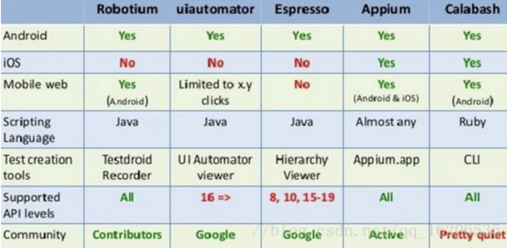

# 主流移动端自动化测试工具

## 学习目标

- 了解都有哪些移动端自动化测试工具

### 主流工具



- Robotium

```
1.支持语言：Java
2.仅支持Android系统
3.不支持跨应用
```

- Macaca

```
1.支持语言：Java，Python，Node.js
2.支持Android和IOS系统
3.支持跨应用
```

- Appium

```
1.支持语言：Java，C#，Python，php，perl，ruby，Node.js
2.支持Android和iOS系统
3.支持跨应用
4.不依赖源码
```

- 自动化工具选择关注点

```
1.是否支持native，webview
2.是否支持获取toast
3.是否支持跨应用
```

