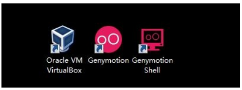
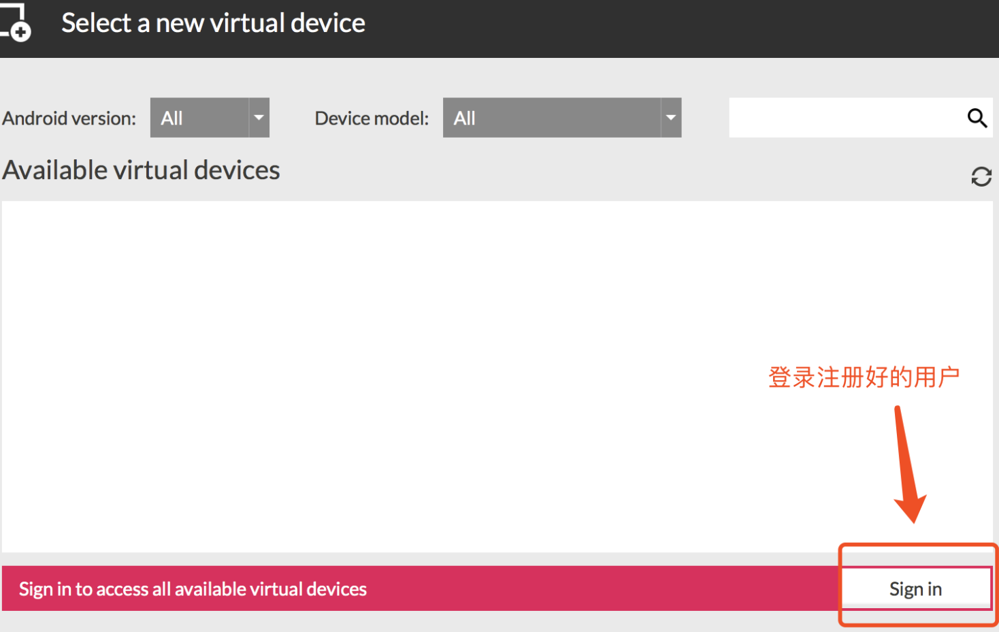

## 1. window安装andorid模拟器

### 1. 模拟器Genymotion安装

```
1.执行genymotion-2.11.0-vbox.exe(是一个集合程序，包含genymotion和virtualbox) -> 不需要更改配置，直接下一步默认安装

2.安装完genymotion继续等待，会提示安装virtualbox，继续安装，期间会提示安装oracle插件，全部允许安装

3.安装完成后会在桌面展示genymotion和virtualbox两个图标
```



> 注意:
>
> 安装其他的模拟器也可以 ,安装成功就可以.(比如MuMu 逍遥 夜神 雷电)

### 2. Mac 下安装模拟器

mac下安装要装两个dmg文件: genymotion-2.12.1.dmg和VirtualBox-5.2.26-128414-OSX.dmg

```
1.安装genymotion-2.12.1.dmg-》不用更改配置,默认安装就行
2.安装VirtualBox-5.2.26-128414-OSX.dmg  -》 不用更改配置直接安装就行
3.安装后也会看到上面三个应用
```


### 3.虚拟机镜像导入

```
1.打开virtualbox
2.进入virtualbox -> 管理 -> 导入虚拟电脑
3.点击文件选择(Samsung Galaxy S6 - 5.1.0 - API 22 - 1440x2560.ova) -> 点击下一步
4.勾选 重新初始化所有网卡的MAC地址
5.点击导入按钮 -> 等待倒入完成
6.virtualbox列表会展示如下图圈出的选项
```


### 4. 启动模拟器

在genymotion主界面点机start按钮.启动成功就会显示下图


### 5. 安装应用apk

安卓模拟器启动起来后,我们就可以安装要进行测试的应用了.安装成功后,我们的环境搭建就全部结束.

**安装方法:**

- adb命令行(后面讲解)
- 直接拖拽要安装的apk到模拟器上,自动安装

### 注意事项

#### 1. 安装ARM插件

安装某些应用apk时由于apk功能比较丰富,但是模拟器自带的不支持这些功能,所以要安装arm插件,来满足apk的使用.

**(1)、拖动ARM_Translation_Lollipop_20160402.zip到已启动的android虚拟机上**

需要下载对应版本的插件、我们使用的是adnroid5.1 所以使用的是这个

**(2)点击提示的ok按钮**


**(3)、再次点击提示的ok按钮,重启模拟器既可以安装apk文件**


#### 2.  使用其他版本的模拟器的步骤

​	**(1)、需要到genymotion官网上注册一个账号**

​	**(2)、进入genymotion界面,点击add按钮、会弹出登录对话框、输入注册的账号**



**(3)、登录成功后可以选择对应不同的android版本、手机型号进行安装**


