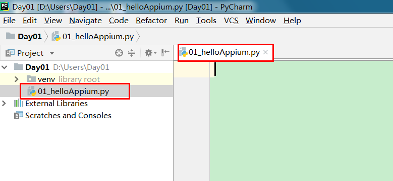

# appium入门案例

## 学习目标

- 掌握如何实现python和android的启动

## 1.打开PyCharm 创建一个新项目

```
在项目里面新建一个 hello.py文件 如下图
```



## 2.在hello.py文件中输入如下代码

```
# 从appium库里面导入driver对象,帮助我们进行脚本和手机间交互
from appium import webdriver
# 导入time
import time
# server 启动参数
desired_caps = {}
# 设备信息
desired_caps['platformName'] = 'Android' #平台名称
desired_caps['platformVersion'] = '5.1'  #平台版本
desired_caps['deviceName'] = '192.168.56.101:5555' #设备号
# app信息
desired_caps['appPackage'] = 'com.android.settings' #应用的包名
desired_caps['appActivity'] = '.Settings' #代表启动的activity
driver = webdriver.Remote('http://localhost:4723/wd/hub', desired_caps) #声明driver对象,让手机完成脚本操作
# time.sleep(5)
# 关闭app driver对象不会关闭
# driver.close_app()
#关闭驱动对象
# driver.quit()
```

desired_caps是负责启动服务端时的参数设置,appium server 与手机端建立会话关系时，根据这些参数服务端可以做出相应的处理.

常用参数:

```
platformName 平台的名称：iOS, Android, or FirefoxOS
platformVersion 设备系统版本号
deviceName 设备号 IOS：instruments -s devices，Android: adb devices
app 安装文件路径：/abs/path/to/my.apk or http://myapp.com/app
appActivity 启动的Activity
appPackage 启动的包
unicodeKeyboard      unicode设置(允许中文输入)
resetKeyboard        键盘设置(允许中文输入)
```

## 3. 启动Appium和 Android模拟器

## 4. 运行hello.py观看模拟器的设置应用是否被打开

