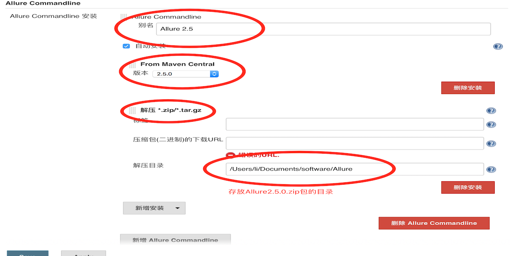
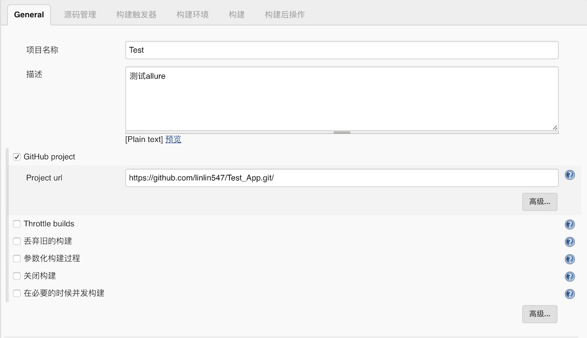

# Jenkins持续集配置

## 学习目标

- 掌握Jenkins持续集成的相关配置

### 1. Jenkins安装allure插件

jenkins和allure一起配合可以自动帮我们生成好看的测试报告,不用每次自己都要自己使用命令行生成.

1. 进入jenkins系统管理 -> 管理插件
2. 点击可选插件
3. 搜索框搜索Allure Jenkins Plugin
4. 选中安装

### 2. 安装Allure Commandlin

1. 在Jenkins系统管理——> 全局工具管理

2. 找到Allure Commandline，点击Allure Commandline安装

   

3. 点击后,弹出如下页面, 输入一个别名

   

4. 选择安装版本

5. 点击新增安装-选择解压\*.ip/\*.tar.gz

6. 解压目录选择已经下载好的allure2.5.0.zip所在目录(⚠️ 版本要和第4步的版本一致)

7. 点击保存



### 3. Jenkins 和Git进行代码的持续管理

1. 创建一个自由风格项目—> 点击确定

2. 输入项目描述

3. 选择GitHub Project进行代码的管理

4. 输入github的的本地仓库名(⚠️, 在公司里要选择自己仓库名)

   

5. 勾选git

6. Repository URL 输入和第4步一样

   

7. 点击add添加github用户名和密码

   

### 4. 构建触发器并发送邮件

通过构建触发器,可以在约定的时间自动运行测试脚本,有错误可以自动的给开发人员发送邮件,不用测试人员一直守着.

#### 4.1 构建触发器

1. 根据需要勾选Build periodically选项
2. 在日程表填写定时任务时间


> 日程表填写的参数的含义:
>
> - 第1个参数：分钟 minute，取值 0~59；
> - 第2个参数：小时 hour，取值 0~23；
> - 第3个参数：天 day，取值 1~31；
> - 第4个参数：月 month，取值 1~12；
> - 第5个参数：星期 week，取值 0~7，0 和 7 都是表示星期天；
>
> **5个参数可选择性设定，不写死的参数用 * 号代替，参数之间用空格隔开.**

3. 点击增加构建步骤,选择Execute shell

4. Command框输入:

   ```shell
   export PATH=$PATH:'pytest可执行的目录'
   pytest
   ```

   

#### 4.2 添加测试报告生成路径

1. 构建后操作,点击增加构建后操作步骤,选择Allure Report

2. Path框输入,生成的报告文件夹名称, 注意, 文件夹名要和pytest生成的报告文件夹名称一样

   

#### 4.3 配置邮箱列表

1. 点击增加构建后操作步骤，选择Editable Email Notification
2. 点击Advanced Setting…
3. 点击Trigger的高级按钮
4. Recipient List输入邮件接收列表，多个邮箱逗号分隔


5. 在Jenkins系统中配置邮件

   在系统全局配置中进行邮件配置, 要配置管理员的邮箱、发送/接收邮件的服务器、邮件接收人的邮箱列表.

   配置如下:

   ```
   配置邮件系统用户：
           系统管理-系统设置-Jenkins Location
           系统管理员邮件地址：用户名@163.com(发送邮件用户)
   配置系统邮件：
           系统管理-系统设置-邮件通知
           SMTP服务器：例 smtp.163.com
           用户默认邮件后缀：例如 @163.com
           高级-使用SMTP认证
           输入发送邮箱和密码 -可以使用测试邮件验证
   配置(发送附件)邮件：
           系统管理-系统设置-Extended E-mail Notification
           SMTP server：例 smtp.163.com
           Default user E-mail suffix：例如 @163.com
           高级-Use SMTP Authentication - 输入发送邮件的邮箱和密码
           Default Content Type: HTML(text/html)
           Default Content(报告模版,使用以下html代码即可):
                  <hr/>(本邮件是程序自动下发的，请勿回复！)<hr/>
                   项目名称：$PROJECT_NAME<br/><hr/>
                   构建编号：$BUILD_NUMBER<br/><hr/>
                   git版本号：${GIT_REVISION}<br/><hr/>
                   构建状态：$BUILD_STATUS<br/><hr/>
                   触发原因：${CAUSE}<br/><hr/>
                   目录：${ITEM_ROOTDIR}<br/><hr/>
                   构建日志地址：<a href=" ">${BUILD_URL}console</a ><br/><hr/>
                   构建地址：<a href="$BUILD_URL">$BUILD_URL</a ><br/><hr/>
                   报告地址：<a href="${BUILD_URL}allure">${BUILD_URL}allure</a ><br/><hr/>
                   失败数：${FAILED_TESTS}<br/><hr/>
                   成功数：${FAILED_TESTS}<br/><hr/>
                   变更集：${JELLY_SCRIPT,template="html"}<br/><hr/>
   ```

### 5. 进行项目构建

项目构建有2种方式, 构建后就会运行测试脚本,运行完毕后会很生成测试报告,测试未通过会给相关人员发送邮件

**构建的2种方式:**

- 手动触发构建
- 更新github代码,触发器在定时任务到达时,会触发项目构建

构建后页面,在此页面上我们可以看到构建的历史和构建的状态, 构建状态有三种:

构建的三种状态:

- 蓝色圆球代表构建成功
- 红色圆球代表构建失败
- 灰色圆球代表构建中断


### 6.总结

通过Jenkin、Allure、Pytest、Git 的联合配置使用,会大大解放测试人员的压力,测试人员只要把工作的重心放在测试用例计划、测试用例的编写和测试脚本的编写上面就可以.

