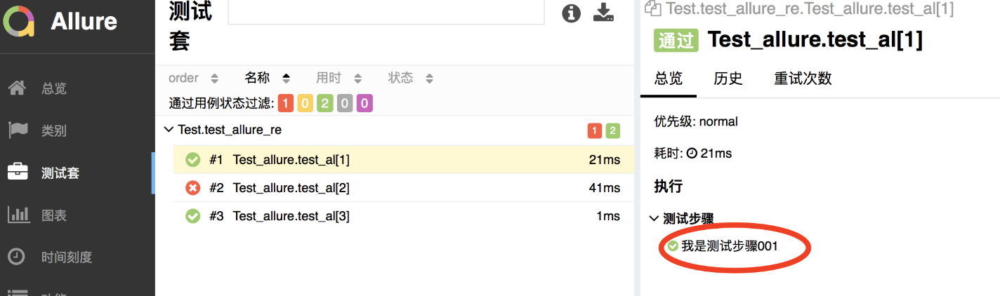
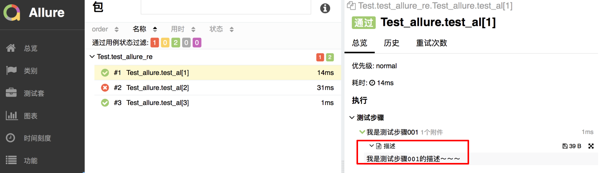
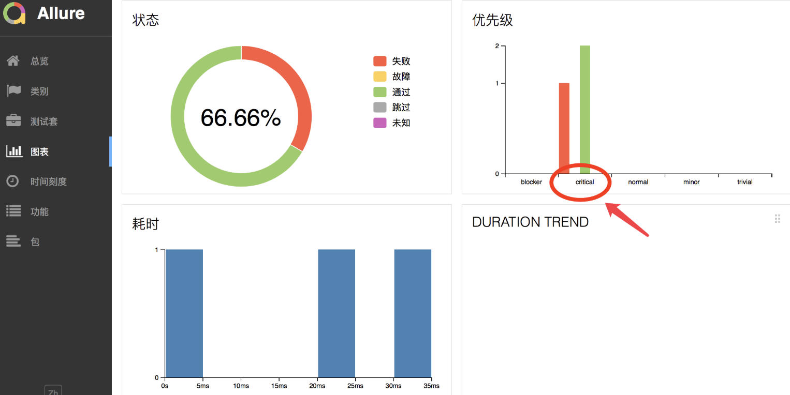

# pytest中使用allure

## 学习目标

- 能够在测试脚本中添加测试步骤和设置错误级别

### 1、添加测试步骤

**添加测试步骤的目的:** 便于在测试报告中明确的显示是第几步发生了错误

**方法:** 

```
@allure.step(title="测试步骤001")
```

**示例代码**

test_allure_report.py

```python
import allure
import pytest

class TestAllure:

    def setup(self):
        print('---> setup')

    def teardown(self):
        print('teardown')
	
  	@pytest.mark.parametrize("a", [1,2,3])
    @allure.step("我是测试步骤001")
    def test_a(self):
        print('test_a')
        assert a != 2

```

执行pytest,重新打开生成的测试报告



### 2. 添加测试描述信息

**添加描述信息目的:** 能够清除知道每一步执行的信息

**方法:**

```
allure.attach("描述", "我是测试步骤001的描述~~")
```

**示例代码**

test_allure_report.py

```python
import allure
import pytest

class TestAllure:

    def setup(self):
        print('---> setup')

    def teardown(self):
        print('teardown')
	
  	@pytest.mark.parametrize("a", [1,2,3])
    @allure.step("我是测试步骤001")
    def test_a(self):
        print('test_a')
        # 添加描述信息
        allure.attach("描述", "我是测试步骤001的描述~~")
        assert a != 2

```

执行pytest,重新打开生成的测试报告



### 3. 添加严重级别

**目的:** 测试用例设置不同的严重级别，可以帮助测试和开发人员更直观的关注重要Case.

**方法:**

```python
@pytest.allure.severity(Severity)
# 参数解释:
  	Severity: 严重级别(BLOCKER,CRITICAL,NORMAL,MINOR,TRIVIAL)
# 使用方式:
		@pytest.allure.severity(pytest.allure.severity_level.CRITICAL)

```

执行pytest,重新打开生成的测试报告

```python
import allure
import pytest

class TestAllure:

    def setup(self):
        print('---> setup')

    def teardown(self):
        print('teardown')
	
  	@pytest.mark.parametrize("a", [1,2,3])
    @allure.step("我是测试步骤001")
    @oytest.allure.severity(pytest.allure.severity_level.CRITICAL)
    def test_a(self):
        print('test_a')
        # 添加描述信息
        allure.attach("描述", "我是测试步骤001的描述~~")
        assert a != 2
```



