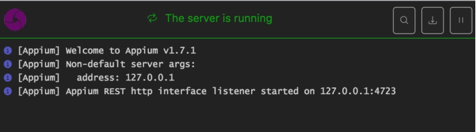

# Appium环境搭建

## 学习目标

- 掌握appium的环境搭建

## 1. Appium 背景介绍

```
1.官网：www.appium.io,由SauceLab公司开发

2.Appium是由nodejs的express框架写的Http Server
Appium使用WebDriver的json wire协议，
来驱动Apple系统的UIAutomation库、Android系统的UIAutomator框架
```

## 2. appium安装的2种方式

### 方式1. Appium 桌面客户端安装

安装步骤

1. 运行appium-desktop-Setup-1.2.7.exe，默认安装即可
2. 启动客户端，按图⽚步骤 1 -> 2 -> 3 -> 4 设置


3.启动成功如下图:



### 方式2. Appium 命令行安装

#### 2.1 安装nodejs

```
nodejs:官网下载地址: https://nodejs.org/en/download/

安装完成后 命令行运行npm或node -v 来查看是否安装成功,如下图:
```


#### 2.2 安装cnpm

```
npm install -g cnpm --registry=https://registry.npm.taobao.org

npm国内一般被墙，所以选择淘宝镜像安装,官网:http://npm.taobao.org
```

#### 2.3 cnpm安装appium

```
命令: cnpm install -g appium
```

如下图:


#### 2.4 启动appium服务

```
启动服务命令:appium
```

启动成功如下图:


## 3. Appium-python库安装

```
我们使用Python语言编写脚本,所以要安装appium的python库

安装命令: pip install Appium-Python-Client
```