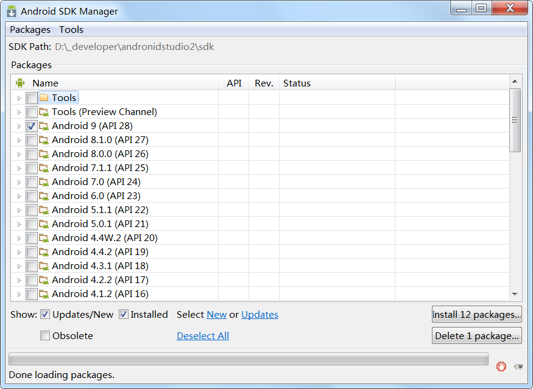

### 1. Window 安装sdk(Androi需要的环境)

安装步骤:

#### 1.1 解压Android sdk 文件夹

**注意:路径中不要有中文, 确保文件夹下有一下两个文件**

如下图: 

#### 1.2 配置到系统环境变量下.

```
SDK环境变量配置(Windowns7为例)

    1.进入我的电脑 -> 属性 -> 高级系统设置 -> 环境变量

    2.在系统变量下点击新建 -> 变量名: ANDROID_HOME -> 变量值: D:\android-sdk -> 点击确定按钮

    3.在系统变量下找到系统的path变量，最后添加：;%ANDROID_HOME%\platform-tools;%ANDROID_HOME%\tools;(最前面是一个分号，如果path变量最后已有分号，可不用添加) -> 点击确定按钮
```

#### 1.3 验证环境变量是否配置成功

- 在dos中输入adb指令,如下图配置成功 
- 在dos中输入**android**指令 出现Android sdk manager对话框 

> 注意:**
>
> **假如sdk中已经有build-tools和platform-tools文件夹,就不需要再进行下载安装了**


### 2. Mac 安装android sdk

1. 把下载的android sdk macosx版本的解压到指定目录(我的解压到//Library/Java/)

   

   > **注意:**
   >
   > **假如sdk没有build-tools和platform-tools文件夹,要把提供的文件夹移动到此处, 后面只需要配置环境变量即可,不需要下载了**

2. 把sdk配置到系统环境变量

   ```
   1.进入命令行， vim ~/.bash_profile
   2.# set android
      ANDROID_HOME=电脑存放的路径/android-sdk-macosx
      PATH=$PATH:$ANDROID_HOME/tools:$ANDROID_HOME/platform-tools
      export ANDROID_HOME 
      export PATH
   ```

   

3. 验证是否成功

   验证**adb命令**: 在终端输入adb,出现adb版本信息说明成功

   

   验证android是否配置成功: 在终端输入**android**, 出现此图片说明成功

   

### 3、选择不同版本的的Android系统进行下载

**注意**:

> 由于安卓镜像在国外,最好更换国内的镜像

步骤

- 在弹出的android sdk manager页面,点击tools, 下啦框点击options

  

- 在弹出的对话框输入国内惊现的地址和端口号.

  


     镜像地址列表(也可以网上查找最新的)：
         中国科学院开源协会镜像站地址:
             IPV4/IPV6: mirrors.opencas.cn 端口：80
             IPV4/IPV6: mirrors.opencas.org 端口：80
             IPV4/IPV6: mirrors.opencas.ac.cn 端口：80
         上海GDG镜像服务器地址:
             sdk.gdgshanghai.com 端口：8000
    
         北京化工大学镜像服务器地址:
             IPv4: ubuntu.buct.edu.cn/ 端口：80
             IPv4: ubuntu.buct.cn/ 端口：80
             IPv6: ubuntu.buct6.edu.cn/ 端口：80
    
         大连东软信息学院镜像服务器地址:
             mirrors.neusoft.edu.cn 端口：80