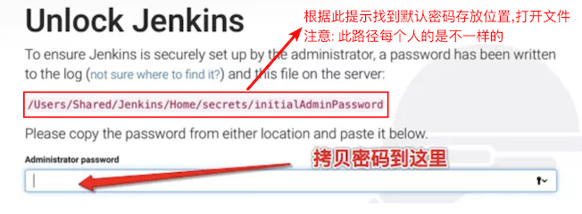
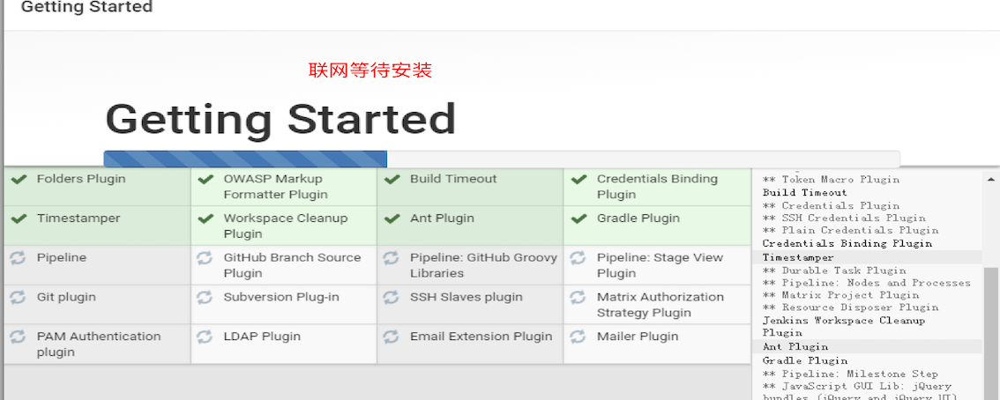
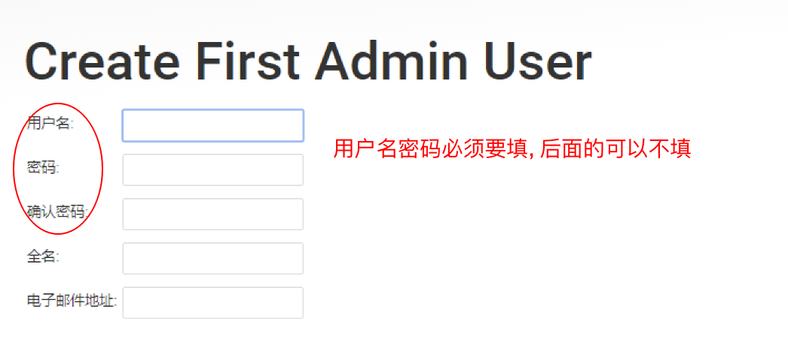
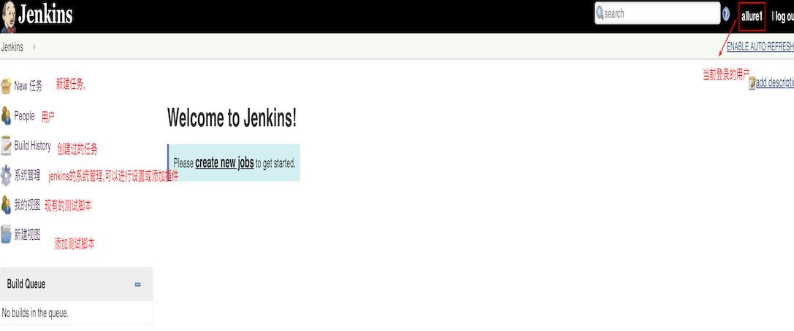

# Jenkins安装于配置

## 学习目标

- 掌握jenkins的安装和配置

### 1. Jenkins介绍

> Jenkins是一个开源软件项目，是基于Java开发的一种持续集成工具，用于监控持续重复的工作, 旨在提供一个开放易用的软件平台，使软件的持续集成变成可能.

### 2. 安装

#### 2.1 jar包的方式安装

安装要依赖于java环境,必须首先在系统中安装jdk1.5版本以上, 并且配置在系统环境变量中.

安装方式:

1. 下载jenkins.jar
2. 移动到要安装的目录,执行java -jar jenkins.war
3. 代开浏览器输入: localhost:8080

#### 2.2 源码包安装

1. [官网下载jenkins安装包](https://links.jianshu.com/go?to=https://jenkins.io/index.html)

2. 点击下一步,直到安装完成,会自动打开页面, 若没有打开,需要手动打开浏览器输入: localhost:8080
3. 进入默认密码提示文件,输入系统默认的密码:

4. 点击确定保存密码, 然后可以看到让安装插件

   

   

5. 设置用户信息

6. 启动后,**点击开始使用jenkins**, 进入首页

   