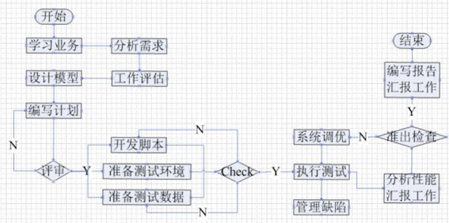

# 1


#### 什么是软件测试

在规定条件下对程序进行操作,从而发现错误,对软件质量进行评估的一个过程.


#### 软件测试的目的

是想以最少的人力，物力和时间找出软件中潜在的各种错误与缺陷，通过修正各种错误和缺陷提高软件质量，回避软件发布后由于潜在的软件缺陷和错误造成的隐患以及带来的商业风险。


**注意:**不要和软件测试的定义混淆


#### 软件测试的定义

使用**人工或自动**手段来运行或测试摸个系统的过程,其目的在于检验它是否满足规定的需求或是弄清预期结果和实际结果之间的差别.


**软件开发过程模型**是软件开发人员在公司里工作的过程.

**常见的软件开发过程模型**

- 瀑布模型
- 快速原型模型
- 增量模型
- 螺旋模型


**V模型**: 强调了在整个软件项目开发中需要经历的若干个测试级别，并与每一个开发级别对应；忽略了测试的对象不应该仅仅包括程序，没有明确指出对需求、设计的测试

**W模型**: 补充了V模型中忽略的内容，强调了测试计划等工作的先行和对系统需求和系统设计的测试；与V模型相同，没有对软件测试的流程进行说明

**H模型**: 强调测试是独立的，只要测试准备完成，就可以执行测试


#### 1. 按照阶段进行划分

**1.1 单元测试(Unit Testing)**

单元测试是对软件组成单元进行测试。其目的是检验软件基本组成单位的正确性。测试的对象是软件设计的最小单位：模块。

- 测试阶段：编码后
- 测试对象：最小模块
- 测试人员：白盒测试工程师或开发工程师
- 测试依据：代码和注释+详细设计文档
- 测试方法：白盒测试
- 测试内容：模块接口测试、局部数据结构测试、路径测试、错误处理测试、边界测试

**1.2 集成测试(Integration Testing)**

集成测试也称联合测试、组装测试，将程序模块采用适当的集成策略组装起来，对系统的接口及集成后的功能进行正确性检测的测试工作。主要目的是检查软件单位之间的接口是否正确。

- 测试阶段：一般单元测试之后进行
- 测试对象：模块间的接口
- 测试人员：白盒测试工程师或开发工程师
- 测试依据：单元测试的模块+概要设计文档
- 测试方法：黑盒测试与白盒测试相结合
- 测试内容：模块之间数据传输、模块之间功能冲突、模块组装功能正确性、全局数据结构、单模块缺陷对系统的影响

> 补充说明： 单元测试是一个模块内部的测试，集成测试是在模块之间进行测试（至少两个）

**1.3 系统测试(System Testing)**

将软件系统看成是一个系统的测试。包括对功能、性能以及软件所运行的软硬件环境进行测试。时间大部分在系统测试执行阶段,包括回归测试和冒烟测试

- 测试阶段：集成测试通过之后
- 测试对象：整个系统（软、硬件）
- 测试人员：黑盒测试工程师
- 测试依据：需求规格说明文档
- 测试方法：黑盒测试
- 测试内容：功能、界面、可靠性、易用性、性能、兼容性、安全性等

> 补充说明： （1）系统测试是从完整的角度，广面去看待问题，不再看模块 （2）虽然系统测试包括冒烟测试和回归测试，但三者之间是有严格的先后顺序的，即：**先冒烟、再系统、后回归**

#### 2. 按是否覆盖源码划分

------

**2.1 黑盒测试(Black-box Testing)**

黑盒测试也称功能测试，测试中把被测的软件当成一个黑盒子，不关心盒子的内部结构是什么，只关心软件的输入数据与输出数据。黑盒测试又分为功能测试和性能测试

- 功能测试
  - **业务测试是指**：测试人员将系统的整个模块串接起来运行、模拟真实用户实际的工作流程。满足用户需求定义的功能来进行测试的过程
  - **易用性**（Useability）是交互的适应性、功能性和有效性的集中体现。又叫用户体验测试。
  - **界面测试**（简称UI测试)，测试用户界面的功能模块的布局是否合理、整体风格是否一致、各个控件的放置位置是否符合客户使用习惯，此外还要测试界面操作便捷性、导航简单易懂性，页面元素的可用性，界面中文字是否正确，命名是否统一，页面是否美观，文字、图片组合是否完美等。
  - **安装测试**:是指测试程序的安装、卸载。最典型的就是APP的安装、卸载。
  - **兼容性测试**:主要是指软件之间能否很好的运作，会不会有影响、软件和硬件之间能否发挥很好的效率工作，会不会影响导致系统的崩溃。例如最常见的是浏览器的兼容性测试,不同浏览器在css、js解析的不同会造成页面的不同.

- 性能测试

  检查系统是否满足需求规格说明书中规定的性能。 通常表现在以下几个方面：

  - 对资源利用（如内存、处理机周期等）进行的精确度量
  - 对执行间隔
  - 日志事件（如中断，报错）
  - 响应时间
  - 吞吐量（TPS）
  - 辅助存储区（例如缓冲区、工作区的大小等）
  - 处理精度等进行的监测

**2.2 白盒测试(White-box Testing)**

白盒测试又称结构测试、透明盒测试、逻辑驱动测试或基于代码的测试。白盒指的打开盒子，去研究里面的源代码和程序结果。

> 白盒测试也是接口测试的一种

**2.3 灰盒测试(Gray-Box Testing)**

灰盒测试，是介于白盒测试与黑盒测试之间的一种测试，灰盒测试多用于集成测试阶段，不仅关注输出、输入的正确性，同时也关注程序内部的情况。

> 灰盒测试:功能 + 接口

#### 3.按是否执行程序划分

------

**3.1 静态测试(Static testing)**

静态方法是指不运行被测程序本身，仅通过分析或检查源程序的语法、结构、过程、接口等来检查程序的正确性。对需求规格说明书、软件设计说明书、源程序做结构分析、流程图分析、符号执行来找错。阿旺分析如下

- 检查项：代码风格和规则审核；程序设计和结构的审核；业务逻辑的审核；走查、审查与技术复审手册。
- 静态质量：度量所依据的标准是ISO9126。在该标准中，软件的质量用以下几个方面来衡量，即功能性(Functionality)、可靠性(Reliability)、可用性(Usability)、有效性(Efficiency)、可维护性（Maintainability）、可移植性(Portability)。

> 静态测试:代码静态分析和文档测试都属于静态测试

**3.2 动态测试(Dynamic testing)**

动态测试方法是指通过运行被测程序，检查运行结果与预期结果的差异，并分析运行效率、正确性和健壮性等性能。这种方法由三部分组成：构造测试用例、执行程序、分析程序的输出结果。

> (1）动态测试有三部分组成：构造测试用例、执行程序、分析程序的输出结果。 (2）大多数软件测试都属于动态测试。

#### 4. 按是否自动化分

**4.1 手工测试(Manual testing)**

手工测试就是由人去一个一个的输入用例，然后观察结果，和机器测试相对应，属于比较原始但是必须的一个步骤。阿旺总结优缺点：

- 优点：自动化无法替代探索性测试、发散思维类无既定结果的测试。
- 缺点：执行效率慢，量大易错。

**4.2 自动化测试(Automation Testing)**

就是在预设条件下运行系统或应用程序，评估运行结果，预先条件应包括正常条件和异常条件。简单说自动化测试是把以人为驱动的测试行为转化为机器执行的一种过程。

- 自动化测试有：测试自动化、性能测试自动化、安全测试自动化。（一般情况下，我们说的自动化是指功能测试的自动化）
- 自动化测试按照测试对象来分，还可以分为接口测试、UI测试等。接口测试的ROI（产出投入比）要比UI测试高。

> 自动化实施的步骤:
>
> (1) 完成功能测试，版本基本稳定
>
> (2) 根据项目特性，选择适合项目的自动化工具，并搭建环境
>
> (3) 提取手工测试的测试用例转换为自动化测试的用例
>
> (4) 通过工具、代码实现自动化的构造输入、自动检测输出结果是否符合预期
>
> (5) 生成自动测试报告
>
> (6) 持续改进、脚本优化

#### 5.其他

------

**5.1 冒烟测试(Smoke Testing)**

该术语来自硬件，指对一个硬件或一组硬件进行更改或修复后，直接给设备加电。如果没有冒烟，则该组件就通过了测试，也可以理解为该种测试耗时短，仅用一袋烟的功夫就足够了。

冒烟测试的目的是确认软件基本功能正常，可以进行后续正式的测试工作。冒烟测试的执行者是版本编译人。 冒烟测试一般在开发人员开发完毕后送给测试人员来进行测试时，测试人员会先进行冒烟测试，保证基本功能正常，不阻碍后续测试。

**5.2 回归测试**

回归测试是指修改了旧的代码之后，重新进行测试以确认修改没有引入新的错误或导致其他代码产生错误。**自动回归测试将大幅度降低系统测试、维护升级等阶段的成本.**

在整个软件测试过程中占有很大的工作比重，软件开发的各个阶段都会进行多次回归测试。随着系统的庞大，回归测试的成本越来越大，通过正确的回归测试策略来改进回归测试的效率和有效性是很有意义的。

**5.3 随机测试**

随机测试主要是根据测试者的经验对软件进行功能和性能抽查。

根据测试说明书执行用例测试的重要补充手段，是保证测试覆盖完整性的有效方式和过程。

随机测试主要是对被测软件的一些重要功能进行复测，也包括测试那些当前的测试用例(TestCase)没有覆盖到的部分。

**5.4 验收测试**

验收测试是部署软件之前的最后一个测试操作, 也称为交付测试.验收测试的目的是确保软件准备就绪，按照项目合同、任务书、双方约定的验收依据文档，向软件购买都展示该软件系统满足原始需求。

- 测试阶段：系统测试通过之后
- 测试对象：整个系统（包括软硬件）。
- 测试人员：主要是最终用户或者需求方。
- 测试依据：用户需求、验收标准
- 测试方法：黑盒测试
- 测试内容：同系统测试(功能...各类文档等)

验收测试按照实施的组织不同分为:**α测试**和**β测试**

**α测试**

- α测试是由一个用户在开发环境下进行的测试，也可以是公司内部的用户在模拟实际操作环境下进行的测试。
- α测试的目的是评价软件产品的FLURPS(即功能、局域化、可使用性、可靠性、性能和支持)。
- 大型通用软件，在正式发布前，通常需要执行Alpha和Beta测试。α测试不能由程序员或测试员完成。

**β测试**

- Beta测试是一种验收测试。Beta测试由软件的最终用户们在一个或多个客房场所进行。

**α测试与β测试的区别：**

- 测试的场所不同：Alpha测试是指把用户请到开发方的场所来测试,beta测试是指在一个或多个用户的场所进行的测试。
- Alpha测试的环境是受开发方控制的,用户的数量相对比较少,时间比较集中。beta测试的环境是不受开发方控制的,用户数量相对比较多,时间不集中。
- alpha测试先于beta测试执行。通用的软件产品需要较大规模的beta测试,测试周期比较长。

## 基本原则

**1. 一切测试要追溯到用户的需求**

**2. 应该把“尽早测试和不断测试”作为测试人员的座右铭**

**3. pareto原则(二八原则):80%的错误,发生在20%的模块中**

**4. 穷举测试是不可能的**

**5. 第三方测试会更客观**

**6. 测试用例是设计出来的, 不是写出来的**

**7. 不可将测试用例置之度外，排除随意性**

**8. 测试贯穿于整个生命周期**

**9. 对发现错误较多的程序段，应进行更深入的测试**

**10. 要妥善的保存一切文档,便于后期进行复用**



**需求分析阶段**：

- 阅读需求、理解需求，分析需求点，参与需求评审会议。

**测试计划阶段**：

- 主要任务就是编写测试计划，参考软件需求规格说明书，项目总体计划，
- 内容包括测试范围，进度安排，人力物力分配，整体测试策略的制定,风险评估与规避措施，
- 参与测试计划的评审工作。

**测试设计阶段**：

- 编写测试用例，参考需求分析、概要设计、详细设计，不明确的与开发、产品经理沟通。
- 用例完成后进行评审

**测试执行阶段**：

- 搭建环境准备数据，执行冒烟测试（预测试）然后进入正式测试（系统测试、回归测试、交叉测试、自由测试），遇到问题提交bug到缺陷管理平台，并对bug进行跟踪，直到被测试软件达到测试需求要求，没重大bug，测试结束。

**评估阶段**：

- 出测试报告，对整个测试的过程和版本质量做一个详细的评估。

#### 测试用例八大要素

| 测试用例编号 | 测试项目(测试模块) | 预置(前提)条件 | 测试输入 | 预期输出 | 操作步骤 | 测试用例标题 | 级别 |
| :----------: | :----------------: | :------------: | :------: | :------: | :------: | :----------: | :--: |
|              |                    |                |          |          |          |              |      |

####  其他要素

1. **用例的设计者**:能准确找到测试用例的设计人员,对用例修改时能方便找到人员
2. **用例设计日期**: 方便检查用例的设计进度
3. **对应的开发人员**: 出现bug后能及时找到相应的人员进行修复
4. **测试结果**: 执行用例最后执行的结果, 包括:pass、fail、block
5. **测试类型**: 功能、性能、压力等等

常用的测试用例设计方法有: **等价类划分话、边界值分析法、判定表法、正交验证法、错误推测法、场景法、因果图法、功能图法**.


### 2. 产生软件缺陷的原因

产生软件缺陷的原因很复杂,原因各种各样,:

- 需求有缺陷
- 系统架构设计阶段有缺陷
- 程序设计阶段有缺陷
- 程序研发阶段有缺陷
- 测试阶段有缺陷
- 硬件有缺陷


# 禅道

禅道是测试用的最多的缺陷管理工具,一定掌握测试人员使用部分,其他的相应角色要了解.

测试人员主要使用是:

 **1. 编写测试用例、执行测试用例**

 **2. 对于测试未通过的,进行bug提交,指派给相应的开发者**

 **3. 开发者修复后的bug及时进行再次测试,测试通过就关闭,否则就再次激**


# jira

JIRA是集项目计划、任务分配、需求管理、缺陷跟踪于一体的软件。它基于Java架构的管理系统，被广泛应用于缺陷跟踪、客户服务、需求收集、流程审批、任务跟踪、项目跟踪和敏捷管理等工作领域。

JIRA创建的问题类型包括New Feature（新功能）、Bug（缺陷）、Task（任务）和Improvement（改进）四种，还可以自定义，所以它也是一个过程管理系统。同时融合了项目管理、任务管理和缺陷管理

JIRA设计以项目为主线，产品、测试结合管理，通过issues控制管理。因此它的核心诉求还是围绕issue展开的，以issue驱动管理、分工、以及团队协作，进而实现项目的规划、建设，终完成产品开发。

JIRA的优点:

1. JIRA的界面效果非常不错。安全性、可扩展性方面也不错。 JIRA的使用范围广，所以拥有众多开发者提供的扩展插件以供不同选择。
2. 单独提一下JIRA的工作流定制，这块功能实用性特别高，可定制性也很好。
3. JIRA针对issue驱动的项目管理非常有效，也基于多年来的插件积累，可以展现非常强大的交互、统计视图，纯粹项目管理使用JIRA的确是个不错选择。

缺点:

1. jira不符合国内人的使用习惯并且汉化做的不好
2. 售后服务较弱
3. 价格与禅道相比,较贵


## 1. 接口概述(了解)

### **1.1 什么是接口呢？**

接口一般来说有两种，一种是程序内部的接口，一种是系统对外的接口; 或者一种是软件接口,一种是硬件接口. 

我们常说的接口是应用程序编程接口,也就是Application Programming Interface,简称API.

### **2.1 什么是接口测试**

接口测试是测试系统组件间数据交互的一种方式. 

接口测试就是通过测试不同情况下的输入参数和与之对应的输出结果来判断接口是否符合或满足相应的功能性、安全性要求.

***简单的说,接口测试是就是代替前端或者第三方,来验证后端实现是否符合接口规范.***

###  **2.2 接口测试的好处**

通过接口测试,测试接口的正确性和稳定性, 能快速定位bug,提高测试效率. 

- 能为项目平台带来高效的缺陷监测和质量监督能力；
- 平台越复杂，系统越庞大，接口测试的效果越明显（提高测试效率，提升用户体验，降低研发成本）

### **2.3 接口测试原理**

**原理:**

**模拟客户端向服务器发送请求报文，服务器接收请求报文后对相应的报文做处理并向客户端返回应答，客户端接收响应数据后并进行判断**

- 请求: 是否正确, 默认请求成功是返回200, 假如请求错误返回400, 404, 500等状态码
- 检查: 返回数据的正确性与完整性
- 安全性: 接口一般不会暴露在网上任意被调用,需要做一些限制,比如必须登录或者请求次数、频率限制

### **2.4 基本流程**

接口测试流程: 定位服务器接口资源并提交测试数据，然后查看响应结果是否符合预期

1. 定位接口资源(URL)

2. 提交测试数据

3. 检查响应结果

### **2.5 接口测试分类**

- web接口测试
- 模块接口测试

##### (1). web接口测试

- 服务器接口测试, 是测试浏览器与服务器的接口, 是B/S架构的

- 外部接口测试, 测试第三方接口,

  > 举例：支付接口测试/天气预报接口测试

#### (2). 模块接口测试

- 单元测试的基础,主要测试模块的调用与返回.

## 3. 如何做好接口测试

接口测试要遵循一些要点:

1. 接口的功能性实现. 检查接口返回的数据与预期结果的一致性.
2. 测试接口的容错性, 例如传递的数据类型是错误的能否处理.
3. 测试接口参数的边界值. 例如传递的数据足够大或者为负数时能否处理
4. 测试接口性能, 接口处理和响应数据的时间也是测试的一个方面, 这牵扯到代码实现的优化
5. 测试接口的安全性. 特别是第三方接口,比如登录的用户名密码第三方是否是密文传输的

## 1. 定义

RESTful架构是一种**接口**设计架构**风格**，而**不是标准**，只是提供了一组设计**原则**。

## 2. 风格

- http://服务器地址:端口号[/项目名称/版本]/**资源**集合[/单个资源]

  ```
  - http://:为我们HTTP协议的访问头标准   
  - 服务器地址：为我们项目服务器IP地址  
  - 端口号：为我们服务器内项目访问的指定编号  
  - [/项目名称/版本]：可选  
  - 资源：互联网-图片、音乐、视频、文本、数据
  ```

------

## 3. RESTful相关知识(科普)

##### 3.3 HTTP请求方法

- GET（SELECT）：从服务器取出资源（一项或多项）。
- POST（CREATE）：在服务器新建一个资源。
- PUT（UPDATE）：在服务器更新资源（客户端提供改变后的完整资源）。
- DELETE（DELETE）：从服务器删除资源。

##### 3.4 响应状态

客户端请求服务求后，服务器响应给客户端的状态码。

##### 3.5 状态码集合汇总

| 序号 | 状态码                    | 动词             | 说明                                                         |
| ---- | ------------------------- | ---------------- | ------------------------------------------------------------ |
| 01   | 200 OK                    | [GET]            | 服务器成功返回用户请求的数据，该操作是幂等的（Idempotent）**幂等:无论执行操作多少次，结果都会执行1次结果相同** |
| 02   | 201 CREATED               | [POST/PUT/PATCH] | 用户新建或修改数据成功                                       |
| 03   | 202 Accepted              | [*]              | 表示一个请求已经进入后台排队（异步任务）                     |
| 04   | 204 NO CONTENT            | [DELETE]         | 用户删除数据成功                                             |
| 05   | 400 INVALID REQUEST       | [POST/PUT/PATCH] | 用户发出的请求有错误，服务器没有进行新建或修改数据的操作，该操作是幂等的 |
| 06   | 401 Unauthorized          | [*]              | 表示用户没有权限（令牌、用户名、密码错误）                   |
| 07   | 403 Forbidden             | [*]              | 表示用户得到授权（与401错误相对），但是访问是被禁止的        |
| 08   | 404 NOT FOUND             | [*]              | 用户发出的请求针对的是不存在的记录，服务器没有进行操作，该操作是幂等的 |
| 09   | 406 Not Acceptable        | [GET]            | 用户请求的格式不可得（比如用户请求JSON格式，但是只有XML格式） |
| 10   | 410 Gone                  | [GET]            | 用户请求的资源被永久删除，且不会再得到的                     |
| 11   | 422 Unprocesable entity   | [POST/PUT/PATCH] | 当创建一个对象时，发生一个验证错误                           |
| **12 | 500 INTERNAL SERVER ERROR | [*]              | 服务器发生错误，用户将无法判断发出的请求是否成功**           |

##### 3.6 对结果进行判断

| 序号 | 方法   | 预期结果                                                     |
| ---- | ------ | ------------------------------------------------------------ |
| 01   | GET    | collection：代码：200；数据：返回资源对象的列表（数组）      |
| 02   | GET    | collection/resource：代码：200；数据：返回单个资源对象       |
| 03   | POST   | collection：代码：200/201；数据：返回新生成的资源对象        |
| 04   | PUT    | collection/resource：代码：200/201；数据：返回完整的资源对象 |
| 05   | DELETE | collection/resource：代码：204；数据：返回为空               |

## 4. 总结(RESTful)

| 序号 | 名称        | 值                                                           |
| ---- | ----------- | ------------------------------------------------------------ |
| 01   | 定义        | 一种软件**架构风格**、**设计风格**，而**不是标准**           |
| 02   | RESTful风格 | http://服务器地址:端口号/[服务名]/[版本]/资源集合/单个资源   |
| 03   | 请求方法    | GET(获取资源);POST(新增资源);PUT(更新资源);DELETE(删除资源)  |
| 04   | 状态码      | **GET:200**;POST:200/201;PUT:200/201;**DELETE:204**          |
| 05   | [JSON]      | 是一种轻量级的数据交换格式;JSON是已键/值对组合方式，键名写在前面并用双引号 "" 包裹，使用冒号 : 分隔，然后紧接着值： 1 {"name": "张三","age":18} |

### 一、性能测试常用分类

性能测试是个综合的概述，性能测试指的是测试一种分类或多种分类，任何一具体分类，都是性能测试。 主要包含下面几种：

1. **负载测试**
2. **压力测试**
3. **并发测试**
4. **稳定性测试**
5. 配置测试
6. 容量测试

#### 1.1 负载测试 【重点】

```
说明：通过逐步增加系统负载(向服务器发送请求)，测试系统性能的变化，并最终确定在满足系统的性能指标情况下，系统所能够承受的最大负载量的测试。

提示：负载测试是通过逐步加压的方式来确定系统的处理能力、确定系统能够承受的各项阀值。
例如：逐步加压，从而得到“响应时间不超过3秒”、“服务器CPU平均利用率低于80%”等指标的阀值。            

* 阀值：关注的某一具体数值(比如：登录小于3秒、用户数2000、业务成功率100%)
```

#### 1.2 压力测试 【重点】

```
说明：通过逐步增加系统负载，测试系统性能的变化，并最终确定在什么负载条件下系统性能处于【失效】状态。

提示：
 1. 压力测试：是逐步增加负载，使系统某些资源达到饱和甚至失效。(如：测试系统最多支持同时处理多少请求，超过此数数量系统瘫痪)
 2. 负载测试：是逐步增加负载，确定在满足性能指标情况下，系统能承受的最大负载测试。(如：登录3秒内，最多支持多少用户同时登录；如超出此数量，可能需要5秒钟或更多时间才能登录成功)
```

#### 1.3 并发测试 【重点】

```
概念：并发测试就是【多用户】同时访问【同一个应用】。

目的：测试应用服务器指定功能的同时访问数是否达到预期结果。

*并发测试需要配合集合点来使用(集合点：我们在接口阶段已了解)
```

#### 1.4 稳定性测试【理解】

```
通过给系统加载一定的业务压力（如：CPU资源在70%～90%的使用率）的情况下，运行一段时间，检查系统是否稳定。

*通常稳定性测试，我们测试一段时间即可；(如：24小时、3×24小时或7×24小时来模拟长时间运行)
```

### 二、性能测试常用指标【重要】

**指标：** 一些经过运算得出的结果，用来衡量某种操作性能的统称， 包括指标名和指标值；比如：错误率0.5%

性能测试常用指标:

1. 吞吐量
2. 并发数
3. 响应时间
4. 点击数
5. 资源利用率
6. 错误率

#### 2.1 吞吐量

```
吞吐量（Throughput）：指的是单位时间内处理的客户端请求数量，直接体现软件系统的性能承载能力。

通常情况下，吞吐量用“请求数/秒”(QPS)或者“页面数/分钟”来衡量。

从业务角度来看，吞吐量也可以用“业务数/小时”、“业务数/天”、“访问人数/天”、“页面访问量/天”来衡量。
从网络角度来看，还可以用“字节数/小时”、“字节数/天”等来衡量网络的流量。
```

#### 2.2 并发数

```
并发（Concurrency）：它最简单的描述就是指多个同时发生的业务操作。
例如，100个用户同时单击登录页面的“登录”按钮操作。

并发性测试描述的是多个客户端同时向服务器发出请求，考察服务器端承受能力的一种性能测试方式。
```

#### 2.3 响应时间

```
响应时间指用户从客户端发起一个请求开始，到客户端接收到从服务器端返回结果整个过程所耗费的时间
```


#### 2.4 点击数

```
点击数是衡量Web服务器处理能力的一个重要指标。它的统计是客户端向Web服务器发了多少次HTTP请求计算的。

提示：
    1. 点击数不是通常一般人认为的访问一个页面就是１次点击数，点击数是该页面包含的元素（如：图片、链接、框架等）向Web服务器发出的请求数数量。
    2. 通常我们也用每秒点击次数（Hits per Second）指标来衡量Web服务器的处理能力。
```

#### 2.5 资源利用率

```
是指系统各种资源的使用情况，一般用“资源的使用量/总的资源可用量×100%”形成资源利用率的数据。

通常，没有特殊需求的话：
    1. 建议CPU使用率不高于80%(±5)；
    2. 内存使用率不高于80%；
    3. 磁盘读写时间比不高于90%。
```

#### 2.6 错误率

```
错误率指系统在负载情况下，失败交易的概率。错误率＝(失败交易数/交易总数)*100%。

提示：
    1. 不同系统对错误率要求不同，但一般不超过千分之五；
    2. 稳定性较好的系统，其错误率应该由超时引起，即为超时率。
```

### 三、性能常用测试工具

| 工具       | 说明      | 作用                                                   | 优点                                                     | 缺点 |
| :--------- | :-------- | :----------------------------------------------------- | :------------------------------------------------------- | :--- |
| Jmeter     | Java开发  | 性能测试、接口测试、Web测试                            | 免费、开源、小巧                                         |      |
| LoadRunner | C语言开发 | 模拟高并发负载测试、测试场景搭建、运行、监控及结果分析 | 支持多协议、自带强大的图表功能、可根据需求合并需要的图表 | 收费 |

**Jmeter 和 LoadRunner 的简单对比总结：**

Jmeter：接口测试及接口性能压测首选

LoadRunner：Web性能测试首选

- 性能测试流程

### 流程

```
1. 性能测试需求分析
2. 性能测试计划
3. 性能测试用例
4. 测试脚本编写
5. 测试场景设计
6. 测试场景运行
7. 场景运行监控
8. 运行结果分析
9. 系统性能调优
10. 性能测试报告总结
```

#### 1 性能测试需求分析

需求分析就是把真正需求搞清楚

```
例如：
    1). 公司需要对所有的功能都进行性能测试；
    2). 用户登录响应时间小于3秒钟；
    3). 系统支持20万用户并发访问；
```

#### 2 性能测试计划

```
1). 性能测试计划是对性能测试过程描述的重要过程；
2). 在对需求文档经过认真分析后，作为性能测试管理人员，需要编写的第一份文档就是性能测试计划；
3). 性能测试计划中，需要阐述产品、项目的背景，将前期的需要测试性能需求明确，并落实到文档中。
```

#### 3 性能测试用例

性能测试需求最终要体现在性能测试用例设计中，性能测试用例应结合用户应用系统的场景，设计出相应的性能测试用例，用例应能覆盖到测试需求。

```
提示：
    1). 明确哪些功能业务量较大；
    2). 明确系统预期的用户规模、并发用户数、在线用户数；
    3). 明确系统业务的处理能力要求，如：TPS、响应时间、系统资源利用率等；
    TPS ：(Transaction per second)事务数/秒
    4). 详细的操作步骤及场景的搭建模式
```

#### 4 测试脚本编写

性能测试用例编写完成以后，接下来就需要结合用例的需要，进行测试脚本的编写工作。

```
注意：
    1). 协议的正确选用；
    2). 脚本保证其正确性，去除冗余代码；
    3). 注重编码的规范和代码的编写质量。
```

#### 5 测试场景设计

测试场景设计的一个重要原则就是依据测试用例，把测试用例设计的场景展现出来。

```
提示：
    1). 虚拟用户数量及启动虚拟用户方式
    2). 场景的相关设置（如：集合点)
    3). 脚本是否存在依赖关系（登录与注册)
```

#### 6 测试场景运行

测试场景运行是关系到测试结果是否准确的一个重要过程。

```
注意：
    1). 负载的测试机是否能够运行设定的虚拟用户数；
    2). 有没有“预热”的过程；
    3). 有没有模拟用户的真实环境；
    4). 性能用例运行次数是否过少。
```

#### 7 场景运行监控

场景运行监控，可以在场景运行时决定要监控那些数据，便于后期分析性能测试结果。

1). 应用性能测试工具的重要目的就是可以提取到本次测试关心的数据指标内容；
2). 性能测试工具利用应用服务器取得在负载过程中相关计数器的性能指标。
(计数器：计算、统计性能指标的工具)

```
注意：尽量搜集与系统测试目标相关信息，无关内容不必进行监控。
```

#### 8 运行结果分析

性能测试执行过程中，性能测试工具搜集相关性能测试数据，待执行完成后，这些数据会存储到数据表或者 其他文件中，为了定位系统性能问题，我们需要系统分析这些性能测试结果。

```
提示：
    1). 一般使用“拐点分析”方法，利用性能计数器曲线图上的拐点进行分析的方法。
    （基本思想就是性能产生瓶颈的主要原因就是因为某个资源的使用达到了极限，此时表现为随着压力的增大，
    系统性能却出现急剧下降，就产生了“拐点”现象。）
```

#### 9 系统性能调优

性能测试分析人员经过对结果的分析以后，有可能提出系统存在性能瓶颈。

```
提示：
    1). 调优人员(开发人员、数据库管理员、系统管理员、网络管理员、性能测试分析人员)相关人员对系统进行调整；
    2). 验证-性能测试人员继续进行第二轮、第三轮...的测试，与以前的测试结果进行对比，从而确定经过调整以后的
    系统性能是否有提升。
```

注意事项：

```
系统调优由易到难的先后顺序如下：
    1. 硬件问题；
    2. 网络问题；
    3. 应用服务器、数据库等配置问题；
    4. 源代码、数据库脚本问题；
    5. 系统架构问题。
```

#### 10 性能测试报告总结

性能测试总结要包含以下内容：

```
1). 性能测试需求覆盖情况，性能测试过程中出现的问题，如何去分析、调优、解决的；
2). 测试人员、进度控制与实际执行偏差和性能测试过程中遇到各类风险是如何控制的；
3). 经过该项目性能测试后，有那些经验和教训等内容。
```


### 1. 什么事移动端测试

移动端测试是指对移动应用进行的测试, 即实体的特性满足需求的程度

### 2. 移动端测试分类

#### 2.1 app功能测试

- 业务逻辑正确性测试

  ```
  1. 查看是否符合业务需求文档
  2. 是否满足隐性需求
  ```

- 兼容性测试

  ```
  1. 系统版本是否兼容: 
  	安卓
  	 	原生系统上下版本间是否兼容,例如安卓10.0的是否兼容9.0
  	 	二次开发的系统, 比如小米的MIUI系统间的兼容、华为的EMUI上下版本间兼容性是否良好
  	ios 版本间的兼容是否良好
  2. 分辨率是否兼容
  3. 网络情况
  		弱网测试、WIFI限速、更改网络app模式
  ```

  

- 异常测试

  ```
  1.热启动应用
    [1]app至于后台时是A页面,切换到前台,还是A页面,还是初始化页面
    [2]app长时间置于后台,切换到前台,还是A页面,还是初始化页面,崩溃/闪退
  
  2.网络切换和中断恢复
    [1]4g-2g wifi-4g,保证app可用,业务正常
    [2]wif-断网-wifi
       断点续传  下载应用5M 下载了3M断网,再次联网,继续当前位置下载
  
  3.电话和信息中断恢复
    [1]电话:看视频,打电话30分钟,切换为继续查看位置
    [2]短信:玩游戏  
  
  4.升级安装卸载测试
    [1]升级测试
       临近版本升级 1.0--->1.1--->1.2
       跨版本升级 1.0---->2.0
    [2]安装测试
       首次安装
       覆盖安装
            高版本--->低版本  成功
            低版本--->高版本  不允许   
       卸载后安装
    [3]卸载测试
       首次卸载
       卸载--->安装--->卸载 
  
  5.健壮性测试
    手机资源消耗
    流量消耗
    崩溃恢复等测试
  ```

#### 2.2 app自动化测试

```
通过场景和数据的预设，把以人为驱动的测试行为转化为机器执行的一种过程.

⚠ 注意: 并不是所有功能都能进行自动化.
```

#### 2.3 app安全测试

```
通过安全测试技术，保证app尽可能的不存在安全漏洞.
```

[更多移动测试参考:]()

- [移动测试的分类](<https://www.cnblogs.com/yl568/p/4107920.html>)

对于手机项目（应用软件），主要是进行系统测试。

而针对手机应用软件的系统测试，我们通常从如下几个角度开展测试工作：

1. 功能模块测试；
2. 交叉事件测试；
3. 性能测试；
4. 安全测试；
5. 容量测试；
6. 兼容性测试；
7. 接口测试；
8. 易用性/用户体验测试；
9. 硬件环境测试
10. 安装/卸载测试；
11. 升级/更新测试；

1、功能模块测试：根据软件需求说明书或者用户需求验证app的各个功能是否实现，采用如下方法实现并评估功能测试过程：

- 采用时间、地点、对象、行为、和背景五元素或业务分析等方法、提炼app的用户使用场景，对比说明和需求，整理出内在，外在及非功能直接相关需求，构建测试点和用例，并明确测试标准，若用户需求中无明确标准遵循，则需要参考行业或相关国际标准或准则。
- 根据被测试功能点的特性列出相应类型的测试用例对其进行覆盖，如：涉及输入的地方需要考虑等价、边界、负面、异常或非法、场景回滚、关联测试等测试类型对其进行覆盖。
- 在测试实现的各个阶段跟踪测试实现与需求输入的覆盖情况，及时修正业务或需求理解错误地方。

运行

1）App安装完成后的试运行，可正常打开软件。

2）App打开测试，是否有加载状态进度提示。

3）App打开速度测试，速度是否可观。

4）App页面间的切换是否流畅，逻辑是否正确

5）注册

--同表单编辑页面
--用户名密码长度
--注册后的提示页面
--前台注册页面和后台的管理页面数据是否一致
--注册后，在后台管理中页面提示

6）登录

--使用合法的用户登录系统。
--系统是否允许多次非法的登陆，是否有次数限制。
--使用已经登陆的账号登陆系统是否正确处理。
--使用禁用的账号登陆系统是否正确处理。
--用户名、口令（密码）错误或漏填时能否登陆。
--删除或修改后的用户，原用户登陆。
--不输入用户口令和用户、重复点（确定或取消按钮）是否允许登陆。
--登陆后，页面中登陆信息。
--页面中有注销按钮。
--登陆超时的处理。

7）注销

--注销原模块，新的模块系统能否正确处理。
--终止注销能否返回原模块，原用户。
--注销原用户，新用户系统能否正确处理。
--使用错误的账号、口令、无权限的被禁用的账号进行注销

应用的前后台切换

\1) APP切换到后台，再回到app，检查是否停留在上一次操作界面。

\2) APP切换到后台，再回到app，检查功能及应用状态是否正常，IOS4和IOS5的版本的处理机制有的不一样。

\3) app切换到后台，再回到前台时，注意程序是否崩溃，功能状态是否正常，尤其是对于从后台切换回前台数据有自动更新的时候。

\4) 手机锁屏解屏后进入app注意是否会崩溃，功能状态是否正常，尤其是对于从后台切换回前台数据有自动更新的时候。

\5) 当App使用过程中有电话进来中断后再切换到app，功能状态是否正常

\6) 当杀掉app进程后，再开启app，app能否正常启动。

\7) 出现必须处理的提示框后，切换到后台，再切换回来，检查提示框是否还存在，有时候会出现应用自动跳过提示框的缺陷。

\8) 对于有数据交换的页面，每个页面都必需要进行前后台切换、锁屏的测试，这种页面最容易出现崩溃。

免登录

很多应用提供免登录功能，当应用开启时自动以上一次登录的用户身份来使用app.

\1) app有免登录功能时，需要考虑IOS版本差异。

\2) 考虑无网络情况时能否正常进入免登录状态。

\3) 切换用户登录后，要校验用户登录信息及数据内容是否相应更新，确保原用户退出。

\4) 根据MTOP的现有规则，一个帐户只允许登录一台机器。所以，需要检查一个帐户登录多台手机的情况。原手机里的用户需要被踢出，给出友好提示。

\5) app切换到后台，再切回前台的校验

\6) 切换到后台，再切换回前台的测试

\7) 密码更换后，检查有数据交换时是否进行了有效身份的校验

\8) 支持自动登录的应用在进行数据交换时，检查系统是否能自动登录成功并且数据操作无误。

\9) 检查用户主动退出登录后，下次启动app，应停留在登录界面

数据更新

根据应用的业务规则，以及数据更新量的情况，来确定最优的数据更新方案。

\1) 需要确定哪些地方需要提供手动刷新，哪些地方需要自动刷新，哪些地方需要手动+自动刷新。

\2) 确定哪些地方从后台切换回前台时需要进行数据更新。

\3) 根据业务、速度及流量的合理分配，确定哪些内容需要实时更新，哪些需要定时更新。

\4) 确定数据展示部分的处理逻辑，是每次从服务端请求，还是有缓存到本地，这样才能有针对性的进行相应测试。

\5) 检查有数据交换的地方，均有相应的异常处理。

 离线浏览

很多应用会支持离线浏览，即在本地客户端会缓存一部分数据供用户查看。

\1) 在无网络情况可以浏览本地数据

\2) 退出app再开启app时能正常浏览

\3) 切换到后台再切回前台可以正常浏览

\4) 锁屏后再解屏回到应用前台可以正常浏览

\5) 在对服务端的数据有更新时会给予离线的相应提示

 App更新

\1) 当客户端有新版本时，有更新提示。

\2) 当版本为非强制升级版时，用户可以取消更新，老版本能正常使用。用户在下次启动app时，仍能出现更新提示。

\3) 当版本为强制升级版时，当给出强制更新后用户没有做更新时，退出客户端。下次启动app时，仍出现强制升级提示。

\4) 当客户端有新版本时，在本地不删除客户端的情况下，直接更新检查是否能正常更新。

\5) 当客户端有新版本时，在本地不删除客户端的情况下，检查更新后的客户端功能是否是新版本。

\6) 当客户端有新版本时，在本地不删除客户端的情况下，检查资源同名文件如图片是否能正常更新成最新版本。如果以上无法更新成功的，也都属于缺陷。

定位、照相机服务

\1) App有用到相机，定位服务时，需要注意系统版本差异

\2) 有用到定位服务、照相机服务的地方，需要进行前后台的切换测试，检查应用是否正常。

\3) 当定位服务没有开启时，使用定位服务，会友好性弹出是否允许设置定位提示。当确定允许开启定位时，能自动跳转到定位设置中开启定位服务。

\4) 测试定位、照相机服务时，需要采用真机进行测试。

时间测试

客户端可以自行设置手机的时区、时间，因此需要校验该设置对app的影响。

--中国为东8区，所以当手机设置的时间非东8区时，查看需要显示时间的地方，时间是否展示正确，应用功能是否正常。时间一般需要根据服务器时间再转换成客户端对应的时区来展示，这样的用户体验比较好。比如发表一篇微博在服务端记录的是10：00，此时，华盛顿时间为22：00，客户端去浏览时，如果设置的是华盛顿时间,则显示的发表时间即为22:00,当时间设回东8区时间时，再查看则显示为10：00。

PUSH测试

\1) 检查push消息是否按照指定的业务规则发送

\2) 检查不接受推送消息时，检查用户不会再接收到push.

\3) 如果用户设置了免打扰的时间段，检查在免打扰时间段内，用户接收不到PUSH。

在非免打扰时间段，用户能正常收到push。

\4) 当push消息是针对登录用户的时候，需要检查收到的push与用户身份是否相符，没有错误地将其它人的消息推送过来。一般情况下，只对手机上最后一个登录用户进行消息推送。

\5) 测试push时，需要采用真机进行测试。

2、交叉事件测试：又叫事件冲突测试，是指一个功能正在执行过程中，同时另外一个事件或操作对该过程进行干扰测试。如：App在前/后台运行状态时与来电、文件ixaz、音乐收听等关键运用的交互情况测试等。

- 多个App同时运行是否影响正常功能。
- App运行时前/后台切换是否影响正常功能。
- App运行时拨打/接听电话。
- App运行时发送/接收信息。
- App运行时发送/收取邮件。
- App运行时切换网络（2G/3G/WIFI）.
- App运行浏览网页。
- App运行时使用蓝牙传送/接收数据。
- App运行时使用相机、计算器手机自带设备。
- App运行时插拔充电器。

执行干扰的冲突事件不能导致软件应用软件异常、手机死机或者花屏等严重问题，还需要注意各交叉事件的优先级别，检验系统是否能依据各事件的优先级别依次进行处理。不能因执行优先级别高的事件而导致优先级别较低的事件吊死。另外有中英文模式切换的手机要注意中英文模式切换后的功能实现存在的问题。

3、性能测试：评估App的时间和空间特性 ；

- 极限测试：在各种边界压力情况下，如电池、存储、网速等，验证App是否能正确响应。

--内存满时安装App

--运行App时手机断电

--运行App时断掉网络

- 响应能力测试：测试App中的各类操作是否满足用户响应时间要求 。

--App安装、卸载的响应时间

--App各类功能性操作的影响时间

- 压力测试：反复/长期操作下、系统资源是否占用异常。

--App反复进行安装卸载，查看系统资源是否正常

--其他功能反复进行操作，查看系统资源是否正常

- 性能评估：评估典型用户应用场景下，系统资源的使用情况。
- Benchmark测试（基线测试）：与竞争产品的Benchmarking, 产品演变对比测试等。

4、安全测试：

- 软件权限

--扣费风险：包括发送短信、拨打电话、连接网络等

--隐私泄露风险：包括访问手机信息、访问联系人信息等

--对App的输入有效性校验、认证、授权、敏感数据存储、数据加密等方面进行检测

--限制/允许使用手机功能接人互联网

--限制/允许使用手机发送接受信息功能

--限制/允许应用程序来注册自动启动应用程序

--限制或使用本地连接

--限制/允许使用手机拍照或录音

--限制/允许使用手机读取用户数据

-- 限制/允许使用手机写人用户数据

--检测App的用户授权级别、数据泄漏、非法授权访问等

- 安装与卸载安全性

--应用程序应能正确安装到设备驱动程序上

--能够在安装设备驱动程序上找到应用程序的相应图标

--是否包含数字签名信息

--JAD文件和JAR包中包含的所有托管属性及其值必需是正确的

--JAD文件显示的资料内容与应用程序显示的资料内容应一致

--安装路径应能指定

--没有用户的允许, 应用程序不能预先设定自动启动

--卸载是否安全, 其安装进去的文件是否全部卸载

--卸载用户使用过程中产生的文件是否有提示

--其修改的配置信息是否复原

--卸载是否影响其他软件的功能

--卸载应该移除所有的文件

- 数据安全性

--当将密码或其他的敏感数据输人到应用程序时, 其不会被储存在设备中, 同时密码也不会被解码

--输人的密码将不以明文形式进行显示

--密码, 信用卡明细, 或其他的敏感数据将不被储存在它们预输人的位置上

--不同的应用程序的个人身份证或密码长度必需至少在4一8 个数字长度之间

--当应用程序处理信用卡明细, 或其他的敏感数据时, 不以明文形式将数据写到其它单独的文件或者临时文件中。以

--防止应用程序异常终止而又没有侧除它的临时文件, 文件可能遭受人侵者的袭击, 然后读取这些数据信息。

--当将敏感数据输人到应用程序时, 其不会被储存在设备中

--备份应该加密, 恢复数据应考虑恢复过程的异常􀀁通讯中断等, 数据恢复后再使用前应该经过校验

--应用程序应考虑系统或者虚拟机器产生的用户提示信息或安全替告

--应用程序不能忽略系统或者虚拟机器产生的用户提示信息或安全警告, 更不能在安全警告显示前,，利用显示误导信息欺骗用户，应用程序不应该模拟进行安全警告误导用户

--在数据删除之前，应用程序应当通知用户或者应用程序提供一个“取消”命令的操作

--"取消” 命令操作能够按照设计要求实现其功能

--应用程序应当能够处理当不允许应用软件连接到个人信息管理的情况

--当进行读或写用户信息操作时, 应用程序将会向用户发送一个操作错误的提示信息

--在没有用户明确许可的前提下不损坏侧除个人信息管理应用程序中的任何内容Μ

--应用程序读和写数据正确。

--应用程序应当有异常保护。

--如果数据库中重要的数据正要被重写, 应及时告知用户

--能合理地处理出现的错误

--意外情况下应提示用户

- 通讯安全性

--在运行其软件过程中, 如果有来电、SMS、EMS、MMS、蓝牙、红外等通讯或充电时, 是否能暂停程序，优先处理通信, 并在处理完毕后能正常恢复软件, 继续其原来的功能

--当创立连接时, 应用程序能够处理因为网络连接中断, 进而告诉用户连接中断的情况

--应能处理通讯延时或中断

--应用程序将保持工作到通讯超时, 进而发送给用户一个错误信息指示有连接错误

--应能处理网络异常和及时将异常情况通报用户

--应用程序关闭或网络连接不再使用时应及时关闭) 断开

-- HTTP、HTTPS覆盖测试

--App和后台服务一般都是通过HTTP来交互的，验证HTTP环境下是否正常；

--公共免费网络环境中（如：麦当劳、星巴克等）都要输入用户名和密码，通过SSL认证来访问网络，需要对使用HTTP Client的library异常作捕获处理。

- 人机接口安全性

--返回菜单总保持可用

--命令有优先权顺序

--声音的设置不影响应用程序的功能

--应用程序必需利用目标设备适用的全屏尺寸来显示上述内容

--应用程序必需能够处理不可预知的用户操作, 例如错误的操作和同时按下多个键

5、容量测试：即存储空间已满时的测试，包括手机用户可用内存和SIM卡的所有空间被完成使用的测试。此时再对可编辑的模块进行和存储空间有关的任何操作测试，如果软件在极限容量状态下处理不好，有可能导致死机或严重的花屏等问题出现。

6、兼容性测试：也就是不同系统框架，不同品牌、款型、分辨率的手机，不呕吐那个网络，不同容量大小的SIM卡之间的互相兼容测试。

--与本地及主流App是否兼容

--基于开发环境和生产环境的不同，检验在各种网络连接下(WiFi、GSM、GPRS、EDGE、WCDMA、CDMA1x、CDMA2000、HSPDA等)，App的数据和运用是否正确

--与各种设备是否兼容，若有跨系统支持则需要检验是否在各系统下，各种行为是否一致

--不同操作系统的兼容性，是否适配

--不同手机屏幕分辨率的兼容性

--不同手机品牌的兼容性

7、接口测试：服务端一般会提供JSON格式的数据给客户端，所以我们在服务端需要进行接口测试，确保服务端提供的接口并转换的JSON内容正确，对分支、异常流有相应的返回值。此块测试可以采用itest框架进行测试。最方便的是采用httpclient进行接口测试。

进行服务端测试时，需要开发提供一份接口文档。

8、易用性/用户体验测试：易用性这个这里就不说了大家都知道。

用户体验测试：以主观的普通消费者的角度去感知产品或服务的舒适、有用、易用、友好亲切程度。 通过不同个体、独立空间和非经验的统计复用方式去有效评价产品的体验特性提出修改意见提升产品的潜在客户满意度。

- 1）是否有空数据界面设计，引导用户去执行操作。
- 2）是否滥用用户引导。
- 3）是否有不可点击的效果，如：你的按钮此时处于不可用状态，那么一定要灰掉，或者拿掉按钮，否则会给用户误导
- 4）菜单层次是否太深
- 5）交互流程分支是否太多
- 6）相关的选项是否离得很远
- 7）一次是否载入太多的数据
- 8）界面中按钮可点击范围是否适中
- 9）标签页是否跟内容没有从属关系，当切换标签的时候，内容跟着切换
- 10）操作应该有主次从属关系
- 11）是否定义Back的逻辑。涉及软硬件交互时，Back键应具体定义
- 12）是否有横屏模式的设计，应用一般需要支持横屏模式，即自适应设计

9、硬件环境测试：

- 手势操作测试

--手机开锁屏对运行中的App的影响

--切换网络对运行中的App的影响

--运行中的App前后台切换的影响

--多个运行中的App的切换

--App运行时关机

--App运行时重启系统

--App运行时充电

--App运行时kill掉进程再打开

- 网络环境

手机的网络目前主要分为2G、3G、wifi。目前2G的网络相对于比较慢，测试时尤其要注意此块的测试。

--无网络时，执行需要网络的操作，给予友好提示，确保程序不出现crash。

--内网测试时，要注意选择到外网操作时的异常情况处理。

-- 在网络信号不好时，检查功能状态是否正常，确保不因提交数据失败而造成crash。

--在网络信号不好时，检查数据是否会一直处于提交中的状态，有无超时限制。如遇数据交换失败时要给予提示。

--在网络信号不好时，执行操作后，在回调没有完成的情况下，退出本页面或者执行其他操作的情况，有无异常情况。此问题也会经常出现程序crash。

- 服务器宕机或出现404、502等情况下的测试

后台服务牵涉到DNS、空间服务商的情况下会影响其稳定性，如：当出现域名解析故障时，你对后台API的请求很可能就会出现404错误，抛出异常。这时需要对异常进行正确的处理，否则可能会导致程序不能正常工作。

10、安装/卸载测试：验证App是否能正确安装、运行、卸载以及操作过程和操作前后对系统资源的使用情况。

- 安装

--软件在不同操作系统（Palm OS、Symbian、Linux、Android、iOS、Black Berry OS 6.0、Windows Phone 7）下安装是否正常。

--软件安装后的是否能够正常运行，安装后的文件夹及文件是否写到了指定的目录里。

--软件安装各个选项的组合是否符合概要设计说明

--软件安装向导的UI测试

--软件安装过程是否可以取消，点击取消后，写入的文件是否如概要设计说明处理

--软件安装过程中意外情况的处理是否符合需求（如死机，重启，断电）

--安装空间不足时是否有相应提示

--安装后没有生成多余的目录结构和文件

--对于需要通过网络验证之类的安装，在断网情况下尝试一下

--还需要对安装手册进行测试，依照安装手册是否能顺利安装

- 卸载

--直接删除安装文件夹卸载是否有提示信息。

--测试系统直接卸载程序是否有提示信息。

--测试卸载后文件是否全部删除所有的安装文件夹。

--卸载过程中出现的意外情况的测试（如死机、断电、重启）。

--卸载是否支持取消功能，单击取消后软件卸载的情况 。

--系统直接卸载UI测试，是否有卸载状态进度条提示 。

11、升级/更新测试：新版版发布后，配合不同网络环境的自劢更新提示及下载、安装、更新、启劢、运行的验证测试。 

- 1）测试升级后的功能是否与需求说明一样
- 2）测试与升级模块相关的模块的功能是否与需求一致
- 3）升级安装意外情况的测试（如死机、断电、重启）
- 4）升级界面的UI测试
- 5）不同操作系统间的升级测试
