# Python 必备知识点总结

​     **python中装饰器是随着程序的加载运行而自动加载的，跟调不调用方法没有关系.所以只要是装饰器内部函数以外的部分都会自动加载执行，不用调用。注释的分类**

- 单行： `# 注释内容`，快捷键ctrl+/
- 多行：`""" 注释内容 """` 或 `''' 注释内容 '''`

变量就是一个存储数据的的时候当前数据所在的内存地址的名字而已。

##  命名习惯

- ```python
  >>> a = [1,2,3]
  >>> b = [4,5,6]
  >>> c = [4,5,6,7,8]
  >>> zipped = zip(a,b)     # 返回一个对象
  >>> zipped
  <zip object at 0x103abc288>
  >>> list(zipped)  # list() 转换为列表
  [(1, 4), (2, 5), (3, 6)]
  >>> list(zip(a,c))              # 元素个数与最短的列表一致
  [(1, 4), (2, 5), (3, 6)]
  
  >>> a1, a2 = zip(*zip(a,b))          # 与 zip 相反，zip(*) 可理解为解压，返回二维矩阵式
  >>> list(a1)
  [1, 2, 3]
  >>> list(a2)
  [4, 5, 6]
  >>>
  
  
  
  
  ```

  

- 

- 

- 

- 

- 

- 

- 

- 

- 

- 

- 

- 见名知义。

- 大驼峰：即每个单词首字母都大写，例如：`MyName`。

- 小驼峰：第二个（含）以后的单词首字母大写，例如：`myName`。

- 下划线：例如：`my_name`。

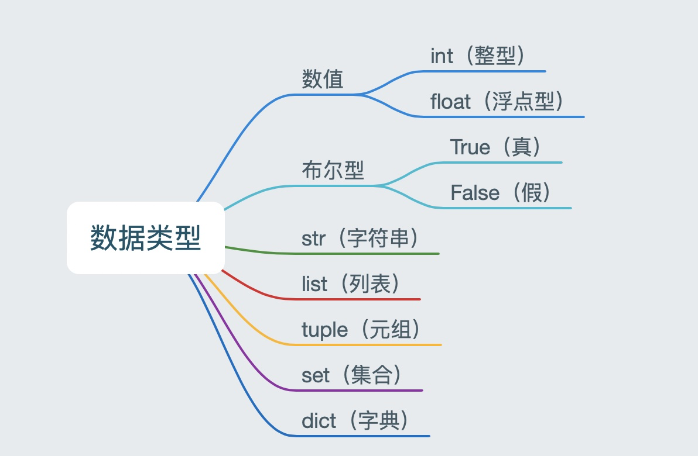

> `

```python
a = 1
print(type(a))  # <class 'int'> -- 整型

b = 1.1
print(type(b))  # <class 'float'> -- 浮点型

c = True
print(type(c))  # <class 'bool'> -- 布尔型

d = '12345'
print(type(d))  # <class 'str'> -- 字符串

e = [10, 20, 30]
print(type(e))  # <class 'list'> -- 列表

f = (10, 20, 30)
print(type(f))  # <class 'tuple'> -- 元组

h = {10, 20, 30}
print(type(h))  # <class 'set'> -- 集合

g = {'name': 'TOM', 'age': 20}
print(type(g))  # <class 'dict'> -- 字典
```

# 总结

- 定义变量的语法

``` python
变量名 = 值
```

- 标识符
  - 由数字、字母、下划线组成
  - 不能数字开头
  - 不能使用内置关键字
  - 严格区分大小写
- 数据类型
  - 整型：int
  - 浮点型：float
  - 字符串：str
  - 布尔型：bool
  - 元组：tuple
  - 集合：set
  - 字典：dict

格式化字符串除了%s，还可以写为`f'{表达式}'`

```python
age = 18 
name = 'TOM'
weight = 75.5
student_id = 1

# 我的名字是TOM
print('我的名字是%s' % name)

# 我的学号是0001
print('我的学号是%4d' % student_id)

# 我的体重是75.50公斤
print('我的体重是%.2f公斤' % weight)

# 我的名字是TOM，今年18岁了
print('我的名字是%s，今年%d岁了' % (name, age))

# 我的名字是TOM，明年19岁了
print('我的名字是%s，明年%d岁了' % (name, age + 1))

# 我的名字是TOM，明年19岁了
print(f'我的名字是{name}, 明年{age + 1}岁了')
```

> f-格式化字符串是Python3.6中新增的格式化方法，该方法更简单易读。

# 总结

- 格式化符号
  - %s：格式化输出字符串
  - %d：格式化输出整数
  - %f：格式化输出浮点数
- f-字符串
  - f'{表达式}'
- 转义字符
  - \n：换行
  - \t：制表符
- print结束符

``` python
print('内容', end="")
```

# 总结

- 输入功能
  - input('提示文字')
- 输入的特点
  - 一般将input接收的数据存储到变量
  - input接收的任何数据默认都是字符串数据类型

# 二. 转换数据类型的函数

|          函数          |                        说明                         |
| :--------------------: | :-------------------------------------------------: |
|  ==int(x [,base ])==   |                  将x转换为一个整数                  |
|     ==float(x )==      |                 将x转换为一个浮点数                 |
| complex(real [,imag ]) |        创建一个复数，real为实部，imag为虚部         |
|      ==str(x )==       |                将对象 x 转换为字符串                |
|        repr(x )        |             将对象 x 转换为表达式字符串             |
|     ==eval(str )==     | 用来计算在字符串中的有效Python表达式,并返回一个对象 |
|     ==tuple(s )==      |               将序列 s 转换为一个元组               |
|      ==list(s )==      |               将序列 s 转换为一个列表               |
|        chr(x )         |           将一个整数转换为一个Unicode字符           |
|        ord(x )         |           将一个字符转换为它的ASCII整数值           |
|        hex(x )         |         将一个整数转换为一个十六进制字符串          |
|        oct(x )         |          将一个整数转换为一个八进制字符串           |
|        bin(x )         |          将一个整数转换为一个二进制字符串           |

# 四. 实验

``` python
# 1. float() -- 转换成浮点型
num1 = 1
print(float(num1))
print(type(float(num1)))

# 2. str() -- 转换成字符串类型
num2 = 10
print(type(str(num2)))

# 3. tuple() -- 将一个序列转换成元组
list1 = [10, 20, 30]
print(tuple(list1))
print(type(tuple(list1)))


# 4. list() -- 将一个序列转换成列表
t1 = (100, 200, 300)
print(list(t1))
print(type(list(t1)))

# 5. eval() -- 将字符串中的数据转换成Python表达式原本类型
str1 = '10'
str2 = '[1, 2, 3]'
str3 = '(1000, 2000, 3000)'
print(type(eval(str1)))
print(type(eval(str2)))
print(type(eval(str3)))
```

## 1. 算数运算符

| 运算符 |  描述  | 实例                                                  |
| :----: | :----: | ----------------------------------------------------- |
|   +    |   加   | 1 + 1 输出结果为 2                                    |
|   -    |   减   | 1-1 输出结果为 0                                      |
|   *    |   乘   | 2 * 2 输出结果为 4                                    |
|   /    |   除   | 10 / 2 输出结果为 5                                   |
|   //   |  整除  | 9 // 4 输出结果为2                                    |
|   %    |  取余  | 9 % 4 输出结果为 1                                    |
|   **   |  指数  | 2 ** 4 输出结果为 16，即 2 * 2 * 2 * 2                |
|   ()   | 小括号 | 小括号用来提高运算优先级，即 (1 + 2) * 3 输出结果为 9 |

> 注意：

- 混合运算优先级顺序：`()`高于 `**` 高于 `*` `/` `//` `%` 高于 `+` `-`

## 2. 赋值运算符

| 运算符 | 描述 | 实例                                |
| ------ | ---- | ----------------------------------- |
| =      | 赋值 | 将`=`右侧的结果赋值给等号左侧的变量 |

- 


## 3. 复合赋值运算符 

| 运算符 | 描述           | 实例                       |
| ------ | -------------- | -------------------------- |
| +=     | 加法赋值运算符 | c += a 等价于 c = c + a    |
| -=     | 减法赋值运算符 | c -= a 等价于 c = c- a     |
| *=     | 乘法赋值运算符 | c *= a 等价于 c = c * a    |
| /=     | 除法赋值运算符 | c /= a 等价于 c = c / a    |
| //=    | 整除赋值运算符 | c //= a 等价于 c = c // a  |
| %=     | 取余赋值运算符 | c %= a 等价于 c = c % a    |
| **=    | 幂赋值运算符   | c ** = a 等价于 c = c ** a |

```python
a = 100
a += 1
# 输出101  a = a + 1,最终a = 100 + 1
print(a)

b = 2
b *= 3
# 输出6  b = b * 3,最终b = 2 * 3
print(b)

c = 10
c += 1 + 2
# 输出13, 先算运算符右侧1 + 2 = 3， c += 3 , 推导出c = 10 + 3
print(c)
```


## 4. 比较运算符

比较运算符也叫关系运算符， 通常用来判断。

| 运算符 | 描述                                                         | 实例                                                        |
| ------ | ------------------------------------------------------------ | ----------------------------------------------------------- |
| ==     | 判断相等。如果两个操作数的结果相等，则条件结果为真(True)，否则条件结果为假(False) | 如a=3,b=3，则（a == b) 为 True                              |
| !=     | 不等于 。如果两个操作数的结果不相等，则条件为真(True)，否则条件结果为假(False) | 如a=3,b=3，则（a == b) 为 True如a=1,b=3，则(a != b) 为 True |
| >      | 运算符左侧操作数结果是否大于右侧操作数结果，如果大于，则条件为真，否则为假 | 如a=7,b=3，则(a > b) 为 True                                |
| <      | 运算符左侧操作数结果是否小于右侧操作数结果，如果小于，则条件为真，否则为假 | 如a=7,b=3，则(a < b) 为 False                               |
| >=     | 运算符左侧操作数结果是否大于等于右侧操作数结果，如果大于，则条件为真，否则为假 | 如a=7,b=3，则(a < b) 为 False如a=3,b=3，则(a >= b) 为 True  |
| <=     | 运算符左侧操作数结果是否小于等于右侧操作数结果，如果小于，则条件为真，否则为假 | 如a=3,b=3，则(a <= b) 为 True                               |

```python
a = 7
b = 5
print(a == b)  # False
print(a != b)  # True
print(a < b)   # False
print(a > b)   # True
print(a <= b)  # False
print(a >= b)  # True
```

## 5. 逻辑运算符

| 运算符 | 逻辑表达式 | 描述                                                         | 实例                                     |
| ------ | ---------- | ------------------------------------------------------------ | ---------------------------------------- |
| and    | x and y    | 布尔"与"：如果 x 为 False，x and y 返回 False，否则它返回 y 的值。 | True and False， 返回 False。            |
| or     | x or y     | 布尔"或"：如果 x 是 True，它返回 True，否则它返回 y 的值。   | False or True， 返回 True。              |
| not    | not x      | 布尔"非"：如果 x 为 True，返回 False 。如果 x 为 False，它返回 True。 | not True 返回 False, not False 返回 True |

```python
a = 1
b = 2
c = 3
print((a < b) and (b < c))  # True
print((a > b) and (b < c))  # False
print((a > b) or (b < c))   # True
print(not (a > b))          # True
```

### 5.1 拓展

数字之间的逻辑运算

``` python
a = 0
b = 1
c = 2

# and运算符，只要有一个值为0，则结果为0，否则结果为最后一个非0数字
print(a and b)  # 0
print(b and a)  # 0
print(a and c)  # 0
print(c and a)  # 0
print(b and c)  # 2
print(c and b)  # 1

# or运算符，只有所有值为0结果才为0，否则结果为第一个非0数字
print(a or b)  # 1
print(a or c)  # 2
print(b or c)  # 1
```

# 总结

- 算数运算的优先级
  - 混合运算优先级顺序：`()`高于 `**` 高于 `*` `/` `//` `%` 高于 `+` `-`
- 赋值运算符
  - =
- 复合赋值运算符
  - +=
  - -=
  - 优先级
    1. 先算复合赋值运算符右侧的表达式
    2. 再算复合赋值运算的算数运算
    3. 最后算赋值运算
- 比较运算符
  - 判断相等： == 
  - 大于等于： >=
  - 小于等于：<=
  - 不等于： !=
- 逻辑运算符
  - 与： and
  - 或：or
  - 非：not

# 二. if 语法

## 2.1 语法

``` python
if 条件:
    条件成立执行的代码1
    条件成立执行的代码2
    ......
```


## 2.2 快速体验

``` python
if True:
    print('条件成立执行的代码1')
    print('条件成立执行的代码2')

# 下方的代码没有缩进到if语句块，所以和if条件无关
print('我是无论条件是否成立都要执行的代码')
```

执行结果如下：

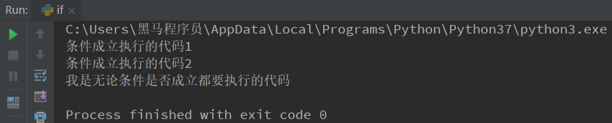


# 三. 实例：上网

需求分析：如果用户年龄大于等于18岁，即成年，输出"已经成年，可以上网"。

## 3.1 简单版

``` python
age = 20
if age >= 18:
    print('已经成年，可以上网')

print('系统关闭')
```

## 3.2 进阶版

新增需求：用户可以输出自己的年龄，然后系统进行判断是否成年，成年则输出"您的年龄是'用户输入的年龄'，已经成年，可以上网"。

``` python
# input接受用户输入的数据是字符串类型，条件是age和整型18做判断，所以这里要int转换数据类型
age = int(input('请输入您的年龄：'))

if age >= 18:
    print(f'您的年龄是{age},已经成年，可以上网')


print('系统关闭')
```


# 四. if...else...

作用：条件成立执行if下方的代码; 条件不成立执行else下方的代码。

> 思考：网吧上网的实例，如果成年，允许上网，如果不成年呢？是不是应该回复用户不能上网？

## 4.1 语法

``` python
if 条件:
    条件成立执行的代码1
    条件成立执行的代码2
    ......
else:
    条件不成立执行的代码1
    条件不成立执行的代码2
    ......
```

## 4.2 实用版：网吧上网

``` python
age = int(input('请输入您的年龄：'))

if age >= 18:
    print(f'您的年龄是{age},已经成年，可以上网')
else:
    print(f'您的年龄是{age},未成年，请自行回家写作业')

print('系统关闭')
```

> 注意：如果条件成立执行了某些代码，那么其他的情况的代码将不会执行。

# 五、多重判断

> 思考：中国合法工作年龄为18-60岁，即如果年龄小于18的情况为童工，不合法；如果年龄在18-60岁之间为合法工龄；大于60岁为法定退休年龄。

## 5.1 语法

``` python
if 条件1:
    条件1成立执行的代码1
    条件1成立执行的代码2
    ......
elif 条件2：
	条件2成立执行的代码1
    条件2成立执行的代码2
    ......
......
else:
    以上条件都不成立执行执行的代码
```

> 多重判断也可以和else配合使用。一般else放到整个if语句的最后，表示以上条件都不成立的时候执行的代码。


## 5.2 实例：工龄判断

``` python
age = int(input('请输入您的年龄：'))
if age < 18:
    print(f'您的年龄是{age},童工一枚')
elif (age >= 18) and (age <= 60):
    print(f'您的年龄是{age},合法工龄')
elif age > 60:
    print(f'您的年龄是{age},可以退休')
```

> 拓展：`age >= 18 and age <= 60`可以化简为`18 <= age <= 60`。

# 六、if嵌套

> 思考：坐公交：如果有钱可以上车，没钱不能上车；上车后如果有空座，则可以坐下；如果没空座，就要站着。怎么书写程序？

## 6.1 语法

``` python
if 条件1：
	条件1成立执行的代码
    条件1成立执行的代码
    
    if 条件2：
    	条件2成立执行的代码
        条件2成立执行的代码
    
```

> 注意：条件2的if也是处于条件1成立执行的代码的缩进关系内部。


## 6.2 实例：坐公交

### 6.2.1 判断是否能上车

``` python
"""
1. 如果有钱，则可以上车
    2. 上车后，如果有空座，可以坐下
    上车后，如果没有空座，则站着等空座位
如果没钱，不能上车
"""
# 假设用 money = 1 表示有钱, money = 0表示没有钱
money = 1
if money == 1:
    print('土豪，不差钱，顺利上车')
else:
    print('没钱，不能上车，追着公交车跑')
```


### 6.2.2 判断是否能坐下

``` python
"""
1. 如果有钱，则可以上车
    2. 上车后，如果有空座，可以坐下
    上车后，如果没有空座，则站着等空座位
如果没钱，不能上车
"""
# 假设用 money = 1 表示有钱, money = 0表示没有钱; seat = 1 表示有空座，seat = 0 表示没有空座
money = 1
seat = 0
if money == 1:
    print('土豪，不差钱，顺利上车')
    if seat == 1:
        print('有空座，可以坐下')
    else:
        print('没有空座，站等')
else:
    print('没钱，不能上车，追着公交车跑')
```

# 七. 应用：猜拳游戏

需求分析：

- 参与游戏的角色

  - 玩家
    - 手动出拳
  - 电脑
    - 随机出拳

- 判断输赢

  - 玩家获胜

  | 玩家 | 电脑 |
  | ---- | ---- |
  | 石头 | 剪刀 |
  | 剪刀 | 布   |
  | 布   | 石头 |

  - 平局
    - 玩家出拳 和 电脑出拳相同
  - 电脑获胜

随机做法：

 	1. 导出random模块
 	2. random.randint(开始,结束)

``` python
"""
提示：0-石头，1-剪刀，2-布
1. 出拳
玩家输入出拳
电脑随机出拳

2. 判断输赢
玩家获胜
平局
电脑获胜
"""

# 导入random模块
import random

# 计算电脑出拳的随机数字
computer = random.randint(0, 2)
print(computer)

player = int(input('请出拳：0-石头，1-剪刀，2-布：'))

# 玩家胜利 p0:c1 或 p1:c2 或 p2:c0
if (player == 0 and computer == 1) or (player == 1 and computer == 2) or (player == 2 and computer == 0):
    print('玩家获胜')

# 平局：玩家 == 电脑
elif player == computer:
    print('平局')
else:
    print('电脑获胜')
```

# 八.  三目运算符

三目运算符也叫三元运算符。

语法如下：

``` python
值1 if 条件 else 值2
```

快速体验：

``` python
a = 1
b = 2

c = a if a > b else b
print(c)
```


# 二. while的语法

``` python
while 条件:
    条件成立重复执行的代码1
    条件成立重复执行的代码2
    ......
```

## 2.1 快速体验

需求：复现重复执行100次`print('媳妇儿，我错了')`（输出更简洁一些，我们这里设置5次）。

分析：初始值是0次，终点是5次，重复做的事情输出“媳妇儿， 我错了”。

``` python
# 循环的计数器
i = 0
while i < 5:
    print('媳妇儿，我错了')
    i += 1

print('任务结束')
```

# 三. while的应用

## 3.1 应用一：计算1-100累加和

分析：1-100的累加和，即1 + 2 + 3 + 4 +….，即前两个数字的相加结果 + 下一个数字( 前一个数字 + 1)。

``` python
i = 1
result = 0
while i <= 100:
    result += i
    i += 1

# 输出5050
print(result)
```

> 注意：为了验证程序的准确性，可以先改小数值，验证结果正确后，再改成1-100做累加。

## 3.2 应用二：计算1-100偶数累加和

分析：1-100的偶数和，即 2 + 4 + 6 + 8....，得到偶数的方法如下：

- 偶数即是和2取余结果为0的数字，可以加入条件语句判断是否为偶数，为偶数则累加
- 初始值为0 / 2 , 计数器每次累加2

### 3.2.1 方法一：条件判断和2取余数则累加

``` python
# 方法一：条件判断和2取余数为0则累加计算
i = 1
result = 0
while i <= 100:
    if i % 2 == 0:
        result += i
    i += 1

# 输出2550
print(result)
```

### 3.2.2 方法二：计数器控制

``` python
# 方法二：计数器控制增量为2
i = 0
result = 0
while i <= 100:
    result += i
    i += 2

# 输出2550
print(result)
```

# 四、break和continue

break和continue是循环中满足一定条件退出循环的两种不同方式。

## 4.1 理解

举例：一共吃5个苹果，吃完第一个，吃第二个…，这里"吃苹果"的动作是不是重复执行？

情况一：如果吃的过程中，吃完第三个吃饱了，则不需要再吃第4个和第五个苹果，即是吃苹果的动作停止，这里就是break控制循环流程，即==终止此循环==。

情况二：如果吃的过程中，吃到第三个吃出一个大虫子...,是不是这个苹果就不吃了，开始吃第四个苹果，这里就是continue控制循环流程，即==退出当前一次循环继而执行下一次循环代码==。

### 4.1.1 情况一：break

``` python
i = 1
while i <= 5:
    if i == 4:
        print(f'吃饱了不吃了')
        break
    print(f'吃了第{i}个苹果')
    i += 1
```

执行结果：

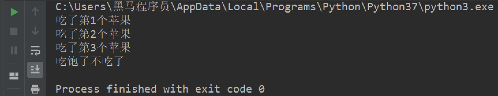

### 4.1.2 情况二：continue

``` python
i = 1
while i <= 5:
    if i == 3:
        print(f'大虫子，第{i}个不吃了')
        # 在continue之前一定要修改计数器，否则会陷入死循环
        i += 1
        continue
    print(f'吃了第{i}个苹果')
    i += 1
```

执行结果：

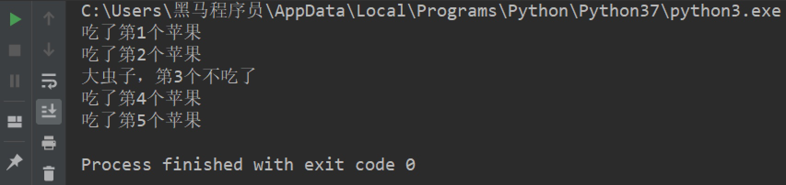

# 五. while循环嵌套

## 5.1 应用场景

故事梗概：有天女朋友又生气了，惩罚：说3遍“媳妇儿， 我错了”，这个程序是不是循环即可？但如果女朋友说：还要刷今天晚饭的碗，这个程序怎么书写？

``` python
while 条件:
    print('媳妇儿， 我错了')
print('刷晚饭的碗')
```

但如果女朋友还是生气，把这套惩罚要连续3天都执行，有如何书写程序？

``` python
while 条件:
    while 条件:
        print('媳妇儿， 我错了')
    print('刷晚饭的碗')
```

## 5.2 语法

``` python
while 条件1:
    条件1成立执行的代码
    ......
    while 条件2:
        条件2成立执行的代码
        ......
```

> 总结：所谓while循环嵌套，就是一个while里面嵌套一个while的写法，每个while和之前的基础语法是相同的。

## 5.3 快速体验：复现场景

### 5.3.1 代码

``` python
j = 0
while j < 3:
    i = 0
    while i < 3:
        print('媳妇儿，我错了')
        i += 1
    print('刷晚饭的碗')
    print('一套惩罚结束----------------')
    j += 1
```

### 5.3.2 执行结果

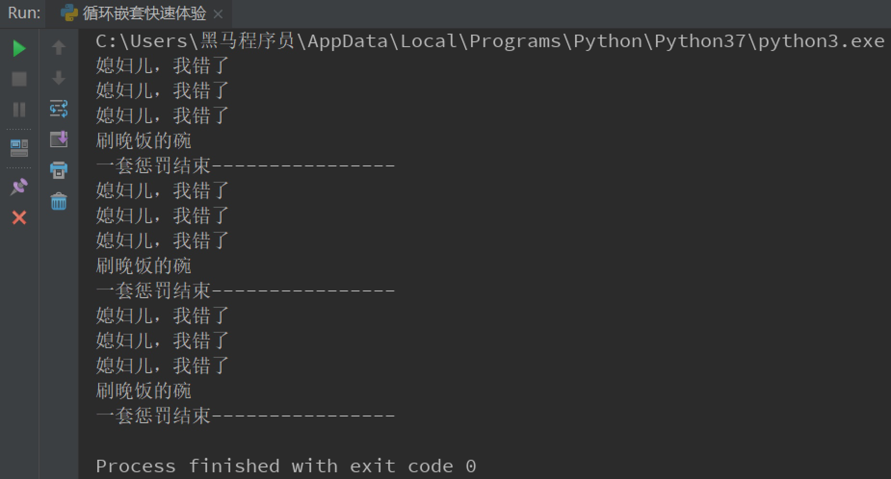

### 5.3.3 理解执行流程

当内部循环执行完成之后，再执行下一次外部循环的条件判断。

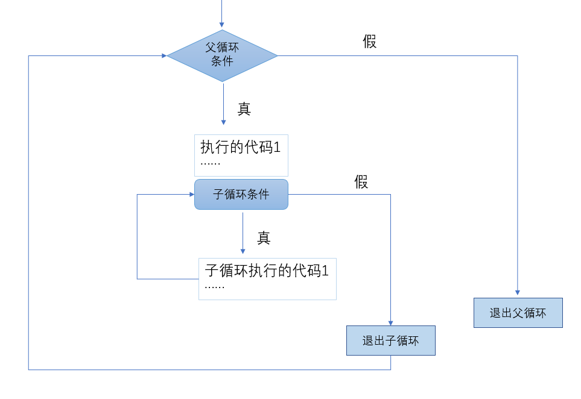

# 六. while循环嵌套应用

## 6.1 应用一：打印星号(正方形)

### 6.1.1 需求

``` html
*****
*****
*****
*****
*****
```

### 6.1.2 代码

分析：一行输出5个星号，重复打印5行

``` python
# 重复打印5行星星
j = 0
while j <= 4:
    # 一行星星的打印
    i = 0
    while i <= 4:
        # 一行内的星星不能换行，取消print默认结束符\n
        print('*', end='')
        i += 1
    # 每行结束要换行，这里借助一个空的print，利用print默认结束符换行
    print()
    j += 1
```

## 6.2 应用二：打印星号(三角形)

### 6.2.1 需求

``` html
*
**
***
****
*****
```

### 6.2.2 代码

分析：==一行输出星星的个数和行号是相等的==，每行：重复打印行号数字个星号，将打印行星号的命令重复执行5次实现打印5行。

``` python
# 重复打印5行星星
# j表示行号
j = 0
while j <= 4:
    # 一行星星的打印
    i = 0
    # i表示每行里面星星的个数，这个数字要和行号相等所以i要和j联动
    while i <= j:
        print('*', end='')
        i += 1
    print()
    j += 1
```

## 6.3 九九乘法表

### 6.3.1 执行结果

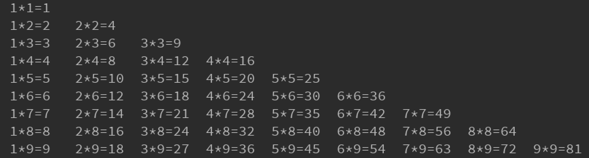

### 6.3.2 代码

``` python
# 重复打印9行表达式
j = 1
while j <= 9:
    # 打印一行里面的表达式 a * b = a*b
    i = 1
    while i <= j:
        print(f'{i}*{j}={j*i}', end='\t')
        i += 1
    print()
    j += 1
```

# 七、for循环

## 7.1 语法

``` python
for 临时变量 in 序列:
    重复执行的代码1
    重复执行的代码2
    ......
```

## 7.2 快速体验

``` python
str1 = 'itheima'
for i in str1:
    print(i)
```

执行结果：

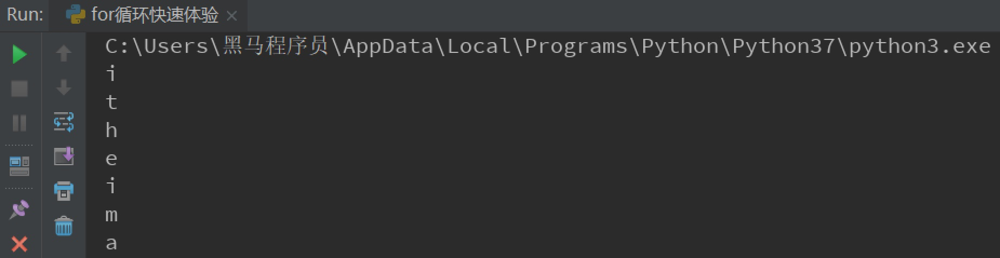

## 7.3 break

``` python
str1 = 'itheima'
for i in str1:
    if i == 'e':
        print('遇到e不打印')
        break
    print(i)
```

执行结果：

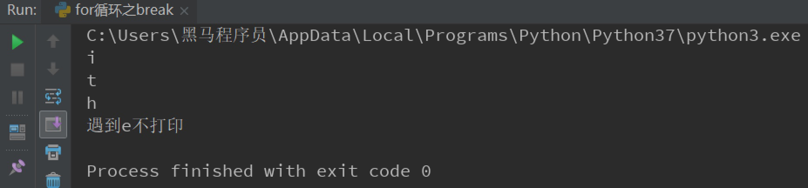

## 7.4 continue

```python
str1 = 'itheima'
for i in str1:
    if i == 'e':
        print('遇到e不打印')
        continue
    print(i)
```

执行结果：


# 八. else

循环可以和else配合使用，else下方缩进的代码指的是==当循环正常结束之后要执行的代码==。

## 8.1 while...else

需求：女朋友生气了，要惩罚：连续说5遍“媳妇儿，我错了”，如果道歉正常完毕女朋友就原谅我了，这个程序怎么写？

``` python
i = 1
while i <= 5:
    print('媳妇儿，我错了')
    i += 1
print('媳妇儿原谅我了...')
```

> 思考： 这个print是不是没有循环也能执行？

### 8.1.1 语法

``` python
while 条件:
    条件成立重复执行的代码
else:
    循环正常结束之后要执行的代码
```

### 8.1.2 示例

``` python
i = 1
while i <= 5:
    print('媳妇儿，我错了')
    i += 1
else:
    print('媳妇原谅我了，真开心，哈哈哈哈')
```

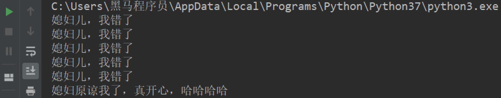

### 8.1.3 退出循环的方式

需求：女朋友生气，要求道歉5遍：媳妇儿，我错了。道歉到第三遍的时候，媳妇埋怨这一遍说的不真诚，是不是就是要退出循环了？这个退出有两种可能性：

- 更生气，不打算原谅，也不需要道歉了，程序如何书写？
- 只一遍不真诚，可以忍受，继续下一遍道歉，程序如何书写？

1. break

``` python
i = 1
while i <= 5:
    if i == 3:
        print('这遍说的不真诚')
        break
    print('媳妇儿，我错了')
    i += 1
else:
    print('媳妇原谅我了，真开心，哈哈哈哈')
```

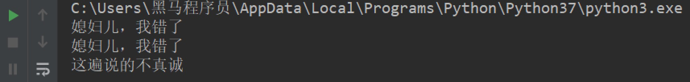

> 所谓else指的是循环正常结束之后要执行的代码，即如果是break终止循环的情况，else下方缩进的代码将不执行。

2. continue

``` python
i = 1
while i <= 5:
    if i == 3:
        print('这遍说的不真诚')
        i += 1
        continue
    print('媳妇儿，我错了')
    i += 1
else:
    print('媳妇原谅我了，真开心，哈哈哈哈')
```

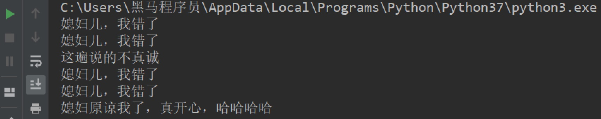

> 因为continue是退出当前一次循环，继续下一次循环，所以该循环在continue控制下是可以正常结束的，当循环结束后，则执行了else缩进的代码。

## 8.2 for...else

### 8.2.1 语法

``` python
for 临时变量 in 序列:
    重复执行的代码
    ...
else:
    循环正常结束之后要执行的代码
```

> 所谓else指的是循环正常结束之后要执行的代码，即如果是break终止循环的情况，else下方缩进的代码将不执行。

### 8.2.2 示例

``` python
str1 = 'itheima'
for i in str1:
    print(i)
else:
    print('循环正常结束之后执行的代码')
```

### 8.2.3 退出循环的方式

1. break终止循环

``` python
str1 = 'itheima'
for i in str1:
    if i == 'e':
        print('遇到e不打印')
        break
    print(i)
else:
    print('循环正常结束之后执行的代码')
```

执行结果：

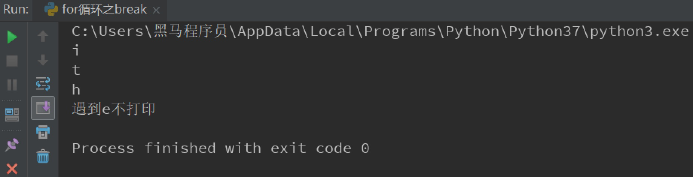

> 没有执行else缩进的代码。

2. continue控制循环

``` python
str1 = 'itheima'
for i in str1:
    if i == 'e':
        print('遇到e不打印')
        continue
    print(i)
else:
    print('循环正常结束之后执行的代码')
```

执行结果：

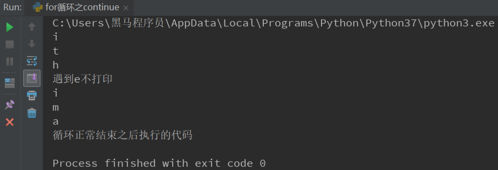

> 因为continue是退出当前一次循环，继续下一次循环，所以该循环在continue控制下是可以正常结束的，当循环结束后，则执行了else缩进的代码。


# 总结

- 循环的作用：控制代码重复执行
- while语法

``` python
while 条件:
    条件成立重复执行的代码1
    条件成立重复执行的代码2
    ......
```

- while循环嵌套语法

```python
while 条件1:
    条件1成立执行的代码
    ......
    while 条件2:
        条件2成立执行的代码
        ......
```

- for循环语法

``` python
for 临时变量 in 序列:
    重复执行的代码1
    重复执行的代码2
    ......
```

- break退出整个循环
- continue退出本次循环，继续执行下一次重复执行的代码
- else
  - while和for都可以配合else使用
  - else下方缩进的代码含义：当循环正常结束后执行的代码
  - break终止循环不会执行else下方缩进的代码
  - continue退出循环的方式执行else下方缩进的代码

# 总结

- if语句语法

``` python
if 条件:
    条件成立执行的代码
```

- if...else...

``` python
if 条件:
    条件成立执行的代码
else:
    条件不成立执行的代码
```

- 多重判断

``` python
if 条件1:
    条件1成立执行的代码
elif 条件2:
    条件2成立执行的代码
else:
    以上条件都不成立执行的代码
```

- if嵌套

``` python
if 条件1:
    条件1成立执行的代码
    if 条件2:
        条件2成立执行的代码
        ....
```


# 课程：字符串

# 目标

- 认识字符串
- 下标
- 切片
- 常用操作方法

# 一. 认识字符串

字符串是 Python 中最常用的数据类型。我们一般使用引号来创建字符串。创建字符串很简单，只要为变量分配一个值即可。

``` python
a = 'hello world'
b = "abcdefg"
print(type(a))
print(type(b))
```

> 注意：控制台显示结果为`<class 'str'>`， 即数据类型为str(字符串)。

## 1.1 字符串特征

- 一对引号字符串

``` python
name1 = 'Tom'
name2 = "Rose"
```


- 三引号字符串

``` python
name3 = ''' Tom '''
name4 = """ Rose """
a = ''' i am Tom, 
        nice to meet you! '''

b = """ i am Rose, 
        nice to meet you! """
```

> 注意：三引号形式的字符串支持换行。

> 思考：如果创建一个字符串` I'm Tom`?

``` python
c = "I'm Tom"
d = 'I\'m Tom'
```

## 1.2 字符串输出

``` python
print('hello world')

name = 'Tom'
print('我的名字是%s' % name)
print(f'我的名字是{name}')
```


## 1.3 字符串输入

在Python中，使用`input()`接收用户输入。

- 代码

``` python
name = input('请输入您的名字：')
print(f'您输入的名字是{name}')
print(type(name))

password = input('请输入您的密码：')
print(f'您输入的密码是{password}')
print(type(password))
```

- 输出结果

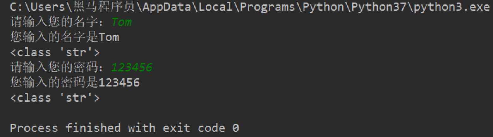


# 二、下标

`“下标”`又叫`“索引”`，就是编号。比如火车座位号，座位号的作用：按照编号快速找到对应的座位。同理，下标的作用即是通过下标快速找到对应的数据。


## 2.1 快速体验

需求：字符串`name = "abcdef"`，取到不同下标对应的数据。

- 代码

``` python
name = "abcdef"

print(name[1])
print(name[0])
print(name[2])
```

- 输出结果

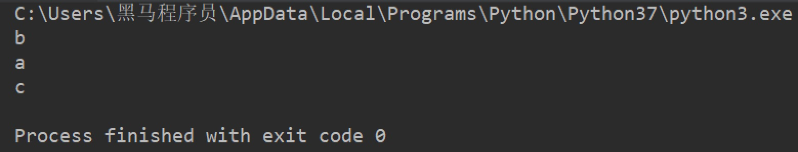

> 注意：下标从==0==开始。


# 三、切片

切片是指对操作的对象截取其中一部分的操作。**字符串、列表、元组**都支持切片操作。

## 3.1 语法

``` python
序列[开始位置下标:结束位置下标:步长]


个人梳理理解：  开始位置下标定位开始位置  ，  结束位置下标定位结束位置  ，步长正负决定方向、大小决定跨度
```

> 注意

 	1. 不包含结束位置下标对应的数据， 正负整数均可；
 	2. 步长是选取间隔，正负整数均可，默认步长为1。

## 3.2 体验

``` python
name = "abcdefg"

print(name[2:5:1])  # cde
print(name[2:5])  # cde
print(name[:5])  # abcde
print(name[1:])  # bcdefg
print(name[:])  # abcdefg
print(name[::2])  # aceg
print(name[:-1])  # abcdef, 负1表示倒数第一个数据
print(name[-4:-1])  # def
print(name[::-1])  # gfedcba
```


# 四、常用操作方法

字符串的常用操作方法有查找、修改和判断三大类。

## 4.1 查找

所谓字符串查找方法即是查找子串在字符串中的位置或出现的次数。

- find()：检测某个子串是否包含在这个字符串中，如果在返回这个子串开始的位置下标，否则则返回-1。

1. 语法

``` python
字符串序列.find(子串, 开始位置下标, 结束位置下标)
```

> 注意：开始和结束位置下标可以省略，表示在整个字符串序列中查找。

2. 快速体验

``` python
mystr = "hello world and itcast and itheima and Python"

print(mystr.find('and'))  # 12
print(mystr.find('and', 15, 30))  # 23
print(mystr.find('ands'))  # -1
```


- index()：检测某个子串是否包含在这个字符串中，如果在返回这个子串开始的位置下标，否则则报异常。

1. 语法

``` python
字符串序列.index(子串, 开始位置下标, 结束位置下标)
```

> 注意：开始和结束位置下标可以省略，表示在整个字符串序列中查找。

2. 快速体验

``` python
mystr = "hello world and itcast and itheima and Python"

print(mystr.index('and'))  # 12
print(mystr.index('and', 15, 30))  # 23
print(mystr.index('ands'))  # 报错
```


- rfind()： 和find()功能相同，但查找方向为==右侧==开始。
- rindex()：和index()功能相同，但查找方向为==右侧==开始。
- count()：返回某个子串在字符串中出现的次数

1. 语法

``` python
字符串序列.count(子串, 开始位置下标, 结束位置下标)
```

> 注意：开始和结束位置下标可以省略，表示在整个字符串序列中查找。

2. 快速体验

``` python
mystr = "hello world and itcast and itheima and Python"

print(mystr.count('and'))  # 3
print(mystr.count('ands'))  # 0
print(mystr.count('and', 0, 20))  # 1
```


## 4.2 修改

所谓修改字符串，指的就是通过函数的形式修改字符串中的数据。

- replace()：替换

1. 语法

``` python
字符串序列.replace(旧子串, 新子串, 替换次数)
```

> 注意：替换次数如果查出子串出现次数，则替换次数为该子串出现次数。

2. 快速体验

``` python
mystr = "hello world and itcast and itheima and Python"

# 结果：hello world he itcast he itheima he Python
print(mystr.replace('and', 'he'))
# 结果：hello world he itcast he itheima he Python
print(mystr.replace('and', 'he', 10))
# 结果：hello world and itcast and itheima and Python
print(mystr)
```

> 注意：数据按照是否能直接修改分为==可变类型==和==不可变类型==两种。字符串类型的数据修改的时候不能改变原有字符串，属于不能直接修改数据的类型即是不可变类型。


- split()：按照指定字符分割字符串。

1. 语法

``` python
字符串序列.split(分割字符, num)
```

> 注意：num表示的是分割字符出现的次数，即将来返回数据个数为num+1个。

2. 快速体验

``` python
mystr = "hello world and itcast and itheima and Python"

# 结果：['hello world ', ' itcast ', ' itheima ', ' Python']
print(mystr.split('and'))
# 结果：['hello world ', ' itcast ', ' itheima and Python']
print(mystr.split('and', 2))
# 结果：['hello', 'world', 'and', 'itcast', 'and', 'itheima', 'and', 'Python']
print(mystr.split(' '))
# 结果：['hello', 'world', 'and itcast and itheima and Python']
print(mystr.split(' ', 2))
```

> 注意：如果分割字符是原有字符串中的子串，分割后则丢失该子串。

- join()：用一个字符或子串合并字符串，即是将多个字符串合并为一个新的字符串。

1. 语法

``` python
字符或子串.join(多字符串组成的序列)
```

2. 快速体验

``` python
list1 = ['chuan', 'zhi', 'bo', 'ke']
t1 = ('aa', 'b', 'cc', 'ddd')
# 结果：chuan_zhi_bo_ke
print('_'.join(list1))
# 结果：aa...b...cc...ddd
print('...'.join(t1))
```


- capitalize()：将字符串第一个字符转换成大写。

``` python
mystr = "hello world and itcast and itheima and Python"

# 结果：Hello world and itcast and itheima and python
print(mystr.capitalize())
```

> 注意：capitalize()函数转换后，只字符串第一个字符大写，其他的字符全都小写。


- title()：将字符串每个单词首字母转换成大写。

``` python
mystr = "hello world and itcast and itheima and Python"

# 结果：Hello World And Itcast And Itheima And Python
print(mystr.title())
```


- lower()：将字符串中大写转小写。

``` python
mystr = "hello world and itcast and itheima and Python"

# 结果：hello world and itcast and itheima and python
print(mystr.lower())
```


- upper()：将字符串中小写转大写。

``` python
mystr = "hello world and itcast and itheima and Python"

# 结果：HELLO WORLD AND ITCAST AND ITHEIMA AND PYTHON
print(mystr.upper())
```


- lstrip()：删除字符串左侧空白字符。


- rstrip()：删除字符串右侧空白字符。

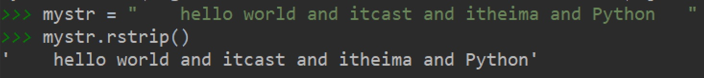


- strip()：删除字符串两侧空白字符。

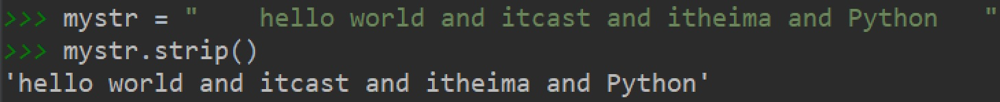


- ljust()：返回一个原字符串左对齐,并使用指定字符(默认空格)填充至对应长度 的新字符串。

1. 语法

``` python
字符串序列.ljust(长度, 填充字符)
```

2. 输出效果


- rjust()：返回一个原字符串右对齐,并使用指定字符(默认空格)填充至对应长度 的新字符串，语法和ljust()相同。
- center()：返回一个原字符串居中对齐,并使用指定字符(默认空格)填充至对应长度 的新字符串，语法和ljust()相同。


## 4.3 判断

所谓判断即是判断真假，返回的结果是布尔型数据类型：True 或 False。

- startswith()：检查字符串是否是以指定子串开头，是则返回 True，否则返回 False。如果设置开始和结束位置下标，则在指定范围内检查。

1. 语法

``` python
字符串序列.startswith(子串, 开始位置下标, 结束位置下标)
```

2. 快速体验

``` python
mystr = "hello world and itcast and itheima and Python   "

# 结果：True
print(mystr.startswith('hello'))

# 结果False
print(mystr.startswith('hello', 5, 20))
```


- endswith()：：检查字符串是否是以指定子串结尾，是则返回 True，否则返回 False。如果设置开始和结束位置下标，则在指定范围内检查。

1. 语法

``` python
字符串序列.endswith(子串, 开始位置下标, 结束位置下标)
```

2. 快速体验

``` python
mystr = "hello world and itcast and itheima and Python"

# 结果：True
print(mystr.endswith('Python'))

# 结果：False
print(mystr.endswith('python'))

# 结果：False
print(mystr.endswith('Python', 2, 20))
```


- isalpha()：如果字符串至少有一个字符并且所有字符都是字母则返回 True, 否则返回 False。

``` python
mystr1 = 'hello'
mystr2 = 'hello12345'

# 结果：True
print(mystr1.isalpha())

# 结果：False
print(mystr2.isalpha())
```


- isdigit()：如果字符串只包含数字则返回 True 否则返回 False。

``` python
mystr1 = 'aaa12345'
mystr2 = '12345'

# 结果： False
print(mystr1.isdigit())

# 结果：False
print(mystr2.isdigit())
```


- isalnum()：如果字符串至少有一个字符并且所有字符都是字母或数字则返 回 True,否则返回 False。

``` python
mystr1 = 'aaa12345'
mystr2 = '12345-'

# 结果：True
print(mystr1.isalnum())

# 结果：False
print(mystr2.isalnum())
```


- isspace()：如果字符串中只包含空白，则返回 True，否则返回 False。

``` python
mystr1 = '1 2 3 4 5'
mystr2 = '     '

# 结果：False
print(mystr1.isspace())

# 结果：True
print(mystr2.isspace())
```


# 五. 总结

- 下标
  - 计算机为数据序列中每个元素分配的从0开始的编号
- 切片

``` python
序列名[开始位置下标:结束位置下标:步长]
```

- 常用操作方法
  - find()
  - index()

# 课程：列表

# 目标

- 列表的应用场景
- 列表的格式
- 列表的常用操作
- 列表的循环遍历
- 列表的嵌套使用

# 一. 列表的应用场景

思考：有一个人的姓名(TOM)怎么书写存储程序？

答：变量。

思考：如果一个班级100位学生，每个人的姓名都要存储，应该如何书写程序？声明100个变量吗？

答：列表即可， 列表一次性可以存储多个数据。

# 二. 列表的格式

``` python
[数据1, 数据2, 数据3, 数据4......]
```

列表可以一次性存储多个数据，且可以为不同数据类型。

# 三. 列表的常用操作

列表的作用是一次性存储多个数据，程序员可以对这些数据进行的操作有：增、删、改、查。

## 3.1 查找

### 3.1.1 下标

``` python
name_list = ['Tom', 'Lily', 'Rose']

print(name_list[0])  # Tom
print(name_list[1])  # Lily
print(name_list[2])  # Rose
```

### 3.1.2 函数

- index()：返回指定数据所在位置的下标 。

1. 语法

``` python
列表序列.index(数据, 开始位置下标, 结束位置下标)
```

2. 快速体验

``` python
name_list = ['Tom', 'Lily', 'Rose']

print(name_list.index('Lily', 0, 2))  # 1
```

> 注意：如果查找的数据不存在则报错。

- count()：统计指定数据在当前列表中出现的次数。

``` python
name_list = ['Tom', 'Lily', 'Rose']

print(name_list.count('Lily'))  # 1
```

- len()：访问列表长度，即列表中数据的个数。

``` python
name_list = ['Tom', 'Lily', 'Rose']

print(len(name_list))  # 3
```


### 3.1.3 判断是否存在

- in：判断指定数据在某个列表序列，如果在返回True，否则返回False

``` python
name_list = ['Tom', 'Lily', 'Rose']

# 结果：True
print('Lily' in name_list)

# 结果：False
print('Lilys' in name_list)
```


- not in：判断指定数据不在某个列表序列，如果不在返回True，否则返回False

``` python
name_list = ['Tom', 'Lily', 'Rose']

# 结果：False
print('Lily' not in name_list)

# 结果：True
print('Lilys' not in name_list)
```

- 体验案例

需求：查找用户输入的名字是否已经存在。

``` python
name_list = ['Tom', 'Lily', 'Rose']

name = input('请输入您要搜索的名字：')

if name in name_list:
    print(f'您输入的名字是{name}, 名字已经存在')
else:
    print(f'您输入的名字是{name}, 名字不存在')
```


## 3.2 增加

作用：增加指定数据到列表中。

- append()：列表结尾追加数据。

1. 语法

``` python
列表序列.append(数据)
```

2. 体验

``` python
name_list = ['Tom', 'Lily', 'Rose']

name_list.append('xiaoming')

# 结果：['Tom', 'Lily', 'Rose', 'xiaoming']
print(name_list)
```


> 列表追加数据的时候，直接在原列表里面追加了指定数据，即修改了原列表，故列表为可变类型数据。

3. 注意点

如果append()追加的数据是一个序列，则追加整个序列到列表

``` python
name_list = ['Tom', 'Lily', 'Rose']

name_list.append(['xiaoming', 'xiaohong'])

# 结果：['Tom', 'Lily', 'Rose', ['xiaoming', 'xiaohong']]
print(name_list)
```


- extend()：列表结尾追加数据，如果数据是一个序列，则将这个序列的数据逐一添加到列表。

1. 语法

```python
列表序列.extend(数据)
```

2. 快速体验

   2.1 单个数据

```python
name_list = ['Tom', 'Lily', 'Rose']

name_list.extend('xiaoming')

# 结果：['Tom', 'Lily', 'Rose', 'x', 'i', 'a', 'o', 'm', 'i', 'n', 'g']
print(name_list)
```

​	2.2 序列数据

```python
name_list = ['Tom', 'Lily', 'Rose']

name_list.extend(['xiaoming', 'xiaohong'])

# 结果：['Tom', 'Lily', 'Rose', 'xiaoming', 'xiaohong']
print(name_list)
```


- insert()：指定位置新增数据。

1. 语法

``` python
列表序列.insert(位置下标, 数据)
```

2. 快速体验

``` python
name_list = ['Tom', 'Lily', 'Rose']

name_list.insert(1, 'xiaoming')

# 结果：['Tom', 'xiaoming', 'Lily', 'Rose']
print(name_list)
```


## 3.3 删除

- del

1. 语法

``` python
del 目标
```

2. 快速体验

   2.1 删除列表

``` python
name_list = ['Tom', 'Lily', 'Rose']

# 结果：报错提示：name 'name_list' is not defined
del name_list
print(name_list)
```

​	2.2 删除指定数据

``` python
name_list = ['Tom', 'Lily', 'Rose']

del name_list[0]

# 结果：['Lily', 'Rose']
print(name_list)
```


- pop()：删除指定下标的数据(默认为最后一个)，并返回该数据。

1. 语法

``` python
列表序列.pop(下标)
```

2. 快速体验

``` python
name_list = ['Tom', 'Lily', 'Rose']

del_name = name_list.pop(1)

# 结果：Lily
print(del_name)

# 结果：['Tom', 'Rose']
print(name_list)
```


- remove()：移除列表中某个数据的第一个匹配项。

1. 语法

``` python
列表序列.remove(数据)
```

2. 快速体验

``` python
name_list = ['Tom', 'Lily', 'Rose']

name_list.remove('Rose')

# 结果：['Tom', 'Lily']
print(name_list)
```


- clear()：清空列表

``` python
name_list = ['Tom', 'Lily', 'Rose']

name_list.clear()
print(name_list) # 结果： []
```


## 3.4 修改

- 修改指定下标数据

``` python
name_list = ['Tom', 'Lily', 'Rose']

name_list[0] = 'aaa'

# 结果：['aaa', 'Lily', 'Rose']
print(name_list)
```


- 逆置：reverse()

``` python
num_list = [1, 5, 2, 3, 6, 8]

num_list.reverse()

# 结果：[8, 6, 3, 2, 5, 1]
print(num_list)
```


- 排序：sort()

1. 语法

``` python
列表序列.sort( key=None, reverse=False)
```

> 注意：reverse表示排序规则，**reverse = True** 降序， **reverse = False** 升序（默认）

2. 快速体验

``` python
num_list = [1, 5, 2, 3, 6, 8]

num_list.sort()

# 结果：[1, 2, 3, 5, 6, 8]
print(num_list)
```


## 3.5 复制

函数：copy()

``` python
name_list = ['Tom', 'Lily', 'Rose']

name_li2 = name_list.copy()

# 结果：['Tom', 'Lily', 'Rose']
print(name_li2)
```


# 四. 列表的循环遍历

需求：依次打印列表中的各个数据。

## 4.1 while

- 代码

``` python
name_list = ['Tom', 'Lily', 'Rose']

i = 0
while i < len(name_list):
    print(name_list[i])
    i += 1
```

- 执行结果


## 4.2 for

- 代码

``` python
name_list = ['Tom', 'Lily', 'Rose']

for i in name_list:
    print(i)
```


- 执行结果


# 五. 列表嵌套

所谓列表嵌套指的就是一个列表里面包含了其他的子列表。

应用场景：要存储班级一、二、三三个班级学生姓名，且每个班级的学生姓名在一个列表。

``` python
name_list = [['小明', '小红', '小绿'], ['Tom', 'Lily', 'Rose'], ['张三', '李四', '王五']]
```

> 思考： 如何查找到数据"李四"？

``` python
# 第一步：按下标查找到李四所在的列表
print(name_list[2])

# 第二步：从李四所在的列表里面，再按下标找到数据李四
print(name_list[2][1])
```

# 六. 综合应用 -- 随机分配办公室

需求：有三个办公室，8位老师，8位老师随机分配到3个办公室


# 七. 总结

- 列表的格式

``` python
[数据1, 数据2, 数据3]
```

- 常用操作方法
  - index()
  - len()
  - append()
  - pop()
  - remove()
- 列表嵌套

``` python
name_list = [['小明', '小红', '小绿'], ['Tom', 'Lily', 'Rose'], ['张三', '李四', '王五']]
name_list[2][1]
```


一个元组可以存储多个数据，元组内的数据是不能修改的。

# 二. 定义元组

元组特点：定义元组使用==小括号==，且==逗号==隔开各个数据，数据可以是不同的数据类型。

``` python
# 多个数据元组
t1 = (10, 20, 30)

# 单个数据元组
t2 = (10,)
```

> 注意：如果定义的元组只有一个数据，那么这个数据后面也好添加逗号，否则数据类型为唯一的这个数据的数据类型

``` python
t2 = (10,)
print(type(t2))  # tuple

t3 = (20)
print(type(t3))  # int

t4 = ('hello')
print(type(t4))  # str
```


# 三. 元组的常见操作

元组数据不支持修改，只支持查找，具体如下：

- 按下标查找数据

``` python
tuple1 = ('aa', 'bb', 'cc', 'bb')
print(tuple1[0])  # aa
```


- index()：查找某个数据，如果数据存在返回对应的下标，否则报错，语法和列表、字符串的index方法相同。

``` python
tuple1 = ('aa', 'bb', 'cc', 'bb')
print(tuple1.index('aa'))  # 0
```


- count()：统计某个数据在当前元组出现的次数。

``` python
tuple1 = ('aa', 'bb', 'cc', 'bb')
print(tuple1.count('bb'))  # 2
```


- len()：统计元组中数据的个数。

``` python
tuple1 = ('aa', 'bb', 'cc', 'bb')
print(len(tuple1))  # 4
```

> 注意：元组内的直接数据如果修改则立即报错

``` python
tuple1 = ('aa', 'bb', 'cc', 'bb')
tuple1[0] = 'aaa'
```

> 但是如果元组里面有列表，修改列表里面的数据则是支持的，故自觉很重要。

``` python
tuple2 = (10, 20, ['aa', 'bb', 'cc'], 50, 30)
print(tuple2[2])  # 访问到列表

# 结果：(10, 20, ['aaaaa', 'bb', 'cc'], 50, 30)
tuple2[2][0] = 'aaaaa'
print(tuple2)
```


# 四. 总结

- 定义元组

``` python
t1 = (10, 20, 30)

t2 = (10,)
```

- 常用操作方法
  - index()
  - len()

# 课程：字典

# 目标

- 字典的应用场景
- 创建字典的语法
- 字典常见操作
- 字典的循环遍历

# 一. 字典的应用场景

思考1： 如果有多个数据，例如：'Tom', '男', 20，如何快速存储？

答：列表

``` python
list1 = ['Tom', '男', 20]
```

思考2：如何查找到数据'Tom'？

答：查找到下标为0的数据即可。

``` python
list1[0]
```

思考3：如果将来数据顺序发生变化，如下所示，还能用`list1[0]`访问到数据'Tom'吗？。

``` python
list1 = ['男', 20, 'Tom']
```

答：不能，数据'Tom'此时下标为2。

思考4：数据顺序发生变化，每个数据的下标也会随之变化，如何保证数据顺序变化前后能使用同一的标准查找数据呢？

答：字典，字典里面的数据是以==键值对==形式出现，字典数据和数据顺序没有关系，即字典不支持下标，后期无论数据如何变化，只需要按照对应的键的名字查找数据即可。


# 二. 创建字典的语法

字典特点：

- 符号为==大括号==
- 数据为==键值对==形式出现
- 各个键值对之间用==逗号==隔开

``` python
# 有数据字典
dict1 = {'name': 'Tom', 'age': 20, 'gender': '男'}

# 空字典
dict2 = {}

dict3 = dict()
```

> 注意：一般称冒号前面的为键(key)，简称k；冒号后面的为值(value)，简称v。

# 三. 字典常见操作

## 3.1 增

写法：==字典序列[key] = 值==

> 注意：如果key存在则修改这个key对应的值；如果key不存在则新增此键值对。

``` python
dict1 = {'name': 'Tom', 'age': 20, 'gender': '男'}

dict1['name'] = 'Rose'
# 结果：{'name': 'Rose', 'age': 20, 'gender': '男'}
print(dict1)

dict1['id'] = 110

# {'name': 'Rose', 'age': 20, 'gender': '男', 'id': 110}
print(dict1)
```

> 注意：字典为可变类型。


## 3.2 删

- del() / del：删除字典或删除字典中指定键值对。

``` python
dict1 = {'name': 'Tom', 'age': 20, 'gender': '男'}

del dict1['gender']
# 结果：{'name': 'Tom', 'age': 20}
print(dict1)
```


- clear()：清空字典

``` python
dict1 = {'name': 'Tom', 'age': 20, 'gender': '男'}

dict1.clear()
print(dict1)  # {}
```


## 3.3 改

写法：==字典序列[key] = 值==

> 注意：如果key存在则修改这个key对应的值 ；如果key不存在则新增此键值对。

## 3.4 查

### 3.4.1 key值查找

``` python
dict1 = {'name': 'Tom', 'age': 20, 'gender': '男'}
print(dict1['name'])  # Tom
print(dict1['id'])  # 报错
```

> 如果当前查找的key存在，则返回对应的值；否则则报错。


### 3.4.2 get()

- 语法

``` python
字典序列.get(key, 默认值)
```

> 注意：如果当前查找的key不存在则返回第二个参数(默认值)，如果省略第二个参数，则返回None。

- 快速体验

``` python 
dict1 = {'name': 'Tom', 'age': 20, 'gender': '男'}
print(dict1.get('name'))  # Tom
print(dict1.get('id', 110))  # 110
print(dict1.get('id'))  # None
```

### 3.4.3 keys()

``` python
dict1 = {'name': 'Tom', 'age': 20, 'gender': '男'}
print(dict1.keys())  # dict_keys(['name', 'age', 'gender'])
```


### 3.4.4 values()

``` python
dict1 = {'name': 'Tom', 'age': 20, 'gender': '男'}
print(dict1.values())  # dict_values(['Tom', 20, '男'])
```


### 3.4.5 items()

``` python
dict1 = {'name': 'Tom', 'age': 20, 'gender': '男'}
print(dict1.items())  # dict_items([('name', 'Tom'), ('age', 20), ('gender', '男')])
```


# 四. 字典的循环遍历

## 4.1 遍历字典的key

``` python
dict1 = {'name': 'Tom', 'age': 20, 'gender': '男'}
for key in dict1.keys():
    print(key)
```

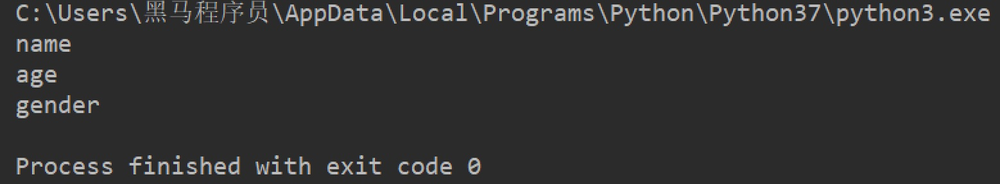


## 4.2 遍历字典的value

``` python
dict1 = {'name': 'Tom', 'age': 20, 'gender': '男'}
for value in dict1.values():
    print(value)
```


## 4.3 遍历字典的元素

``` python
dict1 = {'name': 'Tom', 'age': 20, 'gender': '男'}
for item in dict1.items():
    print(item)
```


## 4.4 遍历字典的键值对

``` python
dict1 = {'name': 'Tom', 'age': 20, 'gender': '男'}
for key, value in dict1.items():
    print(f'{key} = {value}')
```

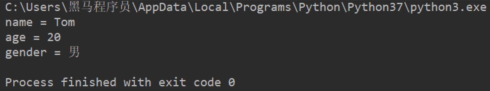


# 五. 总结

- 定义字典

``` python
dict1 = {'name': 'Python', 'age': 30}

dict2 = {}

dict3 = dict()
```

- 常见操作
  - 增/改

``` python
字典序列[key] = 值
```

- 查找
  - 字典序列[key]
  - keys()
  - values()
  - items()

# 课程：集合

# 目标

- 创建集合
- 集合数据的特点
- 集合的常见操作


# 一. 创建集合

创建集合使用`{}`或`set()`， 但是如果要创建空集合只能使用`set()`，因为`{}`用来创建空字典。

``` python
s1 = {10, 20, 30, 40, 50}
print(s1)

s2 = {10, 30, 20, 10, 30, 40, 30, 50}
print(s2)

s3 = set('abcdefg')
print(s3)

s4 = set()
print(type(s4))  # set

s5 = {}
print(type(s5))  # dict
```

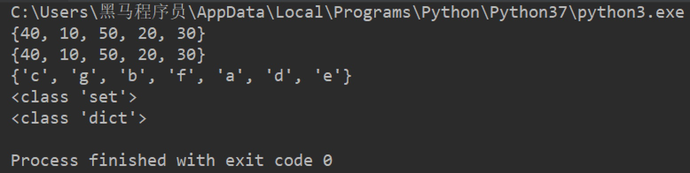

> 特点：
>
> 1. 集合可以去掉重复数据；
> 2. 集合数据是无序的，故不支持下标


# 二. 集合常见操作方法

## 2.1 增加数据

- add()

``` python
s1 = {10, 20}
s1.add(100)
s1.add(10)
print(s1)  # {100, 10, 20}
```

> 因为集合有去重功能，所以，当向集合内追加的数据是当前集合已有数据的话，则不进行任何操作。

- update(), 追加的数据是序列。

``` python
s1 = {10, 20}
# s1.update(100)  # 报错
s1.update([100, 200])
s1.update('abc')
print(s1)
```


## 2.2 删除数据

- remove()，删除集合中的指定数据，如果数据不存在则报错。

``` python
s1 = {10, 20}

s1.remove(10)
print(s1)

s1.remove(10)  # 报错
print(s1)
```


- discard()，删除集合中的指定数据，如果数据不存在也不会报错。

``` python
s1 = {10, 20}

s1.discard(10)
print(s1)

s1.discard(10)
print(s1)
```


- pop()，随机删除集合中的某个数据，并返回这个数据。

``` python
s1 = {10, 20, 30, 40, 50}

del_num = s1.pop()
print(del_num)
print(s1)
```


## 2.3 查找数据

- in：判断数据在集合序列
- not in：判断数据不在集合序列

``` python
s1 = {10, 20, 30, 40, 50}

print(10 in s1)
print(10 not in s1)
```


# 三. 总结

- 创建集合

  - 有数据集合

  ``` python
  s1 = {数据1, 数据2, ...}
  ```

  - 无数据集合

  ``` python
  s1 = set()
  ```

- 常见操作

  - 增加数据
    - add()
    - update()
  - 删除数据
    - remove()
    - discard()

# 课程：公共操作

# 目标

- 运算符
- 公共方法
- 容器类型转换


# 一. 运算符1.1 +

``` python
# 1. 字符串 
str1 = 'aa'
str2 = 'bb'
str3 = str1 + str2
print(str3)  # aabb


# 2. 列表 
list1 = [1, 2]
list2 = [10, 20]
list3 = list1 + list2
print(list3)  # [1, 2, 10, 20]

# 3. 元组 
t1 = (1, 2)
t2 = (10, 20)
t3 = t1 + t2
print(t3)  # (10, 20, 100, 200)
```

## 1.2 *

``` python
# 1. 字符串
print('-' * 10)  # ----------

# 2. 列表
list1 = ['hello']
print(list1 * 4)  # ['hello', 'hello', 'hello', 'hello']

# 3. 元组
t1 = ('world',)
print(t1 * 4)  # ('world', 'world', 'world', 'world')
```

## 1.3 in或not in

``` python
# 1. 字符串
print('a' in 'abcd')  # True
print('a' not in 'abcd')  # False

# 2. 列表
list1 = ['a', 'b', 'c', 'd']
print('a' in list1)  # True
print('a' not in list1)  # False

# 3. 元组
t1 = ('a', 'b', 'c', 'd')
print('aa' in t1)  # False
print('aa' not in t1)  # True
```


## 2.1 len()

``` python
# 1. 字符串
str1 = 'abcdefg'
print(len(str1))  # 7

# 2. 列表
list1 = [10, 20, 30, 40]
print(len(list1))  # 4

# 3. 元组
t1 = (10, 20, 30, 40, 50)
print(len(t1))  # 5

# 4. 集合
s1 = {10, 20, 30}
print(len(s1))  # 3

# 5. 字典
dict1 = {'name': 'Rose', 'age': 18}
print(len(dict1))  # 2
```

## 2.2 del()

``` python
# 1. 字符串
str1 = 'abcdefg'
del str1
print(str1)

# 2. 列表
list1 = [10, 20, 30, 40]
del(list1[0])
print(list1)  # [20, 30, 40]
```

## 2.3 max()

``` python
# 1. 字符串
str1 = 'abcdefg'
print(max(str1))  # g

# 2. 列表
list1 = [10, 20, 30, 40]
print(max(list1))  # 40
```

## 2.4 min()

``` python
# 1. 字符串
str1 = 'abcdefg'
print(min(str1))  # a

# 2. 列表
list1 = [10, 20, 30, 40]
print(min(list1))  # 10
```

## 2.5 range()

``` python
# 1 2 3 4 5 6 7 8 9
for i in range(1, 10, 1):
    print(i)

# 1 3 5 7 9
for i in range(1, 10, 2):
    print(i)

# 0 1 2 3 4 5 6 7 8 9
for i in range(10):
    print(i)
```

> 注意：range()生成的序列不包含end数字。

## 2.6 enumerate()

- 语法

``` python
enumerate(可遍历对象, start=0)
```

> 注意：start参数用来设置遍历数据的下标的起始值，默认为0。

- 快速体验

``` python
list1 = ['a', 'b', 'c', 'd', 'e']

for i in enumerate(list1):
    print(i)

for index, char in enumerate(list1, start=1):
    print(f'下标是{index}, 对应的字符是{char}')
```

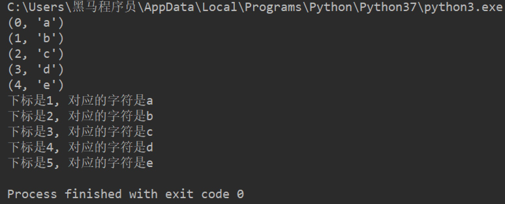


# 三. 容器类型转换

## 3.1 tuple()

作用：将某个序列转换成元组

``` python
list1 = [10, 20, 30, 40, 50, 20]
s1 = {100, 200, 300, 400, 500}

print(tuple(list1))
print(tuple(s1))
```


## 3.2 list()

作用：将某个序列转换成列表

``` python
t1 = ('a', 'b', 'c', 'd', 'e')
s1 = {100, 200, 300, 400, 500}

print(list(t1))
print(list(s1))
```


## 3.3 set()

作用：将某个序列转换成集合

``` python
list1 = [10, 20, 30, 40, 50, 20]
t1 = ('a', 'b', 'c', 'd', 'e')

print(set(list1))
print(set(t1))
```

> 注意：

 	1. 集合可以快速完成列表去重
 	2. 集合不支持下标


# 四. 总结

- 运算符
  - +
  - in / not in
- 公共方法
  - len()
  - del()
  - range()
  - enumerate()
- 数据类型转换
  - tuple()
  - list()
  - set()

# 课程：推导式

# 目标

- 列表推导式
- 字典推导式
- 集合推导式

# 一. 列表推导式

作用：用一个表达式创建一个有规律的列表或控制一个有规律列表。

列表推导式又叫列表生成式。

## 1.1 快速体验

需求：创建一个0-10的列表。

- while循环实现

``` python
# 1. 准备一个空列表
list1 = []

# 2. 书写循环，依次追加数字到空列表list1中
i = 0
while i < 10:
    list1.append(i)
    i += 1

print(list1)
```

- for循环实现

``` python
list1 = []
for i in range(10):
    list1.append(i)

print(list1)
```

- 列表推导式实现

``` python 
list1 = [i for i in range(10)]
print(list1)
```

## 1.2 带if的列表推导式

需求：创建0-10的偶数列表

- 方法一：range()步长实现

``` python
list1 = [i for i in range(0, 10, 2)]
print(list1)
```

- 方法二：if实现

``` python
list1 = [i for i in range(10) if i % 2 == 0]
print(list1)
```

## 1.3 多个for循环实现列表推导式

需求：创建列表如下：

``` html
[(1, 0), (1, 1), (1, 2), (2, 0), (2, 1), (2, 2)]
```

- 代码如下：

``` python
list1 = [(i, j) for i in range(1, 3) for j in range(3)]
print(list1)
```


# 二. 字典推导式

思考：如果有如下两个列表：

``` python
list1 = ['name', 'age', 'gender']
list2 = ['Tom', 20, 'man']
```

如何快速合并为一个字典？

答：字典推导式

字典推导式作用：快速合并列表为字典或提取字典中目标数据。

# 2.1 快速体验

1. 创建一个字典：字典key是1-5数字，value是这个数字的2次方。

``` python
dict1 = {i: i**2 for i in range(1, 5)}
print(dict1)  # {1: 1, 2: 4, 3: 9, 4: 16}
```


2. 将两个列表合并为一个字典

``` python 
list1 = ['name', 'age', 'gender']
list2 = ['Tom', 20, 'man']

dict1 = {list1[i]: list2[i] for i in range(len(list1))}
print(dict1)
```

3. 提取字典中目标数据

``` python
counts = {'MBP': 268, 'HP': 125, 'DELL': 201, 'Lenovo': 199, 'acer': 99}

# 需求：提取上述电脑数量大于等于200的字典数据
count1 = {key: value for key, value in counts.items() if value >= 200}
print(count1)  # {'MBP': 268, 'DELL': 201}
```


# 三. 集合推导式

需求：创建一个集合，数据为下方列表的2次方。

``` python
list1 = [1, 1, 2]
```

代码如下：

``` python
list1 = [1, 1, 2]
set1 = {i ** 2 for i in list1}
print(set1)  # {1, 4}
```

> 注意：集合有数据去重功能。


# 四. 总结

- 推导式的作用：简化代码
- 推导式写法

``` python
# 列表推导式
[xx for xx in range()]

# 字典推导式
{xx1: xx2 for ... in ...}

# 集合推导式
{xx for xx in ...}
```


# 课程：函数

# 目标

- 函数的作用
- 函数的使用步骤
- 函数的参数作用
- 函数的返回值作用
- 函数的说明文档
- 函数嵌套

# 一. 函数的作用

需求：用户到ATM机取钱：

1. 输入密码后显示"选择功能"界面
2. 查询余额后显示"选择功能"界面
3. 取2000钱后显示"选择功能"界面

> 特点：显示“选择功能”界面需要重复输出给用户，怎么实现？


函数就是将==一段具有独立功能的代码块== 整合到一个整体并命名，在需要的位置==调用这个名称==即可完成对应的需求。

> 函数在开发过程中，可以更高效的实现==代码重用==。


# 二. 函数的使用步骤

## 2.1 定义函数

``` python
def 函数名(参数):
    代码1
    代码2
    ......
```


## 2.2 调用函数

``` python
函数名(参数)
```

> 注意：

 	1. 不同的需求，参数可有可无。
 	2. 在Python中，函数必须==先定义后使用==。


## 2.3 快速体验

需求：复现ATM取钱功能。

1. 搭建整体框架(复现需求)

```python
print('密码正确登录成功')

# 显示"选择功能"界面

print('查询余额完毕')

# 显示"选择功能"界面

print('取了2000元钱')

# 显示"选择功能"界面
```

2. 确定“选择功能”界面内容

```python
print('查询余额')
print('存款')
print('取款')
```

3. 封装"选择功能"

> 注意：一定是先定义函数，后调用函数。

```python
# 封装ATM机功能选项 -- 定义函数
def select_func():
    print('-----请选择功能-----')
    print('查询余额')
    print('存款')
    print('取款')
    print('-----请选择功能-----')
```

4. 调用函数

在需要显示“选择功能”函数的位置调用函数。

```python
print('密码正确登录成功')
# 显示"选择功能"界面 -- 调用函数
select_func()

print('查询余额完毕')
# 显示"选择功能"界面 -- 调用函数
select_func()

print('取了2000元钱')
# 显示"选择功能"界面 -- 调用函数
select_func()
```


# 三.函数的参数作用

思考：完成需求如下：一个函数完成两个数1和2的加法运算，如何书写程序？

``` python 
# 定义函数
def add_num1():
    result = 1 + 2
    print(result)


# 调用函数
add_num1()
```

思考：上述add_num1函数只能完成数字1和2的加法运算，如果想要这个函数变得更灵活，可以计算任何用户指定的两个数字的和，如何书写程序？

分析：用户要在调用函数的时候指定具体数字，那么在定义函数的时候就需要接收用户指定的数字。函数调用时候指定的数字和定义函数时候接收的数字即是函数的参数。

``` python
# 定义函数时同时定义了接收用户数据的参数a和b，a和b是形参
def add_num2(a, b):
    result = a + b
    print(result)


# 调用函数时传入了真实的数据10 和 20，真实数据为实参
add_num2(10, 20)
```


# 四.函数的返回值作用

例如：我们去超市购物，比如买烟，给钱之后，是不是售货员会返回给我们烟这个商品，在函数中，如果需要返回结果给用户需要使用函数返回值。

``` python
def buy():
    return '烟'

# 使用变量保存函数返回值
goods = buy()
print(goods)
```

## 4.1 应用

需求：制作一个计算器，计算任意两数字之和，并保存结果。

``` python
def sum_num(a, b):
    return a + b


# 用result变量保存函数返回值
result = sum_num(1, 2)
print(result)
```


# 五.函数的说明文档

思考：定义一个函数后，程序员如何书写程序能够快速提示这个函数的作用？

答：注释

思考：如果代码多，我们是不是需要在很多代码中找到这个函数定义的位置才能看到注释？如果想更方便的查看函数的作用怎么办？

答：函数的说明文档

> 函数的说明文档也叫函数的文档说明。

## 5.1 语法

- 定义函数的说明文档

``` python
def 函数名(参数):
    """ 说明文档的位置 """
    代码
    ......
```

- 查看函数的说明文档

``` python
help(函数名)
```

## 5.2 快速体验

``` python
def sum_num(a, b):
    """ 求和函数 """
    return a + b


help(sum_num)
```


# 六.函数嵌套调用

所谓函数嵌套调用指的是==一个函数里面又调用了另外一个函数==。

- 示例

``` python
def testB():
    print('---- testB start----')
    print('这里是testB函数执行的代码...(省略)...')
    print('---- testB end----')

def testA():
    print('---- testA start----')
    testB()
    print('---- testA end----')

testA()
```

- 效果

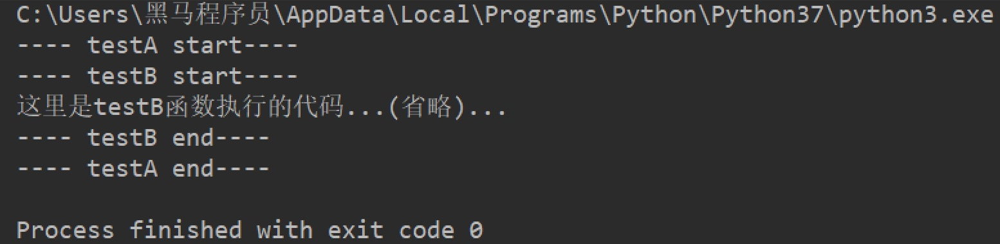

- 执行流程


> - 如果函数A中，调用了另外一个函数B，那么先把函数B中的任务都执行完毕之后才会回到上次 函数A执行的位置。

# 七. 函数应用

## 7.1 打印图形

1. 打印一条横线

``` python
def print_line():
    print('-' * 20)


print_line()
```

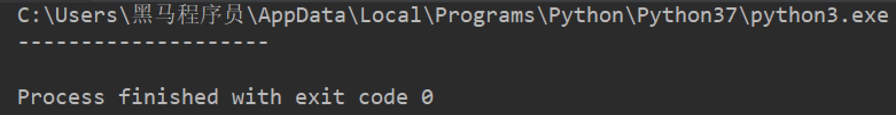

2. 打印多条横线

``` python 
def print_line():
    print('-' * 20)


def print_lines(num):
    i = 0
    while i < num:
        print_line()
        i += 1


print_lines(5)
```

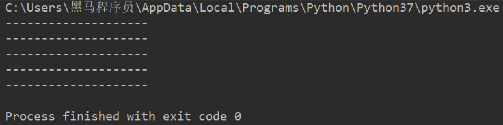

## 7.2 函数计算

1. 求三个数之和

``` python
def sum_num(a, b, c):
    return a + b + c


result = sum_num(1, 2, 3)
print(result)  # 6
```


2. 求三个数平均值

``` python
def average_num(a, b, c):
    sumResult = sum_num(a, b, c)
    return sumResult / 3

result = average_num(1, 2, 3)
print(result)  # 2.0
```

# 八. 总结

- 函数的作用：封装代码，高效的代码重用

- 函数使用步骤

  - 定义函数

  ``` python
  def 函数名():
      代码1
      代码2
      ...
  ```

  - 调用函数

  ``` python
  函数名()
  ```

- 函数的参数：函数调用的时候可以传入真实数据，增大函数的使用的灵活性

  - 形参：函数定义时书写的参数(非真实数据)
  - 实参：函数调用时书写的参数(真实数据)

- 函数的返回值

  - 作用：函数调用后，返回需要的计算结果
  - 写法

  ``` python
  return 表达式
  ```

- 函数的说明文档

  - 作用：保存函数解释说明的信息
  - 写法

  ``` python
  def 函数名():
      """ 函数说明文档 """
  ```

- 函数嵌套调用：一个函数内部嵌套调用另外一个函数

# 课程：函数

# 目标

- 变量作用域
- 多函数程序执行流程
- 函数的返回值
- 函数的参数
- 拆包和交换两个变量的值
- 引用
- 可变和不可变类型

# 一. 变量作用域g

变量作用域指的是变量生效的范围，主要分为两类：==局部变量==和==全局变量==。

- 局部变量

所谓局部变量是定义在函数体内部的变量，即只在函数体内部生效。

``` python
def testA():
    a = 100

    print(a)


testA()  # 100
print(a)  # 报错：name 'a' is not defined
```

> 变量a是定义在`testA`函数内部的变量，在函数外部访问则立即报错。

局部变量的作用：在函数体内部，临时保存数据，即当函数调用完成后，则销毁局部变量。

- 全局变量

所谓全局变量，指的是在函数体内、外都能生效的变量。

思考：如果有一个数据，在函数A和函数B中都要使用，该怎么办？

答：将这个数据存储在一个全局变量里面。

``` python
# 定义全局变量a
a = 100


def testA():
    print(a)  # 访问全局变量a，并打印变量a存储的数据


def testB():
    print(a)  # 访问全局变量a，并打印变量a存储的数据


testA()  # 100
testB()  # 100
```

思考：`testB`函数需求修改变量a的值为200，如何修改程序？

``` python
a = 100


def testA():
    print(a)


def testB():
    a = 200
    print(a)


testA()  # 100
testB()  # 200
print(f'全局变量a = {a}')  # 全局变量a = 100
```

思考：在`testB`函数内部的`a = 200`中的变量a是在修改全局变量`a`吗？

答：不是。观察上述代码发现，15行得到a的数据是100，仍然是定义全局变量a时候的值，而没有返回

`testB`函数内部的200。综上：`testB`函数内部的`a = 200`是定义了一个局部变量。

思考：如何在函数体内部修改全局变量？

``` python 
a = 100


def testA():
    print(a)


def testB():
    # global 关键字声明a是全局变量
    global a
    a = 200
    print(a)


testA()  # 100
testB()  # 200
print(f'全局变量a = {a}')  # 全局变量a = 200
```

# 二. 多函数程序执行流程

一般在实际开发过程中，一个程序往往由多个函数（后面知识中会讲解类）组成，并且多个函数共享某些数据，如下所示：

- 共用全局变量

``` python
# 1. 定义全局变量
glo_num = 0


def test1():
    global glo_num
    # 修改全局变量
    glo_num = 100


def test2():
    # 调用test1函数中修改后的全局变量
    print(glo_num)
    

# 2. 调用test1函数，执行函数内部代码：声明和修改全局变量
test1()
# 3. 调用test2函数，执行函数内部代码：打印
test2()  # 100
```

- 返回值作为参数传递

``` python
def test1():
    return 50


def test2(num):
    print(num)


# 1. 保存函数test1的返回值
result = test1()


# 2.将函数返回值所在变量作为参数传递到test2函数
test2(result)  # 50
```

# 三. 函数的返回值

思考：如果一个函数如些两个return (如下所示)，程序如何执行？

``` python 
def return_num():
    return 1
    return 2


result = return_num()
print(result)  # 1
```

答：只执行了第一个return，原因是因为return可以退出当前函数，导致return下方的代码不执行。

思考：如果一个函数要有多个返回值，该如何书写代码？

``` python
def return_num():
    return 1, 2


result = return_num()
print(result)  # (1, 2)
```

> 注意：
>
> 1. `return a, b`写法，返回多个数据的时候，默认是元组类型。
> 2. return后面可以连接列表、元组或字典，以返回多个值。


# 四. 函数的参数

## 4.1 位置参数

位置参数：调用函数时根据函数定义的参数位置来传递参数。

``` python
def user_info(name, age, gender):
    print(f'您的名字是{name}, 年龄是{age}, 性别是{gender}')


user_info('TOM', 20, '男')
```

> 注意：传递和定义参数的顺序及个数必须一致。


## 4.2 关键字参数

函数调用，通过“键=值”形式加以指定。可以让函数更加清晰、容易使用，同时也清除了参数的顺序需求。

``` python
def user_info(name, age, gender):
    print(f'您的名字是{name}, 年龄是{age}, 性别是{gender}')


user_info('Rose', age=20, gender='女')
user_info('小明', gender='男', age=16)
```

注意：**函数调用时，如果有位置参数时，位置参数必须在关键字参数的前面，但关键字参数之间不存在先后顺序。**


## 4.3 缺省参数

缺省参数也叫默认参数，用于定义函数，为参数提供默认值，调用函数时可不传该默认参数的值（注意：所有位置参数必须出现在默认参数前，包括函数定义和调用）。

``` python
def user_info(name, age, gender='男'):
    print(f'您的名字是{name}, 年龄是{age}, 性别是{gender}')


user_info('TOM', 20)
user_info('Rose', 18, '女')
```

> 注意：函数调用时，如果为缺省参数传值则修改默认参数值；否则使用这个默认值。

## 4.4 不定长参数

不定长参数也叫可变参数。用于不确定调用的时候会传递多少个参数(不传参也可以)的场景。此时，可用包裹(packing)位置参数，或者包裹关键字参数，来进行参数传递，会显得非常方便。

- 包裹位置传递

``` python
def user_info(*args):
    print(args)


# ('TOM',)
user_info('TOM')
# ('TOM', 18)
user_info('TOM', 18)
```

> 注意：传进的所有参数都会被args变量收集，它会根据传进参数的位置合并为一个元组(tuple)，args是元组类型，这就是包裹位置传递。

- 包裹关键字传递

``` python
def user_info(**kwargs):
    print(kwargs)


# {'name': 'TOM', 'age': 18, 'id': 110}
user_info(name='TOM', age=18, id=110)
```

> 综上：无论是包裹位置传递还是包裹关键字传递，都是一个组包的过程。


# 五. 拆包和交换变量值

## 5.1 拆包

- 拆包：元组

``` python
def return_num():
    return 100, 200


num1, num2 = return_num()
print(num1)  # 100
print(num2)  # 200
```

- 拆包：字典

``` python
dict1 = {'name': 'TOM', 'age': 18}
a, b = dict1

# 对字典进行拆包，取出来的是字典的key
print(a)  # name
print(b)  # age

print(dict1[a])  # TOM
print(dict1[b])  # 18
```


## 5.2 交换变量值

需求：有变量`a = 10`和`b = 20`，交换两个变量的值。

- 方法一

借助第三变量存储数据。

``` python
# 1. 定义中间变量
c = 0

# 2. 将a的数据存储到c
c = a

# 3. 将b的数据20赋值到a，此时a = 20
a = b

# 4. 将之前c的数据10赋值到b，此时b = 10
b = c

print(a)  # 20
print(b)  # 10
```

- 方法二

``` python
a, b = 1, 2
a, b = b, a
print(a)  # 2
print(b)  # 1
```

# 六. 引用

## 6.1 了解引用

在python中，值是靠引用来传递来的。

**我们可以用`id()`来判断两个变量是否为同一个值的引用。** 我们可以将id值理解为那块内存的地址标识。

``` python
# 1. int类型
a = 1
b = a

print(b)  # 1

print(id(a))  # 140708464157520
print(id(b))  # 140708464157520

a = 2
print(b)  # 1,说明int类型为不可变类型 

print(id(a))  # 140708464157552，此时得到是的数据2的内存地址
print(id(b))  # 140708464157520


# 2. 列表
aa = [10, 20]
bb = aa

print(id(aa))  # 2325297783432
print(id(bb))  # 2325297783432


aa.append(30)
print(bb)  # [10, 20, 30], 列表为可变类型

print(id(aa))  # 2325297783432
print(id(bb))  # 2325297783432
```

## 6.2 引用当做实参

代码如下：

``` python
def test1(a):
    print(a)
    print(id(a))

    a += a

    print(a)
    print(id(a))


# int：计算前后id值不同
b = 100
test1(b)

# 列表：计算前后id值相同
c = [11, 22]
test1(c)
```

效果图如下：


# 七. 可变和不可变类型

所谓可变类型与不可变类型是指：数据能够直接进行修改，如果能直接修改那么就是可变，否则是不可变.

- 可变类型
  - 列表
  - 字典
  - 集合
- 不可变类型
  - 整型
  - 浮点型
  - 字符串
  - 元组


# 八. 总结

- 变量作用域
  - 全局：函数体内外都能生效
  - 局部：当前函数体内部生效
- 函数多返回值写法

``` python
return 表达式1, 表达式2...
```

- 函数的参数
  - 位置参数
    - 形参和实参的个数和书写顺序必须一致
  - 关键字参数
    - 写法： `key=value`
    - 特点：形参和实参的书写顺序可以不一致；关键字参数必须书写在位置参数的后面
  - 缺省参数
    - 缺省参数就是默认参数
    - 写法：`key=vlaue`
  - 不定长位置参数
    - 收集所有位置参数，返回一个元组
  - 不定长关键字参数
    - 收集所有关键字参数，返回一个字典
- 引用：Python中，数据的传递都是通过引用

# 课程：函数加强

# 目标

- 应用：学员管理系统
- 递归
- lambda 表达式
- 高阶函数

# 一. 应用：学员管理系统

## 1.1 系统简介

需求：进入系统显示系统功能界面，功能如下：

- 1、添加学员
- 2、删除学员
- 3、修改学员信息
- 4、查询学员信息
- 5、显示所有学员信息
- 6、退出系统

系统共6个功能，用户根据自己需求选取。


## 1.2 步骤分析

1. 显示功能界面

2. 用户输入功能序号

3. 根据用户输入的功能序号，执行不同的功能(函数)

   3.1 定义函数

   3.2 调用函数


## 1.3 需求实现

### 1.3.1 显示功能界面

定义函数`print_info`，负责显示系统功能。

``` python
def print_info():
    print('-' * 20)
    print('欢迎登录学员管理系统')
    print('1: 添加学员')
    print('2: 删除学员')
    print('3: 修改学员信息')
    print('4: 查询学员信息')
    print('5: 显示所有学员信息')
    print('6: 退出系统')
    print('-' * 20)
    
    
print_info()
```

### 1.3.2 用户输入序号，选择功能

``` python
user_num = input('请选择您需要的功能序号：')
```

### 1.3.3 根据用户选择，执行不同的功能

``` python
if user_num == '1':
    print('添加学员')
elif user_num == '2':
    print('删除学员')
elif user_num == '3':
    print('修改学员信息')
elif user_num == '4':
    print('查询学员信息')
elif user_num == '5':
    print('显示所有学员信息')
elif user_num == '6':
    print('退出系统')
```

> 工作中，需要根据实际需求调优代码。
>
> 1. 用户选择系统功能的代码需要循环使用，直到用户主动退出系统。
> 2. 如果用户输入1-6以外的数字，需要提示用户。

``` python
while True:
    # 1. 显示功能界面
    print_info()
    
    # 2. 用户选择功能
    user_num = input('请选择您需要的功能序号：')

    # 3. 根据用户选择，执行不同的功能
    if user_num == '1':
        print('添加学员')
    elif user_num == '2':
        print('删除学员')
    elif user_num == '3':
        print('修改学员信息')
    elif user_num == '4':
        print('查询学员信息')
    elif user_num == '5':
        print('显示所有学员信息')
    elif user_num == '6':
        print('退出系统')
    else:
        print('输入错误，请重新输入!!!')
```

### 1.3.4 定义不同功能的函数

所有功能函数都是操作学员信息，所有存储所有学员信息应该是一个==全局变量==，数据类型为==列表==。

``` python
info = []
```


#### 1.3.4.1 添加学员

- 需求分析

1. 接收用户输入学员信息，并保存

2. 判断是否添加学员信息

   2.1 如果学员姓名已经存在，则报错提示

   2.2 如果学员姓名不存在，则准备空字典，将用户输入的数据追加到字典，再列表追加字典数据

3. 对应的if条件成立的位置调用该函数

- 代码实现

``` python
def add_info():
    """ 添加学员 """
    # 接收用户输入学员信息
    new_id = input('请输入学号：')
    new_name = input('请输入姓名：')
    new_tel = input('请输入手机号：')
    

    # 声明info是全局变量
    global info

    # 检测用户输入的姓名是否存在，存在则报错提示
    for i in info:
        if new_name == i['name']:
            print('该用户已经存在！')
            return

    # 如果用户输入的姓名不存在，则添加该学员信息
    info_dict = {}
    
    # 将用户输入的数据追加到字典
    info_dict['id'] = new_id
    info_dict['name'] = new_name
    info_dict['tel'] = new_tel
    
    # 将这个学员的字典数据追加到列表
    info.append(info_dict)
    
    print(info)
```

#### 1.3.4.2 删除学员

- 需求分析

按用户输入的学员姓名进行删除

 1. 用户输入目标学员姓名

 2. 检查这个学员是否存在

    2.1 如果存在，则列表删除这个数据

    2.2 如果不存在，则提示“该用户不存在”

3. 对应的if条件成立的位置调用该函数

- 代码实现

``` python
# 删除学员
def del_info():
    """删除学员"""
    # 1. 用户输入要删除的学员的姓名
    del_name = input('请输入要删除的学员的姓名：')

    global info
    # 2. 判断学员是否存在:如果输入的姓名存在则删除，否则报错提示
    for i in info:
        if del_name == i['name']:
            info.remove(i)
            break
    else:
        print('该学员不存在')

    print(info)
```

#### 1.3.4.3 修改学员信息

- 需求分析

1. 用户输入目标学员姓名

2. 检查这个学员是否存在

   2.1 如果存在，则修改这位学员的信息，例如手机号

   2.2 如果不存在，则报错

3. 对应的if条件成立的位置调用该函数

- 代码实现

``` python
# 修改函数
def modify_info():
    """修改函数"""
    # 1. 用户输入要修改的学员的姓名
    modify_name = input('请输入要修改的学员的姓名：')

    global info
    # 2. 判断学员是否存在：如果输入的姓名存在则修改手机号，否则报错提示
    for i in info:
        if modify_name == i ['name']:
            i['tel'] = input('请输入新的手机号：')
            break
    else:
        print('该学员不存在')
    
    print(info)
```


#### 1.3.4.4 查询学员信息

- 需求分析

1. 用户输入目标学员姓名

2. 检查学员是否存在

   2.1 如果存在，则显示这个学员的信息

   2.2 如果不存在，则报错提示

3. 对应的if条件成立的位置调用该函数

- 代码实现

``` python
# 查询学员
def search_info():
    """查询学员"""
    # 1. 输入要查找的学员姓名：
    search_name = input('请输入要查找的学员姓名：')

    global info
    # 2. 判断学员是否存在：如果输入的姓名存在则显示这位学员信息，否则报错提示
    for i in info:
        if search_name == i['name']:
            print('查找到的学员信息如下：----------')
            print(f"该学员的学号是{i['id']}, 姓名是{i['name']}, 手机号是{i['tel']}")
            break
    else:
        print('该学员不存在')
```


#### 1.3.4.5 显示所有学员信息

- 需求分析

打印所有学员信息

- 代码实现

``` python
# 显示所有学员信息
def print_all():
    """ 显示所有学员信息 """
    print('学号\t姓名\t手机号')
    for i in info:
        print(f'{i["id"]}\t{i["name"]}\t{i["tel"]}')
```


#### 1.3.4.6 退出系统

在用户输入功能序号`6`的时候要退出系统，代码如下：

``` python
    ......
    elif user_num == '6':
        exit_flag = input('确定要退出吗？yes or no')
        if exit_flag == 'yes':
            break
```

# 二. 递归

## 2.1 递归的应用场景

递归是一种编程思想，应用场景：

1. 在我们日常开发中，如果要遍历一个文件夹下面所有的文件，通常会使用递归来实现；
2. 在后续的算法课程中，很多算法都离不开递归，例如：快速排序。

### 2.1.1 递归的特点

- 函数内部自己调用自己
- 必须有出口


## 2.2 应用：3以内数字累加和

- 代码

```python
# 3 + 2 + 1
def sum_numbers(num):
    # 1.如果是1，直接返回1 -- 出口
    if num == 1:
        return 1
    # 2.如果不是1，重复执行累加并返回结果
    return num + sum_numbers(num-1)


sum_result = sum_numbers(3)
# 输出结果为6
print(sum_result)
```

- 执行结果


# 三. lambda 表达式

## 3.1 lambda的应用场景

如果一个函数有一个返回值，并且只有一句代码，可以使用 lambda简化。


## 3.2 lambda语法

```python
lambda 参数列表 ： 表达式
```

> 注意

- lambda表达式的参数可有可无，函数的参数在lambda表达式中完全适用。
- lambda表达式能接收任何数量的参数但只能返回一个表达式的值。

### 快速入门

```python
# 函数
def fn1():
    return 200


print(fn1)
print(fn1())


# lambda表达式
fn2 = lambda: 100
print(fn2)
print(fn2())
```

> 注意：直接打印lambda表达式，输出的是此lambda的内存地址


## 3.3 示例：计算a + b

### 3.3.1 函数实现

```python
def add(a, b):
    return a + b


result = add(1, 2)
print(result)
```

> 思考：需求简单，是否代码多？

### 3.3.2 lambda实现

```python
fn1 = lambda a, b: a + b
print(fn1(1, 2))
```


## 3.4 lambda的参数形式

### 3.4.1.无参数

```python
fn1 = lambda: 100
print(fn1())
```

### 3.4.2.一个参数

```python
fn1 = lambda a: a
print(fn1('hello world'))
```

### 3.4.3.默认参数

```python
fn1 = lambda a, b, c=100: a + b + c
print(fn1(10, 20))
```

### 3.4.4.可变参数：*args

```python
fn1 = lambda *args: args
print(fn1(10, 20, 30))
```

> 注意：这里的可变参数传入到lambda之后，返回值为元组。

### 3.4.5.可变参数：**kwargs

```python
fn1 = lambda **kwargs: kwargs
print(fn1(name='python', age=20))
```


## 3.5 lambda的应用

### 3.5.1. 带判断的lambda

```python
fn1 = lambda a, b: a if a > b else b
print(fn1(1000, 500))
```

### 3.5.2. 列表数据按字典key的值排序

```python
students = [
    {'name': 'TOM', 'age': 20},
    {'name': 'ROSE', 'age': 19},
    {'name': 'Jack', 'age': 22}
]

# 按name值升序排列
students.sort(key=lambda x: x['name'])
print(students)

# 按name值降序排列
students.sort(key=lambda x: x['name'], reverse=True)
print(students)

# 按age值升序排列
students.sort(key=lambda x: x['age'])
print(students)
```


# 四. 高阶函数

==把函数作为参数传入==，这样的函数称为高阶函数，高阶函数是函数式编程的体现。函数式编程就是指这种高度抽象的编程范式。

## 4.1 体验高阶函数

在Python中，`abs()`函数可以完成对数字求绝对值计算。

``` python
abs(-10)  # 10
```

`round()`函数可以完成对数字的四舍五入计算。

``` python
round(1.2)  # 1
round(1.9)  # 2
```

需求：任意两个数字，按照指定要求整理数字后再进行求和计算。

- 方法1

``` python
def add_num(a, b):
    return abs(a) + abs(b)


result = add_num(-1, 2)
print(result)  # 3
```

- 方法2

``` python
def sum_num(a, b, f):
    return f(a) + f(b)


result = sum_num(-1, 2, abs)
print(result)  # 3
```

> 注意：两种方法对比之后，发现，方法2的代码会更加简洁，函数灵活性更高。

函数式编程大量使用函数，减少了代码的重复，因此程序比较短，开发速度较快。


## 4.2 内置高阶函数

### 4.2.1 map()

map(func, lst)，将传入的函数变量func作用到lst变量的每个元素中，并将结果组成新的列表(Python2)/迭代器(Python3)返回。

需求：计算`list1`序列中各个数字的2次方。

``` python
list1 = [1, 2, 3, 4, 5]


def func(x):
    return x ** 2


result = map(func, list1)

print(result)  # <map object at 0x0000013769653198>
print(list(result))  # [1, 4, 9, 16, 25]

####注意map函数返回的是map对象 并不是list不能拿来直接用需要list（xxx）一下


```


### 4.2.2 reduce()

reduce(func，lst)，其中func必须有两个参数。每次func计算的结果继续和序列的下一个元素做累积计算。

> 注意：reduce()传入的参数func必须接收2个参数。

需求：计算`list1`序列中各个数字的累加和。

``` python
import functools

list1 = [1, 2, 3, 4, 5]


def func(a, b):
    return a + b


result = functools.reduce(func, list1)

print(result)  # 15
```


### 4.2.3 filter()

filter(func, lst)函数用于过滤序列, 过滤掉不符合条件的元素, 返回一个 filter 对象。如果要转换为列表, 可以使用 list() 来转换。

``` python
list1 = [1, 2, 3, 4, 5, 6, 7, 8, 9, 10]


def func(x):
    return x % 2 == 0


result = filter(func, list1)

print(result)  # <filter object at 0x0000017AF9DC3198>
print(list(result))  # [2, 4, 6, 8, 10]
```


# 五. 总结

- 递归

  - 函数内部自己调用自己
  - 必须有出口

- lambda

  - 语法

  ``` python
  lambda 参数列表: 表达式
  ```

  - lambda的参数形式

    - 无参数

    ``` python
    lambda: 表达式
    ```

    - 一个参数

    ``` python
    lambda 参数: 表达式
    ```

    - 默认参数

    ``` python
    lambda key=value: 表达式
    ```

    - 不定长位置参数

    ``` python
    lambda *args: 表达式
    ```

    - 不定长关键字参数

    ``` python
    lambda **kwargs: 表达式
    ```

- 高阶函数

  - 作用：把函数作为参数传入，化简代码
  - 内置高阶函数
    - map()
    - reduce()
    - filter()

# 课程：文件操作

# 目标

- 文件操作的作用
- 文件的基本操作
  - 打开
  - 读写
  - 关闭
- 文件备份
- 文件和文件夹的操作


# 一. 文件操作的作用

思考：什么是文件？


思考：文件操作包含什么？

答：打开、关闭、读、写、复制....

思考：文件操作的的作用是什么？

答：读取内容、写入内容、备份内容......

> 总结：文件操作的作用就是==把一些内容(数据)存储存放起来，可以让程序下一次执行的时候直接使用，而不必重新制作一份，省时省力==。


# 二. 文件的基本操作

## 2.1 文件操作步骤

1. 打开文件
2. 读写等操作
3. 关闭文件

> 注意：可以只打开和关闭文件，不进行任何读写操作。

### 2.1.1  打开

在python，使用open函数，可以打开一个已经存在的文件，或者创建一个新文件，语法如下：

``` python
open(name, mode)
```

name：是要打开的目标文件名的字符串(可以包含文件所在的具体路径)。

mode：设置打开文件的模式(访问模式)：只读、写入、追加等。


#### 2.1.1.1 打开文件模式

| 模式 | 描述                                                         |
| :--: | ------------------------------------------------------------ |
|  r   | 以只读方式打开文件。文件的指针将会放在文件的开头。这是默认模式。 |
|  rb  | 以二进制格式打开一个文件用于只读。文件指针将会放在文件的开头。这是默认模式。 |
|  r+  | 打开一个文件用于读写。文件指针将会放在文件的开头。           |
| rb+  | 以二进制格式打开一个文件用于读写。文件指针将会放在文件的开头。 |
|  w   | 打开一个文件只用于写入。如果该文件已存在则打开文件，并从开头开始编辑，即原有内容会被删除。如果该文件不存在，创建新文件。 |
|  wb  | 以二进制格式打开一个文件只用于写入。如果该文件已存在则打开文件，并从开头开始编辑，即原有内容会被删除。如果该文件不存在，创建新文件。 |
|  w+  | 打开一个文件用于读写。如果该文件已存在则打开文件，并从开头开始编辑，即原有内容会被删除。如果该文件不存在，创建新文件。 |
| wb+  | 以二进制格式打开一个文件用于读写。如果该文件已存在则打开文件，并从开头开始编辑，即原有内容会被删除。如果该文件不存在，创建新文件。 |
|  a   | 打开一个文件用于追加。如果该文件已存在，文件指针将会放在文件的结尾。也就是说，新的内容将会被写入到已有内容之后。如果该文件不存在，创建新文件进行写入。 |
|  ab  | 以二进制格式打开一个文件用于追加。如果该文件已存在，文件指针将会放在文件的结尾。也就是说，新的内容将会被写入到已有内容之后。如果该文件不存在，创建新文件进行写入。 |
|  a+  | 打开一个文件用于读写。如果该文件已存在，文件指针将会放在文件的结尾。文件打开时会是追加模式。如果该文件不存在，创建新文件用于读写。 |
| ab+  | 以二进制格式打开一个文件用于追加。如果该文件已存在，文件指针将会放在文件的结尾。如果该文件不存在，创建新文件用于读写。 |


#### 2.1.1.2 快速体验

``` python
f = open('test.txt', 'w')
```

> 注意：此时的`f`是`open`函数的文件对象。

### 2.1.2 文件对象方法

##### 2.1.2.1 写

- 语法

``` python
对象对象.write('内容')
```

- 体验

``` python
# 1. 打开文件
f = open('test.txt', 'w')

# 2.文件写入
f.write('hello world')

# 3. 关闭文件
f.close()
```

> 注意：
>
> 1. `w	`和`a`模式：如果文件不存在则创建该文件；如果文件存在，`w`模式先清空再写入，`a`模式直接末尾追加。
> 2. `r`模式：如果文件不存在则报错。


##### 2.1.2.2 读

- read()

``` python
文件对象.read(num)
```

> num表示要从文件中读取的数据的长度（单位是字节），如果没有传入num，那么就表示读取文件中所有的数据。


- readlines()

readlines可以按照行的方式把整个文件中的内容进行一次性读取，并且返回的是一个列表，其中每一行的数据为一个元素。

``` python
f = open('test.txt')
content = f.readlines()

# ['hello world\n', 'abcdefg\n', 'aaa\n', 'bbb\n', 'ccc']
print(content)

# 关闭文件
f.close()
```


- readline()

readline()一次读取一行内容。

``` python
f = open('test.txt')

content = f.readline()
print(f'第一行：{content}')

content = f.readline()
print(f'第二行：{content}')

# 关闭文件
f.close()
```

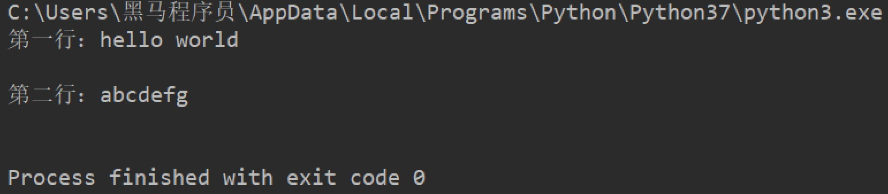


##### 2.1.2.3 seek()

作用：用来移动文件指针。

语法如下：

``` python
文件对象.seek(偏移量, 起始位置)
```

> 起始位置：
>
> - 0：文件开头
> - 1：当前位置
> - 2：文件结尾


### 2.1.3 关闭

```open
文件对象.close()
```


# 三. 文件备份

需求：用户输入当前目录下任意文件名，程序完成对该文件的备份功能(备份文件名为xx[备份]后缀，例如：test[备份].txt)。

## 3.1 步骤

1. 接收用户输入的文件名
2. 规划备份文件名
3. 备份文件写入数据

## 3.2 代码实现

1. 接收用户输入目标文件名

``` python
old_name = input('请输入您要备份的文件名：')
```


2. 规划备份文件名

   2.1 提取目标文件后缀

   2.2 组织备份的文件名，xx[备份]后缀

> ``` python
> # 2.1 提取文件后缀点的下标
> index = old_name.rfind('.')
> 
> # print(index)  # 后缀中.的下标
> 
> # print(old_name[:index])  # 源文件名（无后缀）
> 
> # 2.2 组织新文件名 旧文件名 + [备份] + 后缀
> new_name = old_name[:index] + '[备份]' + old_name[index:]
> 
> # 打印新文件名（带后缀）
> # print(new_name)
> ```
>

3. 备份文件写入数据

   3.1 打开源文件 和 备份文件

   3.2 将源文件数据写入备份文件

   3.3 关闭文件

``` python
# 3.1 打开文件
old_f = open(old_name, 'rb')
new_f = open(new_name, 'wb')

# 3.2 将源文件数据写入备份文件
while True:
    con = old_f.read(1024)
    if len(con) == 0:
        break
    new_f.write(con)

# 3.3 关闭文件
old_f.close()
new_f.close()
```


## 3.3 思考

如果用户输入`.txt`，这是一个无效文件，程序如何更改才能限制只有有效的文件名才能备份？

答：添加条件判断即可。

``` python
old_name = input('请输入您要备份的文件名：')

index = old_name.rfind('.')


if index > 0:
    postfix = old_name[index:]

new_name = old_name[:index] + '[备份]' + postfix

old_f = open(old_name, 'rb')
new_f = open(new_name, 'wb')

while True:
    con = old_f.read(1024)
    if len(con) == 0:
        break
    new_f.write(con)

old_f.close()
new_f.close()
```


# 四. 文件和文件夹的操作

在Python中文件和文件夹的操作要借助os模块里面的相关功能，具体步骤如下：

1. 导入os模块

``` python
import os
```

2. 使用`os`模块相关功能

``` python
os.函数名()
```

## 4.1 文件重命名

``` python
os.rename(目标文件名, 新文件名)
```


## 4.2 删除文件

``` python
os.remove(目标文件名)
```


## 4.3 创建文件夹

``` python
os.mkdir(文件夹名字)
```


## 4.4 删除文件夹

``` python
os.rmdir(文件夹名字)
```


## 4.5 获取当前目录

``` python
os.getcwd()
```


## 4.6 改变默认目录

``` python
os.chdir(目录)
```


## 4.7 获取目录列表

``` python
os.listdir(目录)
```


# 五.应用案例

需求：批量修改文件名，既可添加指定字符串，又能删除指定字符串。

- 步骤

1. 设置添加删除字符串的的标识
2. 获取指定目录的所有文件
3. 将原有文件名添加/删除指定字符串，构造新名字
4. os.rename()重命名


- 代码

``` python
import os

# 设置重命名标识：如果为1则添加指定字符，flag取值为2则删除指定字符
flag = 1

# 获取指定目录
dir_name = './'

# 获取指定目录的文件列表
file_list = os.listdir(dir_name)
# print(file_list)


# 遍历文件列表内的文件
for name in file_list:

    # 添加指定字符
    if flag == 1:
        new_name = 'Python-' + name
    # 删除指定字符
    elif flag == 2:
        num = len('Python-')
        new_name = name[num:]

    # 打印新文件名，测试程序正确性
    print(new_name)
    
    # 重命名
    os.rename(dir_name+name, dir_name+new_name)
```


# 六. 总结

- 文件操作步骤

  - 打开

  ``` python
  文件对象 = open(目标文件, 访问模式)
  ```

  - 操作

    - 读

    ``` python
    文件对象.read()
    文件对象.readlines()
    文件对象.readline()
    ```

    - 写

    ``` python
    文件对象.write()
    ```

    - seek()

  - 关闭

  ``` python
  文件对象.close()
  ```


- 主访问模式
  - w：写，文件不存在则新建该文件
  - r：读，文件不存在则报错
  - a：追加

- 文件和文件夹操作
  - 重命名：os.rename()
  - 获取当前目录：os.getcwd()
  - 获取目录列表：os.listdir()

# 面向对象基础

# 目标

- 理解面向对象
- 类和对象
- 添加和获取对象属性
- 魔法方法


# 一. 理解面向对象

面向对象是一种抽象化的编程思想，很多编程语言中都有的一种思想。

例如：洗衣服

思考：几种途径可以完成洗衣服？

答： 手洗 和 机洗。

手洗：找盆 - 放水 - 加洗衣粉 - 浸泡 - 搓洗 - 拧干水 - 倒水 - 漂洗N次 - 拧干 - 晾晒。

机洗：打开洗衣机 - 放衣服 - 加洗衣粉 - 按下开始按钮 - 晾晒。

思考：对比两种洗衣服途径，同学们发现了什么？

答：机洗更简单

思考：机洗，只需要找到一台洗衣机，加入简单操作就可以完成洗衣服的工作，而不需要关心洗衣机内部发生了什么事情。

> 总结：==面向对象就是将编程当成是一个事物，对外界来说，事物是直接使用的，不用去管他内部的情况。而编程就是设置事物能够做什么事。==


# 二. 类和对象

思考：洗衣机洗衣服描述过程中，洗衣机其实就是一个事物，即对象，洗衣机对象哪来的呢？

答：洗衣机是由工厂工人制作出来。

思考：工厂工人怎么制作出的洗衣机？

答：工人根据设计师设计的功能图纸制作洗衣机。

总结：图纸  → 洗衣机 → 洗衣服。

在面向对象编程过程中，有两个重要组成部分：==类== 和 ==对象==。

==类和对象的关系：用类去创建一个对象。==

## 2.1 理解类和对象

### 2.1.1 类

类是对一系列具有相同==特征==和==行为==的事物的统称，是一个==抽象的概念==，不是真实存在的事物。

- 特征即是属性
- 行为即是方法

类比如是制造洗衣机时要用到的图纸，也就是说==类是用来创建对象==。


### 2.1.2 对象

对象是类创建出来的真实存在的事物，例如：洗衣机。

> 注意：开发中，先有类，再有对象。


## 2.2 面向对象实现方法

### 2.2.1 定义类

Python2中类分为：经典类 和 新式类

- 语法

```python
class 类名():
    代码
    ......
```

> 注意：类名要满足标识符命名规则，同时遵循==大驼峰命名习惯==。

- 体验

``` python
class Washer():
    def wash(self):
        print('我会洗衣服')
```

- 拓展：经典类

不由任意内置类型派生出的类，称之为经典类

``` python
class 类名:
    代码
    ......
```


### 2.2.2 创建对象

对象又名实例。

- 语法

``` python
对象名 = 类名()
```

- 体验

``` python
# 创建对象
haier1 = Washer()

# <__main__.Washer object at 0x0000018B7B224240>
print(haier1)

# haier对象调用实例方法
haier1.wash()
```

> 注意：创建对象的过程也叫实例化对象。

### 2.2.3 self

self指的是调用该函数的对象。

``` python
# 1. 定义类
class Washer():
    def wash(self):
        print('我会洗衣服')
        # <__main__.Washer object at 0x0000024BA2B34240>
        print(self)


# 2. 创建对象
haier1 = Washer()
# <__main__.Washer object at 0x0000018B7B224240>
print(haier1)
# haier1对象调用实例方法
haier1.wash()


haier2 = Washer()
# <__main__.Washer object at 0x0000022005857EF0>
print(haier2)
```

> 注意：打印对象和self得到的结果是一致的，都是当前对象的内存中存储地址。


# 三. 添加和获取对象属性

属性即是特征，比如：洗衣机的宽度、高度、重量...

对象属性既可以在类外面添加和获取，也能在类里面添加和获取。

## 3.1 类外面添加对象属性

- 语法

``` python
对象名.属性名 = 值
```

- 体验

``` python
haier1.width = 500
haier1.height = 800
```


## 3.2 类外面获取对象属性

- 语法

``` python
对象名.属性名
```

- 体验

``` python
print(f'haier1洗衣机的宽度是{haier1.width}')
print(f'haier1洗衣机的高度是{haier1.height}')
```


## 3.3 类里面获取对象属性

- 语法

``` python
self.属性名
```

- 体验

``` python
# 定义类
class Washer():
    def print_info(self):
        # 类里面获取实例属性
        print(f'haier1洗衣机的宽度是{self.width}')
        print(f'haier1洗衣机的高度是{self.height}')

# 创建对象
haier1 = Washer()

# 添加实例属性
haier1.width = 500
haier1.height = 800

haier1.print_info()
```


# 四. 魔法方法

在Python中，`__xx__()`的函数叫做魔法方法，指的是具有特殊功能的函数。

## 4.1 `__init__()`

### 4.1.1 体验`__init__()`

思考：洗衣机的宽度高度是与生俱来的属性，可不可以在生产过程中就赋予这些属性呢？

答：理应如此。

==`__init__()`方法的作用：初始化对象。==

``` python
class Washer():
    
    # 定义初始化功能的函数
    def __init__(self):
        # 添加实例属性
        self.width = 500
        self.height = 800


    def print_info(self):
        # 类里面调用实例属性
        print(f'洗衣机的宽度是{self.width}, 高度是{self.height}')


haier1 = Washer()
haier1.print_info()
```

> 注意：
>
> - `__init__()`方法，在创建一个对象时默认被调用，不需要手动调用
> - `__init__(self)`中的self参数，不需要开发者传递，python解释器会自动把当前的对象引用传递过去。


### 4.1.2 带参数的`__init__()`

思考：一个类可以创建多个对象，如何对不同的对象设置不同的初始化属性呢？

答：传参数。

``` python
class Washer():
    def __init__(self, width, height):
        self.width = width
        self.height = height

    def print_info(self):
        print(f'洗衣机的宽度是{self.width}')
        print(f'洗衣机的高度是{self.height}')


haier1 = Washer(10, 20)
haier1.print_info()


haier2 = Washer(30, 40)
haier2.print_info()
```


## 4.2  `__str__()`

当使用print输出对象的时候，默认打印对象的内存地址。如果类定义了`__str__`方法，那么就会打印从在这个方法中 return 的数据。

``` python
class Washer():
    def __init__(self, width, height):
        self.width = width
        self.height = height

    def __str__(self):
        return '这是海尔洗衣机的说明书'


haier1 = Washer(10, 20)
# 这是海尔洗衣机的说明书
print(haier1)
```


## 4.3  `__del__()`

当删除对象时，python解释器也会默认调用`__del__()`方法。

``` python
class Washer():
    def __init__(self, width, height):
        self.width = width
        self.height = height

    def __del__(self):
        print(f'{self}对象已经被删除')


haier1 = Washer(10, 20)

# <__main__.Washer object at 0x0000026118223278>对象已经被删除
del haier1
```


# 五. 综合应用

## 5.1 烤地瓜

### 5.1.1 需求

需求主线：

 1. 被烤的时间和对应的地瓜状态：

    0-3分钟：生的

    3-5分钟：半生不熟

    5-8分钟：熟的

    超过8分钟：烤糊了

    

 2. 添加的调料：

    用户可以按自己的意愿添加调料

    

### 5.1.2 步骤分析

需求涉及一个事物： 地瓜，故案例涉及一个类：地瓜类。

#### 5.1.2.1 定义类

- 地瓜的属性
  - 被烤的时间
  - 地瓜的状态
  - 添加的调料
- 地瓜的方法
  - 被烤
    - 用户根据意愿设定每次烤地瓜的时间
    - 判断地瓜被烤的总时间是在哪个区间，修改地瓜状态
  - 添加调料
    - 用户根据意愿设定添加的调料
    - 将用户添加的调料存储

- 显示对象信息


#### 5.1.2.2 创建对象，调用相关实例方法


### 5.1.3 代码实现

#### 5.1.3.1 定义类

- 地瓜属性
  - 定义地瓜初始化属性，后期根据程序推进更新实例属性

``` python
class SweetPotato():
    def __init__(self):
        # 被烤的时间
        self.cook_time = 0
        # 地瓜的状态
        self.cook_static = '生的'
        # 调料列表
        self.condiments = []
```


#### 5.1.3.2 定义烤地瓜方法

``` python
class SweetPotato():
    ......
    
    def cook(self, time):
        """烤地瓜的方法"""
        self.cook_time += time
        if 0 <= self.cook_time < 3:
            self.cook_static = '生的'
        elif 3 <= self.cook_time < 5:
            self.cook_static = '半生不熟'
        elif 5 <= self.cook_time < 8:
            self.cook_static = '熟了'
        elif self.cook_time >= 8:
            self.cook_static = '烤糊了'
```


#### 5.1.3.3 书写str魔法方法，用于输出对象状态

``` python
class SweetPotato():
		......

    def __str__(self):
        return f'这个地瓜烤了{self.cook_time}分钟, 状态是{self.cook_static}'

```


#### 5.1.3.4  创建对象，测试实例属性和实例方法

``` python 
digua1 = SweetPotato()
print(digua1)
digua1.cook(2)
print(digua1)
```


#### 5.1.3.5 定义添加调料方法，并调用该实例方法

``` python
class SweetPotato():
		......

    def add_condiments(self, condiment):
        """添加调料"""
        self.condiments.append(condiment)
    def __str__(self):
        return f'这个地瓜烤了{self.cook_time}分钟, 状态是{self.cook_static}, 添加的调料有{self.condiments}'
      

digua1 = SweetPotato()
print(digua1)

digua1.cook(2)
digua1.add_condiments('酱油')
print(digua1)

digua1.cook(2)
digua1.add_condiments('辣椒面儿')
print(digua1)

digua1.cook(2)
print(digua1)

digua1.cook(2)
print(digua1)
```


### 5.1.4 代码总览

``` python
# 定义类
class SweetPotato():
    def __init__(self):
        # 被烤的时间
        self.cook_time = 0
        # 地瓜的状态
        self.cook_static = '生的'
        # 调料列表
        self.condiments = []

    def cook(self, time):
        """烤地瓜的方法"""
        self.cook_time += time
        if 0 <= self.cook_time < 3:
            self.cook_static = '生的'
        elif 3 <= self.cook_time < 5:
            self.cook_static = '半生不熟'
        elif 5 <= self.cook_time < 8:
            self.cook_static = '熟了'
        elif self.cook_time >= 8:
            self.cook_static = '烤糊了'

    def add_condiments(self, condiment):
        """添加调料"""
        self.condiments.append(condiment)

    def __str__(self):
        return f'这个地瓜烤了{self.cook_time}分钟, 状态是{self.cook_static}, 添加的调料有{self.condiments}'


digua1 = SweetPotato()
print(digua1)

digua1.cook(2)
digua1.add_condiments('酱油')
print(digua1)

digua1.cook(2)
digua1.add_condiments('辣椒面儿')
print(digua1)

digua1.cook(2)
print(digua1)

digua1.cook(2)
print(digua1)
```


## 5.2 搬家具

### 5.2.1 需求

将小于房子剩余面积的家具摆放到房子中


### 5.2.2 步骤分析

需求涉及两个事物：房子 和 家具，故被案例涉及两个类：房子类 和 家具类。

#### 5.2.2.1 定义类

- 房子类
  - 实例属性
    - 房子地理位置
    - 房子占地面积
    - 房子剩余面积
    - 房子内家具列表
  - 实例方法
    - 容纳家具
  - 显示房屋信息


- 家具类
  - 家具名称
  - 家具占地面积

#### 5.2.2.2 创建对象并调用相关方法


### 5.2.3 代码实现

#### 5.2.3.1 定义类

- 家具类

``` python
class Furniture():
    def __init__(self, name, area):
        # 家具名字
        self.name = name
        # 家具占地面积
        self.area = area
```


- #### 房子类

``` python
class Home():
    def __init__(self, address, area):
        # 地理位置
        self.address = address
        # 房屋面积
        self.area = area
        # 剩余面积
        self.free_area = area
        # 家具列表
        self.furniture = []

    def __str__(self):
        return f'房子坐落于{self.address}, 占地面积{self.area}, 剩余面积{self.free_area}, 家具有{self.furniture}'

    def add_furniture(self, item):
        """容纳家具"""
        if self.free_area >= item.area:
            self.furniture.append(item.name)
            # 家具搬入后，房屋剩余面积 = 之前剩余面积 - 该家具面积
            self.free_area -= item.area
        else:
            print('家具太大，剩余面积不足，无法容纳')
```


#### 5.2.3.2 创建对象并调用实例属性和方法

``` python
bed = Furniture('双人床', 6)
jia1 = Home('北京', 1200)
print(jia1)

jia1.add_furniture(bed)
print(jia1)

sofa = Furniture('沙发', 10)
jia1.add_furniture(sofa)
print(jia1)

ball = Furniture('篮球场', 1500)
jia1.add_furniture(ball)
print(jia1)
```


# 六. 总结

- 面向对象重要组成部分

  - 类
    - 创建类

  ``` python
  class 类名():
    代码
  ```

  - 对象

  ``` python
  对象名 = 类名()
  ```

- 添加对象属性

  - 类外面

  ``` python
  对象名.属性名 = 值
  ```

  - 类里面

  ``` python
  self.属性名 = 值
  ```

- 获取对象属性

  - 类外面

  ``` python
  对象名.属性名
  ```

  - 类里面

  ``` python
  self.属性名
  ```

- 魔法方法

  - `__init__()`: 初始化
  - `__str__()`:输出对象信息
  - `__del__()`:删除对象时调用

# 课程：面向对象-继承

# 目标

- 继承的概念
- 单继承
- 多继承
- 子类重写父类的同名属性和方法
- 子类调用父类的同名属性和方法
- 多层继承
- super()
- 私有属性和私有方法

# 一. 继承的概念

生活中的继承，一般指的是子女继承父辈的财产。


- 拓展1：经典类或旧式类

不由任意内置类型派生出的类，称之为经典类。

```python
class 类名:
    代码
    ......
```

- 拓展2：新式类

```python
class 类名(object):
  代码
```


Python面向对象的继承指的是多个类之间的所属关系，即子类默认继承父类的所有属性和方法，具体如下：

``` python
# 父类A
class A(object):
    def __init__(self):
        self.num = 1

    def info_print(self):
        print(self.num)

# 子类B
class B(A):
    pass


result = B()
result.info_print()  # 1
```

> 在Python中，所有类默认继承object类，object类是顶级类或基类；其他子类叫做派生类。


# 二. 单继承

> 故事主线：一个煎饼果子老师傅，在煎饼果子界摸爬滚打多年，研发了一套精湛的摊煎饼果子的技术。师父要把这套技术传授给他的唯一的最得意的徒弟。

分析：徒弟是不是要继承师父的所有技术？

``` python
# 1. 师父类
class Master(object):
    def __init__(self):
        self.kongfu = '[古法煎饼果子配方]'

    def make_cake(self):
        print(f'运用{self.kongfu}制作煎饼果子')

        
# 2. 徒弟类
class Prentice(Master):
    pass


# 3. 创建对象daqiu
daqiu = Prentice()
# 4. 对象访问实例属性
print(daqiu.kongfu)
# 5. 对象调用实例方法
daqiu.make_cake()
```


# 三. 多继承

> 故事推进：daqiu是个爱学习的好孩子，想学习更多的煎饼果子技术，于是，在百度搜索到黑马程序员，报班学习煎饼果子技术。

所谓多继承意思就是一个类同时继承了多个父类。

``` python
class Master(object):
    def __init__(self):
        self.kongfu = '[古法煎饼果子配方]'

    def make_cake(self):
        print(f'运用{self.kongfu}制作煎饼果子')


# 创建学校类
class School(object):
    def __init__(self):
        self.kongfu = '[黑马煎饼果子配方]'

    def make_cake(self):
        print(f'运用{self.kongfu}制作煎饼果子')


class Prentice(School, Master):
    pass


daqiu = Prentice()
print(daqiu.kongfu)
daqiu.make_cake()
```

> 注意：当一个类有多个父类的时候，默认使用第一个父类的同名属性和方法。


# 四. 子类重写父类同名方法和属性

> 故事：daqiu掌握了师父和培训的技术后，自己潜心钻研出自己的独门配方的一套全新的煎饼果子技术。

``` python
class Master(object):
    def __init__(self):
        self.kongfu = '[古法煎饼果子配方]'

    def make_cake(self):
        print(f'运用{self.kongfu}制作煎饼果子')


class School(object):
    def __init__(self):
        self.kongfu = '[黑马煎饼果子配方]'

    def make_cake(self):
        print(f'运用{self.kongfu}制作煎饼果子')


# 独创配方
class Prentice(School, Master):
    def __init__(self):
        self.kongfu = '[独创煎饼果子配方]'

    def make_cake(self):
        print(f'运用{self.kongfu}制作煎饼果子')


daqiu = Prentice()
print(daqiu.kongfu)
daqiu.make_cake()

print(Prentice.__mro__)
```

> 子类和父类具有同名属性和方法，默认使用子类的同名属性和方法。


# 五. 子类调用父类的同名方法和属性

> 故事：很多顾客都希望也能吃到古法和黑马的技术的煎饼果子。

``` python
class Master(object):
    def __init__(self):
        self.kongfu = '[古法煎饼果子配方]'

    def make_cake(self):
        print(f'运用{self.kongfu}制作煎饼果子')


class School(object):
    def __init__(self):
        self.kongfu = '[黑马煎饼果子配方]'

    def make_cake(self):
        print(f'运用{self.kongfu}制作煎饼果子')


class Prentice(School, Master):
    def __init__(self):
        self.kongfu = '[独创煎饼果子配方]'

    def make_cake(self):
        # 如果是先调用了父类的属性和方法，父类属性会覆盖子类属性，故在调用属性前，先调用自己子类的初始化
        self.__init__()
        print(f'运用{self.kongfu}制作煎饼果子')

    # 调用父类方法，但是为保证调用到的也是父类的属性，必须在调用方法前调用父类的初始化
    def make_master_cake(self):
        Master.__init__(self)
        Master.make_cake(self)

    def make_school_cake(self):
        School.__init__(self)
        School.make_cake(self)


daqiu = Prentice()

daqiu.make_cake()

daqiu.make_master_cake()

daqiu.make_school_cake()

daqiu.make_cake()
```


# 六. 多层继承

> 故事：N年后，daqiu老了，想要把所有技术传承给自己的徒弟。

``` python
class Master(object):
    def __init__(self):
        self.kongfu = '[古法煎饼果子配方]'

    def make_cake(self):
        print(f'运用{self.kongfu}制作煎饼果子')


class School(object):
    def __init__(self):
        self.kongfu = '[黑马煎饼果子配方]'

    def make_cake(self):
        print(f'运用{self.kongfu}制作煎饼果子')


class Prentice(School, Master):
    def __init__(self):
        self.kongfu = '[独创煎饼果子配方]'

    def make_cake(self):
        self.__init__()
        print(f'运用{self.kongfu}制作煎饼果子')

    def make_master_cake(self):
        Master.__init__(self)
        Master.make_cake(self)

    def make_school_cake(self):
        School.__init__(self)
        School.make_cake(self)


# 徒孙类
class Tusun(Prentice):
    pass


xiaoqiu = Tusun()

xiaoqiu.make_cake()

xiaoqiu.make_school_cake()

xiaoqiu.make_master_cake()

```


# 七. super()调用父类方法

``` python
class Master(object):
    def __init__(self):
        self.kongfu = '[古法煎饼果子配方]'

    def make_cake(self):
        print(f'运用{self.kongfu}制作煎饼果子')


class School(Master):
    def __init__(self):
        self.kongfu = '[黑马煎饼果子配方]'

    def make_cake(self):
        print(f'运用{self.kongfu}制作煎饼果子')

        # 方法2.1
        # super(School, self).__init__()
        # super(School, self).make_cake()

        # 方法2.2
        super().__init__()
        super().make_cake()


class Prentice(School):
    def __init__(self):
        self.kongfu = '[独创煎饼果子技术]'

    def make_cake(self):
        self.__init__()
        print(f'运用{self.kongfu}制作煎饼果子')

    # 子类调用父类的同名方法和属性：把父类的同名属性和方法再次封装
    def make_master_cake(self):
        Master.__init__(self)
        Master.make_cake(self)

    def make_school_cake(self):
        School.__init__(self)
        School.make_cake(self)

    # 一次性调用父类的同名属性和方法
    def make_old_cake(self):
        # 方法一：代码冗余；父类类名如果变化，这里代码需要频繁修改
        # Master.__init__(self)
        # Master.make_cake(self)
        # School.__init__(self)
        # School.make_cake(self)

        # 方法二: super()
        # 方法2.1 super(当前类名, self).函数()
        # super(Prentice, self).__init__()
        # super(Prentice, self).make_cake()

        # 方法2.2 super().函数()
        super().__init__()
        super().make_cake()


daqiu = Prentice()

daqiu.make_old_cake()
```

> 注意：使用super() 可以自动查找父类。调用顺序遵循 `__mro__` 类属性的顺序。比较适合单继承使用。


# 八. 私有权限

## 8.1 定义私有属性和方法

在Python中，可以为实例属性和方法设置私有权限，即设置某个实例属性或实例方法不继承给子类。

> 故事：daqiu把技术传承给徒弟的同时，不想把自己的钱(2000000个亿)继承给徒弟，这个时候就要为`钱`这个实例属性设置私有权限。

设置私有权限的方法：在属性名和方法名 前面 加上两个下划线 __。

``` python
class Master(object):
    def __init__(self):
        self.kongfu = '[古法煎饼果子配方]'

    def make_cake(self):
        print(f'运用{self.kongfu}制作煎饼果子')


class School(object):
    def __init__(self):
        self.kongfu = '[黑马煎饼果子配方]'

    def make_cake(self):
        print(f'运用{self.kongfu}制作煎饼果子')


class Prentice(School, Master):
    def __init__(self):
        self.kongfu = '[独创煎饼果子配方]'
        # 定义私有属性
        self.__money = 2000000

    # 定义私有方法
    def __info_print(self):
        print(self.kongfu)
        print(self.__money)

    def make_cake(self):
        self.__init__()
        print(f'运用{self.kongfu}制作煎饼果子')

    def make_master_cake(self):
        Master.__init__(self)
        Master.make_cake(self)

    def make_school_cake(self):
        School.__init__(self)
        School.make_cake(self)


# 徒孙类
class Tusun(Prentice):
    pass


daqiu = Prentice()
# 对象不能访问私有属性和私有方法
# print(daqiu.__money)
# daqiu.__info_print()

xiaoqiu = Tusun()
# 子类无法继承父类的私有属性和私有方法
# print(xiaoqiu.__money)  # 无法访问实例属性__money
# xiaoqiu.__info_print()
```

> 注意：私有属性和私有方法只能在类里面访问和修改。

## 8.2 获取和修改私有属性值

在Python中，一般定义函数名`get_xx`用来获取私有属性，定义`set_xx`用来修改私有属性值。

``` python
class Master(object):
    def __init__(self):
        self.kongfu = '[古法煎饼果子配方]'

    def make_cake(self):
        print(f'运用{self.kongfu}制作煎饼果子')


class School(object):
    def __init__(self):
        self.kongfu = '[黑马煎饼果子配方]'

    def make_cake(self):
        print(f'运用{self.kongfu}制作煎饼果子')


class Prentice(School, Master):
    def __init__(self):
        self.kongfu = '[独创煎饼果子配方]'
        self.__money = 2000000

    # 获取私有属性
    def get_money(self):
        return self.__money

    # 修改私有属性
    def set_money(self):
        self.__money = 500

    def __info_print(self):
        print(self.kongfu)
        print(self.__money)

    def make_cake(self):
        self.__init__()
        print(f'运用{self.kongfu}制作煎饼果子')

    def make_master_cake(self):
        Master.__init__(self)
        Master.make_cake(self)

    def make_school_cake(self):
        School.__init__(self)
        School.make_cake(self)


# 徒孙类
class Tusun(Prentice):
    pass


daqiu = Prentice()

xiaoqiu = Tusun()
# 调用get_money函数获取私有属性money的值
print(xiaoqiu.get_money())
# 调用set_money函数修改私有属性money的值
xiaoqiu.set_money()
print(xiaoqiu.get_money())
```


# 九. 总结

- 继承的特点

  - 子类默认拥有父类的所有属性和方法
  - 子类重写父类同名方法和属性
  - 子类调用父类同名方法和属性

- super()方法快速调用父类方法

- 私有权限

  - 不能继承给子类的属性和方法需要添加私有权限
  - 语法

  ``` python
  class 类名():
    # 私有属性
    __属性名 = 值
  
    # 私有方法
    def __函数名(self):
      代码
  ```

  # 课程：面向对象-其他

  # 目标

  - 面向对象三大特性
  - 类属性和实例属性
  - 类方法和静态方法

  # 一. 面向对象三大特性

  - 封装
    - 将属性和方法书写到类的里面的操作即为封装
    - 封装可以为属性和方法添加私有权限
  - 继承
    - 子类默认继承父类的所有属性和方法
    - 子类可以重写父类属性和方法
  - 多态
    - 传入不同的对象，产生不同的结果

  

  # 二. 多态

  ## 2.1 了解多态

  多态指的是一类事物有多种形态，（一个抽象类有多个子类，因而多态的概念依赖于继承）。

  - 定义：多态是一种使用对象的方式，子类重写父类方法，调用不同子类对象的相同父类方法，可以产生不同的执行结果
  - 好处：调用灵活，有了多态，更容易编写出通用的代码，做出通用的编程，以适应需求的不断变化！
  - 实现步骤：
    - 定义父类，并提供公共方法
    - 定义子类，并重写父类方法
    - 传递子类对象给调用者，可以看到不同子类执行效果不同

  ## 2.2 体验多态

  ``` python
  class Dog(object):
      def work(self):  # 父类提供统一的方法，哪怕是空方法
          print('指哪打哪...')
  
  
  class ArmyDog(Dog):  # 继承Dog类
      def work(self):  # 子类重写父类同名方法
          print('追击敌人...')
  
  
  class DrugDog(Dog):
      def work(self):
          print('追查毒品...')
  
  
  class Person(object):
      def work_with_dog(self, dog):  # 传入不同的对象，执行不同的代码，即不同的work函数
          dog.work()
  
  
  ad = ArmyDog()
  dd = DrugDog()
  
  daqiu = Person()
  daqiu.work_with_dog(ad)
  daqiu.work_with_dog(dd)
  ```

  

  # 三. 类属性和实例属性

  ## 3.1 类属性

  ### 3.1.1 设置和访问类属性

  - 类属性就是 **类对象** 所拥有的属性，它被 **该类的所有实例对象 所共有**。
  - 类属性可以使用 **类对象** 或 **实例对象** 访问。

  ``` python
  class Dog(object):
      tooth = 10
  
  
  wangcai = Dog()
  xiaohei = Dog()
  
  print(Dog.tooth)  # 10
  print(wangcai.tooth)  # 10
  print(xiaohei.tooth)  # 10
  ```

  > 类属性的优点
  >
  > - **记录的某项数据 始终保持一致时**，则定义类属性。
  > - **实例属性** 要求 **每个对象** 为其 **单独开辟一份内存空间** 来记录数据，而 **类属性** 为全类所共有 ，**仅占用一份内存**，**更加节省内存空间**。

  

  ### 3.1.2 修改类属性

  类属性只能通过类对象修改，不能通过实例对象修改，如果通过实例对象修改类属性，表示的是创建了一个实例属性。

  ``` python
  class Dog(object):
      tooth = 10
  
  
  wangcai = Dog()
  xiaohei = Dog()
  
  # 修改类属性
  Dog.tooth = 12
  print(Dog.tooth)  # 12
  print(wangcai.tooth)  # 12
  print(xiaohei.tooth)  # 12
  
  # 不能通过对象修改属性，如果这样操作，实则是创建了一个实例属性
  wangcai.tooth = 20
  print(Dog.tooth)  # 12
  print(wangcai.tooth)  # 20
  print(xiaohei.tooth)  # 12
  ```

  

  ## 3.2 实例属性

  ``` python
  class Dog(object):
      def __init__(self):
          self.age = 5
  
      def info_print(self):
          print(self.age)
  
  
  wangcai = Dog()
  print(wangcai.age)  # 5
  # print(Dog.age)  # 报错：实例属性不能通过类访问
  wangcai.info_print()  # 5
  ```

  

  # 四. 类方法和静态方法

  ## 4.1 类方法

  ### 4.1.1 类方法特点

  - 需要用装饰器`@classmethod`来标识其为类方法，对于类方法，**第一个参数必须是类对象**，一般以`cls`作为第一个参数。

  

  ### 4.1.2 类方法使用场景

  - 当方法中 **需要使用类对象** (如访问私有类属性等)时，定义类方法
  - 类方法一般和类属性配合使用

  ``` python
  class Dog(object):
      __tooth = 10
  
      @classmethod
      def get_tooth(cls):
          return cls.__tooth
  
  
  wangcai = Dog()
  result = wangcai.get_tooth()
  print(result)  # 10
  ```

  

  ## 4.2 静态方法

  ### 4.2.1 静态方法特点

  - 需要通过装饰器`@staticmethod`来进行修饰，**静态方法既不需要传递类对象也不需要传递实例对象（形参没有self/cls）**。
  - 静态方法 也能够通过 **实例对象** 和 **类对象** 去访问。

  ## 4.2.2 静态方法使用场景

  - 当方法中 **既不需要使用实例对象**(如实例对象，实例属性)，**也不需要使用类对象** (如类属性、类方法、创建实例等)时，定义静态方法
  - **取消不需要的参数传递**，有利于 **减少不必要的内存占用和性能消耗**

  ``` python
  class Dog(object):
      @staticmethod
      def info_print():
          print('这是一个狗类，用于创建狗实例....')
  
  
  wangcai = Dog()
  # 静态方法既可以使用对象访问又可以使用类访问
  wangcai.info_print()
  Dog.info_print()
  ```

  

  # 五. 总结

  - 面向对象三大特性
    - 封装
    - 继承
    - 多态
  - 类属性
    - 归属于类对象的属性，所有对象共有的属性
  - 实例属性
  - 类方法

  ``` python
  @classmethod
  def xx():
    代码
  ```

  - 静态方法

  ``` python
  @staticmethod
  def xx():
    代码
  ```

  # 课程：异常

  # 目标

  - 了解异常
  - 捕获异常
  - 异常的else
  - 异常finally
  - 异常的传递
  - 自定义异常

  # 一. 了解异常

  当检测到一个错误时，解释器就无法继续执行了，反而出现了一些错误的提示，这就是所谓的"异常"。

  例如：以`r`方式打开一个不存在的文件。

  ``` python
  open('test.txt', 'r')
  ```

  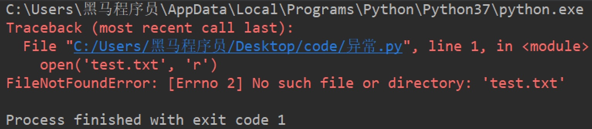

  

  # 二. 异常的写法

  ## 2.1 语法

  ``` python
  try:
      可能发生错误的代码
  except:
      如果出现异常执行的代码
  ```

  ## 2.2 快速体验

  需求：尝试以`r`模式打开文件，如果文件不存在，则以`w`方式打开。

  ``` python
  try:
      f = open('test.txt', 'r')
  except:
      f = open('test.txt', 'w')
  ```

  ## 2.3 捕获指定异常

  ### 2.3.1 语法

  ``` python
  try:
      可能发生错误的代码
  except 异常类型:
      如果捕获到该异常类型执行的代码
  ```

  ### 2.3.2 体验

  ``` python
  try:
      print(num)
  except NameError:
      print('有错误')
  ```

  > 注意：
  >
  > 1. 如果尝试执行的代码的异常类型和要捕获的异常类型不一致，则无法捕获异常。
  > 2. 一般try下方只放一行尝试执行的代码。

  ### 2.3.3 捕获多个指定异常

  当捕获多个异常时，可以把要捕获的异常类型的名字，放到except 后，并使用元组的方式进行书写。

  ``` python
  try:
      print(1/0)
  
  except (NameError, ZeroDivisionError):
      print('有错误')
  ```

  ### 2.3.4 捕获异常描述信息

  ``` python
  try:
      print(num)
  except (NameError, ZeroDivisionError) as result:
      print(result)
  ```

  ### 2.3.5 捕获所有异常

  Exception是所有程序异常类的父类。

  ``` python
  try:
      print(num)
  except Exception as result:
      print(result)
  ```

  

  ## 2.4 异常的else

  else表示的是如果没有异常要执行的代码。

  ``` python
  try:
      print(1)
  except Exception as result:
      print(result)
  else:
      print('我是else，是没有异常的时候执行的代码')
  ```

  ## 2.5 异常的finally

  finally表示的是无论是否异常都要执行的代码，例如关闭文件。

  ``` python
  try:
      f = open('test.txt', 'r')
  except Exception as result:
      f = open('test.txt', 'w')
  else:
      print('没有异常，真开心')
  finally:
      f.close()
  ```

  # 三. 异常的传递

  体验异常传递

  需求：

  ​	1. 尝试只读方式打开test.txt文件，如果文件存在则读取文件内容，文件不存在则提示用户即可。

  ​	2. 读取内容要求：尝试循环读取内容，读取过程中如果检测到用户意外终止程序，则`except`捕获异常并提示用户。

  ``` python
  import time
  try:
      f = open('test.txt')
      try:
          while True:
              content = f.readline()
              if len(content) == 0:
                  break
              time.sleep(2)
              print(content)
      except:
          # 如果在读取文件的过程中，产生了异常，那么就会捕获到
          # 比如 按下了 ctrl+c
          print('意外终止了读取数据')
      finally:
          f.close()
          print('关闭文件')
  except:
      print("没有这个文件")
  ```

  # 四. 自定义异常

  在Python中，抛出自定义异常的语法为` raise 异常类对象`。

  需求：密码长度不足，则报异常（用户输入密码，如果输入的长度不足3位，则报错，即抛出自定义异常，并捕获该异常）。

  ``` python
  # 自定义异常类，继承Exception
  class ShortInputError(Exception):
      def __init__(self, length, min_len):
          self.length = length
          self.min_len = min_len
  
      # 设置抛出异常的描述信息
      def __str__(self):
          return f'你输入的长度是{self.length}, 不能少于{self.min_len}个字符'
  
  
  def main():
      try:
          con = input('请输入密码：')
          if len(con) < 3:
              raise ShortInputError(len(con), 3)
      except Exception as result:
          print(result)
      else:
          print('密码已经输入完成')
  
  
  main()
  ```

  

  # 五. 总结

  - 异常语法

  ``` python
  try:
    	可能发生异常的代码
  except:
    	如果出现异常执行的代码
  else:
    	没有异常执行的代码
  finally:
    	无论是否异常都要执行的代码
  ```

  - 捕获异常

  ``` python
  except 异常类型:
    	代码
  
  except 异常类型 as xx:
  		代码
  ```

  - 自定义异常

  ``` python
  # 1. 自定义异常类
  class 异常类类名(Exception):
    	代码
      
      # 设置抛出异常的描述信息
      def __str__(self):
        return ...
  
  
  # 2. 抛出异常
  raise 异常类名()
  
  # 捕获异常
  except Exception...
  ```

  # 课程：模块和包

  # 目标

  - 了解模块
  - 导入模块
  - 制作模块
  - `__all__`
  - 包的使用方法

  

  # 一. 模块

  Python 模块(Module)，是一个 Python 文件，以 .py 结尾，包含了 Python 对象定义和Python语句。

  模块能定义函数，类和变量，模块里也能包含可执行的代码。

  ## 1.1. 导入模块

  ### 1.1.1 导入模块的方式

  - import 模块名
  - from 模块名 import 功能名
  - from 模块名 import *
  - import 模块名 as 别名
  - from 模块名 import 功能名 as 别名

  ### 1.1.2 导入方式详解

  #### 1.1.2.1 import

  - 语法

  ``` python
  # 1. 导入模块
  import 模块名
  import 模块名1, 模块名2...
  
  # 2. 调用功能
  模块名.功能名()
  ```

  - 体验

  ``` python
  import math
  print(math.sqrt(9))  # 3.0
  ```

  #### 1.1.2.2 from..import..

  - 语法

  ``` python
  from 模块名 import 功能1, 功能2, 功能3...
  ```

  - 体验

  ``` python
  from math import sqrt
  print(sqrt(9))
  ```

  

  #### 1.1.2.3 from .. import *

  - 语法

  ``` python
  from 模块名 import *
  ```

  - 体验

  ``` python
  from math import *
  print(sqrt(9))
  ```

  #### 1.1.2.4 as定义别名

  - 语法

  ``` python
  # 模块定义别名
  import 模块名 as 别名
  
  # 功能定义别名
  from 模块名 import 功能 as 别名
  ```

  - 体验

  ``` python
  # 模块别名
  import time as tt
  
  tt.sleep(2)
  print('hello')
  
  # 功能别名
  from time import sleep as sl
  sl(2)
  print('hello')
  ```

  

  ## 1.2. 制作模块

  在Python中，每个Python文件都可以作为一个模块，模块的名字就是文件的名字。**也就是说自定义模块名必须要符合标识符命名规则。**

  ### 1.2.1 定义模块

  新建一个Python文件，命名为`my_module1.py`，并定义`testA`函数。

  ``` python
  def testA(a, b):
      print(a + b)
  ```

  

  ### 1.2.2 测试模块

  在实际开中，当一个开发人员编写完一个模块后，为了让模块能够在项目中达到想要的效果，这个开发人员会自行在py文件中添加一些测试信息.，例如，在`my_module1.py`文件中添加测试代码。

  ``` python
  def testA(a, b):
      print(a + b)
  
  
  testA(1, 1)
  ```

  此时，无论是当前文件，还是其他已经导入了该模块的文件，在运行的时候都会自动执行`testA`函数的调用。

  解决办法如下：

  ``` python
  def testA(a, b):
      print(a + b)
  
  # 只在当前文件中调用该函数，其他导入的文件内不符合该条件，则不执行testA函数调用
  if __name__ == '__main__':
      testA(1, 1)
  ```

  

  ### 1.2.3 调用模块

  ```python
  import my_module1
  my_module1.testA(1, 1)
  ```

  

  ### 1.2.4 注意事项

  如果使用`from .. import ..`或`from .. import *`导入多个模块的时候，且模块内有同名功能。当调用这个同名功能的时候，调用到的是后面导入的模块的功能。

  - 体验

  ``` python
  # 模块1代码
  def my_test(a, b):
      print(a + b)
  
  # 模块2代码
  def my_test(a, b):
      print(a - b)
     
  # 导入模块和调用功能代码
  from my_module1 import my_test
  from my_module2 import my_test
  
  # my_test函数是模块2中的函数
  my_test(1, 1)
  ```

  

  ## 1.3. 模块定位顺序

  当导入一个模块，Python解析器对模块位置的搜索顺序是：

  1. 当前目录
  2. 如果不在当前目录，Python则搜索在shell变量PYTHONPATH下的每个目录。
  3. 如果都找不到，Python会察看默认路径。UNIX下，默认路径一般为/usr/local/lib/python/

  模块搜索路径存储在system模块的sys.path变量中。变量里包含当前目录，PYTHONPATH和由安装过程决定的默认目录。

  - 注意
    - 自己的文件名不要和已有模块名重复，否则导致模块功能无法使用
    - `使用from 模块名 import 功能`的时候，如果功能名字重复，调用到的是最后定义或导入的功能。

  

  ## 1.4. `__all__`

  如果一个模块文件中有`__all__`变量，当使用`from xxx import *`导入时，只能导入这个列表中的元素。

  - my_module1模块代码

  ``` python
  __all__ = ['testA']
  
  
  def testA():
      print('testA')
  
  
  def testB():
      print('testB')
  ```

  - 导入模块的文件代码

  ``` python
  from my_module1 import *
  testA()
  testB()
  ```

  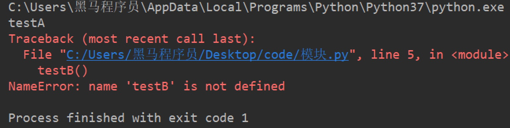

  

  # 二. 包

  包将有联系的模块组织在一起，即放到同一个文件夹下，并且在这个文件夹创建一个名字为`__init__.py` 文件，那么这个文件夹就称之为包。

  ## 2.1 制作包

  [New] — [Python Package] — 输入包名 — [OK] — 新建功能模块(有联系的模块)。

  注意：新建包后，包内部会自动创建`__init__.py`文件，这个文件控制着包的导入行为。

  ### 2.1.1 快速体验

  1. 新建包`mypackage`
  2. 新建包内模块：`my_module1` 和 `my_module2`
  3. 模块内代码如下

  ``` python
  # my_module1
  print(1)
  
  
  def info_print1():
      print('my_module1')
  ```

  ``` python
  # my_module2
  print(2)
  
  
  def info_print2():
      print('my_module2')
  ```

  

  ## 2.2 导入包

  ### 2.2.1 方法一

  ``` python
  import 包名.模块名
  
  包名.模块名.目标
  ```

  #### 2.2.1.1 体验

  ``` python
  import my_package.my_module1
  
  my_package.my_module1.info_print1()
  ```

  ### 2.2.2 方法二

  注意：必须在`__init__.py`文件中添加`__all__ = []`，控制允许导入的模块列表。

  ``` python
  from 包名 import *
  模块名.目标
  ```

  #### 2.2.2.1 体验

  ``` python
  from my_package import *
  
  my_module1.info_print1()
  ```

  

  # 三. 总结

  - 导入模块方法

  ``` python
  import 模块名
  
  from 模块名 import 目标
  
  from 模块名 import *
  ```

  - 导入包

  ``` python
  import 包名.模块名
  
  from 包名 import *
  ```

  - `__all__ = []` ：允许导入的模块或功能列表

  

  ### 多任务

  - 使用多任务就能充分利用CPU资源，提高程序的执行效率，让你的程序具备处理多个任务的能力。
  - 多任务执行方式有两种方式：**并发**和**并行**，这里并行才是多个任务真正意义一起执行。

  - 进程是操作系统进行资源分配的基本单位。
  - 进程是Python程序中实现多任务的一种方式

**一个程序运行后至少有一个进程，一个进程默认有一个线程**，进程里面可以创建多个线程，**线程是依附在进程里面的，没有进程就没有线程**。

**学习目标**

- 能够使用多进程完成多任务

------

### 1 导入进程包

```py
#导入进程包
import multiprocessing
```

### 2. Process进程类的说明

**Process([group [, target [, name [, args [, kwargs]]]]])**

- group：指定进程组，目前只能使用None
- target：执行的目标任务名
- name：进程名字
- args：以元组方式给执行任务传参
- kwargs：以字典方式给执行任务传参

**Process创建的实例对象的常用方法:**

- start()：启动子进程实例（创建子进程）
- join()：等待子进程执行结束
- terminate()：不管任务是否完成，立即终止子进程

**Process创建的实例对象的常用属性:**

name：当前进程的别名，默认为Process-N，N为从1开始递增的整数

### 3. 多进程完成多任务的代码

```python
import multiprocessing
import time


# 跳舞任务
def dance():
    for i in range(5):
        print("跳舞中...")
        time.sleep(0.2)


# 唱歌任务
def sing():
    for i in range(5):
        print("唱歌中...")
        time.sleep(0.2)

if __name__ == '__main__':
    # 创建跳舞的子进程
    # group: 表示进程组，目前只能使用None
    # target: 表示执行的目标任务名(函数名、方法名)
    # name: 进程名称, 默认是Process-1, .....
    dance_process = multiprocessing.Process(target=dance, name="myprocess1")
    sing_process = multiprocessing.Process(target=sing)

    # 启动子进程执行对应的任务
    dance_process.start()
    sing_process.start()
```

**执行结果:**

```python
唱歌中...
跳舞中...
唱歌中...
跳舞中...
唱歌中...
跳舞中...
唱歌中...
跳舞中...
唱歌中...
跳舞中...
```

### 4. 小结

1. 导入进程包
   - import multiprocessing
2. 创建子进程并指定执行的任务
   - sub_process = multiprocessing.Process (target=任务名)
3. 启动进程执行任务
   - sub_process.start()

# 获取进程编号

**学习目标**

- 能够知道如果获取进程编号

------

### 1. 获取进程编号的目的

**获取进程编号的目的是验证主进程和子进程的关系，可以得知子进程是由那个主进程创建出来的。**

获取进程编号的两种操作

- 获取当前进程编号
- 获取当前父进程编号

### 2. 获取当前进程编号

**os.getpid()** 表示获取当前进程编号

**示例代码:**

```py
import multiprocessing
import time
import os


# 跳舞任务
def dance():
    # 获取当前进程的编号
    print("dance:", os.getpid())
    # 获取当前进程
    print("dance:", multiprocessing.current_process())
    for i in range(5):
        print("跳舞中...")
        time.sleep(0.2)
        # 扩展:根据进程编号杀死指定进程
        os.kill(os.getpid(), 9)


# 唱歌任务
def sing():
    # 获取当前进程的编号
    print("sing:", os.getpid())
    # 获取当前进程
    print("sing:", multiprocessing.current_process())
    for i in range(5):
        print("唱歌中...")
        time.sleep(0.2)


if __name__ == '__main__':

    # 获取当前进程的编号
    print("main:", os.getpid())
    # 获取当前进程
    print("main:", multiprocessing.current_process())
    # 创建跳舞的子进程
    # group: 表示进程组，目前只能使用None
    # target: 表示执行的目标任务名(函数名、方法名)
    # name: 进程名称, 默认是Process-1, .....
    dance_process = multiprocessing.Process(target=dance, name="myprocess1")
    sing_process = multiprocessing.Process(target=sing)

    # 启动子进程执行对应的任务
    dance_process.start()
    sing_process.start()
```

**执行结果:**

```py
main: 70763
main: <_MainProcess(MainProcess, started)>
dance: 70768
dance: <Process(myprocess1, started)>
跳舞中...
sing: 70769
sing: <Process(Process-2, started)>
唱歌中...
唱歌中...
唱歌中...
唱歌中...
唱歌中...
```

### 3. 获取当前父进程编号

**os.getppid()** 表示获取当前父进程编号

**示例代码:**

```py
import multiprocessing
import time
import os


# 跳舞任务
def dance():
    # 获取当前进程的编号
    print("dance:", os.getpid())
    # 获取当前进程
    print("dance:", multiprocessing.current_process())
    # 获取父进程的编号
    print("dance的父进程编号:", os.getppid())
    for i in range(5):
        print("跳舞中...")
        time.sleep(0.2)
        # 扩展:根据进程编号杀死指定进程
        os.kill(os.getpid(), 9)


# 唱歌任务
def sing():
    # 获取当前进程的编号
    print("sing:", os.getpid())
    # 获取当前进程
    print("sing:", multiprocessing.current_process())
    # 获取父进程的编号
    print("sing的父进程编号:", os.getppid())
    for i in range(5):
        print("唱歌中...")
        time.sleep(0.2)


if __name__ == '__main__':

    # 获取当前进程的编号
    print("main:", os.getpid())
    # 获取当前进程
    print("main:", multiprocessing.current_process())
    # 创建跳舞的子进程
    # group: 表示进程组，目前只能使用None
    # target: 表示执行的目标任务名(函数名、方法名)
    # name: 进程名称, 默认是Process-1, .....
    dance_process = multiprocessing.Process(target=dance, name="myprocess1")
    sing_process = multiprocessing.Process(target=sing)

    # 启动子进程执行对应的任务
    dance_process.start()
    sing_process.start()
main: 70860
main: <_MainProcess(MainProcess, started)>
dance: 70861
dance: <Process(myprocess1, started)>
dance的父进程编号: 70860
跳舞中...
sing: 70862
sing: <Process(Process-2, started)>
sing的父进程编号: 70860
唱歌中...
唱歌中...
唱歌中...
唱歌中...
唱歌中...
```

### 4. 小结

- 获取当前进程编号
  - os.getpid()
- 获取当前父进程编号
  - os.getppid()
- 获取进程编号可以查看父子进程的关系

# 进程执行带有参数的任务

**学习目标**

- 能够写出进程执行带有参数的任务

------

### 1. 进程执行带有参数的任务的介绍

前面我们使用进程执行的任务是没有参数的，假如我们使用进程执行的任务带有参数，如何给函数传参呢?

Process类执行任务并给任务传参数有两种方式:

- args 表示以元组的方式给执行任务传参
- kwargs 表示以字典方式给执行任务传参

### 2. args参数的使用

**示例代码:**

```py
import multiprocessing
import time


# 带有参数的任务
def task(count):
    for i in range(count):
        print("任务执行中..")
        time.sleep(0.2)
    else:
        print("任务执行完成")


if __name__ == '__main__':
    # 创建子进程
    # args: 以元组的方式给任务传入参数
    sub_process = multiprocessing.Process(target=task, args=(5,))
    sub_process.start()
```

**执行结果:**

```py
任务执行中..
任务执行中..
任务执行中..
任务执行中..
任务执行中..
任务执行完成
```

### 3. kwargs参数的使用

**示例代码:**

```py
import multiprocessing
import time


# 带有参数的任务
def task(count):
    for i in range(count):
        print("任务执行中..")
        time.sleep(0.2)
    else:
        print("任务执行完成")


if __name__ == '__main__':
    # 创建子进程

    # kwargs: 表示以字典方式传入参数
    sub_process = multiprocessing.Process(target=task, kwargs={"count": 3})
    sub_process.start()
```

**执行结果:**

```py
任务执行中..
任务执行中..
任务执行中..
任务执行完成
```

### 4. 小结

- 进程执行任务并传参有两种方式:
  - **元组方式传参(args)**: 元组方式传参一定要和参数的顺序保持一致。
  - **字典方式传参(kwargs)**: 字典方式传参字典中的key一定要和参数名保持一致。

# 进程的注意点

**学习目标**

- 能够说出进程的注意点

------

### 1. 进程的注意点介绍

1. 进程之间不共享全局变量
2. 主进程会等待所有的子进程执行结束再结束

### 2. 进程之间不共享全局变量

```py
import multiprocessing
import time

# 定义全局变量
g_list = list()


# 添加数据的任务
def add_data():
    for i in range(5):
        g_list.append(i)
        print("add:", i)
        time.sleep(0.2)

    # 代码执行到此，说明数据添加完成
    print("add_data:", g_list)


def read_data():
    print("read_data", g_list)


if __name__ == '__main__':
    # 创建添加数据的子进程
    add_data_process = multiprocessing.Process(target=add_data)
    # 创建读取数据的子进程
    read_data_process = multiprocessing.Process(target=read_data)

    # 启动子进程执行对应的任务
    add_data_process.start()
    # 主进程等待添加数据的子进程执行完成以后程序再继续往下执行，读取数据
    add_data_process.join()
    read_data_process.start()

    print("main:", g_list)

    # 总结: 多进程之间不共享全局变量
```

**执行结果:**

```py
add: 0
add: 1
add: 2
add: 3
add: 4
add_data: [0, 1, 2, 3, 4]
main: []
read_data []
```

**进程之间不共享全局变量的解释效果图:**


### 3. 进程之间不共享全局变量的小结

- 创建子进程会对主进程资源进行拷贝，也就是说子进程是主进程的一个副本，好比是一对双胞胎，之所以进程之间不共享全局变量，是因为操作的不是同一个进程里面的全局变量，只不过不同进程里面的全局变量名字相同而已。

### 4. 主进程会等待所有的子进程执行结束再结束

假如我们现在创建一个子进程，这个子进程执行完大概需要2秒钟，现在让主进程执行0.5秒钟就退出程序，查看一下执行结果，示例代码如下:

```py
import multiprocessing
import time


# 定义进程所需要执行的任务
def task():
    for i in range(10):
        print("任务执行中...")
        time.sleep(0.2)

if __name__ == '__main__':
    # 创建子进程
    sub_process = multiprocessing.Process(target=task)
    sub_process.start()

    # 主进程延时0.5秒钟
    time.sleep(0.5)
    print("over")
    exit()

    # 总结： 主进程会等待所有的子进程执行完成以后程序再退出
```

**执行结果:**

```py
任务执行中...
任务执行中...
任务执行中...
over
任务执行中...
任务执行中...
任务执行中...
任务执行中...
任务执行中...
任务执行中...
任务执行中...
```

**说明:**

通过上面代码的执行结果，我们可以得知: **主进程会等待所有的子进程执行结束再结束**

假如我们就让主进程执行0.5秒钟，子进程就销毁不再执行，那怎么办呢?

- 我们可以设置**守护主进程** 或者 在主进程退出之前 **让子进程销毁**

**守护主进程:**

- 守护主进程就是主进程退出子进程销毁不再执行

**子进程销毁:**

- 子进程执行结束

**保证主进程正常退出的示例代码:**

```py
import multiprocessing
import time


# 定义进程所需要执行的任务
def task():
    for i in range(10):
        print("任务执行中...")
        time.sleep(0.2)

if __name__ == '__main__':
    # 创建子进程
    sub_process = multiprocessing.Process(target=task)
    # 设置守护主进程，主进程退出子进程直接销毁，子进程的生命周期依赖与主进程
    # sub_process.daemon = True
    sub_process.start()

    time.sleep(0.5)
    print("over")
    # 让子进程销毁
    sub_process.terminate()
    exit()

    # 总结： 主进程会等待所有的子进程执行完成以后程序再退出
    # 如果想要主进程退出子进程销毁，可以设置守护主进程或者在主进程退出之前让子进程销毁
```

**执行结果:**

```py
任务执行中...
任务执行中...
任务执行中...
over
```

### 5. 主进程会等待所有的子进程执行结束再结束的小结

- 为了保证子进程能够正常的运行，主进程会等所有的子进程执行完成以后再销毁，设置守护主进程的目的是**主进程退出子进程销毁，不让主进程再等待子进程去执行**。
- 设置守护主进程方式： **子进程对象.daemon = True**
- 销毁子进程方式： **子进程对象.terminate()**

# 线程

**学习目标**

能够知道线程的作用

------

### 1. 线程的介绍

在Python中，想要实现多任务除了使用进程，还可以使用线程来完成，线程是实现多任务的另外一种方式。

### 2. 线程的概念

线程是进程中执行代码的一个分支，每个执行分支（线程）要想工作执行代码需要cpu进行调度 ，也就是说线程是cpu调度的基本单位，每个进程至少都有一个线程，而这个线程就是我们通常说的主线程。

### 3. 线程的作用

多线程可以完成多任务

**多线程效果图:**


### 4. 小结

- 线程是Python程序中实现多任务的另外一种方式，线程的执行需要cpu调度来完成。

# 多线程的使用

**学习目标**

- 能够使用多线程完成多任务

------

### 1. 导入线程模块

```py
#导入线程模块
import threading
```

### 2. 线程类Thread参数说明

Thread([group [, target [, name [, args [, kwargs]]]]])

- group: 线程组，目前只能使用None
- target: 执行的目标任务名
- args: 以元组的方式给执行任务传参
- kwargs: 以字典方式给执行任务传参
- name: 线程名，一般不用设置

### 3. 启动线程

启动线程使用start方法

### 4. 多线程完成多任务的代码

```py
import threading
import time

# 唱歌任务
def sing():
    # 扩展： 获取当前线程
    # print("sing当前执行的线程为：", threading.current_thread())
    for i in range(3):
        print("正在唱歌...%d" % i)
        time.sleep(1)

# 跳舞任务
def dance():
    # 扩展： 获取当前线程
    # print("dance当前执行的线程为：", threading.current_thread())
    for i in range(3):
        print("正在跳舞...%d" % i)
        time.sleep(1)


if __name__ == '__main__':
    # 扩展： 获取当前线程
    # print("当前执行的线程为：", threading.current_thread())
    # 创建唱歌的线程
    # target： 线程执行的函数名
    sing_thread = threading.Thread(target=sing)

    # 创建跳舞的线程
    dance_thread = threading.Thread(target=dance)

    # 开启线程
    sing_thread.start()
    dance_thread.start()
```

**执行结果:**

```py
正在唱歌...0
正在跳舞...0
正在唱歌...1
正在跳舞...1
正在唱歌...2
正在跳舞...2
```

### 5. 小结

1. 导入线程模块
   - import threading
2. 创建子线程并指定执行的任务
   - sub_thread = threading.Thread(target=任务名)
3. 启动线程执行任务
   - sub_thread.start()

# 线程执行带有参数的任务

**学习目标**

- 能够写出线程执行带有参数的任务

------

### 1. 线程执行带有参数的任务的介绍

前面我们使用线程执行的任务是没有参数的，假如我们使用线程执行的任务带有参数，如何给函数传参呢?

Thread类执行任务并给任务传参数有两种方式:

- args 表示以元组的方式给执行任务传参
- kwargs 表示以字典方式给执行任务传参

### 2. args参数的使用

**示例代码:**

```py
import threading
import time


# 带有参数的任务
def task(count):
    for i in range(count):
        print("任务执行中..")
        time.sleep(0.2)
    else:
        print("任务执行完成")


if __name__ == '__main__':
    # 创建子线程
    # args: 以元组的方式给任务传入参数
    sub_thread = threading.Thread(target=task, args=(5,))
    sub_thread.start()
```

**执行结果:**

```py
任务执行中..
任务执行中..
任务执行中..
任务执行中..
任务执行中..
任务执行完成
```

### 3. kwargs参数的使用

**示例代码:**

```py
import threading
import time


# 带有参数的任务
def task(count):
    for i in range(count):
        print("任务执行中..")
        time.sleep(0.2)
    else:
        print("任务执行完成")


if __name__ == '__main__':
    # 创建子线程
    # kwargs: 表示以字典方式传入参数
    sub_thread = threading.Thread(target=task, kwargs={"count": 3})
    sub_thread.start()
```

**执行结果:**

```py
任务执行中..
任务执行中..
任务执行中..
任务执行完成
```

### 4. 小结

- 线程执行任务并传参有两种方式:
  - **元组方式传参(args)** ：元组方式传参一定要和参数的顺序保持一致。
  - **字典方式传参(kwargs)**：字典方式传参字典中的key一定要和参数名保持一致。

# 线程的注意点

**学习目标**

- 能够说出线程的注意点

------

### 1. 线程的注意点介绍

1. 线程之间执行是无序的
2. 主线程会等待所有的子线程执行结束再结束
3. 线程之间共享全局变量
4. 线程之间共享全局变量数据出现错误问题

### 2. 线程之间执行是无序的

```py
import threading
import time


def task():
    time.sleep(1)
    print("当前线程:", threading.current_thread().name)


if __name__ == '__main__':

   for _ in range(5):
       sub_thread = threading.Thread(target=task)
       sub_thread.start()
```

**执行结果:**

```py
当前线程: Thread-1
当前线程: Thread-2
当前线程: Thread-4
当前线程: Thread-5
当前线程: Thread-3
```

**说明:**

- 线程之间执行是无序的，它是由cpu调度决定的 ，cpu调度哪个线程，哪个线程就先执行，没有调度的线程不能执行。
- 进程之间执行也是无序的，它是由操作系统调度决定的，操作系统调度哪个进程，哪个进程就先执行，没有调度的进程不能执行。

### 3. 主线程会等待所有的子线程执行结束再结束

假如我们现在创建一个子线程，这个子线程执行完大概需要2.5秒钟，现在让主线程执行1秒钟就退出程序，查看一下执行结果，示例代码如下:

```py
import threading
import time


# 测试主线程是否会等待子线程执行完成以后程序再退出
def show_info():
    for i in range(5):
        print("test:", i)
        time.sleep(0.5)


if __name__ == '__main__':
    sub_thread = threading.Thread(target=show_info)
    sub_thread.start()

    # 主线程延时1秒
    time.sleep(1)
    print("over")
```

**执行结果:**

```py
test: 0
test: 1
over
test: 2
test: 3
test: 4
```

**说明:**

通过上面代码的执行结果，我们可以得知: **主线程会等待所有的子线程执行结束再结束**

假如我们就让主线程执行1秒钟，子线程就销毁不再执行，那怎么办呢?

- 我们可以设置**守护主线程**

**守护主线程:**

- 守护主线程就是主线程退出子线程销毁不再执行

**设置守护主线程有两种方式：**

1. threading.Thread(target=show_info, daemon=True)
2. 线程对象.setDaemon(True)

**设置守护主线程的示例代码:**

```py
import threading
import time


# 测试主线程是否会等待子线程执行完成以后程序再退出
def show_info():
    for i in range(5):
        print("test:", i)
        time.sleep(0.5)


if __name__ == '__main__':
    # 创建子线程守护主线程 
    # daemon=True 守护主线程
    # 守护主线程方式1
    sub_thread = threading.Thread(target=show_info, daemon=True)
    # 设置成为守护主线程，主线程退出后子线程直接销毁不再执行子线程的代码
    # 守护主线程方式2
    # sub_thread.setDaemon(True)
    sub_thread.start()

    # 主线程延时1秒
    time.sleep(1)
    print("over")
```

**执行结果:**

```py
test: 0
test: 1
over
```

### 3. 线程之间共享全局变量

**需求:**

1. 定义一个列表类型的全局变量
2. 创建两个子线程分别执行向全局变量添加数据的任务和向全局变量读取数据的任务
3. 查看线程之间是否共享全局变量数据

```py
import threading
import time


# 定义全局变量
my_list = list()

# 写入数据任务
def write_data():
    for i in range(5):
        my_list.append(i)
        time.sleep(0.1)
    print("write_data:", my_list)


# 读取数据任务
def read_data():
    print("read_data:", my_list)


if __name__ == '__main__':
    # 创建写入数据的线程
    write_thread = threading.Thread(target=write_data)
    # 创建读取数据的线程
    read_thread = threading.Thread(target=read_data)

    write_thread.start()
    # 延时
    # time.sleep(1)
    # 主线程等待写入线程执行完成以后代码在继续往下执行
    write_thread.join()
    print("开始读取数据啦")
    read_thread.start()
```

**执行结果:**

```py
write_data: [0, 1, 2, 3, 4]
开始读取数据啦
read_data: [0, 1, 2, 3, 4]
```

### 4. 线程之间共享全局变量数据出现错误问题

**需求:**

1. 定义两个函数，实现循环100万次，每循环一次给全局变量加1
2. 创建两个子线程执行对应的两个函数，查看计算后的结果

```py
import threading

# 定义全局变量
g_num = 0


# 循环一次给全局变量加1
def sum_num1():
    for i in range(1000000):
        global g_num
        g_num += 1

    print("sum1:", g_num)


# 循环一次给全局变量加1
def sum_num2():
    for i in range(1000000):
        global g_num
        g_num += 1
    print("sum2:", g_num)


if __name__ == '__main__':
    # 创建两个线程
    first_thread = threading.Thread(target=sum_num1)
    second_thread = threading.Thread(target=sum_num2)

    # 启动线程
    first_thread.start()
    # 启动线程
    second_thread.start()
```

**执行结果:**

```py
sum1: 1210949
sum2: 1496035
```

**注意点:**

**多线程同时对全局变量操作数据发生了错误**

**错误分析:**

两个线程first_thread和second_thread都要对全局变量g_num(默认是0)进行加1运算，但是由于是多线程同时操作，有可能出现下面情况：

1. 在g_num=0时，first_thread取得g_num=0。此时系统把first_thread调度为”sleeping”状态，把second_thread转换为”running”状态，t2也获得g_num=0
2. 然后second_thread对得到的值进行加1并赋给g_num，使得g_num=1
3. 然后系统又把second_thread调度为”sleeping”，把first_thread转为”running”。线程t1又把它之前得到的0加1后赋值给g_num。
4. 这样导致虽然first_thread和first_thread都对g_num加1，但结果仍然是g_num=1

**全局变量数据错误的解决办法:**

线程同步: 保证同一时刻只能有一个线程去操作全局变量 同步: 就是协同步调，按预定的先后次序进行运行。如:你说完，我再说, 好比现实生活中的对讲机

线程同步的方式:

1. **线程等待(join)**
2. **互斥锁**

**线程等待的示例代码:**

```py
import threading

# 定义全局变量
g_num = 0


# 循环1000000次每次给全局变量加1
def sum_num1():
    for i in range(1000000):
        global g_num
        g_num += 1

    print("sum1:", g_num)


# 循环1000000次每次给全局变量加1
def sum_num2():
    for i in range(1000000):
        global g_num
        g_num += 1
    print("sum2:", g_num)


if __name__ == '__main__':
    # 创建两个线程
    first_thread = threading.Thread(target=sum_num1)
    second_thread = threading.Thread(target=sum_num2)

    # 启动线程
    first_thread.start()
    # 主线程等待第一个线程执行完成以后代码再继续执行，让其执行第二个线程
    # 线程同步： 一个任务执行完成以后另外一个任务才能执行，同一个时刻只有一个任务在执行
    first_thread.join()
    # 启动线程
    second_thread.start()
```

**执行结果:**

```py
sum1: 1000000
sum2: 2000000
```

### 5. 小结

- 线程执行执行是无序的
- 主线程默认会等待所有子线程执行结束再结束，设置守护主线程的目的是主线程退出子线程销毁。
- 线程之间共享全局变量，好处是可以对全局变量的数据进行共享。
- 线程之间共享全局变量可能会导致数据出现错误问题，可以使用线程同步方式来解决这个问题。
  - 线程等待(join)

# 互斥锁

**学习目标**

- 能够知道互斥锁的作用

------

### 1.互斥锁的概念

互斥锁: 对共享数据进行锁定，保证同一时刻只能有一个线程去操作。

注意:

- 互斥锁是**多个线程一起去抢**，抢到锁的线程先执行，没有抢到锁的线程需要等待，等互斥锁使用完释放后，其它等待的线程再去抢这个锁。

**为了更好的理解互斥锁，请看下面的图:**


### 3. 互斥锁的使用

threading模块中定义了Lock变量，这个变量本质上是一个函数，通过调用这个函数可以获取一把互斥锁。

**互斥锁使用步骤:**

```py
# 创建锁
mutex = threading.Lock()

# 上锁
mutex.acquire()

...这里编写代码能保证同一时刻只能有一个线程去操作, 对共享数据进行锁定...

# 释放锁
mutex.release()
```

**注意点:**

- **acquire和release方法之间的代码同一时刻只能有一个线程去操作**
- **如果在调用acquire方法的时候 其他线程已经使用了这个互斥锁，那么此时acquire方法会堵塞，直到这个互斥锁释放后才能再次上锁。**

### 4. 使用互斥锁完成2个线程对同一个全局变量各加100万次的操作

```py
import threading


# 定义全局变量
g_num = 0

# 创建全局互斥锁
lock = threading.Lock()


# 循环一次给全局变量加1
def sum_num1():
    # 上锁
    lock.acquire()
    for i in range(1000000):
        global g_num
        g_num += 1

    print("sum1:", g_num)
    # 释放锁
    lock.release()


# 循环一次给全局变量加1
def sum_num2():
    # 上锁
    lock.acquire()
    for i in range(1000000):
        global g_num
        g_num += 1
    print("sum2:", g_num)
    # 释放锁
    lock.release()


if __name__ == '__main__':
    # 创建两个线程
    first_thread = threading.Thread(target=sum_num1)
    second_thread = threading.Thread(target=sum_num2)
    # 启动线程
    first_thread.start()
    second_thread.start()

    # 提示：加上互斥锁，那个线程抢到这个锁我们决定不了，那线程抢到锁那个线程先执行，没有抢到的线程需要等待
    # 加上互斥锁多任务瞬间变成单任务，性能会下降，也就是说同一时刻只能有一个线程去执行
```

**执行结果:**

```py
sum1: 1000000
sum2: 2000000
```

**说明:**

通过执行结果可以地址**互斥锁能够保证多个线程访问共享数据不会出现数据错误问题**

### 5. 小结

- 互斥锁的作用就是保证同一时刻只能有一个线程去操作共享数据，保证共享数据不会出现错误问题
- 使用互斥锁的好处确保某段关键代码只能由一个线程从头到尾完整地去执行
- 使用互斥锁会影响代码的执行效率，多任务改成了单任务执行
- 互斥锁如果没有使用好容易出现死锁的情况

# 死锁

**学习目标**

- 能够知道产生死锁的原因

------

### 1. 死锁的概念

死锁: 一直等待对方释放锁的情景就是死锁

为了更好的理解死锁，来看一个现实生活的效果图:


**说明:**

现实社会中，男女双方一直等待对方先道歉的这种行为就好比是死锁。

**死锁的结果**

- 会造成应用程序的停止响应，不能再处理其它任务了。

### 2. 死锁示例

**需求:**

根据下标在列表中取值, 保证同一时刻只能有一个线程去取值

```py
import threading
import time

# 创建互斥锁
lock = threading.Lock()


# 根据下标去取值， 保证同一时刻只能有一个线程去取值
def get_value(index):

    # 上锁
    lock.acquire()
    print(threading.current_thread())
    my_list = [3,6,8,1]
    # 判断下标释放越界
    if index >= len(my_list):
        print("下标越界:", index)
        return
    value = my_list[index]
    print(value)
    time.sleep(0.2)
    # 释放锁
    lock.release()


if __name__ == '__main__':
    # 模拟大量线程去执行取值操作
    for i in range(30):
        sub_thread = threading.Thread(target=get_value, args=(i,))
        sub_thread.start()
```

### 3. 避免死锁

- 在合适的地方释放锁

```py
import threading
import time

# 创建互斥锁
lock = threading.Lock()


# 根据下标去取值， 保证同一时刻只能有一个线程去取值
def get_value(index):

    # 上锁
    lock.acquire()
    print(threading.current_thread())
    my_list = [3,6,8,1]
    if index >= len(my_list):
        print("下标越界:", index)
        # 当下标越界需要释放锁，让后面的线程还可以取值
        lock.release()
        return
    value = my_list[index]
    print(value)
    time.sleep(0.2)
    # 释放锁
    lock.release()


if __name__ == '__main__':
    # 模拟大量线程去执行取值操作
    for i in range(30):
        sub_thread = threading.Thread(target=get_value, args=(i,))
        sub_thread.start()
```

### 4. 小结

- 使用互斥锁的时候需要注意死锁的问题，要在合适的地方注意释放锁。
- 死锁一旦产生就会造成应用程序的停止响应，应用程序无法再继续往下执行了。

# 进程和线程的对比

**学习目标**

- 能够知道进程和线程的关系

------

### 1. 进程和线程的对比的三个方向

1. 关系对比
2. 区别对比
3. 优缺点对比

### 2. 关系对比

1. 线程是依附在进程里面的，没有进程就没有线程。
2. 一个进程默认提供一条线程，进程可以创建多个线程。


### 2. 区别对比

1. 进程之间不共享全局变量
2. 线程之间共享全局变量，但是要注意资源竞争的问题，解决办法: 互斥锁或者线程同步
3. 创建进程的资源开销要比创建线程的资源开销要大
4. 进程是操作系统资源分配的基本单位，线程是CPU调度的基本单位
5. 线程不能够独立执行，必须依存在进程中
6. 多进程开发比单进程多线程开发稳定性要强

### 3. 优缺点对比

- 进程优缺点:
  - 优点：可以用多核
  - 缺点：资源开销大
- 线程优缺点:
  - 优点：资源开销小
  - 缺点：不能使用多核

### 4. 小结

- 进程和线程都是完成多任务的一种方式
- 多进程要比多线程消耗的资源多，但是多进程开发比单进程多线程开发稳定性要强，某个进程挂掉不会影响其它进程。
- 多进程可以使用cpu的多核运行，多线程可以共享全局变量。
- 线程不能单独执行必须依附在进程里面

# IP 地址的介绍

**学习目标**

- 能够说出IP 地址的作用

------

### 1. IP 地址的概念

IP 地址就是**标识网络中设备的一个地址**，好比现实生活中的家庭地址。

**网络中的设备效果图:**


### 2. IP 地址的表现形式


**说明:**

- IP 地址分为两类： **IPv4** 和 **IPv6**
- IPv4 是目前使用的ip地址
- IPv6 是未来使用的ip地址
- IPv4 是由点分十进制组成
- IPv6 是由冒号十六进制组成

#### 2. IP 地址的作用

IP 地址的作用是**标识网络中唯一的一台设备的**，也就是说通过IP地址能够找到网络中某台设备。

**IP地址作用效果图:**


### 3. 查看 IP 地址

- Linux 和 mac OS 使用 **ifconfig** 这个命令
- Windows 使用 **ipconfig** 这个命令

**说明:**

**ifconfig** 和 **ipconfig** 都是查看网卡信息的，网卡信息中包括这个设备对应的IP地址


说明:

- 192.168.1.107是设备在网络中的IP地址
- 127.0.0.1表示本机地址，提示：如果和自己的电脑通信就可以使用该地址。
- 127.0.0.1该地址对应的域名是**localhost**，**域名是 ip 地址的别名**，通过域名能解析出一个对应的ip地址。

### 4. 检查网络是否正常

- 检查网络是否正常使用 ping 命令

**检查网络是否正常效果图**


**说明:**

- ping www.baidu.com 检查是否能上公网
- ping 当前局域网的ip地址 检查是否在同一个局域网内
- ping 127.0.0.1 检查本地网卡是否正常

### 3. 小结

- IP 地址的作用是标识网络中唯一的一台设备的
- IP 地址的表现形式分为: IPv4 和 IPv6
- 查看网卡信息：ifconfig
- 检查网络： ping

# 端口和端口号的介绍

**学习目标**

- 能够说出端口和端口号的作用

------

### 1. 问题思考

不同电脑上的飞秋之间进行数据通信，它是如何保证把数据给飞秋而不是给其它软件呢?

**其实，每运行一个网络程序都会有一个端口，想要给对应的程序发送数据，找到对应的端口即可。**

**端口效果图:**


### 2. 什么是端口

**端口是传输数据的通道**，好比教室的门，**是数据传输必经之路**。

那么如何准确的找到对应的端口呢?

**其实，每一个端口都会有一个对应的端口号，好比每个教室的门都有一个门牌号，想要找到端口通过端口号即可。**

**端口号效果图:**


### 3. 什么端口号

操作系统为了统一管理这么多端口，**就对端口进行了编号**，这就是端口号，**端口号其实就是一个数字**，好比我们现实生活中的门牌号,

端口号有65536个。

那么最终飞秋之间进行数据通信的流程是这样的，**通过ip地址找到对应的设备，通过端口号找到对应的端口，然后通过端口把数据传输给应用程序**。

**最终通信流程效果图:**


### 4. 端口和端口号的关系

端口号可以标识唯一的一个端口。

### 5. 端口号的分类

- 知名端口号
- 动态端口号

**知名端口号:**

知名端口号是指**众所周知的端口号，范围从0到1023。**

- 这些端口号一般固定分配给一些服务，比如21端口分配给FTP(文件传输协议)服务，25端口分配给SMTP（简单邮件传输协议）服务，80端口分配给HTTP服务。

**动态端口号:**

一般程序员**开发应用程序使用端口号称为动态端口号, 范围是从1024到65535。**

- 如果程序员开发的程序没有设置端口号，操作系统会在动态端口号这个范围内随机生成一个给开发的应用程序使用。
- 当运行一个程序默认会有一个端口号，当这个程序退出时，所占用的这个端口号就会被释放。

### 5. 小结

- 端口的作用就是**给运行的应用程序提供传输数据的通道**。

- 端口号的作用是**用来区分和管理不同端口的，通过端口号能找到唯一个的一个端口**。

- 端口号可以分为两类：

   

  知名端口号

   

  和

   

  动态端口号

  - 知名端口号的范围是0到1023
  - 动态端口号的范围是1024到65535

# TCP 的介绍

**学习目标**

- 能够说出TCP 的特点

------

### 1. 网络应用程序之间的通信流程

之前我们学习了 IP 地址和端口号，通过 IP 地址能够找到对应的设备，然后再通过端口号找到对应的端口，再通过端口把数据传输给应用程序，**这里要注意，数据不能随便发送，在发送之前还需要选择一个对应的传输协议，保证程序之间按照指定的传输规则进行数据的通信，** 而这个传输协议就是我们今天学习的 TCP。

### 2. TCP 的概念

TCP 的英文全拼(Transmission Control Protocol)简称**传输控制协议**，它是一种**面向连接的、可靠的、基于字节流的传输层通信协议**。

**面向连接的效果图:**


**TCP 通信步骤:**

1. 创建连接
2. 传输数据
3. 关闭连接

**说明:**

TCP 通信模型相当于生活中的’打电话‘，在通信开始之前，一定要先建立好连接，才能发送数据，通信结束要关闭连接。


### 3. TCP 的特点

1. 面向连接
   - 通信双方必须先建立好连接才能进行数据的传输，数据传输完成后，双方必须断开此连接，以释放系统资源。
2. 可靠传输
   - TCP 采用发送应答机制
   - 超时重传
   - 错误校验
   - 流量控制和阻塞管理

### 4. 总结

TCP 是一个**稳定、可靠的传输协议，常用于对数据进行准确无误的传输，比如: 文件下载，浏览器**

# socket 的介绍

**学习目标**

- 能够说出 socket 的作用

------

### 1. 问题思考

到目前为止我们学习了 ip 地址和端口号还有 tcp 传输协议，为了保证数据的完整性和可靠性我们使用 tcp 传输协议进行数据的传输，为了能够找到对应设备我们需要使用 ip 地址，为了区别某个端口的应用程序接收数据我们需要使用端口号，那么通信数据是如何完成传输的呢？

使用 **socket** 来完成

### 2. socket 的概念

socket (简称 套接字) 是**进程之间通信一个工具**，好比现实生活中的**插座**，所有的家用电器要想工作都是基于插座进行，**进程之间想要进行网络通信需要基于这个 socket**。

**插座效果图:**


**socket 效果图:**


### 3. socket 的作用

负责**进程之间的网络数据传输**，好比数据的搬运工。

### 4. socket 使用场景

不夸张的说，只要跟**网络相关的应用程序或者软件都使用到了 socket** 。


### 5. 小结

进程之间**网络数据的传输**可以通过 **socket** 来完成， **socket 就是进程间网络数据通信的工具。**

# TCP 网络应用程序开发流程

**学习目标**

- 能够知道TCP客户端程序的开发流程

------

### 1. TCP 网络应用程序开发流程的介绍

TCP 网络应用程序开发分为:

- TCP 客户端程序开发
- TCP 服务端程序开发

**说明:**

客户端程序是指运行在**用户设备上的程序** 服务端程序是指运行在**服务器设备上的程序**，专门为客户端提供数据服务。

### 2. TCP 客户端程序开发流程的介绍


**步骤说明:**

1. 创建客户端套接字对象
2. 和服务端套接字建立连接
3. 发送数据
4. 接收数据
5. 关闭客户端套接字

### 3. TCP 服务端程序开发流程的介绍


**步骤说明:**

1. 创建服务端端套接字对象
2. 绑定端口号
3. 设置监听
4. 等待接受客户端的连接请求
5. 接收数据
6. 发送数据
7. 关闭套接字

### 4. 小结

1. TCP 网络应用程序开发分为**客户端程序开发**和**服务端程序开发**。
2. **主动发起建立连接请求的**是客户端程序
3. **等待接受连接请求的**是服务端程序

# TCP 客户端程序开发

**学习目标**

- 能够写出 TCP 客户端应用程序发送和接收消息

------

### 1. 开发 TCP 客户端程序开发步骤回顾

1. 创建客户端套接字对象
2. 和服务端套接字建立连接
3. 发送数据
4. 接收数据
5. 关闭客户端套接字

### 2. socket 类的介绍

导入 socket 模块 **import socket**

创建客户端 socket 对象 **socket.socket(AddressFamily, Type)**

**参数说明:**

- AddressFamily 表示IP地址类型, 分为TPv4和IPv6
- Type 表示传输协议类型

**方法说明:**

- connect((host, port)) 表示和服务端套接字建立连接, host是服务器ip地址，port是应用程序的端口号
- send(data) 表示发送数据，data是二进制数据
- recv(buffersize) 表示接收数据, buffersize是每次接收数据的长度

### 3. TCP 客户端程序开发示例代码

```py
import socket


if __name__ == '__main__':
    # 创建tcp客户端套接字
    # 1. AF_INET：表示ipv4
    # 2. SOCK_STREAM: tcp传输协议
    tcp_client_socket = socket.socket(socket.AF_INET, socket.SOCK_STREAM)
    # 和服务端应用程序建立连接
    tcp_client_socket.connect(("192.168.131.62", 8080))
    # 代码执行到此，说明连接建立成功
    # 准备发送的数据
    send_data = "你好服务端，我是客户端小黑!".encode("gbk")
    # 发送数据
    tcp_client_socket.send(send_data)
    # 接收数据, 这次接收的数据最大字节数是1024
    recv_data = tcp_client_socket.recv(1024)
    # 返回的直接是服务端程序发送的二进制数据
    print(recv_data)
    # 对数据进行解码
    recv_content = recv_data.decode("gbk")
    print("接收服务端的数据为:", recv_content)
    # 关闭套接字
    tcp_client_socket.close()
```

**执行结果:**

```py
b'hello'
接收服务端的数据为: hello
```

**说明**

1. str.encode(编码格式) 表示把字符串编码成为二进制
2. data.decode(编码格式) 表示把二进制解码成为字符串

**网络调试助手充当服务端程序:**


### 4. 小结

1. 导入socket模块
2. 创建TCP套接字‘socket’
   - 参数1: ‘AF_INET’, 表示IPv4地址类型
   - 参数2: ‘SOCK_STREAM’, 表示TCP传输协议类型
3. 发送数据‘send’
   - 参数1: 要发送的二进制数据， 注意: 字符串需要使用encode()方法进行编码
4. 接收数据‘recv’
   - 参数1: 表示每次接收数据的大小，单位是字节
5. 关闭套接字‘socket’表示通信完成

# TCP服务端程序开发

**学习目标**

- 能够写出TCP服务端应用程序接收和发送消息

------

### 1. 开发 TCP 服务端程序开发步骤回顾

1. 创建服务端端套接字对象
2. 绑定端口号
3. 设置监听
4. 等待接受客户端的连接请求
5. 接收数据
6. 发送数据
7. 关闭套接字

### 2. socket 类的介绍

导入 socket 模块
**import socket**

创建服务端 socket 对象
**socket.socket(AddressFamily, Type)**

**参数说明:**

- AddressFamily 表示IP地址类型, 分为TPv4和IPv6
- Type 表示传输协议类型

**方法说明:**

- bind((host, port)) 表示绑定端口号, host 是 ip 地址，port 是端口号，ip 地址一般不指定，表示本机的任何一个ip地址都可以。
- listen (backlog) 表示设置监听，backlog参数表示最大等待建立连接的个数。
- accept() 表示等待接受客户端的连接请求
- send(data) 表示发送数据，data 是二进制数据
- recv(buffersize) 表示接收数据, buffersize 是每次接收数据的长度

### 3. TCP 服务端程序开发示例代码

```py
import socket

if __name__ == '__main__':
    # 创建tcp服务端套接字
    tcp_server_socket = socket.socket(socket.AF_INET, socket.SOCK_STREAM)
    # 设置端口号复用，让程序退出端口号立即释放
    tcp_server_socket.setsockopt(socket.SOL_SOCKET, socket.SO_REUSEADDR, True) 
    # 给程序绑定端口号
    tcp_server_socket.bind(("", 8989))
    # 设置监听
    # 128:最大等待建立连接的个数， 提示： 目前是单任务的服务端，同一时刻只能服务与一个客户端，后续使用多任务能够让服务端同时服务与多个客户端，
    # 不需要让客户端进行等待建立连接
    # listen后的这个套接字只负责接收客户端连接请求，不能收发消息，收发消息使用返回的这个新套接字来完成
    tcp_server_socket.listen(128)
    # 等待客户端建立连接的请求, 只有客户端和服务端建立连接成功代码才会解阻塞，代码才能继续往下执行
    # 1. 专门和客户端通信的套接字： service_client_socket
    # 2. 客户端的ip地址和端口号： ip_port
    service_client_socket, ip_port = tcp_server_socket.accept()
    # 代码执行到此说明连接建立成功
    print("客户端的ip地址和端口号:", ip_port)
    # 接收客户端发送的数据, 这次接收数据的最大字节数是1024
    recv_data = service_client_socket.recv(1024)
    # 获取数据的长度
    recv_data_length = len(recv_data)
    print("接收数据的长度为:", recv_data_length)
    # 对二进制数据进行解码
    recv_content = recv_data.decode("gbk")
    print("接收客户端的数据为:", recv_content)
    # 准备发送的数据
    send_data = "ok, 问题正在处理中...".encode("gbk")
    # 发送数据给客户端
    service_client_socket.send(send_data)
    # 关闭服务与客户端的套接字， 终止和客户端通信的服务
    service_client_socket.close()
    # 关闭服务端的套接字, 终止和客户端提供建立连接请求的服务
    tcp_server_socket.close()
```

**执行结果:**

```py
客户端的ip地址和端口号: ('172.16.47.209', 52472)
接收数据的长度为: 5
接收客户端的数据为: hello
```

**说明:**

当客户端和服务端建立连接后，**服务端程序退出后端口号不会立即释放，需要等待大概1-2分钟。**

解决办法有两种:

1. 更换服务端端口号
2. 设置端口号复用(推荐大家使用)，也就是说让服务端程序退出后端口号立即释放。

设置端口号复用的代码如下:

```py
# 参数1: 表示当前套接字
# 参数2: 设置端口号复用选项
# 参数3: 设置端口号复用选项对应的值
tcp_server_socket.setsockopt(socket.SOL_SOCKET, socket.SO_REUSEADDR, True)
```

**网络调试助手充当客户端程序:**


### 4. 小结

1. 导入socket模块
2. 创建TCP套接字‘socket’
   - 参数1: ‘AF_INET’, 表示IPv4地址类型
   - 参数2: ‘SOCK_STREAM’, 表示TCP传输协议类型
3. 绑定端口号‘bind’
   - 参数: 元组, 比如:(ip地址, 端口号)
4. 设置监听‘listen’
   - 参数: 最大等待建立连接的个数
5. 等待接受客户端的连接请求‘accept’
6. 发送数据‘send’
   - 参数: 要发送的二进制数据， 注意: 字符串需要使用encode()方法进行编码
7. 接收数据‘recv’
   - 参数: 表示每次接收数据的大小，单位是字节，注意: 解码成字符串使用decode()方法
8. 关闭套接字‘socket’表示通信完成

# TCP网络应用程序的注意点

**学习目标**

- 能够说出开发TCP网络应用程序的注意点

------

### 1. TCP网络应用程序的注意点介绍

1. 当 TCP 客户端程序想要和 TCP 服务端程序进行通信的时候必须要先**建立连接**
2. TCP 客户端程序一般不需要绑定端口号，因为客户端是主动发起建立连接的。
3. **TCP 服务端程序必须绑定端口号**，否则客户端找不到这个 TCP 服务端程序。
4. listen 后的套接字是被动套接字，**只负责接收新的客户端的连接请求，不能收发消息。**
5. 当 TCP 客户端程序和 TCP 服务端程序连接成功后， TCP 服务器端程序会产生一个**新的套接字**，收发客户端消息使用该套接字。
6. **关闭 accept 返回的套接字意味着和这个客户端已经通信完毕**。
7. **关闭 listen 后的套接字意味着服务端的套接字关闭了，会导致新的客户端不能连接服务端，但是之前已经接成功的客户端还能正常通信。**
8. **当客户端的套接字调用 close 后，服务器端的 recv 会解阻塞，返回的数据长度为0**，服务端可以通过返回数据的长度来判断客户端是否已经下线，反之**服务端关闭套接字，客户端的 recv 也会解阻塞，返回的数据长度也为0**。

# 案例-多任务版TCP服务端程序开发

**学习目标**

- 能够说出多任务版TCP服务端程序的实现过程

------

### 1. 需求

目前我们开发的TCP服务端程序只能服务于一个客户端，如何开发一个多任务版的TCP服务端程序能够服务于多个客户端呢?

完成多任务，可以使用**线程**，比进程更加节省内存资源。

### 2. 具体实现步骤

1. 编写一个TCP服务端程序，循环等待接受客户端的连接请求
2. 当客户端和服务端建立连接成功，创建子线程，使用子线程专门处理客户端的请求，防止主线程阻塞
3. 把创建的子线程设置成为守护主线程，防止主线程无法退出。

### 3. 多任务版TCP服务端程序的示例代码:

```python
import socket
import threading


# 处理客户端的请求操作
def handle_client_request(service_client_socket, ip_port):
    # 循环接收客户端发送的数据
    while True:
        # 接收客户端发送的数据
        recv_data = service_client_socket.recv(1024)
        # 容器类型判断是否有数据可以直接使用if语句进行判断，如果容器类型里面有数据表示条件成立，否则条件失败
        # 容器类型: 列表、字典、元组、字符串、set、range、二进制数据
        if recv_data:
            print(recv_data.decode("gbk"), ip_port)
            # 回复
            service_client_socket.send("ok，问题正在处理中...".encode("gbk"))

        else:
            print("客户端下线了:", ip_port)
            break
    # 终止和客户端进行通信
    service_client_socket.close()


if __name__ == '__main__':
    # 创建tcp服务端套接字
    tcp_server_socket = socket.socket(socket.AF_INET, socket.SOCK_STREAM)
    # 设置端口号复用，让程序退出端口号立即释放
    tcp_server_socket.setsockopt(socket.SOL_SOCKET, socket.SO_REUSEADDR, True)
    # 绑定端口号
    tcp_server_socket.bind(("", 9090))
    # 设置监听, listen后的套接字是被动套接字，只负责接收客户端的连接请求
    tcp_server_socket.listen(128)
    # 循环等待接收客户端的连接请求
    while True:
        # 等待接收客户端的连接请求
        service_client_socket, ip_port = tcp_server_socket.accept()
        print("客户端连接成功:", ip_port)
        # 当客户端和服务端建立连接成功以后，需要创建一个子线程，不同子线程负责接收不同客户端的消息
        sub_thread = threading.Thread(target=handle_client_request, args=(service_client_socket, ip_port))
        # 设置守护主线程
        sub_thread.setDaemon(True)
        # 启动子线程
        sub_thread.start()


    # tcp服务端套接字可以不需要关闭，因为服务端程序需要一直运行
    # tcp_server_socket.close()
```

**执行结果:**

```python
客户端连接成功: ('172.16.47.209', 51528)
客户端连接成功: ('172.16.47.209', 51714)
hello1 ('172.16.47.209', 51528)
hello2 ('172.16.47.209', 51714)
```

### 4. 小结

1. 编写一个TCP服务端程序，循环等待接受客户端的连接请求

   ```python
    while True:
        service_client_socket, ip_port = tcp_server_socket.accept()
   ```

2. 当客户端和服务端建立连接成功，创建子线程，使用子线程专门处理客户端的请求，防止主线程阻塞

   ```python
    while True:
        service_client_socket, ip_port = tcp_server_socket.accept() 
        sub_thread = threading.Thread(target=handle_client_request, args=(service_client_socket, ip_port))
        sub_thread.start()
   ```

3. 把创建的子线程设置成为守护主线程，防止主线程无法退出。

   ```python
    while True:
        service_client_socket, ip_port = tcp_server_socket.accept() 
        sub_thread = threading.Thread(target=handle_client_request, args=(service_client_socket, ip_port))
        sub_thread.setDaemon(True) 
        sub_thread.start()
   ```

# socket之send和recv原理剖析

**学习目标**

- 能够知道send和recv的底层工作原理

------

### 1. 认识TCP socket的发送和接收缓冲区

当创建一个TCP socket对象的时候会有一个**发送缓冲区**和一个**接收缓冲区**，**这个发送和接收缓冲区指的就是内存中的一片空间。**

### 2. send原理剖析

send是不是直接把数据发给服务端?

不是，要想发数据，必须得**通过网卡发送数据**，应用程序是无法直接通过网卡发送数据的，它需要调用操作系统接口，也就是说，应用程序把发送的数据先写入到**发送缓冲区**(内存中的一片空间)，再**由操作系统控制网卡把发送缓冲区的数据发送给服务端网卡** 。

### 3. recv原理剖析

recv是不是直接从客户端接收数据?

不是，**应用软件是无法直接通过网卡接收数据的**，它需要调用操作系统接口，**由操作系统通过网卡接收数据**，把接收的数据**写入到接收缓冲区**(内存中的一片空间），应用程序**再从接收缓存区获取客户端发送的数据**。

### 4. send和recv原理剖析图


**说明:**

- 发送数据是发送到发送缓冲区
- 接收数据是从接收缓冲区 获取

### 5. 小结

不管是recv还是send都不是直接接收到对方的数据和发送数据到对方，**发送数据会写入到发送缓冲区，接收数据是从接收缓冲区来读取，发送数据和接收数据最终是由操作系统控制网卡来完成。**

# TTP 协议

**学习目标**

- 能够知道 HTTP 协议的作用

------

### 1. HTTP 协议的介绍

HTTP 协议的全称是(HyperText Transfer Protocol)，翻译过来就是**超文本传输协议**。

超文本是超级文本的缩写，是指超越文本限制或者超链接，比如:图片、音乐、视频、超链接等等都属于超文本。

HTTP 协议的制作者是**蒂姆·伯纳斯-李**，1991年设计出来的，**HTTP 协议设计之前目的是传输网页数据的，现在允许传输任意类型的数据**。

**传输 HTTP 协议格式的数据是基于 TCP 传输协议的，发送数据之前需要先建立连接。**

### 2. HTTP 协议的作用

它**规定了浏览器和 Web 服务器通信数据的格式，也就是说浏览器和web服务器通信需要使用http协议**。

### 3. 浏览器访问web服务器的通信过程

**通信效果图:**

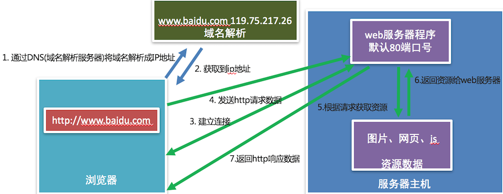

### 4. 小结

- HTTP协议是一个超文本传输协议
- HTTP协议是一个基于TCP传输协议传输数据的
- HTTP协议规定了浏览器和 Web 服务器通信数据的格式

# URL

**学习目标**

- 能够知道URL的组成部分

------

### 1. URL的概念

URL的英文全拼是(Uniform Resoure Locator),表达的意思是统一资源定位符，通俗理解就是网络资源地址，也就是我们常说的网址。

### 2. URL的组成

**URL的样子:**

https://news.163.com/18/1122/10/E178J2O4000189FH.html

**URL的组成部分:**

1. **协议部分**: https://、http://、ftp://
2. **域名部分**: news.163.com
3. **资源路径部分**: /18/1122/10/E178J2O4000189FH.html

**域名:**

域名就是**IP地址的别名**，它是用点进行分割使用英文字母和数字组成的名字，**使用域名目的就是方便的记住某台主机IP地址**。

**URL的扩展:**

https://news.163.com/hello.html?page=1&count=10

- **查询参数部分**: ?page=1&count=10

**参数说明:**

- ? 后面的 page 表示第一个参数，后面的参数都使用 & 进行连接

### 3. 小结

- URL就是网络资源的地址，简称网址，通过URL能够找到网络中对应的资源数据。
- URL组成部分
  1. 协议部分
  2. 域名部分
  3. 资源路径部分
  4. 查询参数部分 [可选]

# 查看HTTP协议的通信过程

**学习目标**

- 能够使用谷歌浏览器的开发者工具查看HTTP协议的通信过程

------

### 1. 谷歌浏览器开发者工具的使用

首先需要安装Google Chrome浏览器，然后Windows和Linux平台按**F12**调出开发者工具, mac OS选择 视图 -> 开发者 -> 开发者工具或者直接使用 **alt+command+i** 这个快捷键，还有一个多平台通用的操作就是在**网页右击选择检查**。

**开发者工具的效果图:**


**开发者工具的标签选项说明:**

- 元素（Elements）：用于查看或修改HTML标签
- 控制台（Console）：执行js代码
- 源代码（Sources）：查看静态资源文件，断点调试JS代码
- 网络（Network）：查看http协议的通信过程

**开发者工具使用效果图:**


**开发者工具的使用说明:**

1. 点击Network标签选项
2. 在浏览器的地址栏输入百度的网址，就能看到请求百度首页的http的通信过程
3. **这里的每项记录都是请求+响应的一次过程**

### 2. 查看HTTP协议的通信过程

**查看http请求信息效果图:**

 

**查看http响应信息效果图:**

 

### 3. 小结

- 谷歌浏览器的开发者工具是查看http协议的通信过程利器，通过Network标签选项可以查看每一次的请求和响应的通信过程，调出开发者工具的通用方法是在网页右击选择检查。
- 开发者工具的Headers选项总共有三部分组成:
  1. General: 主要信息
  2. Response Headers: 响应头
  3. Request Headers: 请求头
- Response选项是查看响应体信息的

# HTTP 请求报文

**学习目标**

- 能够知道HTTP请求报文的结构

------

### 1. HTTP 请求报文介绍

**HTTP最常见的请求报文有两种:**

1. GET 方式的请求报文
2. POST 方式的请求报文

**说明:**

- GET: 获取web服务器数据
- POST: 向web服务器提交数据

### 2. HTTP GET 请求报文分析

**HTTP GET 请求报文效果图:**


**GET 请求报文说明:**

```http
---- 请求行 ----
GET / HTTP/1.1  # GET请求方式 请求资源路径 HTTP协议版本
---- 请求头 -----
Host: www.itcast.cn  # 服务器的主机地址和端口号,默认是80
Connection: keep-alive # 和服务端保持长连接
Upgrade-Insecure-Requests: 1 # 让浏览器升级不安全请求，使用https请求
User-Agent: Mozilla/5.0 (Macintosh; Intel Mac OS X 10_12_4) AppleWebKit/537.36 (KHTML, like Gecko) Chrome/69.0.3497.100 Safari/537.36  # 用户代理，也就是客户端的名称
Accept:text/html,application/xhtml+xml,application/xml;q=0.9,image/webp,image/apng,*/*;q=0.8 # 可接受的数据类型
Accept-Encoding: gzip, deflate # 可接受的压缩格式
Accept-Language: zh-CN,zh;q=0.9 #可接受的语言
Cookie: pgv_pvi=1246921728; # 登录用户的身份标识

---- 空行 ----
```

**GET 请求原始报文说明:**

```http
GET / HTTP/1.1\r\n
Host: www.itcast.cn\r\n  
Connection: keep-alive\r\n
Upgrade-Insecure-Requests: 1\r\n
User-Agent: Mozilla/5.0 (Macintosh; Intel Mac OS X 10_12_4) AppleWebKit/537.36 (KHTML, like Gecko) Chrome/69.0.3497.100 Safari/537.36\r\n
Accept: text/html,application/xhtml+xml,application/xml;q=0.9,image/webp,image/apng,*/*;q=0.8\r\n
Accept-Encoding: gzip, deflate\r\n
Accept-Language: zh-CN,zh;q=0.9\r\n
Cookie: pgv_pvi=1246921728; \r\n
\r\n  (请求头信息后面还有一个单独的’\r\n’不能省略)
```

**说明：**

- 每项数据之间使用:**\r\n**

### 3. HTTP POST 请求报文分析

**HTTP POST 请求报文效果图:**


**请求体效果图:**


**POST 请求报文说明:**

```http
---- 请求行 ----
POST /xmweb?host=mail.itcast.cn&_t=1542884567319 HTTP/1.1 # POST请求方式 请求资源路径 HTTP协议版本
---- 请求头 ----
Host: mail.itcast.cn # 服务器的主机地址和端口号,默认是80
Connection: keep-alive # 和服务端保持长连接
Content-Type: application/x-www-form-urlencoded  # 告诉服务端请求的数据类型
User-Agent: Mozilla/5.0 (Macintosh; Intel Mac OS X 10_12_4) AppleWebKit/537.36 (KHTML, like Gecko) Chrome/69.0.3497.100 Safari/537.36 # 客户端的名称
---- 空行 ----
---- 请求体 ----
username=hello&pass=hello # 请求参数
```

**POST 请求原始报文说明:**

```http
POST /xmweb?host=mail.itcast.cn&_t=1542884567319 HTTP/1.1\r\n
Host: mail.itcast.cn\r\n
Connection: keep-alive\r\n
Content-Type: application/x-www-form-urlencoded\r\n
User-Agent: Mozilla/5.0 (Macintosh; Intel Mac OS X 10_12_4) AppleWebKit/537.36 (KHTML, like Gecko) Chrome/69.0.3497.100 Safari/537.36\r\n
\r\n(请求头信息后面还有一个单独的’\r\n’不能省略)
username=hello&pass=hello
```

**说明：**

- 每项数据之间使用:**\r\n**

### 4. 小结

- 一个HTTP请求报文可以由**请求行、请求头、空行和请求体**4个部分组成。
- 请求行是由三部分组成:
  1. **请求方式**
  2. **请求资源路径**
  3. **HTTP协议版本**
- **GET方式的请求报文没有请求体，只有请求行、请求头、空行组成**。
- **POST方式的请求报文可以有请求行、请求头、空行、请求体四部分组成，注意:POST方式可以允许没有请求体，但是这种格式很少见**。

**GET和POST请求对比效果图:**


# HTTP响应报文

**学习目标**

- 能够知道HTTP响应报文的结构

------

### 1. HTTP响应报文分析

**HTTP 响应报文效果图:**


**响应报文说明:**

```http
--- 响应行/状态行 ---
HTTP/1.1 200 OK # HTTP协议版本 状态码 状态描述
--- 响应头 ---
Server: Tengine # 服务器名称
Content-Type: text/html; charset=UTF-8 # 内容类型
Transfer-Encoding: chunked # 发送给客户端内容不确定内容长度，发送结束的标记是0\r\n, Content-Length表示服务端确定发送给客户端的内容大小，但是二者只能用其一。
Connection: keep-alive # 和客户端保持长连接
Date: Fri, 23 Nov 2018 02:01:05 GMT # 服务端的响应时间
--- 空行 ---
--- 响应体 ---
<!DOCTYPE html><html lang=“en”> …</html> # 响应给客户端的数据
```

**原始响应报文说明:**

```http
HTTP/1.1 200 OK\r\n
Server: Tengine\r\n
Content-Type: text/html; charset=UTF-8\r\n
Transfer-Encoding: chunked\r\n
Connection: keep-alive\r\n
Date: Fri, 23 Nov 2018 02:01:05 GMT\r\n
\r\n(响应头信息后面还有一个单独的’\r\n’不能省略)
<!DOCTYPE html><html lang=“en”> …</html>
```

**说明:**

每项数据之间使用:**\r\n**

### 2. HTTP 状态码介绍

HTTP 状态码是**用于表示web服务器响应状态的3位数字代码**。

| 状态码 | 说明                             |
| :----- | :------------------------------- |
| 200    | 请求成功                         |
| 307    | 重定向                           |
| 400    | 错误的请求，请求地址或者参数有误 |
| 404    | 请求资源在服务器不存在           |
| 500    | 服务器内部源代码出现错误         |

### 3. 小结

- 一个HTTP响应报文是由**响应行、响应头、空行和响应体**4个部分组成。 
- 响应行是由三部分组成：**HTTP协议版本 状态码 状态描述**，最常见的状态码是200

# 搭建Python自带静态Web服务器

**学习目标**

- 能够知道搭建Python自带Web服务器

------

### 1. 静态Web服务器是什么？

可以**为发出请求的浏览器提供静态文档的程序**。

平时我们浏览百度新闻数据的时候，**每天的新闻数据都会发生变化，那访问的这个页面就是动态的**，而我们开发的是**静态的，页面的数据不会发生变化**。

### 2. 如何搭建Python自带的静态Web服务器

搭建Python自带的静态Web服务器使用 **python3 -m http.server 端口号**, 效果图如下:


**-m选项说明:**

-m表示**运行包里面的模块**，执行这个命令的时候，需要进入你**自己指定静态文件的目录**，然后通过浏览器就能访问对应的 html文件了，这样一个静态的web服务器就搭建好了。

### 3. 访问搭建的静态Web服务器

通过浏览器访问搭建的静态Web服务器，效果图如下:


### 4. 查看浏览器和搭建的静态Web服务器的通信过程

查看http的通信过程,效果图如下:


### 5. 小结

- 静态Web服务器是为发出请求的浏览器提供静态文档的程序，
- 搭建Python自带的Web服务器使用python3 –m http.server 端口号 这个命令即可，端口号不指定默认是8000

# 静态Web服务器-返回固定页面数据

**学习目标**

- 能够写出组装固定页面数据的响应报文

------

### 1. 开发自己的静态Web服务器

**实现步骤:**

1. 编写一个TCP服务端程序
2. 获取浏览器发送的http请求报文数据
3. 读取固定页面数据，把页面数据组装成HTTP响应报文数据发送给浏览器。
4. HTTP响应报文数据发送完成以后，关闭服务于客户端的套接字。

### 2. 静态Web服务器-返回固定页面数据的示例代码

```py
import socket


if __name__ == '__main__':
    # 创建tcp服务端套接字
    tcp_server_socket = socket.socket(socket.AF_INET, socket.SOCK_STREAM)
    # 设置端口号复用, 程序退出端口立即释放
    tcp_server_socket.setsockopt(socket.SOL_SOCKET, socket.SO_REUSEADDR, True)
    # 绑定端口号
    tcp_server_socket.bind(("", 9000))
    # 设置监听
    tcp_server_socket.listen(128)
    while True:
        # 等待接受客户端的连接请求
        new_socket, ip_port = tcp_server_socket.accept()
        # 代码执行到此，说明连接建立成功
        recv_client_data = new_socket.recv(4096)
        # 对二进制数据进行解码
        recv_client_content = recv_client_data.decode("utf-8")
        print(recv_client_content)

        with open("static/index.html", "rb") as file:
            # 读取文件数据
            file_data = file.read()


        # 响应行
        response_line = "HTTP/1.1 200 OK\r\n"
        # 响应头
        response_header = "Server: PWS1.0\r\n"

        # 响应体
        response_body = file_data

        # 拼接响应报文
        response_data = (response_line + response_header + "\r\n").encode("utf-8") + response_body
        # 发送数据
        new_socket.send(response_data)

        # 关闭服务与客户端的套接字
        new_socket.close()
```

### 3. 小结

1. 编写一个TCP服务端程序

   ```py
   tcp_server_socket = socket.socket(socket.AF_INET, socket.SOCK_STREAM)
   # 循环接受客户端的连接请求
   while True:
       conn_socket, ip_port = tcp_server_socket.accept()
   ```

2. 获取浏览器发送的http请求报文数据

   ```py
   client_request_data = conn_socket.recv(4096)
   ```

3. 读取固定页面数据，把页面数据组装成HTTP响应报文数据发送给浏览器。

   ```py
   response_data = (response_line + response_header + "\r\n").encode("utf-8") + response_body
   conn_socket.send(response_data)
   ```

4. HTTP响应报文数据发送完成以后，关闭服务于客户端的套接字。

   ```py
   conn_socket.close()
   ```

# 静态Web服务器-返回指定页面数据

**学习目标**

- 能够写出组装指定页面数据的响应报文

------

### 1. 静态Web服务器的问题


目前的Web服务器，不管用户访问什么页面，返回的都是固定页面的数据，接下来需要根据用户的请求返回指定页面的数据

**返回指定页面数据的实现步骤:**

1. 获取用户请求资源的路径
2. 根据请求资源的路径，读取指定文件的数据
3. 组装指定文件数据的响应报文，发送给浏览器
4. 判断请求的文件在服务端不存在，组装404状态的响应报文，发送给浏览器

### 2. 静态Web服务器-返回指定页面数据的示例代码

```py
import socket


def main():
    # 创建tcp服务端套接字
    tcp_server_socket = socket.socket(socket.AF_INET, socket.SOCK_STREAM)
    # 设置端口号复用, 程序退出端口立即释放
    tcp_server_socket.setsockopt(socket.SOL_SOCKET, socket.SO_REUSEADDR, True)
    # 绑定端口号
    tcp_server_socket.bind(("", 9000))
    # 设置监听
    tcp_server_socket.listen(128)
    while True:
        # 等待接受客户端的连接请求
        new_socket, ip_port = tcp_server_socket.accept()
        # 代码执行到此，说明连接建立成功
        recv_client_data = new_socket.recv(4096)
        if len(recv_client_data) == 0:
            print("关闭浏览器了")
            new_socket.close()
            return

        # 对二进制数据进行解码
        recv_client_content = recv_client_data.decode("utf-8")
        print(recv_client_content)
        # 根据指定字符串进行分割， 最大分割次数指定2
        request_list = recv_client_content.split(" ", maxsplit=2)

        # 获取请求资源路径
        request_path = request_list[1]
        print(request_path)

        # 判断请求的是否是根目录，如果条件成立，指定首页数据返回
        if request_path == "/":
            request_path = "/index.html"

        try:
            # 动态打开指定文件
            with open("static" + request_path, "rb") as file:
                # 读取文件数据
                file_data = file.read()
        except Exception as e:
            # 请求资源不存在，返回404数据
            # 响应行
            response_line = "HTTP/1.1 404 Not Found\r\n"
            # 响应头
            response_header = "Server: PWS1.0\r\n"
            with open("static/error.html", "rb") as file:
                file_data = file.read()
            # 响应体
            response_body = file_data

            # 拼接响应报文
            response_data = (response_line + response_header + "\r\n").encode("utf-8") + response_body
            # 发送数据
            new_socket.send(response_data)
        else:
            # 响应行
            response_line = "HTTP/1.1 200 OK\r\n"
            # 响应头
            response_header = "Server: PWS1.0\r\n"

            # 响应体
            response_body = file_data

            # 拼接响应报文
            response_data = (response_line + response_header + "\r\n").encode("utf-8") + response_body
            # 发送数据
            new_socket.send(response_data)
        finally:
            # 关闭服务与客户端的套接字
            new_socket.close()

if __name__ == '__main__':
    main()
```

### 3. 小结

1. 获取用户请求资源的路径

   ```py
    request_list = client_request_conent.split(” ”,  maxsplit=2)
    request_path = request_list[1]
   ```

2. 根据请求资源的路径，读取请求指定文件的数据

   ```py
    with open("static" + request_path, "rb") as file:
    file_data = file.read()
   ```

3. 组装指定文件数据的响应报文，发送给浏览器

   ```py
    response_data = (response_line + response_header + "\r\n").encode("utf-8") + response_body
    conn_socket.send(response_data)
   ```

4. 判断请求的文件在服务端不存在，组装404状态的响应报文，发送给浏览器

   ```py
    try:
        # 打开指定文件,代码省略...
    except Exception as e:
        conn_socket.send(404响应报文数据)
   ```

# 静态Web服务器-多任务版

**学习目标**

- 能够写出多线程版的多任务web服务器程序

------

### 1. 静态Web服务器的问题

目前的Web服务器，不能支持多用户同时访问，只能一个一个的处理客户端的请求，那么如何开发多任务版的web服务器同时处理 多个客户端的请求?

可以使用**多线程**，比进程更加节省内存资源。

**多任务版web服务器程序的实现步骤:**

1. 当客户端和服务端建立连接成功，创建子线程，使用子线程专门处理客户端的请求，防止主线程阻塞。
2. 把创建的子线程设置成为守护主线程，防止主线程无法退出。

### 2. 静态Web服务器-多任务版的示例代码

```py
import socket
import threading


# 处理客户端的请求
def handle_client_request(new_socket):
    # 代码执行到此，说明连接建立成功
    recv_client_data = new_socket.recv(4096)
    if len(recv_client_data) == 0:
        print("关闭浏览器了")
        new_socket.close()
        return

    # 对二进制数据进行解码
    recv_client_content = recv_client_data.decode("utf-8")
    print(recv_client_content)
    # 根据指定字符串进行分割， 最大分割次数指定2
    request_list = recv_client_content.split(" ", maxsplit=2)

    # 获取请求资源路径
    request_path = request_list[1]
    print(request_path)

    # 判断请求的是否是根目录，如果条件成立，指定首页数据返回
    if request_path == "/":
        request_path = "/index.html"

    try:
        # 动态打开指定文件
        with open("static" + request_path, "rb") as file:
            # 读取文件数据
            file_data = file.read()
    except Exception as e:
        # 请求资源不存在，返回404数据
        # 响应行
        response_line = "HTTP/1.1 404 Not Found\r\n"
        # 响应头
        response_header = "Server: PWS1.0\r\n"
        with open("static/error.html", "rb") as file:
            file_data = file.read()
        # 响应体
        response_body = file_data

        # 拼接响应报文
        response_data = (response_line + response_header + "\r\n").encode("utf-8") + response_body
        # 发送数据
        new_socket.send(response_data)
    else:
        # 响应行
        response_line = "HTTP/1.1 200 OK\r\n"
        # 响应头
        response_header = "Server: PWS1.0\r\n"

        # 响应体
        response_body = file_data

        # 拼接响应报文
        response_data = (response_line + response_header + "\r\n").encode("utf-8") + response_body
        # 发送数据
        new_socket.send(response_data)
    finally:
        # 关闭服务与客户端的套接字
        new_socket.close()


# 程序入口函数
def main():
    # 创建tcp服务端套接字
    tcp_server_socket = socket.socket(socket.AF_INET, socket.SOCK_STREAM)
    # 设置端口号复用, 程序退出端口立即释放
    tcp_server_socket.setsockopt(socket.SOL_SOCKET, socket.SO_REUSEADDR, True)
    # 绑定端口号
    tcp_server_socket.bind(("", 9000))
    # 设置监听
    tcp_server_socket.listen(128)

    while True:
        # 等待接受客户端的连接请求
        new_socket, ip_port = tcp_server_socket.accept()
        print(ip_port)
        # 当客户端和服务器建立连接程，创建子线程
        sub_thread = threading.Thread(target=handle_client_request, args=(new_socket,))
        # 设置守护主线程
        sub_thread.setDaemon(True)
        # 启动子线程执行对应的任务
        sub_thread.start()


if __name__ == '__main__':
    main()
```

### 3. 小结

1. 当客户端和服务端建立连接成功，创建子线程，使用子线程专门处理客户端的请求，防止主线程阻塞。

   ```py
    while True:
        conn_socket, ip_port = tcp_server_socket.accept()
        # 开辟子线程并执行对应的任务
        sub_thread = threading.Thread(target=handle_client_request, args=(conn_socket,))
   ```

2. 把创建的子线程设置成为守护主线程，防止主线程无法退出。

   ```py
    # 开辟子线程并执行对应的任务
    sub_thread = threading.Thread(target=handle_client_request, args=(conn_socket,))
    sub_thread.setDaemon(True) # 设置守护主线程
    sub_thread.start()
   ```

# 静态Web服务器-面向对象开发

**学习目标**

- 能够写出面向对象方式的多任务web服务器程序

------

### 1. 以面向对象的方式开发静态Web服务器

**实现步骤:**

1. 把提供服务的Web服务器抽象成一个类(HTTPWebServer)
2. 提供Web服务器的初始化方法，在初始化方法里面创建socket对象
3. 提供一个开启Web服务器的方法，让Web服务器处理客户端请求操作。

### 2. 静态Web服务器-面向对象开发的示例代码

```py
import socket
import threading


# 定义web服务器类
class HttpWebServer(object):
    def __init__(self):
        # 创建tcp服务端套接字
        tcp_server_socket = socket.socket(socket.AF_INET, socket.SOCK_STREAM)
        # 设置端口号复用, 程序退出端口立即释放
        tcp_server_socket.setsockopt(socket.SOL_SOCKET, socket.SO_REUSEADDR, True)
        # 绑定端口号
        tcp_server_socket.bind(("", 9000))
        # 设置监听
        tcp_server_socket.listen(128)
        # 保存创建成功的服务器套接字
        self.tcp_server_socket = tcp_server_socket

    # 处理客户端的请求
    @staticmethod
    def handle_client_request(new_socket):
        # 代码执行到此，说明连接建立成功
        recv_client_data = new_socket.recv(4096)
        if len(recv_client_data) == 0:
            print("关闭浏览器了")
            new_socket.close()
            return

        # 对二进制数据进行解码
        recv_client_content = recv_client_data.decode("utf-8")
        print(recv_client_content)
        # 根据指定字符串进行分割， 最大分割次数指定2
        request_list = recv_client_content.split(" ", maxsplit=2)

        # 获取请求资源路径
        request_path = request_list[1]
        print(request_path)

        # 判断请求的是否是根目录，如果条件成立，指定首页数据返回
        if request_path == "/":
            request_path = "/index.html"

        try:
            # 动态打开指定文件
            with open("static" + request_path, "rb") as file:
                # 读取文件数据
                file_data = file.read()
        except Exception as e:
            # 请求资源不存在，返回404数据
            # 响应行
            response_line = "HTTP/1.1 404 Not Found\r\n"
            # 响应头
            response_header = "Server: PWS1.0\r\n"
            with open("static/error.html", "rb") as file:
                file_data = file.read()
            # 响应体
            response_body = file_data

            # 拼接响应报文
            response_data = (response_line + response_header + "\r\n").encode("utf-8") + response_body
            # 发送数据
            new_socket.send(response_data)
        else:
            # 响应行
            response_line = "HTTP/1.1 200 OK\r\n"
            # 响应头
            response_header = "Server: PWS1.0\r\n"

            # 响应体
            response_body = file_data

            # 拼接响应报文
            response_data = (response_line + response_header + "\r\n").encode("utf-8") + response_body
            # 发送数据
            new_socket.send(response_data)
        finally:
            # 关闭服务与客户端的套接字
            new_socket.close()

    # 启动web服务器进行工作
    def start(self):
        while True:
            # 等待接受客户端的连接请求
            new_socket, ip_port = self.tcp_server_socket.accept()
            # 当客户端和服务器建立连接程，创建子线程
            sub_thread = threading.Thread(target=self.handle_client_request, args=(new_socket,))
            # 设置守护主线程
            sub_thread.setDaemon(True)
            # 启动子线程执行对应的任务
            sub_thread.start()


# 程序入口函数
def main():
    # 创建web服务器对象
    web_server = HttpWebServer()
    # 启动web服务器进行工作
    web_server.start()


if __name__ == '__main__':
    main()
```

### 3. 小结

1. 把提供服务的Web服务器抽象成一个类(HTTPWebServer)

   ```py
    class HttpWebServer(object):
   ```

2. 提供Web服务器的初始化方法，在初始化方法里面创建socket对象

   ```py
    def __init__(self):
    # 初始化服务端套接字，设置监听，代码省略..
   ```

3. 提供一个开启Web服务器的方法，让Web服务器处理客户端请求操作。

   ```py
    def start(self):
    while True:
        service_client_socket, ip_port = self.tcp_server_socket.accept()
        # 连接建立成功，开辟子线程处理客户端的请求
        sub_thread = threading.Thread(target=self.handle_client_request, args=(service_client_socket,))
        sub_thread.start()
   ```

# 静态Web服务器-命令行启动动态绑定端口号

**学习目标**

- 能够写出获取终端命令行参数动态绑定端口号的web服务器程序

### 1. 开发命令行启动动态绑定端口号的静态web服务器

**实现步骤:**

1. 获取执行python程序的终端命令行参数
2. 判断参数的类型，设置端口号必须是整型
3. 给Web服务器类的初始化方法添加一个端口号参数，用于绑定端口号

### 2. 静态Web服务器-命令行启动动态绑定端口号的示例代码

```py
import socket
import threading
import sys


# 定义web服务器类
class HttpWebServer(object):
    def __init__(self, port):
        # 创建tcp服务端套接字
        tcp_server_socket = socket.socket(socket.AF_INET, socket.SOCK_STREAM)
        # 设置端口号复用, 程序退出端口立即释放
        tcp_server_socket.setsockopt(socket.SOL_SOCKET, socket.SO_REUSEADDR, True)
        # 绑定端口号
        tcp_server_socket.bind(("", port))
        # 设置监听
        tcp_server_socket.listen(128)
        # 保存创建成功的服务器套接字
        self.tcp_server_socket = tcp_server_socket

    # 处理客户端的请求
    @staticmethod
    def handle_client_request(new_socket):
        # 代码执行到此，说明连接建立成功
        recv_client_data = new_socket.recv(4096)
        if len(recv_client_data) == 0:
            print("关闭浏览器了")
            new_socket.close()
            return

        # 对二进制数据进行解码
        recv_client_content = recv_client_data.decode("utf-8")
        print(recv_client_content)
        # 根据指定字符串进行分割， 最大分割次数指定2
        request_list = recv_client_content.split(" ", maxsplit=2)

        # 获取请求资源路径
        request_path = request_list[1]
        print(request_path)

        # 判断请求的是否是根目录，如果条件成立，指定首页数据返回
        if request_path == "/":
            request_path = "/index.html"

        try:
            # 动态打开指定文件
            with open("static" + request_path, "rb") as file:
                # 读取文件数据
                file_data = file.read()
        except Exception as e:
            # 请求资源不存在，返回404数据
            # 响应行
            response_line = "HTTP/1.1 404 Not Found\r\n"
            # 响应头
            response_header = "Server: PWS1.0\r\n"
            with open("static/error.html", "rb") as file:
                file_data = file.read()
            # 响应体
            response_body = file_data

            # 拼接响应报文
            response_data = (response_line + response_header + "\r\n").encode("utf-8") + response_body
            # 发送数据
            new_socket.send(response_data)
        else:
            # 响应行
            response_line = "HTTP/1.1 200 OK\r\n"
            # 响应头
            response_header = "Server: PWS1.0\r\n"

            # 响应体
            response_body = file_data

            # 拼接响应报文
            response_data = (response_line + response_header + "\r\n").encode("utf-8") + response_body
            # 发送数据
            new_socket.send(response_data)
        finally:
            # 关闭服务与客户端的套接字
            new_socket.close()

    # 启动web服务器进行工作
    def start(self):
        while True:
            # 等待接受客户端的连接请求
            new_socket, ip_port = self.tcp_server_socket.accept()
            # 当客户端和服务器建立连接程，创建子线程
            sub_thread = threading.Thread(target=self.handle_client_request, args=(new_socket,))
            # 设置守护主线程
            sub_thread.setDaemon(True)
            # 启动子线程执行对应的任务
            sub_thread.start()


# 程序入口函数
def main():

    print(sys.argv)
    # 判断命令行参数是否等于2,
    if len(sys.argv) != 2:
        print("执行命令如下: python3 xxx.py 8000")
        return

    # 判断字符串是否都是数字组成
    if not sys.argv[1].isdigit():
        print("执行命令如下: python3 xxx.py 8000")
        return

    # 获取终端命令行参数
    port = int(sys.argv[1])
    # 创建web服务器对象
    web_server = HttpWebServer(port)
    # 启动web服务器进行工作
    web_server.start()


if __name__ == '__main__':
    main()
```

### 3. 小结

1. 获取执行python程序的终端命令行参数

   ```py
    sys.argv
   ```

2. 判断参数的类型，设置端口号必须是整型

   ```py
    if not sys.argv[1].isdigit():
        print("启动命令如下: python3 xxx.py 9090")
        return
    port = int(sys.argv[1])
   ```

3. 给Web服务器类的初始化方法添加一个端口号参数，用于绑定端口号

   ```py
    def __init__(self, port):
        self.tcp_server_socket.bind((“”, port))
   ```

# 闭包

**学习目标**

- 能够知道闭包的构成条件
- 能够知道定义闭包的语法格式

------

### 1. 闭包的介绍

我们前面已经学过了函数，我们知道当函数调用完，函数内定义的变量都销毁了，但是我们有时候需要保存函数内的这个变量，每次在这个变量的基础上完成一些列的操作，比如: 每次在这个变量的基础上和其它数字进行求和计算，那怎么办呢?

我们就可以通过咱们今天学习的**闭包**来解决这个需求。

**闭包的定义:**

在函数嵌套的前提下，内部函数使用了外部函数的变量，并且外部函数返回了内部函数，我们把这个**使用外部函数变量的内部函数称为闭包**。

### 2. 闭包的构成条件

通过闭包的定义，我们可以得知闭包的形成条件:

1. 在函数嵌套(函数里面再定义函数)的前提下
2. 内部函数使用了外部函数的变量(还包括外部函数的参数)
3. 外部函数返回了内部函数

### 3. 简单闭包的示例代码

```py
# 定义一个外部函数
def func_out(num1):
    # 定义一个内部函数
    def func_inner(num2):
        # 内部函数使用了外部函数的变量(num1)
        result = num1 + num2
        print("结果是:", result)
    # 外部函数返回了内部函数，这里返回的内部函数就是闭包
    return func_inner

# 创建闭包实例    
f = func_out(1)
# 执行闭包
f(2)
f(3)
```

**运行结果:**

```py
结果是: 3
结果是: 4
```

**闭包执行结果的说明:**

通过上面的输出结果可以看出闭包保存了外部函数内的变量num1，每次执行闭包都是在num1 = 1 基础上进行计算。

### 4. 闭包的作用

- 闭包可以保存外部函数内的变量，不会随着外部函数调用完而销毁。

**注意点:**

- 由于闭包引用了外部函数的变量，则外部函数的变量没有及时释放，消耗内存。

### 5. 小结

1. 当返回的内部函数使用了外部函数的变量就形成了闭包

2. 闭包可以对外部函数的变量进行保存

3. 实现闭包的标准格式:

   ```py
    # 外部函数
    def test1(a):
        b = 10
        # 内部函数
        def test2():
            # 内部函数使用了外部函数的变量或者参数
            print(a, b)
        # 返回内部函数, 这里返回的内部函数就是闭包实例
        return test2
   ```

# 闭包的使用

**学习目标**

- 能够知道闭包的作用

------

### 1. 案例

需求: 根据配置信息使用闭包实现不同人的对话信息，例如对话:

张三: 到北京了吗? 李四: 已经到了，放心吧。

### 2. 实现步骤说明

1. 定义外部函数接收不同的配置信息参数，参数是人名
2. 定义内部函数接收对话信息参数
3. 在内部函数里面把配置信息和对话信息进行拼接输出

### 3. 功能代码的实现

```py
# 外部函数
def config_name(name):
    # 内部函数
    def say_info(info):
        print(name + ": " + info)

    return say_info

tom = config_name("Tom")

tom("你好!")
tom("你好, 在吗?")

jerry = config_name("jerry")

jerry("不在, 不和玩!")
```

**运行结果:**

```py
Tom: 你好!
Tom: 你好, 在吗?
jerry: 不在, 不和玩!
```

**闭包案例说明:**

- 闭包还可以提高代码的可重用性，不需要再手动定义额外的功能函数。

### 5. 小结

- 闭包不仅可以保存外部函数的变量还可以提高代码的可重用行。

# 修改闭包内使用的外部变量

**学习目标**

- 能够知道修改闭包内使用的外部变量所需要的关键字

------

### 1. 修改闭包内使用的外部变量

**修改闭包内使用的外部变量的错误示例:**

```py
# 定义一个外部函数
def func_out(num1):

    # 定义一个内部函数
    def func_inner(num2):
        # 这里本意想要修改外部num1的值，实际上是在内部函数定义了一个局部变量num1
        num1 = 10
        # 内部函数使用了外部函数的变量(num1)
        result = num1 + num2
        print("结果是:", result)

    print(num1)
    func_inner(1)
    print(num1)

    # 外部函数返回了内部函数，这里返回的内部函数就是闭包
    return func_inner

# 创建闭包实例
f = func_out(1)
# 执行闭包
f(2)
```

**修改闭包内使用的外部变量的错误示例:**

```py
# 定义一个外部函数
def func_out(num1):

    # 定义一个内部函数
    def func_inner(num2):
        # 这里本意想要修改外部num1的值，实际上是在内部函数定义了一个局部变量num1
        nonlocal num1  # 告诉解释器，此处使用的是 外部变量a
        # 修改外部变量num1
        num1 = 10
        # 内部函数使用了外部函数的变量(num1)
        result = num1 + num2
        print("结果是:", result)

    print(num1)
    func_inner(1)
    print(num1)

    # 外部函数返回了内部函数，这里返回的内部函数就是闭包
    return func_inner

# 创建闭包实例
f = func_out(1)
# 执行闭包
f(2)
```

### 2. 小结

- 修改闭包内使用的外部函数变量使用 nonlocal 关键字来完成。

# 装饰器

**学习目标**

- 能够知道定义装饰器的语法格式

------

### 1. 装饰器的定义

就是**给已有函数增加额外功能的函数，它本质上就是一个闭包函数**。

**装饰器的功能特点:**

1. 不修改已有函数的源代码
2. 不修改已有函数的调用方式
3. 给已有函数增加额外的功能

### 2. 装饰器的示例代码

```py
# 添加一个登录验证的功能
def check(fn):
    def inner():
        print("请先登录....")
        fn()
    return inner


def comment():
    print("发表评论")

# 使用装饰器来装饰函数
comment = check(comment)
comment()

# 装饰器的基本雏形
# def decorator(fn): # fn:目标函数.
#     def inner():
#         '''执行函数之前'''
#         fn() # 执行被装饰的函数
#         '''执行函数之后'''
#     return inner
```

**代码说明:**

- 闭包函数有且只有一个参数，必须是函数类型，这样定义的函数才是装饰器。
- 写代码要遵循开放封闭原则，它规定已经实现的功能代码不允许被修改，但可以被扩展。

**执行结果:**

```py
请先登录....
发表评论
```

### 3. 装饰器的语法糖写法

如果有多个函数都需要添加登录验证的功能，每次都需要编写func = check(func)这样代码对已有函数进行装饰，这种做法还是比较麻烦。

Python给提供了一个装饰函数更加简单的写法，那就是语法糖，语法糖的书写格式是: @装饰器名字，通过语法糖的方式也可以完成对已有函数的装饰

```py
# 添加一个登录验证的功能
def check(fn):
    print("装饰器函数执行了")
    def inner():
        print("请先登录....")
        fn()
    return inner

# 使用语法糖方式来装饰函数
@check
def comment():
    print("发表评论")


comment()
```

**说明:**

- @check 等价于 comment = check(comment)
- 装饰器的执行时间是加载模块时立即执行。

**执行结果:**

```py
请先登录....
发表评论
```

### 4. 小结

- 装饰器本质上就是一个闭包函数，它可以对已有函数进行额外的功能扩展。

- 装饰器的语法格式:

  ```py
  # 装饰器
  # def decorator(fn): # fn:被装饰的目标函数.
  #     def inner():
  #         '''执行函数之前'''
  #         fn() # 执行被装饰的目标函数
  #         '''执行函数之后'''
  #     return inner
  ```

- 装饰器的语法糖用法: @装饰器名称，同样可以完成对已有函数的装饰操作。

# 装饰器的使用

**学习目标**

- 能够说出装饰器的作用

------

### 1. 装饰器的使用场景

1. 函数执行时间的统计
2. 输出日志信息

### 2. 装饰器实现已有函数执行时间的统计

```py
import time

# 装饰器函数
def get_time(func):
    def inner():
        begin = time.time()
        func()
        end = time.time()
        print("函数执行花费%f" % (end-begin))
    return inner


@get_time
def func1():
    for i in range(100000):
        print(i)


func1()
```

**执行结果:**

```py
...
99995
99996
99997
99998
99999
函数执行花费0.329066
```

### 2. 小结

通过上面的示例代码可以得知装饰器的作用:

- 在不改变已有函数源代码及调用方式的前提下，对已有函数进行功能的扩展。

# 通用装饰器的使用

**学习目标**

- 能够写出通用的装饰器

------

### 1. 装饰带有参数的函数

```py
# 添加输出日志的功能
def logging(fn):
    def inner(num1, num2):
        print("--正在努力计算--")
        fn(num1, num2)

    return inner


# 使用装饰器装饰函数
@logging
def sum_num(a, b):
    result = a + b
    print(result)


sum_num(1, 2)
```

**运行结果:**

```py
--正在努力计算--
3
```

### 2. 装饰带有返回值的函数

```py
# 添加输出日志的功能
def logging(fn):
    def inner(num1, num2):
        print("--正在努力计算--")
        result = fn(num1, num2)
        return result
    return inner


# 使用装饰器装饰函数
@logging
def sum_num(a, b):
    result = a + b
    return result


result = sum_num(1, 2)
print(result)
```

**运行结果:**

```py
--正在努力计算--
3
```

### 3. 装饰带有不定长参数的函数

```py
# 添加输出日志的功能
def logging(fn):
    def inner(*args, **kwargs):
        print("--正在努力计算--")
        fn(*args, **kwargs)

    return inner


# 使用语法糖装饰函数
@logging
def sum_num(*args, **kwargs):
    result = 0
    for value in args:
        result += value

    for value in kwargs.values():
        result += value

    print(result)

sum_num(1, 2, a=10)
```

**运行结果:**

```py
--正在努力计算--
13
```

### 4. 通用装饰器

```py
# 添加输出日志的功能
def logging(fn):
    def inner(*args, **kwargs):
        print("--正在努力计算--")
        result = fn(*args, **kwargs)
        return result

    return inner


# 使用语法糖装饰函数
@logging
def sum_num(*args, **kwargs):
    result = 0
    for value in args:
        result += value

    for value in kwargs.values():
        result += value

    return result


@logging
def subtraction(a, b):
    result = a - b
    print(result)

result = sum_num(1, 2, a=10)
print(result)

subtraction(4, 2)
```

**运行结果:**

```py
--正在努力计算--
13
--正在努力计算--
2
```

### 5. 小结

- 通用装饰器的语法格式:

  ```py
  # 通用装饰器
  def logging(fn):
    def inner(*args, **kwargs):
        print("--正在努力计算--")
        result = fn(*args, **kwargs)
        return result
  
    return inner
  ```

# 多个装饰器的使用

**学习目标**

- 能够使用多个装饰器装饰一个函数

------

### 1. 多个装饰器的使用示例代码

```py
def make_div(func):
    """对被装饰的函数的返回值 div标签"""
    def inner(*args, **kwargs):
        return "<div>" + func() + "</div>"
    return inner


def make_p(func):
    """对被装饰的函数的返回值 p标签"""
    def inner(*args, **kwargs):
        return "<p>" + func() + "</p>"
    return inner


# 装饰过程: 1 content = make_p(content) 2 content = make_div(content)
# content = make_div(make_p(content))
@make_div
@make_p
def content():
    return "人生苦短"

result = content()

print(result)
```

**代码说明:**

- 多个装饰器的装饰过程是: 离函数最近的装饰器先装饰，然后外面的装饰器再进行装饰，由内到外的装饰过程

### 2. 小结

- 多个装饰器可以对函数进行多个功能的装饰，装饰顺序是由内到外的进行装饰

# 带有参数的装饰器

**学习目标**

- 能够写出带有参数的装饰器

------

### 1. 带有参数的装饰器介绍

带有参数的装饰器就是使用装饰器装饰函数的时候可以传入指定参数，**语法格式: @装饰器(参数,...)**

**错误写法:**

```py
def decorator(fn, flag):
    def inner(num1, num2):
        if flag == "+":
            print("--正在努力加法计算--")
        elif flag == "-":
            print("--正在努力减法计算--")
        result = fn(num1, num2)
        return result
    return inner


@decorator('+')
def add(a, b):
    result = a + b
    return result

result = add(1, 3)
print(result)
```

**执行结果:**

```py
Traceback (most recent call last):
  File "/home/python/Desktop/test/hho.py", line 12, in <module>
    @decorator('+')
TypeError: decorator() missing 1 required positional argument: 'flag'
```

**代码说明:**

- 装饰器只能接收一个参数，并且还是函数类型。

**正确写法:**

在装饰器外面再包裹上一个函数，让最外面的函数接收参数，返回的是装饰器，因为@符号后面必须是装饰器实例。

```py
# 添加输出日志的功能
def logging(flag):

    def decorator(fn):
        def inner(num1, num2):
            if flag == "+":
                print("--正在努力加法计算--")
            elif flag == "-":
                print("--正在努力减法计算--")
            result = fn(num1, num2)
            return result
        return inner

    # 返回装饰器
    return decorator


# 使用装饰器装饰函数
@logging("+")
def add(a, b):
    result = a + b
    return result


@logging("-")
def sub(a, b):
    result = a - b
    return result

result = add(1, 2)
print(result)

result = sub(1, 2)
print(result)
```

### 2. 小结

- 使用带有参数的装饰器，其实是在装饰器外面又包裹了一个函数，使用该函数接收参数，返回是装饰器，因为 @ 符号需要配合装饰器实例使用


# 类装饰器的使用

**学习目标**

- 能够知道类装饰器的使用

------

### 1. 类装饰器的介绍

装饰器还有一种特殊的用法就是类装饰器，就是通过定义一个类来装饰函数。

**类装饰器示例代码:**

```py
class Check(object):
    def __init__(self, fn):
        # 初始化操作在此完成
        self.__fn = fn

    # 实现__call__方法，表示对象是一个可调用对象，可以像调用函数一样进行调用。
    def __call__(self, *args, **kwargs):
        # 添加装饰功能
        print("请先登陆...")
        self.__fn()


@Check
def comment():
    print("发表评论")


comment()
```

**代码说明:**

# 说明：

- @Check 等价于 comment = Check(comment), 所以需要提供一个**init**方法，并多增加一个fn参数。
- 要想类的实例对象能够像函数一样调用，需要在类里面使用**call**方法，把类的实例变成可调用对象(callable)，也就是说可以像调用函数一样进行调用。
- 在**call**方法里进行对fn函数的装饰，可以添加额外的功能。

**执行结果:**

```py
请先登陆...
发表评论
```

### 2. 小结

- 想要让类的实例对象能够像函数一样进行调用，需要在类里面使用**call**方法，把类的实例变成可调用对象(callable)
- 类装饰器装饰函数功能在**call**方法里面进行添加

# web框架概述

**学习目标**

- 能够知道web框架和web服务器的关系

------

### 1. web框架和web服务器的关系介绍

前面已经学习过web服务器, 我们知道web服务器主要是接收用户的http请求,根据用户的请求返回不同的资源数据，但是之前我们开发的是静态web服务器，返回的都是静态资源数据，假如我们想要web服务器返回动态资源那么该如何进行处理呢？

这里我们给大家介绍一个web框架，**使用web框架专门负责处理用户的动态资源请求，这个web框架其实就是一个为web服务器提供服务的应用程序**，简称web框架。


**关系说明:**

- web服务器接收浏览器发起的请求，如果是动态资源请求找web框架来处理
- web框架负责处理浏览器的动态资源请求，把处理的结果发生给web服务器
- web服务器再把响应结果发生给浏览器

### 2. 静态资源

不需要经常变化的资源，这种资源web服务器可以提前准备好，比如: png/jpg/css/js等文件。

### 3. 动态资源

和静态资源相反, 这种资源会经常变化，比如: 我们在京东浏览商品时经常会根据条件进行筛选，选择不同条件, 浏览的商品就不同，这种资源web服务器无法提前准备好，需要web框架来帮web服务器进行准备，在这里web服务器可以把.html的资源请求认为是动态资源请求交由web框架进行处理。

### 4. WSGI协议

它是web服务器和web框架之间进行协同工作的一个规则，WSGI协议规定web服务器把动态资源的请求信息传给web框架处理，web框架把处理好的结果返回给web服务器。

### 5. 小结

- web框架是专门为web服务器处理动态资源请求的一个应用程序
- web框架和web服务器的关系是web框架专门服务于web服务器，给web服务器提供处理动态资源请求的服务。

# 框架程序开发

**学习目标**

- 能够知道使用web框架程序处理客户端的动态资源请求操作

------

### 1. 框架职责介绍

- 接收web服务器的动态资源请求，给web服务器提供处理动态资源请求的服务。

### 2. 动态资源判断

- 根据请求资源路径的后缀名进行判断
  - 如果请求资源路径的后缀名是.html则是动态资源请求, 让web框架程序进行处理。
  - 否则是静态资源请求，让web服务器程序进行处理。

**web服务器程序(web.py)代码:**

```py
import socket
import threading
import sys
import framework


# 定义web服务器类
class HttpWebServer(object):
    def __init__(self, port):
        # 创建tcp服务端套接字
        tcp_server_socket = socket.socket(socket.AF_INET, socket.SOCK_STREAM)
        # 设置端口号复用, 程序退出端口立即释放
        tcp_server_socket.setsockopt(socket.SOL_SOCKET, socket.SO_REUSEADDR, True)
        # 绑定端口号
        tcp_server_socket.bind(("", port))
        # 设置监听
        tcp_server_socket.listen(128)
        self.tcp_server_socket = tcp_server_socket

    # 处理客户的请求
    @staticmethod
    def handle_client_quest(new_socket):
        # 代码执行到此，说明连接建立成功
        recv_client_data = new_socket.recv(4096)
        if len(recv_client_data) == 0:
            print("关闭浏览器了")
            # 关闭服务与客户端的套接字
            new_socket.close()
            return

        # 对二进制数据进行解码
        recv_client_content = recv_client_data.decode("utf-8")
        print(recv_client_content)
        # 根据指定字符串进行分割， 最大分割次数指定2
        request_list = recv_client_content.split(" ", maxsplit=2)

        # 获取请求资源路径
        request_path = request_list[1]
        print(request_path)

        # 判断请求的是否是根目录，如果条件成立，指定首页数据返回
        if request_path == "/":
            request_path = "/index.html"

        # 判断是否是动态资源请求
        if request_path.endswith(".html"):
            """这里是动态资源请求，把请求信息交给框架处理"""
            # 字典存储用户的请求信息
            env = {
                "request_path": request_path
            }

            # 获取处理结果
            status, headers, response_body = framework.handle_request(env)

            # 使用框架处理的数据拼接响应报文
            # 响应行
            response_line = "HTTP/1.1 %s\r\n" % status
            # 响应头
            response_header = ""
            # 遍历头部信息
            for header in headers:
                # 拼接多个响应头
                response_header += "%s: %s\r\n" % header
            response_data = (response_line +
                             response_header +
                             "\r\n" +
                             response_body).encode("utf-8")
            # 发送数据
            new_socket.send(response_data)
            # 关闭socket
            new_socket.close()

        else:
            """这里是静态资源请求"""
            try:
                # 动态打开指定文件
                with open("static" + request_path, "rb") as file:
                    # 读取文件数据
                    file_data = file.read()
            except Exception as e:
                # 请求资源不存在，返回404数据
                # 响应行
                response_line = "HTTP/1.1 404 Not Found\r\n"
                # 响应头
                response_header = "Server: PWS1.0\r\n"
                with open("static/error.html", "rb") as file:
                    file_data = file.read()
                # 响应体
                response_body = file_data

                # 拼接响应报文
                response_data = (response_line + response_header + "\r\n").encode("utf-8") + response_body
                # 发送数据
                new_socket.send(response_data)
            else:
                # 响应行
                response_line = "HTTP/1.1 200 OK\r\n"
                # 响应头
                response_header = "Server: PWS1.0\r\n"

                # 响应体
                response_body = file_data

                # 拼接响应报文
                response_data = (response_line + response_header + "\r\n").encode("utf-8") + response_body
                # 发送数据
                new_socket.send(response_data)
            finally:
                # 关闭服务与客户端的套接字
                new_socket.close()

    def start(self):
        while True:
            # 等待接受客户端的连接请求
            new_socket, ip_port = self.tcp_server_socket.accept()
            sub_thread = threading.Thread(target=self.handle_client_quest, args=(new_socket,))
            # 设置守护线程
            sub_thread.setDaemon(True)
            sub_thread.start()


# 程序入口函数
def main():

    # 获取命令行参数判断长度
    if len(sys.argv) != 2:
        print("执行命令如下: python3 xxx.py 9000")
        return

    # 判断端口号是否是数字
    if not sys.argv[1].isdigit():
        print("执行命令如下: python3 xxx.py 9000")
        return

    # 需要转成int类型
    port = int(sys.argv[1])

    # 创建web服务器
    web_server = HttpWebServer(port)
    # 启动web服务器
    web_server.start()


if __name__ == '__main__':
    main()
```

### 3. 处理客户端的动态资源请求

1. 创建web框架程序
2. 接收web服务器的动态资源请求
3. 处理web服务器的动态资源请求并把处理结果返回给web服务器
4. web服务器把处理结果组装成响应报文发送给浏览器

**web框架程序(framework.py)代码:**

```py
"""miniweb框架，负责处理动态资源请求"""
import time


# 获取首页数据
def index():
    # 响应状态
    status = "200 OK";
    # 响应头
    response_header = [("Server", "PWS2.0")]
    # 处理后的数据
    data = time.ctime()

    return status, response_header, data


# 没有找到动态资源
def not_found():
    # 响应状态
    status = "404 Not Found";
    # 响应头
    response_header = [("Server", "PWS2.0")]
    # 处理后的数据
    data = "not found"

    return status, response_header, data


# 处理动态资源请求
def handle_request(env):
    # 获取动态请求资源路径
    request_path = env["request_path"]
    print("接收到的动态资源请求:", request_path)

    if request_path == "/index.html":
        # 获取首页数据
        result = index()
        return result
    else:
        # 没有找到动态资源
        result = not_found()
        return result
```

### 4. 小结

- 动态资源的判断通过请求资源路径的后缀是.html来完成，否则是静态资源
- 处理客户端的动态资源请求
  1. 接收web服务器的动态资源请求
  2. 处理动态资源请求并把处理结果返回给web服务器
  3. web服务器把处理结果组装成响应报文发送给浏览器

# 模板替换功能开发

**学习目标**

- 能够实现模板替换功能

------

### 1. 读取股票信息模板文件

**framework.py示例代码:**

```py
# 获取首页数据
def index():
    # 响应状态
    status = "200 OK";
    # 响应头
    response_header = [("Server", "PWS2.0")]

    # 打开模板文件，读取数据
    with open("template/index.html", "r") as file:
        file_data = file.read()
```

### 2. 使用模拟数据替换模板变量

**framework.py示例代码:**

```py
# 获取首页数据
def index():
    # 响应状态
    status = "200 OK";
    # 响应头
    response_header = [("Server", "PWS2.0")]

    # 1. 打开模板文件，读取数据
    with open("template/index.html", "r") as file:
        file_data = file.read()

    # 处理后的数据, 从数据库查询
    data = time.ctime()
    # 2. 替换模板文件中的模板遍历
    result = file_data.replace("", data)

    return status, response_header, result
```

### 3. 小结

- 模板替换功能
  1. 打开template目录下的index.html模板文件，读取模板文件数据
  2. 把模板文件中的模板变量进行替换

# 路由列表功能开发

**学习目标**

- 能够知道路由列表的实现

------

### 1. 路由的介绍

接着上面程序的判断场景，假如咱们再处理一个个人中心的动态资源请求非常简单，再添加一个函数和更加一个分支判断就可以实现了。

**framework.py 示例代码:**

```py
# 获取个人中心数据
def center():
    # 响应状态
    status = "200 OK";
    # 响应头
    response_header = [("Server", "PWS2.0")]

    # 打开模板文件，读取数据
    with open("template/center.html", "r") as file:
        file_data = file.read()

    # 处理后的数据, 从数据库查询
    data = time.ctime()
    # 替换模板文件中的模板遍历
    result = file_data.replace("", data)

    return status, response_header, result


# 处理动态资源请求
def handle_request(env):
    # 获取动态请求资源路径
    request_path = env["request_path"]
    print("接收到的动态资源请求:", request_path)

    if request_path == "/index.html":
        # 获取首页数据
        result = index()
        return result
    elif request_path == "/center.html":
        # 获取个人中心数据
        result = center()
        return result
    else:
        # 没有找到动态资源
        result = not_found()
        return result
```

那如果咱们的框架处理的页面请求路径再多一些，比如:5个路径判断，大家可能感觉条件分支完全可以胜任，如果是40个甚至更多呢? 如果这是还是用普通的条件分支简直无法忍受。

解决办法: **可以使用路由**

**什么是路由？**

路由就是请求的URL到处理函数的映射，也就是说提前把请求的URL和处理函数关联好。

**路由列表**

这么多的路由如何管理呢， 可以使用一个路由列表进行管理，通过路由列表保存每一个路由。

| 请求路径     | 处理函数   |
| :----------- | :--------- |
| /login.html  | login函数  |
| /index.html  | index函数  |
| /center.html | center函数 |

### 2. 在路由列表添加路由

**framework.py 示例代码:**

```py
# 定义路由列表
route_list = [
    ("/index.html", index),
    ("/center.html", center)
]
```

### 3. 根据用户请求遍历路由列表处理用户请求

**framework.py 示例代码:**

```py
# 处理动态资源请求
def handle_request(env):
    # 获取动态请求资源路径
    request_path = env["request_path"]
    print("接收到的动态资源请求:", request_path)
    # 遍历路由列表，选择执行的函数
    for path, func in route_list:
        if request_path == path:
            result = func()
            return result
    else:
        # 没有找到动态资源
        result = not_found()
        return result

    # if request_path == "/index.html":
    #     # 获取首页数据
    #     result = index()
    #     return result
    # elif request_path == "/center.html":
    #     # 获取个人中心数据
    #     result = center()
    #     return result
    # else:
    #     # 没有找到动态资源
    #     result = not_found()
    #     return result
```

### 小结

- 路由是请求的URL到处理函数的映射
- 路由列表是用来保存每一个设置好的路由
- 用户的动态资源请求通过遍历路由列表找到对应的处理函数来完成。

# 装饰器方式的添加路由

**学习目标**

- 能够知道装饰器方式的添加路由

------

### 1. 使用带有参数的装饰器添加路由

前面我们已经实现了路由列表，但是每次添加路由都需要手动添加来完成，接下来我们想要完成路由的自动添加，可以通过装饰器来实现，在使用装饰器对处理函数进行装饰的时候我们需要知道装饰的函数和那个请求路径进行关联，也就是说装饰器需要接收一个url参数，这样我们定义的装饰器是一个带有参数的装饰器。

**示例代码:**

```py
"""miniweb框架，负责处理动态资源请求"""
import time

# 定义路由列表
route_list = []


# 定义带有参数的装饰器
def route(path):
    # 装饰器
    def decorator(func):
        # 当执行装饰器装饰指定函数的时候，把路径和函数添加到路由列表
        route_list.append((path, func))

        def inner():
            # 执行指定函数
            return func()

        return inner
    # 返回装饰器
    return decorator


# 获取首页数据
@route("/index.html")
def index():
    # 响应状态
    status = "200 OK";
    # 响应头
    response_header = [("Server", "PWS2.0")]

    # 打开模板文件，读取数据
    with open("template/index.html", "r") as file:
        file_data = file.read()

    # 处理后的数据, 从数据库查询
    data = time.ctime()
    # 替换模板文件中的模板遍历
    result = file_data.replace("", data)

    return status, response_header, result


# 获取个人中心数据
@route("/center.html")
def center():
    # 响应状态
    status = "200 OK";
    # 响应头
    response_header = [("Server", "PWS2.0")]

    # 打开模板文件，读取数据
    with open("template/center.html", "r") as file:
        file_data = file.read()

    # 处理后的数据, 从数据库查询
    data = time.ctime()
    # 替换模板文件中的模板遍历
    result = file_data.replace("", data)

    return status, response_header, result


# 没有找到动态资源
def not_found():
    # 响应状态
    status = "404 Not Found";
    # 响应头
    response_header = [("Server", "PWS2.0")]
    # 处理后的数据
    data = "not found"

    return status, response_header, data


# 处理动态资源请求
def handle_request(env):
    # 获取动态请求资源路径
    request_path = env["request_path"]
    print("接收到的动态资源请求:", request_path)
    # 遍历路由列表，选择执行的函数
    for path, func in route_list:
        if request_path == path:
            result = func()
            return result
    else:
        # 没有找到动态资源
        result = not_found()
        return result
```

### 2. 小结

- 使用带有参数的装饰器对处理函数进行装饰，并完成路由的添加功能。

# 显示股票信息页面的开发

**学习目标**

- 能够实现股票信息数据的查询

------

### 1. 数据准备

```sql
-- 创建数据库
create database stock_db charset=utf8;
-- 切换数据库
use stock_db;
-- 执行sql文件
source stock_db.sql;
```

### 2. 根据sql语句查询股票信息

**示例代码:**

```py
# 获取首页数据
@route("/index.html")
def index():
    # 响应状态
    status = "200 OK";
    # 响应头
    response_header = [("Server", "PWS2.0")]

    # 打开模板文件，读取数据
    with open("template/index.html", "r") as file:
        file_data = file.read()

    # 处理后的数据, 从数据库查询
    conn = pymysql.connect(host="localhost",
                           port=3306,
                           user="root",
                           password="mysql",
                           database="stock_db",
                           charset="utf8")

    # 获取游标
    cursor = conn.cursor()
    # 查询sql语句
    sql = "select * from info;"
    # 执行sql
    cursor.execute(sql)
    # 获取结果集
    result = cursor.fetchall()
    print(result)
```

### 3. 使用查询数据替换模板变量

**示例代码:**

```py
# 获取首页数据
@route("/index.html")
def index():
    # 响应状态
    status = "200 OK";
    # 响应头
    response_header = [("Server", "PWS2.0")]

    # 打开模板文件，读取数据
    with open("template/index.html", "r") as file:
        file_data = file.read()

    # 处理后的数据, 从数据库查询
    conn = pymysql.connect(host="localhost",
                           port=3306,
                           user="root",
                           password="mysql",
                           database="stock_db",
                           charset="utf8")

    # 获取游标
    cursor = conn.cursor()
    # 查询sql语句
    sql = "select * from info;"
    # 执行sql
    cursor.execute(sql)
    # 获取结果集
    result = cursor.fetchall()
    print(result)

    data = ""
    for row in result:
        data += '''<tr>
                    <td>%s</td>
                    <td>%s</td>
                    <td>%s</td>
                    <td>%s</td>
                    <td>%s</td>
                    <td>%s</td>
                    <td>%s</td>
                    <td>%s</td>
                    <td><input type="button" value="添加" id="toAdd" name="toAdd" systemidvaule="000007"></td>
                   </tr>''' % row

    # 替换模板文件中的模板遍历
    result = file_data.replace("", data)

    return status, response_header, result
```

### 4. 小结

- 根据sql语句查询股票信息
- 使用查询数据替换模板变量

# 个人中心数据接口的开发

**学习目标**

- 能够知道个人中心数据接口的开发步骤

------

### 1. 根据sql语句查询个人中心数据

```py
# 个人中心数据接口开发
@route("/center_data.html")
def center_data():
    # 响应状态
    status = "200 OK";
    # 响应头
    response_header = [("Server", "PWS2.0"), ("Content-Type", "text/html;charset=utf-8")]
    conn = pymysql.connect(host="localhost",
                           port=3306,
                           user="root",
                           password="mysql",
                           database="stock_db",
                           charset="utf8")

    # 获取游标
    cursor = conn.cursor()
    # 查询sql语句
    sql = '''select i.code, i.short, i.chg, 
             i.turnover, i.price, i.highs, f.note_info 
             from info as i inner join focus as f on i.id = f.info_id;'''
    # 执行sql
    cursor.execute(sql)
    # 获取结果集
    result = cursor.fetchall()
    # 关闭游标
    cursor.close()
    # 关闭数据库连接
    conn.close()
    print(result)
```

### 2. 将个人中心数据转成json字符串并返回

```py
# 个人中心数据接口开发
@route("/center_data.html")
def center_data():
    # 响应状态
    status = "200 OK";
    # 响应头
    response_header = [("Server", "PWS2.0"), ("Content-Type", "text/html;charset=utf-8")]
    conn = pymysql.connect(host="localhost",
                           port=3306,
                           user="root",
                           password="mysql",
                           database="stock_db",
                           charset="utf8")

    # 获取游标
    cursor = conn.cursor()
    # 查询sql语句
    sql = '''select i.code, i.short, i.chg, 
             i.turnover, i.price, i.highs, f.note_info 
             from info as i inner join focus as f on i.id = f.info_id;'''
    # 执行sql
    cursor.execute(sql)
    # 获取结果集
    result = cursor.fetchall()
    # 关闭游标
    cursor.close()
    # 关闭数据库连接
    conn.close()
    # 个人中心数据列表
    center_data_list = list()
    # 遍历每一行数据转成字典
    for row in result:
        # 创建空的字典
        center_dict = dict()
        center_dict["code"] = row[0]
        center_dict["short"] = row[1]
        center_dict["chg"] = row[2]
        center_dict["turnover"] = row[3]
        center_dict["price"] = str(row[4])
        center_dict["highs"] = str(row[5])
        center_dict["note_info"] = row[6]
        # 添加每个字典信息
        center_data_list.append(center_dict)

    # 把列表字典转成json字符串, 并在控制台显示
    json_str = json.dumps(center_data_list,ensure_ascii=False)
    print(json_str)
    return status, response_header, json_str
```

**代码说明:**

- json.dumps函数把字典转成json字符串
  1. 函数的第一个参数表示要把指定对象转成json字符串
  2. 参数的第二个参数ensure_ascii=False表示不使用ascii编码，可以在控制台显示中文。
- 响应头添加Content-Type表示指定数据的编码格式

### 3. 小结

- web框架程序还可以开发数据接口，为客户端程序提供数据服务。
  - 1. 根据sql语句查询数据库
  - 1. 把数据转成json字符串返回
  - 1. 浏览器通过指定接口地址获取web框架提供的数据。

# ajax请求数据渲染个人中心页面

**学习目标**

- 能够知道使用ajax发送请求获取个人中心的数据

------

### 1. 根据用户请求返回个人中心空模板文件数据

```py
# 获取个人中心数据
@route("/center.html")
def center():
    # 响应状态
    status = "200 OK"
    # 响应头
    response_header = [("Server", "PWS2.0")]

    # 打开模板文件，读取数据
    with open("template/center.html", "r") as file:
        file_data = file.read()

    # 替换模板文件中的模板遍历
    result = file_data.replace("", "")

    return status, response_header, result
```

### 2. 在个人中心模板文件添加ajax请求获取个人中心数据

```js
// 发送ajax请求获取个人中心页面数据
// 路径写成 center_data.html，发送ajax的时候路径其实是http://ip地址:端口号/center.data.html
$.get("center_data.html", function (data) {
        alert(data);
    }
}, "json");
```

### 3. 将个人中心数据在页面完成展示

```js
// 发送ajax请求获取个人中心页面数据
$.get("center_data.html", function (data) {

    var data_array = data;

    // 获取table标签对象
    var $table = $(".table")
    for(var i = 0; i < data_array.length; i++){
        // 获取每一条对象
        var center_obj = data_array[i];
        var row_html = '<tr>' +
            '<td>'+ center_obj.code +'</td>' +
            '<td>'+ center_obj.short +'</td>' +
            '<td>'+ center_obj.chg +'</td>' +
            '<td>'+ center_obj.turnover +'</td>' +
            '<td>'+ center_obj.price +'</td>' +
            '<td>'+ center_obj.highs +'</td>' +
            '<td>'+ center_obj.note_info +'</td>' +
            '<td><a type="button" class="btn btn-default btn-xs" href="/update/000007.html"> <span class="glyphicon glyphicon-star" aria-hidden="true"></span> 修改 </a></td><td><input type="button" value="删除" id="toDel" name="toDel" systemidvaule="000007"></td></tr>';
        // 为table标签添加每一行组装的html数据
        $table.append(row_html);
    }

}, "json");
```

### 4. 小结

- 根据用户请求返回个人中心空模板文件数据
- 在个人中心模板文件添加ajax请求获取个人中心数据
- 将个人中心数据在页面完成展示

# logging日志

**学习目标**

- 能够知道logging日志的使用

------

### 1. logging日志的介绍

在现实生活中，记录日志非常重要，比如:银行转账时会有转账记录；飞机飞行过程中，会有个黑盒子（飞行数据记录器）记录着飞机的飞行过程，那在咱们python程序中想要记录程序在运行时所产生的日志信息，怎么做呢?

可以使用 **logging** 这个包来完成

**记录程序日志信息的目的是:**

1. 可以很方便的了解程序的运行情况
2. 可以分析用户的操作行为、喜好等信息
3. 方便开发人员检查bug

### 2. logging日志级别介绍

日志等级可以分为5个，从低到高分别是:

1. DEBUG
2. INFO
3. WARNING
4. ERROR
5. CRITICAL

**日志等级说明:**

- DEBUG：程序调试bug时使用
- INFO：程序正常运行时使用
- WARNING：程序未按预期运行时使用，但并不是错误，如:用户登录密码错误
- ERROR：程序出错误时使用，如:IO操作失败
- CRITICAL：特别严重的问题，导致程序不能再继续运行时使用，如:磁盘空间为空，一般很少使用
- 默认的是WARNING等级，当在WARNING或WARNING之上等级的才记录日志信息。
- 日志等级从低到高的顺序是: DEBUG < INFO < WARNING < ERROR < CRITICAL

### 3. logging日志的使用

在 logging 包中记录日志的方式有两种:

1. 输出到控制台
2. 保存到日志文件

**日志信息输出到控制台的示例代码:**

```py
import logging

logging.debug('这是一个debug级别的日志信息')
logging.info('这是一个info级别的日志信息')
logging.warning('这是一个warning级别的日志信息')
logging.error('这是一个error级别的日志信息')
logging.critical('这是一个critical级别的日志信息')
```

**运行结果:**

```py
WARNING:root:这是一个warning级别的日志信息
ERROR:root:这是一个error级别的日志信息
CRITICAL:root:这是一个critical级别的日志信息
```

**说明:**

- 日志信息只显示了大于等于WARNING级别的日志，这说明默认的日志级别设置为WARNING

**logging日志等级和输出格式的设置:**

```py
import logging

# 设置日志等级和输出日志格式
logging.basicConfig(level=logging.DEBUG,
                    format='%(asctime)s - %(filename)s[line:%(lineno)d] - %(levelname)s: %(message)s')

logging.debug('这是一个debug级别的日志信息')
logging.info('这是一个info级别的日志信息')
logging.warning('这是一个warning级别的日志信息')
logging.error('这是一个error级别的日志信息')
logging.critical('这是一个critical级别的日志信息')
```

**运行结果:**

```py
2019-02-13 20:41:33,080 - hello.py[line:6] - DEBUG: 这是一个debug级别的日志信息
2019-02-13 20:41:33,080 - hello.py[line:7] - INFO: 这是一个info级别的日志信息
2019-02-13 20:41:33,080 - hello.py[line:8] - WARNING: 这是一个warning级别的日志信息
2019-02-13 20:41:33,080 - hello.py[line:9] - ERROR: 这是一个error级别的日志信息
2019-02-13 20:41:33,080 - hello.py[line:10] - CRITICAL: 这是一个critical级别的日志信息
```

**代码说明:**

- level 表示设置的日志等级
- format 表示日志的输出格式, 参数说明:
  - %(levelname)s: 打印日志级别名称
  - %(filename)s: 打印当前执行程序名
  - %(lineno)d: 打印日志的当前行号
  - %(asctime)s: 打印日志的时间
  - %(message)s: 打印日志信息

**日志信息保存到日志文件的示例代码:**

```py
import logging

logging.basicConfig(level=logging.DEBUG,
                    format='%(asctime)s - %(filename)s[line:%(lineno)d] - %(levelname)s: %(message)s',
                    filename="log.txt",
                    filemode="w")

logging.debug('这是一个debug级别的日志信息')
logging.info('这是一个info级别的日志信息')
logging.warning('这是一个warning级别的日志信息')
logging.error('这是一个error级别的日志信息')
logging.critical('这是一个critical级别的日志信息')
```

**运行结果:**


### 4. logging日志在mini-web项目中应用

**web.py 程序使用logging日志示例:**

1. 程序入口模块设置logging日志的设置

   ```py
    import socket
    import threading
    import sys
    import framework
    import logging
   
    # logging日志的配置
    logging.basicConfig(level=logging.DEBUG,
                        format='%(asctime)s - %(filename)s[line:%(lineno)d] - %(levelname)s: %(message)s',
                        filename="log.txt",
                        filemode="w")
   ```

2. INFO级别的日志输出，示例代码:

   ```py
    # 判断是否是动态资源请求
    if request_path.endswith(".html"):
        """这里是动态资源请求，把请求信息交给框架处理"""
        logging.info("动态资源请求:" + request_path)
        ...
    else:
        """这里是静态资源请求"""
        logging.info("静态资源请求:" + request_path)
        ...
   ```

3. WARNING级别的日志输出，示例代码:

   ```py
    # 获取命令行参数判断长度
    if len(sys.argv) != 2:
        print("执行命令如下: python3 xxx.py 9000")
        logging.warning("用户在命令行启动程序参数个数不正确!")
        return
   
    # 判断端口号是否是数字
    if not sys.argv[1].isdigit():
        print("执行命令如下: python3 xxx.py 9000")
        logging.warning("用户在命令行启动程序参数不是数字字符串!")
        return
   ```

**framework.py 程序使用logging日志示例:**

1. ERROR级别的日志输出，示例代码:

   ```py
    # 处理动态资源请求
    def handle_request(env):
        # 获取动态请求资源路径
        request_path = env["request_path"]
        print("接收到的动态资源请求:", request_path)
        # 遍历路由列表，选择执行的函数
        for path, func in route_list:
            if request_path == path:
                result = func()
                return result
        else:
            logging.error("没有设置相应的路由:" + request_path)
            # 没有找到动态资源
            result = not_found()
            return result
   ```

**说明:**

- logging日志配置信息在程序入口模块设置一次，整个程序都可以生效。
  - logging.basicConfig 表示 logging 日志配置操作

### 5. 小结

- 记录python程序中日志信息使用 logging 包来完成
- logging日志等级有5个:
  1. DEBUG
  2. INFO
  3. WARNING
  4. ERROR
  5. CRITICAL
- 打印(记录)日志的函数有5个:
  1. logging.debug函数, 表示: 打印(记录)DEBUG级别的日志信息
  2. logging.info函数, 表示: 打印(记录)INFO级别的日志信息
  3. logging.warning函数, 表示: 打印(记录)WARNING级别的日志信息
  4. logging.error函数, 表示: 打印(记录)ERROR级别的日志信息
  5. logging.critical函数, 表示: 打印(记录)CRITICAL级别的日志信息

# property属性

**学习目标**

- 能够知道装饰器方式的property属性的定义方式

------

### 1. property属性的介绍

property属性就是负责把一个方法当做属性进行使用，这样做可以简化代码使用。

**定义property属性有两种方式**

1. 装饰器方式
2. 类属性方式

### 2. 装饰器方式

```py
class Person(object):

    def __init__(self):
        self.__age = 0

    # 装饰器方式的property, 把age方法当做属性使用, 表示当获取属性时会执行下面修饰的方法
    @property
    def age(self):
        return self.__age

    # 把age方法当做属性使用, 表示当设置属性时会执行下面修饰的方法
    @age.setter
    def age(self, new_age):
        if new_age >= 150:
            print("成精了")
        else:
            self.__age = new_age

# 创建person
p = Person()
print(p.age)
p.age = 100
print(p.age)
p.age = 1000
```

**运行结果:**

```py
0
100
成精了
```

**代码说明:**

- @property 表示把方法当做属性使用, 表示当获取属性时会执行下面修饰的方法
- @方法名.setter 表示把方法当做属性使用,表示当设置属性时会执行下面修饰的方法
- 装饰器方式的property属性修饰的方法名一定要一样。

### 3. 类属性方式

```py
class Person(object):

    def __init__(self):
        self.__age = 0

    def get_age(self):
        """当获取age属性的时候会执行该方法"""
        return self.__age

    def set_age(self, new_age):
        """当设置age属性的时候会执行该方法"""
        if new_age >= 150:
            print("成精了")
        else:
            self.__age = new_age

    # 类属性方式的property属性
    age = property(get_age, set_age)

# 创建person
p = Person()
print(p.age)
p.age = 100
print(p.age)
p.age = 1000
```

**运行结果:**

```py
0
100
成精了
```

**代码说明:**

- property的参数说明:
  - 第一个参数是获取属性时要执行的方法
  - 第二个参数是设置属性时要执行的方法

### 4. 小结

- 定义property属性有两种方式:
  1. 装饰器方式
  2. 类属性方式
- 装饰器方式:
  1. @property 修饰获取值的方法
  2. @方法名.setter 修饰设置值的方法
- 类属性方式:
  1. 类属性 = property(获取值方法, 设置值方法)

# with语句和上下文管理器

**学习目标**

- 能够知道自定义上下文管理器的两种方式

------

### 1. with语句的使用

**基础班向文件中写入数据的示例代码:**

```py
 # 1、以写的方式打开文件
 f = open("1.txt", "w")
 # 2、写入文件内容
 f.write("hello world")
 # 3、关闭文件
 f.close()
```

**代码说明:**

- 文件使用完后必须关闭，因为文件对象会占用操作系统的资源，并且操作系统同一时间能打开的文件数量也是有限的

**这种写法可能出现一定的安全隐患，错误代码如下:**

```py
 # 1、以读的方式打开文件
 f = open("1.txt", "r")
 # 2、读取文件内容
 f.write("hello world")
 # 3、关闭文件
 f.close()
```

**运行结果:**

```py
Traceback (most recent call last):
  File "/home/python/Desktop/test/xxf.py", line 4, in <module>
    f.write("hello world")
io.UnsupportedOperation: not writable
```

**代码说明:**

- 由于文件读写时都有可能产生IOError，一旦出错，后面的f.close()就不会调用。
- 为了保证无论是否出错都能正确地关闭文件，我们可以使用try ... finally来解决

**安全写法, 代码如下:**

```py
try:
    # 1、以读的方式打开文件
    f = open("1.txt", "r")
    # 2、读取文件内容
    f.write("xxxxx")

except IOError as e:
    print("文件操作出错", e)

finally:
    # 3、关闭文件
    f.close()
```

**运行结果:**

```py
文件操作出错 not writable
```

这种方法虽然代码运行良好,但是缺点就是代码过于冗长,并且需要添加try-except-finally语句,不是很方便,也容易忘记.

在这种情况下,**Python提供了 with 语句的这种写法，既简单又安全，并且 with 语句执行完成以后自动调用关闭文件操作，即使出现异常也会自动调用关闭文件操作**。

**with 语句的示例代码:**

```py
# 1、以写的方式打开文件
with open("1.txt", "w") as f:
    # 2、读取文件内容
    f.write("hello world")
```

### 2. 上下文管理器

一个类只要实现了`__enter__()和__exit__()`这个两个方法，通过该类创建的对象我们就称之为上下文管理器。

上下文管理器可以使用 with 语句，**with语句之所以这么强大，背后是由上下文管理器做支撑的**，也就是说刚才使用 open 函数创建的文件对象就是就是一个上下文管理器对象。

**自定义上下文管理器类,模拟文件操作:**

定义一个File类，实现 `__enter__() 和 __exit__()`方法，然后使用 with 语句来完成操作文件， 示例代码:

```py
class File(object):

    # 初始化方法
    def __init__(self, file_name, file_model):
        # 定义变量保存文件名和打开模式
        self.file_name = file_name
        self.file_model = file_model

    # 上文方法
    def __enter__(self):
        print("进入上文方法")
        # 返回文件资源
        self.file = open(self.file_name,self.file_model)
        return self.file

    # 下文方法
    def __exit__(self, exc_type, exc_val, exc_tb):
        print("进入下文方法")
        self.file.close()


if __name__ == '__main__':

    # 使用with管理文件
    with File("1.txt", "r") as file:
        file_data = file.read()
        print(file_data)
```

**运行结果:**

```py
进入上文方法
hello world
进入下文方法
```

**代码说明:**

- `__enter__`表示上文方法，需要返回一个操作文件对象
- `__exit__`表示下文方法，with语句执行完成会自动执行，即使出现异常也会执行该方法。

### 3. 上下文管理器的另外一种实现方式

假如想要让一个函数成为上下文管理器，Python 还提供了一个 @contextmanager 的装饰器，更进一步简化了上下文管理器的实现方式。通过 yield 将函数分割成两部分，yield 上面的语句在 `__enter__` 方法中执行，yield 下面的语句在 `__exit__` 方法中执行，紧跟在 yield 后面的参数是函数的返回值。

```py
# 导入装饰器
from contextlib import contextmanager


# 装饰器装饰函数，让其称为一个上下文管理器对象
@contextmanager
def my_open(path, mode):
    try:
        # 打开文件
        file = open(file_name, file_mode)
        # yield之前的代码好比是上文方法
        yield file
    except Exception as e:
        print(e)
    finally:
        print("over")
        # yield下面的代码好比是下文方法
        file.close()

# 使用with语句
with my_open('out.txt', 'w') as f:
    f.write("hello , the simplest context manager")
```

### 4. 小结

- Python 提供了 with 语句用于简化资源释放的操作，使用 with 语句操作建立在上下文管理器(实现`__enter__和__exit__`)的基础上
- Python 还提供了一个 @contextmanager 装饰器，更进一步简化上下管理器的实现，让一个函数可以成为上下文管理器，结合 with 语句来使用

# 生成器的创建方式

**学习目标**

- 能够知道生成器的两种创建方式

------

### 1. 生成器的介绍

根据程序员制定的规则循环生成数据，当条件不成立时则生成数据结束。数据不是一次性全部生成处理，而是使用一个，再生成一个，可以**节约大量的内存**。

### 2. 创建生成器的方式

1. 生成器推导式
2. yield 关键字

**生成器推导式:**

- 与列表推导式类似，只不过生成器推导式使用小括号

```py
# 创建生成器
my_generator = (i * 2 for i in range(5))
print(my_generator)

# next获取生成器下一个值
# value = next(my_generator)
# print(value)

# 遍历生成器
for value in my_generator:
    print(value)
```

**代码说明:**

- next 函数获取生成器中的下一个值
- for 循环遍历生成器中的每一个值

**运行结果:**

```py
<generator object <genexpr> at 0x101367048>
0
2
4
6
8
```

**yield 关键字:**

- 只要在def函数里面看到有 yield 关键字那么就是生成器

```py
def mygenerater(n):
    for i in range(n):
        print('开始生成...')
        yield i
        print('完成一次...')


if __name__ == '__main__':

    g = mygenerater(2)
    # 获取生成器中下一个值
    # result = next(g)
    # print(result)

    # while True:
    #     try:
    #         result = next(g)
    #         print(result)
    #     except StopIteration as e:
    #         break

    # # for遍历生成器, for 循环内部自动处理了停止迭代异常，使用起来更加方便
    for i in g:
        print(i)
```

**代码说明:**

- 代码执行到 yield 会暂停，然后把结果返回出去，下次启动生成器会在暂停的位置继续往下执行
- 生成器如果把数据生成完成，再次获取生成器中的下一个数据会抛出一个StopIteration 异常，表示停止迭代异常
- while 循环内部没有处理异常操作，需要手动添加处理异常操作
- for 循环内部自动处理了停止迭代异常，使用起来更加方便，推荐大家使用。

**运行结果:**

```py
开始生成...
0
完成一次...
开始生成...
1
完成一次...
```

### 3. 生成器的使用场景

数学中有个著名的斐波拉契数列（Fibonacci），数列中第一个数为0，第二个数为1，其后的每一个数都可由前两个数相加得到：

0, 1, 1, 2, 3, 5, 8, 13, 21, 34, ...

现在我们使用生成器来实现这个斐波那契数列，每次取值都通过算法来生成下一个数据, **生成器每次调用只生成一个数据，可以节省大量的内存。**

```py
def fibonacci(num):
    a = 0
    b = 1

    # 记录生成fibonacci数字的下标
    current_index = 0

    while current_index < num:
        result = a
        a, b = b, a + b
        current_index += 1
        # 代码执行到yield会暂停，然后把结果返回出去，下次启动生成器会在暂停的位置继续往下执行
        yield result


fib = fibonacci(5)
# 遍历生成的数据
for value in fib:
    print(value)
```

**运行结果:**

```py
0
1
1
2
3
```

### 4. 小结

- 生成器是根据算法生成数据的一种机制，每次调用生成器只生成一个值，可以节省大量内存。
- 生成器的创建有两种方式:
  - 1. 生成器推导式
  - 1. yield 关键字

# 深拷贝和浅拷贝

**学习目标**

- 能够知道深拷贝和浅拷贝的区别

------

### 1. 浅拷贝

copy函数是浅拷贝，只对可变类型的第一层对象进行拷贝，对拷贝的对象开辟新的内存空间进行存储，不会拷贝对象内部的子对象。

**不可变类型的浅拷贝示例代码:**

```py
import copy  # 使用浅拷贝需要导入copy模块

# 不可变类型有: 数字、字符串、元组

a1 = 123123
b1 = copy.copy(a1)  # 使用copy模块里的copy()函数就是浅拷贝了
# 查看内存地址
print(id(a1))
print(id(b1))

print("-" * 10)
a2 = "abc"
b2 = copy.copy(a2)
# 查看内存地址
print(id(a2))
print(id(b2))

print("-" * 10)
a3 = (1, 2, ["hello", "world"])
b3 = copy.copy(a3)
# 查看内存地址
print(id(a3))
print(id(b3))
```

**运行结果:**

```py
140459558944048
140459558944048
----------
140459558648776
140459558648776
----------
140459558073328
140459558073328
```

**不可变类型的浅拷贝说明:**

- **通过上面的执行结果可以得知，不可变类型进行浅拷贝不会给拷贝的对象开辟新的内存空间，而只是拷贝了这个对象的引用。**

**可变类型的浅拷贝示例代码:**

```py
import copy # 使用浅拷贝需要导入copy模块

# 可变类型有: 列表、字典、集合

a1 = [1, 2]
b1 = copy.copy(a1) # 使用copy模块里的copy()函数就是浅拷贝了
# 查看内存地址
print(id(a1))
print(id(b1))
print("-" * 10)
a2 = {"name": "张三", "age": 20}
b2 = copy.copy(a2)
# 查看内存地址
print(id(a2))
print(id(b2))
print("-" * 10)
a3 = {1, 2, "王五"}
b3 = copy.copy(a3)
# 查看内存地址
print(id(a3))
print(id(b3))

print("-" * 10)
a4 = [1, 2, [4, 5]]
# 注意：浅拷贝只会拷贝父对象，不会对子对象进行拷贝
b4 = copy.copy(a4) # 使用copy模块里的copy()函数就是浅拷贝了
# 查看内存地址
print(id(a4))
print(id(b4))
print("-" * 10)
# 查看内存地址
print(id(a4[2]))
print(id(b4[2]))

# 修改数据
a4[2][0] = 6

# 子对象的数据会受影响
print(a4)
print(b4)
```

**运行结果:**

```py
139882899585608
139882899585800
----------
139882919626432
139882919626504
----------
139882919321672
139882899616264
----------
139882899587016
139882899586952
----------
139882899693640
139882899693640
[1, 2, [6, 5]]
[1, 2, [6, 5]]
```

**可变类型的浅拷贝说明:**

- **通过上面的执行结果可以得知，可变类型进行浅拷贝只对可变类型的第一层对象进行拷贝，对拷贝的对象会开辟新的内存空间进行存储，子对象不进行拷贝。**

### 2. 深拷贝

deepcopy函数是深拷贝, 只要发现对象有可变类型就会对该对象到最后一个可变类型的每一层对象就行拷贝, 对每一层拷贝的对象都会开辟新的内存空间进行存储。

**不可变类型的深拷贝示例代码:**

```py
import copy  # 使用深拷贝需要导入copy模块

# 不可变类型有: 数字、字符串、元组

a1 = 1
b1 = copy.deepcopy(a1)  # 使用copy模块里的deepcopy()函数就是深拷贝了
# 查看内存地址
print(id(a1))
print(id(b1))
print("-" * 10)
a2 = "张三"
b2 = copy.deepcopy(a2)
# 查看内存地址
print(id(a2))
print(id(b2))
print("-" * 10)
a3 = (1, 2)
b3 = copy.deepcopy(a3)
# 查看内存地址
print(id(a3))
print(id(b3))
print("-" * 10)

# 注意: 元组里面要是有可变类型对象，发现对象有可变类型就会该对象到最后一个可变类型的每一层对象进行拷贝
a4 = (1, ["李四"])
b4 = copy.deepcopy(a4)
# 查看内存地址
print(id(a4))
print(id(b4))
# 元组里面的可变类型子对象也会进行拷贝
print(id(a4[1]))
print(id(b4[1]))
```

**运行结果:**

```py
9289120
9289120
----------
140115621848320
140115621848320
----------
140115621859592
140115621859592
----------
140115602480584
140115621834568
140115602328136
140115602436168
```

**不可变类型的深拷贝说明:**

- 通过上面的执行结果可以得知：
  - **不可变类型进行深拷贝如果子对象没有可变类型则不会进行拷贝，而只是拷贝了这个对象的引用，否则会对该对象到最后一个可变类型的每一层对象就行拷贝, 对每一层拷贝的对象都会开辟新的内存空间进行存储**

**可变类型的深拷贝示例代码:**

```py
import copy  # 使用深拷贝需要导入copy模块

# 可变类型有: 列表、字典、集合

a1 = [1, 2]
b1 = copy.deepcopy(a1)  # 使用copy模块里的deepcopy()函数就是深拷贝了
# 查看内存地址
print(id(a1))
print(id(b1))
print("-" * 10)
a2 = {"name": "张三"}
b2 = copy.deepcopy(a2)
# 查看内存地址
print(id(a2))
print(id(b2))
print("-" * 10)
a3 = {1, 2}
b3 = copy.deepcopy(a3)
# 查看内存地址
print(id(a3))
print(id(b3))
print("-" * 10)

a4 = [1, 2, ["李四", "王五"]]
b4 = copy.deepcopy(a4)  # 使用copy模块里的deepcopy()函数就是深拷贝了
# 查看内存地址
print(id(a4))
print(id(b4))

# 查看内存地址
print(id(a4[2]))
print(id(b4[2]))
a4[2][0] = "王五"
# 因为列表的内存地址不同，所以数据不会收到影响
print(a4)
print(b4)
```

**运行结果:**

```py
140348291721736
140348291721928
----------
140348311762624
140348311221592
----------
140348311457864
140348291752456
----------
140348291723080
140348291723144
140348291723208
140348291723016
[1, 2, ['王五', '王五']]
[1, 2, ['李四', '王五']]
```

**可变类型的深拷贝说明:**

- 通过上面的执行结果可以得知, 可变类型进行深拷贝会对该对象到最后一个可变类型的每一层对象就行拷贝, 对每一层拷贝的对象都会开辟新的内存空间进行存储。

### 3. 浅拷贝和深拷贝的区别

- 浅拷贝最多拷贝对象的一层
- 深拷贝可能拷贝对象的多层

### 4. 总结

- 浅拷贝使用copy.copy函数
- 深拷贝使用copy.deepcopy函数
- 不管是给对象进行深拷贝还是浅拷贝，只要拷贝成功就会开辟新的内存空间存储拷贝的对象。
- 浅拷贝和深拷贝的区别是:
  - 浅拷贝最多拷贝对象的一层，深拷贝可能拷贝对象的多层。

# 正则表达式的概述

**学习目标**

- 能够知道正则表达式的作用

------

### 1. 正则表达式的介绍

在实际开发过程中经常会有查找符合某些复杂规则的字符串的需要，比如:邮箱、图片地址、手机号码等，这时候想匹配或者查找符合某些规则的字符串就可以使用正则表达式了。

### 2. 正则表达式概念

**正则表达式就是记录文本规则的代码**

### 3. 正则表达式的样子

0\d{2}-\d{8} 这个就是一个正则表达式，表达的意思是匹配的是座机号码

### 4. 正则表达式的特点

- 正则表达式的语法很令人头疼，可读性差
- 正则表达式通用行很强，能够适用于很多编程语言

### 5. 小结

- 正则表达式是匹配符合某些规则的字符串数据

# re模块介绍

**学习目标**

- 能够知道在python中使用正则表达式需要导入的模块

------

### 1. re模块的介绍

在Python中需要通过正则表达式对字符串进行匹配的时候，可以使用一个 re 模块

```py
# 导入re模块
import re

# 使用match方法进行匹配操作
result = re.match(正则表达式,要匹配的字符串)

# 如果上一步匹配到数据的话，可以使用group方法来提取数据
result.group()
```

### 2. re模块的使用

```py
import re


# 使用match方法进行匹配操作
result = re.match("itcast","itcast.cn")
# 获取匹配结果
info = result.group()
print(info)
```

**运行结果:**

```py
itcast
```

### 3. 小结

- re.match() 根据正则表达式从头开始匹配字符串数据

# 匹配单个字符

**学习目标**

- 能够使用re模块匹配单个字符

------

### 1. 匹配单个字符

在上一小节中，了解到通过re模块能够完成使用正则表达式来匹配字符串

本小节，将要讲解正则表达式的单字符匹配

| 代码 | 功能                                     |
| :--: | :--------------------------------------- |
|  .   | 匹配任意1个字符（除了\n）                |
| [ ]  | 匹配[ ]中列举的字符                      |
|  \d  | 匹配数字，即0-9                          |
|  \D  | 匹配非数字，即不是数字                   |
|  \s  | 匹配空白，即 空格，tab键                 |
|  \S  | 匹配非空白                               |
|  \w  | 匹配非特殊字符，即a-z、A-Z、0-9、_、汉字 |
|  \W  | 匹配特殊字符，即非字母、非数字、非汉字   |

### 示例1： .

```python
import re

ret = re.match(".","M")
print(ret.group())

ret = re.match("t.o","too")
print(ret.group())

ret = re.match("t.o","two")
print(ret.group())
```

运行结果：

```python
M
too
two
```

### 示例2：[]

```python
import re

# 如果hello的首字符小写，那么正则表达式需要小写的h
ret = re.match("h","hello Python") 
print(ret.group())


# 如果hello的首字符大写，那么正则表达式需要大写的H
ret = re.match("H","Hello Python") 
print(ret.group())

# 大小写h都可以的情况
ret = re.match("[hH]","hello Python")
print(ret.group())
ret = re.match("[hH]","Hello Python")
print(ret.group())
ret = re.match("[hH]ello Python","Hello Python")
print(ret.group())

# 匹配0到9第一种写法
ret = re.match("[0123456789]Hello Python","7Hello Python")
print(ret.group())

# 匹配0到9第二种写法
ret = re.match("[0-9]Hello Python","7Hello Python")
print(ret.group())

ret = re.match("[0-35-9]Hello Python","7Hello Python")
print(ret.group())

# 下面这个正则不能够匹配到数字4，因此ret为None
ret = re.match("[0-35-9]Hello Python","4Hello Python")
# print(ret.group())
```

运行结果：

```python
h
H
h
H
Hello Python
7Hello Python
7Hello Python
7Hello Python
```

### 示例3：\d

```python
import re

# 普通的匹配方式
ret = re.match("嫦娥1号","嫦娥1号发射成功") 
print(ret.group())

ret = re.match("嫦娥2号","嫦娥2号发射成功") 
print(ret.group())

ret = re.match("嫦娥3号","嫦娥3号发射成功") 
print(ret.group())

# 使用\d进行匹配
ret = re.match("嫦娥\d号","嫦娥1号发射成功") 
print(ret.group())

ret = re.match("嫦娥\d号","嫦娥2号发射成功") 
print(ret.group())

ret = re.match("嫦娥\d号","嫦娥3号发射成功") 
print(ret.group())
```

运行结果：

```python
嫦娥1号
嫦娥2号
嫦娥3号
嫦娥1号
嫦娥2号
嫦娥3号
```

### 示例4：\D

```python
import re

match_obj = re.match("\D", "f")
if match_obj:
    # 获取匹配结果
    print(match_obj.group())
else:
    print("匹配失败")
```

运行结果:

```python
f
```

### 示例5：\s

```python
import re

# 空格属于空白字符
match_obj = re.match("hello\sworld", "hello world")
if match_obj:
    result = match_obj.group()
    print(result)
else:
    print("匹配失败")


# \t 属于空白字符
match_obj = re.match("hello\sworld", "hello\tworld")
if match_obj:
    result = match_obj.group()
    print(result)
else:
    print("匹配失败")
```

运行结果:

```python
hello world
hello world
```

### 示例6：\S

```python
import re

match_obj = re.match("hello\Sworld", "hello&world")
if match_obj:
result = match_obj.group()
print(result)
else:
print("匹配失败")


match_obj = re.match("hello\Sworld", "hello$world")
if match_obj:
result = match_obj.group()
print(result)
else:
print("匹配失败")
```

运行结果:

```python
hello&world  
hello$world
```

### 示例7：\w

```python
import re

# 匹配非特殊字符中的一位
match_obj = re.match("\w", "A")
if match_obj:
    # 获取匹配结果
    print(match_obj.group())
else:
    print("匹配失败")
```

执行结果:

```
A
```

### 示例8：\W

```python
# 匹配特殊字符中的一位
match_obj = re.match("\W", "&")
if match_obj:
    # 获取匹配结果
    print(match_obj.group())
else:
    print("匹配失败")
```

执行结果:

```
&
```

### 小结

- . 表示匹配任意1个字符（除了\n）
- [ ] 表示匹配[ ]中列举的1个字符
- \d 表示匹配一个数字，即0-9
- \D 表示匹配一个非数字，即不是数字
- \s 表示匹配一个空白字符，即 空格，tab键
- \S | 匹配一个非空白字符
- \w | 匹配一个非特殊字符，即a-z、A-Z、0-9、_、汉字
- \W | 匹配一个特殊字符，即非字母、非数字、非汉字

# 匹配多个字符

**学习目标**

- 能够使用re模块匹配多个字符

------

### 1. 匹配多个字符

| 代码  | 功能                                                |
| :---: | :-------------------------------------------------- |
|   *   | 匹配前一个字符出现0次或者无限次，即可有可无         |
|   +   | 匹配前一个字符出现1次或者无限次，即至少有1次        |
|   ?   | 匹配前一个字符出现1次或者0次，即要么有1次，要么没有 |
|  {m}  | 匹配前一个字符出现m次                               |
| {m,n} | 匹配前一个字符出现从m到n次                          |

### 示例1：*

需求：匹配出一个字符串第一个字母为大小字符，后面都是小写字母并且这些小写字母可 有可无

```python
import re

ret = re.match("[A-Z][a-z]*","M")
print(ret.group())

ret = re.match("[A-Z][a-z]*","MnnM")
print(ret.group())

ret = re.match("[A-Z][a-z]*","Aabcdef")
print(ret.group())
```

运行结果：

```python
M
Mnn
Aabcdef
```

### 示例2：+

需求：匹配一个字符串，第一个字符是t,最后一个字符串是o,中间至少有一个字符

```python
import re


match_obj = re.match("t.+o", "two")
if match_obj:
    print(match_obj.group())
else:
    print("匹配失败")
```

运行结果：

```python
two
```

### 示例3：?

需求：匹配出这样的数据，但是https 这个s可能有，也可能是http 这个s没有

```python
import re

match_obj = re.match("https?", "http")
if match_obj:
    print(match_obj.group())
else:
    print("匹配失败")
```

运行结果：

```python
https
```

### 示例4：{m}、{m,n}

需求：匹配出，8到20位的密码，可以是大小写英文字母、数字、下划线

```python
import re


ret = re.match("[a-zA-Z0-9_]{6}","12a3g45678")
print(ret.group())

ret = re.match("[a-zA-Z0-9_]{8,20}","1ad12f23s34455ff66")
print(ret.group())
```

运行结果：

```python
12a3g4
1ad12f23s34455ff66
```

### 2. 小结

- *表示匹配前一个字符出现0次或者无限次，即可有可无
- +表示匹配前一个字符出现1次或者无限次，即至少有1次
- ?表示匹配前一个字符出现1次或者0次，即要么有1次，要么没有
- {m}表示匹配前一个字符出现m次
- {m,n}表示匹配前一个字符出现从m到n次

# 匹配开头和结尾

**学习目标**

- 能够使用re模块匹配指定字符串开头或者结尾

------

### 1. 匹配开头和结尾

| 代码 | 功能           |
| :--: | :------------- |
|  ^   | 匹配字符串开头 |
|  $   | 匹配字符串结尾 |

### 示例1：^

需求：匹配以数字开头的数据

```python
import re

# 匹配以数字开头的数据
match_obj = re.match("^\d.*", "3hello")
if match_obj:
    # 获取匹配结果
    print(match_obj.group())
else:
    print("匹配失败")
```

运行结果:

```python
3hello
```

### 示例2：$

需求: 匹配以数字结尾的数据

```python
import re
# 匹配以数字结尾的数据
match_obj = re.match(".*\d$", "hello5")
if match_obj:
    # 获取匹配结果
    print(match_obj.group())
else:
    print("匹配失败")
```

运行结果：

```python
hello5
```

### 示例3：^ 和 $

需求: 匹配以数字开头中间内容不管以数字结尾

```python
match_obj = re.match("^\d.*\d$", "4hello4")
if match_obj:
    # 获取匹配结果
    print(match_obj.group())
else:
    print("匹配失败")
```

运行结果:

```python
4hello4
```

### 2.除了指定字符以外都匹配

[^指定字符]: 表示除了指定字符都匹配

需求: 第一个字符除了aeiou的字符都匹配

```python
import re


match_obj = re.match("[^aeiou]", "h")
if match_obj:
    # 获取匹配结果
    print(match_obj.group())
else:
    print("匹配失败")
```

执行结果

```
h
```

### 3. 小结

- ^ 表示匹配字符串开头
- $ 表示匹配字符串结尾

### 4. 课下练习

- 1.匹配出163的邮箱地址，且@符号之前有4到20位，例如hello@163.com
- 2.匹配出11位手机号码
- 3.匹配出微博中的话题, 比如: #幸福是奋斗出来的#

# 匹配分组

**学习目标**

- 能够使用re模块提取分组数据

------

### 1. 匹配分组相关正则表达式

|     代码     | 功能                             |
| :----------: | :------------------------------- |
|      \|      | 匹配左右任意一个表达式           |
|     (ab)     | 将括号中字符作为一个分组         |
|    `\num`    | 引用分组num匹配到的字符串        |
| `(?P<name>)` | 分组起别名                       |
|  (?P=name)   | 引用别名为name分组匹配到的字符串 |

### 示例1：|

需求：在列表中["apple", "banana", "orange", "pear"]，匹配apple和pear

```python
import re

# 水果列表
fruit_list = ["apple", "banana", "orange", "pear"]

# 遍历数据
for value in fruit_list:
    # |    匹配左右任意一个表达式
    match_obj = re.match("apple|pear", value)
    if match_obj:
        print("%s是我想要的" % match_obj.group())
    else:
        print("%s不是我要的" % value)
```

执行结果:

```python
apple是我想要的
banana不是我要的
orange不是我要的
pear是我想要的
```

### 示例2：( )

需求：匹配出163、126、qq等邮箱

```python
import re

match_obj = re.match("[a-zA-Z0-9_]{4,20}@(163|126|qq|sina|yahoo)\.com", "hello@163.com")
if match_obj:
    print(match_obj.group())
    # 获取分组数据
    print(match_obj.group(1))
else:
    print("匹配失败")
```

执行结果:

```
hello@163.com
163
```

需求: 匹配qq:10567这样的数据，提取出来qq文字和qq号码

```python
import re

match_obj = re.match("(qq):([1-9]\d{4,10})", "qq:10567")

if match_obj:
    print(match_obj.group())
    # 分组:默认是1一个分组，多个分组从左到右依次加1
    print(match_obj.group(1))
    # 提取第二个分组数据
    print(match_obj.group(2))
else:
    print("匹配失败")
```

执行结果:

```
qq
10567
```

### 示例3：\num

需求：匹配出`<html>hh</html>`

```python
match_obj = re.match("<[a-zA-Z1-6]+>.*</[a-zA-Z1-6]+>", "<html>hh</div>")

if match_obj:
    print(match_obj.group())
else:
    print("匹配失败")

match_obj = re.match("<([a-zA-Z1-6]+)>.*</\\1>", "<html>hh</html>")

if match_obj:
    print(match_obj.group())
else:
    print("匹配失败")
```

运行结果：

```html
<html>hh</div>
<html>hh</html>
```

需求：匹配出`<html><h1>www.itcast.cn</h1></html>`

```python
match_obj = re.match("<([a-zA-Z1-6]+)><([a-zA-Z1-6]+)>.*</\\2></\\1>", "<html><h1>www.itcast.cn</h1></html>")

if match_obj:
    print(match_obj.group())
else:
    print("匹配失败")
```

运行结果：

```html
<html><h1>www.itcast.cn</h1></html>
```

### 示例4：`(?P<name>)` `(?P=name)`

需求：匹配出`<html><h1>www.itcast.cn</h1></html>`

```python
match_obj = re.match("<(?P<name1>[a-zA-Z1-6]+)><(?P<name2>[a-zA-Z1-6]+)>.*</(?P=name2)></(?P=name1)>", "<html><h1>www.itcast.cn</h1></html>")

if match_obj:
    print(match_obj.group())
else:
    print("匹配失败")
```

运行结果：

```html
<html><h1>www.itcast.cn</h1></html>
```

### 2. 小结

- | 表示匹配左右任意一个表达式
- (ab) 表示将括号中字符作为一个分组
- `\num` 表示引用分组num匹配到的字符串
- `(?P<name>)` 表示分组起别名
- (?P=name) 表示引用别名为name分组匹配到的字符串
- (分组数据)：分组数是从左到右的方式进行分配的，最左边的是第一个分组，依次类推


# 常用办公python


## 4 用 os.makedirs()创建新文件夹 

程序可以用 os.makedirs()函数创建新文件夹（目录）。在交互式环境中输入以下

代码：

\

```python
>>> **import os**

\>>> **os.makedirs('C:\\delicious\\walnut\\waffles')**
```

## os.path 模块

os.path 模块包含了许多与文件名和文件路径相关的有用函数。例如，你已经使用了 os.path.join()来构建所有操作系统上都有效的路径。

os.path 模块提供了一些函数，返回一个相对路径的绝对路径，以及检查给定的路径是否为绝对路径。

- • 调用 os.path.abspath(path)将返回参数的绝对路径的字符串。这是将相对路径转换为绝对路径的简便方法。
- • 调用 os.path.isabs(path)，如果参数是一个绝对路径，就返回 True，如果参数是一个相对路径，就返回 False。 
- • 调用 os.path.relpath(path, start)将返回从 start 路径到 path 的相对路径的字符串。如果没有提供 start，就使用当前工作目录作为开始路径。


在 Python 中，读写文件有 3 个步骤： 

1．调用 open()函数，返回一个 File 对象。

2．调用 File 对象的 read()或 write()方法。

3．调用 File 对象的 close()方法，关闭该文件。


用 pprint.pformat()函数保存变量

回忆一下 5.2 节“漂亮打印”中，pprint.pprint()函数将列表或字典中的内容“漂

亮打印”到屏幕，而 pprint.pformat()函数将返回同样的文本字符串，但不是打印它。

这个字符串不仅是易于阅读的格式，同时也是语法上正确的 Python 代码。假定你有

一个字典，保存在一个变量中，你希望保存这个变量和它的内容，以便将来使用。

pprint.pformat()函数将提供一个字符串，你可以将它写入.py 文件。该文件将成为你自

己的模块，如果你需要使用存储在其中的变量，就可以导入它。

例如，在交互式环境中输入以下代码：

\

```
>>> **import pprint**

\>>> **cats = [{'name': 'Zophie', 'desc': 'chubby'}, {'name': 'Pooka', 'desc': 'fluffy'}]**

\>>> **pprint.pformat(cats)**

"[{'desc': 'chubby', 'name': 'Zophie'}, {'desc': 'fluffy', 'name': 'Pooka'}]"

\>>> **fileObj = open('myCats.py', 'w')**

\>>> **fileObj.write('cats = ' + pprint.pformat(cats) + '\n')**

83

\>>> **fileObj.close()**
```


．os.getcwd()和 os.chdir()函数做什么事？

．read()和 readlines()方法之间的区别是什么？

9．shelf 值与什么数据结构相似？


shutil 模块

shutil（或称为 shell 工具）模块中包含一些函数，让你在 Python 程序中复制、

移动、改名和删除文件。要使用 shutil 的函数，首先需要 import shutil。

9.1.1 复制文件和文件夹 

shutil 模块提供了一些函数，用于复制文件和整个文件夹。

调用 shutil.copy(source, destination)，将路径 source 处的文件复制到路径 destination

处的文件夹（source 和 destination 都是字符串）。如果 destination 是一个文件名，它将

作为被复制文件的新名字。该函数返回一个字符串，表示被复制文件的路径。

在交互式环境中输入以下代码，看看 shutil.copy()的效果：

\>>> **import shutil, os**

\>>> **os.chdir('C:\\')**

 >>> **shutil.copy('C:\\spam.txt', 'C:\\delicious')**

'C:\\delicious\\spam.txt'

 >>> **shutil.copy('eggs.txt', 'C:\\delicious\\eggs2.txt')**

'C:\\delicious\\eggs2.txt'

第一个 shutil.copy()调用将文件 C:\spam.txt 复制到文件夹 C:\delicious。返回值

是刚刚被复制的文件的路径。请注意，因为指定了一个文件夹作为目的地，原来

的文件名 spam.txt 就被用作新复制的文件名。第二个 shutil.copy()调用也将文件

C:\eggs.txt 复制到文件夹 C:\delicious，但为新文件提供了一个名字 eggs2.txt。

shutil.copy()将复制一个文件，shutil.copytree()将复制整个文件夹，以及它包含

的文件夹和文件。调用 shutil.copytree(source, destination)，将路径 source 处的文件

夹，包括它的所有文件和子文件夹，复制到路径 destination 处的文件夹。source 和

destination 参数都是字符串。该函数返回一个字符串，是新复制的文件夹的路径。

在交互式环境中输入以下代码：

\

```
>>> **import shutil, os**

\>>> **os.chdir('C:\\')**

\>>> **shutil.copytree('C:\\bacon', 'C:\\bacon_backup')**

'C:\\bacon_backup'
```

shutil.copytree()调用创建了一个新文件夹，名为 bacon_backup，其中的内容与

原来的 bacon 文件夹一样。现在你已经备份了非常非常宝贵的“bacon”。

9.1.2 文件和文件夹的移动与改名 

调用 shutil.move(source, destination)，将路径 source 处的文件夹移动到路径

destination，并返回新位置的绝对路径的字符串。

如果 destination 指向一个文件夹，source 文件将移动到 destination 中，并保持

原来的文件名。例如，在交互式环境中输入以下代码：>>> **import shutil**

\>>> **shutil.move('C:\\bacon.txt', 'C:\\eggs')**

'C:\\eggs\\bacon.txt'

假定在 C:\目录中已存在一个名为 eggs 的文件夹，这个 shutil.move()调用就是

说，“将 C:\bacon.txt 移动到文件夹 C:\eggs 中。

如果在 C:\eggs 中原来已经存在一个文件 bacon.txt，它就会被覆写。因为用这

种方式很容易不小心覆写文件，所以在使用 move()时应该注意。

destination 路径也可以指定一个文件名。在下面的例子中，source 文件被移动

并改名。

\>>> **shutil.move('C:\\bacon.txt', 'C:\\eggs\\new_bacon.txt')**

'C:\\eggs\\new_bacon.txt'

这一行是说，“将 C:\bacon.txt 移动到文件夹 C:\eggs，完成之后，将 bacon.txt

文件改名为 new_bacon.txt。”

前面两个例子都假设在 C:\目录下有一个文件夹 eggs。但是如果没有 eggs 文件

夹，move()就会将 bacon.txt 改名，变成名为 eggs 的文件。

\>>> **shutil.move('C:\\bacon.txt', 'C:\\eggs')**

'C:\\eggs'

这里，move()在 C:\目录下找不到名为 eggs 的文件夹，所以假定 destination 指

的是一个文件，而非文件夹。所以 bacon.txt 文本文件被改名为 eggs（没有.txt 文件

扩展名的文本文件），但这可能不是你所希望的！这可能是程序中很难发现的缺陷，

因为 move()调用会很开心地做一些事情，但和你所期望的完全不同。这也是在使用

move()时要小心的另一个理由。

最后，构成目的地的文件夹必须已经存在，否则 Python 会抛出异常。在交互式

环境中输入以下代码：

\

```
>>> **shutil.move('spam.txt', 'c:\\does_not_exist\\eggs\\ham')**

Traceback (most recent call last):

File "C:\Python34\lib\shutil.py", line 521, in move

os.rename(src, real_dst)

FileNotFoundError: [WinError 3] The system cannot find the path specified:

'spam.txt' -> 'c:\\does_not_exist\\eggs\\ham'

During handling of the above exception, another exception occurred:

Traceback (most recent call last):

File "<pyshell#29>", line 1, in <module>

shutil.move('spam.txt', 'c:\\does_not_exist\\eggs\\ham')

File "C:\Python34\lib\shutil.py", line 533, in move

copy2(src, real_dst)

File "C:\Python34\lib\shutil.py", line 244, in copy2

copyfile(src, dst, follow_symlinks=follow_symlinks)

File "C:\Python34\lib\shutil.py", line 108, in copyfile

with open(dst, 'wb') as fdst:

FileNotFoundError: [Errno 2] No such file or directory: 'c:\\does_not_exist\\

eggs\\ham'
```


第 9 章

shutil 模块提供了一些函数，用于复制文件和整个文件夹。

抛出异常使用 raise 语句。在代码中，raise 语句包含以下部分：

• raise 关键字；

• 对 Exception 函数的调用；

• 传递给 Exception 函数的字符串，包含有用的出错信息。

例如，在交互式环境中输入以下代码：

\

```python
>>> **raise Exception('This is the error message.')**

Traceback (most recent call last):

File "<pyshell#191>", line 1, in <module>

 raise Exception('This is the error message.')

Exception: This is the error message
```

.

要启用 logging 模块，在程序运行时将日志信息显示在屏幕上，请将下面的代

码复制到程序顶部（但在 Python 的#!行之下）：

```python
import logging

logging.basicConfig(level=logging.DEBUG, format=' %(asctime)s - %(levelname)s

\- %(message)s')
```

你将学习几个模块，让在 Python 中抓取网页变得很容易。

webbrowser：是 Python 自带的，打开浏览器获取指定页面。

requests：从因特网上下载文件和网页。

Beautiful Soup：解析 HTML，即网页编写的格式。

selenium：启动并控制一个 Web 浏览器。selenium 能够填写表单，并模拟鼠标

在这个浏览器中点击。

 

webbrowser 模块的 open()函数可以启动一个新浏览器，打开指定的 URL。在交

requests 模块让你很容易从 Web 下载文件，不必担心一些复杂的问题，诸如网

络错误、连接问题和数据压缩。requests 模块不是 Python 自带的，所以必须先安装。

通过命令行，运行 pip install requests（附录 A 详细介绍了如何安装第三方模块）。

用 requests.get()函数下载一个网页


Python 没有自带 openpyxl，所以必须安装。按照附录 A 中安装第三方模块的指

令，模块的名称是 openpyxl。要测试它是否安装正确，就在交互式环境中输入以下

代码：

\>>> **import openpyxl**

用 openpyxl 模块打开 Excel 文档

在导入 openpyxl 模块后，就可以使用 openpyxl.load_workbook()函数。在交互式

环境中输入以下代码：

\

```python
>>> **import openpyxl**

\>>> **wb = openpyxl.load****_****workbook('example.xlsx')**

\>>> **type(wb)**

<class 'openpyxl.workbook.workbook.Workbook'>
```


从工作簿中取得工作表 

调用 get_sheet_names()方法可以取得工作簿中所有表名的列表。在交互式环境中

输入以下代码：

\>

```
>> **import openpyxl**

\>>> **wb = openpyxl.load****_****workbook('example.xlsx')**

\>>> **wb.get****_****sheet****_****names()**

['Sheet1', 'Sheet2', 'Sheet3']

\>>> **sheet = wb.get****_****sheet****_****by****_****name('Sheet3')**

\>>> **sheet**

<Worksheet "Sheet3">

\>>> **type(sheet)**

<class 'openpyxl.worksheet.worksheet.Worksheet'>

\>>> **sheet.title**

'Sheet3'

\>>> **anotherSheet = wb.get****_****active****_****sheet()**

\>>> **anotherSheet**

<Worksheet "Sheet1">


```

从表中取得单元格 

有了 Worksheet 对象后，就可以按名字访问 Cell 对象。在交互式环境中输入以

下代码：

\

```
>>> **import openpyxl**

\>>> **wb = openpyxl.load****_****workbook('example.xlsx')**

\>>> **sheet = wb.get****_****sheet****_****by****_****name('Sheet1')**

\>>> **sheet['A1']**

<Cell Sheet1.A1>

\>>> **sheet['A1'].value**

datetime.datetime(2015, 4, 5, 13, 34, 2)

\>>> **c = sheet['B1']**

\>>> **c.value**

'Apples'

\>>> **'Row ' + str(c.row) + ', Column ' + c.column + ' is ' + c.value**

'Row 1, Column B is Apples'

\>>> **'Cell ' + c.coordinate + ' is ' + c.value**

'Cell B1 is Apples'

\>>> **sheet['C1'].value**

73
```

 工作簿、工作表、单元格 

作为快速复习，下面是从电子表格文件中读取单元格涉及的所有函数、方法和

数据类型。

1．导入 openpyxl 模块。

2．调用 openpyxl.load_workbook()函数。

3．取得 Workbook 对象。

4．调用 get_active_sheet()或 get_sheet_by_name()工作簿方法。

5．取得 Worksheet 对象。

6．使用索引或工作表的 cell()方法，带上 row 和 column 关键字参数。

7．取得 Cell 对象。

8．读取 Cell 对象的 value 属性。

## 复习 PyAutoGUI 的函数

本章介绍了许多不同函数，下面是快速的汇总参考：

moveTo（

x，y）将鼠标移动到指定的 x、y 坐标。

moveRel（xOffset，yOffset）相对于当前位置移动鼠标。

dragTo（

x，y）按下左键移动鼠标。

dragRel（xOffset，yOffset）按下左键，相对于当前位置移动鼠标。

click（

x，y，button）模拟点击（默认是左键）。

rightClick() 模拟右键点击。

middleClick() 模拟中键点击。

doubleClick() 模拟左键双击。

mouseDown（

x，y，button）模拟在 x、y 处按下指定鼠标按键。

mouseUp（

x，y，button）模拟在 x、y 处释放指定键。

scroll（units）模拟滚动滚轮。正参数表示向上滚动，负参数表示向下滚动。

typewrite（message）键入给定消息字符串中的字符。

typewrite（[key1，key2，key3]）键入给定键字符串。

press（key）按下并释放给定键。

keyDown（key）模拟按下给定键。

keyUp（key）模拟释放给定键。

hotkey（[key1，key2，key3]）模拟按顺序按下给定键字符串，然后以相反的顺

序释放。

screenshot() 返回屏幕快照的 Image 对象（参见第 17 章关于 Image 对象的

信息）。