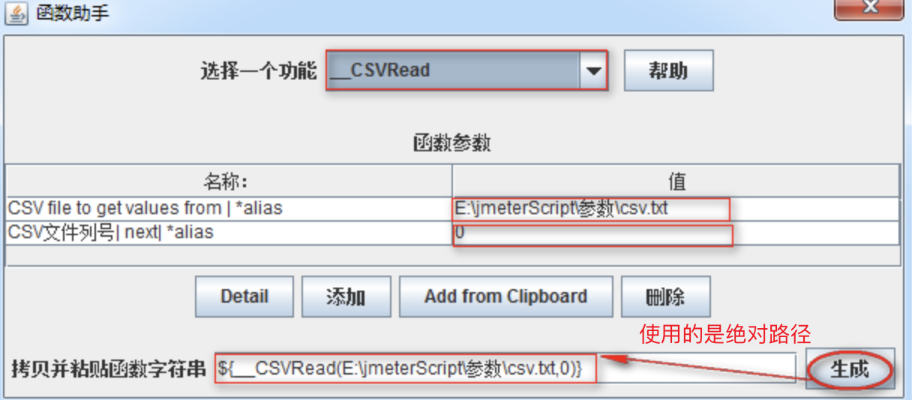
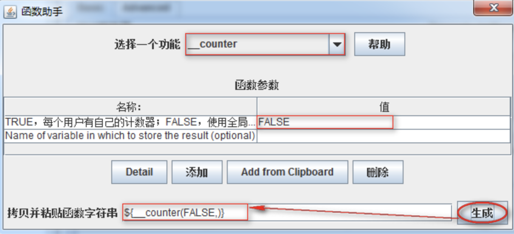
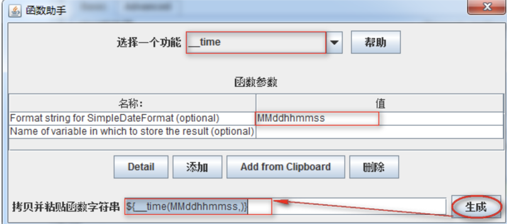
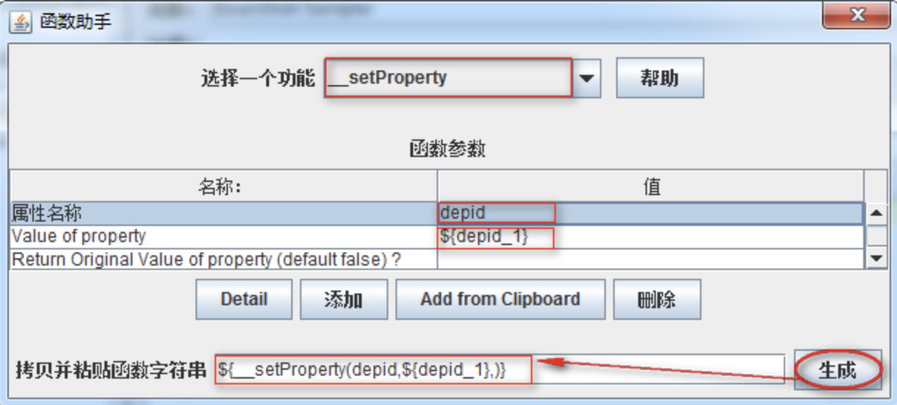
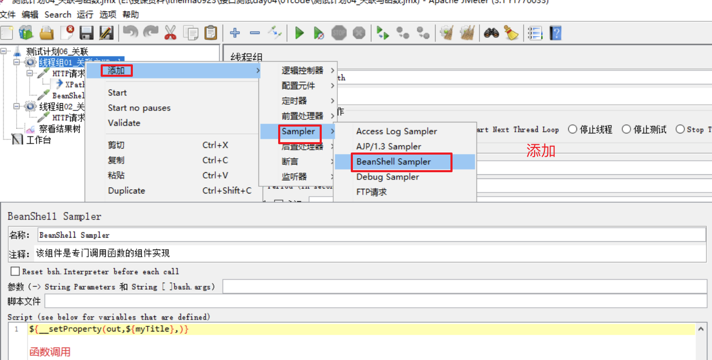

# Jmeter函数

## 学习目标

- 掌握常用的Jmeter函数, 重点是_setProperty、_property

## 1. Jmeter函数概述

### 1.1 Jmeter函数是什么

```
可以被认为是特殊值,可以填充测试树任何采集器或其他元素的字段.
```

### 1.2 为什么学习Jmeter函数

1. 使用函数可以批量对请求的参数操作
2. 使用函数可以读取外部数据进行参数化
3. 使用函数可以设置指定动态数据为全局变量

### 1.3 如何使用Jmeter函数

#### (1)、 Jmeter函数调用格式

```
${__functionName(var1,var2,var3)} 

     1) ${} 函数引用固定格式和参数化相同
     2) __functionName匹配被调用的函数名称；
     3) 用圆括号包含函数的形参，例如${__time(YMD)}，不同函数要求的参数也不同；
     4) 有些JMeter函数不要求参数，则可以不使用圆括号，例如${__threadNum};
```

**函数的参数的注意事项:**

> ​	**如果函数参数包含逗号，请确保使用“ \” 转义，否则JMeter会将其视为参数分隔符.**
>
> 例如:$ {__ time（EEE \，d MMM yyyy）}
>
> 如果逗号未被转义 - 例如$ {__ javaScript（Math.max（2,5））}
>
> 将收到如下错误：
>
> ```
> 错误 -  jmeter.functions.JavaScript：处理Javascript时出错：[Math.max（2）
>     参数列表后面的org.mozilla.javascript.EvaluatorException：missing）（<cmd>＃1）
> ```

#### **(2)、函数助手对话框**

作用: 对Jmeter中自带函数的参数设置和生成使用.

```
启动方式:
       1) 菜单-选项->函数助手对话框
       2) Ctrl+Shift+F1
       3) 工具栏倒数第二个记事本图标
```

## 2 常用的函数

```
1. __CSVRead
2. __counter 
3. __Random
4. __time
5. __setProperty
6. __property
以上为我们使用Jmeter测试项目时常用的函数，接下来我们将逐个学习；
```

### 2.1 _CSVRead函数

作用: csvRead函数是从外部读取参数,可以从一个文件中读取多个参数

#### **(1)、案例1**

```
通过CSVRead函数读取csv.txt内容，作为请求时接口所需参数的值使用

http://127.0.0.1:8000/api/departments/?$dep_id_list=${__CSVRead(E:\jmeterScript\参数\csv.txt,0)}
,${__CSVRead(E:\jmeterScript\参数\csv.txt,1)}

csv.txt内容
    T01,T02
    T03,T04
    T05,T06  
```

#### **(2)、实现分析**

```
1. 测试计划->线程组
2. 线程组->HTTP请求
3. 函数助手对话框->__CSVRead
4. 测试计划->监听器->察看结果树
```

#### **(3)、参数配置**



```
1. 选择一个功能：选择__CSVRead
2. CSV file to get values from | *alias：要读取的文件路径-(绝对路径)
3. CSV文件列号| next| *alias：从第几列开始读取，注意第一列是0
4. 点击生成函数引用格式
5. 全选复制
```

#### **(4)、总结**

流程与 CSV Data Set Config 类似，功能也类似，但是：

1、路径使用绝对路径，可移植性差

2、调用语法冗余(一次只能读取一个字段)

3、使用线程数控制执行次数，比较耗费资源

4、乱码处理不统一(不能使用 UTF-8,使用 ANSI)

综上: CSVRead 函数使用慎重(CSVRead 可以实现的， CSV Data Set Config 也可以)

### 2.2 _counter 函数

```
作用：这个函数是一个计数器，用于统计函数的使用次数  
```

#### **(1)、案例2**

```
使用counter计次函数，请求(查询学院-所有)10次,为每次请求做计次标识  

http://127.0.0.1:8000/api/departments/?num=${__counter(FALSE,)}
```

#### **(2)、实现分析**

```
1. 测试计划->线程组
2. 线程组->HTTP请求
3. 函数助手对话框->__counter
4. 测试计划->监听器->察看结果树
```

#### **(3)、参数配置**



```
参数解释:
 - true:代表每个用户有自己的计数器,可以用于统计每个线程各执行了多少次
 - false: 代表全局计数器,可以统计出这次测试运行了多少次
```

#### **(4)、总结**

```
1. __counter函数作用
2. __counter函数与指定值配合使用 num=${__counter(FALSE,)}
```

### 2.3 _Random函数

作用: 随机生成一个指定范围内的数

#### **(1)、案例3**

```
使用__Random函数对请求(查询学院-指定)进行随机查询

http://127.0.0.1:8000/api/departments/T0${__Random(1,6,)}/
```

#### **(2)、实现分析**

```
1. 测试计划->线程组
2. 线程组->HTTP请求
3. 函数助手对话框->__Random
4. 测试计划->监听器->察看结果树  
```

#### **(3)、函数配置图**


```
1. 一个范围内的最小值:随机数生成时开始数，也是最小数
2. 一个范围内允许的最大值:随机生成结束数，也是最大数
```

#### **(4)、总结**

```
1. __Random作用
2. __Random设置
```

### 2.4 _time 函数

```
作用：获取当前电脑日期时间 比如：MMddhhmmss 月/日/时分秒
```

#### **(1)、案例4**

```
使用__time函数解决迭代(学院-新增)dep_id重复问题

JSON报文：
        {
            "data": [
                        {
                            "dep_id":"time${__time(MMddhhmmss,)}",
                            "dep_name":"Test学院",
                            "master_name":"Test-Master",
                            "slogan":"Here is Slogan"
                        }
                      ]
        }
```

#### **(2)、实现分析**

```
1. 测试计划->HTTP信息头管理器
2. 测试计划->线程组
3. 线程组->HTTP请求
4. 函数助手对话框->__time函数
5. 测试计划->监听器->察看结果树   
```

#### **(3)、_time函数参数配置**



```
Format string for SimpleDateFormat (optional)：
    1) 为空：返回毫秒
    2) 设置格式：MMddhhmmss 月/日/时/分/秒   
```

#### **(4)、总结**

```
1. __time作用
2. __time参数设置
```

### 2.5 _setProperty 、__property 函数

```
作用：
setproperty作用: 用于把指定数据设定成Jmeter属性，可以理解为是把指定数据设置成全局变量 
property: 获取Jmeter属性值
```

#### **(1)、案例5**

```
通过__setProperty函数把新增的学院ID，设置成全局变量
```

#### **(2)、实现分析**

```
1. 测试计划-HTTP信息头管理器
2. 测试计划->JDBC Connection Configuration
3. 测试计划->线程组(学院-新增)
4. 线程组->HTTP请求(HTTP请求-学院新增)
5. 线程组->JDBC Request
6. 函数助手对话框->__setProperty函数
7. 线程组->BeanShell Sampler
8. 线程组->Debug Sampler
9. 测试计划->察看结果树
10. 工作台->Property Display
```

**技术难点:**

```
1. __setProperty函数参数设置
2. BeanShell Sampler作用 
3. JDBC Request SQL语句
4. 如何知道设置的属性(全局变量)成功了
5._property函数获取参数值
```

#### **(3)、setproperty函数配置图**



```
1. 属性名称:要设置的属性名称也就是全局变量名
2. Value of property:属性的值(全局变量的值) 
```

#### **(4)、BeanShell Sampler 配置图**

作用: 可执行js的一种一种容器



#### **(5)、property函数配置图**

用来获取属性值


```
选项解析:
Name of variable in which to store the result (optional):获取属性的名称
```

#### **(6)、总结**

set_property把第一个请求响应的数据声明为属性,beanshell sampler 把属性提升为全局的变量,第二个线程组使用property获取声明为全局的变量值,从而达到第一个线程组的结果作为第二个线程组的参数的传递.

## 3. 总结

每个函数都有不同的使用场景,重点我们要掌握的是___SetProperty 和___Property两种函数的使用.