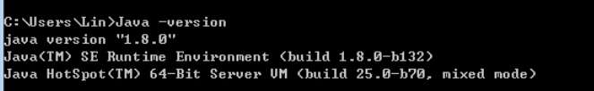
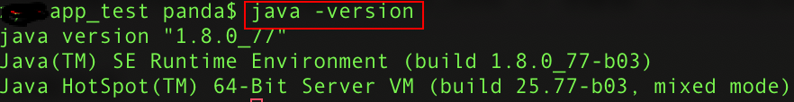

### 1. Wind 安装java环境

安装步骤:

#### 1.1 安装jdk1.8

```
运行jdk-8u151-windows-x64.exe⽂件,默认安装即可

(例如我的安装⽬录：C:\Program Files\Java\jdk1.8.0)
```

#### 1.2 配置java环境变量(windows为例)

```
1.进入我的电脑-->属性-->高级系统设置--->环境变量

2.在系统变量下点击新建 -> 变量名: JAVA_HOME -> 变量值: C:\Program Files\Java\jdk1.8.0
```

#### 1.3 验证环境变量

```
1.打开dos 快捷键win+r
2.输入java -version
```

出现下图,说明安装成功 



### 2. Mac 安装java环境

将下载的osx版的java环境默认进行安装,然后进行一下配置:

```
1.进入命令行， vim ~/.bash_profile 
2.# set jdk1.8
    JAVA_HOME=/Library/Java/JavaVirtualMachines/jdk1.8.0_151.jdk/Contents/Home
    CLASSPATH=.:$JAVA_HOME/lib/dt.jar:$JAVA_HOME/lib/tools.jar
    PATH=$PATH:$JAVA_HOME/bin
    export JAVA_HOME CLASSPATH
    export PATH
```

启动终端,输入java -version查看是否正常启动



