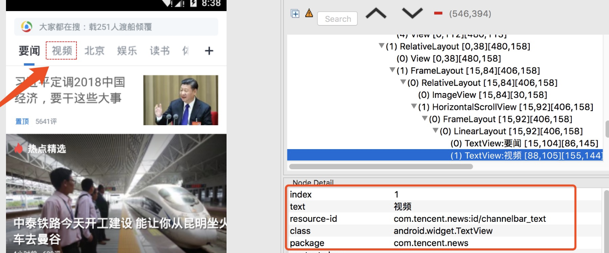

# 手机控件查看工具uiautomatorviewer

### 1. 工具简介

```
  用来扫描和分析Android应用程序的UI控件的工具.
```

### 2. 如何使用

```
1.进入SDK目录下的tools目录，打开uiautomatorviewer
2.电脑连接真机或打开android模拟器
3.启动待测试app
4.点击uiautomatorviewer的左上⻆Device Screenshot,会生成app的UI控件截图
5.选择截图上需要查看的控件，即可浏览该控件的id,class,text,坐标等信息
```



