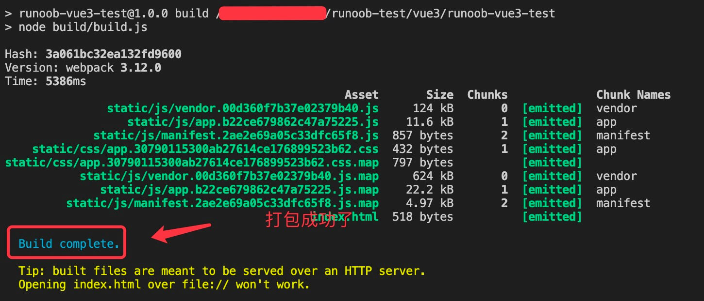

# Vue3 教程

## 阅读本教程前，您需要了解的知识：

- HTML

- CSS

- JavaScript

  

# Vue3 安装

## 1、独立版本

我们可以在 Vue.js 的官网上直接下载最新版本, 并用 **<script>** 标签引入。

- [下载 Vue.js](https://unpkg.com/vue@next)

以下推荐国外比较稳定的两个 CDN，国内还没发现哪一家比较好，目前还是建议下载到本地。

- **Staticfile CDN（国内）** : https://cdn.staticfile.org/vue/3.0.5/vue.global.js
- **unpkg**：https://unpkg.com/vue@next, 会保持和 npm 发布的最新的版本一致。
- **cdnjs** : https://cdnjs.cloudflare.com/ajax/libs/vue/3.0.5/vue.global.js

```html
<!DOCTYPE html>
<html>
<head>
<meta charset="utf-8">
<title>Vue 测试实例 - 菜鸟教程(runoob.com)</title>
<script src="https://cdn.staticfile.org/vue/3.0.5/vue.global.js"></script>
</head>
<body>
<div id="hello-vue" class="demo">
  {{ message }}
</div>

<script>
const HelloVueApp = {
  data() {
    return {
      message: 'Hello Vue!!'
    }
  }
}

Vue.createApp(HelloVueApp).mount('#hello-vue')
</script>
</body>
</html>
```


## vue create 命令 创建项目

vue create 命令创建项目语法格式如下：

```
vue create [options] <app-name>
```

创建一个由 vue-cli-service 提供支持的新项目：

options 选项可以是：

- **-p, --preset <presetName>**： 忽略提示符并使用已保存的或远程的预设选项
- **-d, --default**： 忽略提示符并使用默认预设选项
- **-i, --inlinePreset <json>**： 忽略提示符并使用内联的 JSON 字符串预设选项
- **-m, --packageManager <command>**： 在安装依赖时使用指定的 npm 客户端
- **-r, --registry <url>**： 在安装依赖时使用指定的 npm registry
- **-g, --git [message]**： 强制 / 跳过 git 初始化，并可选的指定初始化提交信息
- **-n, --no-git**： 跳过 git 初始化
- **-f, --force**： 覆写目标目录可能存在的配置
- **-c, --clone**： 使用 git clone 获取远程预设选项
- **-x, --proxy**： 使用指定的代理创建项目
- **-b, --bare**： 创建项目时省略默认组件中的新手指导信息
- **-h, --help**： 输出使用帮助信息

接下来我们创建 runoob-vue3-app 项目：

```
vue create runoob-vue3-app
```

执行以上命令会出现安装选项界面：

```
Vue CLI v4.4.6
? Please pick a preset: (Use arrow keys)
❯ default (babel, eslint)
  Manually select features
```

按下回车键后就会进入安装，等候片刻即可完成安装。

安装完成后，我们进入项目目录：

cd runoob-vue3-app2

启动应用：

```
npm run serve
```

然后打开 **http://localhost:8080/**，就可以看到应用界面了：


## Vite创建项目

Vite 是一个 web 开发构建工具，由于其原生 ES 模块导入方式，可以实现闪电般的冷服务器启动。

通过在终端中运行以下命令，可以使用 Vite 快速构建 Vue 项目，语法格式如下：

```
npm init vite-app <project-name>
```

创建项目 runoob-vue3-test2：

```
$  npm init vite-app runoob-vue3-test2
```

运行项目:

```
$ cd runoob-vue3-test2
$ cnpm install
$ cnpm run dev
> runoob-vue3-test2@0.0.0 dev /Users/tianqixin/runoob-test/vue3/runoob-vue3-test2
> vite

[vite] Optimizable dependencies detected:
vue

  Dev server running at:
  > Local:    http://localhost:3000/
```

打开 **http://localhost:3000/**，显示如下：


Vue3 项目打包

```
cnpm run build
```

# Vue3 目录结构


**命令行工具 vue-cli（runoob-vue3-test）：**


**Vite（runoob-vue3-test2）**


### 目录解析

| 目录/文件    | 说明                                                         |
| :----------- | :----------------------------------------------------------- |
| build        | 项目构建(webpack)相关代码                                    |
| config       | 配置目录，包括端口号等。我们初学可以使用默认的。             |
| node_modules | npm 加载的项目依赖模块                                       |
| src          | 这里是我们要开发的目录，基本上要做的事情都在这个目录里。里面包含了几个目录及文件：assets: 放置一些图片，如logo等。components: 目录里面放了一个组件文件，可以不用。App.vue: 项目入口文件，我们也可以直接将组件写这里，而不使用 components 目录。main.js: 项目的核心文件。index.css: 样式文件。 |
| static       | 静态资源目录，如图片、字体等。                               |
| public       | 公共资源目录。                                               |
| test         | 初始测试目录，可删除                                         |
| .xxxx文件    | 这些是一些配置文件，包括语法配置，git配置等。                |
| index.html   | 首页入口文件，你可以添加一些 meta 信息或统计代码啥的。       |
| package.json | 项目配置文件。                                               |
| README.md    | 项目的说明文档，markdown 格式                                |
| dist         | 使用 **npm run build** 命令打包后会生成该目录。              |


# Vue3 起步

> 起步两步
>
> 创建应用，并写东西，挂载
>
> Vue.createApp({ xxxx}).mount('#xxxid')
>
> ```
> 其他写法：
> const project_name1 = Vue.createApp({ xxxx}).mount('#xxxid')
> 
> 
> const HelloVueApp = Vue.createApp({
>   data() {
>     return {
>       message: 'Hello Vue!!'
>     }
>   }
> }).mount('#hello-vue')
> 
> 
> 
> 2\
> const app = Vue.createApp({ /* 选项 */ })
> app.mount('#xxxid')
> 
> 
> ```
>
> 


Vue3 中的应用是通过使用 createApp 函数来创建的，语法格式如下：

```
const app = Vue.createApp({ /* 选项 */ })
```

传递给 createApp 的选项用于配置根组件。在使用 **mount()** 挂载应用时，该组件被用作渲染的起点。


一个简单的实例：

```
Vue.createApp(xxxxxx根组件).mount('#hello-vue')
```

createApp 的参数是根组件（HelloVueApp），在挂载应用时，该组件是渲染的起点。


```html
<div id="hello-vue" class="demo">
  {{ message }}
</div>
​
<script>
const HelloVueApp = {
  data() {
    return {
      message: 'Hello Vue!!'
    }
  }
}
​
Vue.createApp(HelloVueApp).mount('#hello-vue')
</script>
```


### data 选项

**data 选项**是一个函数。Vue 在创建新组件实例的过程中调用此函数。它应该返回一个对象，然后 Vue 会通过响应性系统将其包裹起来，并以 $data 的形式存储在组件实例中。


```html
const app = Vue.createApp({
  data() {
    return { count: 4 }
  }
})

const vm = app.mount('#app')

document.write(vm.$data.count) // => 4
document.write("<br>")
document.write(vm.count)       // => 4
document.write("<br>")
// 修改 vm.count 的值也会更新 $data.count
vm.count = 5
document.write(vm.$data.count) // => 5
document.write("<br>")
// 反之亦然
vm.$data.count = 6
document.write(vm.count) // => 6
```

## 方法

 **methods** 选项

```vue
const app = Vue.createApp({
  data() {
    return { count: 4 }
  },
  methods: {
    increment() {
      // `this` 指向该组件实例
      this.count++
    }
  }
})

const vm = app.mount('#app')

document.write(vm.count) // => 4
document.write("<br>")
vm.increment()

document.write(vm.count) // => 5
```


# Vue3 指令

核心功能

以 v- 开头的特殊属性形式使用

响应式数据绑定到 DOM 元素上或在 DOM 元素上进行一些操作

文档对象模型。 *DOM*是Javascript看到其包含页面数据的方式。它是一个对象，包括HTML / XHTML / XML的格式，以及浏览器状态。 *DOM元素*类似于页面上的DIV，HTML

 Vue 创建响应式页面要容易得多，并且需要的代码更少

| 指令      | 描述                                                         |
| :-------- | :----------------------------------------------------------- |
| `v-bind`  | 用于将 Vue 实例的数据绑定到 HTML 元素的属性上。              |
| `v-if`    | 用于根据表达式的值来条件性地渲染元素或组件。                 |
| `v-show`  | v-show 是 Vue.js 提供的一种指令，用于根据表达式的值来条件性地显示或隐藏元素。 |
| `v-for`   | 用于根据数组或对象的属性值来循环渲染元素或组件。             |
| `v-on`    | 用于在 HTML 元素上绑定事件监听器，使其能够触发 Vue 实例中的方法或函数。 |
| `v-model` | 用于在表单控件和 Vue 实例的数据之间创建双向数据绑定。        |


```html
<div id="hello-vue" class="demo">
    <button v-on:click="showMessage = !showMessage">显示/隐藏</button>
    <p v-show="showMessage">Hello Vue!</p>
</div>

<script>
const HelloVueApp = {
  data() {
    return {
      showMessage: true
    }
  }
}

Vue.createApp(HelloVueApp).mount('#hello-vue')
</script>
```


# Vue3 创建单文件组件(SFC)

Vue 的单文件组件 (即 *.vue 文件，英文 Single-File Component，简称 SFC) 

是一种特殊的文件格式，使我们能够将一个 Vue 组件的模板、逻辑与样式封装在单个文件中。

## App.vue 文件：

<script></script>

<template></template>

<style></style>


同时我们可以先清空 **src** 目录中的文件夹 **assets** 和 **components**，里面的文件我们可以后期自己添加补充 。

main.js 文件代码修改为如下代码：


## main.js 文件代码：

```vue
import { createApp } from 'vue'
import App from './App.vue'

createApp(App).mount('#app')


现在我们就创建了一个简单的项目，在 App.vue 文件写入以下代码：

App.vue 文件代码：
<template>
  <div>
    <h1>{{ message }}</h1>
  </div>
</template>

<script>
export default {
  data() {
    return {
      message: 'Hello, RUNOOB!'
    }
  }
}
</script>

<style>
h1 {
  color: blue;
}
</style>


```


```vue
使用组件
当我们定义好了一个组件之后，我们可以在其他组件中使用这个组件。

使用组件，我们需要先创建组件，比如以下实例在 ./src/components/ 目录下创建 HelloRunoob.vue 组件文件，代码如下：

./src/components/HelloRunoob.vue 文件代码：
<template>
  <div>
    <h1>{{ message }}</h1>
  </div>
</template>

<script>
export default {
  data() {
    return {
      message: 'Hello, Runoob!'
    }
  }
}
</script>

<style>
h1 {
  color: red;
}
</style>


然后我们在 ./src/main.js 文件中引入并定义该组件：

./src/main.js 文件代码：
import { createApp } from 'vue'

import App from './App.vue'
import HelloRunoob from './components/HelloRunoob.vue'

const app = createApp(App)
app.component('hello-runoob', HelloRunoob) // 自定义标签
app.mount('#app')


在父组件的模板中，我们可以使用自定义标签的方式来引入子组件，就像以下 App.vue 文件代码：


App.vue 文件代码


<template>
  <div>
    <hello-runoob></hello-runoob>
  </div>
</template>
访问 http://localhost:5173/，以上代码执行结果为：


```

Vue3 模板语法

# Vue3 模板语法

Vue 使用了基于 HTML 的模板语法，允许开发者声明式地将 DOM 绑定至底层 Vue 实例的数据。

Vue 的核心是一个允许你采用简洁的模板语法来声明式的将数据渲染进 DOM 的系统。


 **v-once** 指令执行一次性地插值，当数据改变时，插值处的内容不会更新。

```
<span v-once>这个将不会改变: {{ message }}</span>
```

**使用 v-html 指令用于输出 html 代码：**

   <p>使用 v-html 指令: <span v-html="rawHtml"></span></p>

```
 <p>使用 v-html 指令: <span v-html="rawHtml"></span></p>
 
 
 <script>
const RenderHtmlApp = {
  data() {
    return {
      rawHtml: '<span style="color: red">这里会显示红色！</span>'
    }
  }
}
 
Vue.createApp(RenderHtmlApp).mount('#example1')
</script>
```


**HTML 属性中的值应使用 v-bind 指令。**


Vue.js 都提供了完全的 JavaScript 表达式支持。

```
<div id="app">
    {{5+5}}<br>
    {{ ok ? 'YES' : 'NO' }}<br>
    {{ message.split('').reverse().join('') }}
    <div v-bind:id="'list-' + id">菜鸟教程</div>
</div>
    
<script>
const app = {
  data() {
    return {
      ok: true,
      message: 'RUNOOB!!',
      id: 1
    }
  }
}
 
Vue.createApp(app).mount('#app')
</script>


<!--  这是语句，不是表达式：-->
{{ var a = 1 }}

<!-- 流控制也不会生效，请使用三元表达式 -->
{{ if (ok) { return message } }}
```


## 缩写

### v-bind 缩写

Vue.js 为两个最为常用的指令提供了特别的缩写：

```
<!-- 完整语法 -->
<a v-bind:href="url"></a>
<!-- 缩写 -->
<a :href="url"></a>
```

### v-on 缩写

```
<!-- 完整语法 -->
<a v-on:click="doSomething"></a>
<!-- 缩写 -->
<a @click="doSomething"></a>
```

[返回顶](javascript:scroll(0,0))

**v-if**

**v-show**

**v-else-if**

**v-else**

```vue
<!DOCTYPE html>
<html>
<head>
<meta charset="utf-8">
<title>Vue 测试实例 - 菜鸟教程(runoob.com)</title>
<script src="https://unpkg.com/vue@next"></script>
</head>
<body>
<div id="app">
   <select @change="changeVal($event)" v-model="selOption">
      <template v-for="(site,index) in sites" :site="site" :index="index" :key="site.id">
         <!-- 索引为 1 的设为默认值，索引值从0 开始-->
         <option v-if = "index == 1" :value="site.name" selected>{{site.name}}</option>
         <option v-else :value="site.name">{{site.name}}</option>
      </template>
   </select>
   <div>您选中了:{{selOption}}</div>
</div>
 
<script>
const app = {
    data() {
        return {
            selOption: "Runoob",
            sites: [
                  {id:1,name:"Google"},
                  {id:2,name:"Runoob"},
                  {id:3,name:"Taobao"},
            ]
         }
        
    },
    methods:{
        changeVal:function(event){
            this.selOption = event.target.value;
            alert("你选中了"+this.selOption);
        }
    }
}
 
Vue.createApp(app).mount('#app')
</script>
</body>
</html>
```


# Vue3 计算属性

计算属性关键词: computed。

计算属性在处理一些复杂逻辑时是很有用的。


```
<div id="app">
  {{ message.split('').reverse().join('') }}
</div>
```

```vue
实例 2
<!DOCTYPE html>
<html>
<head>
<meta charset="utf-8">
<title>Vue 测试实例 - 菜鸟教程(runoob.com)</title>
<script src="https://cdn.staticfile.org/vue/3.0.5/vue.global.js"></script>
</head>
<body>
<div id="app">
  <p>原始字符串: {{ message }}</p>
  <p>计算后反转字符串: {{ reversedMessage }}</p>
</div>
    
<script>
const app = {
  data() {
    return {
      message: 'RUNOOB!!'
    }
  },
  computed: {
    // 计算属性的 getter
    reversedMessage: function () {
      // `this` 指向 vm 实例
      return this.message.split('').reverse().join('')
    }
  }
}
 
Vue.createApp(app).mount('#app')
</script>
</body>
</html>


```

vm.reversedMessage 依赖于 vm.message，在 vm.message 发生改变时，

我们可以使用 methods 来替代 computed，效果上两个都是一样的，但是 computed 是基于它的依赖缓存，只有相关依赖发生改变时才会重新取值。而使用 methods ，在重新渲染的时候，函数总会重新调用执行。

（换人话就是computed在message变的时候才调用执行一般是缓存着的，而methods每次刷新都会执行一次）


可以说使用 computed 性能会更好，但是如果你不希望缓存，你可以使用 methods 属性


https://m.runoob.com/vue3/vu3-computed.html


## computed setter

computed 属性默认只有 getter ，不过在需要时你也可以提供一个 setter ：

```
getter - 百度翻译
吸气剂，吸气剂
常见释义
英[ˈgɛtə]
美[ˈgɛtər]
n.	吸气剂；吸（收，消）气器;
v.	除（收，消）气；吸收（气）;

```


```vue
<!DOCTYPE html>
<html>
<head>
<meta charset="utf-8">
<title>Vue 测试实例 - 菜鸟教程(runoob.com)</title>
<script src="https://cdn.staticfile.org/vue/3.0.5/vue.global.js"></script>
</head>
<body>
<div id="app">
 
</div>
    
<script>
const app = {
  data() {
    return {
      name: 'Google',
      url: 'http://www.google.com'
    }
  },
  computed: {
    site: {
      // getter
      get: function () {
        return this.name + ' ' + this.url
      },
      // setter
      set: function (newValue) {
        var names = newValue.split(' ')
        this.name = names[0]
        this.url = names[names.length - 1]
      }
    }
  }
}
vm = Vue.createApp(app).mount('#app')
document.write('name: ' + vm.name);
document.write('<br>');
document.write('url: ' + vm.url);
document.write('<br>------ 更新数据 ------<br>');
// 调用 setter， vm.name 和 vm.url 也会被对应更新
vm.site = '菜鸟教程 https://www.runoob.com';
document.write('name: ' + vm.name);
document.write('<br>');
document.write('url: ' + vm.url);
</script>
</body>
</html>
```


# Vue3 组件

组件（Component）是 Vue.js 最强大的功能之一。

组件可以扩展 HTML 元素，封装可重用的代码。

组件系统让我们可以用独立可复用的小组件来构建大型应用，几乎任意类型的应用的界面都可以抽象为一个组件树：

每个 Vue 应用都是通过用 createApp 函数创建的，传递给 createApp 的选项用于配置根组件。当我们挂载应用时，该组件被用作渲染的起点。

一个应用需要被挂载到一个 DOM 元素中。

以下实例我们将 Vue 应用挂载到 <div id="app"></div>，应该传入 #app：

```
const RootComponent = { /* 选项 */ }
const app = Vue.createApp(RootComponent)
const vm = app.mount('#app')
```

注册一个全局组件语法格式如下：

```
const app = Vue.createApp({...})

app.component('my-component-name', {
  /* ... */
})
```

**my-component-name** 为组件名，**/\* ... \*/** 部分为配置选项。注册后，我们可以使用以下方式来调用组件：

```
<my-component-name></my-component-name>
```

一个简单的 Vue 组件的实例：


```
<div id="app">
    <runoob></runoob>
</div>
 
<script>
// 创建一个Vue 应用
const app = Vue.createApp({})
 
// 定义一个名为 runoob的新全局组件
app.component('runoob', {
    template: '<h1>自定义组件!</h1>'
})
 
app.mount('#app')
</script>
```

```
<!DOCTYPE html>
<html>
<head>
<meta charset="utf-8">
<title>Vue 测试实例 - 菜鸟教程(runoob.com)</title>
<script src="https://cdn.staticfile.org/vue/3.2.36/vue.global.min.js"></script>
</head>
<body>
<div id="app">
    <button-counter></button-counter>
</div>

<script>
// 创建一个Vue 应用
const app = Vue.createApp({})

// 定义一个名为 button-counter 的新全局组件
app.component('button-counter', {
  data() {
    return {
      count: 0
    }
  },
  template: `
    <button @click="count++">
      点了 {{ count }} 次！
    </button>`
})
app.mount('#app')
</script>
</body>
</html>
```


### 组件的复用

你可以将组件进行任意次数的复用：

## 实例


```
<div id="components-demo"> 
<button-counter></button-counter>
<button-counter></button-counter> 
<button-counter></button-counter>
</div>
```

### 全局组件

**以上的实例中我们的组件都只是通过 component 全局注册的。**

**全局注册的组件可以在随后创建的 app 实例模板中使用，也包括根实例组件树中的所有子组件的模板**中。

```
全局组件实例
注册一个简单的全局组件 runoob，并使用它：

<div id="app">
    <runoob></runoob>
</div>
 
<script>
// 创建一个Vue 应用
const app = Vue.createApp({})
 
// 定义一个名为 runoob 的新全局组件
app.component('runoob', {
    template: '<h1>自定义组件!</h1>'
})
 
app.mount('#app')
</script>
```


### 局部组件

全局注册往往是不够理想的。比如，如果你使用一个像 webpack 这样的构建系统，全局注册所有的组件意味着即便你已经不再使用一个组件了，它仍然会被包含在你最终的构建结果中。这造成了用户下载的 JavaScript 的无谓的增加。

在这些情况下，你可以通过一个普通的 JavaScript 对象来定义组件：


在这些情况下，你可以通过一个普通的 JavaScript 对象来定义组件：

```
const ComponentA = {
  /* ... */
}
const ComponentB = {
  /* ... */
}
const ComponentC = {
  /* ... */
}
```

然后在 components 选项中定义你想要使用的组件：

```
const app = Vue.createApp({
  components: {
    'component-a': ComponentA,
    'component-b': ComponentB
  }
})
```


## 局部组件实例

注册一个简单的局部组件 runoobA，并使用它：


```
<div id="app">  
<runoob-a></runoob-a> 
</div> 

<script> 
var runoobA = {   template: '<h1>自定义组件!</h1>' }  

const app = Vue.createApp({   components: {     'runoob-a': runoobA   } })   
app.mount('#app') 
</script>
```

## Prop

**prop 是子组件用来接受父组件传递过来的数据的一个自定义属性。**

> 就是内嵌或者被引用的组件接收主组件、当前组件、父组件的值

父组件的数据需要通过 props 把数据传给子组件，子组件需要显式地用 props 选项声明 "prop"：

## Prop 实例

<div id="app">   <site-name title="Google"></site-name>   <site-name title="Runoob"></site-name>   <site-name title="Taobao"></site-name> </div>   <script> const app = Vue.createApp({})   app.component('site-name', {   props: ['title'],   template: `<h4>{{ title }}</h4>` })   app.mount('#app') </script>

[尝试一下 »](https://m.runoob.com/try/try2.php?filename=vue3-component-prop1)


```
Prop 实例
<div id="app">
  <site-name title="Google"></site-name>
  <site-name title="Runoob"></site-name>
  <site-name title="Taobao"></site-name>
</div>
 
<script>
const app = Vue.createApp({})
 
app.component('site-name', {
  props: ['title'],
  template: `<h4>{{ title }}</h4>`
})
 
app.mount('#app')
</script
```

一个组件默认可以拥有任意数量的 prop，任何值都可以传递给任何 prop。

***子组件*在*父组件*的 template 属性或者是模板中**


```html
动态 Prop
类似于用 v-bind 绑定 HTML 特性到一个表达式，也可以用 v-bind 动态绑定 props 的值到父组件的数据中。每当父组件的数据变化时，该变化也会传导给子组件：

Prop 实例
<div id="app">
  <site-info
    v-for="site in sites"
    :id="site.id"
    :title="site.title"
  ></site-info>
</div>
 
<script>
const Site = {
  data() {
    return {
      sites: [
        { id: 1, title: 'Google' },
        { id: 2, title: 'Runoob' },
        { id: 3, title: 'Taobao' }
      ]
    }
  }
}
 
const app = Vue.createApp(Site)
 
app.component('site-info', {
  props: ['id','title'],
  template: `<h4>{{ id }} - {{ title }}</h4>`
})
 
app.mount('#app')
</script>

尝试一下 »

1 - Google
2 - Runoob
3 - Taobao

比较过程 != 比较时，若类型不同，会偿试转换类型；!== 只有相同类型才会比较。
当找不到项目时，indexOf返回-1。!==是严格的not equals运算符。
Prop 验证
组件可以为 props 指定验证要求。

为了定制 prop 的验证方式，你可以为 props 中的值提供一个带有验证需求的对象，而不是一个字符串数组。例如：

Vue.component('my-component', {
  props: {
    // 基础的类型检查 (`null` 和 `undefined` 会通过任何类型验证)
    propA: Number,
    // 多个可能的类型
    propB: [String, Number],
    // 必填的字符串
    propC: {
      type: String,
      required: true
    },
    // 带有默认值的数字
    propD: {
      type: Number,
      default: 100
    },
    // 带有默认值的对象
    propE: {
      type: Object,
      // 对象或数组默认值必须从一个工厂函数获取
      default: function () {
        return { message: 'hello' }
      }
    },
    // 自定义验证函数
    propF: {
      validator: function (value) {
        // 这个值必须匹配下列字符串中的一个
        return ['success', 'warning', 'danger'].indexOf(value) !== -1
      }
    }
  }
})
当 prop 验证失败的时候，(开发环境构建版本的) Vue 将会产生一个控制台的警告。

type 可以是下面原生构造器：

String
Number
Boolean
Array
Object
Date
Function
Symbol
type 也可以是一个自定义构造器，使用 instanceof 检测。

对象运算符(instanceof)用来判断一个对象是否属于某个指定的类或其子类的实例,如果是,返回真(true),否则返回假(false)。
instanceof - 百度翻译
运算符
常见释义
网络	运算符; 关键字; 实例; 另外还有比较运算符; 操作符;


```

# Vue3 监听属性

本章节，我们将为大家介绍 Vue3 监听属性 watch，我们可以通过 watch 来响应数据的变化。

以下实例通过使用 watch 实现计数器：


```
以下实例进行千米与米之间的换算：

实例
<div id = "app">
    千米 : <input type = "text" v-model = "kilometers"  @focus="currentlyActiveField = 'kilometers'">
    米 : <input type = "text" v-model = "meters" @focus="currentlyActiveField = 'meters'">
</div>
<p id="info"></p>    
<script>
const app = {
  data() {
    return {
      kilometers : 0,
      meters:0
    }
  },
  watch : {
    kilometers:function(newValue, oldValue) {
      // 判断是否是当前输入框
      if (this.currentlyActiveField === 'kilometers') {
        this.kilometers = newValue;
        this.meters = newValue * 1000
      }
    },
    meters : function (newValue, oldValue) {
      // 判断是否是当前输入框
      if (this.currentlyActiveField === 'meters') {
        this.kilometers = newValue/ 1000;
        this.meters = newValue;
      }
    }
  }
}
vm = Vue.createApp(app).mount('#app')
vm.$watch('kilometers', function (newValue, oldValue) {
  // 这个回调将在 vm.kilometers 改变后调用
  document.getElementById ("info").innerHTML = "修改前值为: " + oldValue + "，修改后值为: " + newValue;
})
</script>实例
<div id = "app">
    <p style = "font-size:25px;">计数器: {{ counter }}</p>
    <button @click = "counter++" style = "font-size:25px;">点我</button>
</div>
   
<script>
const app = {
  data() {
    return {
      counter: 1
    }
  }
}
vm = Vue.createApp(app).mount('#app')
vm.$watch('counter', function(nval, oval) {
    alert('计数器值的变化 :' + oval + ' 变为 ' + nval + '!');
});
</script>

以下实例进行千米与米之间的换算：

实例
<div id = "app">
    千米 : <input type = "text" v-model = "kilometers"  @focus="currentlyActiveField = 'kilometers'">
    米 : <input type = "text" v-model = "meters" @focus="currentlyActiveField = 'meters'">
</div>
<p id="info"></p>    
<script>
const app = {
  data() {
    return {
      kilometers : 0,
      meters:0
    }
  },
  watch : {
    kilometers:function(newValue, oldValue) {
      // 判断是否是当前输入框
      if (this.currentlyActiveField === 'kilometers') {
        this.kilometers = newValue;
        this.meters = newValue * 1000
      }
    },
    meters : function (newValue, oldValue) {
      // 判断是否是当前输入框
      if (this.currentlyActiveField === 'meters') {
        this.kilometers = newValue/ 1000;
        this.meters = newValue;
      }
    }
  }
}
vm = Vue.createApp(app).mount('#app')
vm.$watch('kilometers', function (newValue, oldValue) {
  // 这个回调将在 vm.kilometers 改变后调用
  document.getElementById ("info").innerHTML = "修改前值为: " + oldValue + "，修改后值为: " + newValue;
})
</script>


异步加载中使用 watch
异步数据的加载 Vue 通过 watch 选项提供了一个更通用的方法，来响应数据的变化。

以下实例我们使用 axios 库，后面会具体介绍。

实例
<!-- 因为 AJAX 库和通用工具的生态已经相当丰富，Vue 核心代码没有重复 -->
<!-- 提供这些功能以保持精简。这也可以让你自由选择自己更熟悉的工具。 -->
<script src="https://cdn.staticfile.org/axios/0.27.2/axios.min.js"></script>
<script src="https://cdn.staticfile.org/vue/3.2.37/vue.global.min.js"></script>
<script>
  const watchExampleVM = Vue.createApp({
    data() {
      return {
        question: '',
        answer: '每个问题结尾需要输入 ? 号。'
      }
    },
    watch: {
      // 每当问题改变时，此功能将运行，以 ? 号结尾，兼容中英文 ?
      question(newQuestion, oldQuestion) {
        if (newQuestion.indexOf('?') > -1 || newQuestion.indexOf('？') > -1) {
          this.getAnswer()
        }
      }
    },
    methods: {
      getAnswer() {
        this.answer = '加载中...'
        axios
          .get('/try/ajax/json_vuetest.php')
          .then(response => {
            this.answer = response.data.answer
          })
          .catch(error => {
            this.answer = '错误! 无法访问 API。 ' + error
          })
      }
    }
  }).mount('#watch-example')
</script>
```


## 钩子

### 钩子函数

指令定义函数提供了几个钩子函数（可选）：

- `created `: 在绑定元素的属性或事件监听器被应用之前调用。
- `beforeMount `: 指令第一次绑定到元素并且在挂载父组件之前调用。。
- `mounted `: 在绑定元素的父组件被挂载后调用。。
- `beforeUpdate`: 在更新包含组件的 VNode 之前调用。。
- `updated`: 在包含组件的 VNode 及其子组件的 VNode 更新后调用。
- `beforeUnmount`: 当指令与在绑定元素父组件卸载之前时，只调用一次。
- `unmounted`: 当指令与元素解除绑定且父组件已卸载时，只调用一次。

### 钩子函数参数

钩子函数的参数有：

**el**

el 指令绑定到的元素。这可用于直接操作 DOM。

**binding**

binding 是一个对象，包含以下属性：

- `instance`：使用指令的组件实例。
- `value`：传递给指令的值。例如，在 `v-my-directive="1 + 1"` 中，该值为 `2`。
- `oldValue`：先前的值，仅在 `beforeUpdate` 和 `updated` 中可用。值是否已更改都可用。
- `arg`：参数传递给指令 (如果有)。例如在 `v-my-directive:foo` 中，arg 为 `"foo"`。
- `modifiers`：包含修饰符 (如果有) 的对象。例如在 `v-my-directive.foo.bar` 中，修饰符对象为 `{foo: true，bar: true}`。
- `dir`：一个对象，在注册指令时作为参数传递。例如，在以下指令中：

**vnode**

作为 el 参数收到的真实 DOM 元素的蓝图。

**prevNode**

上一个虚拟节点，仅在 beforeUpdate 和 updated 钩子中可用。

以下实例演示了这些参数的使用：


# Vue3 路由

本章节我们将为大家介绍 Vue 路由。

Vue 路由允许我们通过不同的 URL 访问不同的内容。

通过 Vue 可以实现多视图的单页 Web 应用（single page web application，SPA）。

Vue.js 路由需要载入 [vue-router 库](https://github.com/vuejs/vue-router-next)

中文文档地址：[vue-router 文档](https://next.router.vuejs.org/zh/guide/)。


## 安装

### 1、直接下载 / CDN

```
https://unpkg.com/vue-router@4
```

### NPM

推荐使用淘宝镜像：

```
npm install -g cnpm --registry=https://registry.npmmirror.com
cnpm install vue-router@4
```


**<router-link>** 是一个组件，该组件用于设置一个导航链接，切换不同 HTML 内容。 **to** 属性为目标地址， 即要显示的内容。

以下实例中我们将 vue-router 加进来，然后配置组件和路由映射，再告诉 vue-router 在哪里渲染它们。代码如下所示：

​    <!--使用 router-link 组件进行导航 -->  

  <!--通过传递 `to` 来指定链接 -->  

  <!--`<router-link>` 将呈现一个带有正确 `href` 属性的 `<a>` 标签-->   

<router-link to="/">Go to Home</router-link> 

   <router-link to="/about">Go to About</router-link>


**混入 (mixins)定义了一部分可复用的方法或者计算属性**。混入对象可以包含任意组件选项。当组件使用混入对象时，所有混入对象的选项将被混入该组件本身的选项。

来看一个简单的实例：

## 实例

// 定义混入对象 const myMixin = {  created() {    this.hello()  },  methods: {    hello() {      console.log('欢迎来到混入实例-RUNOOB!')    }  } }  // 定义一个应用，使用混入 const app = Vue.createApp({  mixins: [myMixin] })  app.mount('#app') // => "欢迎来到混入实例-RUNOOB!"


## 选项合并

当组件和混入对象含有同名选项时，这些选项将以恰当的方式混合。

比如，数据对象在内部会进行浅合并 (一层属性深度)，在和组件的数据发生冲突时以组件数据优先。

以下实例中，Vue 实例与混入对象包含了相同的方法。从输出结果可以看出两个选项合并了。

## 实例

<!DOCTYPE html> <html> <head> <meta charset="utf-8"> <title>Vue 测试实例 - 菜鸟教程(runoob.com)</title> <script src="https://unpkg.com/vue@next"></script> </head> <body> <div id = "app"></div> <script type = "text/javascript"> const myMixin = {  data() {    return {      message: 'hello',      foo: 'runoob'    }  } }  const app = Vue.createApp({  mixins: [myMixin],  data() {    return {      message: 'goodbye',      bar: 'def'    }  },  created() {    document.write(JSON.stringify(this.$data))   } })

输出结果为：

```
{"message":"goodbye","foo":"runoob","bar":"def"}
```


[尝试一下 »](https://m.runoob.com/try/try2.php?filename=vue3-mixin2)

同名钩子函数将合并为一个数组，因此都将被调用。另外，mixin 对象的钩子将在组件自身钩子之前调用。

```
const myMixin = {
  created() {
    console.log('mixin 对象的钩子被调用')
  }
}

const app = Vue.createApp({
  mixins: [myMixin],
  created() {
    console.log('组件钩子被调用')
  }
})

// => "mixin 对象的钩子被调用"
// => "组件钩子被调用"
```

值为对象的选项，例如 methods、components 和 directives，将被合并为同一个对象。两个对象键名冲突时，取组件对象的键值对。

## 实例

const myMixin = {  methods: {    foo() {      console.log('foo')    },    conflicting() {      console.log('from mixin')    }  } }  const app = Vue.createApp({  mixins: [myMixin],  methods: {    bar() {      console.log('bar')    },    conflicting() {      console.log('from self')    }  } })  const vm = app.mount('#app')  vm.foo() // => "foo" vm.bar() // => "bar" vm.conflicting() // => "from self"

以上实例，我们调用了以下三个方法：

```
vm.foo();
vm.bar();
vm.conflicting();
```

从输出结果 methods 选项中如果碰到相同的函数名则 Vue 实例有更高的优先级会执行输出。

------

## 全局混入

也可以全局注册混入对象。注意使用！ 一旦使用全局混入对象，将会影响到 所有 之后创建的 Vue 实例。使用恰当时，可以为自定义对象注入处理逻辑。

## 实例

const app = Vue.createApp({  myOption: 'hello!' })  // 为自定义的选项 'myOption' 注入一个处理器。 app.mixin({  created() {    const myOption = this.$options.myOption    if (myOption) {      document.write(myOption)    }  } })  app.mount('#app') // => "hello!"


[尝试一下 »](https://m.runoob.com/try/try2.php?filename=vue3-mixin4)

谨慎使用全局混入对象，因为会影响到每个单独创建的 Vue 实例 (包括第三方模板)。


# Vue3 Ajax(axios)

Vue 版本推荐使用 axios 来完成 ajax 请求。

Axios 是一个基于 Promise 的 HTTP 库，可以用在浏览器和 node.js 中。

Github开源地址： https://github.com/axios/axios

### 安装方法

**使用 cdn:**

```
<script src="https://unpkg.com/axios/dist/axios.min.js"></script>
```

或

```
<script src="https://cdn.staticfile.org/axios/0.18.0/axios.min.js"></script>
```

**使用 npm:**

```
$ npm install axios
```

**使用 bower:**

```
$ bower install axios
```

**使用 yarn:**

```
$ yarn add axios
```

使用方法：

```
Vue.axios.get(api).then((response) => {
  console.log(response.data)
})

this.axios.get(api).then((response) => {
  console.log(response.data)
})

this.$http.get(api).then((response) => {
  console.log(response.data)
})
```

## GET 方法

我们可以简单的读取 JSON 数据：

## GET 实例

const app = {  data() {    return {      info: 'Ajax 测试!!'    }  },  mounted () {    axios      .get('https://www.runoob.com/try/ajax/json_demo.json')      .then(response => (this.info = response))      .catch(function (error) { // 请求失败处理        console.log(error);    });  } }  Vue.createApp(app).mount('#app')


[尝试一下 »](https://m.runoob.com/try/try2.php?filename=vue3-ajax-axios)

使用 response.data 读取 JSON 数据：

## GET 实例

<div id="app">   <h1>网站列表</h1>   <div     v-for="site in info"   >     {{ site.name }}   </div> </div> <script type = "text/javascript"> const app = {   data() {     return {       info: 'Ajax 测试!!'     }   },   mounted () {     axios       .get('https://www.runoob.com/try/ajax/json_demo.json')       .then(response => (this.info = response.data.sites))       .catch(function (error) { // 请求失败处理         console.log(error);     });   } }   Vue.createApp(app).mount('#app') </script>


[尝试一下 »](https://m.runoob.com/try/try2.php?filename=vue3-ajax-axios3)

GET 方法传递参数格式如下：

## 传递参数说明

// 直接在 URL 上添加参数 ID=12345 axios.get('/user?ID=12345')  .then(function (response) {    console.log(response);  })  .catch(function (error) {    console.log(error);  });  // 也可以通过 params 设置参数： axios.get('/user', {    params: {      ID: 12345    }  })  .then(function (response) {    console.log(response);  })  .catch(function (error) {    console.log(error);  });

------

## POST 方法

## POST 实例

const app = {  data() {    return {      info: null    }  },  mounted () {    axios      .post('https://www.runoob.com/try/ajax/demo_axios_post.php')      .then(response => (this.info = response))      .catch(function (error) { // 请求失败处理        console.log(error);      });  } }  Vue.createApp(app).mount('#app')


[尝试一下 »](https://m.runoob.com/try/try2.php?filename=vue3-ajax-axios2)

POST 方法传递参数格式如下：

## 传递参数说明

axios.post('/user', {    firstName: 'Fred',        // 参数 firstName    lastName: 'Flintstone'    // 参数 lastName  })  .then(function (response) {    console.log(response);  })  .catch(function (error) {    console.log(error);  });

------

## 执行多个并发请求

## 实例

function getUserAccount() {  return axios.get('/user/12345'); }  function getUserPermissions() {  return axios.get('/user/12345/permissions'); } axios.all([getUserAccount(), getUserPermissions()])  .then(axios.spread(function (acct, perms) {    // 两个请求现在都执行完成  }));

------

## axios API

可以通过向 axios 传递相关配置来创建请求。

## 实例

axios(config) // 发送 POST 请求 axios({  method: 'post',  url: '/user/12345',  data: {    firstName: 'Fred',    lastName: 'Flintstone'  } }); //  GET 请求远程图片 axios({  method:'get',  url:'http://bit.ly/2mTM3nY',  responseType:'stream' })  .then(function(response) {  response.data.pipe(fs.createWriteStream('ada_lovelace.jpg')) }); axios(url[, config]) // 发送 GET 请求（默认的方法） axios('/user/12345');

### 请求方法的别名

为方便使用，官方为所有支持的请求方法提供了别名，可以直接使用别名来发起请求：

```
axios.request(config)
axios.get(url[, config])
axios.delete(url[, config])
axios.head(url[, config])
axios.post(url[, data[, config]])
axios.put(url[, data[, config]])
axios.patch(url[, data[, config]])
```

**注意：**在使用别名方法时， url、method、data 这些属性都不必在配置中指定。

### 并发

处理并发请求的助手函数：

```
axios.all(iterable)
axios.spread(callback)
```

### 创建实例

可以使用自定义配置新建一个 axios 实例：

```
axios.create([config])
const instance = axios.create({
  baseURL: 'https://some-domain.com/api/',
  timeout: 1000,
  headers: {'X-Custom-Header': 'foobar'}
});
```

### 实例方法

以下是可用的实例方法。指定的配置将与实例的配置合并：

```
axios#request(config)
axios#get(url[, config])
axios#delete(url[, config])
axios#head(url[, config])
axios#post(url[, data[, config]])
axios#put(url[, data[, config]])
axios#patch(url[, data[, config]])
```

### 请求配置项

下面是创建请求时可用的配置选项，注意只有 url 是必需的。如果没有指定 method，请求将默认使用 get 方法。

```
{
  // `url` 是用于请求的服务器 URL
  url: "/user",

  // `method` 是创建请求时使用的方法
  method: "get", // 默认是 get

  // `baseURL` 将自动加在 `url` 前面，除非 `url` 是一个绝对 URL。
  // 它可以通过设置一个 `baseURL` 便于为 axios 实例的方法传递相对 URL
  baseURL: "https://some-domain.com/api/",

  // `transformRequest` 允许在向服务器发送前，修改请求数据
  // 只能用在 "PUT", "POST" 和 "PATCH" 这几个请求方法
  // 后面数组中的函数必须返回一个字符串，或 ArrayBuffer，或 Stream
  transformRequest: [function (data) {
    // 对 data 进行任意转换处理

    return data;
  }],

  // `transformResponse` 在传递给 then/catch 前，允许修改响应数据
  transformResponse: [function (data) {
    // 对 data 进行任意转换处理

    return data;
  }],

  // `headers` 是即将被发送的自定义请求头
  headers: {"X-Requested-With": "XMLHttpRequest"},

  // `params` 是即将与请求一起发送的 URL 参数
  // 必须是一个无格式对象(plain object)或 URLSearchParams 对象
  params: {
    ID: 12345
  },

  // `paramsSerializer` 是一个负责 `params` 序列化的函数
  // (e.g. https://www.npmjs.com/package/qs, http://api.jquery.com/jquery.param/)
  paramsSerializer: function(params) {
    return Qs.stringify(params, {arrayFormat: "brackets"})
  },

  // `data` 是作为请求主体被发送的数据
  // 只适用于这些请求方法 "PUT", "POST", 和 "PATCH"
  // 在没有设置 `transformRequest` 时，必须是以下类型之一：
  // - string, plain object, ArrayBuffer, ArrayBufferView, URLSearchParams
  // - 浏览器专属：FormData, File, Blob
  // - Node 专属： Stream
  data: {
    firstName: "Fred"
  },

  // `timeout` 指定请求超时的毫秒数(0 表示无超时时间)
  // 如果请求花费了超过 `timeout` 的时间，请求将被中断
  timeout: 1000,

  // `withCredentials` 表示跨域请求时是否需要使用凭证
  withCredentials: false, // 默认的

  // `adapter` 允许自定义处理请求，以使测试更轻松
  // 返回一个 promise 并应用一个有效的响应 (查阅 [response docs](#response-api)).
  adapter: function (config) {
    /* ... */
  },

  // `auth` 表示应该使用 HTTP 基础验证，并提供凭据
  // 这将设置一个 `Authorization` 头，覆写掉现有的任意使用 `headers` 设置的自定义 `Authorization`头
  auth: {
    username: "janedoe",
    password: "s00pers3cret"
  },

  // `responseType` 表示服务器响应的数据类型，可以是 "arraybuffer", "blob", "document", "json", "text", "stream"
  responseType: "json", // 默认的

  // `xsrfCookieName` 是用作 xsrf token 的值的cookie的名称
  xsrfCookieName: "XSRF-TOKEN", // default

  // `xsrfHeaderName` 是承载 xsrf token 的值的 HTTP 头的名称
  xsrfHeaderName: "X-XSRF-TOKEN", // 默认的

  // `onUploadProgress` 允许为上传处理进度事件
  onUploadProgress: function (progressEvent) {
    // 对原生进度事件的处理
  },

  // `onDownloadProgress` 允许为下载处理进度事件
  onDownloadProgress: function (progressEvent) {
    // 对原生进度事件的处理
  },

  // `maxContentLength` 定义允许的响应内容的最大尺寸
  maxContentLength: 2000,

  // `validateStatus` 定义对于给定的HTTP 响应状态码是 resolve 或 reject  promise 。如果 `validateStatus` 返回 `true` (或者设置为 `null` 或 `undefined`)，promise 将被 resolve; 否则，promise 将被 rejecte
  validateStatus: function (status) {
    return status &gt;= 200 &amp;&amp; status &lt; 300; // 默认的
  },

  // `maxRedirects` 定义在 node.js 中 follow 的最大重定向数目
  // 如果设置为0，将不会 follow 任何重定向
  maxRedirects: 5, // 默认的

  // `httpAgent` 和 `httpsAgent` 分别在 node.js 中用于定义在执行 http 和 https 时使用的自定义代理。允许像这样配置选项：
  // `keepAlive` 默认没有启用
  httpAgent: new http.Agent({ keepAlive: true }),
  httpsAgent: new https.Agent({ keepAlive: true }),

  // "proxy" 定义代理服务器的主机名称和端口
  // `auth` 表示 HTTP 基础验证应当用于连接代理，并提供凭据
  // 这将会设置一个 `Proxy-Authorization` 头，覆写掉已有的通过使用 `header` 设置的自定义 `Proxy-Authorization` 头。
  proxy: {
    host: "127.0.0.1",
    port: 9000,
    auth: : {
      username: "mikeymike",
      password: "rapunz3l"
    }
  },

  // `cancelToken` 指定用于取消请求的 cancel token
  // （查看后面的 Cancellation 这节了解更多）
  cancelToken: new CancelToken(function (cancel) {
  })
}
```

### 响应结构

axios请求的响应包含以下信息：

```
{
  // `data` 由服务器提供的响应
  data: {},

  // `status`  HTTP 状态码
  status: 200,

  // `statusText` 来自服务器响应的 HTTP 状态信息
  statusText: "OK",

  // `headers` 服务器响应的头
  headers: {},

  // `config` 是为请求提供的配置信息
  config: {}
}
```

使用 then 时，会接收下面这样的响应：

```
axios.get("/user/12345")
  .then(function(response) {
    console.log(response.data);
    console.log(response.status);
    console.log(response.statusText);
    console.log(response.headers);
    console.log(response.config);
  });
```

在使用 `catch` 时，或传递 [rejection callback](https://developer.mozilla.org/en-US/docs/Web/JavaScript/Reference/Global_Objects/Promise/then) 作为 `then` 的第二个参数时，响应可以通过 `error` 对象可被使用。

### 配置的默认值

你可以指定将被用在各个请求的配置默认值。

全局的 axios 默认值：

```
axios.defaults.baseURL = 'https://api.example.com';
axios.defaults.headers.common['Authorization'] = AUTH_TOKEN;
axios.defaults.headers.post['Content-Type'] = 'application/x-www-form-urlencoded';
```

自定义实例默认值：

```
// 创建实例时设置配置的默认值
var instance = axios.create({
  baseURL: 'https://api.example.com'
});

// 在实例已创建后修改默认值
instance.defaults.headers.common['Authorization'] = AUTH_TOKEN;
```

### 配置的优先顺序

配置会以一个优先顺序进行合并。这个顺序是：在 lib/defaults.js 找到的库的默认值，然后是实例的 defaults 属性，最后是请求的 config 参数。后者将优先于前者。这里是一个例子：

```
// 使用由库提供的配置的默认值来创建实例
// 此时超时配置的默认值是 `0`
var instance = axios.create();

// 覆写库的超时默认值
// 现在，在超时前，所有请求都会等待 2.5 秒
instance.defaults.timeout = 2500;

// 为已知需要花费很长时间的请求覆写超时设置
instance.get('/longRequest', {
  timeout: 5000
});
```

### 拦截器

在请求或响应被 then 或 catch 处理前拦截它们。

```
// 添加请求拦截器
axios.interceptors.request.use(function (config) {
    // 在发送请求之前做些什么
    return config;
  }, function (error) {
    // 对请求错误做些什么
    return Promise.reject(error);
  });

// 添加响应拦截器
axios.interceptors.response.use(function (response) {
    // 对响应数据做点什么
    return response;
  }, function (error) {
    // 对响应错误做点什么
    return Promise.reject(error);
  });
```

如果你想在稍后移除拦截器，可以这样：

```
var myInterceptor = axios.interceptors.request.use(function () {/*...*/});
axios.interceptors.request.eject(myInterceptor);
```

可以为自定义 axios 实例添加拦截器。

```
var instance = axios.create();
instance.interceptors.request.use(function () {/*...*/});
```

错误处理：

```
axios.get('/user/12345')
  .catch(function (error) {
    if (error.response) {
      // 请求已发出，但服务器响应的状态码不在 2xx 范围内
      console.log(error.response.data);
      console.log(error.response.status);
      console.log(error.response.headers);
    } else {
      // Something happened in setting up the request that triggered an Error
      console.log('Error', error.message);
    }
    console.log(error.config);
  });
```

可以使用 validateStatus 配置选项定义一个自定义 HTTP 状态码的错误范围。

```
axios.get('/user/12345', {
  validateStatus: function (status) {
    return status < 500; // 状态码在大于或等于500时才会 reject
  }
})
```

### 取消

使用 cancel token 取消请求。

Axios 的 cancel token API 基于[cancelable promises proposal](https://github.com/tc39/proposal-cancelable-promises)

可以使用 CancelToken.source 工厂方法创建 cancel token，像这样：

```
var CancelToken = axios.CancelToken;
var source = CancelToken.source();

axios.get('/user/12345', {
  cancelToken: source.token
}).catch(function(thrown) {
  if (axios.isCancel(thrown)) {
    console.log('Request canceled', thrown.message);
  } else {
    // 处理错误
  }
});

// 取消请求（message 参数是可选的）
source.cancel('Operation canceled by the user.');
```

还可以通过传递一个 executor 函数到 CancelToken 的构造函数来创建 cancel token：

```
var CancelToken = axios.CancelToken;
var cancel;

axios.get('/user/12345', {
  cancelToken: new CancelToken(function executor(c) {
    // executor 函数接收一个 cancel 函数作为参数
    cancel = c;
  })
});

// 取消请求
cancel();
```

**注意**：可以使用同一个 cancel token 取消多个请求。

### 请求时使用 application/x-www-form-urlencoded

axios 会默认序列化 JavaScript 对象为 JSON。 如果想使用 application/x-www-form-urlencoded 格式，你可以使用下面的配置。

**浏览器**

在浏览器环境，你可以使用 URLSearchParams API：

```
const params = new URLSearchParams();
params.append('param1', 'value1');
params.append('param2', 'value2');
axios.post('/foo', params);
```

URLSearchParams 不是所有的浏览器均支持。

除此之外，你可以使用 qs 库来编码数据:

```
const qs = require('qs');
axios.post('/foo', qs.stringify({ 'bar': 123 }));

// Or in another way (ES6),

import qs from 'qs';
const data = { 'bar': 123 };
const options = {
  method: 'POST',
  headers: { 'content-type': 'application/x-www-form-urlencoded' },
  data: qs.stringify(data),
  url,
};
axios(options);
```

### Node.js 环境

在 node.js里, 可以使用 querystring 模块:

```
const querystring = require('querystring');
axios.post('http://something.com/', querystring.stringify({ foo: 'bar' }));
```

当然，同浏览器一样，你还可以使用 qs 库。

### Promises

axios 依赖原生的 ES6 Promise 实现而[被支持](http://caniuse.com/promises)。

如果你的环境不支持 ES6 Promise，你可以使用 [polyfill](https://github.com/jakearchibald/es6-promise)。

### TypeScript支持

axios 包含 TypeScript 的定义。

```
import axios from "axios";
axios.get("/user?ID=12345");
```

[返回顶部](javascript:scroll(0,0))


[< 上一篇](https://m.runoob.com/vue3/vue3-mixins.html)

[下一篇 >](https://m.runoob.com/vue3/vue3-build.html)

# Vue3 项目打包

打包 Vue 项目使用以下命令：

```
cnpm run build
```

执行以上命令，输出结果如下：



执行完成后，会在 Vue 项目下会生成一个 dist 目录，该目录一般包含 index.html 文件及 static 目录，static 目录包含了静态文件 js、css 以及图片目录 images（如果有图片的话）。


如果直接双击打开 index.html，在浏览器中页面可能是空白了，要正常显示则需要修改下 index.html 文件中 js、css 文件路径。

例如我们打开 dist/index.html 文件看到 css 和 js 文件路径是绝对路径：

```
<link href=/static/css/app.33da80d69744798940b135da93bc7b98.css rel=stylesheet>
<script type=text/javascript src=/static/js/app.717bb358ddc19e181140.js></script>
...
```

我们把 js、css 文件路径修改为相对路径：

```
<link href=static/css/app.33da80d69744798940b135da93bc7b98.css rel=stylesheet>
<script type=text/javascript src=static/js/app.717bb358ddc19e181140.js></script>
...
```

这样直接双击 dist/index.html 文件就可以在浏览器中看到效果了。

[返回顶部](javascript:scroll(0,0))


[< 上一篇](https://m.runoob.com/vue3/vue3-ajax-axios.html)

[下一篇 >](https://m.runoob.com/vue3/vue3-create-project.html)


# Vue3 创建项目

在上一章节 [Vue3 安装](https://m.runoob.com/vue3/vue3-install.html) 我们使用了 vue init 命令创建过一个项目，本章节我们主要介绍 vue create 命令创建项目以及使用 vue ui 命令打开图形化的安装界面。

------

## vue create 命令

vue create 命令创建项目语法格式如下：

```
vue create [options] <app-name>
```

创建一个由 vue-cli-service 提供支持的新项目：

options 选项可以是：

- **-p, --preset <presetName>**： 忽略提示符并使用已保存的或远程的预设选项
- **-d, --default**： 忽略提示符并使用默认预设选项
- **-i, --inlinePreset <json>**： 忽略提示符并使用内联的 JSON 字符串预设选项
- **-m, --packageManager <command>**： 在安装依赖时使用指定的 npm 客户端
- **-r, --registry <url>**： 在安装依赖时使用指定的 npm registry
- **-g, --git [message]**： 强制 / 跳过 git 初始化，并可选的指定初始化提交信息
- **-n, --no-git**： 跳过 git 初始化
- **-f, --force**： 覆写目标目录可能存在的配置
- **-c, --clone**： 使用 git clone 获取远程预设选项
- **-x, --proxy**： 使用指定的代理创建项目
- **-b, --bare**： 创建项目时省略默认组件中的新手指导信息
- **-h, --help**： 输出使用帮助信息

# Vue3 组合式 API

Vue3 组合式 API（Composition API） 主要用于在大型组件中提高代码逻辑的可复用性。

传统的组件随着业务复杂度越来越高，代码量会不断的加大，整个代码逻辑都不易阅读和理解。

Vue3 使用组合式 API 的地方为 setup。

在 setup 中，我们可以按逻辑关注点对部分代码进行分组，然后提取逻辑片段并与其他组件共享代码。因此，组合式 API（Composition API） 允许我们编写更有条理的代码。


