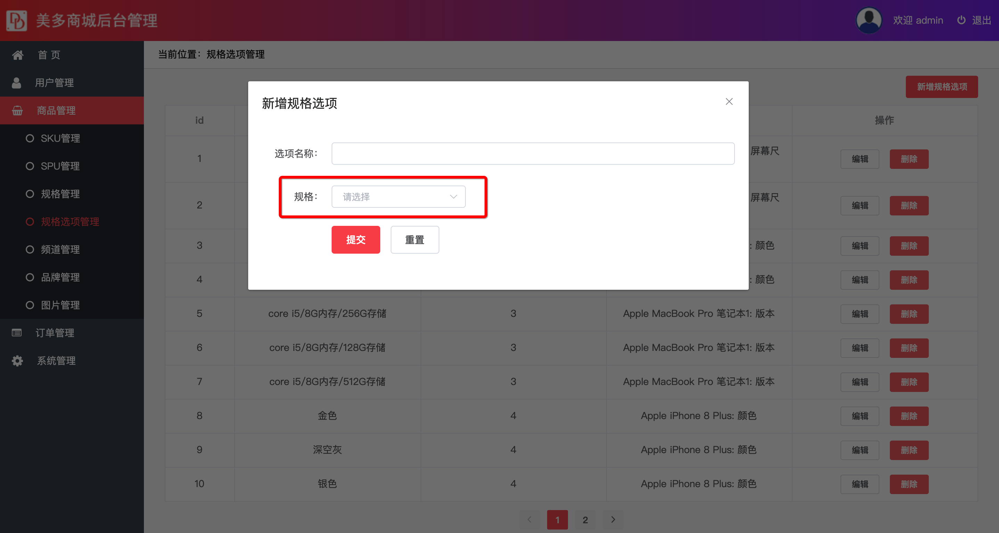

##  保存规格选项表数据

在保存数据之前我们需要先获取商品规格名称，在规格的下来菜单中展示规格数据



### 1、获取品牌信息

####接口分析

**请求方式**： GET  ` /meiduo_admin/goods/specs/simple/`

**请求参数**： 通过请求头传递jwt token数据。

**返回数据**：  JSON

```json
 [
        {
            "id": "规格id",
            "name": "规格名称"
        },
        ...
   ]
```

| 返回值 | 类型 | 是否必须 | 说明     |
| ------ | ---- | -------- | -------- |
| Id     | int  | 是       | 规格id   |
| name   | 数组 | 是       | 规格名称 |


### 后端实现

```python
class OptionSimple(ListAPIView):
	"""
		获取规格信息
	"""
    serializer_class = OptionSpecificationSerializer
    queryset = SPUSpecification.objects.all()


```

序列化器的定义

```python
class OptionSpecificationSerializer(serializers.ModelSerializer):
  """
  		规格序列化器
  """
    class Meta:
        model=SPUSpecification
        fields='__all__'
```


### 2、保存规格选项数据数据

#### 接口分析

**请求方式**：POST   `/meiduo_admin/specs/options/`

**请求参数**： 通过请求头传递jwt token数据。

| 参数    | 类型 | 是否必须 | 说明     |
| ------- | ---- | -------- | -------- |
| value   | str  | 是       | 选项名称 |
| spec_id | int  | 是       | 规格id   |

**返回数据**：  JSON

``` json
 {
        "id": "选项id",
        "value": "选项名称",
        "spec": "规格名称",
        "spec_id": "规格id"
    }
```

| 参数    | 类型 | 是否必须 | 说明     |
| ------- | ---- | -------- | -------- |
| id      | Int  | 是       | 规格id   |
| name    | Str  | 是       | 规格名称 |
| spec    | str  | 是       | 规格名称 |
| spec_id | Int  | 是       | 规格id   |

后端实现

``` python
# OptionsView继承的是ModelViewSet 所以保存逻辑还是使用同一个类视图
class OptionsView(ModelViewSet):
		"""
			规格选项表数据处理
		"""
    serializer_class =OptionSerialzier
    queryset = SpecificationOption.objects.all()
    pagination_class = PageNum

```

