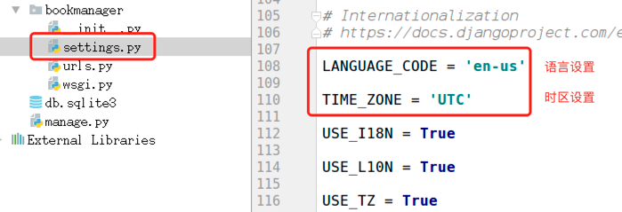
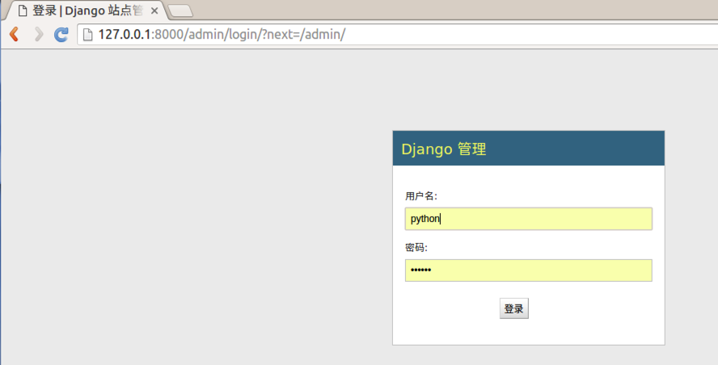
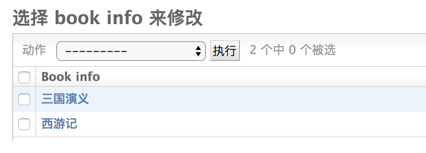
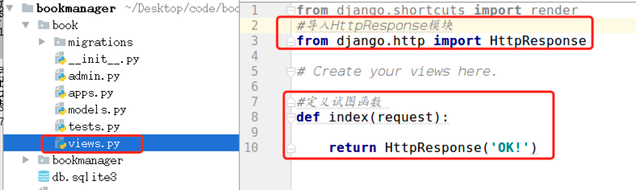
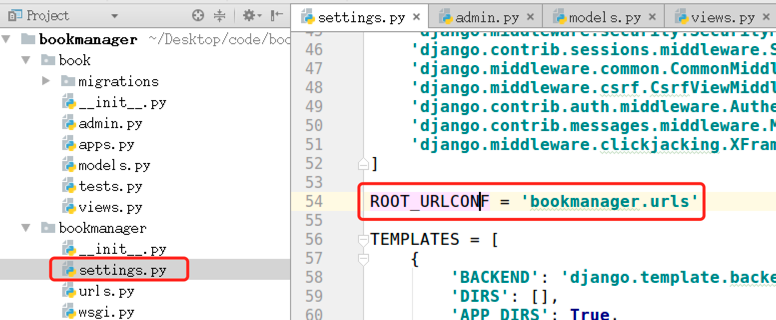
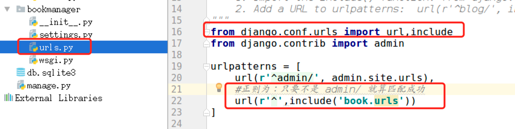
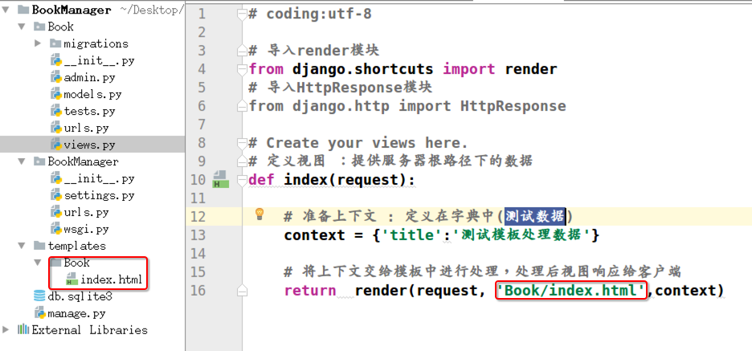
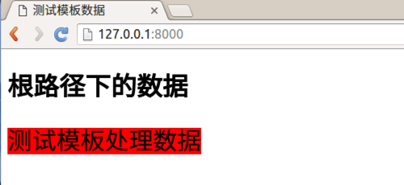

# Redis （边写边背，非只是汇总）

------

- 

- 绑定ip：如果需要远程访问，可将此⾏注释，或绑定⼀个真实ip

  > bind 127.0.0.1

- 端⼝，默认为6379

  > port 6379

redis 服务端命令 redis-server 

redis-server --help 查看帮助文档

ps aux | grep redis 查看redis服务进程

sudo kill -9 pid 杀死redis服务器

sudo redis-server /etc/redis/redis.conf 指定加载的配置文件

**客户端**

redis-cli 客户端命令

redis-cli --help 查看帮助文档

redis-cli 连接redis

ping  测试命令

select 0~16 切换数据库

redis的值类型分为5种 ： String、hash、list 、set 、 zset

keys pattern 参数支持正则表达式

keys *

key a*

exists key1  -》1 or 0

exists a1 

type key 

type a1 

del key1 key2 

del a2 a3

expire key seconds 指定过期时间

expire a1 3

ttl key 查看有效时间

ttl bb 

hset key field value 

- 设置单个属性

  > hset key field value

- 例1：设置键 `user`的属性`name`为`itheima`

  > hset user name itheima

- 设置多个属性

  > hmset key field1 value1 field2 value2 ...

- 例2：设置键`u2`的属性`name`为`itcast`、属性`age`为`11`

  > hmset u2 name itcast age 11

- 获取指定键所有的属性

  > hkeys key

- 例3：获取键u2的所有属性

  > hkeys u2

- 获取⼀个属性的值

  > hget key field

- 例4：获取键`u2`属性`name`的值

  > hget u2 name

- 获取多个属性的值

  > hmget key field1 field2 ...

- 例5：获取键`u2`属性`name`、`age`的值

  > hmget u2 name age

- 获取所有属性的值

  > hvals key

- 例6：获取键`u2`所有属性的值

  > hvals u2

## 删除

- **删除整个hash键及值，使⽤del命令**

- 删除属性，属性对应的值会被⼀起删除

  > hdel key field1 field2 ...

- 例7：删除键`u2`的属性`age`

  > hdel u2 age

# list类型

- 列表的元素类型为string
- 按照插⼊顺序排序

## 增加

- 在左侧插⼊数据

  > lpush key value1 value2 ...

- 例1：从键为`a1`的列表左侧加⼊数据`a 、 b 、c`

  > lpush a1 a b c

- 在右侧插⼊数据

  > rpush key value1 value2 ...

- 例2：从键为`a1`的列表右侧加⼊数据`0、1`

  > rpush a1 0 1

- 在指定元素的前或后插⼊新元素

  > linsert key before或after 现有元素 新元素

- 例3：在键为`a1`的列表中元素`b`前加⼊`3`

  > linsert a1 before b 3

## 获取

- 返回列表⾥指定范围内的元素

  - `start`、`stop`为元素的下标索引
  - 索引从左侧开始，第⼀个元素为0
  - 索引可以是负数，表示从尾部开始计数，如`-1`表示最后⼀个元素

  > lrange key start stop

- 例4：获取键为`a1`的列表所有元素

  > lrange a1 0 -1

## 设置指定索引位置的元素值

- 索引从左侧开始，第⼀个元素为0

- 索引可以是负数，表示尾部开始计数，如`-1`表示最后⼀个元素

  > lset key index value

- 例5：修改键为`a1`的列表中下标为`1`的元素值为`z`

  > lset a 1 z

## 删除

- 删除指定元素

  - 将列表中前`count`次出现的值为`value`的元素移除
  - count > 0: 从头往尾移除
  - count < 0: 从尾往头移除
  - count = 0: 移除所有

  > lrem key count value

- 例6.1：向列表`a2`中加⼊元素`a、b、a、b、a、b`

  > lpush a2 a b a b a b

- 例6.2：从`a2`列表右侧开始删除2个`b`

  > lrem a2 -2 b

- 例6.3：查看列表`a2`的所有元素

  > lrange a2 0 -1

## 增加

- 添加元素

  > sadd key member1 member2 ...

- 例1：向键`a3`的集合中添加元素`zhangsan`、`lisi`、`wangwu`

  > sadd a3 zhangsan sili wangwu

## 获取

- 返回所有的元素

  > smembers key

- 例2：获取键`a3`的集合中所有元素

  > smembers a3

## 删除

- 删除指定元素

  > srem key

- 例3：删除键`a3`的集合中元素`wangwu`

  > srem a3 wangwu

# zset类型

- sorted set，有序集合
- 元素为string类型
- 元素具有唯⼀性，不重复
- 每个元素都会关联⼀个double类型的score，表示权重，通过权重将元素从⼩到⼤排序
- 说明：没有修改操作

## 增加

- 添加

  > zadd key score1 member1 score2 member2 ...

- 例1：向键`a4`的集合中添加元素`lisi`、`wangwu`、`zhaoliu`、`zhangsan`，权重分别为`4、5、6、3`

  > zadd a4 4 lisi 5 wangwu 6 zhaoliu 3 zhangsan

## 获取

- 返回指定范围内的元素

- start、stop为元素的下标索引

- 索引从左侧开始，第⼀个元素为0

- 索引可以是负数，表示从尾部开始计数，如`-1`表示最后⼀个元素

  > zrange key start stop

- 例2：获取键`a4`的集合中所有元素

  > zrange a4 0 -1

- 返回`score`值在`min`和`max`之间的成员

  > zrangebyscore key min max

- 例3：获取键`a4`的集合中权限值在`5和6之间`的成员

  > zrangebyscore a4 5 6

- 返回成员`member`的`score`值

  > zscore key member

- 例4：获取键`a4`的集合中元素`zhangsan`的权重

  > zscore a4 zhangsan

## 删除

- 删除指定元素

  > zrem key member1 member2 ...

- 例5：删除集合`a4`中元素`zhangsan`

  > zrem a4 zhangsan

- 删除权重在指定范围的元素

  > zremrangebyscore key min max

- 例6：删除集合`a4`中权限在`5、6之间`的元素

  > zremrangebyscore a4 5 6


pip install redis

from redis import StrictRedis

# StrictRedis对象⽅法

- 通过init创建对象，指定参数host、port与指定的服务器和端⼝连接，host默认为localhost，port默认为6379，db默认为0

```
sr = StrictRedis(host='localhost', port=6379, db=0)

简写
sr=StrictRedis()
```

- 根据不同的类型，拥有不同的实例⽅法可以调⽤，与前⾯学的redis命令对应，⽅法需要的参数与命令的参数⼀致

## string

- set
- setex
- mset
- append
- get
- mget
- key

## keys

- exists
- type
- delete
- expire
- getrange
- ttl

## hash

- hset
- hmset
- hkeys
- hget
- hmget
- hvals
- hdel

## list

- lpush
- rpush
- linsert
- lrange
- lset
- lrem

## set

- sadd
- smembers
- srem

## zset

- zadd
- zrange
- zrangebyscore
- zscore
- zrem
- zremrangebyscore

```python
from redis import *
if __name__=="__main__":
    try:
        #创建StrictRedis对象，与redis服务器建⽴连接
        sr=StrictRedis()

    except Exception as e:
        print(e)
```

# string-增加

| strict | 英[strɪkt] | 美[strɪkt] |
| ------ | ---------- | ---------- |
|        |            |            |

| adj. | 严格的(指必须恪守); 严厉的; 恪守教规(或信条等)的; 严密的; |
| ---- | --------------------------------------------------------- |
|      |                                                           |

```python
from redis import *

if __name__ == "__main__":
    try:
        sr = StrictRedis()
		result = sr.set('name','itheima')
        print(result)
	except Exception as e:
        print(e)
    
 #String-修改
from redis import *

if __name__ == "__main__":
    try:
        sr =StrictRedis()
        result = sr.set('name','itcast')
        print(result)
     except Exception as e :
        print(e)
 #string-删除
from redis import *
if __name__=="__main__":
    try:
        #创建StrictRedis对象，与redis服务器建⽴连接
        sr=StrictRedis()
        #设置键name的值，如果键已经存在则进⾏修改，如果键不存在则进⾏添加
        result = sr.delete('name')
        #输出响应结果，如果删除成功则返回受影响的键数，否则则返回0
        print(result)
    except Exception as e:
        print(e)

获取键

from redis import *
if __name__=="__main__":
    try:
        #创建StrictRedis对象，与redis服务器建⽴连接
        sr=StrictRedis()
        #获取所有的键
        result=sr.keys()
        #输出响应结果，所有的键构成⼀个列表，如果没有键则返回空列表
        print(result)
    except Exception as e:
        print(e)


#####主从集群搭建


```


# Django框架

------


## 2. Web程序框架的意义

- 用于搭建Web应用程序
- 免去不同Web应用相同代码部分的重复编写，只需关心Web应用核心的业务逻辑实现

## 3. Web应用程序的本质

- 接收并解析HTTP请求，获取具体的请求信息
- 处理本次HTTP请求，即完成本次请求的业务逻辑处理
- 构造并返回处理结果——HTTP响应

## 4. Web框架学习方法

- 如何搭建工程程序
  - 工程的组建
  - 工程的配置
  - 路由定义
  - 视图函数定义
- 如何获取请求数据（操作request对象）
- 如何构造响应数据（构造response对象）
- 框架提供的其他功能组件的使用
  - 数据库
  - 模板
  - admin

**MTV**


- **创建Django项目和应用**
  - django-admin startproject name
  - python manager.py startapp name
- **视图和ULR**
  - 视图的请求和响应
  - URL的匹配路径

Django的**主要目的是简便、快速的开发数据库驱动的网站。**

对比Flask框架，Django原生提供了众多的功能组件，让开发更简便快速。

### 2）MVT模式

有一种程序设计模式叫**MVC**，其核心思想是**分工、解耦，让不同的代码块之间降低耦合，增强代码的可扩展性和可移植性，实现向后兼容**

#### MVC模式说明


- M全拼为Model，主要封装对数据库层的访问，对数据库中的数据进行增、删、改、查操作。
- V全拼为View，用于封装结果，生成页面展示的html内容。
- C全拼为Controller，用于接收请求，处理业务逻辑，与Model和View交互，返回结果。

#### Django的MVT


- M全拼为Model，与MVC中的M功能相同，负责和数据库交互，进行数据处理。
- V全拼为View，与MVC中的C功能相同，接收请求，进行业务处理，返回应答。
- T全拼为Template，与MVC中的V功能相同，负责封装构造要返回的html。

**注：差异就在于黑线黑箭头标识出来的部分**


```
sudo pip install django==1.11.11
```

```
sudo pip install virtualenv
sudo pip install virtualenvwrapper
```

## 步骤

- **创建Django项目**
  - django-admin startproject name
- **创建子应用**
  - python manager.py startapp name

```python

#1
django-admin startproject name
#2
python manager.py startapp name


#创建Django项目

django-admin startproject 工程名称

#工程目录说明
与项目同名的目录，此处为bookmanager。
settings.py是项目的整体配置文件。
urls.py是项目的URL配置文件。
wsgi.py是项目与WSGI兼容的Web服务器入口。
manage.py是项目管理文件，通过它管理项目。
#运行开发服务器
python manage.py runserver ip:端口
or：
python manage.py runserver

#创建子应用
cd XXX
python manage.py startapp book
#此时工程目录
admin.py文件跟网站的后台管理站点配置相关。
apps.py文件用于配置当前子应用的相关信息。
migrations目录用于存放数据库迁移历史文件。
models.py文件用户保存数据库模型类。
tests.py文件用于开发测试用例，编写单元测试。
views.py文件用于编写Web应用视图。


注册安装一个子应用的方法，即是将子应用的配置信息文件apps.py中的Config类添加到INSTALLED_APPS列表中。

例如，将刚创建的book子应用添加到工程中，可在INSTALLED_APPS列表中添加'book.apps.BookConfig'。


使用Django进行数据库开发的提示 ：
MVT设计模式中的Model, 专门负责和数据库交互.对应(models.py)
由于Model中内嵌了ORM框架, 所以不需要直接面向数据库编程.
而是定义模型类, 通过模型类和对象完成数据库表的增删改查.
ORM框架就是把数据库表的行与相应的对象建立关联, 互相转换.使得数据库的操作面向对象

使用Django进行数据库开发的步骤 ：
定义模型类
模型迁移
操作数据库
1. 定义模型类
根据书籍表结构设计模型类:
模型类：BookInfo
书籍名称字段：name
根据人物表结构设计模型类：
模型类：PeopleInfo
人物姓名字段：name
人物性别字段：gender
外键约束：book
外键要指定所属的模型类book = models.ForeignKey(BookInfo)
说明 :
书籍-人物的关系为一对多. 一本书中可以有多个英雄.
不需要定义主键字段, 在生成表时会自动添加, 并且值为自增长.
根据数据库表的设计

在models.py中定义模型类,继承自models.Model

from django.db import models

# Create your models here.
# 准备书籍列表信息的模型类
class BookInfo(models.Model):
    # 创建字段，字段类型...
    name = models.CharField(max_length=10)

# 准备人物列表信息的模型类
class PeopleInfo(models.Model):
    name = models.CharField(max_length=10)
    gender = models.BooleanField()
    # 外键约束：人物属于哪本书
    book = models.ForeignKey(BookInfo)
    
2. 模型迁移 （建表）
迁移由两步完成 :

生成迁移文件：根据模型类生成创建表的语句

python manage.py makemigrations
执行迁移：根据第一步生成的语句在数据库中创建表

python manage.py migrate
迁移前


迁移后


提示：默认采用sqlite3数据库来存储数据


```

# 站点管理

- **站点**: 分为`内容发布`和`公共访问`两部分

- **内容发布**的部分由网站的管理员负责查看、添加、修改、删除数据

- `Django`能够根据定义的模型类自动地生成管理模块

- 使用

  ```
  Django
  ```

  的管理模块, 需要按照如下步骤操作 :

  - 1.管理界面本地化
  - 2.创建管理员
  - 3.注册模型类
  - 4.发布内容到数据库

#### 1.管理界面本地化

- 本地化是将显示的语言、时间等使用本地的习惯，这里的本地化就是进行中国化.

- 中国大陆地区使用`简体中文`, 时区使用`亚洲/上海时区`, 注意这里不使用北京时区.

- 本地化前

- 

  

- 本地化后


#### 2.创建管理员

- 创建管理员的命令 :

  ```
    python manage.py createsuperuser
  ```

- 按提示输入用户名、邮箱、密码

  

- 重置密码

- ```
  python manager.py changepassword 用户名
  ```

- 登陆站点 :`http://127.0.0.1:8000/admin`

  - 需要服务器是启动状态

    

- 登陆站点成功

  - 站点界面中没有书籍和人物管理入口,因为没有注册模型类

    

#### 3.注册模型类

- 在`应用`的`admin.py`文件中注册模型类

  - 需要导入模型模块 :`from book.models import BookInfo,PeopleInfo`

    

- 注册模型后

  )

> **注册模型成功后, 就可以在站点管理界面方便快速的管理数据.**

#### 4.发布内容到数据库


- 发布内容后，优化模型类展示

- ```
  # 准备书籍列表信息的模型类
  class BookInfo(models.Model):
      # 创建字段，字段类型...
      name = models.CharField(max_length=10)
  
      def __str__(self):
          """将模型类以字符串的方式输出"""
          return self.name
  ```

  


# 视图和URL

- 站点管理页面做好了, 接下来就要做`公共访问`的页面了.

- 对于

  ```
  Django
  ```

  的设计框架

  ```
  MVT
  ```

  .

  - 用户在URL中请求的是视图.
  - 视图接收请求后进行处理.
  - 并将处理的结果返回给请求者.

- 使用视图时需要进行两步操作

  - 1.定义视图
  - 2.配置URLconf

#### 1. 定义视图

- 视图就是一个`Python`函数，被定义在`应用`的`views.py`中.
- 视图的第一个参数是`HttpRequest`类型的对象`reqeust`，包含了所有`请求信息`.
- 视图必须返回`HttpResponse对象`，包含返回给请求者的`响应信息`.
- 需要导入`HttpResponse`模块 :`from django.http import HttpResponse`
- 定义视图函数 : 响应字符串`OK!`给客户端




> **思考 : 如何才能让请求找到视图?**

#### 2. 配置URLconf

- 查找视图的过程 :

  - 1.请求者在浏览器地址栏中输入URL, 请求到网站.

  - 2.网站获取URL信息.

  - 3.然后与编写好的URLconf逐条匹配.

  - 4.如果匹配成功则调用对应的视图.

  - 5.如果所有的URLconf都没有匹配成功.则返回404错误.

    !

- `URLconf`入口

  

- 需要两步完成`URLconf`配置

  - 1.在`项目`中定义`URLconf`
  - 2.在`应用`中定义`URLconf`

- **在**`项目`**中定义**`URLconf`

  

- **在**`应用`**中定义**`URLconf`

  - 提示：一条`URLconf`包括URL规则、视图两部分

    - URL规则使用正则表达式定义.

    - 视图就是在`views.py`中定义的视图函数.

      

    - url匹配过程

    - 

#### 3. 测试：请求访问

- `http://127.0.0.1:8000/`

  

#### 4. 总结

视图处理过程如下图：


> 使用视图时需要进行两步操作，两步操作不分先后
>
> 1. 配置`URLconf`
> 2. 在`应用/views.py`中定义视图

# 总结View和URL匹配流程


# 模板

> 思考 : 网站如何向客户端返回一个漂亮的页面呢？

- 提示 :
  - 漂亮的页面需要`html`、`css`、`js`.
  - 可以把这一堆字段串全都写到视图中, 作为`HttpResponse()`的参数,响应给客户端.
- 问题 :
  - 视图部分代码臃肿, 耦合度高.
  - 这样定义的字符串是不会出任何效果和错误的.
  - 效果无法及时查看.有错也不容易及时发现.
- 设想 :
  - 是否可以有一个专门定义前端页面的地方, 效果可以及时展示,错误可以及时发现,并且可以降低模块间耦合度!
- 解决问题 :**模板**
  - `MVT`设计模式中的`T`,`Template`
- **在**`Django`**中, 将前端的内容定义在模板中, 然后再把模板交给视图调用, 各种漂亮、炫酷的效果就出现了.**

## 模板使用步骤

- 1.创建模板
- 2.设置模板查找路径
- 3.模板接收视图传入的数据
- 4.模板处理数据

#### 1.创建模板

- 在`应用`同级目录下创建模板文件夹`templates`. 文件夹名称固定写法.
- 在`templates`文件夹下, 创建`应用`同名文件夹. 例, `Book`
- 在`应用`同名文件夹下创建`网页模板`文件. 例 :`index.html`


#### 2.设置模板查找路径


#### 3.模板接收视图传入的数据



#### 4.模板处理数据


#### 5. 查看模板处理数据成果



# 总结View-Templates流程

v

# 展示书籍列表

## 需求


## 实现步骤

- 1.创建视图
- 2.创建模板
- 3.配置URLconf

#### 1.创建视图

- 查询数据库数据

- 构造上下文

- 传递上下文到模板

  ```
  # 定义视图：提供书籍列表信息
  def bookList(request):
      # 查询数据库书籍列表数据
      books = BookInfo.objects.all()
      # 构造上下文
      context = {'books':books}
      # 数据交给模板处理，处理完成后通过视图响应给客户端
      return render(request, 'Book/booklist.html', context)
  ```

#### 2.创建模板

- 读取上下文数据
- 构造网页html文档 : 书籍信息以列表样式展示

```
<!DOCTYPE html>
<html lang="en">
<head>
    <meta charset="UTF-8">
    <title>书籍列表信息</title>
</head>
<body>

<ul>

</ul>

</body>
</html>
```

#### 3.配置URLconf

- 进入`应用`中的`urls.py`文件

  ```
  from django.conf.urls import url
  from book.views import index,bookList
  
  urlpatterns = [
      url(r'^$',index),
      # 匹配书籍列表信息的URL,调用对应的bookList视图
      url(r'^booklist/$',bookList)
  ]
  ```

# 配置文件

## 1. BASE_DIR

```
BASE_DIR = os.path.dirname(os.path.dirname(os.path.abspath(__file__)))
```

当前工程的根目录，Django会依此来定位工程内的相关文件，我们也可以使用该参数来构造文件路径。

## 2. DEBUG

调试模式，创建工程后初始值为**True**，即默认工作在调试模式下。

作用：

- 修改代码文件，程序自动重启

- Django程序出现异常时，向前端显示详细的错误追踪信息，例如

  

- 而非调试模式下，仅返回Server Error (500)

**注意：部署线上运行的Django不要运行在调式模式下，记得修改DEBUG=False和ALLOW_HOSTS。**

## 3. 本地语言与时区

Django支持本地化处理，即显示语言与时区支持本地化。

本地化是将显示的语言、时间等使用本地的习惯，这里的本地化就是进行中国化，中国大陆地区使用**简体中文**，时区使用**亚洲/上海**时区，注意这里不使用北京时区表示。

初始化的工程默认语言和时区为英语和UTC标准时区

```
LANGUAGE_CODE = 'en-us'  # 语言
TIME_ZONE = 'UTC'  # 时区# 时区
```

将语言和时区修改为中国大陆信息

```
LANGUAGE_CODE = 'zh-Hans'
TIME_ZONE = 'Asia/Shanghai'
```

# 静态文件

项目中的CSS、图片、js都是静态文件。一般会将静态文件放到一个单独的目录中，以方便管理。在html页面中调用时，也需要指定静态文件的路径，Django中提供了一种解析的方式配置静态文件路径。静态文件可以放在项目根目录下，也可以放在应用的目录下，由于有些静态文件在项目中是通用的，所以推荐放在项目的根目录下，方便管理。

为了提供静态文件，需要配置两个参数：

- **STATICFILES_DIRS**存放查找静态文件的目录
- **STATIC_URL**访问静态文件的URL前缀

## 示例

1） 在项目根目录下创建static目录来保存静态文件。

2） 在bookmanager/settings.py中修改静态文件的两个参数为

```
STATIC_URL = '/static/'
STATICFILES_DIRS = [
    os.path.join(BASE_DIR, 'static'),
]
```

3）此时在static添加的任何静态文件都可以使用网址**/static/文件在static中的路径**来访问了。

例如，我们向static目录中添加一个index.html文件，在浏览器中就可以使用127.0.0.1:8000/static/index.html来访问。

或者我们在static目录中添加了一个子目录和文件book/detail.html，在浏览器中就可以使用127.0.0.1:8000/static/book/detail.html来访问。

# App应用配置

在每个应用目录中都包含了apps.py文件，用于保存该应用的相关信息。

在创建应用时，Django会向apps.py文件中写入一个该应用的配置类，如

```
from django.apps import AppConfig


class BookConfig(AppConfig):
    name = 'book'
```

我们将此类添加到工程settings.py中的INSTALLED_APPS列表中，表明注册安装具备此配置属性的应用。

- **AppConfig.name**属性表示这个配置类是加载到哪个应用的，每个配置类必须包含此属性，默认自动生成。

- **AppConfig.verbose_name**属性用于设置该应用的直观可读的名字，此名字在Django提供的Admin管理站点中会显示，如

  ```
  from django.apps import AppConfig
  
  class UsersConfig(AppConfig):
      name = 'book'
      verbose_name = '图书管理'
  ```

# 模型

## 重点

- **模型配置**
- **数据的增删改**
  - 增:`book = BookInfo() book.save()` 和`BookInfo.objects.create()`
  - 删:`book.delete()` 和`BookInfo.objects.get().delete()`
  - 改:`book.name='xxx' book.save()` 和 `BookInfo.objects.get().update(name=xxx)`
- **数据的查询**
  - 基础查询
  - F对象和Q对象
  - 关联查询
  - 查询集QuerySet

#### MVT图解


# 项目准备

1.创建项目

- ```
  django-admin startproject bookmanager
  ```

- 2.创建应用

  ```
  python manager.py startapp book
  ```

- 3.更换python解释器：按需选择

  ```
    # 进入指定虚拟环境
    which python
  
    # python2
    /home/python/.virtualenvs/py_django/bin/python
  
    # python3
    /home/python/.virtualenvs/py3_django/bin/python
  ```

- 4.安装应用

  ```
  INSTALLED_APPS = [
      'django.contrib.admin',
      'django.contrib.auth',
      'django.contrib.contenttypes',
      'django.contrib.sessions',
      'django.contrib.messages',
      'django.contrib.staticfiles',
      #添加子应用
      'book.apps.BookConfig'
  ]
  ```

- 5.本地化

  ```
  #设置中文
  LANGUAGE_CODE = 'zh-Hans'
  #亚洲上海时区
  TIME_ZONE = 'Asia/Shanghai'
  ```

- 6.模板路径

  - 在应用同级目录下,创建`templates`模板文件夹

    ```
    TEMPLATES = [
        {
            'BACKEND': 'django.template.backends.django.DjangoTemplates',
            'DIRS': [os.path.join(BASE_DIR,'templates')],
            'APP_DIRS': True,
            'OPTIONS': {
                'context_processors': [
                    'django.template.context_processors.debug',
                    'django.template.context_processors.request',
                    'django.contrib.auth.context_processors.auth',
                    'django.contrib.messages.context_processors.messages',
                ],
            },
        },
    ]
    ```

- 7.项目中匹配urls

  - 正则 : 路径只要不是`admin/`就算匹配成功。并包含到应用中的`urls.py`

    ```
    from django.conf.urls import url,include
    from django.contrib import admin
    
    urlpatterns = [
        url(r'^admin/', admin.site.urls),
        #正则为：只要不是 admin/ 就算匹配成功
        url(r'^',include('book.urls'))
    ]
    ```

- 8.应用中匹配`urls.py`

  - 应用中创建 `urls.py`

  - 正则 : 路径中包含`booklist/`，就调用视图中对应的`bookList`函数

    ```
    from django.conf.urls import url
    from book.views import bookList
    
    urlpatterns = [
    
        # 匹配书籍列表信息的URL,调用对应的bookList视图
        url(r'^booklist/$',bookList)
    ]
    ```

- 9.准备视图

  ```
  # 定义视图：提供书籍列表信息
  def bookList(request):
  
      return HttpResponse('OK!')
  ```

- 10.开启服务器, 测试项目

  ```
   # 进入项目文件中, 开启项目对应的服务器
   python manage.py runserver
  
   # 浏览器中输入网址
   http://127.0.0.1:8000/booklist/
  ```

# 配置

在settings.py中保存了数据库的连接配置信息，Django默认初始配置使用**sqlite**数据库。

```
DATABASES = {
    'default': {
        'ENGINE': 'django.db.backends.sqlite3',
        'NAME': os.path.join(BASE_DIR, 'db.sqlite3'),
    }
}
```

1. 使用**MySQL**数据库首先需要安装驱动程序

   ```
   pip install PyMySQL
   ```

2. 在Django的工程同名子目录的__init__.py文件中添加如下语句

   ```
   import pymysql
   
   pymysql.install_as_MySQLdb()
   ```

   作用是让Django的ORM能以mysqldb的方式来调用PyMySQL。

3. 修改**DATABASES**配置信息

   ```
   DATABASES = {
       'default': {
           'ENGINE': 'django.db.backends.mysql',
           'HOST': '127.0.0.1',  # 数据库主机
           'PORT': 3306,  # 数据库端口
           'USER': 'root',  # 数据库用户名
           'PASSWORD': 'mysql',  # 数据库用户密码
           'NAME': 'book'  # 数据库名字
       }
   }
   ```

4. 在MySQL中创建数据库

   ```
   create database book charset=utf8;
   ```

# 定义模型类

- 模型类被定义在"应用/models.py"文件中。
- 模型类必须继承自Model类，位于包django.db.models中。

接下来首先以"图书-人物"管理为例进行演示。

## 1 定义

在models.py 文件中定义模型类。

```
from django.db import models

# Create your models here.
# 准备书籍列表信息的模型类
class BookInfo(models.Model):
    # 创建字段，字段类型...
    name = models.CharField(max_length=20, verbose_name='名称')
    pub_date = models.DateField(verbose_name='发布日期',null=True)
    readcount = models.IntegerField(default=0, verbose_name='阅读量')
    commentcount = models.IntegerField(default=0, verbose_name='评论量')
    is_delete = models.BooleanField(default=False, verbose_name='逻辑删除')

    class Meta:
        db_table = 'bookinfo'  # 指明数据库表名
        verbose_name = '图书'  # 在admin站点中显示的名称

    def __str__(self):
        """定义每个数据对象的显示信息"""
        return self.name

# 准备人物列表信息的模型类
class PeopleInfo(models.Model):
    GENDER_CHOICES = (
        (0, 'male'),
        (1, 'female')
    )
    name = models.CharField(max_length=20, verbose_name='名称')
    gender = models.SmallIntegerField(choices=GENDER_CHOICES, default=0, verbose_name='性别')
    description = models.CharField(max_length=200, null=True, verbose_name='描述信息')
    book = models.ForeignKey(BookInfo, on_delete=models.CASCADE, verbose_name='图书')  # 外键
    is_delete = models.BooleanField(default=False, verbose_name='逻辑删除')

    class Meta:
        db_table = 'peopleinfo'
        verbose_name = '人物信息'

    def __str__(self):
        return self.name
```

**1） 数据库表名**

模型类如果未指明表名，Django默认以**小写app应用名_小写模型类名**为数据库表名。

可通过**db_table**指明数据库表名。

**2） 关于主键**

django会为表创建自动增长的主键列，每个模型只能有一个主键列，如果使用选项设置某属性为主键列后django不会再创建自动增长的主键列。

默认创建的主键列属性为id，可以使用pk代替，pk全拼为primary key。

**3） 属性命名限制**

- 不能是python的保留关键字。

- 不允许使用连续的下划线，这是由django的查询方式决定的。

- 定义属性时需要指定字段类型，通过字段类型的参数指定选项，语法如下：

  ```
  属性=models.字段类型(选项)
  ```

**4）字段类型**

| 类型             | 说明                                                         |
| :--------------- | :----------------------------------------------------------- |
| AutoField        | 自动增长的IntegerField，通常不用指定，不指定时Django会自动创建属性名为id的自动增长属性 |
| BooleanField     | 布尔字段，值为True或False                                    |
| NullBooleanField | 支持Null、True、False三种值                                  |
| CharField        | 字符串，参数max_length表示最大字符个数                       |
| TextField        | 大文本字段，一般超过4000个字符时使用                         |
| IntegerField     | 整数                                                         |
| DecimalField     | 十进制浮点数， 参数max_digits表示总位数， 参数decimal_places表示小数位数 |
| FloatField       | 浮点数                                                       |
| DateField        | 日期， 参数auto_now表示每次保存对象时，自动设置该字段为当前时间，用于"最后一次修改"的时间戳，它总是使用当前日期，默认为False； 参数auto_now_add表示当对象第一次被创建时自动设置当前时间，用于创建的时间戳，它总是使用当前日期，默认为False; 参数auto_now_add和auto_now是相互排斥的，组合将会发生错误 |
| TimeField        | 时间，参数同DateField                                        |
| DateTimeField    | 日期时间，参数同DateField                                    |
| FileField        | 上传文件字段                                                 |
| ImageField       | 继承于FileField，对上传的内容进行校验，确保是有效的图片      |

**5） 选项**

| 选项        | 说明                                                         |
| :---------- | :----------------------------------------------------------- |
| null        | 如果为True，表示允许为空，默认值是False                      |
| blank       | 如果为True，则该字段允许为空白，默认值是False                |
| db_column   | 字段的名称，如果未指定，则使用属性的名称                     |
| db_index    | 若值为True, 则在表中会为此字段创建索引，默认值是False        |
| default     | 默认                                                         |
| primary_key | 若为True，则该字段会成为模型的主键字段，默认值是False，一般作为AutoField的选项使用 |
| unique      | 如果为True, 这个字段在表中必须有唯一值，默认值是False        |

**null是数据库范畴的概念，blank是表单验证范畴的**

**6） 外键**

在设置外键时，需要通过**on_delete**选项指明主表删除数据时，对于外键引用表数据如何处理，在django.db.models中包含了可选常量：

- **CASCADE**级联，删除主表数据时连通一起删除外键表中数据
- **PROTECT**保护，通过抛出**ProtectedError**异常，来阻止删除主表中被外键应用的数据
- **SET_NULL**设置为NULL，仅在该字段null=True允许为null时可用
- **SET_DEFAULT**设置为默认值，仅在该字段设置了默认值时可用
- **SET()**设置为特定值或者调用特定方法
- **DO_NOTHING**不做任何操作，如果数据库前置指明级联性，此选项会抛出**IntegrityError**异常

## 2 迁移

将模型类同步到数据库中。

**1）生成迁移文件**

```
python manage.py makemigrations
```

**2）同步到数据库中**

```
python manage.py migrate
```

## 3 添加测试数据

```
insert into bookinfo(name, pub_date, readcount,commentcount, is_delete) values
('射雕英雄传', '1980-5-1', 12, 34, 0),
('天龙八部', '1986-7-24', 36, 40, 0),
('笑傲江湖', '1995-12-24', 20, 80, 0),
('雪山飞狐', '1987-11-11', 58, 24, 0);
insert into peopleinfo(name, gender, book_id, description, is_delete)  values
    ('郭靖', 1, 1, '降龙十八掌', 0),
    ('黄蓉', 0, 1, '打狗棍法', 0),
    ('黄药师', 1, 1, '弹指神通', 0),
    ('欧阳锋', 1, 1, '蛤蟆功', 0),
    ('梅超风', 0, 1, '九阴白骨爪', 0),
    ('乔峰', 1, 2, '降龙十八掌', 0),
    ('段誉', 1, 2, '六脉神剑', 0),
    ('虚竹', 1, 2, '天山六阳掌', 0),
    ('王语嫣', 0, 2, '神仙姐姐', 0),
    ('令狐冲', 1, 3, '独孤九剑', 0),
    ('任盈盈', 0, 3, '弹琴', 0),
    ('岳不群', 1, 3, '华山剑法', 0),
    ('东方不败', 0, 3, '葵花宝典', 0),
    ('胡斐', 1, 4, '胡家刀法', 0),
    ('苗若兰', 0, 4, '黄衣', 0),
    ('程灵素', 0, 4, '医术', 0),
    ('袁紫衣', 0, 4, '六合拳', 0);
```


## shell工具和查看MySQL数据库日志

## 1 shell工具

Django的manage工具提供了**shell**命令，帮助我们配置好当前工程的运行环境（如连接好数据库等），以便可以直接在终端中执行测试python语句。

通过如下命令进入shell

```
python manage.py shell
```

导入两个模型类，以便后续使用

```
from book.models import BookInfo,PeopleInfo
```

## 2 查看MySQL数据库日志

查看mysql数据库日志可以查看对数据库的操作记录。 mysql日志文件默认没有产生，需要做如下配置：

```
sudo vi /etc/mysql/mysql.conf.d/mysqld.cnf
```


把68，69行前面的#去除，然后保存并使用如下命令重启mysql服务。

```
sudo service mysql restart
```

使用如下命令打开mysql日志文件。

```
tail -f /var/log/mysql/mysql.log  # 可以实时查看数据库的日志内容
# 如提示需要sudo权限，执行
# sudo tail -f /var/log/mysql/mysql.log
```

# 数据库操作-增、删、改

## 1 增加

增加数据有两种方法。

**1）save**

通过创建模型类对象，执行对象的save()方法保存到数据库中。

```
>>> from book.models import BookInfo,PeopleInfo
>>> book = BookInfo(
...         name='python入门',
...         pub_date='2010-1-1'
...     )
>>> book.save()
>>> book
<BookInfo: python入门>
```


**2）create**

通过模型类.objects.create()保存。

```
>>> PeopleInfo.objects.create(
...         name='itheima',
...         book=book
...     )
<PeopleInfo: itheima>
```

## 2 修改

修改更新有两种方法

**1）save**

**修改模型类对象的属性，然后执行save()方法**

```
>>> person = PeopleInfo.objects.get(name='itheima')
>>> person.name = 'itcast'
>>> person.save()
>>> person
<PeopleInfo: itcast>
```

**2）update**

**使用模型类.objects.filter().update()**，会返回受影响的行数

```
>>> PeopleInfo.objects.filter(name='itcast').update(name='传智播客')
1
```


## 3 删除

删除有两种方法

**1）模型类对象delete**

```
>>> person = PeopleInfo.objects.get(name='传智播客')
>>> person.delete()
(1, {'book.PeopleInfo': 1})
```

**2）模型类.objects.filter().delete()**

```
>>> BookInfo.objects.filter(name='python入门').delete()
(1, {'book.BookInfo': 1, 'book.PeopleInfo': 0})
```

# 基础条件查询

### 1 基本查询

**get**查询单一结果，如果不存在会抛出**模型类.DoesNotExist**异常。

**all**查询多个结果。

**count**查询结果数量。

```
>>> BookInfo.objects.get(id=1)
<BookInfo: 射雕英雄传>

>>> BookInfo.objects.get(pk=2)
<BookInfo: 天龙八部>

>>> BookInfo.objects.get(pk=20)
Traceback (most recent call last):
  File "<console>", line 1, in <module>
  File "/home/python/.virtualenvs/py3_django_1.11/lib/python3.5/site-packages/django/db/models/manager.py", line 85, in manager_method
    return getattr(self.get_queryset(), name)(*args, **kwargs)
  File "/home/python/.virtualenvs/py3_django_1.11/lib/python3.5/site-packages/django/db/models/query.py", line 380, in get
    self.model._meta.object_name
book.models.DoesNotExist: BookInfo matching query does not exist.


>>> BookInfo.objects.all()
<QuerySet [<BookInfo: 射雕英雄传>, <BookInfo: 天龙八部>, <BookInfo: 笑傲江湖>, <BookInfo: 雪山飞狐>]>

>>> BookInfo.objects.count()
4
```

### 2 过滤查询

实现SQL中的where功能，包括

- **filter**过滤出多个结果
- **exclude**排除掉符合条件剩下的结果
- **get**过滤单一结果

对于过滤条件的使用，上述三个方法相同，故仅以**filter**进行讲解。

过滤条件的表达语法如下：

```
属性名称__比较运算符=值

# 属性名称和比较运算符间使用两个下划线，所以属性名不能包括多个下划线
查询编号为1的图书
查询书名包含'湖'的图书
查询书名以'部'结尾的图书
查询书名为空的图书
查询编号为1或3或5的图书
查询编号大于3的图书
查询1980年发表的图书
查询1990年1月1日后发表的图书
```

**1）相等**

**exact：表示判等。**

例：查询编号为1的图书。

```
BookInfo.objects.filter(id__exact=1)
可简写为：
BookInfo.objects.filter(id=1)
```

**2）模糊查询**

**contains：是否包含。**

> 说明：如果要包含%无需转义，直接写即可。

例：查询书名包含'传'的图书。

```
BookInfo.objects.filter(name__contains='传')
<QuerySet [<BookInfo: 射雕英雄传>]>
```

**startswith、endswith：以指定值开头或结尾。**

例：查询书名以'部'结尾的图书

```
>>> BookInfo.objects.filter(name__endswith='部')
<QuerySet [<BookInfo: 天龙八部>]>
```

> 以上运算符都区分大小写，在这些运算符前加上i表示不区分大小写，如iexact、icontains、istartswith、iendswith.

**3） 空查询**

**isnull：是否为null。**

例：查询书名为空的图书。

```
>>> BookInfo.objects.filter(name__isnull=True)
<QuerySet []>
```

**4） 范围查询**

**in：是否包含在范围内。**

例：查询编号为1或3或5的图书

```
>>> BookInfo.objects.filter(id__in=[1,3，5])
<QuerySet [<BookInfo: 射雕英雄传>, <BookInfo: 笑傲江湖>]>
```

**5）比较查询**

- **gt**大于 (greater then)
- **gte**大于等于 (greater then equal)
- **lt**小于 (less then)
- **lte**小于等于 (less then equal)

例：查询编号大于3的图书

```
BookInfo.objects.filter(id__gt=3)
```

**不等于的运算符，使用exclude()过滤器。**

例：查询编号不等于3的图书

```
>>> BookInfo.objects.filter(id__gt=3)
<QuerySet [<BookInfo: 雪山飞狐>]>
```

**6）日期查询**

**year、month、day、week_day、hour、minute、second：对日期时间类型的属性进行运算。**

例：查询1980年发表的图书。

```
>>> BookInfo.objects.filter(pub_date__year=1980)
<QuerySet [<BookInfo: 射雕英雄传>]>
```

例：查询1990年1月1日后发表的图书。

```
>>> BookInfo.objects.filter(pub_date__gt='1990-1-1')
<QuerySet [<BookInfo: 笑傲江湖>]>
```

# F和Q对象

#### F对象

之前的查询都是对象的属性与常量值比较，两个属性怎么比较呢？ 答：使用F对象，被定义在django.db.models中。

语法如下：

```
F(属性名)
```

例：查询阅读量大于等于评论量的图书。

```
>>> from django.db.models import F
>>> BookInfo.objects.filter(readcount__gt=F('commentcount'))
<QuerySet [<BookInfo: 雪山飞狐>]>
```

可以在F对象上使用算数运算。

例：查询阅读量大于2倍评论量的图书。

```
>>> BookInfo.objects.filter(readcount__gt=F('commentcount')*2)
<QuerySet [<BookInfo: 雪山飞狐>]>
```

#### Q对象

**多个过滤器逐个调用表示逻辑与关系，同sql语句中where部分的and关键字。**

例：查询阅读量大于20，并且编号小于3的图书。

```
>>> BookInfo.objects.filter(readcount__gt=20,id__lt=3)
<QuerySet [<BookInfo: 天龙八部>]>

或者

>>> BookInfo.objects.filter(readcount__gt=20).filter(id__lt=3)
<QuerySet [<BookInfo: 天龙八部>]>
```

**如果需要实现逻辑或or的查询，需要使用Q()对象结合|运算符**，Q对象被义在django.db.models中。

语法如下：

```
Q(属性名__运算符=值)
```

例：查询阅读量大于20的图书，改写为Q对象如下。

```
BookInfo.objects.filter(Q(readcount__gt=20))
```

Q对象可以使用&、|连接，&表示逻辑与，|表示逻辑或。

例：查询阅读量大于20，或编号小于3的图书，只能使用Q对象实现

```
>>> BookInfo.objects.filter(Q(readcount__gt=20)|Q(id__lt=3))
<QuerySet [<BookInfo: 射雕英雄传>, <BookInfo: 天龙八部>, <BookInfo: 雪山飞狐>]>
```

Q对象前可以使用~操作符，表示非not。

例：查询编号不等于3的图书。

```
>>> BookInfo.objects.filter(~Q(id=3))
<QuerySet [<BookInfo: 射雕英雄传>, <BookInfo: 天龙八部>, <BookInfo: 雪山飞狐>]>
```

# 聚合函数和排序函数

### 1. 聚合函数

使用aggregate()过滤器调用聚合函数。聚合函数包括：**Avg**平均，**Count**数量，**Max**最大，**Min**最小，**Sum**求和，被定义在django.db.models中。

例：查询图书的总阅读量。

```
>>> from django.db.models import Sum
>>> BookInfo.objects.aggregate(Sum('readcount'))
{'readcount__sum': 126}
```

注意aggregate的返回值是一个字典类型，格式如下：

```
  {'属性名__聚合类小写':值}

  如:{'readcount__sum': 126}
```

使用count时一般不使用aggregate()过滤器。

例：查询图书总数。

```
BookInfo.objects.count()
```

注意count函数的返回值是一个数字。

### 2. 排序

使用**order_by**对结果进行排序

```
# 默认升序
>>> BookInfo.objects.all().order_by('readcount')
<QuerySet [<BookInfo: 射雕英雄传>, <BookInfo: 笑傲江湖>, <BookInfo: 天龙八部>, <BookInfo: 雪山飞狐>]>


# 降序
>>> BookInfo.objects.all().order_by('-readcount')
<QuerySet [<BookInfo: 雪山飞狐>, <BookInfo: 天龙八部>, <BookInfo: 笑傲江湖>, <BookInfo: 射雕英雄传>]>
```

# 关联查询

```
查询书籍为1的所有人物信息
查询人物为1的书籍信息
```

由一到多的访问语法：

一对应的模型类对象.多对应的模型类名小写_set 例：

```
>>> book = BookInfo.objects.get(id=1)
>>> book.peopleinfo_set.all()
<QuerySet [<PeopleInfo: 郭靖>, <PeopleInfo: 黄蓉>, <PeopleInfo: 黄药师>, <PeopleInfo: 欧阳锋>, <PeopleInfo: 梅超风>]>
```

由多到一的访问语法:

多对应的模型类对象.多对应的模型类中的关系类属性名 例：

```
person = PeopleInfo.objects.get(id=1)
person.book
<BookInfo: 射雕英雄传>
```

访问一对应的模型类关联对象的id语法:

多对应的模型类对象.关联类属性_id

例：

```
>>> person = PeopleInfo.objects.get(id=1)
>>> person.book_id
1
```

#### 关联过滤查询

**由多模型类条件查询一模型类数据**:

语法如下：

```
关联模型类名小写__属性名__条件运算符=值
```

> **注意：如果没有"__运算符"部分，表示等于。**

```
查询图书，要求图书人物为"郭靖"
查询图书，要求图书中人物的描述包含"八"
```

例：

查询图书，要求图书人物为"郭靖"

```
>>> book = BookInfo.objects.filter(peopleinfo__name='郭靖')
>>> book
<QuerySet [<BookInfo: 射雕英雄传>]>
```

查询图书，要求图书中人物的描述包含"八"

```
>>> book = BookInfo.objects.filter(peopleinfo__description__contains='八')
>>> book
<QuerySet [<BookInfo: 射雕英雄传>, <BookInfo: 天龙八部>]>
```

**由一模型类条件查询多模型类数据**:

语法如下：

```
一模型类关联属性名__一模型类属性名__条件运算符=值
```

> **注意：如果没有"__运算符"部分，表示等于。**

```
查询书名为“天龙八部”的所有人物
查询图书阅读量大于30的所有人物
```

例：

查询书名为“天龙八部”的所有人物。

```
>>> people = PeopleInfo.objects.filter(book__name='天龙八部')
>>> people
<QuerySet [<PeopleInfo: 乔峰>, <PeopleInfo: 段誉>, <PeopleInfo: 虚竹>, <PeopleInfo: 王语嫣>]>
```

查询图书阅读量大于30的所有人物

```
>>> people = PeopleInfo.objects.filter(book__readcount__gt=30)
>>> people
<QuerySet [<PeopleInfo: 乔峰>, <PeopleInfo: 段誉>, <PeopleInfo: 虚竹>, <PeopleInfo: 王语嫣>, <PeopleIn
```

# 查询集QuerySet

## 1 概念

Django的ORM中存在查询集的概念。

查询集，也称查询结果集、QuerySet，表示从数据库中获取的对象集合。

当调用如下过滤器方法时，Django会返回查询集（而不是简单的列表）：

- all()：返回所有数据。
- filter()：返回满足条件的数据。
- exclude()：返回满足条件之外的数据。
- order_by()：对结果进行排序。

对查询集可以再次调用过滤器进行过滤，如

```
>>> books = BookInfo.objects.filter(readcount__gt=30).order_by('pub_date')
>>> books
<QuerySet [<BookInfo: 天龙八部>, <BookInfo: 雪山飞狐>]>
```

也就意味着查询集可以含有零个、一个或多个过滤器。过滤器基于所给的参数限制查询的结果。

**从SQL的角度讲，查询集与select语句等价，过滤器像where、limit、order by子句。**

**判断某一个查询集中是否有数据**：

- exists()：判断查询集中是否有数据，如果有则返回True，没有则返回False。

## 2 两大特性

#### 1）惰性执行

创建查询集不会访问数据库，直到调用数据时，才会访问数据库，调用数据的情况包括迭代、序列化、与if合用

例如，当执行如下语句时，并未进行数据库查询，只是创建了一个查询集books

```
books = BookInfo.objects.all()
```

继续执行遍历迭代操作后，才真正的进行了数据库的查询

```
for book in books:
    print(book.name)
```

#### 2）缓存

使用同一个查询集，第一次使用时会发生数据库的查询，然后Django会把结果缓存下来，再次使用这个查询集时会使用缓存的数据，减少了数据库的查询次数。

**情况一**：如下是两个查询集，无法重用缓存，每次查询都会与数据库进行一次交互，增加了数据库的负载。

```
from book.models import BookInfo

 [book.id for book in BookInfo.objects.all()]

 [book.id for book in BookInfo.objects.all()]
```


**情况二**：经过存储后，可以重用查询集，第二次使用缓存中的数据。

```
books=BookInfo.objects.all()

[book.id for book in books]

[book.id for book in books]
```


## 3 限制查询集

可以对查询集进行取下标或切片操作，等同于sql中的limit和offset子句。

> 注意：不支持负数索引。

**对查询集进行切片后返回一个新的查询集，不会立即执行查询。**

如果获取一个对象，直接使用[0]，等同于[0:1].get()，但是如果没有数据，[0]引发IndexError异常，[0:1].get()如果没有数据引发DoesNotExist异常。

示例：获取第1、2项，运行查看。

```
>>> books = BookInfo.objects.all()[0:2]
>>> books
<QuerySet [<BookInfo: 射雕英雄传>, <BookInfo: 天龙八部>]>
```

## 4.分页

[文档](https://docs.djangoproject.com/en/1.11/topics/pagination/)

```
#查询数据
books = BookInfo.objects.all()
#导入分页类
from django.core.paginator import Paginator
#创建分页实例
paginator=Paginator(books,2)
#获取指定页码的数据
page_skus = paginator.page(1)
#获取分页数据
total_page=paginator.num_pages
```

# 视图

------


## 重点

- HttpRequest
  - 位置参数和关键字参数
  - 查询字符串
  - 请求体:表单数据,JSON数据
  - 请求头
- **HttpResponse**
  - HttpResponse
  - JsonResponse
  - redirect
- **类视图**
  - 类视图的定义和使用
  - 类视图装饰器(难点)
