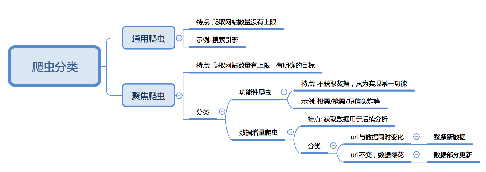

## 爬虫概述

##### 知识点：

- 了解 爬虫的概念

- 了解 爬虫的作用

- 了解 爬虫的分类

- 掌握 爬虫的流程

----

### 1. 爬虫的概念

> **模拟浏览器，发送请求，获取响应**

网络爬虫（又被称为网页蜘蛛，网络机器人）就是模拟客户端(主要指浏览器)发送网络请求，接收请求响应，一种按照一定的规则，自动地抓取互联网信息的程序。

- 原则上,只要是客户端(浏览器)能做的事情，爬虫都能够做
- 爬虫也只能获取客户端(浏览器)所展示出来的数据

----

##### 知识点：了解 爬虫的概念

----

### 2. 爬虫的作用

> 爬虫在互联网世界中有很多的作用，比如：

1. [数据采集](https://www.lagou.com/jobs/list_Python%20%E7%88%AC%E8%99%AB?labelWords=&fromSearch=true&suginput=)

   1. [抓取微博评论](https://weibo.com/)(机器学习舆情监控)
   2. [抓取招聘网站的招聘信息](<https://www.lagou.com/jobs/list_python%E7%88%AC%E8%99%AB?px=default&city=%E5%8C%97%E4%BA%AC#filterBox>)(数据分析、挖掘)
   3. [新浪滚动新闻](https://news.sina.com.cn/roll/#pageid=153&lid=2509&k=&num=50&page=1)
   4. [百度新闻网站](http://news.baidu.com/)

2. [软件测试](https://www.lagou.com/jobs/list_%E8%87%AA%E5%8A%A8%E5%8C%96%E6%B5%8B%E8%AF%95?city=%E5%8C%97%E4%BA%AC&cl=false&fromSearch=true&labelWords=&suginput=)
   1. [爬虫之自动化测试](https://blog.csdn.net/ZTZY520/article/details/53940127)
   2. [虫师](https://www.cnblogs.com/fnng/)

3. [12306抢票](http://www.12306.cn/mormhweb/)

4. 网站上的投票

   1. [投票网](https://www.toutoupiao.com/)

5. 网络安全

   1. [短信轰炸](https://www.sohu.com/a/232477043_99936149)

      1. [注册页面1](https://hwid1.vmall.com/CAS/portal/userRegister/regbyphone.html?reqClientType=1&loginChannel=1000002&countryCode=cn&loginUrl=https%3A%2F%2Fhwid1.vmall.com%2FCAS%2Fportal%2FcloudLogin.html&service=https%3A%2F%2Fwww.hicloud.com%3A443%2Fothers%2Flogin.action&lang=zh-cn&themeName=red)
      2. [注册页面2](https://bcy.net/register)
      3. [注册页面3](http://member.chinaacc.com/member/register.shtm)

   2. [web漏洞扫描](https://paper.seebug.org/537/)

------

##### 知识点：了解 爬虫的作用

------

### 3. 爬虫的分类

#### 3.1 根据被爬取网站的数量不同，可以分为：

- 通用爬虫，如 搜索引擎
- 聚焦爬虫，如12306抢票，或专门抓取某一个（某一类）网站数据

#### 3.2 根据是否以获取数据为目的，可以分为：

- 功能性爬虫，给你喜欢的明星投票、点赞
- 数据增量爬虫，比如招聘信息

#### 3.3 根据url地址和对应的页面内容是否改变，数据增量爬虫可以分为：

- 基于url地址变化、内容也随之变化的数据增量爬虫

- url地址不变、内容变化的数据增量爬虫

  

------

##### 知识点：了解 爬虫的分类

------

### 4. 爬虫的流程

> 爬虫的基本流程如图所示

1. 获取一个url
2. 向url发送请求，并获取响应（需要http协议）
3. 如果从响应中提取url，则继续发送请求获取响应
4. 如果从响应中提取数据，则将数据进行保存

----

##### 知识点：掌握 爬虫的流程

----
