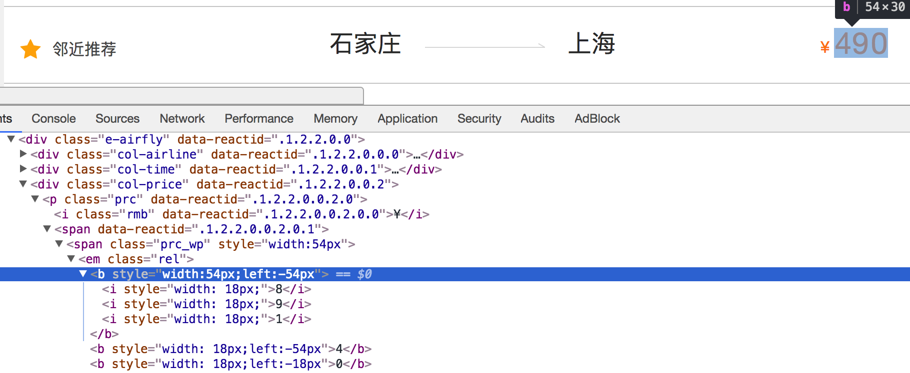

## 常见的反爬手段和解决思路

##### 学习目标
1. 了解 服务器反爬的原因
2. 了解 服务器常反什么样的爬虫
3. 了解 反爬虫领域常见的一些概念
4. 了解 反爬的三个方向
5. 了解 常见基于身份识别进行反爬
6. 了解 常见基于爬虫行为进行反爬
7. 了解 常见基于数据加密进行反爬

-----

### 1 服务器反爬的原因
- 爬虫占总PV(PV是指页面的访问次数，每打开或刷新一次页面，就算做一个pv)比例较高，这样浪费钱（尤其是三月份爬虫）。

    三月份爬虫是个什么概念呢？每年的三月份我们会迎接一次爬虫高峰期，有大量的硕士在写论文的时候会选择爬取一些往网站，并进行舆情分析。因为五月份交论文，所以嘛，大家都是读过书的，你们懂的，前期各种DotA，LOL，到了三月份了，来不及了，赶紧抓数据，四月份分析一下，五月份交论文，就是这么个节奏。

- 公司可免费查询的资源被批量抓走，丧失竞争力，这样少赚钱。

    数据可以在非登录状态下直接被查询。如果强制登陆，那么可以通过封杀账号的方式让对方付出代价，这也是很多网站的做法。但是不强制对方登录。那么如果没有反爬虫，对方就可以批量复制的信息，公司竞争力就会大大减少。竞争对手可以抓到数据，时间长了用户就会知道，只需要去竞争对手那里就可以了，没必要来我们网站，这对我们是不利的。

- 状告爬虫成功的几率小

    爬虫在国内还是个擦边球，就是有可能可以起诉成功，也可能完全无效。所以还是需要用技术手段来做最后的保障。

### 2 服务器常反什么样的爬虫

- 十分低级的应届毕业生

    应届毕业生的爬虫通常简单粗暴，根本不管服务器压力，加上人数不可预测，很容易把站点弄挂。

- 十分低级的创业小公司

    现在的创业公司越来越多，也不知道是被谁忽悠的然后大家创业了发现不知道干什么好，觉得大数据比较热，就开始做大数据。分析程序全写差不多了，发现自己手头没有数据。怎么办？写爬虫爬啊。于是就有了不计其数的小爬虫，出于公司生死存亡的考虑，不断爬取数据。

- 不小心写错了没人去停止的失控小爬虫

    有些网站已经做了相应的反爬，但是爬虫依然孜孜不倦地爬取。什么意思呢？就是说，他们根本爬不到任何数据，除了httpcode是200以外，一切都是不对的，可是爬虫依然不停止这个很可能就是一些托管在某些服务器上的小爬虫，已经无人认领了，依然在辛勤地工作着。

- 成型的商业对手

    这个是最大的对手，他们有技术，有钱，要什么有什么，如果和你死磕，你就只能硬着头皮和他死磕。

- 抽风的搜索引擎

    大家不要以为搜索引擎都是好人，他们也有抽风的时候，而且一抽风就会导致服务器性能下降，请求量跟网络攻击没什么区别。

### 3 反爬虫领域常见的一些概念
因为反爬虫暂时是个较新的领域，因此有些定义要自己下：

- 爬虫：使用任何技术手段，批量获取网站信息的一种方式。关键在于批量。

- 反爬虫：使用任何技术手段，阻止别人批量获取自己网站信息的一种方式。关键也在于批量。

- 误伤：在反爬虫的过程中，错误的将普通用户识别为爬虫。误伤率高的反爬虫策略，效果再好也不能用。

- 拦截：成功地阻止爬虫访问。这里会有拦截率的概念。通常来说，拦截率越高的反爬虫策略，误伤的可能性就越高。因此需要做个权衡。

- 资源：机器成本与人力成本的总和。

这里要切记，人力成本也是资源，而且比机器更重要。因为，根据摩尔定律，机器越来越便宜。而根据IT行业的发展趋势，程序员工资越来越贵。因此，通常服务器反爬就是让爬虫工程师加班才是王道，机器成本并不是特别值钱。

### 4 反爬的三个方向

- 基于身份识别进行反爬
    
- 基于爬虫行为进行反爬

- 基于数据加密进行反爬

### 5 常见基于身份识别进行反爬

#### 1 通过headers字段来反爬
> headers中有很多字段，这些字段都有可能会被对方服务器拿过来进行判断是否为爬虫

1.1 通过headers中的User-Agent字段来反爬
- 反爬原理：爬虫默认情况下没有User-Agent，而是使用模块默认设置
- 解决方法：请求之前添加User-Agent即可；更好的方式是使用User-Agent池来解决（收集一堆User-Agent的方式，或者是随机生成User-Agent）

1.2 通过referer字段或者是其他字段来反爬
- 反爬原理：爬虫默认情况下不会带上referer字段，服务器端通过判断请求发起的源头，以此判断请求是否合法
- 解决方法：添加referer字段

1.3 通过cookie来反爬
- 反爬原因：通过检查cookies来查看发起请求的用户是否具备相应权限，以此来进行反爬
- 解决方案：进行模拟登陆，成功获取cookies之后在进行数据爬取

#### 2 通过请求参数来反爬
> 请求参数的获取方法有很多，向服务器发送请求，很多时候需要携带请求参数，通常服务器端可以通过检查请求参数是否正确来判断是否为爬虫

2.1 通过从html静态文件中获取请求数据(github登录数据)
- 反爬原因：通过增加获取请求参数的难度进行反爬
- 解决方案：仔细分析抓包得到的每一个包，搞清楚请求之间的联系

2.2 通过发送请求获取请求数据
- 反爬原因：通过增加获取请求参数的难度进行反爬
- 解决方案：仔细分析抓包得到的每一个包，搞清楚请求之间的联系，搞清楚请求参数的来源

2.3 通过js生成请求参数
- 反爬原理：js生成了请求参数
- 解决方法：分析js，观察加密的实现过程，通过js2py获取js的执行结果，或者使用selenium来实现

2.4 通过验证码来反爬
- 反爬原理：对方服务器通过弹出验证码强制验证用户浏览行为
- 解决方法：打码平台或者是机器学习的方法识别验证码，其中打码平台廉价易用，更值得推荐

### 6 常见基于爬虫行为进行反爬

#### 1 基于请求频率或总请求数量
> 爬虫的行为与普通用户有着明显的区别，爬虫的请求频率与请求次数要远高于普通用户

1.1 通过请求ip/账号单位时间内总请求数量进行反爬
- 反爬原理：正常浏览器请求网站，速度不会太快，同一个ip/账号大量请求了对方服务器，有更大的可能性会被识别为爬虫
- 解决方法：对应的通过购买高质量的ip的方式能够解决问题/购买个多账号

1.2 通过同一ip/账号请求之间的间隔进行反爬
- 反爬原理：正常人操作浏览器浏览网站，请求之间的时间间隔是随机的，而爬虫前后两个请求之间时间间隔通常比较固定同时时间间隔较短，因此可以用来做反爬
- 解决方法：请求之间进行随机等待，模拟真实用户操作，在添加时间间隔后，为了能够高速获取数据，尽量使用代理池，如果是账号，则将账号请求之间设置随机休眠

1.3 通过对请求ip/账号每天请求次数设置阈值进行反爬
- 反爬原理：正常的浏览行为，其一天的请求次数是有限的，通常超过某一个值，服务器就会拒绝响应
- 解决方法：对应的通过购买高质量的ip的方法/多账号，同时设置请求间随机休眠

#### 2 根据爬取行为进行反爬，通常在爬取步骤上做分析

2.1 通过js实现跳转来反爬
- 反爬原理：js实现页面跳转，无法在源码中获取下一页url
- 解决方法: 多次抓包获取条状url，分析规律

2.2 通过蜜罐(陷阱)获取爬虫ip(或者代理ip)，进行反爬
- 反爬原理：在爬虫获取链接进行请求的过程中，爬虫会根据正则，xpath，css等方式进行后续链接的提取，此时服务器端可以设置一个陷阱url，会被提取规则获取，但是正常用户无法获取，这样就能有效的区分爬虫和正常用户
- 解决方法: 完成爬虫的编写之后，使用代理批量爬取测试/仔细分析响应内容结构，找出页面中存在的陷阱

2.3 通过假数据反爬
- 反爬原理：向返回的响应中添加假数据污染数据库，通常家属剧不会被正常用户看到
- 解决方法: 长期运行，核对数据库中数据同实际页面中数据对应情况，如果存在问题/仔细分析响应内容

2.4 阻塞任务队列
- 反爬原理：通过生成大量垃圾url，从而阻塞任务队列，降低爬虫的实际工作效率
- 解决方法: 观察运行过程中请求响应状态/仔细分析源码获取垃圾url生成规则，对URL进行过滤

2.5 阻塞网络IO
- 反爬原理：发送请求获取响应的过程实际上就是下载的过程，在任务队列中混入一个大文件的url，当爬虫在进行该请求时将会占用网络io，如果是有多线程则会占用线程
- 解决方法: 观察爬虫运行状态/多线程对请求线程计时/发送请求钱

2.6 运维平台综合审计
- 反爬原理：通过运维平台进行综合管理，通常采用复合型反爬虫策略，多种手段同时使用
- 解决方法: 仔细观察分析，长期运行测试目标网站，检查数据采集速度，多方面处理

### 7 常见基于数据加密进行反爬

##### 1 对响应中含有的数据进行特殊化处理
> 通常的特殊化处理主要指的就是css数据偏移/自定义字体/数据加密/数据图片/特殊编码格式等

1.1 通过自定义字体来反爬
下图来自猫眼电影电脑版

- 反爬思路: 使用自有字体文件
- 解决思路：切换到手机版/解析字体文件进行翻译

1.2 通过css来反爬
 下图来自猫眼去哪儿电脑版

 
- 反爬思路：源码数据不为真正数据，需要通过css位移才能产生真正数据
- 解决思路：计算css的偏移

-----

1.3 通过js动态生成数据进行反爬
- 反爬原理：通过js动态生成
- 解决思路：解析关键js，获得数据生成流程，模拟生成数据

1.4 通过数据图片化反爬
- 58同城短租](https://baise.58.com/duanzu/38018718834984x.shtml)
- 解决思路：通过使用图片解析引擎从图片中解析数据

1.5 通过编码格式进行反爬
- 反爬原理: 不适用默认编码格式，在获取响应之后通常爬虫使用utf-8格式进行解码，此时解码结果将会是乱码或者报错
- 解决思路：根据源码进行多格式解码，或者真正的解码格式

### 小结
- 掌握 常见的反爬手段、原理以及应对思路

