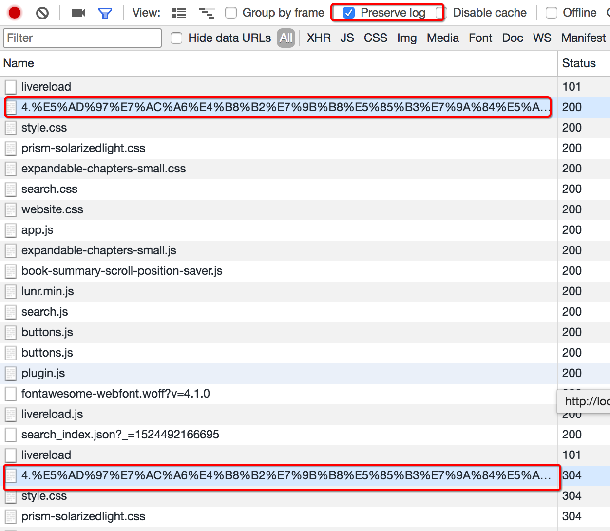

## chrome浏览器使用方法介绍

##### 学习目标
1. 了解 新建隐身窗口的目的
2. 了解 chrome中network的使用
3. 了解 寻找登录接口的方法

-----
### 1 新建隐身窗口
>浏览器中直接打开网站，会自动带上之前网站时保存的cookie，但是在爬虫中首次获取页面是没有携带cookie的，这种情况如何解决呢？

使用隐身窗口，首次打开网站，不会带上cookie，能够观察页面的获取情况，包括对方服务器如何设置cookie在本地

### 2 chrome中network的更多功能

##### 2.1 Perserve log
默认情况下，页面发生跳转之后，之前的请求url地址等信息都会消失，勾选perserve log后之前的请求都会被保留

##### 2.2 filter过滤
在url地址很多的时候，可以在filter中输入部分url地址，对所有的url地址起到一定的过滤效果，具体位置在上面第二幅图中的2的位置

##### 2.3 观察特定种类的请求
在上面第二幅图中的3的位置，有很多选项，默认是选择的`all`，即会观察到所有种类的请求

很多时候处于自己的目的可以选择`all`右边的其他选项，比如常见的选项：
- XHR:大部分情况表示ajax请求
- JS:js请求
- CSS:css请求

但是很多时候我们并不能保证我们需要的请求是什么类型，特别是我们不清楚一个请求是否为ajax请求的时候，直接选择`all`,从前往后观察即可，其中js，css，图片等不去观察即可

不要被浏览器中的一堆请求吓到了，这些请求中除了js，css，图片的请求外，其他的请求并没有多少个

### 3 寻找登录接口

> 回顾之前人人网的爬虫我们找到了一个登陆接口，那么这个接口从哪里找到的呢？

> http://www.renren.com

##### 3.1 寻找action对的url地址

可以发现，这个地址就是在登录的form表单中action对应的url地址，回顾前端的知识点，可以发现就是进行表单提交的地址，对应的，提交的数据，仅仅需要：`用户名的input标签中，name的值作为键，用户名作为值，密码的input标签中，name的值作为键，密码作为值即可`

##### 思考：
如果action对应的没有url地址的时候可以怎么做？

##### 3.2 通过抓包寻找登录的url地址

通过抓包可以发现，在这个url地址和请求体中均有参数，比如`uniqueTimestamp`和`rkey`以及加密之后的`password`

这个时候我们可以观察手机版的登录接口，是否也是一样的

可以发现在手机版中，依然有参数，但是参数的个数少一些，这个时候，我们可以**使用手机版作为参考，下一节来学习如何分析js**

-----

### 小结
1. 使用隐身窗口的主要目的是为了避免首次打开网站携带cookie的问题
2. chrome的network中，perserve log选项能够在页面发生跳转之后任然能够观察之前的请求
3. 确定登录的地址有两种方法：
    - 寻找from表单action的url地址
    - 通过抓包获取

