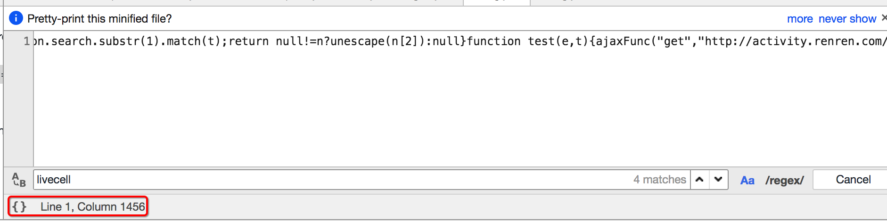
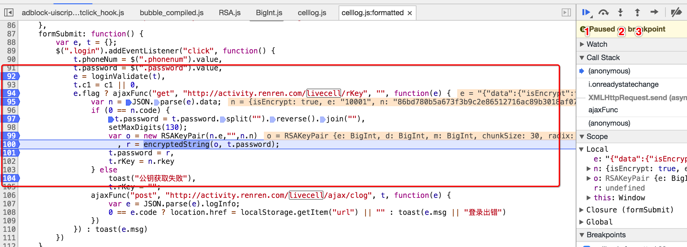

## JS的解析

##### 学习目标：
1. 了解 定位js的方法
2. 了解 添加断点观察js的执行过程的方法
3. 应用 js2py获取js的方法

### 1 确定js的位置
> 对于前面人人网的案例，我们知道了url地址中有部分参数，但是参数是如何生成的呢？

毫无疑问，参数肯定是js生成的，那么如何获取这些参数的规律呢？通过下面的学习来了解

##### 1.1 观察按钮的绑定js事件


通过点击按钮，然后点击`Event Listener`，部分网站可以找到绑定的事件，对应的，只需要点击即可跳转到js的位置

##### 1.2 通过search all file 来搜索
部分网站的按钮可能并没有绑定js事件监听，那么这个时候可以通过搜索请求中的关键字来找到js的位置，比如`livecell`


点击美化输出选项



可以继续在其中搜索关键字


### 2 观察js的执行过程
找到js的位置之后，我们可以来通过观察js的位置，找到js具体在如何执行，后续我们可以通过python程序来模拟js的执行，或者是使用类似`js2py`直接把js代码转化为python程序去执行

观察js的执行过程最简单的方式是添加断点



添加断点的方式：在左边行号点击即可添加，对应的右边BreakPoints中会出现现有的所有断点

添加断点之后继续点击登录，每次程序在断点位置都会停止，通过如果该行有变量产生，都会把变量的结果展示在Scoope中

在上图的右上角有1，2，3三个功能，分别表示：
    - 1：继续执行到下一个断点
    - 2：进入调用的函数中
    - 3：从调用的函数中跳出来

### 3 js2py的使用
> 在知道了js如何生成我们想要的数据之后，那么接下来我们就需要使用程序获取js执行之后的结果了

##### 3.1 js2py的介绍
js2py是一个js的翻译工具，也是一个通过纯python实现的js的解释器，[github上源码与示例](https://github.com/PiotrDabkowski/Js2Py)

##### 3.2 js的执行思路
js的执行方式大致分为两种：

1. 在了解了js内容和执行顺序之后，通过python来完成js的执行过程，得到结果
2. 在了解了js内容和执行顺序之后，使用类似js2py的模块来执js代码，得到结果

但是在使用python程序实现js的执行时候，需要观察的js的每一个步骤，非常麻烦，所以更多的时候我们会选择使用类似js2py的模块去执行js，接下来我们来使用js2py实现人人网登录参数的获取

##### 3.3 具体的实现
定位进行登录js代码

```js
formSubmit: function() {
        var e, t = {};
        $(".login").addEventListener("click", function() {
            t.phoneNum = $(".phonenum").value,
            t.password = $(".password").value,
            e = loginValidate(t),
            t.c1 = c1 || 0,
            e.flag ? ajaxFunc("get", "http://activity.renren.com/livecell/rKey", "", function(e) {
                var n = JSON.parse(e).data;
                if (0 == n.code) {
                    t.password = t.password.split("").reverse().join(""),
                    setMaxDigits(130);
                    var o = new RSAKeyPair(n.e,"",n.n)
                      , r = encryptedString(o, t.password);
                    t.password = r,
                    t.rKey = n.rkey
                } else
                    toast("公钥获取失败"),
                    t.rKey = "";
                ajaxFunc("post", "http://activity.renren.com/livecell/ajax/clog", t, function(e) {
                    var e = JSON.parse(e).logInfo;
                    0 == e.code ? location.href = localStorage.getItem("url") || "" : toast(e.msg || "登录出错")
                })
            }) : toast(e.msg)
        })
    }
```

##### 从代码中我们知道:

1. 我们要登录需要对密码进行加密和获取rkey字段的值
2. rkey字段的值我们直接发送请求rkey请求就可以获得
3. 密码是先反转然后使用RSA进行加密, js代码很复杂, 我们希望能通过在python中执行js来实现


##### 实现思路:
1. 使用session发送rKey获取登录需要信息
    - url: http://activity.renren.com/livecell/rKey
    - 方法: get
2. 根据获取信息对密码进行加密
    2.1 准备用户名和密码
    
    2.2 使用js2py生成js的执行环境:context
    
    2.3 拷贝使用到js文件的内容到本项目中
    
    2.4 读取js文件的内容,使用context来执行它们
    
    2.5 向context环境中添加需要数据
    
    2.6 使用context执行加密密码的js字符串
    
    2.7 通过context获取加密后密码信息
    
3. 使用session发送登录请求
    - URL: http://activity.renren.com/livecell/ajax/clog
    - 请求方法: POST
    - 数据: 
      
        ```
        phoneNum: xxxxxxx
        password: (加密后生产的)
        c1: 0
        rKey: rkey请求获取的
        ```

##### 具体代码

需要提前下载几个js文件到本地：

> BigInt.js

> RSA.js

> Barrett.js

```python
import requests
import json
import js2py

# - 实现思路:
#   - 使用session发送rKey获取登录需要信息
#     - url: http://activity.renren.com/livecell/rKey
#     - 方法: get
#  获取session对象
session = requests.session()
headers = {
    "User-Agent": "Mozilla/5.0 (Linux; Android 5.0; SM-G900P Build/LRX21T) AppleWebKit/537.36 (KHTML, like Gecko) Chrome/66.0.3359.139 Mobile Safari/537.36",
    "X-Requested-With": "XMLHttpRequest",
    "Content-Type":"application/x-www-form-urlencoded"
}
# 设置session的请求头信息
session.headers = headers

response = session.get("http://activity.renren.com/livecell/rKey")
# print(response.content.decode())
n = json.loads(response.content)['data']

#   - 根据获取信息对密码进行加密
#     - 准备用户名和密码
phoneNum = "131..."
password = "****"
#     - 使用js2py生成js的执行环境:context
context = js2py.EvalJs()
#     - 拷贝使用到js文件的内容到本项目中
#     - 读取js文件的内容,使用context来执行它们
with open("BigInt.js", 'r', encoding='utf8') as f:
    context.execute(f.read())

with open("RSA.js", 'r', encoding='utf8') as f:
    context.execute(f.read())
with open("Barrett.js", 'r', encoding='utf8') as f:
    context.execute(f.read())


# - 向context环境中添加需要数据
context.t = {'password': password}
context.n = n
#     - 执行加密密码的js字符
js = '''
       t.password = t.password.split("").reverse().join(""),
       setMaxDigits(130);
       var o = new RSAKeyPair(n.e,"",n.n)
        , r = encryptedString(o, t.password);
      '''
context.execute(js)
# - 通过context获取加密后密码信息
# print(context.r)
password = context.r
#   - 使用session发送登录请求
#     - URL: http://activity.renren.com/livecell/ajax/clog
#     - 请求方法: POST
#     - 数据:
#       - phoneNum: 15565280933
#       - password: (加密后生产的)
#       - c1: 0
#       - rKey: rkey请求获取的
data = {
    'phoneNum': '131....',
    'password': password,
    'c1':0,
    'rKey':n['rkey']
}

# print(session.headers)
response = session.post("http://activity.renren.com/livecell/ajax/clog", data=data)
print(response.content.decode())

# 访问登录的资源
response = session.get("http://activity.renren.com/home#profile")
print(response.content.decode())
```

-----

### 小结
1. 通过在chrome中观察元素的绑定事件可以确定js
2. 通过在chrome中search all file 搜索关键字可以确定js的位置
3. 观察js的数据生成过程可以使用添加断点的方式观察
4. js2py的使用
    - 需要准备js的内容
    - 生成js的执行环境
    - 在执行环境中执行js的字符串，传入数据，获取结果
    

