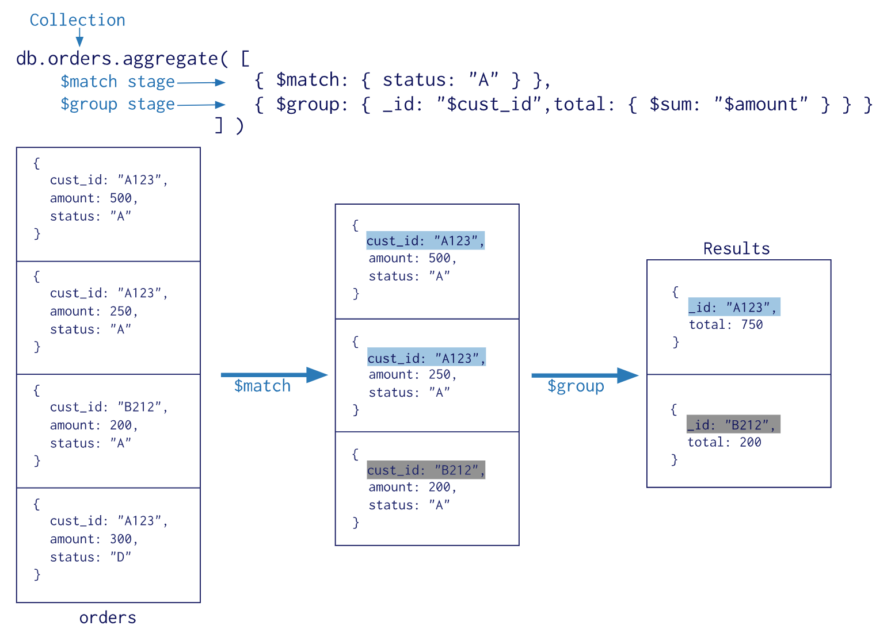

## mongodb的聚合操作
##### 学习目标
1. 了解 mongodb的聚合原理
2. 掌握 mongdb的管道命令
3. 掌握 mongdb的表达式

### 1 mongodb的聚合是什么

聚合(aggregate)是基于数据处理的聚合管道，每个文档通过一个由多个阶段（stage）组成的管道，可以对每个阶段的管道进行分组、过滤等功能，然后经过一系列的处理，输出相应的结果。

语法：`db.集合名称.aggregate({管道:{表达式}})`



## 2 mongodb的常用管道和表达式
知识点：
- 掌握mongodb中管道的语法
- 掌握mongodb中管道命令


##### 2.1 常用管道命令
 在mongodb中，⽂档处理完毕后， 通过管道进⾏下⼀次处理
 常用管道命令如下：
 - `$group`： 将集合中的⽂档分组， 可⽤于统计结果
 - `$match`： 过滤数据， 只输出符合条件的⽂档
 - `$project`： 修改输⼊⽂档的结构， 如重命名、 增加、 删除字段、 创建计算结果
 - `$sort`： 将输⼊⽂档排序后输出
 - `$limit`： 限制聚合管道返回的⽂档数
 - `$skip`： 跳过指定数量的⽂档， 并返回余下的⽂档

##### 2.2 常用表达式
 表达式：处理输⼊⽂档并输出
 语法：`表达式:'$列名'`
 常⽤表达式:

 - `$sum`： 计算总和， $sum:1 表示以⼀倍计数
 - `$avg`： 计算平均值
 - `$min`： 获取最⼩值
 - `$max`： 获取最⼤值
 - `$push`： 在结果⽂档中插⼊值到⼀个数组中


### 3 管道命令之`$group`
##### 3.1 按照某个字段进行分组
`$group`是所有聚合命令中用的最多的一个命令，用来将集合中的文档分组，可用于统计结果

使用示例如下

```json
db.stu.aggregate(
    {$group:
        {
            _id:"$gender",
            counter:{$sum:1}
        }
    }
)
```
其中注意点：
- `db.db_name.aggregate`是语法，所有的管道命令都需要写在其中
- `_id` 表示分组的依据，按照哪个字段进行分组，需要使用`$gender`表示选择这个字段进行分组
- `$sum:1` 表示把每条数据作为1进行统计，统计的是该分组下面数据的条数


##### 3.2  group by null
当我们需要统计整个文档的时候，`$group` 的另一种用途就是把整个文档分为一组进行统计

使用实例如下：

```json
db.stu.aggregate(
    {$group:
        {
            _id:null,
            counter:{$sum:1}
        }
    }
)
```
其中注意点：
- `_id:null` 表示不指定分组的字段，即统计整个文档，此时获取的`counter`表示整个文档的个数

##### 3.3 数据透视
正常情况在统计的不同性别的数据的时候，需要知道所有的name，需要逐条观察，如果通过某种方式把所有的name放到一起，那么此时就可以理解为数据透视

使用示例如下：

1. 统计不同性别的学生

    ```json
    db.stu.aggregate(
        {$group:
            {
                _id:null,
                name:{$push:"$name"}
            }
        }
    )
    ```

2. 使用`$$ROOT`可以将整个文档放入数组中

    ```json
    db.stu.aggregate(
        {$group:
            {
                _id:null,
                name:{$push:"$$ROOT"}
            }
        }
    )
    ```

##### 3.4 动手
对于如下数据，需要统计出每个country/province下的userid的数量（同一个userid只统计一次）

```json
{ "country" : "china", "province" : "sh", "userid" : "a" }  
{  "country" : "china", "province" : "sh", "userid" : "b" }  
{  "country" : "china", "province" : "sh", "userid" : "a" }  
{  "country" : "china", "province" : "sh", "userid" : "c" }  
{  "country" : "china", "province" : "bj", "userid" : "da" }  
{  "country" : "china", "province" : "bj", "userid" : "fa" }
```

参考答案
```
db.tv3.aggregate(
  {$group:{_id:{country:'$country',province:'$province',userid:'$userid'}}},
  {$group:{_id:{country:'$_id.country',province:'$_id.province'},count:{$sum:1}}}

```

### 4 管道命令之`$match`
`$match`用于进行数据的过滤，是在能够在聚合操作中使用的命令，和`find`区别在于`$match` 操作可以把结果交给下一个管道处理，而`find`不行

使用示例如下：

1. 查询年龄大于20的学生

    ```json
    db.stu.aggregate(
        {$match:{age:{$gt:20}}
        )
    ```
2. 查询年龄大于20的男女学生的人数

    ```json
    db.stu.aggregate(
        {$match:{age:{$gt:20}}
        {$group:{_id:"$gender",counter:{$sum:1}}}
        )
    ```

### 5 管道命令之`$project`
`$project`用于修改文档的输入输出结构，例如重命名，增加，删除字段

使用示例如下：

1. 查询学生的年龄、姓名，仅输出年龄姓名

    ```json
    db.stu.aggregate(
        {$project:{_id:0,name:1,age:1}}
        )
    ```

2. 查询男女生人生，输出人数

    ```json
    db.stu.aggregate(
        {$group:{_id:"$gender",counter:{$sum:1}}}
        {$project:{_id:0,counter:1}}
        )
    ```

##### 5.1 动手练习
对于如下数据：统计出每个country/province下的userid的数量（同一个userid只统计一次），结果中的字段为{country:"**"，province:"**"，counter:"*"}

```json
{ "country" : "china", "province" : "sh", "userid" : "a" }  
{  "country" : "china", "province" : "sh", "userid" : "b" }  
{  "country" : "china", "province" : "sh", "userid" : "a" }  
{  "country" : "china", "province" : "sh", "userid" : "c" }  
{  "country" : "china", "province" : "bj", "userid" : "da" }  
{  "country" : "china", "province" : "bj", "userid" : "fa" }  
```

参考答案

```
db.tv3.aggregate(
  {$group:{_id:{country:'$country',province:'$province',userid:'$userid'}}},
  {$group:{_id:{country:'$_id.country',province:'$_id.province'},count:{$sum:1}}},
  {$project:{_id:0,country:'$_id.country',province:'$_id.province',counter:'$count'}}
  )

```


### 6 管道命令之`$sort`
`$sort`用于将输入的文档排序后输出

使用示例如下：

1. 查询学生信息，按照年龄升序

    ```json
    db.stu.aggregate({$sort:{age:1}})
    ```

2. 查询男女人数，按照人数降序

    ```json
    db.stu.aggregate(
        {$group:{_id:"$gender",counter:{$sum:1}}},
        {$sort:{counter:-1}}
    )
    ```

### 7 管道命令之`$skip` 和 `$limit`
- `$limit`限制返回数据的条数
- `$skip` 跳过指定的文档数，并返回剩下的文档数
- 同时使用时先使用skip在使用limit

使用示例如下：
1. 查询2条学生信息

    ```json
    db.stu.aggregate(
        {$limit:2}
    )
    ```
2. 查询从第三条开始的学生信息

    ```json
    db.stu.aggregate(
        {$skip:3}
    )
    ```

3. 统计男女生人数，按照人数升序，返回第二条数据

    ```json
    db.stu.aggregate(
        {$group:{_id:"$gender",counter:{$sum:1}}},
        {$sort:{counter:-1}},
        {$skip:1},
        {$limit:1}
    )
    ```

###  8 小结
1. 理解聚合操作的是在干什么
2. 掌握`$group`,`$match`,`$project`的使用
3. 熟悉`$sort`,`$limit`,`$skip`的使用
4. 实现常用的表达式


