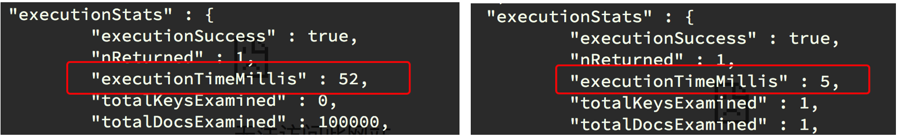

## Mongodb的索引操作

##### 学习目标
1. 掌握 mongodb索引的创建，删除操作
2. 掌握 mongodb查看索引的方法
3. 掌握 mongodb创建唯一索引的方法

----

### 1. 为什么mongdb需要创建索引
- 加快查询速度
- 进行数据的去重

### 2. mongodb创建简单的索引方法
- 语法：`db.集合名.ensureIndex({属性:1})`，1表示升序， -1表示降序

### 3. 创建索引前后查询速度对比
> 测试：插入10万条数据到数据库中

插入数据：
```
for(i=0;i<100000;i++){db.t1.insert({name:'test'+i,age:i})}
```

创建索引前：
```
db.t1.find({name:'test10000'})
db.t1.find({name:'test10000'}).explain('executionStats') # 显示查询操作的详细信息
```

创建索引：
```
db.t1.ensureIndex({name:1})
```

创建索引后：
```
db.t1.find({name:'test10000'}).explain('executionStats')
```

前后速度对比

    

### 4. 索引的查看
默认情况下_id是集合的索引
查看方式：`db.集合名.getIndexes()`

### 5. 删除索引
语法：`db.集合名.dropIndex({'索引名称':1})`
```
db.t1.dropIndex({name:1})
db.t1.getIndexes()
```

### 6. mongodb创建唯一索引
> 在默认情况下mongdb的索引域的值是可以相同的，创建唯一索引之后，数据库会在插入数据的时候检查创建索引域的值是否存在，如果存在则不会插入该条数据，但是创建索引仅仅能够提高查询速度,同时降低数据库的插入速度。

#### 6.1 添加唯一索引的语法：
```
db.集合名.ensureIndex({"字段名":1}, {"unique":true})
```

#### 6.2 利用唯一索引进行数据去重
> 根据唯一索引指定的字段的值，如果相同，则无法插入数据
```
db.t1.ensureIndex({"name":1}, {"unique":true})
db.t1.insert({name: 'test10000'})
```

### 7. 建立复合索引
在进行数据去重的时候，可能用一个域来保证数据的唯一性，这个时候可以考虑建立复合索引来实现。

例如：抓全贴吧信息，如果把帖子的名字作为唯一索引对数据进行去重是不可取的，因为可能有很多帖子名字相同

建立复合索引的语法：`db.collection_name.ensureIndex({字段1:1,字段2:1})`

### 8. 建立索引注意点
- 根据需要选择是否需要建立唯一索引
- 索引字段是升序还是降序在单个索引的情况下不影响查询效率，但是带复合索引的条件下会有影响
- 数据量巨大并且数据库的读出操作非常频繁的时候才需要创建索引，如果写入操作非常频繁，创建索引会影响写入速度

  > 例如：在进行查询的时候如果字段1需要升序的方式排序输出，字段2需要降序的方式排序输出，那么此时复合索引的建立需要把字段1设置为1，字段2设置为-1

#### 课后思考

> 数据库为什么要做读写分离（读写分离的意义）？

## 小结
  1. 掌握mongodb索引的创建，删除操作
  2. 掌握mongodb查看索引的方法
  3. 掌握mongodb创建唯一索引的方法

----
