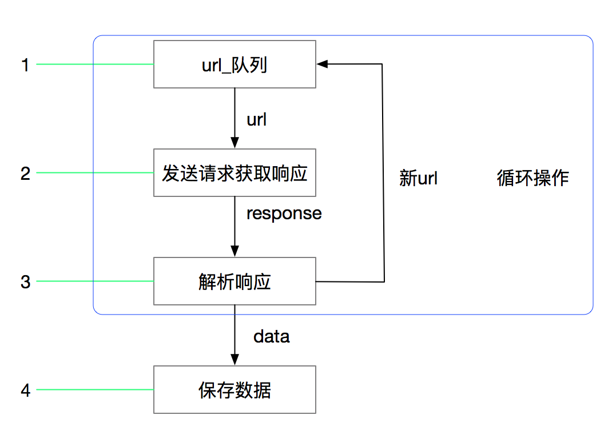

## scrapy的概念和流程 
##### 学习目标：
1. 了解 scrapy的概念
2. 了解 scrapy框架的作用
3. 掌握 scrapy框架的运行流程
4. 掌握 scrapy中每个模块的作用

----

### 1. scrapy的概念

**Scrapy是一个Python编写的开源网络爬虫框架。它是一个被设计用于爬取网络数据、提取结构性数据的框架。**

> Scrapy 使用了Twisted['twɪstɪd]异步网络框架，可以加快我们的下载速度。

> Scrapy文档地址：http://scrapy-chs.readthedocs.io/zh_CN/1.0/intro/overview.html

### 2. scrapy框架的作用

> 少量的代码，就能够快速的抓取

### 3. scrapy的工作流程

#### 3.1 回顾之前的爬虫流程
 

#### 3.2 上面的流程可以改写为
 

#### 3.3 scrapy的流程
 

##### 其流程可以描述如下：

1. 爬虫中起始的url构造成request对象-->爬虫中间件-->引擎-->调度器
2. 调度器把request-->引擎-->下载中间件--->下载器
3. 下载器发送请求，获取response响应---->下载中间件---->引擎--->爬虫中间件--->爬虫
4. 爬虫提取url地址，组装成request对象---->爬虫中间件--->引擎--->调度器，重复步骤2
5. 爬虫提取数据--->引擎--->管道处理和保存数据

##### 注意：
- 图中中文是为了方便理解后加上去的
- 图中绿色线条的表示数据的传递
- 注意图中中间件的位置，决定了其作用
- 注意其中引擎的位置，所有的模块之前相互独立，只和引擎进行交互

#### 3.4 scrapy的三个内置对象

- request请求对象：由url method post_data headers等构成
- response响应对象：由url body status headers等构成
- item数据对象：本质是个字典

#### 3.5 scrapy中每个模块的具体作用
 

##### 注意：
- 爬虫中间件和下载中间件只是运行逻辑的位置不同，作用是重复的：如替换UA等

----

## 小结
1. scrapy的概念：Scrapy是一个为了爬取网站数据，提取结构性数据而编写的应用框架
2. scrapy框架的运行流程以及数据传递过程：
	1. 爬虫中起始的url构造成request对象-->爬虫中间件-->引擎-->调度器
	2. 调度器把request-->引擎-->下载中间件--->下载器
	3. 下载器发送请求，获取response响应---->下载中间件---->引擎--->爬虫中间件--->爬虫
	4. 爬虫提取url地址，组装成request对象---->爬虫中间件--->引擎--->调度器，重复步骤2
	5. 爬虫提取数据--->引擎--->管道处理和保存数据
3. scrapy框架的作用：通过少量代码实现快速抓取
4. 掌握scrapy中每个模块的作用：
	引擎(engine)：负责数据和信号在不腰痛模块间的传递
	调度器(scheduler)：实现一个队列，存放引擎发过来的request请求对象
	下载器(downloader)：发送引擎发过来的request请求，获取响应，并将响应交给引擎
	爬虫(spider)：处理引擎发过来的response，提取数据，提取url，并交给引擎
	管道(pipeline)：处理引擎传递过来的数据，比如存储
	下载中间件(downloader middleware)：可以自定义的下载扩展，比如设置代理ip
	爬虫中间件(spider middleware)：可以自定义request请求和进行response过滤，与下载中间件作用重复

----
