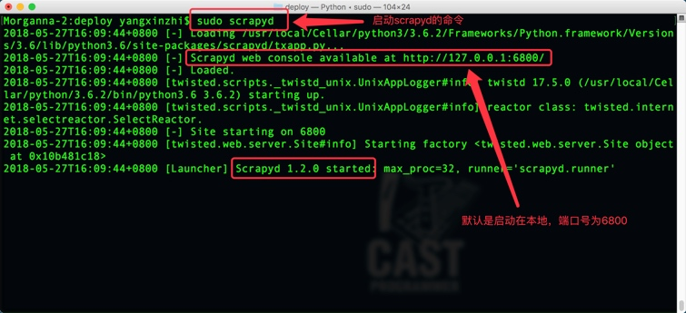
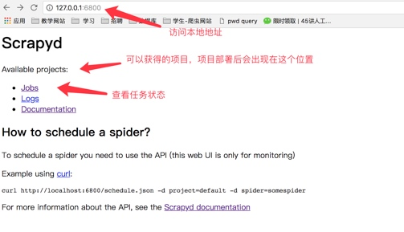
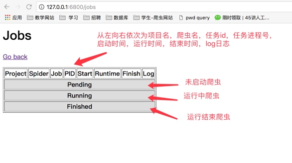

## scrapyd部署scrapy项目
##### 学习目标
1. 了解 scrapyd的使用流程

----

### 1. scrapyd的介绍 

scrapyd是一个用于部署和运行scrapy爬虫的程序，它允许你通过JSON API来**部署爬虫项目和控制爬虫运行**，scrapyd是一个守护进程，监听爬虫的运行和请求，然后启动进程来执行它们

> 所谓json api本质就是post请求的webapi

### 2. scrapyd的安装
scrapyd服务:
`pip install scrapyd`

scrapyd客户端:
`pip install scrapyd-client`

### 3. 启动scrapyd服务

1. **在scrapy项目路径下** 启动scrapyd的命令：`sudo scrapyd` 或 `scrapyd`

2. 启动之后就可以打开本地运行的scrapyd，浏览器中访问本地6800端口可以查看scrapyd的监控界面

 
 

* 点击job可以查看任务监控界面

 

### 4. scrapy项目部署
#### 4.1 配置需要部署的项目

编辑需要部署的项目的scrapy.cfg文件(需要将哪一个爬虫部署到scrapyd中，就配置该项目的该文件)

 ```
 [deploy:部署名(部署名可以自行定义)]
 url = http://localhost:6800/
 project = 项目名(创建爬虫项目时使用的名称)
 ```
 

#### 4.2 部署项目到scrapyd

同样在**scrapy项目路径下**执行：

`scrapyd-deploy 部署名(配置文件中设置的名称) -p 项目名称` 

 

部署成功之后就可以看到部署的项目 
 

#### 4.3 管理scrapy项目

* 启动项目：`curl http://localhost:6800/schedule.json -d project=project_name -d spider=spider_name `

 

* 关闭爬虫：`curl http://localhost:6800/cancel.json -d project=project_name -d job=jobid`

##### 注意；curl是命令行工具，如果没有则需要额外安装

#### 4.4 使用requests模块控制scrapy项目

```
import requests

# 启动爬虫
url = 'http://localhost:6800/schedule.json'
data = {
	'project': 项目名,
	'spider': 爬虫名,
}
resp = requests.post(url, data=data)

# 停止爬虫
url = 'http://localhost:6800/cancel.json'
data = {
	'project': 项目名,
	'job': 启动爬虫时返回的jobid,
}
resp = requests.post(url, data=data)
```

### 5. 了解scrapyd的其他webapi

* curl http://localhost:6800/listprojects.json    （列出项目）
* curl http://localhost:6800/listspiders.json?project=myspider   （列出爬虫）
* curl http://localhost:6800/listjobs.json?project=myspider    （列出job）
* curl http://localhost:6800/cancel.json -d project=myspider -d job=tencent    （**终止爬虫**，该功能会有延时或不能终止爬虫的情况，此时可用kill -9杀进程的方式中止）
* scrapyd还有其他webapi，百度搜索了解更多


----

### 小结

1. 在scrapy项目路径下执行`sudo scrapyd`或`scrapyd`，启动scrapyd服务；或以后台进程方式启动```nohup scrapyd > scrapyd.log 2>&1 &```
2. 部署scrapy爬虫项目`scrapyd-deploy -p myspider`
3. 启动爬虫项目中的一个爬虫`curl http://localhost:6800/schedule.json -d project=myspider -d spider=tencent`

----
