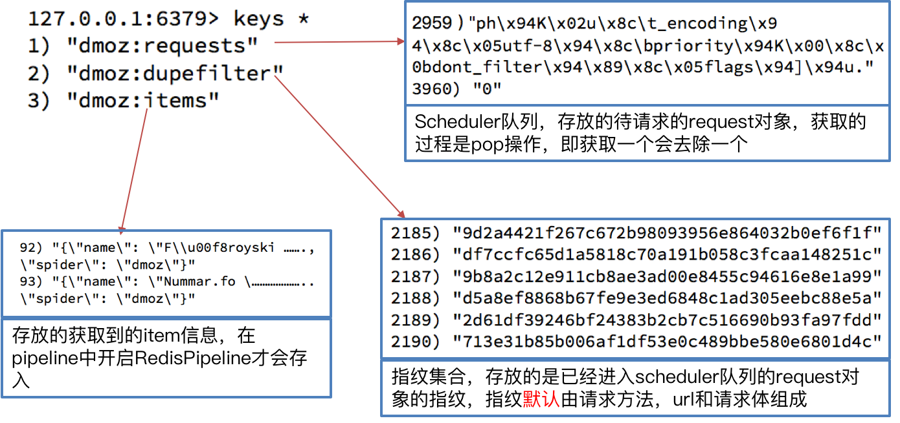

##  scrapy_redis原理分析并实现断点续爬以及分布式爬虫

##### 学习目标
1. 了解 scrapy实现去重的原理
2. 了解 scrapy中请求入队的条件
3. 掌握 scrapy_redis基于url地址的增量式单机爬虫
4. 掌握 scrapy_redis分布式爬虫

----

### 1. 下载github的demo代码

1. clone github scrapy-redis源码文件 

	`git clone https://github.com/rolando/scrapy-redis.git `

2. 研究项目自带的demo

	`mv scrapy-redis/example-project ~/scrapyredis-project`
  	
### 2. 观察dmoz文件

在domz爬虫文件中，实现方式就是之前的`crawlspider`类型的爬虫

```
from scrapy.linkextractors import LinkExtractor
from scrapy.spiders import CrawlSpider, Rule


class DmozSpider(CrawlSpider):
    """Follow categories and extract links."""
    name = 'dmoz'
    allowed_domains = ['dmoztools.net']
    start_urls = ['http://dmoztools.net/'] # 这里修改了url
    
    # 定义数据提取规则，使用了css选择器
    rules = [
        Rule(LinkExtractor(
            restrict_css=('.top-cat', '.sub-cat', '.cat-item')
        ), callback='parse_directory', follow=True),
    ]

    def parse_directory(self, response):
        for div in response.css('.title-and-desc'):
            yield {
                'name': div.css('.site-title::text').extract_first(),
                'description': div.css('.site-descr::text').extract_first().strip(),
                'link': div.css('a::attr(href)').extract_first(),
            }

```

但是在settings.py中多了以下内容,这几行表示`scrapy_redis`中重新实现的了去重的类，以及调度器，并且使用`RedisPipeline`管道类

```
DUPEFILTER_CLASS = "scrapy_redis.dupefilter.RFPDupeFilter"
SCHEDULER = "scrapy_redis.scheduler.Scheduler"
SCHEDULER_PERSIST = True

ITEM_PIPELINES = {
    'example.pipelines.ExamplePipeline': 300,
    'scrapy_redis.pipelines.RedisPipeline': 400,
}
```

### 3. 运行dmoz爬虫，观察现象

1. 首先我们需要添加redis的地址，程序才能够使用redis

```
REDIS_URL = "redis://127.0.0.1:6379"
#或者使用下面的方式
# REDIS_HOST = "127.0.0.1"
# REDIS_PORT = 6379
```
    
2. 我们执行domz的爬虫，会发现redis中多了一下三个键：
  
 
    
3. 中止进程后再次运行dmoz爬虫

继续执行程序，会发现程序在前一次的基础之上继续往后执行，**所以domz爬虫是一个基于url地址的增量式的爬虫**
    
### 4. scrapy_redis的原理分析

我们从settings.py中的三个配置来进行分析
分别是：
- RedisPipeline # 管道类
- RFPDupeFilter # 指纹去重类
- Scheduler # 调度器类
- SCHEDULER_PERSIST # 是否持久化请求队列和指纹集合

#### 4.1 Scrapy_redis之RedisPipeline
RedisPipeline中观察process_item，进行数据的保存，存入了redis中

  

#### 4.2 Scrapy_redis之RFPDupeFilter

RFPDupeFilter 实现了对request对象的加密

  

#### 4.3  Scrapy_redis之Scheduler
scrapy_redis调度器的实现了决定什么时候把request对象加入带抓取的队列，同时把请求过的request对象过滤掉

 

#### 4.4 由此可以总结出request对象入队的条件
- request的指纹不在集合中
- request的dont_filter为True，即不过滤
    - start_urls中的url地址会入队，因为他们默认是不过滤

#### 4.5 实现单机断点续爬

> 改写网易招聘爬虫，该爬虫就是一个经典的基于url地址的增量式爬虫

### 5. 实现分布式爬虫

#### 5.1 分析demo中代码

> 打开example-project项目中的myspider_redis.py文件

通过观察代码：

1. 继承自父类为RedisSpider
2. 增加了一个redis_key的键，没有start_urls，因为分布式中，如果每台电脑都请求一次start_url就会重复
3. 多了`__init__`方法，该方法不是必须的，可以手动指定allow_domains
4. 启动方法：
    1. 在每个节点正确的目录下执行`scrapy crawl 爬虫名`，使该节点的scrapy_redis爬虫程序就位
    2. 在共用的redis中 `lpush redis_key 'start_url'`，使全部节点真正的开始运行
5. settings.py中关键的配置

```
DUPEFILTER_CLASS = "scrapy_redis.dupefilter.RFPDupeFilter"
SCHEDULER = "scrapy_redis.scheduler.Scheduler"
SCHEDULER_PERSIST = True

ITEM_PIPELINES = {
    'example.pipelines.ExamplePipeline': 300,
    'scrapy_redis.pipelines.RedisPipeline': 400,
}
REDIS_URL = "redis://127.0.0.1:6379"
```


#### 5.2 动手实现分布式爬虫

> 改写tencent爬虫为分布式爬虫

##### 注意：启动方式发生改变

----

## 小结

1. scrapy_redis的含义和能够实现的功能
    1. scrapy是框架
    2. scrapy_redis是scrapy的组件
    3. scrapy_redis能够实现断点续爬和分布式爬虫

2. scrapy_redis流程和实现原理
    1. 在scrapy框架流程的基础上，把存储request对象放到了redis的有序集合中，利用该有序集合实现了请求队列
    2. 并对request对象生成指纹对象，也存储到同一redis的集合中，利用request指纹避免发送重复的请求
3. request对象进入队列的条件
    1. request的指纹不在集合中
    2. request的dont_filter为True，即不过滤

4. request指纹的实现
    - 请求方法
    - 排序后的请求地址
    - 排序并处理过的请求体或空字符串
    - 用hashlib.sha1()对以上内容进行加密

5. scarpy_redis实现增量式爬虫、布式爬虫
    1. 对setting进行如下设置
        - DUPEFILTER_CLASS = "scrapy_redis.dupefilter.RFPDupeFilter"
        - SCHEDULER = "scrapy_redis.scheduler.Scheduler"
        - SCHEDULER_PERSIST = True
        - ITEM_PIPELINES = {'scrapy_redis.pipelines.RedisPipeline': 400,}
        - REDIS_URL = "redis://127.0.0.1:6379" # 请正确配置REDIS_URL
    2. 爬虫文件中的爬虫类继承RedisSpider类
    3. 爬虫类中redis_key替代了start_urls
    4. 启动方式不同
        - 通过`scrapy crawl spider`启动爬虫后，向redis_key放入一个或多个起始url（lpush或rpush都可以），才能够让scrapy_redis爬虫运行
    5. 除了以上差异点以外，scrapy_redis爬虫和scrapy爬虫的使用方法都是一样的

----
