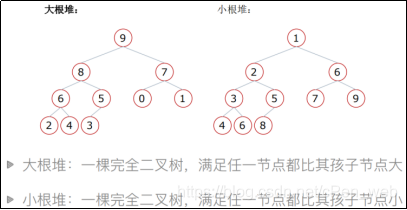
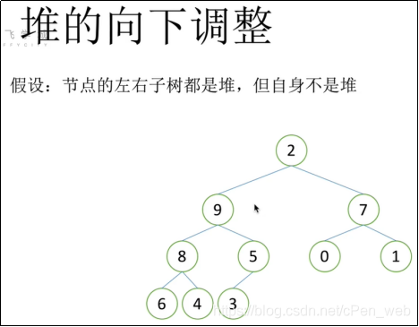
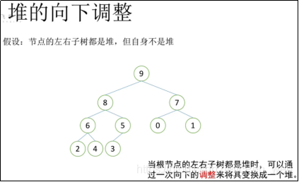
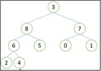
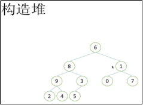
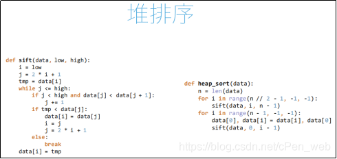

### 文章


- [#21 堆排序前传堆和堆的向下调整](https://blog.csdn.net/cPen_web/article/details/110290561#21_09_7)
- [#22 堆排序的过程演示](https://blog.csdn.net/cPen_web/article/details/110290561#22_09_54)
- [#23 向下调整函数的实现](https://blog.csdn.net/cPen_web/article/details/110290561#23_09_117)
- [#24 堆排序的实现1](https://blog.csdn.net/cPen_web/article/details/110290561#24_091_195)
- [#25 堆排序的实现2](https://blog.csdn.net/cPen_web/article/details/110290561#25_092_274)
- [#26 堆排序的时间复杂度](https://blog.csdn.net/cPen_web/article/details/110290561#26_09_379)
- [#27 堆的内置模块](https://blog.csdn.net/cPen_web/article/details/110290561#27_09_391)
- [#28 topk问题](https://blog.csdn.net/cPen_web/article/details/110290561#28_09topk_428)
- [#29 topk实现](https://blog.csdn.net/cPen_web/article/details/110290561#29_09topk_462)
- [#30 归并排序归并](https://blog.csdn.net/cPen_web/article/details/110290561#30_09_520)

# #21 堆排序前传堆和堆的向下调整

```
### 堆排序——什么是堆
# 堆：一种特殊的完全二叉树结构    # 注：完全二叉树：满的，最后一排可以少
#       大根堆：一棵完全二叉树，满足任一节点都比其孩子节点大
#       小根堆：一棵完全二叉树，满足任一节点都比其孩子节点小

#注：完全二叉树：满的，最后一排可以按顺序少
#注：满二叉树：一个都不少的
```


编辑


```
#注：9比8、7 大……大根堆	父亲节点都比孩子节点大	整个二叉树叫大根堆
#注：1比2、6 小……小根堆	父亲节点都比孩子节点小	整个二叉树叫小根堆

#堆排序使用大根堆 排出来是增序的

#9看成省长，8、7看成县长，9管着2个县长
#8管着6、5两个村长
#6村长下面管着2个村民
#-----------------------------------------------------------
### 堆排序̶̶堆的向下调整性质
# 假设根节点的左右子树都是堆，但根节点不满足堆的性质
# 可以通过一次向下的调整来将其变成一个堆。
```


编辑


```
#注：这不是大根堆，因为2不比9和7大，省长领导不了县长
#注：但是2个县秩序都没问题
#注：怎么来还，这个过程就就做向下调整

#注：2换下来，让左边的9上去(因为右边的7上去，还是领导不了9)
#注：2不能做左边的县长，把8找上去（8和5里更大的那个村长上去）
#注：2不能做左边的村长，选6上去（6和4里最大的村民上去）
#注：最后 到了叶子节点了，2就做1个村民
#注：这一番折腾完后，整个树是1个大根堆了，这个过程叫做堆的向下调整过程

#当根节点的左右子树都是堆时，可以通过一次向下的调整来将其变换成1个堆
```


编辑

#  #22 堆排序的过程演示

```
### 堆排序过程
# 1.建立堆。    # 注：建立堆的过程后面再说
# 2.得到堆顶元素，为最大元素
# 3.去掉堆顶，将堆最后一个元素放到堆顶，此时可通过一次调整重新使堆有序。
# 4.堆顶元素为第二大元素。
# 5.重复步骤3，直到堆变空。

              9
       8             7
   6       5    0         1
2     4 3
#注：这个堆建立好了，堆顶(根节点) 一定是最大的数(大根堆)
#注：把9拿下来。8不能上去，否则8原来的位置回空，6来补会空，4来补也会空，最后会出现空，就不是完全二叉树了
#注：所以不这么做
#注：把3放上去，满足了向下调整的条件，2个县都没有问题
#注：通过1个向下调整把这个堆变为合法的堆。这个过程把现在堆里面最大的数选出来，如下
              8
       6             7
   4       5    0         1
2     3
#注：这时候把8拿下来（退休），再把3放上去（因为3是最后一个，每次找 都找堆的最后1个），如下
              7
       6             3
   4       5    0         1
2
#注：7退休，拿下来。找个棋子2上来，调整，如下 [注：每次出1个数，整个堆都在变小]
              6
       5             3
   4       2    0         1
#注：6下去，棋子是1……………………
# 最后  棋子0上去  0再下去。整个序就排好了

#挨个出数
#------------------------------------------
#构造堆
#如何建造堆？
#注：要建造1个堆，首先保证下面的有序，先村有序，再县有序

#注：看最后1个非叶子节点3 （因为0、7、2、4、5都是叶子节点）
                6
        8               1
    9        3      0       7
 2     4  5
#注：3 5 村无序，但是村民有序。换村长  3下来 5 上去
# 再看前1个村 ，9   2 4 是好的，不用调整
# 接着看右边的县长 1    0 7 ，调整 7    0 1
# 接下来看8   9（2 4）  5（3） 满足2个村都是好的，但是县不好，调整.如下
              6
       9             7
   8       5    0         1
2     4  3
# 接下来省长6  调整
              9
       8             7
   6       5    0         1
2     4  3
#这个时候 ，堆构造好了，所有都有序了，构造堆的过程就结束了 (过程是农村包围城市，先从最后1级  有孩子的节点开始看起，先调整小的，再调整大的，最后调整整个的)
# 当整个都调整好了，堆就构造好了
#构造堆以后，挨个出数，一个一个退休，一个一个调整 ，这就是堆排序的过程
```


# #23 向下调整函数的实现

```
### 堆排序过程
# 1.建立堆。    # 注：农村包围城市，先县后省
# 2.得到堆顶元素，为最大元素    # 注：得到最大的元素后拿下来
# 3.去掉堆顶，将堆最后一个元素放到堆顶，此时可通过一次调整重新使堆有序。  # 注：找棋子上去，向下调整，重新有序
# 4.堆顶元素为第二大元素。
# 5.重复步骤3，直到堆变空。    # 注：接着重复拿出来放上去，直到堆空

#注：算法，内存能省则省，时间能快就快。堆排序没必要占一个新的内存
#怎么省？答：把省长9拿下来，不丢掉，放到上去的元素原来的那个末尾地方3，那个位置不是堆了，在左边的位置弄一个标志,记录那是堆最后的位置
#上去的元素一开始下面的位置，用来存原来的省长9，标记末尾9位置前一个的位置 是堆的最后的位置………………
#最后得到的是1个升序的，因为最后面从最大的开始放的

#怎样写出退排序？ 在堆排序里反复用到的性质是调整
```


编辑

```
#先写调整的小函数
# def sift(li, low, high):    # 堆的最后1个元素的下标是high (4下标是high)
    # low是堆的第一个元素，因为构造堆的时候可能不是看整个的列表，而是小部分
    #li:列表
    #low：堆的根节点位置，用途：刚开始要看堆顶
    #high：堆的最后一个元素的位置，用途：一直往下调整，为了下标不越界，是父亲找孩子
    #2i+1跟high比，如果大于了，说明越界了，就赶快停止了放最后1层了
def sift(li, low, high):    # 这是调整函数
    #先把省长拿下来，接着一个循环一直看拿下来的这个 能干哪一层（省长肯定不能干了）
    # 刚开始i 指父亲 这一层,j指孩子这一层 一共2层对比（i 跟左右2个比，如果i大于左右2个最大的还大，如果不是 就把j位置上的数放到i这个位置上）
    # 然后i、j在往下移一层
    i = low # 刚开始i 是堆顶
    j = 2*i + 1 #从父亲找孩子，先看左孩子 ;j开始是左孩子
    tmp = li[low]   # 把堆顶存起来
    #i指的是现在节点要去的位置
    #j是看它的孩子能不能顶上去
    while j <= high: # 只要j位置没有越界，就一直循环
        if j + 1 <= high and li[j+1] > li[j]: # 如果右孩子 > 左孩子 且右孩子有
            j = j + 1       # 那就把j指向右孩子
        if li[j] > tmp:     # 如果j位置大，j上去补候补tmp 当省长
            li[i] = li[j]
            i = j           # 往下看1层
            j = 2 * i + 1
#  (3)    i -->空位
# j-->  8               7   # 注：j指向8,8>3,j=8上去,补了i的位置即li[i]=li[j]
#然后 i到 原来j的位置 ，j指向i的左孩子，即更新i、j。
#代码是 i = j , j = 2 * i + 1
#总结起来是 下边的县长比候选的tmp更大，让县长上去，i指向县的位置(i = j)，j指向县长的左孩子
        else:   # tmp比县长大的情况，把tmp放到i的位置上，i就不用往下看了
            li[i]= tmp  # 把tmp放到某一级领导的位置上
            break   # 结束循环
#这个函数相当于把省长拿下来放到合适的位子，左右2个已经是个堆了
    else:   # 这是到最下面的情况，j指向不存的的下面
        li[i] = tmp # 把tmp放到叶子节点上
#最后的语句可以优化，删除倒数第4句的 li[i]= tmp
```


```
def sift(li, low, high):
    # li：列表
    # low: 堆的根节点位置
    # high: 堆的最后一个元素的位置
    i = low # i最开始指向根节点
    j = 2 * i + 1   # j开始是左孩子
    tmp = li[low]   # 把堆顶存起来
    while j <= high:    # 只要j位置有数
        if j + 1 <= high and li[j+1] > li[j]: # 如果有孩子有并且比较大
            j = j + 1   # j指向右孩子
        if li[j] > tmp:
            li[i] = li[j]
            i = j       # 往下看一层
            j = 2 * i + 1
        else:   # tmp更大，把tmp放到i的位置上
            li[i] = tmp # 该语句可省 # 把tmp放到某一级领导位置上
            break
    else:
        li[i] = tmp # 把tmp放到叶子节点上
```


# #24 堆排序的实现1

编辑


```python
（先小堆调整 后大堆调整） 整个堆有n个节点
#注：首先找到3这个位置（最后一个非叶子节点）[孩子找父亲]
#注：最后的孩子下标是n-1   所以父亲下标 (i-1)//2  为(n-2)//2  --> n//2 - 1
#注：上面意思是 如果孩子的下标是i  那么父亲的下标 是(n-2)//2  是n//2 - 1

def sift(li, low, high):
    # li：列表
    # low: 堆的根节点位置
    # high: 堆的最后一个元素的位置
    i = low # i最开始指向根节点
    j = 2 * i + 1   # j开始是左孩子
    tmp = li[low]   # 把堆顶存起来
    while j <= high:    # 只要j位置有数
        if j + 1 <= high and li[j+1] > li[j]: # 如果有孩子有并且比较大
            j = j + 1   # j指向右孩子
        if li[j] > tmp:
            li[i] = li[j]
            i = j       # 往下看一层
            j = 2 * i + 1
        else:   # tmp更大，把tmp放到i的位置上
            li[i] = tmp # 该语句可省 # 把tmp放到某一级领导位置上
            break
    else:
        li[i] = tmp # 把tmp放到叶子节点上

#堆排序的步骤：先建堆（农村包围城市）：先做下面小堆的调整，然后渐渐大堆的调头
def heap_sort(li):
    n = len(li)
    for i in range((n-2)//2, -1, -1):   # 从最后非叶子节点3 遍历到0 (最上面6)
        # i表示建堆的时候调整的部分的根的下标(如图3 5 的3、9 2 4的9)
        sift(li, i, n-1)    # low是i 表示根的下标。high是n-1 最后元素的下标
        # high的作用是 j 超了它 说明i是最后一层 （唯一作用）
#小技巧：不管low是几，high都指整个堆的最后1个元素因为i是最后一层 j一定大于high。达到相同的效果（相当于偷了懒，少了复杂的计算）
#因为high的作用只有一个，就是判断j约不越界，指向堆最后一个元素的high已经够用了
    #这个for循环结束后，建堆完成了
    print(li)   # 打印效果 可忽略
#整个列表走了差不多一半次 (n-2)//2

li = [i for i in range(100)]
import random
random.shuffle(li)  # 打乱
print(li)
heap_sort(li)
#结果为
# [86, 91, 54, 36, 55, 68, 29, 90……]    # 打乱后的列表
# [99, 98, 95, 96, 97, 89, 76, 94……]    # 建完堆后的列表 都满足父亲比孩子大
#------------------------------------------------------------------
def sift(li, low, high):	# 向下调整函数
    # li：列表
    # low: 堆的根节点位置
    # high: 堆的最后一个元素的位置
    i = low # i最开始指向根节点
    j = 2 * i + 1   # j开始是左孩子
    tmp = li[low]   # 把堆顶存起来
    while j <= high:    # 只要j位置有数
        if j + 1 <= high and li[j+1] > li[j]: # 如果有孩子有并且比较大
            j = j + 1   # j指向右孩子
        if li[j] > tmp:
            li[i] = li[j]
            i = j       # 往下看一层
            j = 2 * i + 1
        else:   # tmp更大，把tmp放到i的位置上
            li[i] = tmp # 该语句可省 # 把tmp放到某一级领导位置上
            break
    else:
        li[i] = tmp # 把tmp放到叶子节点上

def heap_sort(li):		# 建堆函数
    n = len(li)
    for i in range((n-2)//2, -1, -1):
        # i表示建堆的时候调整的部分的根的下标
        sift(li, i, n-1)
    #建堆完成了
#------------------------------------------------------------------
```


# #25 堆排序的实现2

```python
#向下调整函数 和 建堆函数 写啊完了
#这一步是 完成挨个出数

### 挨个出数：建堆完成后，最大的先放下来，最下面最右边的放上去，调整，再重复这个过程（要下来的数和要上去的数做交换）
#为了节省内存，把放下来的数 写到放上去的数的位置，然后把high往前移动1个

def sift(li, low, high):   # 向下调整函数
    # li：列表
    # low: 堆的根节点位置
    # high: 堆的最后一个元素的位置
    i = low # i最开始指向根节点
    j = 2 * i + 1   # j开始是左孩子
    tmp = li[low]   # 把堆顶存起来
    while j <= high:    # 只要j位置有数
        if j + 1 <= high and li[j+1] > li[j]: # 如果有孩子有并且比较大
            j = j + 1   # j指向右孩子
        if li[j] > tmp:
            li[i] = li[j]
            i = j       # 往下看一层
            j = 2 * i + 1
        else:   # tmp更大，把tmp放到i的位置上
            li[i] = tmp # 该语句可省 # 把tmp放到某一级领导位置上
            break
    else:
        li[i] = tmp # 把tmp放到叶子节点上

def heap_sort(li):    # 建堆函数
    n = len(li)
    for i in range((n-2)//2, -1, -1):
        # i表示建堆的时候调整的部分的根的下标
        sift(li, i, n-1)
    #建堆完成了
###############从这开始写
    # 需要下来n次
    for i in range(n-1, -1, -1): # 注：i从n-1开始到0，这样写的意义：i一直指的是堆的最后一个的位置
    #刚开始i = n-1 (堆的最后一个的位置)
    #省长9 下来了，3换上去了。i的位置就要往前移动1个
    # i一直指向当前堆的最后1个元素
        # 先做交换，再做调整，让堆顶和堆最后1个元素i做交换
        li[0], li[i] = li[i], li[0]
        sift(li, 0, i - 1)    # 注：棋子上去了，接着要做调整
        # 注：low一直是0，对于整个堆，low一直列表第1个元素
        # 注：high是堆的最后1个元素。是i-1,不是i 因为i的位置没有变，但是做了交换后，堆的返回就不包含最后那个i的元素位置了
        # 注：i-1 是新的high。然后接着重复for循环
    #这个for循环执行完后，i最后到0，堆已经空了。后边那个所有的位置，就是已经放过去的值，就是已经排好序的

li = [i for i in range(100)]
import random
random.shuffle(li)
print(li)

heap_sort(li)
print(li)
#结果为
# [45, 1, 69, 99, 24, 5, 74, 33……]
# [0, 1, 2, 3, 4, 5, 6, 7, 8, 9……]
#-------------------------------------------------------
def sift(li, low, high):   # 向下调整函数
    # li：列表
    # low: 堆的根节点位置
    # high: 堆的最后一个元素的位置
    i = low # i最开始指向根节点
    j = 2 * i + 1   # j开始是左孩子
    tmp = li[low]   # 把堆顶存起来
    while j <= high:    # 只要j位置有数
        if j + 1 <= high and li[j+1] > li[j]: # 如果有孩子有并且比较大
            j = j + 1   # j指向右孩子
        if li[j] > tmp:
            li[i] = li[j]
            i = j       # 往下看一层
            j = 2 * i + 1
        else:   # tmp更大，把tmp放到i的位置上
            li[i] = tmp # 该语句可省 # 把tmp放到某一级领导位置上
            break
    else:
        li[i] = tmp # 把tmp放到叶子节点上

def heap_sort(li):    # 建堆函数
    n = len(li)
    for i in range((n-2)//2, -1, -1):
        # i表示建堆的时候调整的部分的根的下标
        sift(li, i, n-1)    # 这里不是递归
    #建堆完成了
#---------------------这一步 挨个出数的步骤
    for i in range(n-1, -1, -1):
        # i指向当前堆的最后一个元素
        li[0], li[i] = li[i], li[0]
        sift(li, 0, i - 1)  # i-1是新的high

li = [i for i in range(100)]
import random
random.shuffle(li)	# 注：打乱
print(li)

heap_sort(li)
print(li)
#结果为
# [31, 91, 23, 96, 86, 35, 15, 43, ……]
# [0, 1, 2, 3, 4, 5, 6, 7, 8, 9, 10,……]

#注：堆排序可以不用递归
```


# #26 堆排序的时间复杂度

> \#时间复杂度 O(nlogn)

编辑


```
# 时间复杂度是
# sfit 向下调整的过程 sift函数时间复杂度是logn，因为折半了
# sift函数，每次看省长能去哪，分2个县，要么A县 要么B县，去A县的话B县就不考虑了。所以他是最多走一个树的高度层，所以最多是logn，树有几层 他走几次，所以是一个折半的过程。往左边走  右边就不考虑了
#整个堆排序的过程：第1个for循环外面2/n，里面是logn,所以第1个for循环nlogn
#第2个for循环，外面是n次，是n，连sift函数 是logn，所以第2个for循环nlogn
#所以堆排序的时间复杂度是 nlogn，和之前说的快速排序的时间复杂度一样，但是实际表现是  快排比堆排会快一点
```


# #27 堆的内置模块

```
### 堆排序 —— 内置模块
# Python内置模块 —— heapq
# 常用函数
#       heapify(x)
#       heappush(heap,item)
#       heappop(heap)
#注：堆排序在Python内部 有内置模块 heapq
#---------------------------------------------------------------
#队列：排队一样，先进先出，q模块
#优先队列：小的先出或者大的先出，不管谁先进
# heappop 小的先出
# heappush 往里加元素
import heapq    # q-->queue 优先队列  用堆可以实现优先队列的东西
import random

li = list(range(100))
random.shuffle(li)  # 生成随机列表

print(li)
#注：heapq模块不是1个堆排序的过程，因为Python有1个排序算法，不需要1个堆排序的

#如果用它来做堆排序 如下：
heapq.heapify(li)   # 建堆  建的是小根堆
print(li)
#结果为 [0, 1, 3, 5, 2, 4, 18, 13, 7, 1……] # 注：小根堆

n = len(li)
for i in range(n):
    # heapq.heappop(li)   # 每次都弹出1个最小的元素
    print(heapq.heappop(li), end=',')
#循环n次 每次打印一个heappop（每次都是输出最小的元素）
#结果为 0,1,2,3,4,5,6,7,8,9,10,11,12,13,14,…………
#想要排序，只要把每次的pop存到1个新列表里
```


# #28 topk问题

```
### 堆排序 —— topk问题
# 现在有n个数，设计算法得到前k大的数。（k<n）  #注：最好这前k大的数是有序的
# 解决思路：
#       排序后切片   O(nlogn)
#注：思路1：把整个n个数先排序，排序好了 把前k个切出来 。排序的过程是O(nlogn) 切片的过程是O(k),复杂度 nlogn
#注：上亿的数据，还是有点慢
#       排序LowB三人组   O(kn)
#注：LowB三人组：冒泡排序，插入排序，选择排序
#注：冒泡排序，排序1趟，最大的数就上去了。排k趟，前k大的数就上去了。冒泡排序只要k趟，时间复杂度O(kn)，取决于logn和k的大小
#注：插入排序，维护1个长度为100的列表，先把它排好。对长度为100的列表，进行1个插入，对1亿个数，每1个都来1遍。如果比它大，就插入
#注：选择排序，选择100次，每1次选1个最大的数跟第1个交换  。这三个复杂度都是 O(kn)
#       堆排序思路   O(nlogk)

### 解决思路：
# 取列表前k个元素建立一个小根堆。堆顶就是目前第k大的数。
# 依次向后遍历原列表，对于列表中的元素，如果小于堆顶，则忽略该元素；如果大于堆顶，则将堆顶更换为该元素，并且对堆进行一次调整；
# 遍历列表所有元素后，倒序弹出堆顶。
#----------------------------------------------------
6 8 1 9 3 0 7 2 4 5
取前5大的数，把前5个数 6 8 1 9 3 拿出来，建1个小根堆
                    1
               3         6
            9     8
#堆顶是这5个数里最小的，实际上现在是第5大的数
#下1个来了是0，0肯定不是前5大的数
#下1个 7,7比1大，7把1换掉，(因为1肯定不是前5大的数)，7上来之后 小根堆调整一下
#小根堆调整以后，2过来，2比堆顶3小 放弃；4过来，4比3大 上去，调整；5过来
#列表遍历完之后，堆里的这些数就是前5大的。
### 堆排序思路   依旧需要遍历所有的数，但是判断这个数是不是进这个堆里，最多这个数做一次调整。做一次调整的话，时间复杂度是logk，n个数，所以整个的时间复杂度是O(nlogk)
#堆排序思路 时间复杂度 O(nlogk)   # 虽然不会特别小，但是会比其他2个更快，因为这个列表一定要遍历1遍 所以有n
```


# #29 topk实现

```
#----------------------------------------------------------
### 解决思路：
#       取列表前k个元素建立一个小根堆。堆顶就是目前第k大的数。(即最小的数)
#       依次向后遍历原列表，对于列表中的元素，如果小于堆顶，则忽略该元素；如果大于堆顶，则将堆顶更换为该元素，并且对堆进行一次调整；
#       遍历列表所有元素后，倒序弹出堆顶。
#----------------------------------------------------------
### 大多数排序在算法里叫做比较排序：通过比较2个值的大小 做操作(如交换)
#注：如果是选前k大的数，那么我们要建立小根堆
#注：之前写的sift函数是大根堆，要把它变成小根堆
def sift(li, low, high):   # 向下调整函数
    i = low
    j = 2 * i + 1
    tmp = li[low]
    while j <= high:
        if j + 1 <= high and li[j+1] < li[j]: # 注：li[j+1] > li[j] 改成<
            j = j + 1
        if li[j] < tmp: # 注：li[j] > tmp 改成 <
            li[i] = li[j]
            i = j
            j = 2 * i + 1
        else:
            break
        li[i] = tmp
#为什么这样改？
#li[j+1] < li[j] 这是取2个孩子里面更小的那一个
#li[j] < tmp   如果j小于拿下来的省长，就把它往上，否则就放回来
#这样就满足 任何一个父亲 都比它的孩子小
#--------topk问题
def topk(li, k):
    heap = li[0:k]  #注：把列表前k个取出来
    #注：把heap部分取出来 进行建堆
    for i in range((k-2)//2, -1, -1):
        sift(heap, i, k-1)
    #1、建堆 ↑
    for i in range(k, len(li)): # 看li下标是k开始的数 到最后，看他们和堆顶的关系
        if li[i] > heap[0]:  #如果它 大于堆顶，说明堆顶不是前k大的数
            heap[0] = li[i] # 那么把堆顶覆盖成li[i]
            sift(heap, 0, k-1)  # 然后做1次调整
    #2、遍历，遍历列表里剩下的所有的元素 ↑
    for i in range(k - 1, -1, -1):
        heap[0], heap[i] = heap[i], heap[0]
        sift(heap, 0, i - 1)
    #3、出数 ↑
    return heap # 因为存在了heap里 排好序的前k大的数 这样返回


import random
li = list(range(1000))
random.shuffle(li) # 注：打乱
print(topk(li,10))
#结果为 [999, 998, 997, 996, 995, 994, 993, 992, 991, 990]
# n特大的时候，不管k是多少，它肯定是最快的方法
#------------------------------------------------------------------------
heap[0] = li[i]	# 注：可以理解为  右边的值 覆盖了左边的值，即把堆顶覆盖成li[i]这个值
```


# #30 归并排序归并

```
#Python里的排序算法 也是基于这个排序的

### 归并排序 —— 归并
# 假设现在的列表分两段有序，如何将其合成为一个有序列表
#    2  5  7  8  9 | 1  3  4  6     # 箭头分别指虚线的第1个
#    ↑              ↑
#1比2小 ，1是整个列表里最小的 ，1出来
#    2  5  7  8  9 |    3  4  6
#    ↑                 ↑
#    1
#比2和3,2小 2出来
#       5  7  8  9 |    3  4  6
#       ↑              ↑
#    1  2
#5和3比  ，3出来
#       5  7  8  9 |       4  6
#       ↑                 ↑
#    1  2  3
#5和4比，4小，4出来
#       5  7  8  9 |          6
#       ↑                    ↑
#    1  2  3  4
#5和6比， 5小  ，5出来
#          7  8  9 |          6
#          ↑                 ↑
#    1  2  3  4  5
#6和7比，6小，6出来
#          7  8  9 |
#          ↑                 ↑
#    1  2  3  4   5  6
#注：右边的都没有了。这个过程到最后，2个部分里肯定有1部分先遍历完了，没有元素。接下来把剩下那个部分  全都出来，就不用比了
#这个过程叫做1次归并：两段有序，将其合成为一个有序列表
#---------代码实现↓
#   2   5   7   8   9 | 1   3   4   6
#   ↑              ↑              ↑
#   low            mid             high
# 2段：[low, mid]、[mid+1, high]
def merge(li, low, mid, high):   # 注：后3个参数用来限定出 2段的位置
#注：li截出来的是 low 到 high这个位置。不从0开始 ，是为了后面的递归
    i = low     # 注：定义2个箭头下标（前1个箭头）
    j = mid + 1 # 注：定义2个箭头小标（后1个箭头）
    ltmp = []   # 注：临时列表，存放拿出来的值
    #只有i、j都有数，比较一下，让小的那个数出来
    while i<=mid and j<=high:   # 只要左右2边都有数
        if li[i] < li[j]:   # 注：拿出2个箭头里 小的那个数
            ltmp.append(li[i])  # 注：存放小数 到临时列表
            i += 1  # 注：i的箭头往右移1个
        else:               # 注：j小的情况
            ltmp.append(li[j])
            j += 1
    # while执行完，2部分 肯定有1部分 没有数了。把2种可能都写下
    while i <= mid:        # 注：第1部分有数的情况
        ltmp.append(li[i])  # 注：把第1部分剩下的 都追加到 临时列表
        i += 1
    while j <= high:        # 注：如果右边有数
        ltmp.append(li[j])
        j += 1
    # 2个while只会有1个while执行。左边有数看i与mid；右边有数看j与high
    #完了之后 ，ltmp里存好了排好序的东西，把临时的ltmp值 写回到li
    li[low:high+1] = ltmp   # 切片往回写的语法

li = [2,4,5,7,1,3,6,8]
merge(li, 0, 3, 7)  # 注：high的索引是 7		2  4  5  7  1  3  6  8 
print(li)				#         0        3|          7 
#结果为 [1, 2, 3, 4, 5, 6, 7, 8]
#要求是2部分有序，那么调用1次归并，就可以让整个列表有序
#这是归并排序的归并是什么
#-----------------------------------------------------------
def merge(li, low, mid, high):
    i = low
    j = mid + 1
    ltmp = []
    while i<=mid and j<=high:   # 只要左右两边都有数
        if li[i] < li[j]:
            ltmp.append(li[i])
            i +=1
        else:
            ltmp.append(li[j])
            j += 1
    # while执行完，肯定有一部分没数了
    while i <= mid:
        ltmp.append(li[i])
        i += 1
    while j <= high:
        ltmp.append(li[j])
        j += 1
    li[low:high+1] = ltmp
li = [2,4,5,7,1,3,6,8]
merge(li, 0, 3, 7)
print(li)
#结果为 [1, 2, 3, 4, 5, 6, 7, 8]
#-----------------------------------------------------------
```

