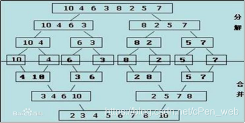
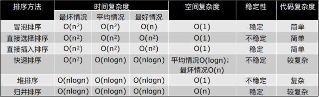

### 文章目录


- [#31 归并排序实现](https://blog.csdn.net/cPen_web/article/details/110411574#31_09_7)
- [#32 归并排序复杂度](https://blog.csdn.net/cPen_web/article/details/110411574#32_09_107)
- [#33 NB三人组小节](https://blog.csdn.net/cPen_web/article/details/110411574#33_09NB_126)
- [#34 希尔排序](https://blog.csdn.net/cPen_web/article/details/110411574#34_09_176)
- [#35 希尔排序讨论](https://blog.csdn.net/cPen_web/article/details/110411574#35_09_295)
- [#36 计数排序](https://blog.csdn.net/cPen_web/article/details/110411574#36_09_381)
- [#37 桶排序介绍](https://blog.csdn.net/cPen_web/article/details/110411574#37_09_476)
- [#38 桶排序实现](https://blog.csdn.net/cPen_web/article/details/110411574#38_09_503)
- [#39 基数排序介绍](https://blog.csdn.net/cPen_web/article/details/110411574#39_09_600)
- [#40 基数排序实现](https://blog.csdn.net/cPen_web/article/details/110411574#40_09_663)

# #31 归并排序实现

```
#一次归并：假设列表分2段有序，将它合成1个有序列表

#而真正的列表  不是2段有序。怎么用？用递归的思想

### 归并排序 —— 使用归并
# 分解：将列表越分越小，直至分成一个元素。
# 终止条件：一个元素是有序的。
# 合并：将两个有序列表归并，列表越来越大。

# 注：1个元素 是有序的。将2个元素 合并成1个长度为2的有序列表。2个长度为2的有序列表 合并成1个长度为4的有序列表…………最后1步 整个都有序了
#-----------------------------------------
def merge(li, low, mid, high):		# 注：一次归并的代码
    i = low
    j = mid + 1
    ltmp = []
    while i<=mid and j<=high:   # 只要左右两边都有数
        if li[i] < li[j]:
            ltmp.append(li[i])
            i +=1
        else:
            ltmp.append(li[j])
            j += 1
    # while执行完，肯定有一部分没数了
    while i <= mid:
        ltmp.append(li[i])
        i += 1
    while j <= high:
        ltmp.append(li[j])
        j += 1
    li[low:high+1] = ltmp
#----------------------------
#用到递归，终止条件：剩1个或0个, 就有序了
def merge_sort(li, low, high):  # low 第1个元素下标，high 最后1个元素下标
    if low < high:  # 至少有2个元素，递归	# 注：终止条件
        # 递归的来看，把归并排序看成只有3步
        # 1、归并排序左边
        # 2、归并排序右边
        # 3、把左边右边进行归并
        mid = (low + high) // 2     # 算mid  整除
        merge_sort(li, low, mid)    # 递归左边
        merge_sort(li, mid+1, high) # 递归右边
        # 左边右边都递归排序完了(左边右边 都有序了)，最后一步把2边归并
        merge(li, low, mid, high)
#汉诺塔，3步。
#第1步，把 n-1 个块移块来。不用管着 n-1里面什么情况，因为有递归终止条件，所以里面已经弄好了的
### 归并排序也是3步，1、把左边排好序；2、把右边拍好序；3、把左边和右边归并

li = list(range(1000))
import random
random.shuffle(li)
print(li)
merge_sort(li, 0 ,len(li)-1)
print(li)
#结果为
# [479, 490, 190, 90, 923, 805, 519……]
# [0, 1, 2, 3, 4, 5, 6, 7, 8, 9, 10……]
#####################################################
#精简代码：
def merge(li, low, mid, high):
    i = low
    j = mid + 1
    ltmp = []
    while i<=mid and j<=high:   # 只要左右两边都有数
        if li[i] < li[j]:
            ltmp.append(li[i])
            i +=1
        else:
            ltmp.append(li[j])
            j += 1
    # while执行完，肯定有一部分没数了
    while i <= mid:
        ltmp.append(li[i])
        i += 1
    while j <= high:
        ltmp.append(li[j])
        j += 1
    li[low:high+1] = ltmp

def merge_sort(li, low, high):
    if low < high:  # 至少有2个元素，递归
        mid = (low + high) // 2
        merge_sort(li, low, mid)
        merge_sort(li, mid+1, high)
        merge(li, low, mid, high)

li = list(range(1000))
import random
random.shuffle(li)
print(li)
merge_sort(li, 0, len(li)-1)
print(li)
#结果为
# [976, 2, 796, 330, 657, 28, 638, ……]
# [0, 1, 2, 3, 4, 5, 6, 7, 8, 9, 10……]
#####################################################
#写到后面  这是从小到大的打印，第一次执行到 merge(li, low, mid, high)的时候，肯定是2个长度是1的，归并到1个长度是2的
```


# #32 归并排序复杂度

编辑


```
#通过过程来看
#注：上面分解的过程不看，看下面 合并的过程
#注：4 10	3 6 变成 3 4 6 10 ，…… 2 5 7 8，这是做了1次归并。1次归并的时间复杂度是O(n) （merge函数） 也可以理解为 3 4 6 10   2 5 7 8 整个的把整个列表遍历了1遍（左边遍历+右边遍历 = 整个遍历1遍），所以1次归并复杂度是O(n)。每一层复杂度 也都是O(n)，一共有logn层，所以归并排序时间复杂度O(nlogn)
#涉及到折半、二叉树  劈半的 ，都是有logn的。每层是n，有logn层，所以复杂度是O(nlogn)

#归并排序	时间复杂度：O(nlogn)
#归并排序	空间复杂度：O(n)
#注：递归有空间复杂，而且ltmp开了1个临时变量来存它，最后1次归并的时候ltmp要开成整个数组长度那么大 来存它，所以它的空间复杂度叫O(n)
#注：之前的算法叫原地排序，没有说要额外申请1个列表。归并排序额外的空间。
#注：Python的sort方法，内部实现 基于归并排序的
```


> **#归并排序 时间复杂度：O(nlogn)** 
>
> **#归并排序 空间复杂度：O(n)**

# #33 NB三人组小节

```
### NB三人组小结
# ·三种排序算法的时间复杂度都是O(nlogn)
# ·一般情况下，就运行时间而言：
#       ·快速排序 < 归并排序 < 堆排序
# ·三种排序算法的缺点：
#       ·快速排序：极端情况下排序效率低    # 注：缺点：倒序的情况O(n**2) 解决：随机化版的快排
#       ·归并排序：需要额外的内存开销     # 注：缺点：额外的内存开销
#       ·堆排序：在快的排序算法中相对较慢   # 注：缺点：3个中较慢

#注：它们3个时间复杂度都是O(nlogn)
#快排 最快
#归排 第2
#堆排 最慢

# 有快慢之分，因为 nlogn  前面会省去一些倍数
#代码复杂度  看好不好写 作者瞎编的
```


编辑


```
#注：冒泡排序 - 最好情况 O(n)	这是改进后的冒泡排序，如果1趟中没有发生交换，那么它就不用再继续了。如果整个是已经排好序了的，那么它是O(n) （这个没有什么用，基本不会出现）
#注：快速排序 - 最坏情况 O(n**2)
#注：快速排序 空间复杂度 平均情况O(logn) 最坏情况O(n)
# 注：怎么理解？快速排序也是原地排序，但是空间复杂度 如果这个算法需要1个列表，那么是O(n)，如果开的是1个n*n的二维列表，那么是O(n**2)，如果 递归 ，递归需要用到系统占的空间（函数要往下一层一层的走，你走了多少层，要存到上一层那个函数的位置，每走1层需要消耗O(1)的空间复杂度）快速排序平均要走logn层，递归logn层，所有平均情况下 消耗logn的空间复杂度。最坏的情况 递归走了n层 需要的时间复杂度是O(N**2) ,需要的空间复杂度是O(n**2)。存1层函数需要1，存了n层函数，相当于是存了函数占的位置的列表。递归函数也是有空间消耗的
#注：归并也有空间消耗，但是没什么事，因为 它已经开辟了1个列表了O(n)，它递归需要的空间复杂度是logn,O(n)比O(logn)大,所以logn就没了

#注：排序的稳定性：当2个元素值一样的时候，保证他们的位置不变

#列子
3 2 1 2 4
稳定的排序：能保证这两个2的位置不变。换不换其实是有所谓的，比如字典
{‘name’:’a’, ‘age’:18}
{‘name’:’b’, ‘age’:20}
{‘name’:’a’, ‘age’:25}

稳定的排序  保证1、3两个人排完之后顺序不变。不稳定的排序 不能保证这一点

#怎么判断1个排序是稳定的还是不稳定的？
#答：有顺序的，挨个换的。
这些排序都是比较排序，都是需要移动换的
#冒泡排序 稳定，如果它两一样，不换就能保证稳定
#直接选择排序 不稳定，它是跳飞着换的 中间可能隔着好多，扫一遍，选1个小的数和 第一个做交换
#插入排序 稳定，因为它是挨着换的，手里的牌来1张，跟前面的比 换，再跟前面的比 换
#快排 不稳定，因为快排也是飞着换的，从右边找……从左边找
#堆排序 不稳定，飞着换的，从父亲到孩子，但是它是列表。列表父亲到孩子 中间还是隔着很多值
#归并排序 稳定，因为 归并是挨着的。之前很多语言包括 C++ Java，它们默认的排序sort 都是快速排序，因为快速排序快，但是Python Java 很多语言都改了，不用快速排序，因为它不稳定。所以Python使用基于 归并排序的  tmsort，那个sort方法也是稳定的
```


# #34 希尔排序

```
### 希尔排序
# 希尔排序(Shell Sort)是一种分组插入排序算法。
# 首先取一个整数d1=n/2，将元素分为d1个组，每组相邻2个元素之间距离为d1，在各组内进行直接插入排序；
# 取第二个整数d2=d1/2，重复上述分组排序过程，直到 di=1，即所有元素在同一组内进行直接插入排序。
# 希尔排序每趟并不使某些元素有序，而是使整体数据越来越接近有序；最后一趟排序使得所有数据有序。

#注：希尔排序 其实是从 插入排序 变形过来的
#注：它是一种叫做分组插入排序算法

#
# 5 7 4 6 3 1 2 9 8     # 注：长度为9的列表  9 / 2 = 4
# d = 4
#-----------------
#把整个列表分成4组：间隔为4 的元素 分在一组里
#注：以下间隔为4
# 5       3       8     #注：5 3 8做1次插入排序 排好了
#   7       1           #注：7 1 插入排序 排好了
#     4       2         #注：4 2 插入排序 排好了
#       6       9       #注：6 9 插入排序 排好了
#-----------------
#注：排好后的情况
# 3       5       8
#   1       7
#     2       4
#       6       9
#排好了之后 回来，回来 。 回来之后 进行下一次
# 3 1 2 6 5 7 4 9 8
#------------------
#接下来d2=d/2=2,把它分成2组，间隔为2的是一组
#如下 d=2
# 3   2   5   4   8
#   1   6   7   9
#然后再每组里进行插入排序，如下
# 2   3   4   5   8
#   1   6   7   9
#然后再回去，如下
# 2 1 3 6 4 7 5 9 8
#然后d = 2 / 2 = 1
#d 到1的时候 相当于直接做1次插入排序（排完1次）
#如下 排好了，就结束希尔排序算法
# 1 2 3 4 5 6 7 8 9

#为什么希尔排序 要搞前面d=2, d=4？
#希尔排序每趟并不使某些元素有序，而是使整体数据越来越接近有序；最后一趟排序使得所有数据有序
#注：趟的意思是每次拿1个d 然后每组之间排1次序
#注：可以用数学方法证明：每一趟结束后，整个列表 逆序的数 会越来越少。这是希尔排序的原理

###怎么用代码实现希尔排序？ 其实希尔排序每组之间用的插入排序，所以可以用插入排序的算法 做一些修改
#刚开始len=9。d=4把它分成4组的时候，整个算法 并不是一组一组的来，而是同时的来
# d=4的时候，假设手里有4张牌( 5 7 4 6 )，但手里有的牌分成4 组，拿3 跟手里前1张牌(5)去比，前1张牌（5）往后挪。
# 3跟前1张牌去比 是跟5去比，而不是跟6去比。如果3下标是i的话，那么就是跟下标i-d的去比
# 1这个位置 同样是跟 i-d这张牌去比。2这个位置同样i-d (4)去比，9同样跟i-d (6)去比
# 8进来， 看 3 和 5。所以它也是3 1 2 9 8 的顺序过程
#-----------------------
# 5       3       8
#   7       1
#     4       2
#       6       9
def insert_sort_gap(li, gap):   # 注：插入排序增加1个gap参数。gap参数:分的组
# d=4时，2个元素之间的gap也是4
    #for i in range(1, len(li)):
    #注：插入排序是从1到 n-1
    for i in range(gap, len(li)):
    #注：从3开始，3的下标是gap 就是4 。所以从gap开始 到最后
        tmp = li[i] # 手里的牌存起来
        # j = i - 1 # 原本的算法 是看摸到的牌的前1张牌，那是 手里的牌
        j = i - gap # j指的是手里牌的下标,i是摸到的牌的下标 ，比如j = i - 4
        while j >= 0 and li[j] > tmp:
            # li[j + 1] = li[j]
            li[j+gap] = li[j] # 注：意思是手里的牌 比摸到的牌大的时候，把手里的牌 往后移gap个（因为分组）
            # j = j - 1   # 注：以前是j往前看 ，看手里 前面那张牌
            j = j - gap # 注：现在是看手里前面的牌，因为分组
        # li[j + 1] = tmp
        li[j+gap] = tmp # 注：总结起来，就是把 1 都换成 gap
#注：现在这个插入就是 d选定了之后，做这么1次 insert_sort_gap

def shell_sort(li): # 注：希尔排序
    d = len(li) // 2    # 注：首先选定d 长度//2
    #然后每次循环 做1次(li,gap) 传d 进来，然后d再除以2，直到d变成1的时候 就结束了
    while d >= 1:   # 注：满足条件  做循环
        insert_sort_gap(li, d)
        d //= 2 # 注：d整除2
        #注：最后1次 ，d=2是 ，排序，d//2=1,d=1传入，做排序，d变成0.5 就退出了，满足情况
    # 注：所有while结束后，希尔排序就完成了
#注：insert_sort_gap可以写在里面，但没必要，这样结构清晰些
#注：希尔排序 至少不会比插入排序慢
li = list(range(1000))
import random
random.shuffle(li)
shell_sort(li)
print(li)
#结果为 [0, 1, 2, 3, 4, 5, 6, 7, 8, 9, 10, 11, 12……]
#------------------------------------------------------------------
def insert_sort_gap(li, gap):
    for i in range(gap, len(li)):   # i 表示摸到的牌的下标
        tmp = li[i]
        j = i - gap # j指的是手里牌的下标
        while j >= 0 and li[j] > tmp:
            li[j+gap] = li[j]
            j = j - gap
        li[j+gap] = tmp

def shell_sort(li):
    d = len(li) // 2
    while d >= 1:
        insert_sort_gap(li, d)
        d //= 2

li = list(range(1000))
import random
random.shuffle(li)
shell_sort(li)
print(li)
#结果为 [0, 1, 2, 3, 4, 5, 6, 7, 8, 9, 10, 11, 12……]
#------------------------------------------------------------------
```


> **#注：希尔排序 其实是从 插入排序 变形过来的
>  \#注：它是一种叫做分组插入排序算法**

# #35 希尔排序讨论

```
from cal_time import *
#--------------------------------------------
def insert_sort_gap(li, gap):
    for i in range(gap, len(li)):   # i 表示摸到的牌的下标
        tmp = li[i]
        j = i - gap # j指的是手里牌的下标
        while j >= 0 and li[j] > tmp:
            li[j+gap] = li[j]
            j = j - gap
        li[j+gap] = tmp

@cal_time
def shell_sort(li): # 注：希尔排序
    d = len(li) // 2
    while d >= 1:
        insert_sort_gap(li, d)
        d //= 2

#--------------------------------------------
@cal_time
def insert_sort(li):    # 注：插入排序
    for i in range(1, len(li)):
        tmp = li[i]
        j = i - 1
        while j >= 0 and li[j] > tmp:
            li[j + 1] = li[j]
            j = j - 1
        li[j + 1] = tmp

#--------------------------------------------
def sift(li, low, high):
    # li：列表
    # low: 堆的根节点位置
    # high: 堆的最后一个元素的位置
    i = low
    j = 2 * i + 1
    tmp = li[low]
    while j <= high:
        if j + 1 <= high and li[j+1] > li[j]:
            j = j + 1
        if li[j] > tmp:
            li[i] = li[j]
            i = j
            j = 2 * i + 1
        else:
            li[i] = tmp
            break
    else:
        li[i] = tmp
@cal_time
def heap_sort(li):  # 堆排序
    n = len(li)
    for i in range((n-2)//2, -1, -1):
        sift(li, i, n-1)
    for i in range(n-1, -1, -1):
        li[0], li[i] = li[i], li[0]
        sift(li, 0, i - 1)
#--------------------------------------------
import random,copy

li = list(range(100000))
random.shuffle(li)

li1 = copy.deepcopy(li)
li2 = copy.deepcopy(li)
li3 = copy.deepcopy(li)

shell_sort(li1)     # 希尔排序
insert_sort(li2)    # 插入排序
heap_sort(li3)      # 堆排序
#结果为
# shell_sort running time: 0.04743790626525879 secs.
# insert_sort running time: 3.999634027481079 secs.
# heap_sort running time: 0.03893280029296875 secs.

#注：希尔排序的时间比插入排序快很多
#注：跟NB三人组里最慢的的堆排序比，希尔排序 比堆排序 慢。希尔排序还是没有NB三人组快，但是它已经不错了
#注：上面这种只是希尔排序的1种实现，希尔排序还有很多很多种不一样的实现方式

# 希尔排序的时间复杂度讨论比较复杂，并且和选取的gap序列有关。
#注：什么叫gap序列？我们这种实现方式的gap序列是 n/2  ，n/4 ，n/8 ，n/16………
#不太好讨论
```


# #36 计数排序

```
#注：计数排序时间复杂度是O(n)，非常快，但是有限制
### 计数排序
# 对列表进行排序，已知列表中的数范围都在0到100之间。设计时间复杂度为O(n)的算法。
#可能列表长度是100万，但是里面的数是0-100，有很多重复的
#之前讲的排序方法 叫做比较排序，通过2个数的比较。数学上可以证明 比较排序的时间复杂度最快是 O(nlogn)

#计数排序不是用比较排序，是用数一下

# 1 3 2 4 1 2 3 1 3 5
#注：1-->往1位置上加1,3-->往3位置上加1…………
#扫1遍
# 0   0
# 1   3		# 注：1+1+1
# 2   2		# 注：1+1
# 3   3		# 注：1+1+1
# 4   1		# 注：+1
# 5   1		# 注：+1
#注：数了1下，这个列表里3个1,2个2,3个3,1个4,1个5
#注：接下来 1 1 1 2 2 3 3 3 4 5
def count_sort(li, max_count=100):   #注：max_count=100 默认最大的数为100
    #除了需要li列表，还需要max_count 需要知道这个数最大是多少
    #如果最大的值是100的话，需要101  0-100
    count = [0 for _ in range(max_count+1)] # 注：这是打印101个0   [0,0,0,0,……]
    #遍历一下这个，往这个里面加数
    for val in li:
        count[val] += 1 # 注：这里val和下标对应。count的下标范围 0-100
        #每遍历到1个数，就在cout对应的位置上+1
    #这个for循环完了以后，所有的信息都在count里面
    li.clear()  # 把它都写在li里也行，把li清空
    #接下来遍历 0 0      1 3     2 2     3 3     ……
    #不光需要下标，还需要值。下标是这个数是几，值是这个数有几个
    for ind, val in enumerate(count):   # ind下标(数是几) ，val值(数有几个)
        #for循环里面就是说有val个ind，所有要把ind append val次
        for i in range(val):
            li.append(ind)  # 注：把ind  append  val次
        #这个for循环以后，li就已经写回去了
import random
li = [random.randint(0,100) for _ in range(1000)] # 注：0-100的数，生成了1000个
#注：可以这样生成列表 [random.randint(0,100) for _ in range(100000)]
print(li)
count_sort(li)
print(li)
#结果为
# [38, 5, 17, 38, 57, 48, 32……]
# [0, 0, 0, 0, 0, 0, 0, ……1, 1, 1, 1, 1, 1, 1, 1, 2, 2, 2,……}   排好序了
#注：整个算法没有问题，注意：如果0-100里面有个数没有，那么它就是0次，就不会被append
#---------------------------------------------------
from cal_time import *

@cal_time
def count_sort(li, max_count=100):
    count = [0 for _ in range(max_count+1)]
    for val in li:
        count[val] += 1
    li.clear()
    for ind, val in enumerate(count):
        for i in range(val):
            li.append(ind)

@cal_time
def sys_sort(li):# 注：把它包装起来
    li.sort()

import random, copy
li = [random.randint(0,100) for _ in range(100000)]

li1 = copy.deepcopy(li)
li2 = copy.deepcopy(li)

count_sort(li1)	`# 注：计数排序
sys_sort(li2)	# 注：系统自带的sort排序方法
#结果为
# count_sort running time: 0.013960123062133789 secs.
# sys_sort running time: 0.014987945556640625 secs.
#虽然我的语言比它慢，但是我的算法比它快，我照样能打败它
#---------------------------------------------------

#注：时间复杂度。几层循环要知道n是谁，n是li的长度。虽然第2个for循环是2层循环，但是2层循环 count和val都不是n
#注：其实第2个for循环（2层循环），它的时间复杂度是O（n）,因为append操作一定也是n次，最后列表长度要一样（它们加起来复杂度是n）
#注：第一个for循环count[val] += 1操作做了n次，因为n个数
#注：所以整个时间复杂度是O(n)

#注：很快，比NB三人组都要快

#系统自带的sort是C写的，很快
#为什么系统不用计数排序？因为 计数排序有限。需要知道数的范围，排小数就完蛋了。不知道最大值是多少，而且他需要消耗大量的空间，0-100就需要开辟长度100的空间

#计数排序现在只是说在这数，但实际中对字典组成的列表排序，那怎么办？
# 知道年龄0-100之内，对它排序。建0-100的这个长度列表，那么值就不能再数数了，值就变成1个列表，你往里面append 1个对象，就可以了

#比如18下标那个位置上存1个列表，来了1个age18的就把这个append进来，再来1个再append进来，输出的时候就把列表遍历一遍输出
```


# #37 桶排序介绍

```
# 桶排序
# 在计数排序中，如果元素的范围比较大（比如在1到1亿之间）， 如何改造算法？
# 桶排序(Bucket Sort)：首先将元素分在不同的桶中，在对每个桶中的元素排序。

###注：计数排序 就是说 我有一堆数，我知道数的范围，比如 在0-100之内，那怎么样有1个线性时间排序 O(n)时间复杂度的排序，怎么做？
#注：只需要数一下这0-100的数，每个数出现了几次，用1个列表存起来，然后再把列表的的这些次数 依次输出。比如0出现了5次，1出现了3次，2出现了3次，那么先输出5个0，再输出3个1，再输出3个2
#注：那 在计数排序里，如果 元素的范围比较大，比如说范围在1-100万之间，计数排序就不太好用了
#比如说列表长度 就100万不大，但是元素范围 列表里存的数最大的是1个亿，要是用计数排序的话 就需要开1个长度是1亿的列表，比较费空间，占用大量的内存，如何改造？
#怎么改造？从计数排序 引申出来的桶排序
#----------------------------------------------------------
#思路是 1-1亿个数，那么把1-1亿的范围 砍成几个部分，比如说 1-1000万是第1个部分，把所有的1-1000万里的数都扔到这个桶里，然后你把这个桶排好了序
#然后1千万--2千万 第2个桶，2千万--3千万 第3个桶……。把元素分在不同的桶里，然后 对每个桶的元素 让它保持有序，这个方法叫做桶排序

#比如  29 25 3 49 9 37 21 43
#知道这个数最大是49，把它分成5个桶
#  0-9      10-19       20-29       30-39       40-49
#  3 9                  29 25 21      37        49 43
#把3 9 放到第1个桶，第2个桶没有，第3个桶29 25 21 ，第4个桶37，第5个桶49 43
#都放好，然后把每个桶里的元素都排好序。
# 其实把每个元素放到桶里的过程，我就可以在这个基础上做插入，比如说第1个桶是3 和 9，刚进来的是3，再进来9的时候，9比3大 ，就放到后面
#第3个桶是20-29，它是先29进来，下一个进来是25，进来25发现25比29小，它两交换1下，25放到29的前面，就维持这个，保证这个桶是有序的
#整个列表输入完了，这些桶内就有序了，再依次把 这些桶的东西都输出出来，就是整个东西都有序了
#这就是桶排序的基本概念
```


# #38 桶排序实现

```
def bucket_soet(li, n=100, max_num=10000): # 注：li是列表，n是把它默认分成多少个桶(100个桶)，max_num 数的范围 是10000
#注：表示桶排序把这些元素分到100个桶里，知道这个数的最大值是10000
#注：不知道数的最大范围，但是 也是在某个场景下需要使用桶排序，也可以。可以规定1个最大数，比如说规定最大数是1亿，出来1个1亿零1怎么办？把它放到最后1个桶里面（不是新的桶，加到放到1亿的那个桶里）
#n=100 桶号从0到99 即 0到n-1
    buckets = [[] for _ in range(n)]    # 注：列表生成式创建了1个二维列表，所有的一维的都是空的（桶是空的）
    #注：创建n个桶
    #注：需要创建好的桶buckets，buckets应该是1个桶的列表，桶本身又是1个列表，1个桶里可能存好多个数，所有相当于1个二维列表
    for var in li:  # 注：遍历列表里的所有数
        #注：接下来绝定这个数var 放到哪个桶里。现在知道数的范围是0--10000
        # 0 --> 0(0放到0号桶里)，86 --> 0（86放到0号桶里）   # 注：0-99都放到0号桶里
        #100 --> 199 都放到1号桶里
        #0--10000的数，100个桶，1个桶里放 maxnum // n 个数，默人参数的时候 放100个数
        # i = var // (max_num // n)   #比如var=86，后面的max_num // n = 10000//100 是100，86 //100 是0 放到0号桶里
        # i表示var放到几号桶里
        # 186 //100 =1 放到1号桶里。9999放到99号桶里，10000 放到100号桶，但是没有100号桶，把10000放到99号桶里
        # 有1个问题 :当num=10000的时候，这个i是100 会放到100号桶里，会越界，怎么办？这样写 如下
        i = min(var // (max_num // n), n-1) # i表示var放到几号桶里
        #注：桶号是从0到n-1 (n=100),桶号从0-99，也就是说最大的是99号桶
        #注：它们两中取1个最小值，即使 max_num // n = 100,100跟99，只要大于99的，最后取出来全是99
        buckets[i].append(var)  # 注：把var放到i号桶，把它放过去了
        # 这个for循环结束后是 把var加到桶里面
        # 注:桶排序有不同的写法，我们可以就放过去就完事了，等这个for循环写完了，整个桶里元素该放的就放过去了，接下来对每个桶排序就可以了，这种写法简单一点，接下来写个for循环，对于每个桶再排序
        #注：另外一种写法，放进去的过程中顺便就排序了，不是最后再排序。append一个元素，我就让它有序，那怎么让它有序呢？
        # [0,2,4,3] # 列表里已经让它有序了，如果它前面有元素，那前面一定是有序的。这个时候append一个3，接着只需要冒泡。只要前面1个数比3大，我就交换一下，前面的数比它小 就停掉
        #-------------------
        ### 这个for循环结束之后，是保持桶内的顺序
        for j in range(len(buckets[i])-1, 0, -1): # 注：j应该从最后1个元素开始（buckets[i]这个桶的最后1个元素）
        # 注：到第2个元素停，因为是跟它前面一个元素比。冒泡排序 for j 也是这样，因为它要跟2个比，所以得空出来1个，不是是从0到n-1
        # for j 要么从 1到n-1，遍历后边的 拿它和前面的元素比；要么从0到n-2,拿它跟后边元素比
        # 所以如果是从n-1开始，那么是到1号位置为止。到1号位置 写0 ，因为后不包，写0 最多j取到1
            if buckets[i][j] < buckets[i][j-1]: # 注：也就是说这个元素 小于它前面那个元素 ，那我就交换它		# 注：前面那个元素下标为j-1
            #如果后面的数比前面的数小,交换位置
                buckets[i][j], buckets[i][j-1] = buckets[i][j-1], buckets[i][j]
            #[0,2,4,1]  # 注：j的位置是1，拿j跟j-1这个位置比。1跟4交换 [0,2,1,4]
                #[0,1,2,4] 注：1跟2交换
            else: #如果后面的数比前面的数大。比如1已经是插在正确位置上的，就直接break，不用继续了，即使前面再有-2，-1，都和它没关系了
                break
        #这个for循环结束之后，是保持桶内的顺序
    # 等外面的for循环完了以后，就是 所有的元素都被放到桶里，而且桶里是有序的。到这个位置，桶就已经维持好了
    # 接下来把桶里的数挨个输出出来就可以了
    sorted_li = []  # 注：建立空列表，准备接收桶里的那些数据
    for buc in buckets: # 注：遍历一下这个桶，buc 是一维列表，是每一个桶
        sorted_li.extend(buc)   # 注：就把这个一维列表buc加到sorted_li列表的后面
    return sorted_li    # 注：返回排序好了的列表

import random
li = [random.randint(0,10000) for i in range(100000)]   # 随机创建列表 10万个 0-10000 的数
# print(li)
li = bucket_soet(li)
print(li)
#结果为 [0, 0, 0, 0, 0, 0, 0, 0, 0, 0, 0, 1, 1, 1, 1, 1, 1, 1……]

#注：如果列表长度特别大，但是元素的范围也特别大，这种情况还是不太适合用桶排序，还是用NB三人组比较快，因为桶排序里面 还是类似于插入排序 类似于n**2的东西
#注：桶排序用的不是很多，不是特别重要，它一个近亲用的比它还多一点，是接下来学的基数排序
#--------------------------------------------------------------
#精简代码
def bucket_sort(li, n=100, max_num=10000):
    buckets = [[] for _ in range(n)]    # 创建桶
    for var in li:
        i = min(var // (max_num // n), n-1) # i表示var放到几号桶里
        buckets[i].append(var)  # 把var加到桶里面
        # 保持桶内的顺序
        for j in range(len(buckets[i])-1, 0, -1):
            if buckets[i][j] < buckets[i][j-1]:
                buckets[i][j], buckets[i][j-1] = buckets[i][j-1], buckets[i][j]
            else:
                break
    sorted_li = []
    for buc in buckets:
        sorted_li.extend(buc)
    return sorted_li

import random

li = [random.randint(0,10000) for i in range(100000)]
li = bucket_soet(li)
print(li)
#结果为 [0, 0, 0, 0, 0, 0, 0, 0, 0, 0, 0, 0, 0, 1, 1, 1, 1,……]
#--------------------------------------------------------------
#桶排序的效率问题
# 桶排序的表现取决于数据的分布。也就是需要对不同数据排序时采取不同的分桶策略。
#注：什么叫数据的分布？比如说 知道桶排序 是0-1万。如果是叫平均分布，类似于randint,它取0和取1的概率一样，大概这些数出来后个数都差不多
#注：但是如果说知道这个排序是0-1万，但是它99%的数都是在9000-1万，那么99%的数都会落到最后1个桶里，如果是1000分一个桶的话，都会落到最后1个桶，这样的话会导致最后1个桶特别多的数
#注：分桶是为了它快，为了把数分到不同的桶里，那每个桶里数就少了，少了之后它排序肯定快，最后排序就快了
#注：但是如果数据分布不均匀，如果直接扔到最后那个大桶里，那就没用了
#注：所有桶排序的时间复杂度 取决于数据的分布，看数据究竟是怎么样的。
#注：对不同的数据排序时采取不同的分桶策略。0-9000分第1个桶,9000到10000 分100个桶
# 平均情况时间复杂度：O(n+k)  # k是根据n和m算出来的东西，讨论起来比较复杂
#注：n是数组列表的长度，m是桶的个数。平均情况下是一个类似于线性的复杂度
# 最坏情况时间复杂度：O(n**2 * k) 最坏情况是n方乘以k
# 空间复杂度：O(nk)   # 因为桶排序占用了1个桶的空间，所有桶的空间是n*k     # 注：k大概表示1个桶平均能有多长（多少个数）

#桶排序的代码 现在写出来的 也只是1个初步的版本。 尝试优化的部分：不是插入以后立即对桶排序，而是先插入，插入完了以后再对n个桶进行快排之类的排序
```


# #39 基数排序介绍

```
### 基数排序
# 多关键字排序：加入现在有一个员工表，要求按照薪资排序，工资相同的员工按照年龄排序。
#注：第1关键字是工资，第2关键字是年龄
#       ·先按照年龄进行排序，再按照薪资进行稳定的排序。
#注：这是多关键排序的一种实现方式，不一定说多么快，肯定有更快地，但是它是一种方式
#注：稳定的排序：如果a和b一样，排序前和排序后，a和b的相对位置不变
#注：稳定的排序：如果数本来是1 2 1，排完了序之后，第1个1还在第2个1前面
#注：先按照年龄排序，年龄一样的顺序就固定下来了，再按照薪资进行稳定的排序，如果2个人薪资不一样高，那么就是按照薪资进行排序，高的在前面，低的在后面
#注：如果2个人薪资一样高，排序还保证是稳定的，也就是说这个列表里2个工资稳定的人，他们2个的顺序没有变。
#注：他们2个的顺序 已经是按年龄排好序的，所以这个做法成立

# 对32,13,94,52,17,54,93排序，是否可以看做多关键字排序？
#注：52 和 94 这2个数的顺序，人来看的话，先比十位，9比5大，完事了
#注：比4 93 ，先比十位  9  一样大，再看个位 4 比3 大，说明94大
#注：这也是一个多关键字排序。十位数上的时候第1关键字，个位数上的是第2关键字
#注：先比十位，十位大 它就大。如果十位一样大，再看个位，个位大的那个大

#注：按照之前的思路来。先按照低的关键字进行排序：先按照年龄进行排序，类比 先按照个位进行排序
#注：按照桶排序的思路来看
#注：第1步 下面分了 0 1 2 3 4 5 6 7 8 9  十个桶

#               32 13 94 52 17 54 93
# 0  1  2  3  4  5  6  7  8  9   十个桶
#       32 13 94 52 17 54 93 这七个数 先按照个位分桶

         52  93  54
         32  13  94          17
# 0   1   2   3   4   5   6   7   8   9     # 注：到这一步 按照个位数分好桶
#注：接下来依次输出（就是把这个列表 从开始到后边 依次输出） 如下
        # 32 52 13 93 94 54 17  # 注：这个过程就相当于是个位进行排序了
#注：这个过程就相当于是个位进行排序了（2在前面，3在后面，4在后面，最后是7）
#注：没有做任何交换，步骤：分桶，分桶完了之后 挨个出来，一定个位数小的在个位数大的前面
#注：个位数排序之后，再怎么办？按十位进行排序 ，按十位进行分桶
         32 52 13 93 94 54 17
# 0   1   2   3   4   5   6   7   8   9

      17              54              94
      13      32      52              93
# 0   1   2   3   4   5   6   7   8   9
#注：32分到3号桶，52分到5号桶…………
#注：按照十位又分好桶了。接下来再把桶里的数 进行出来
        13  17  32  52  54  93  94          #注：这就排好序了
# 0   1   2   3   4   5   6   7   8   9
#注：排序的过程：看了一下十位数个位数，然后输出，就排好序了。

原理：
32 13 94 52 17 54 93
32 52 13 93 94 54 17    # 注：这一步满足 所有个位数小的在个位数大的前面
#注：比如说 93 和 94 ，这个93 一定在94的前面，因为个数数来说4比3大
#注：再按照十位数进行分桶的时候，他两可能在1个桶，但是因为现在的顺序是3在4的前面，所以93一定在94的前面，最后出来的一定是93 再94
#注：这是十位数一样情况
#注：如果十位数如果不一样的话，那它肯定会分到不同的桶里。比如52和93，52肯定分的桶比93多，所以52肯定先比93出来
13  17  32  52  54  93  94
#注：对于2位数的来说，十位一样或者十位不一定，都是有序的
#注：如果不是2位数，是3位数、4位数、5位数，怎么办？
#注：比如说5位数，最大数可能是9万，做5次，先按照个位，再按照十位，再按照百位，再按照千位，再按照万位，一样的过程
#注：如果最大的数是几位数，你就是几次
#注：比如说有2个数，1个是5位数，1个是2位数，怎么办？2位数 你也可以看成5位数，前面加0
#注：分桶的时候 如果是2位数跟5位数的话，先按照个位分桶，再按照十位分桶，百位分桶的时候，2位数就分到0桶了，千位、万位分桶的时候，它都分到0桶
```


# #40 基数排序实现

```
def radix_sort(li):
    #基数排序 十位的话做2次，个位先进桶，十位进桶；百位做3次；相当于几次是一个几次的循环
    #注：循环的次数怎么确定？根据最大值确定
    max_num = max(li)   # 注：确定最大值。如果最大值是99 ，做2次。
    #注：最大值 9-->1次，99-->2次, 888-->3次, 10000-->5次
    #注：最大数的位数是几，就做几次循环
    #注：怎么确定最大值的位数？2种方法。
    # 1、通过log函数，取以十为底的对数。lg1000=4，lg888的对数是3点几，向下取整 就可以了
    #不知道也没关系
    it = 0  # 注：it 是迭代多少次 iteration # it是第几次分桶。第1次是个位，第2次是十位
    while 10 ** it <= max_num:
    #注：如果最大值是9，进来的话，刚开始是10的0次方=1,1<=9，执行一次，分桶 分桶完毕再出来
    #注：然后it+=1,10**1=10，10大于9，跳出了
    #注：888也是一样，刚开始10**0<=888，1次；接下来10**1=10 <= 888,2次；10**2=100 <= 888,3次；10**3 > 888，这才大于
    #注：所有888做了3次
    #注：如果是10000，it=4的时候，是小于等于，它还是执行，等于4的时候是第5次，也没有问题
        buckets = [[] for _ in range(10)]   # 注：分10个桶，桶的个数是一定的 0-9
        #注：接下来是分桶，跟介绍桶排序的概念是一样的
        for var in li:
        #注：对于每一个元素，把它放到桶里去
        #注：怎么确定它分到几号桶？ 取决于当前看的它哪一位数
        #注：it=0时，看的是个位，it=1 看的十位，it=2 看的百位
            # 例子：987 it=1，取8出来。it=2  取第3位9  987//100->9 9%10=9
            #it=0取7，it=1取8，it=2取9
            #怎么取第2位：987//10 -->98，98%10 -->8。先整除10，再模10
            #注：1个数，取个位数 987%10，模10就可以了（取余运算）
            #注：取第2位，百位  987//10 -->98  98%10 -->8
            #注：取第3位，千位  987//100 -->9  9%10-->9
            dight = (var // 10 ** it) % 10  # 注：分到几号桶和it的关系是这个
            buckets[dight].append(var)    # 注：找到var对应的桶，追加
        #这个for循环完了后，分桶完成。接着是把元素再取出来 放回到li里
        li.clear()  # 注：先清空 再放回
        for buc in buckets:
            li.extend(buc)
        #注：这个for循环是 把数重新写回li
        it += 1 # 注：it += 1是又重新建桶，然后按下一个分桶，最后再写入li
    #注：这些结束后 li就已经是有序的了

import random
li = list(range(100000))
random.shuffle(li)
radix_sort(li)
print(li)
#结果为 [0, 1, 2, 3, 4, 5, 6, 7, 8, 9, 10, 11, 12, 13, 14,……]
#----------------------------------------------------------------
#精简代码
def radix_sort(li):
    max_num = max(li)   # 最大值 9->1, 99->2, 888->3, 10000->5
    it = 0
    while 10 ** it <= max_num:
        buckets = [[] for _ in range(10)]
        for var in li:
            # 987 it=1  987//10->98 98%10->8;  it=2  987//10->9 9%10->9
            dight = (var // 10 ** it) % 10
            buckets[dight].append(var)
        # 分桶完成
        li.clear()
        for buc in buckets:
            li.extend(buc)
        # 把数重新写回li

        it += 1

import random
li = list(range(100000))
random.shuffle(li)
radix_sort(li)
print(li)
#----------------------------------------------------------------
#注：基数排序和桶排序虽然也是分桶，但是不太一样
#注：桶排序 是直接装1次桶，然后在桶里进行排序
#注：基数排序是装多次桶，先按照个位装好输出，再按照十位装好输出，再按照百位装好输出…… 桶内并没有排序的过程，就是装桶输出，装桶输出……完事
#注：它的顺序是因为：桶是有序的，0 1 2 3 ……0桶比1桶小，所以0桶的数就会先输出，1桶后输出
#注：为什么要装好多次桶才能有序？ 因为多关键字排序。数的大小是先要 首位是第1关键字，然后第2关键字，……
#注：多关键字排好序，先要从小的关键字排好序，然后第2小的关键字排序……最后让整个列表有序
#----------------------------------------------------------------
# 基数排序 -- 代码
def list_to_buckets(li, base, iteration):
    buckets = [[] for _ in range(base)]
    for number in li:
        digit = (number // (base ** iteration)) % base
        buckets[digit].append(number)
    return buckets

def buckets_to_list(buckets):
    return [x for bucket in buckets for x in bucket]

def radix_sort(li, base=10):
    maxval = max(li)
    it = 0
    while base ** it <= maxval:
        li = buckets_to_list(list_to_buckets(list_to_buckets(li, base, it)))
        it += 1
    return li
#注：跟上面写的原理是一样的，只不过分成了几个列表
#----------------------------------------------------------------
# 基数排序 -- 讨论
# 时间复杂度：O(kn)
# 空间复杂度：O(k + n)
# k表示数字位数

#注：时间复杂度：O(kn) ，k表示最大的位数，while循环执行k次 。比如说10000，k就是5；while是执行k次。while里面的一层循环 是O(n)，外面执行k次，所以整个的时间复杂度是O(kn)
#注：空间复杂度：O(k+n)，跟桶排序的空间复杂度一样，因为用了桶
#注：时间复杂度 O(kn)，仍旧把它叫做线性时间的复杂度。
#注：线性时间复杂度：所有O(n)的都叫做线性时间复杂度。计数排序是纯O(n)的，没有k
#注：NB三人组 时间复杂度 O(nlogn)

#---------------------------------------------------
#比较  快排 和 基数排序
from cal_time import *

#快速排序
def partition(li, left, right):
    tmp = li[left]
    while left < right:
        while left < right and li[right] >= tmp: # 从右边找比tmp小的数
            right -= 1          # 往右走一步
        li[left] = li[right]    # 把右边的值写到左边空位上
        while left < right and li[left] <= tmp:
            left += 1
        li[right] = li[left]    # 把左边的值写到右边空位上
    li[left] = tmp              # 把tmp归位
    return left     # mid 是 这个函数返回left值的目的
# 快速排序-框架
def _quick_sort(li, left, right):
    if left < right:    # 至少2个元素
        mid = partition(li, left, right)    # 这个函数返回left值的目的
        _quick_sort(li, left, mid - 1)   # 左边部分
        _quick_sort(li, mid + 1, right)  # 右边部分

#快速排序马甲
@cal_time
def quick_sort(li):
    _quick_sort(li, 0, len(li)-1)

#基数排序
@cal_time
def radix_sort(li):
    max_num = max(li)   # 最大值 9->1, 99->2, 888->3, 10000->5
    it = 0
    while 10 ** it <= max_num:
        buckets = [[] for _ in range(10)]
        for var in li:
            # 987 it=1  987//10->98 98%10->8;  it=2  987//10->9 9%10->9
            dight = (var // 10 ** it) % 10
            buckets[dight].append(var)
        # 分桶完成
        li.clear()
        for buc in buckets:
            li.extend(buc)
        # 把数重新写回li
        it += 1


import random,copy

li = list(range(100000))
random.shuffle(li)

li1 = copy.deepcopy(li)
li2 = copy.deepcopy(li)

quick_sort(li1) # 快速排序 nlogn    logn  是以2为底的log    logn=log(2,n)
radix_sort(li2) # 计数排序 kn  k=lgn    以10为底的n的对数   k=log(10,n)。以10为底的对数 比以2为底的对数小
#比如说 n=1024时，logn=10,k=4(因为1024 4位)，所以一般情况 ，基数排序更快
#结果为
# quick_sort running time: 0.27227091789245605 secs.
# radix_sort running time: 0.16356253623962402 secs.

#注：基数排序更快，因为它是线性时间复杂度。k是6 (100000), 这个k其实也是log，但是这个k其实是以10为底的log

#----
import random,copy
li = [random.randint(0,10000000000) for _ in range(100000)]

li1 = copy.deepcopy(li)
li2 = copy.deepcopy(li)

quick_sort(li1) # nlogn
radix_sort(li2) # kn
#结果为
# quick_sort running time: 0.30617761611938477 secs.
# radix_sort running time: 0.44879937171936035 secs.
#注：但是这种情况 基数排序比快排慢，基数排序效率下降
#注：快排     nlogn，n 是100000 ，有关
#注：基数排序 kn，   k 是 10000000000 。这个数加大，k就会加大
#注：所以基数排序 不一定都比快排要快，它和数的范围有关
#-------------------------------------------------------------
#注：字符串也可以排，字符串的排序也是和数字一样，第1位一样，比第2位……，第3位……，第4位……
#注：字符串 分桶就分成26个桶（如果考虑ASCII码，就分成128个桶；考虑小写字母 分成26个桶）
#注：先按照最后1位来 入桶，然后倒数第2位入桶，倒数第3位入桶……
#注：和整数不一样的是，如果说字符串是abcd 和ab  ，它们2个比，长度不一样，整数是在前面加0，字符串不是，是在后边加0
#注：所谓加0  其实就是加1个比所有数都小的字符
#注：因为整数比的时候 （比如 123  和 12），先比的是1 和 空；但是字符串比的话（比如 abcd 和 ab00） 是先比a和a，然后再比b和b，然后再比c和空……，所以字符串是后边加0
#注：小数不太好做，因为小数涉及到精度问题，所有要研究一下小数的底层的实现，不太好做
#注：但是 基数排序的限制：它的效率和数字的分布有关，如果数字有特别大的，但是range比较小，就不太适合，因为k会很大
#注：但是基数排序还是很快的，但是基数排序 空间上也有消耗，需要消耗1个桶。空间上的消耗其实也是非常巨大的
#注：虽然它很快，但是大多数的时候，使用的是快速排序，或者是Python里的tim排序（归并排序的一种改进）
#注：最常用的还是 LowB三人组 和 NB三人组，实用性和思想、面试
```


> 探讨一下学习这些算法的方式：
>
> 1、理解透这些排序算法
>
> 2、自己看代码写注释
>
> 3、删除代码，写注释
>
> 4、对照自己的注释写代码
>
> 5、运行，对比、调试