# #71 [二叉搜索树](https://so.csdn.net/so/search?q=二叉搜索树&spm=1001.2101.3001.7020)：查询


```
import random

class BiTreeNode:
    def __init__(self, data):
        self.data = data
        self.lchild = None  # 左孩子
        self.rchild = None  # 右孩子
        self.parent = None

class BST:
    def __init__(self, li=None):
        self.root = None
        if li:
            for val in li:
                self.insert_no_rec(val)
    # 递归写法
    def insert(self, node, val):
        if not node:
            node = BiTreeNode(val)
        elif val < node.data:
            node.lchild = self.insert(node.lchild, val)
            node.lchild.parent = node
        elif val > node.data:
            node.rchild = self.insert(node.rchild, val)
            node.rchild.parent = node
        return node
    # 不递归的写法
    def insert_no_rec(self, val):
        p = self.root
        if not p:               # 空树
            self.root = BiTreeNode(val)
            return
        while True:
            if val < p.data:
                if p.lchild:
                    p = p.lchild
                else:           # 左孩子不存在
                    p.lchild = BiTreeNode(val)
                    p.lchild.parent = p
                    return
            elif val > p.data:
                if p.rchild:
                    p = p.rchild
                else:
                    p.rchild = BiTreeNode(val)
                    p.rchild.parent = p
                    return
            else:
                return

    #注：查询：有递归版本 和 非递归版本
    def query(self, node, val):   #注：递归版本  都要带一个node
    #注：因为node是用来递归的
        if not node:    #注：如果 node是空 或者是 往里找找到最底层 ，就是找不到 ,递归的终止条件
            return None #注：就返回None
        #注：剩下的话 分3种情况
        if node.data < val: #注：如果val大于它 ，就往右边找
            return self.query(node.rchild, val) #注：return 返回查询的结果 node
        elif node.data > val:   #注：如果val小于它 ，就往左边找
            return self.query(node.lchild, val)
        else:       #注：第3 种情况，等于，就直接返回node
            return node
    #注：非递归 的查询
    def query_no_rec(self, val):
        p = self.root   #注：从p开始找
        while p:    #注：只要p不是空   3种情况
            if p.data < val:    #注：去右边找
                p = p.rchild
            elif p.data > val:  #注：往左边找
                p = p.lchild
            else:   #注：情况3：等于  直接返回p
                return p
        #注：如果说 循环执行完了，从这出来了 ,p是空的，说明找不到
        return None #注：就返回None

li = list(range(0, 500, 2)) #注：生成的都是偶数
random.shuffle(li)

tree = BST(li)
#注：非递归的  查询
print(tree.query_no_rec(4)) #注：返回的是 node对象
#结果为 <__main__.BiTreeNode object at 0x0000014998433340>
print(tree.query_no_rec(4).data)
#结果为 4
#注：也没有别的data。也可以说 data  这里面有1个key，1个value，判断相等不相等按照key来排，获取的是value，就跟字典差不多
print(tree.query_no_rec(3)) #注：3不存在  ，因为 里面全是偶数
#结果为 None
```


精简代码

```
class BiTreeNode:
    def __init__(self, data):
        self.data = data
        self.lchild = None   # 左孩子
        self.rchild = None  # 右孩子
        self.parent = None

class BST:
    def __init__(self, li=None):
        self.root = None
        if li:
            for val in li:
                self.insert_no_rec(val)

    def insert(self, node, val):
        if not node:
            node = BiTreeNode(val)
        elif val < node.data:
            node.lchild = self.insert(node.lchild, val)
            node.lchild.parent = node
        elif val > node.data:
            node.rchild = self.insert(node.rchild, val)
            node.rchild.parent = node
        return node

    def insert_no_rec(self, val):
        p = self.root
        if not p:               # 空树
            self.root = BiTreeNode(val)
            return
        while True:
            if val < p.data:
                if p.lchild:
                    p = p.lchild
                else:           # 左孩子不存在
                    p.lchild = BiTreeNode(val)
                    p.lchild.parent = p
                    return
            elif val > p.data:
                if p.rchild:
                    p = p.rchild
                else:
                    p.rchild = BiTreeNode(val)
                    p.rchild.parent = p
                    return
            else:
                return

    def query(self, node, val):	#注：递归查询
        if not node:
            return None
        if node.data < val:
            return self.query(node.rchild, val)
        elif node.data > val:
            return self.query(node.lchild, val)
        else:
            return node

    def query_no_rec(self, val):	#注：非递归查询
        p = self.root
        while p:
            if p.data < val:
                p = p.rchild
            elif p.data > val:
                p = p.lchild
            else:
                return p
        return None

li = list(range(0, 500, 2))
random.shuffle(li)

tree = BST(li)
print(tree.query_no_rec(3))
#结果 None
```


#   #72 二叉搜索树：删除

> 
>  二叉搜索树 – 删除操作
>  1.如果要删除的节点是叶子节点：直接删除


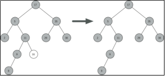编辑


> 2.如果要删除的节点只有一个孩子：将此节点的父亲与孩子连接，然后删除该节点。

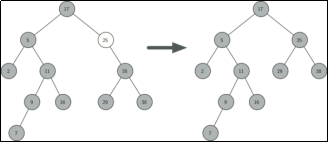编辑


> 3、如果要删除的节点有两个孩子：将其右子树的最小节点（该节点最多有一个右孩子）删除，并替换当前节点。

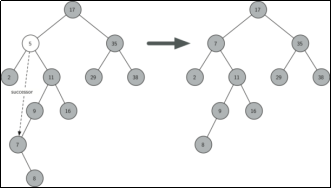编辑
 

```
#注：删除比较复杂 ，分3种情况
#注：情况1：如果要删的节点是 叶子节点；直接删除 （因为它没有孩子）

 

#注：情况2：如果要删除的节点只有一个孩子；将此节点的父亲与孩子连接，然后删除该节点。（比如删25；把孩子17跟父亲35连起来，再删除25节点。左孩子也一样）
#注：不管左孩子、右孩子，都连在17的右边，因为它们肯定比17大。
#注：特殊情况：如果要删除的节点 是根，怎么办？比如说只有 17 右孩子35 (左孩子 29 右孩子 38)，把35 跟 17的父亲(None)连起来，但是要更新根

#注：情况3：如果删除的节点  有2个孩子，那么将它右子树的最小节点删除，并且替换当前节点
#注：比如说删5，删掉后这个位置就没了,谁来当这个根？找比它小一点点或者大一点点的那个数
#注：找右子树里最小的数  7 (怎么找右子树里最小的数？从它的右子树开始(17开始)，一直往左边，走到头，不能往右边找，就是最小，把它拿过来放到那个位置，并且把这个位置删了)
#注：要找的最小节点 ，最多只有一个孩子，肯定没有左孩子。如果这个节点是一个叶子，就按照情况1来；如果这个节点只有1个右孩子，就按照情况2来
```


#   #73 二叉搜索树：删除实现

> 
>  \#注：先写前2种情况，再写第3种情况，因为情况3 会用前2种情况

```
import random

class BiTreeNode:
    def __init__(self, data):
        self.data = data
        self.lchild = None   # 左孩子
        self.rchild = None  # 右孩子
        self.parent = None

class BST:
    def __init__(self, li=None):
        self.root = None
        if li:
            for val in li:
                self.insert_no_rec(val)

    def insert(self, node, val):
        if not node:
            node = BiTreeNode(val)
        elif val < node.data:
            node.lchild = self.insert(node.lchild, val)
            node.lchild.parent = node
        elif val > node.data:
            node.rchild = self.insert(node.rchild, val)
            node.rchild.parent = node
        return node

    def insert_no_rec(self, val):
        p = self.root
        if not p:               # 空树
            self.root = BiTreeNode(val)
            return
        while True:
            if val < p.data:
                if p.lchild:
                    p = p.lchild
                else:           # 左孩子不存在
                    p.lchild = BiTreeNode(val)
                    p.lchild.parent = p
                    return
            elif val > p.data:
                if p.rchild:
                    p = p.rchild
                else:
                    p.rchild = BiTreeNode(val)
                    p.rchild.parent = p
                    return
            else:
                return

    def query(self, node, val):
        if not node:
            return None
        if node.data < val:
            return self.query(node.rchild, val)
        elif node.data > val:
            return self.query(node.lchild, val)
        else:
            return node

    def query_no_rec(self, val):
        p = self.root
        while p:
            if p.data < val:
                p = p.rchild
            elif p.data > val:
                p = p.lchild
            else:
                return p
        return None

    def pre_order(self, root):			#注：前序遍历
        if root:
            print(root.data, end=',')
            self.pre_order(root.lchild)
            self.pre_order(root.rchild)

    def in_order(self, root):			#注：中序遍历
        if root:
            self.in_order(root.lchild)
            print(root.data, end=',')
            self.in_order(root.rchild)

    def post_order(self, root):		#注：后序遍历
        if root:
            self.post_order(root.lchild)
            self.post_order(root.rchild)
            print(root.data, end=',')

#-----------------删除的方法-------------------
    #注：情况1.删除的节点 是一个叶子节点
    def __remove_node_1(self, node):    #注：node是叶子节点
        # 情况1：node是叶子节点
        if not node.parent:     #注：如果node是根，说明树里只有1个节点 根
            self.root = None    #注：直接把它变成空树
        #注：不是根的情况，把该节点父亲的孩子 指成None就可以了
        #注：判断 它是它父亲的 左孩子 还是 右孩子
        if node == node.parent.lchild:  #注：如果 node 是它父亲的左孩子
            node.parent.lchild = None   #注：父亲和它断联系，这样 从根就联系不到它
            # node.parent = None        #注：这句写不写无所谓，从根找不到这个节点了
        else:                           #注：如果 node 是它父亲的右孩子
            node.parent.rchild = None   #注：父亲和它断联系

    #注：情况2.删除的节点 只有一个孩子 （代码需要区分是左孩子 还是 右孩子）

    #注：情况2.1：node只有一个左孩子
    def __remove_node_21(self, node):
        # 情况2.1：node只有一个左孩子
        if not node.parent:             #注：先判断 它是不是 根节点
            self.root = node.lchild      #注：如果是根节点，它的左孩子 就成为新的根了
            node.lchild.parent = None    #注：新的根的父亲 要置空，没有
        elif node == node.parent.lchild:  #注：如果该节点 是它父亲的左孩子
            node.parent.lchild = node.lchild    #注：它父亲 和它孩子(左孩子)要连接起来，即它父亲的左孩子等于它的孩子
            node.lchild.parent = node.parent    #注：反着连回去，它的左孩子的父亲 等于 它的父亲
```


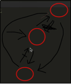编辑
   

```
    else:                              #注：如果该节点 是它父亲的右孩子
        node.parent.rchild = node.lchild    #注：那么它父亲就得跟它的孩子(只有1个左孩子) 通过右孩子的方式连接
        node.lchild.parent = node.parent    #注：往回指，它的左孩子的父亲，指向 它的父亲

#注：情况2.2：node只有一个右孩子，跟之前差不多
def __remove_node_22(self, node):
    # 情况2.2：node只有一个右孩子
    if not node.parent:    #注：先判断 它是不是根节点
        self.root = node.rchild #注：因为它只有一个 右孩子
    #注：分情况 1、它是它父亲的左孩子；2、它是它父亲的右孩子
    elif node == node.parent.lchild:    #注：如果它是它父亲的左孩子 (它只有一个右孩子)
        node.parent.lchild = node.rchild    #注：它的孩子(右孩子) 和它的父亲 通过 左孩子连起来 (因为它是它父亲的左孩子)
        node.rchild.parent = node.parent    #注：反着连回去
```


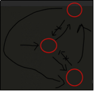编辑
   

```
    else:                               #注：如果它是它父亲的右孩子 (它只有一个右孩子)
    node.parent.rchild = node.rchild    #注：它的孩子(右孩子) 和它的父亲 通过 右孩子连起来 (因为它是它父亲的右孩子)
    node.rchild.parent = node.parent    #注：反着连回去

    #注：情况3：用到情况1和情况2，所以不单独写。直接写总的delete
    #注：这是所有情况的删除
    def delete(self, val):
        #注：先判断 是不是空树，是空树的话 什么都不做
        if self.root:    #注：不是空树的话，先找到那个节点
            node = self.query_no_rec(val)#注：先找到那个节点
            if not node: #注：如果node不存在，树里不存在node
                return False    #注：或者raise error
            #注：如果node存在，3种情况
            #注：情况1：node是叶子节点（即 没有左孩子 也没有右孩子）
            if not node.lchild and not node.rchild: #注：情况1. 叶子节点
                self.__remove_node_1(node)  #注：加两下滑线，说明是私有的，在类里用就行了
            #注：情况2   2.1 node只有一个左孩子 (即 它右孩子没有的时候)
            elif not node.rchild:       # 2.1 只有一个左孩子。因为它一个孩子都没有的话  不会执行到这里
                self.__remove_node_21(node)
            #注：情况2   2.2 node只有一个右孩子 (即 它左孩子没有的时候)
            elif not node.lchild:       # 2.2 只有一个右孩子。因为它一个孩子都没有的话  不会执行到这里
                self.__remove_node_22(node)
            #注：情况3   node两个孩子都有
            else:   # 3. 两个孩子都有
                #注：先找 右子树里 最小的节点
                min_node = node.rchild  #注：它肯定有右孩子
                while min_node.lchild:  #注：如果node.rchild 有左孩子，一直循环
                    min_node = min_node.lchild  #注：那么min_node=min_node.lchild
                #注：这个while 执行完了以后，min_node就是它右子树里最小的那个节点
                #注：然后 把min_node(即最小的那个节点) 替换到node这来
                node.data = min_node.data
                #注：然后 删除min_node ： 把min_node 原来的位置删了
                #注：删除min_node又需要判断 min_node满足情况1还是情况2。min_node肯定不满足情况3，因为 min_node肯定没有左孩子
                if min_node.rchild: #注：如果min_node有右孩子 ，满足 情况2.2  只有一个右孩子
                    self.__remove_node_22(min_node)
                else:               #注:如果min_node没有右孩子，那它一定是叶子节点，满足情况1
                    self.__remove_node_1(min_node)
#-----------------删除的方法-------------------
#测试
tree = BST([1,4,2,5,3,8,6,9,7])
tree.in_order(tree.root)    #注：中序遍历
print("")
tree.delete(4)
tree.delete(1)
tree.delete(8)
tree.in_order(tree.root)
#结果为        #注：4、1、8 少了
# 1,2,3,4,5,6,7,8,9,
# 2,3,5,6,7,9,
```


> 
>  精简代码 二叉搜索树 -- 删除操作

  

```
    def __remove_node_1(self, node):
        # 情况1：node是叶子节点
        if not node.parent:
            self.root = None
        if node == node.parent.lchild:  #node是它父亲的左孩子
            node.parent.lchild = None
        else:   #右孩子
            node.parent.rchild = None

    def __remove_node_21(self, node):
        # 情况2.1：node只有一个左孩子
        if not node.parent: # 根节点
            self.root = node.lchild
            node.lchild.parent = None
        elif node == node.parent.lchild:
            node.parent.lchild = node.lchild
            node.lchild.parent = node.parent
        else:
            node.parent.rchild = node.lchild
            node.lchild.parent = node.parent

    def __remove_node_22(self, node):
        # 情况2.2：node只有一个右孩子
        if not node.parent:
            self.root = node.rchild
        elif node == node.parent.lchild:
            node.parent.lchild = node.rchild
            node.rchild.parent = node.parent
        else:
            node.parent.rchild = node.rchild
            node.rchild.parent = node.parent


    def delete(self, val):
        if self.root:   # 不是空树
            node = self.query_no_rec(val)
            if not node: # 不存在
                return False
            if not node.lchild and not node.rchild: #1. 叶子节点
                self.__remove_node_1(node)
            elif not node.rchild:       # 2.1 只有一个左孩子
                self.__remove_node_21(node)
            elif not node.lchild:       # 2.2 只有一个右孩子
                self.__remove_node_22(node)
            else:   # 3. 两个孩子都有
                min_node = node.rchild
                while min_node.lchild:
                    min_node = min_node.lchild
                node.data = min_node.data
                # 删除min_node
                if min_node.rchild:
                    self.__remove_node_22(min_node)
                else:
                    self.__remove_node_1(min_node)
```


#   #74 AVL树的概念


```
###### 二叉搜索树的效率
# 平均情况下，二叉搜索树进行搜索的时间复杂度为O(lgn)。
# 最坏情况下，二叉搜索树可能非常偏斜。
# 解决方案：
#   ·随机化插入
#   ·AVL树
```


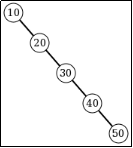编辑


```
#注：二叉搜索树 做搜索或者插入 时间复杂度 平均情况都是logn
#注：但是 最坏情况 非常偏斜，时间复杂度 会退化成O(n)，如图，假如 输入序列是 10 20 30 40 50 ，插入时  如图，就和链表差不多了，查找的时候 还得一个一个查
#注：所以它 就会非常偏斜，导致 从一个树型结构  ，退化成线型结构。
#注：快速排序 也有这类问题，9 8 7 6 5 4 3 2 1 。快排 提供了一个 随机化找，不是找第一个元素，随便找一个元素。这里也可以，插入的序列打乱一下。但是有问题，打乱一下 有时候 是过段时间来插入一次
#注：为了解决这个 问题，从二叉搜索树的基础上，提出了一种新的改进的 数据结构，叫做 AVL树
```


```
###### AVL树
# AVL树：AVL树是一棵自平衡的二叉搜索树。
# AVL树具有以下性质：
#   ·根的左右子树的高度之差的绝对值不能超过1
#   ·根的左右子树都是平衡二叉树	#注：意思是 任何节点 左右子树高度差 不能超过1
```


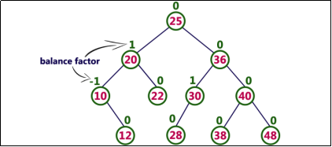编辑

```
#注：AVL 发明这个树的三位科学家的 首字母缩写
#注：AVL树是一棵自平衡的二叉搜索树。什么叫平衡？如图所示 就叫平衡：任何一个节点 2个子树的高度差 不能超过1 (也就是说 可以是 0 +-1，但不能是2)
```


 编辑


```
#注：50平衡 左子树/右子树 高度0；40平衡 0 和 1；30不平衡 0 和 2，差为2
#注：balance factor 平衡因子 记录左右子树 高度差  （左 减 右）
#注：balance factor 只有0和正负1  ，那么是 AVL树
#注：如何维护（插入）？
```


#   #75 AVL旋转

> 
>  \#注：插入1

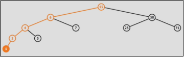编辑


\#注：从它(1) 往回找，找这个插入 是不是 引发了一个节点的不平衡

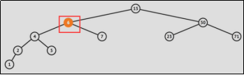编辑


\#注：往回走 ，找到6，不平衡了，左3 右1

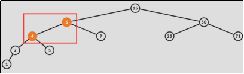编辑


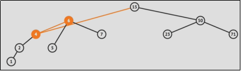编辑


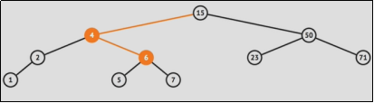编辑

 \#注：平衡了 这个树转了一下，叫做旋转

```
###### AVL树 -- 插入
# 插入一个节点可能会破坏AVL树的平衡，可以通过旋转操作来进行修正。
# 插入一个节点后，只有从插入节点到根节点的路径上的节点的平衡可能被改变。我们需要找出第一个破坏了平衡条件的节点，称之为K。K的两颗子树的高度差2。（因为只插入1个，所有只会是2）
# 不平衡的出现可能有4种情况


### AVL插入——左旋
# 1.不平衡是由于对K的右孩子的右子树插入导致的：左旋
```


 做一次左旋，简单情况

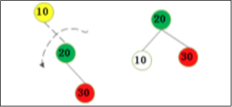编辑

 `#注：解决方法 左旋，把P往左转，C的S2变成P的孩子`
 ​编辑


```
### AVL插入——右旋
# 2.不平衡是由于对K的左孩子的左子树插入导致的：右旋
```


`右旋`
 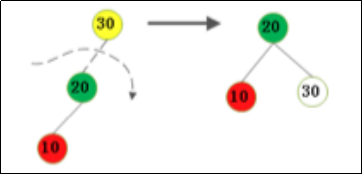​编辑
 `右旋 ，把P往右转，C变成根，C原来的右子树 变成P的左子树 (S2)`
 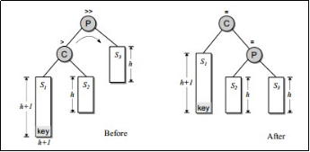​编辑

```
### AVL插入——右旋-左旋
# 3.不平衡是由于对K的右孩子的左子树插入导致的：右旋-左旋
```


- 1
- 2

`先右旋(20拽下来，15变成根) 再左旋(15变成根，10拽下来)，简单情况`
 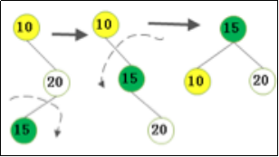​编辑

```
真实情况
先右旋(把C拽下来，P下面，以G为根，G的右边是C，G的左边是S2。S3变成C的左孩子，S4是C的右孩子)
再右旋(把P拽下来，G为根，G的左孩子是P，S2变为P的右孩子)
```


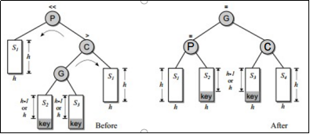编辑
 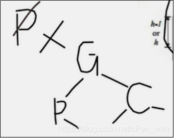​编辑

```
### AVL插入——左旋-右旋
# 4.不平衡是由于对K的左孩子的右子树插入导致的：左旋-右旋
#注：先左旋 25作为根，20拽下来
#注：再右旋 25作为根，30拽下来
```


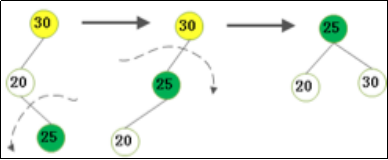编辑

 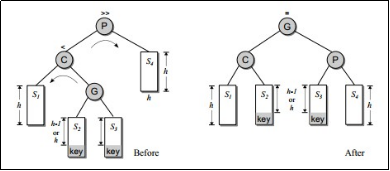编辑


```
#注：4种情况
# 右右 就左旋
# 左左 就右旋
# 左右 就左右
# 右左 就右左
```


```
从插入的节点 到根节点 往回找，找到第一个节点 balance factor 是2或-2 , 根据情况进行选择，结束后 平衡
```

# #76 AVL：旋转实现1

```
from bst import BiTreeNode, BST

# 继承，复用代码
class AVLNode(BiTreeNode):    # 节点类
    def __init__(self, data):
        BiTreeNode.__init__(self, data)
        self.bf = 0            # 数据域 存balance factor(插入时会用)

class AVLTree(BST):
    def __init__(self, li=None):
        BST.__init__(self, li) # 调用BST的构造函数

    # 4个旋转
#---------左旋、右旋-----------------------------------------
    def rotate_left(self, p, c):    # 左旋 p、c都是节点，右右
        s2 = c.lchild               # s1、s3都没有变，s2变化
        p.rchild = s2               # s2给p
        if s2:                      # 判断s2是否空
            s2.parent = p

        c.lchild = p
        p.parent = c
        # 更新balance factor 定义右边重 就是负
        p.bf = 0                    # 如果有删除操作，代码错误
        c.bf = 0

    def rorate_right(self, p, c):   # 右旋，左左情况
        s2 = c.rchild               # 只有 s2变
        p.lchild = s2
        if s2:
            s2.parent = p

        c.rchild = p
        p.parent = c

        p.bf = 0                    # 插入操作正确，删除时 代码错误
        c.bf = 0

#---------左旋、右旋-----------------------------------------

    def insert_no_rec(self, val):   # 重写，覆盖父类
        pass

#注：左旋、右旋 差别 ：l换成r，r换成l。对称
#注：如果 函数里有 +1 、-1 ，也要翻过去
```


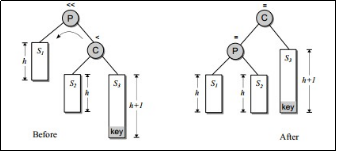编辑
 ​编辑

# #77 AVL：旋转实现2

```
from bst import BiTreeNode, BST

# 继承，复用代码
class AVLNode(BiTreeNode):    # 节点类
    def __init__(self, data):
        BiTreeNode.__init__(self, data)
        self.bf = 0            # 数据域 存balance factor(插入时会用)

class AVLTree(BST):
    def __init__(self, li=None):
        BST.__init__(self, li) # 调用BST的构造函数

    # 4个旋转
#---------左旋、右旋-----------------------------------------
    def rotate_left(self, p, c):    # 左旋 p、c都是节点，右右
        s2 = c.lchild               # s1、s3都没有变
        p.rchild = s2               # s2给p
        if s2:                      # 判断s2是否空
            s2.parent = p

        c.lchild = p
        p.parent = c
        # 更新balance factor 定义右边重 就是负
        p.bf = 0                    # 如果有删除操作，代码错误
        c.bf = 0

    def rorate_right(self, p, c):   # 右旋，左左情况
        s2 = c.rchild               # 只有 s2变
        p.lchild = s2
        if s2:
            s2.parent = p

        c.rchild = p
        p.parent = c

        p.bf = 0                    # 插入操作正确，删除时代码错误
        c.bf = 0

#---------左旋、右旋-----------------------------------------

# ---------右旋-左旋、左旋-右旋-----------------------------------------
    def rotate_right_left(self, p, c):  # 右旋-左旋
        g = c.lchild                     # 多了g
        # s2、s3本来属于G，全程s2、s3变化
        # 旋转结束 s2属于P s3属于C G为小根
        s3 = g.rchild
        c.lchild = s3                    # 右旋 s3绑到c左孩子
        if s3:                           # 反着链回去
            s3.parent = c
        g.rchild =c
        c.parent = g                      # c一定存在

        # 左旋 结束后 s2属于P右  P变成G的左孩子 G为根
        s2 = g.lchild
        p.rchild = s2
        if s2:
            s2.parent = p
        g.lchild = p                      # P拽成G左孩子
        p.parent = g

        # 更新bf  3种情况  右重为负
        #情况1 key 插入到s3上
        if g.bf > 0:                      # 其实是 = 1，往右偏,key插到s3上
            p.bf = -1                     # 看图二
            c.bf = 0
        #情况2 key 插入到s2上
        elif g.bf < 0:
            p.bf = 0                      # 看图二
            c.bf = 1
        #情况3 s1\s2\s3\s4都为空，即插入的是g
        else:                            # g.bf=0 插入的是g
            p.bf = 0
            c.bf = 0
```


编辑
   

```
    def rotate_left_right(self, p, c):  # 左旋-右旋 反着来，镜面问题
        # 把r和l转过来,s3变成s2，-1变成1 镜面翻转
        g = c.rchild

        s2 = g.lchild
        c.rchild =  s2                  # s2拿下来 挂到c右
        if s2:
            s2.parent = c
        g.lchild = c
        c.parent = g

        s3 = g.rchild                   # 右旋
        p.lchild = s3                   # s3拿下来 挂到p左
        if s3:
            s3.parent = p
        g.rchild = p
        p.parent = g

        # 更新bf
        if g.bf < 0:                    # key插到g左 (s2上) 因为小于所以 = -1，与上相反
            p.bf = 1
            c.bf = 0
        elif g.bf > 0:
            p.bf = 0
            c.bf = -1
        else:                           # 插入的是g
            p.bf = 0
            c.bf = 0
```


 \# ---------右旋-左旋、左旋-右旋-----------------------------------------​编辑


```
# ---------右旋-左旋、左旋-右旋-----------------------------------------

    def insert_no_rec(self, val):   # 重写，覆盖父类
        pass
```


#    #78 AVL：插入


```
#注：从一个节点开始 如果插入操作是从左子树传进来的 ，那么bf - 1； 从右子树传来，bf + 1
#注：传递 从下到上到根 ， 但是 一但中间有一个元素 bf变成0，那么 不再传递，不再更新  （因为虽插入，但左右高度不变）
#注：bf更新规律：插入节点后，从它的父亲开始，传递bf的变化 沿着树 往上走 （左子树来的 -1，右子树来的 +1）。但从某个节点开始，如果bf 变成0，那么传递 停止
#注：传递过程中 一旦有一个节点bf = 2 或 -2，树就不平衡。策略：把该子树 调整为平衡 4种情况 4个旋转操作。旋转节后后，子树 根节点 bf=0，就不传递
```


```
from bst import BiTreeNode, BST

# 继承，复用代码
class AVLNode(BiTreeNode):    # 节点类
    def __init__(self, data):
        BiTreeNode.__init__(self, data)
        self.bf = 0            # 数据域 存balance factor(插入时会用)

class AVLTree(BST):
    def __init__(self, li=None):
        BST.__init__(self, li) # 调用BST的构造函数

    # 4个旋转
#---------左旋、右旋-----------------------------------------
    def rotate_left(self, p, c):    # 左旋 p、c都是节点，右右
        s2 = c.lchild               # s1、s3都没有变
        p.rchild = s2               # s2给p
        if s2:                      # 判断s2是否空
            s2.parent = p

        c.lchild = p
        p.parent = c
        # 更新balance factor 定义右边重 就是负
        p.bf = 0                    # 如果有删除操作，代码错误
        c.bf = 0
        return c

    def rorate_right(self, p, c):   # 右旋，左左情况
        s2 = c.rchild               # 只有 s2变
        p.lchild = s2
        if s2:
            s2.parent = p

        c.rchild = p
        p.parent = c

        p.bf = 0                    # 插入操作正确，删除时代码错误
        c.bf = 0
        return c
#---------左旋、右旋-----------------------------------------
#注：需要返回旋转之后的根，插入操作 将新节点 与它的上一级 连

# ---------右旋-左旋、左旋-右旋-----------------------------------------
    def rotate_right_left(self, p, c):  # 右旋左旋
        g = c.lchild                     # 多了g
        # s2、s3本来属于G
        # 旋转结束 s2属于P s3属于C G为小根
        s3 = g.rchild
        c.lchild = s3                    # 右旋 s3绑到c左孩子
        if s3:                           # 反着链回去
            s3.parent = c
        g.rchild =c
        c.parent = g                      # c一定存在

        # 左旋 结束后 s2属于P右  P变成G的左孩子 G为根
        s2 = g.lchild
        p.rchild = s2
        if s2:
            s2.parent = p
        g.lchild = p                      # P拽成G左孩子
        p.parent = g

        # 更新bf  3种情况  右重为负
        #情况1 key 插入到s3上
        if g.bf > 0:                      # 其实是=1，往右偏,key插到s3上
            p.bf = -1                     # 看图二
            c.bf = 0
        #情况2 key 插入到s2上
        elif g.bf < 0:
            p.bf = 0                      # 看图二
            c.bf = 1
        #情况3 s1\s2\s3\s4都为空，即插入的是g
        else:                            # g.bf=0 插入的是g
            p.bf = 0
            c.bf = 0
        return g

    def rotate_left_right(self, p, c):  # 左旋-右旋 反着来，镜面问题
        # 把r和l转过来,s3变成s2，镜面翻转
        g = c.rchild

        s2 = g.lchild
        c.rchild =  s2                  # s2拿下来 挂到c右
        if s2:
            s2.parent = c
        g.lchild = c
        c.parent = g

        s3 = g.rchild                   # 右旋
        p.lchild = s3                   # s3拿下来 挂到p左
        if s3:
            s3.parent = p
        g.rchild = p
        p.parent = g

        # 更新bf
        if g.bf < 0:                    # key插到g左 (s2上) 因为小于所以=-1，与上相反
            p.bf = 1
            c.bf = 0
        elif g.bf > 0:
            p.bf = 0
            c.bf = -1
        else:                           # 插入的是g
            p.bf = 0
            c.bf = 0
        return g
# ---------右旋-左旋、左旋-右旋-----------------------------------------
# 注：需要返回旋转之后的根，插入操作 将新节点 与它的上一级 连

#----------------插入 操作----------------------------------------------
    def insert_no_rec(self, val):   # 重写，覆盖父类
        # 步骤1、和BST一样，先插入 （二叉搜索树） 代码复制过来
        p = self.root
        if not p:  # 空树
            self.root = AVLNode(val)    # 变成根
            return
        while True:
            if val < p.data:
                if p.lchild:
                    p = p.lchild
                else:  # 左孩子不存在
                    p.lchild = AVLNode(val)
                    p.lchild.parent = p
                    node = p.lchild # node 存储的就是插入的节点
                    break           # 跳出循环
            elif val > p.data:
                if p.rchild:
                    p = p.rchild
                else:
                    p.rchild = AVLNode(val)
                    p.rchild.parent = p
                    node = p.rchild # node 存储的就是插入的节点
                    break           # 跳出循环
            else:   # val == p.data  尽量不允许2个相同的key插入在树里
                return

        # 步骤2、更新balance factor
        while node.parent:          # 保证node.parent不空，即一直到根
            # 看插入从左孩子/右孩子来的
            if node.parent.lchild == node:   # 传递是从左子树来的，左子树更沉了
                # 更新node.parent的bf -= 1
                if node.parent.bf < 0:  # 原来node.parent.bf == -1, 更新后变成-2
                    # node.parent左沉时  2种情况 对应：右旋、左旋右旋
                    # 做旋转
                    # 看node哪边沉， node左边沉 右旋；node右边沉 左旋右旋
                    x = node.parent # 旋转前的子树的根
                    g = node.parent.parent  # 为了连接旋转之后的子树。存 根节点的上一级
                    if node.bf > 0: # bf=+1 node右边沉，左旋右旋
                        n = self.rotate_left_right(node.parent, node)   # 注意传的参数
                    else:           # 左边沉， 右旋
                        n = self.rorate_right(node.parent, node)
                    # 记得：把n和g连起来    n是旋转后的子树 根。连接操作写在 所有情况后 ，减少代码量
                elif node.parent.bf > 0:  # 原来node.parent.bf = 1，更新之后变成0
                    node.parent.bf = 0  # 只需要把它的bf = 0
                    break               # 一但 某节点bf 变成0  变化就不再传递
                else:                     # 原来node.parent.bf = 0，更新之后变成-1
                    # 需要向上传递 但不需要旋转
                    node.parent.bf = -1
                    node = node.parent  # 循环继续 往上走一层
                    continue           # 连接操作放到最后
            else:                            # 传递是从右子树来的，右子树更沉了
                # 更新node.parent.bf += 1     3种情况
                if node.parent.bf > 0:  # 原来node.parent.bf == 1, 更新后变成2
                    # 做旋转
                    # 看node哪边沉      node右边沉(右右):左旋 ；node左边沉(右左):右左
                    g = node.parent.parent  # 为了连接旋转之后的子树
                    x = node.parent # 旋转前的子树的根
                    if node.bf < 0: # node左边沉:右左  node.bf = -1
                        n = self.rotate_right_left(node.parent, node)
                    else:           # node右边沉:左旋  node.bf = 1
                        n = self.rotate_left(node.parent, node)
                    # 记得连起来
                elif node.parent.bf < 0: # 原来node.parent.bf = -1，更新之后变成0
                    node.parent.bf = 0  # 更新
                    break               # 是0后，不需要传递了
                else:                    # 原来node.parent.bf = 0，更新之后变成1
                    node.parent.bf = 1
                    node = node.parent  # 往上看，不需要旋转
                    continue
                # 注：3种情况中，第1种 bf更新写在了旋转函数里，所以这里不需要更新

                # 注：这棵子树已经平衡了，是正负1的 ，走下一层continue 连起来，是0的 结束
            # 连接旋转后的子树      g跟n连起来 ，g是 上一级，n是子树 新根
            n.parent = g
            if g:   # g不是空 (涉及到根节点，都得判断是否为空)
                # 判断 连到左还是右
                if x == g.lchild: # x (旋转前 子树的根)是g原来的孩子 (原来的左孩子)
                    g.lchild = n
                else:                       # g原来的孩子x 是 右孩子
                    g.rchild = n
                break                       # 调整完成后，新的树的根 bf 肯定是0，就不需要继续了
            else:   # 说明n是根节点，调整的是根节点  (g是空时)
                self.root = n
                break
# ----------------插入 操作----------------------------------------------
```


> 
>  插入操作精简代码

```
    def insert_no_rec(self, val):
        # 1. 和BST一样，插入
        p = self.root
        if not p:  # 空树
            self.root = AVLNode(val)
            return
        while True:
            if val < p.data:
                if p.lchild:
                    p = p.lchild
                else:  # 左孩子不存在
                    p.lchild = AVLNode(val)
                    p.lchild.parent = p
                    node = p.lchild # node 存储的就是插入的节点
                    break
            elif val > p.data:
                if p.rchild:
                    p = p.rchild
                else:
                    p.rchild = AVLNode(val)
                    p.rchild.parent = p
                    node = p.rchild
                    break
            else:   # val == p.data
                return

        # 2. 更新balance factor
        while node.parent:  # node.parent不空
            if node.parent.lchild == node: # 传递是从左子树来的，左子树更沉了
                #更新node.parent的bf -= 1
                if node.parent.bf < 0: # 原来node.parent.bf == -1, 更新后变成-2
                    # 做旋转
                    # 看node哪边沉
                    g = node.parent.parent # 为了连接旋转之后的子树
                    x = node.parent  # 旋转前的子树的根
                    if node.bf > 0:
                        n = self.rotate_left_right(node.parent, node)
                    else:
                        n = self.rotate_right(node.parent, node)
                    # 记得：把n和g连起来
                elif node.parent.bf > 0: # 原来node.parent.bf = 1，更新之后变成0
                    node.parent.bf = 0
                    break
                else: # 原来node.parent.bf = 0，更新之后变成-1
                    node.parent.bf = -1
                    node = node.parent
                    continue
            else: # 传递是从右子树来的，右子树更沉了
                #更新node.parent.bf += 1
                if node.parent.bf > 0:  # 原来node.parent.bf == 1, 更新后变成2
                    # 做旋转
                    # 看node哪边沉
                    g = node.parent.parent # 为了连接旋转之后的子树
                    x = node.parent  # 旋转前的子树的根
                    if node.bf < 0: # node.bf = 1
                        n = self.rotate_right_left(node.parent, node)
                    else:   # node.bf = -1
                        n = self.rotate_left(node.parent, node)
                    # 记得连起来
                elif node.parent.bf < 0: # 原来node.parent.bf = -1，更新之后变成0
                    node.parent.bf = 0
                    break
                else: # 原来node.parent.bf = 0，更新之后变成1
                    node.parent.bf = 1
                    node = node.parent
                    continue

            # 链接旋转后的子树
            n.parent = g
            if g: # g不是空
                if x == g.lchild:
                    g.lchild = n
                else:
                    g.rchild = n
                break
            else:
                self.root = n
                break
```


```
tree = AVLTree([9,8,7,6,5,4,3,2,1])

tree.pre_order(tree.root)
print("")
tree.in_order(tree.root)
#结果为  前序序列，中序序列
# 6,4,2,1,3,5,8,7,9,
# 1,2,3,4,5,6,7,8,9,
```


#     #79 AVL树应用与数据结构总结


```
#注：二叉搜索树（二叉排序树）：比它小的在左边，比它大的在右边。根据这个特性，查找元素，顺着一棵树查 logn 查找速度
#注：如果二叉树 插入是 9 8 7 6 5 4 3 2 1 ，严重偏斜。所以搞了 AVL树，自平衡的树。balance factor 平衡因子 0 正负1 平衡
#注：如果插入一个数，导致了不平衡：从它的父亲 往上找，找到第一个 不平衡的节点，通过旋转(4种情况)，旋转后平衡，再来下一次插入
```


```
###### 二叉搜索树扩展应用 -- B树
# B树(B-Tree)：B树是一棵自平衡的多路搜索树。常用于数据库的索引。
#注：跟AVL树 不同的一点是：AVL树是二叉的，它是多叉的
```


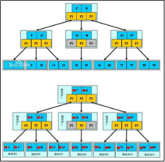编辑

```
#注：蓝的节点 ，就是我们 插入的数字。图示 是 三叉的B树 （或者说 三路的B树）
#注：一个节点上 存了2个值，分成3路。如果 分5路，需要存4个值，比第一个值小的去 第一路……
#注：主要用途 ： 数据库的索引
#注：数据库 最常见的索引：2种   第1种：哈希表，对主键做哈希，根据这个哈希去查。 第2种：B树，充分利用硬盘块，每个东西是一块
#注：B树 升级的  B+树，大同小异，原理一样
```


#   #80 贪心算法

```
###### 贪心算法
#   ·贪心算法（又称贪婪算法）是指，在对问题求解时，总是做 出在当前看来是最好的选择。也就是说，不从整体最优上加以考虑，他所做出的是在某种意义上的局部最优解。
#   ·贪心算法并不保证会得到最优解，但是在某些问题上贪心算法的解就是最优解。要会判断一个问题能否用贪心算法来计算。

### 找零问题
#   ·假设商店老板需要找零 n元钱，钱币的面额有：100元、50元、 20元、5元、1元，如何找零使得所需钱币的数量最少？			#注：即 张数最少

#注：这就是贪心的，要保证 钱币数量最少，先从最大面额找，最大面额找不开了，换下一面，再找，再找不开，再找……
```


> 
>  代码


```
t = [100, 50, 20, 5, 1]  # 多少种钱币

def change(t, n):        # t是货币面额类型，n是要找的钱
    m = [0 for _ in range(len(t))]   # 各个张数 0 0 0 0 0
    # 假设t都倒序排好了 (没排好的话，t.sort倒序排)
    for i, money in enumerate(t):
        m[i] = n // money   # n 整除 money，张数
        n = n % money       # n 还剩多少，取余 剩下的钱
    return m, n            # for循环结束后，n可能还剩下一点没找开

print(change(t, 376))
#结果为
# ([3, 1, 1, 1, 1], 0)
#注：100的3张，其他面额各1张，最后剩0块钱
```


> 
>  贪心 思想：当前最多的，先让100的找完了后 剩下的最少，尽可能先让 大面值的 拿走，这就是贪心