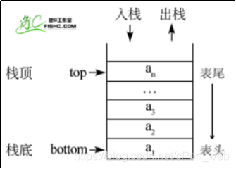
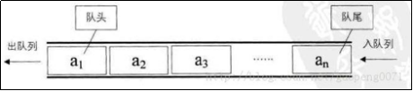
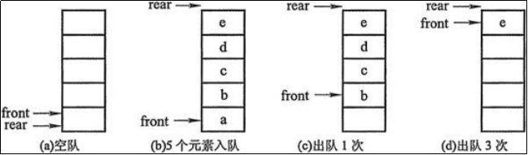
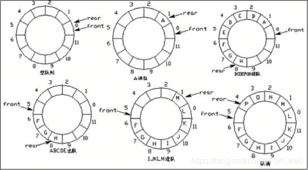

### 文章目录


- [#41 查找排序习题](https://blog.csdn.net/cPen_web/article/details/110980185#41_09_7)
- [#42 查找排序习题](https://blog.csdn.net/cPen_web/article/details/110980185#42_09_26)
- [#43 查找排序习题](https://blog.csdn.net/cPen_web/article/details/110980185#43_09_111)
- [#44 查找排序习题](https://blog.csdn.net/cPen_web/article/details/110980185#44_09_233)
- [#45 查找排序习题](https://blog.csdn.net/cPen_web/article/details/110980185#45_09_378)
- [#46 数据结构](https://blog.csdn.net/cPen_web/article/details/110980185#46_09_467)
- [#47 列表](https://blog.csdn.net/cPen_web/article/details/110980185#47_09_503)
- [#48 栈](https://blog.csdn.net/cPen_web/article/details/110980185#48_09_591)
- [#49 栈的应用：括号匹配](https://blog.csdn.net/cPen_web/article/details/110980185#49_09_646)
- [#50 队列](https://blog.csdn.net/cPen_web/article/details/110980185#50_09_751)

# #41 查找排序习题

```
# 1. 给两个字符串s和t，判断t是否为s的重新排列后组成的单词
#       s = "anagram", t = "nagaram", return true.
#       s = "rat", t = "car", return false.
#注：t是把s打乱后，重新排列的单词

# 2. 给定一个m*n的二维列表，查找一个数是否存在。列表有下列特性：
#   每一行的列表从左到右已经排序好。
#   每一行第一个数比上一行最后一个数大。
#注：横着一行行读的话 ，整个列表是完全有序的
# 1 3 5 7 10 11 16 20 23 30 34 50，这是增序的
#注：矩阵就是二维列表

# 3. 给定一个列表和一个整数，设计算法找到两个数的下标，
# 使得两个数之和为给定的整数。保证肯定仅有一个结果。
#   例如，列表[1,2,5,4]与目标整数3，1+2=3，结果为(0, 1).
```


# #42 查找排序习题

```
# 1. 给两个字符串s和t，判断t是否为s的重新排列后组成的单词
#       s = "anagram", t = "nagaram", return true.
#       s = "rat", t = "car", return false.
#注：t是把s打乱后，重新排列的单词

#注：如果t是s的1个重新排列，那么 s和t，我把它们排好序之后（字符串排序 aaagmn），s和t应该是一样的
class Solution:
    def isAnagram(self, s, t):  #注：排序的写法
        """
        :type s: str
        :type t: str
        :rtype: bool
        """
        ss = list(s) # 字符串 在Python里不能直接排序
        #转换成列表，一个字符是一个元素
        tt = list(t)
        ss.sort()   # 列表排序
        tt.sort()
        return ss == tt
        #注：如果ss=tt，返回true……
#注：它的时间复杂度：Python的sort()是基于归并排序的一种排序，只要是比较排序 ，它的时间复杂度是 nlogn
#注：时间复杂度 nlogn
```


```
#注：一行写出来
class Solution:
    def isAnagram(self, s, t):  #注：排序的写法
        """
        :type s: str
        :type t: str
        :rtype: bool
        """
        return sorted(list(s)) == sorted(list(t))
#注：转换成列表，使用内置函数 sorted函数
#注：sort和sorted 的不同点：
# sort是对于原来的列表排序
# sorted 是返回一个新列表，不改原来的列表

#效率差不多，它们2个的时间复杂度 还是很高
```


```
#时间复杂度 更低一点的算法（这个和排序没什么关系了）
#重新排序：如果是的话，那么t和s的所有字母的数量都一样，s有3个a，t也得有3各个a
#使用2个字典 来保存 2个字符串里 字母出现的数量
class Solution:
    def isAnagram(self, s, t):
        """
        :type s: str
        :type t: str
        :rtype: bool
        """
        dict1 = {}  # {'a':1, 'b':2} 代表s里有1个a，2个b
        dict2 = {}
        for ch in s:    #注：数一下它们有几个,拿到字符串里的每一个字符
            #注：给字典 字符的值 加上1
            dict1[ch] = dict1.get(ch, 0) + 1
            #注：如果ch 在键里，get就是拿到它的值；如果不在键里 返回0，相当于给它开了1个键 默认值是1
        for ch in t:    #注：dict2也一样
            dict2[ch] = dict2.get(ch, 0) + 1
        return dict1 == dict2   #返回2数是否相同的 布尔值
#注：时间复杂度O(n)  因为2个循环，这个算法（字典）是比排序要快
```


```
#字典解法 精简代码
class Solution:
    def isAnagram(self, s, t):
        """
        :type s: str
        :type t: str
        :rtype: bool
        """
        dict1 = {}
        dict2 = {}
        for ch in s:
            dict1[ch] = dict1.get(ch, 0) + 1
        for ch in t:
            dict2[ch] = dict2.get(ch, 0) + 1
        return dict1 == dict2
```


# #43 查找排序习题

```
# 2. 给定一个m*n的二维列表，查找一个数是否存在。列表有下列特性：
#   每一行的列表从左到右已经排序好。
#   每一行第一个数比上一行最后一个数大。

#注：横着一行行读的话 ，整个列表是完全有序的
# 1 3 5 7 10 11 16 20 23 30 34 50，这是增序的(有序的)
#注：矩阵就是二维列表
#注：m*n 意思是 m行n列

#注：题目中的二维列表，相当于 把一维有序列表 拆分为 二维列表

#不考虑算法，使用循环。
#注：很慢，（m行*n列）时间复杂度O(mn),mn 实际上是整个列表的大小。
#注：如果把列表里的元素个素看成n，那么时间复杂度是O(n)
#注：变向的线性查找，顺序查找，一个一个找，找到为止
class Solution:
    def searchMatrix(self, matrix, target):
        """
        :type matrix: List[List[int]]
        :param target: int
        :return: bool
        """
        #注：matrix 二维列表 List[List[int]]
        #注：target 要找的数
        for line in matrix: #注：对于二维列表里每一行
        #注：这个for循环 遍历 时间复杂度为O(m)，假设列表m行n列
            if target in line:  #注：如果target在这一行
            #注：如果列表执行in操作，那么复杂度O(n),因为把target和line里面每一个元素都比一下
                return True
        return False    #注：如果for循环，循环完了还没找到

#列表是有序的，可以用二分查找的方法(left、right 2个箭头 标记左右)
#二分查找 时间复杂度O(logn)，n指二维列表里元素个数
class Solution:
    def searchMatrix(self, matrix, target):
        """
        :type matrix: List[List[int]]
        :param target: int
        :return: bool
        """
        h = len(matrix)     #注：列表的行  高
        if h == 0:          #注：注意 边界条件，列表里没有值的情况
            return False   #注：这种情况 []
        w = len(matrix[0])  #注：列表的列  宽
        # [[],[],[]] 还有这种情况
        if w == 0:          #注：[[],[],[]] 这种情况
            return False
        #注：注意边界条件 matrix[0] 当二维列表为[]时 越界，所以if判断一下
        #注：可以这样写，因为题目说了是 m*n 的二维列表
        #注：边界条件：0、负数、空列表…… 需要注意
        left = 0            #注：二分查找 left、right 2个箭头 标记左右
        right = w * h -1    #注：-1 因为从0开始
        # mid = (left+right) // 2
        """
        0 1 2  3
        4 5 6  7
        8 7 10 11
        """ #注：i是下标，4是宽度 即 几列
        # i = num //4 行; j = num % 4 列
        while left <= right:    #注：二分查找的代码
            mid = (left + right) // 2
            i = mid // w    # w 是 宽度、几列
            j = mid % w     #注：这2步是把mid换算成真实的位置
            if matrix[i][j] == target:
            #注：matrix[i][j]代表中间mid位置对应的数
                return True
            elif matrix[i][j] > target:
            #注：matrix[i][j]代表中间mid位置对应的数
                right = mid - 1
            else:
                left = mid + 1
        else:
            return False
```


```
#精简代码
#线性查找（for循环遍历） O(mn)
class Solution:
    def searchMatrix(self, matrix, target):
        """
        :type matrix: List[List[int]]
        :param target: int
        :return: bool
        """
        for line in matrix:
            if target in line:
                return True
        return False 

#二分查找 O(logn)
class Solution:
    def searchMatrix(self, matrix, target):
        """
        :type matrix: List[List[int]]
        :param target: int
        :return: bool
        """
        h = len(matrix) 
        if h == 0: 
            return False  
        w = len(matrix[0]) 
        if w == 0:         
            return False
        left = 0        
        right = w * h -1  
        while left <= right:  
            mid = (left + right) // 2
            i = mid // w 
            j = mid % w  
            if matrix[i][j] == target:
                return True
            elif matrix[i][j] > target:
                right = mid - 1
            else:
                left = mid + 1
        else:
            return False
```


# #44 查找排序习题

```
# 3. 给定一个列表和一个整数，设计算法找到两个数的下标，
# 使得两个数之和为给定的整数。保证肯定仅有一个结果。
#   例如，列表[1,2,5,4]与目标整数3，1+2=3，结果为(0, 1).

#注：保证肯定仅有一个结果，怎么理解？
#注：这是题目保证的 大胆写，去除了一些边界条件 不会报错

#注：最开始的想法：2层for循环，
# 第1层for循环确定1个数
# 第2层for循环又确定一个数，2个数加起来=target就输出
class Solution:
    def twoSum(self, nums, target):
        """
        :type nums: List[int
        :type target: int
        :rtype: List[int
        """
        #注：nums是列表,target是要找的整数
        n = len(nums)
        for i in range(n):
            # for j in range(n):  #注：这么写有问题
            #   if i != j:
            #     if nums[i] + nums[j] == target:   #注：这样写有问题
            #         return sorted([i,j])  #注：这样写有问题
            #注：1、超时 太慢了；2、效率问题

            #注：效率提高一半的做法：跟它前面的数比、或跟它后边的数比
            for j in range(i):     #注：这是  j跟前面的比
            # for j in range(i+1, n): #注：这是  j跟后面的比
                if nums[i] + nums[j] == target:
                    return sorted([i,j])
#注：2层for循环 时间复杂度O(n**2)
```


```
#方法2
#注：根据1个数 找另一个数
class Solution:
    def twoSum(self, nums, target):
        """
        :type nums: List[int
        :type target: int
        :rtype: List[int
        """
        n = len(nums)
        for i in range(n):
            a = nums
            b = target - a  #注：根据1个数 找另一个数
            #index方法，效率一样
            #二分查找，注意 需要列表有序
            # ……
#下个视频接着写
```


```
#注：nums 有序的版本
class Solution:
    def binary_search(self, li, left, right, val):   #注：二分查找代码
    #注：将原来的函数改一下，left和right传进去
        left = 0
        right = len(li) - 1
        while left <= right:
            mid = (left + right) // 2
            if li[mid] == val:
                return mid
            elif li[mid] > val:
                right = mid - 1
            else:
                left = mid + 1
        else:
            return None
    def twoSum(self, nums, target):
        """
        :type nums: List[int
        :type target: int
        :rtype: List[int
        """
        for i in range(len(nums)):
            a = nums[i]
            b = target - a
            if b >= a:  #注：在a的右边找
                # j = self.binary_search(li[i+1:], b)   #这种写法 列表切片O(n) 耗时间
                #注：所以将原来的函数改一下，left和right传进去
                # binary_search(self, li, left, right, val)
                j = self.binary_search(nums, i+1, len(nums)-1, b)
            else:   #注：b<a 在左边找
                j = self.binary_search(nums, 0, i-1, b)
            if j:   #注：如果找到了
                break
        return sorted([i+1,j+1])    #注：保证肯定仅有一个结果 所以可以直接输出i和j
#注：时间复杂度 nlogn, for循环遍历是n，下面的二分查找最慢是logn
#注：所有整个是nlogn
```


```
#精简代码
# 方法1 for循环遍历
class Solution:
    def twoSum(self, nums, target):
        """
        :type nums: List[int
        :type target: int
        :rtype: List[int
        """
        n = len(nums)
        for i in range(n):
            for j in range(i):
                if nums[i] + nums[j] == target:
                    return sorted([i,j])
#方法2 有序  情况下  二分查找
class Solution:
    def binary_search(self, li, left, right, val):   #注：二分查找代码
    #注：将原来的函数改一下，left和right传进去
        left = 0
        right = len(li) - 1
        while left <= right:
            mid = (left + right) // 2
            if li[mid] == val:
                return mid
            elif li[mid] > val:
                right = mid - 1
            else:
                left = mid + 1
        else:
            return None
    def twoSum(self, nums, target):
        """
        :type nums: List[int
        :type target: int
        :rtype: List[int
        """
        for i in range(len(nums)):
            a = nums[i]
            b = target - a
            if b >= a:
                j = self.binary_search(nums, i+1, len(nums)-1, b)
            else:
                j = self.binary_search(nums, 0, i-1, b)
            if j:
                break
        return sorted([i+1,j+1]) 
```


# #45 查找排序习题

```
# 3. 给定一个列表和一个整数，设计算法找到两个数的下标，
# 使得两个数之和为给定的整数。保证肯定仅有一个结果。
#   例如，列表[1,2,5,4]与目标整数3，1+2=3，结果为(0, 1).

#注：在列表无序的时候，可不可以用二分查找？
#注：没有序 可以给它排序，排序后下标变了。记一下之前的下标就可以了

#注：时间复杂度 nlogn
#方法：二分查找
class Solution:
    def binary_search(self, li, left, right, val):   #注：二分查找代码
        while left <= right:    # 候选区有值
            mid = (left + right) // 2
            if li[mid][0] == val:   #注：改的地方，因为li[mid]是二维的
                return mid
            elif li[mid][0] > val: # 带查找的值在mid左侧
            #注：改的地方，因为li[mid]是二维的
                right = mid - 1
            else:   # li[mid] < val # 带查找的值在mid右侧
                left = mid + 1
        else:
            return None

    def twoSum(self, nums, target):
        """
        :type nums: List[int
        :type target: int
        :rtype: List[int
        """
        #注：首先nums要排序，排序还要记一下 它原来的下标
        new_nums = [[num, i] for i, num in enumerate(nums)]
        #注：新建二维列表，每一行上有2个数，把nums的下标和数放到1个列表里，针对它进行排序
        new_nums.sort(key=lambda x:x[0])    #注：排序，二维列表指定key，x[0] 按照数进行排序
        #注：sort 时间复杂度 nlogn
        # new_nums[i] 第i个元素 是一个列表；new_nums[i][0] 是它的数；new_nums[i][1] 是它原来的下标
        for i in range(len(new_nums)):  #注：改的地方new_nums
        #注：for循环遍历 时间复杂度 n
            a = new_nums[i][0] #注：改的地方new_nums  new_nums[i][0]是它的数
            b = target - a
            if b >= a:
                j = self.binary_search(new_nums, i+1, len(new_nums)-1, b)   #注：改的地方new_nums
                #注：binary_search 时间复杂度 logn
            else:
                j = self.binary_search(new_nums, 0, i-1, b) #注：改的地方new_nums
            if j:
                break
        # return sorted([i+1,j+1])
        return sorted([new_nums[i][1], new_nums[j][1]]) #注：输出原来的下标
#注：总体时间复杂度 nlogn
```


```
#精简代码
#方法：二分查找
class Solution:
    def binary_search(self, li, left, right, val):   #注：二分查找代码
        while left <= right:
            mid = (left + right) // 2
            if li[mid][0] == val:   #注：改的地方，因为li[mid]是二维的
                return mid
            elif li[mid][0] > val:
                right = mid - 1
            else:
                left = mid + 1
        else:
            return None

    def twoSum(self, nums, target):
        """
        :type nums: List[int
        :type target: int
        :rtype: List[int
        """
        new_nums = [[num, i] for i, num in enumerate(nums)]
        new_nums.sort(key=lambda x:x[0])
        for i in range(len(new_nums)):
            a = new_nums[i][0]
            b = target - a
            if b >= a:
                j = self.binary_search(new_nums, i+1, len(new_nums)-1, b)
            else:
                j = self.binary_search(new_nums, 0, i-1, b)
            if j:
                break
        return sorted([new_nums[i][1], new_nums[j][1]])
```


# #46 数据结构

```
### 数据结构
# 数据结构是指相互之间存在着一种或多种关系的数据元素的集合和该集合中数据元素之间的关系组成。
#注：这是官方定义
#注：简单来说：数据结构不是存1个数(可以存1个数据，但那是变量，变量没有结构好说)，一般来说存的一组数据
#注：数据结构有数据和关系，比如说列表，前1个数和后1个数挨着
# 简单来说，数据结构就是设计数据以何种方式组织并存储在计算机中。
# 比如：列表、集合与字典等都是一种数据结构。
#注：数据结构是怎么实现的？
# N.Wirth: “程序=数据结构+算法”

#注：列表、字典、集合，Python数据结构
#注：数据结构是你怎么组织你的数据，算法是动态的 你的程序怎么运行
```


```
### 数据结构的分类
# 数据结构按照其逻辑结构可分为线性结构、树结构、图结构
#注：数据结构 有2种结构：逻辑结构、物理结构
#注：逻辑结构：逻辑上是怎么做的，比如说列表 线性的。堆也是数据结构 堆是一棵树，一个父亲有2个孩子
#注：堆是一棵树，列表是一条线，逻辑结构不一样
#注：物理结构：这个结构是怎么实现的，怎么写出来的，在计算机里是怎么存储
#注：比如说 堆的物理结构是线性的，但是它的逻辑结构不是线性的
#注：我们只关注逻辑结构，可以分为：线性结构、树结构、图结构
# 线性结构：数据结构中的元素存在一对一的相互关系
# 树结构：数据结构中的元素存在一对多的相互关系
# 图结构：数据结构中的元素存在多对多的相互关系
#注：列表就是线性结构，列表存在一对一的相互关系。它一个挨一个，一个后边是一个。往后看，它一个后边只有1个
#注：堆：一个父亲有2个孩子，一对二
#注：树的概念：一个父亲有好多个孩子，一个孩子再有好多个孩子。比如说目录结构
#注：树是有方向的，从父亲指向孩子的
#注：图结构的定义是：多对多的关系。图结构见的最多的是 地图（百度地图、高德地图）
#注：图结构：可以理解为 点就是一个个道口，道口和道口之间的线就是1条路(路线)。地图是一个图结构
```


# #47 列表

```
### 列表/数组
# 列表（其他语言称数组）是一种基本数据类型。
# 关于列表的问题：
#     列表中的元素是如何存储的？
#     列表的基本操作：按下标查找、插入元素、删除元素……
#     这些操作的时间复杂度是多少？
# 扩展：Python的列表是如何实现的？
#
#问：列表中的元素是如何存储的？
# 答：顺序存储的。列表(数组)又叫顺序表(数据结构这门科目上这么说)。列表是一块连续的内存
#问：列表的基本操作：按下标查找、插入元素、删除元素……
#    这些操作的时间复杂度是多少？ #注：这些操作都和元素是怎么存储的相关

#注：其他语言的 数组是怎么存的？
#注：C语言中申请数组  需要指定数组大小
|1|2|3| | | | |
#注：要查找 a[2]，怎么找？ 这个查找 时间复杂度是O(1)，一下就能找到
#注：a[2]怎么找到3的？内存都有地址的
|  1  |  2  |  3  |     |     |     |     |
100   104   108   112 ……
#注：32位机器上 1个整数占4个字节
#注：一个地址、一个整数 就占32位。32位是4个字节
#注：1个整数占4个字节，1这个整数 占了4个格子(100 101 102 103)
#注：2开始的地址是104，3开始的位置是108    （+4 +4 +4……）
#注：知道a的首地址是 100 ，a[2]   100+2*4=108 ，就找到3这个位置了，把它输出出来就可以了。 这个4其实就是你每一个元素占的大小（这里说的是整数）
#注：如果是 小数/浮点数 ，一个机器上规定浮点数占多长是 固定的，没准，乘它的长度就可以
#注：这就是你写 a[2] 它内部执行的什么事。这是C的数组是怎么做的
#注：C的数组和Python的列表有2点不一样

#注：数组与列表有2点不同
#   1、数组元素类型要相同
#       为什么要相同？ 如果不相同，，一个整数和小数，长度不一样，没法搞
#   2、数组长度固定
#       Python没有，Python可以无限往后 append，只要计算机可以

#Python的列表是怎么做的？
#注：Python的元素类型可以不一样，所以Python这里存的不是真实的值，Python这里存的是地址
#注：比如说 |1|2|3| | | | |
#注：1可能存在另外一个（格子）内存上，2也是另一个格子上，3也是另一个格子上。
#注：Python里a=1、b=1、b=2
#注：1 、 2 、 3 比如说1内存地址 200，2内存地址305,3内存地址12
#注：a=1 实际上就是 让a这个位置 指向200号内存，然后200号内存拿到了
#注：b=1  b也指向200号内存
#注：b=2  b指向305号内存

#注：列表怎么存？ 比如说列表里有 1 2 3   |1|2|3| | | | |
#第一个位置存200，第2个位置存305，第3个位置存12
|200|305| 12|  |  |  |  |

| 1 | 2 | 3.1 |  |  |  |  |
#注：1 2 可能是200-203  305-308，3.1可能是12-25，长度不一样，但是没有关系，只要记住这是12，把它指过来。地址大小都是一样的
#注：地址大小都是一样的，32位机器上  1个整数占4个字节，1个地址也占4个字节
#注：这也就是为什么 32位机器 内存最多4g，因为1个地址占4个字节，32位机器上 最小能表示 0000，最大 能表示1111
#注：把1111编号算出来，就是4g，2**32-1个字节，就是4g，所有不能超过4g
#注：64位机器上，一个地址占8个字节。编号就多了

#注：地址的大小都是一样的。32位机器上，地址都是4个字节，64位机器上，地址都是8个字节
#注：现在它固定了，就可以用 数组的方法来做了
#注：查a[2]，这块内存还是从100开始， 100+2*4=108，在108这 拿一下值，取长度是4个字节，是12。接下来还多一步（数组的话 直接这个位置就是了）
#注：这多一步，拿到这个是地址，再去这个地址找，12这个地址存的是3.1，那就把3.1拿过去。
#注：这是计算机 在列表[中括号几]的时候干的事（怎么寻的值）
#注：这个是 Python的列表怎么解决的元素类型可以不同
100 104 108 112 ……
|200|305| 12|  |  |  |  |
| 1 | 2 |3.1|  |  |  |  |

#注：那Python列表怎么解决数组长度固定呢？
#注：这个就是它内部做的内存分配问题，就是它自己管理的内存，你不够了 你还可以再往后边扩
#注：实际上它是把上边的复制下来，把这一块列表 比如说 刚开始开1个长度是4的，你append 4个满了，你再执行1个append，Python内部发现不够了，重新开一份内存，把这4个数拷过来，再开1个，再往后写。
#注：但是它开的时候 可能不是开5个了，因为有可能还往后写，所以4个不够，它可能开8个，8个不够 可能开15个。再不够 再复制 （因为频繁复制 可能会降低速度）
#注：这是怎么解决长度固定。其实就是 不够了，它自己再开新的，然后再拷过来，这是Python自己做的

#注：现在就简单说清楚了 下标的问题 和 长度的问题
#注：往后append 也是1个操作，对于列表来说 是1个操作
#注：append的复杂度一般是 O(1) （不考虑Python复制的话）
#注：插入(insert)和删除(remove,pop)，pop不写参数 就是pop最后1个 O(1)，写参数 就是pop中间1个
#注：插入 和 删除 的复杂度是多少？
#注：比如说把1删了，删了之后得把后边值 往前挪过来
#注：如果在 1 2 之间插入1个数 ，把后边的先往后挪  把 2、3往后挪
#注：所有 插入和删除 不光是这一个元素要管，它后边的元素 都受影响
#注：所有插入和删除 对应列表来说 都是O(n)的复杂度
#注：所以写代码的时候要注意，insert remove 看似是1行代码，实际上做了很多事情 O(n)的复杂度
#注：插入和删除的时间复杂度 是O(n) 不太理想
#注：插入 和 删除既然这么慢有没有一种快的方式？答：链表 数据结构  跟列表有相似之处 有不同之处
```


# #48 栈

```
#注：系统堆栈 指的是栈，不是堆

### 栈
# 栈(Stack)是一个数据集合，可以理解为只能在一端进行插入或删除操作的列表。
# 栈的特点：后进先出 LIFO（last-in, first-out）
# 栈的概念：栈顶、栈底
# 栈的基本操作：
#       进栈（压栈）：push
#       出栈：pop
#       取栈顶：gettop		#注：只是  取值  不移动值

#注：栈 理解为书，只能在最上面再放书或取书
#注：栈 先进后出，后进先出
```


编辑

> **#注：栈底  列表0号元素，栈顶  列表最后一号**

```
### 栈的实现
# 使用一般的列表结构即可实现栈
# 进栈：li.append
# 出栈：li.pop
# 取栈顶：li[-1]

#注：最好封装成1个类
class Stack:
    def __init__(self):
        self.stack = []

    def push(self, element):
        self.stack.append(element)

    def pop(self):
        #这里少一步  判断是否还有
        return self.stack.pop() #pop是 pop最后1个 然后返回

    def get_top(self):
        if len(self.stack) > 0: #判断是否为空
            return self.stack[-1]   #返回最后1个元素
        else:
            return None         #抛出异常或返回None

stack = Stack()
stack.push(1)
stack.push(2)
stack.push(3)
print(stack.pop())
#结果为 3
```


# #49 栈的应用：括号匹配

```
### 栈的应用——括号匹配问题
# 括号匹配问题：给一个字符串，其中包含小括号、中括号、大括号，求该字符串中的括号是否匹配。
# 例如：
# ()()[]{}    匹配
# ([{()}])    匹配
# [](        不匹配
# [(])       不匹配

#注：通过栈来解决。是否与栈顶匹配
# ()[][{}]
# (进栈，看栈顶是否匹配，匹配)出栈   #注：看 栈顶，左括号进栈，是否是栈顶，是的话 右括号出栈
#左括号进栈，右括号看 左括号是否是栈顶，是就出栈
#符合栈的性质。先来的和最后的看是否匹配
```


```
############代码
class Stack:
    def __init__(self):
        self.stack = []

    def push(self, element):
        self.stack.append(element)

    def pop(self):
        return self.stack.pop()

    def get_top(self):
        if len(self.stack) > 0:
            return self.stack[-1]
        else:
            return None

    def is_empty(self): # 为空
        return len(self.stack) == 0

def brace_match(s): # s字符串
    match = {'}':'{', ']':'[', ')':'('} # key 右括号： value 左括号
    stack = Stack() # 创建1个空栈
    for ch in s:
        if ch in {'(','[','{'}: # 如果左括号
            stack.push(ch)  # 进栈
        else:   # ch in '}'. ']', ')'
            if stack.is_empty():    # 如果列表为空
                return False    # 因为没有左括号
            elif stack.get_top() == match[ch]:  # 如果栈顶==左括号
                stack.pop() # 栈顶pop出来，出栈，走下一步
            else:   # stack.get_top() != match[ch]
                return False    # 不匹配，报错
    if stack.is_empty():    # 如果循环后 栈空 匹配
        return True
    else:                   # 栈不空
        return False

print(brace_match('[{()}()](){()}[]'))
#结果为 True
print(brace_match('[{]}'))
#结果为 False
print(brace_match('[]}'))
#结果为 False
#注：数学表达式，都是用栈来做的 （1+2+3*4）
```


```
############纯代码
class Stack:
    def __init__(self):
        self.stack = []

    def push(self, element):
        self.stack.append(element)

    def pop(self):
        return self.stack.pop()

    def get_top(self):
        if len(self.stack) > 0:
            return self.stack[-1]
        else:
            return None

    def is_empty(self): 
        return len(self.stack) == 0

def brace_match(s): 
    match = {'}':'{', ']':'[', ')':'('} 
    stack = Stack()
    for ch in s:
        if ch in {'(','[','{'}:
            stack.push(ch)
        else:
            if stack.is_empty():
                return False
            elif stack.get_top() == match[ch]:
                stack.pop()
            else:   # stack.get_top() !- match[ch]
                return False
    if stack.is_empty():
        return True
    else:
        return False
```


# #50 队列

```
### 队列
# 队列(Queue)是一个数据集合，仅允许在列表的一端进行插入，另一端进行删除。
# 进行插入的一端称为队尾(rear)，插入动作称为进队或入队
# 进行删除的一端称为队头(front)，删除动作称为出队
# 队列的性质：先进先出(First-in, First-out)

#栈：在列表的一端进行插入和删除。栈底 和 栈顶，栈底用的少，操作栈顶
#队列：一端进行插入，另一端进行删除。类比很多人排队。
```


编辑
 \#多线程多进程，queue 队列，保证线程安全。用处不一样

```
### 队列的实现
# 队列能否用列表简单实现？为什么？答：不能
```


编辑


```
#注：刚开始空的时候（没有元素），front指向队首，rear队尾，都指向0
#注：然后rear一直往后append
#注：出队的时候 ，pop(0) 会导致后面所有元素都往前挪，复杂度高 O(n),所以不这样
#注：所以让front+1 ，从0指向1.a 还在这存着
#注：出队就front+1，入队 就rear+1 写进来
#注：d情况下，简单的用列表来做不好
#注：想个办法头尾连起来，如下 环形队列

# 队列的实现方式——环形队列
```


编辑


```
# 队列的实现方式——环形队列
#刚开始rear、front都等于0，空队列
#注：空队列的判定方式：rear == front
#接下来A进队,rear+1 指向1,接下来B、C、D……H，rear指向8
#接下来出队 A、B、……E，出队，front指向5。
#这时获取队列里的值：遍历：从front+1 到 rear
#接下来再进队，I、J、K都没问题（rear+1就可以了）
#再想进L，出现问题？怎么样让rear从11变成0。先不考虑
#接下来 队满的情况（最后一张图）（定长情况，长度固定的队列）（解决：1、在后面再开一个队列，第一个满了排第二个队列。2、重新开1个更大的队列，再赋值过来）
#为什么不把rear+1=5填上？答：无法判定这个队列是空还是满（rear=front）
#所有规定：牺牲这一块小空间，队满 rear+1=front
#所以：怎么样11+1 变成 0 （答：取余）
#注：进队 rear+1，出队front+1。改成rear = (rear+1)%12,对rear+1取余数。12是队列的大小
#注：front也同理，front = （front+1）%12，对队列的大小取余数

#注：PPT队首队尾 指针有写错
```


```
### 队列的实现方式——环形队列
# 环形队列：当队尾指针front == Maxsize - 1时，再前进一个位置就自动到0.
#注：maxsize指队列的大小
# 队首指针前进1：front = (front + 1) % MaxSize
# 队尾指针前进1：rear = (rear + 1) % MaxSize
# 队空条件：rear == front
# 队满条件：(rear + 1) % MaxSize == front
#注：队满情况 取余 是因为，front=0时，保证(rear+1)%maxsiez=0.边界情况
```

