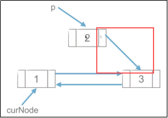
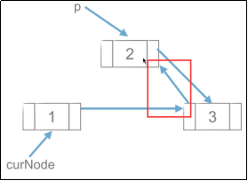

 


### 文章目录

- [#51 队列的实现](https://blog.csdn.net/cPen_web/article/details/111347846#51_09_7)
- [#52 队列的内置模块](https://blog.csdn.net/cPen_web/article/details/111347846#52_09_90)
- [#53 栈和队列的应用：迷宫问题](https://blog.csdn.net/cPen_web/article/details/111347846#53_09_168)
- [#54 使用栈解决迷宫问题](https://blog.csdn.net/cPen_web/article/details/111347846#54_09_200)
- [#55 使用队列进行迷宫问题：介绍](https://blog.csdn.net/cPen_web/article/details/111347846#55_09_347)
- [#56 使用队列进行迷宫问题：实现](https://blog.csdn.net/cPen_web/article/details/111347846#56_09_379)
- [#57 链表介绍](https://blog.csdn.net/cPen_web/article/details/111347846#57_09_529)
- [#58 链表创建和遍历](https://blog.csdn.net/cPen_web/article/details/111347846#58_09_571)
- [#59 链表的插入和删除](https://blog.csdn.net/cPen_web/article/details/111347846#59_09_725)
- [#60 双链表](https://blog.csdn.net/cPen_web/article/details/111347846#60_09_795)

# #51 队列的实现

```
#注：这是 存放固定长度的情况
#注：这是 队满的时候 空1个的情况
class Queue:
    def __init__(self, size=100):
    #注：size 表示大小是100的列表。
    #注：为什么要建定长的列表？答：为了知道maxsize，队空、队满（所以指定长度）
        self.size = size
        self.queue = [0 for _ in range(size)]   #注：长度100的列表
        self.rear = 0   # 队尾指针  进队
        self.front = 0  # 队首指针  出队

    def push(self, element):
        if not self.is_filled(): # 队不满的情况
            self.rear = (self.rear + 1) % self.size
            self.queue[self.rear] = element
        else:
            raise IndexError("Queue is filled.")

    def pop(self):
        if not self.is_empty(): # 队不空时
            self.front = (self.front + 1) % self.size
            return self.queue[self.front]
        else:
            raise IndexError("Queue is empty.")

    # 判断队空
    def is_empty(self):
        return self.rear == self.front  # 队空

    # 判断队满
    def is_filled(self):
        return (self.rear + 1) % self.size == self.front

q = Queue(5)
for i in range(4):  #因为 队满的时候 空1个 所以4
    q.push(i)
print(q.is_filled()) #注：队满
#结果 True
print(q.pop())
#结果 0
q.push(4)
```


```
#精简代码
class Queue:
    def __init__(self, size=100):
        self.size = size
        self.queue = [0 for _ in range(size)]
        self.rear = 0   # 队尾指针
        self.front = 0  # 队首指针

    def push(self, element):
        if not self.is_filled():
            self.rear = (self.rear + 1) % self.size
            self.queue[self.rear] = element
        else:
            raise IndexError("Queue is filled.")

    def pop(self):
        if not self.is_empty():
            self.front = (self.front + 1) % self.size
            return self.queue[self.front]
        else:
            raise IndexError("Queue is empty.")

    # 判断队空
    def is_empty(self):
        return self.rear == self.front

    # 判断队满
    def is_filled(self):
        return (self.rear + 1) % self.size == self.front

q = Queue(5)
for i in range(4):
    q.push(i)
print(q.pop())
q.push(4)
```


# #52 队列的内置模块

```
###### 双向队列
# 双向队列的两端都支持进队和出队操作
# 双向队列的基本操作：
#       队首进队
#       队首出队
#       队尾进队
#       队尾出队
```


编辑


```
###### Python队列内置模块
```


编辑


```
from collections import deque
#deque:双向的 dequeue 双向队列
q = deque()     #注：创建队列 空队列
q = deque([1,2,3], 5)  # 注：建立队列，已经有1,2,3了。5 设立最大长度，队满了 前面的就自动出队
# 用于单向队列
q.append(1)     # 队尾进队
# q.popleft()   # 队首出队
print(q.popleft())
#结果 2

# 用于双向队列
q.appendleft(1) # 队首进队
q.pop()         # 队尾出队

### 利用这点 可以做的事 (linux方面)： tail 5 打印文件后5行
#使用队列写
def tail(n):
    with open('test.txt', 'r', encoding='utf8') as f:
        q = deque(f,n)
        return q

print(tail(5))
#结果为
# deque(['第6行\n', '第7行\n', '第8行\n', '第9行\n', '第10行'], maxlen=5)
for line in tail(5):
    print(line, end='')
#结果为
# 第6行
# 第7行
# 第8行
# 第9行
# 第10行
#原理是： f相当于列表，Python3可以对文件对象进行for循环，迭代一次就是一个readline
        # n是大小，大小为5的队列。每次读一下f，第6行进队时，第1行自动出队了 ，……最后一直到最后一个元素进队
        # 返回的q 就是封装之后的列表
```


```
#精简代码
from collections import deque

q = deque([1,2,3,4,5], 5)
q.append(6)     # 队尾进队
q.popleft()     # 队首出队

# 用于双向队列
q.appendleft(1) # 队首进队
q.pop()         # 队尾出队

def tail(n):
    with open('test.txt', 'r', encoding='utf8') as f:
        q = deque(f,n)
        return q

for line in tail(5):
    print(line, end='')

#注：如果是读文件前几行  直接for循环读
```


# #53 栈和队列的应用：迷宫问题

```
###### 栈和队列的应用 -- 迷宫问题
# 给一个二维列表，表示迷宫（0表示通道，1表示围墙）。给出算法，求一条走出迷宫的路径。
maze = [
    [1,1,1,1,1,1,1,1,1,1],
    [1,0,0,1,0,0,0,1,0,1],
    [1,0,0,1,0,0,0,1,0,1],
    [1,0,0,0,0,1,1,0,0,1],
    [1,0,1,1,1,0,0,0,0,1],
    [1,0,0,0,1,0,0,0,0,1],
    [1,0,1,0,0,0,1,0,0,1],
    [1,0,1,1,1,0,1,1,0,1],
    [1,1,0,0,0,0,0,0,0,1],
    [1,1,1,1,1,1,1,1,1,1]
]
```


编辑


```
###### 栈 -- 深度优先搜索
# 回溯法
# 思路：从一个节点开始，任意找下一个能走的点，当找不到能走的点时，退回上一个点寻找是否有其他方向的点。
# 使用栈存储当前路径

#注：将坐标写到栈里。死胡同的话，就回溯
#注：深度优先搜索：一条路走到黑，不行了就往回走，直到找到
#注：这种方法 用栈来存当前的路径 。走到最后，栈的路径 就是找到的路 （不一定是最短的，但是是可行的）
#注：作者给出的选择是 先 ↑ → ↓ ← 的顺序
```


编辑

# #54 使用栈解决迷宫问题

编辑

```
#注：1代表墙，0代表能走
maze = [
    [1,1,1,1,1,1,1,1,1,1],
    [1,0,0,1,0,0,0,1,0,1],
    [1,0,0,1,0,0,0,1,0,1],
    [1,0,0,0,0,1,1,0,0,1],
    [1,0,1,1,1,0,0,0,0,1],
    [1,0,0,0,1,0,0,0,0,1],
    [1,0,1,0,0,0,1,0,0,1],
    [1,0,1,1,1,0,1,1,0,1],
    [1,1,0,0,0,0,0,0,0,1],
    [1,1,1,1,1,1,1,1,1,1]
]

dirs = [    #注：封装1个列表，表示4个方向
    lambda x,y: (x+1,y),
    lambda x,y: (x-1,y),
    lambda x,y: (x,y-1),
    lambda x,y: (x,y+1)
]   #注：顺序不重要，是它选的方向

def maze_path(x1,y1,x2,y2):
#注：x1,y1 代表起点位置；x2,y2 代表终点位置
    stack = []  #注：创建空栈
    stack.append((x1, y1))	#注：初始位置
    #注：最开始栈里有起点位置，栈里存的是元组 (位置)
    #注：栈空 表示没有路 （注：可以回走，只要不是直线穿插）
    while(len(stack)>0):#注：栈不空时 进行循环
        curNode = stack[-1] #注：当前节点（栈顶） ;找4个方向 能走的点
        if curNode[0] == x2 and curNode[1] == y2:   #注：判断条件写这，因为每次走完都会赋值上一句
            # 走到终点了，整个栈就是路径，输出路径
            for p in stack: #注：遍历栈 输出
                print(p)
            return  True    #注：有路 返回True
        # 四个方向如下
        # x,y 四个方向： x-1,y；x+1,y;x,y-1;x,y+1 上下左右
        # 注：(不能看成坐标写。看行列 0 1，0代表 第1个参数x表示行 往上下走；第2个参数y表示列，往左右走)
        for dir in dirs:
            nextNode = dir(curNode[0], curNode[1])  #注：4个方向的映射，上面的lambda函数
            #注：返回的是 x,y = x+1,y ……4个情况某一种
            # 如果下一个节点能走
            if maze[nextNode[0]][nextNode[1]] == 0:
                stack.append(nextNode)
                maze[nextNode[0]][nextNode[1]] = 2  # 2表示已经走过了，将刚走的标记成已经走过了
                break   # 注：找到1个能走的点就可以
        else: #注：如果1个都找不到，回退
            maze[curNode[0]][curNode[1]] = 2
            #注：如果1个都找不到了，将当前位置 标记为已经走过
            stack.pop() #注：回退的步骤：栈顶出栈，继续看它前面一个
            #注：前一个再看有没有能走的；之前走过的不会再走一遍(因为标记为2了)
    else: #注：栈空的时候，没有路的情况
        print("没有路")
        return False
#注：主体：4个方向，有路 进栈 重新循环，再看下一个节点；没有路  出栈，看上一个节点
#注：一直在想的  找不到路 对当前节点 进行=2的操作，会不会堵住回去的路，其实不会，因为回退使用的是pop，可以返回到最原始的那条路

maze_path(1,1,8,8)
#结果为
# (1, 1)
# (2, 1)
# (3, 1)
# (4, 1)
# (5, 1)
# (5, 2)
# (5, 3)
# (6, 3)
# (6, 4)
# (6, 5)
# (7, 5)
# (8, 5)
# (8, 6)
# (8, 7)
# (8, 8)
```


```
# 精简代码
maze = [
    [1,1,1,1,1,1,1,1,1,1],
    [1,0,0,1,0,0,0,1,0,1],
    [1,0,0,1,0,0,0,1,0,1],
    [1,0,0,0,0,1,1,0,0,1],
    [1,0,1,1,1,0,0,0,0,1],
    [1,0,0,0,1,0,0,0,0,1],
    [1,0,1,0,0,0,1,0,0,1],
    [1,0,1,1,1,0,1,1,0,1],
    [1,1,0,0,0,0,0,0,0,1],
    [1,1,1,1,1,1,1,1,1,1]
]

dirs = [
    lambda x,y: (x+1,y),
    lambda x,y: (x-1,y),
    lambda x,y: (x,y-1),
    lambda x,y: (x,y+1)
]

def maze_path(x1,y1,x2,y2):
    stack = []
    stack.append((x1, y1))
    while(len(stack)>0):
        curNode = stack[-1] # 当前的节点
        if curNode[0] == x2 and curNode[1] == y2:
            # 走到终点了
            for p in stack:
                print(p)
            return  True

        # x,y 四个方向： x-1,y；x+1,y;x,y-1;x,y+1
        for dir in dirs:
            nextNode = dir(curNode[0], curNode[1])
            # 如果下一个节点能走
            if maze[nextNode[0]][nextNode[1]] == 0:
                stack.append(nextNode)
                maze[nextNode[0]][nextNode[1]] = 2  # 2表示为已经走过
                break
        else:
            maze[curNode[0]][curNode[1]] = 2
            stack.pop()
    else:
        print("没有路")
        return False

maze_path(1,1,8,8)
#结果为
# (1, 1)
# (2, 1)
# (3, 1)
# (4, 1)
# (5, 1)
# (5, 2)
# (5, 3)
# (6, 3)
# (6, 4)
# (6, 5)
# (7, 5)
# (8, 5)
# (8, 6)
# (8, 7)
# (8, 8)

#注：总结：使用栈来实现迷宫问题，思想 深度优先搜索  也叫作回溯法，使用栈存储当前路径。 代码相对简单，但路劲不一定最短
```


# #55 使用队列进行迷宫问题：介绍

```
###### 队列 -- 广度优先搜索
# 思路：从一个节点开始，寻找所有接下来能继续走的点，继续不断寻找，直到找到出口。
# 使用队列存储当前正在考虑的节点
```


 编辑

 编辑

 编辑

```
#注：栈   深度优先 是从当前节点开始 只考虑下面1个节点
#注：队列 广度优先 同时考虑所有

#注：队列里 放的是路的分叉的尖端
#注：队列里存的不是路径，队列里是现在考虑的路的分叉的尖端
#注：问题 ：如何输出这个路径？
#注：答：找到终点之后，倒着找回去。找 哪个点出队 导致它进来的
#注：哪个点出队 导致它进来的 怎么存？答：额外的列表 (2列)
#注：第1列 是出队的序列，第2列 是哪个点让它来的
#	 1  2                  3           4  5  6  7
#	-1  0(0号位置上的点：1) 1(1号位置)  2  2  3  4
```


 编辑

 编辑

```
#注：假如说终点是7，7出队了，7是终点，结束整个算法。找路径，7是4号位置来的 ，从7找到4号位置5；5是2号位置来的，3是1号来的；2是0号来的，找到1；1是-1，-1就没有了，结束了
#注：把这一串倒着回去 1 2 3 5 7
#注：这个  找路径费点劲，需要额外列表，来记录 哪个点 让这个点加进来的。队列的元素 出去了之后 放到这个列表里
```


# #56 使用队列进行迷宫问题：实现

```
from collections import deque   #注：使用现成的队列

maze = [
    [1,1,1,1,1,1,1,1,1,1],
    [1,0,0,1,0,0,0,1,0,1],
    [1,0,0,1,0,0,0,1,0,1],
    [1,0,0,0,0,1,1,0,0,1],
    [1,0,1,1,1,0,0,0,0,1],
    [1,0,0,0,1,0,0,0,0,1],
    [1,0,1,0,0,0,1,0,0,1],
    [1,0,1,1,1,0,1,1,0,1],
    [1,1,0,0,0,0,0,0,0,1],
    [1,1,1,1,1,1,1,1,1,1]
]


dirs = [
    lambda x,y: (x+1,y),
    lambda x,y: (x-1,y),
    lambda x,y: (x,y-1),
    lambda x,y: (x,y+1)
]
#注：二维列表 和 4个方向 lambda表达式 拿过来直接用

def print_r(path):
    #注：path是出去的节点，不是真正的路径，有很多节点，只有1条最后真正到了终点的
    curNode = path[-1]  #注：当前path最后一个元素 就是终点，放到真实路径里去

    realpath = []  #注：存放真正的路径
    #注：前一个节点 有curNode 第3个位置 去找这个位置
    while curNode[2] != -1: #注：只要curNode[ 2]不等于-1就一直循环。找到-1就是最开始了 结束了
        # realpath.append((curNode[0],curNode[1]))  #注：这样写 或者元组切片  ，存到真实路径
        realpath.append(curNode[0:2])
        curNode = path[curNode[2]]  #注：找下一个节点 ，curNode[2]是位置 ，path[curNode[2]]是下一个节点
        #注：直到curNode[2] == -1  起点

    realpath.append(curNode[0:2])   #注：循环结束以后 curNode[2] == -1，是起点，把起点存进去
    #注：先append终点，最后到起点，所以raelpath是倒序的
    realpath.reverse()  #注：自己倒序
    for node in realpath:
        print(node) #注：列表循环打印 更好看

def maze_path_queue(x1,y1,x2,y2):
    queue = deque() #注：创建队列
    #注：起点进队列
    queue.append((x1,y1,-1))    #注：-1 起点是自己进来的
    #注：进队的元素 是3维的，需要保存下标(哪个让它来的)
    #注：起点是-1让它来的
    path = []   #注：空列表，存放出队的 节点
    while len(queue) > 0:   #注：只要队不空
    #注：队空 当前的前端 都没有路了。队里存的前端
        curNode = queue.popleft()   #注：队首出队+赋值存到curNode变量里
        path.append(curNode)    #注：把出队的节点 放到path里
        if curNode[0] == x2 and curNode[1] == y2:   #注：判断找到终点的情况
            # 终点，输出所走路径
            print_r(path)   #注：打印路径  返回
            return True
        #注：把curNode所有的后边的节点 都放进去 (4个方向  循环)
        for dir in dirs:
            nextNode = dir(curNode[0], curNode[1]) #注：看这个节点是不是能走
            if maze[nextNode[0]][nextNode[1]] == 0: #注：如果它能走 就进队
                queue.append((nextNode[0], nextNode[1], len(path) - 1))  #注：第3个参数 curNode让它来的，curNode的下标
                #注：第3个参数 写curNode存在 path 里的下标，curNode肯定存在path的最后位置，所以写path最后一个元素的下标
                #注：所以curNode在 path里的下标 是 len(path)-1
                maze[nextNode[0]][nextNode[1]] = 2  #注：标记为已经走过 (和上节一样)
                #注：这里不要写break。栈是深度优先，找到了一个 其他我不管。这里队 广度优先，找到一个方向 还要接着找
                #注：如果一个节点都没有，当前的节点是死胡同，没有其他可以做的了
    else:   #注：队空(len(queue) = 0)时 ,没有路
        print("没有路")
        return False
#注：它的0、1号位置 是下标，2号位置 存的是 是谁带它来的。倒着往回找，最开始的地方是起点

maze_path_queue(1,1,8,8)
#结果为
# (1, 1)
# (1, 2)
# ……
# (8, 8)
```


```
#精简代码
from collections import deque

maze = [
    [1,1,1,1,1,1,1,1,1,1],
    [1,0,0,1,0,0,0,1,0,1],
    [1,0,0,1,0,0,0,1,0,1],
    [1,0,0,0,0,1,1,0,0,1],
    [1,0,1,1,1,0,0,0,0,1],
    [1,0,0,0,1,0,0,0,0,1],
    [1,0,1,0,0,0,1,0,0,1],
    [1,0,1,1,1,0,1,1,0,1],
    [1,1,0,0,0,0,0,0,0,1],
    [1,1,1,1,1,1,1,1,1,1]
]


dirs = [
    lambda x,y: (x+1,y),
    lambda x,y: (x-1,y),
    lambda x,y: (x,y-1),
    lambda x,y: (x,y+1)
]

def print_r(path):
    curNode = path[-1]

    realpath = []

    while curNode[2] != -1:
        realpath.append(curNode[0:2])
        curNode = path[curNode[2]]

    realpath.append(curNode[0:2])   # 起点
    realpath.reverse()
    for node in realpath:
        print(node)

def maze_path_queue(x1,y1,x2,y2):
    queue = deque()
    queue.append((x1,y1,-1))
    path = []
    while len(queue) > 0:
        curNode = queue.popleft()
        path.append(curNode)
        if curNode[0] == x2 and curNode[1] == y2:
            # 终点
            print_r(path)   #注：打印终点  返回
            return True
        for dir in dirs:
            nextNode = dir(curNode[0], curNode[1])
            if maze[nextNode[0]][nextNode[1]] == 0:
                queue.append((nextNode[0], nextNode[1], len(path) - 1)) # 后续节点进队，记录哪个节点带他来的
                maze[nextNode[0]][nextNode[1]] = 2  # 标记为已经走过
    else:
        print("没有路")
        return False

maze_path_queue(1,1,8,8)
#结果为
# (1, 1)
# ……
# (8, 8)

#注：线性数据结构：哈希表
```


# #57 链表介绍

```
#注：链表：线性数据结构    一个节点 有前有后
###### 链表
# 链表是由一系列节点组成的元素集合。每个节点包含两部分，数据域item和指向下一个节点的指针next。通过节点之间的相互连接，最终串联成一个链表。
```


编辑


```
#注：每一个节点都是一个框，每个节点封装成 Node对象。Node对象包含 item、next。item是存的数，next指向下一个节点
#注：链表由 next 连接关系
class Node:
    def __init__(self, item):
        self.item = item
        self.next = None
```


```
class Node:
    def __init__(self, item):
        self.item = item
        self.next = None

a = Node(1) #注：a、b、c 3个节点
b = Node(2)
c = Node(3)
a.next = b  #注：这样连接起来 (next)
b.next = c
#注：手动定义的链表

#注：只需要通过a节点 就能找到 b和c
print(a.next.item)
#结果 2   a.next为b
print(a.next.next.item)
#结果 3   b.next为c
print(a.next.next.next.item)
#报错  c,next为空  没有item

li = [1,2,3,4,5]    #注：列表是依次存的
#链表跟它不一样
```


# #58 链表创建和遍历

```
###### 创建链表
# 头插法
# 尾插法
```


编辑


```
#注：头插法：链表有头节点，86是头节点，可以从86 向后找其他节点
    #头插法：在头节点这地方插，比如创建链表 2、1,  2是头节点。新节点3  插到头这(2)，3成为新的头，头节点指向3
```


编辑

```
#注：尾插法：不光需要知道头在哪，还要知道尾巴在哪。1是头，2是尾，3往尾巴2 这里插，尾节点指向3
```


编辑

```
#注：如果一开始是空链表，那么 头插法 是倒序的，尾插法 是正序的
```


```
#头插法
#注：头插法 只要维护 头
class Node:
    def __init__(self, item):
        self.item = item
        self.next = None

def create_linklist_head(li):    #注：传入列表,通过列表 循环插入
    head = Node(li[0])   #注：刚开始 建立空链表 的 头节点
    for element in li[1:]:  #注：从1 开始  因为0已经有了
        node = Node(element)    #注：创建新节点，插入头那来。新节点是我的头节点
        node.next = head
        head = node       #注：新节点 是我的 头节点
    return head #注：返回链表头

def print_linklist(lk):
    while lk:   #注：lk是头，只要lk不是None
        print(lk.item, end = ',')
        lk = lk.next

lk = create_linklist_head([1,2,3])
print(lk.item)  #注：打印头的item
#结果为 3
print(lk.next.item)
#结果为 2
#注：打印的过程  叫做链表的遍历，从头依次打印到最后一个
print_linklist(lk)
#结果为 3,2,1,
#注：头插法 是倒序的
```


```
#头插法 精简代码
class Node:
    def __init__(self, item):
        self.item = item
        self.next = None

def create_linklist_head(li):
    head = Node(li[0])
    for element in li[1:]:
        node = Node(element)
        node.next = head
        head = node
    return head

def print_linklist(lk):
    while lk:
        print(lk.item, end = ',')
        lk = lk.next

lk = create_linklist_head([1,2,3])
print_linklist(lk)
#结果为 3,2,1,
#注：头插法 是倒序的
```


```
#尾插法
#注：尾插法 需要维护 头和尾巴，因为 要从头知道尾巴
class Node:
    def __init__(self, item):
        self.item = item
        self.next = None

def create_linklist_head(li):
    head = Node(li[0])
    for element in li[1:]:
        node = Node(element)
        node.next = head
        head = node
    return head

def create_linklist_tail(li):
    head = Node(li[0])  #注：根据第1个元素 创建头节点
    tail = head         #注：头指向它 尾巴也指向它
    for element in li[1:]:
        node = Node(element)    #注：循环创建节点,把尾巴tail 和 这个节点连起来，再让这个节点 成为新的尾巴
        tail.next = node    #注：这是让tail 把这个节点连接起来
        tail = node         #注：这是 让这个节点 成为tail
    return head #注：返回head，因为在现在的链表里 只能是 从头往后找。返回尾巴不能往回找，它只有next

def print_linklist(lk):
    while lk:
        print(lk.item, end = ',')
        lk = lk.next

lk = create_linklist_tail([1,2,3,6,8])
print_linklist(lk)
#结果为 1,2,3,6,8,
#注：尾插法 是正序的
```


```
#尾插法 精简代码
class Node:
    def __init__(self, item):
        self.item = item
        self.next = None

def create_linklist_tail(li):
    head = Node(li[0])
    tail = head
    for element in li[1:]:
        node = Node(element)
        tail.next = node
        tail = node
    return head

def print_linklist(lk):
    while lk:
        print(lk.item, end = ',')
        lk = lk.next

lk = create_linklist_tail([1,2,3,6,8])
print_linklist(lk)
#结果为 1,2,3,6,8,
```


```
#链表的遍历 (打印)：从第一个元素 一直访问，访问到最后一个元素
#注：写while循环，判断当前节点是不是空，不是空的话输出，它就出局 看它的下一个节点
#注：因为 函数 返回的 head  所以lk是头节点
def print_linklist(lk):
    while lk:
        print(lk.item, end = ',')
        lk = lk.next
```


编辑

#  #59 链表的插入和删除

```
#注：列表  插入和删除，insert 时间复杂度 是 O(n),最前面插入是O(n)，中间插入是1/2 O(n) 也是O(n)
#注：列表append插入 复杂度O(1)
#注：列表 要插入的节点 需要费时间往外挪元素的
#注：而链表不用，因为 链表不是顺序存的，是 链 next存的。把2个链解开 再插入一个进去 就可以了
```


```
###### 链表节点的插入
```


编辑

```
#注：4 插到  1、2中间。当前节点curNode 1
#注：不能先把 1 跟4 链起来，因为 这样 1的next指向4, 2就找不到了，没有指向它的东西，就会游失在内存里 马上就会销毁
#注：所以 第一步 先把4 跟 2 链起来  即 p.next = curNode.next ， 4 指向2
#注：第二步 ， curNode = p  ，  1指向4
#注：第一步  p.next = curNode.next
```


编辑

```
#注：第二步  curNode = p
```


编辑

```
p.next = curNode.next
curNode.next = p
```


```
#注：这个 链表 插入 没有做任何元素的移动，就2 句话，2句话都是一个赋值，所以时间复杂度很低，很快的
```


```
###### 链表节点的删除
```


编辑

```
#注：链表  1 4 2 3  ，想 把 4 删掉  ( p )
#注：先把p 后面那个节点删掉   p = curNode.next
#注：再把 1 2 两个链起来     curNode.next = curNode.next.next 或者写 curNode.next = p.next
#注：再把p删掉               del p 或者不写 都无所谓了，不要它了
#注：这就是链表的删除操作，这个操作也是一个特别快的操作，没有 任何元素的移动，就几个赋值，时间复杂度很低  。 而 列表删除一个元素，后面的元素都要往前挪1个
```


```
#注：先 p = curNode.next
```


编辑

```
#注：再 curNode.next = curNode.next.next 或者写 curNode.next = p.next  2个链起来
```


编辑

```
#注：再 del p 或者不写
```


编辑

```
p = curNode.next
curNode.next = curNode.next.next
del p
```


# #60 双链表

```
#注：之前的链表 是 单向链表，只能从前往后找
###### 双链表
# 双链表的每个节点有两个指针：一个指向后一个节点，另一个指向前一个节点。
# 如何建立双链表？
#注：双链表 的节点定义 包括3个部分： item 放数据；next 指向它后边那个节点；prior 指向它前一个节点。 这样的话  就形成了 双链表
#注：双链表  知道一个链表的节点 ，就可以找它 前一个 和 后一个 ，插入删除 都可以用，从前往后 和  从后往前 都可以
```


```
#注：双链表 节点定义：
class Node(object):
    def __init__(self, item=None):
        self.item = item
        self.next = None
        self.prior = None
```


```
###### 双链表节点的插入
p.next = curNode.next
curNode.next.prior = p
p.prior = curNode
curNode.next = p
```


编辑

```
#注：在1 和 3 之间  把2 插进来
#注：单链表 是 2 和 3 先连，不能 1 、2 先连，否则3 会断了
#注：所以 第一步 2 先和 3 连    p.next = curNode.next
#注：第二步 往回连 3 跟 2 再连  curNode.next.prior = p
#注：第三步 p 跟 1 连上         p.prior = curNode
#注：第四步 1 跟 p 连上         curNode.next = p
```


```
#注：第一步 2 先和 3 连    p.next = curNode.next
```


编辑

```
#注：第二步 往回连  3 跟 2 再连  curNode.next.prior = p
```


编辑

```
#注：第三步 p 跟 1 连上         p.prior = curNode
```


编辑

```
#注：第四步 1 跟 p 连上         curNode.next = p
```


编辑

```
###### 双链表节点的删除
p = curNode.next
curNode.next = p.next
p.next.prior = curNode
del p
```


编辑

```
#注：先把 1 和 3 给连上   curNode.next = p.next
#注：再  3 和 1 连上      p.next.prior = curNode
#注：再 把 p 删掉         del p
```


```
#注：先把 1 和 3 给连上   curNode.next = p.next
```


编辑

```
#注：再  3 和 1 连上      p.next.prior = curNode
```


 编辑

```
#注：再 把 p 删掉         del p

#注：创建链表 用的也是 插入 ，只不过 它是在 头上插  或者在尾巴上插，一样的道理
```

