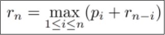
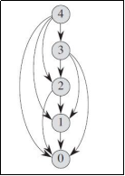
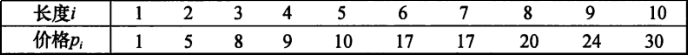
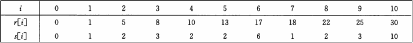
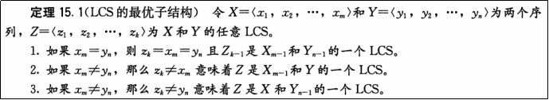
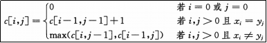
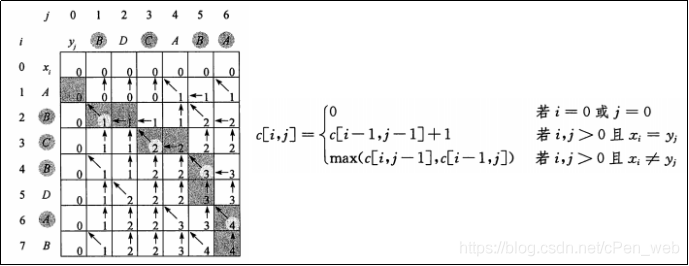
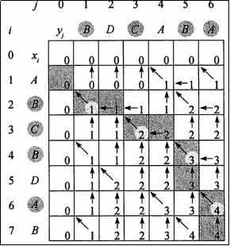
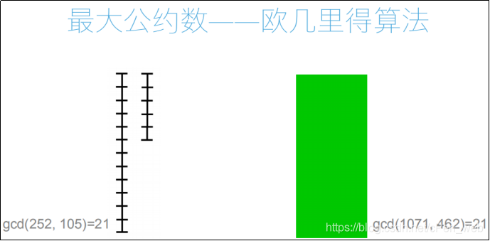
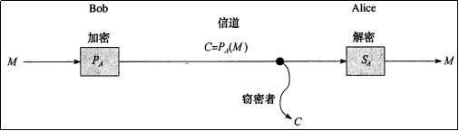

 

```
###### 钢条切割问题 -- 重构解
# 如何修改动态规划算法，使其不仅输出最优解，还输出最优切割方案？
# 对每个子问题，保存切割一次时左边切下的长度
```


[b站视频:路飞IT学城](https://www.bilibili.com/video/BV1mp4y1D7UP)
 [清华计算机博士带你学习Python算法+数据结构_哔哩哔哩_bilibili](https://www.bilibili.com/video/BV1mp4y1D7UP)

# #91 钢条切割问题：自底向上实现

```
#注：动态规划的写法，不用递归，自底向上的写法，先算r1、再算r2、r3 ……
```


- 1

编辑


```
from cal_time import cal_time

p = [0, 1, 5, 8, 9, 10, 17, 17, 20, 21, 23, 24, 26, 27, 27, 28, 30, 33, 36, 39, 40]

@cal_time
def cut_rod_dp(p, n):
    r = [0]  # DP，需要把它存起来。长度是0时 值是0。相当于递归条件
    for i in range(1, n+1): # 循环 从1 到 n，循环n次。r1 时 i就表示1
    # 相当于 从小到大 求r1、r2、r3……
        # 按照递推式来写
        res = 0
        for j in range(1, i+1):     # j相当于 1<=i<=n ，j相当于表达式里的i
            # 注：左边不切割 右边切割
            res = max(res, p[j] + r[i - j])   # 原写法是递归，现在写法 r[i-j]就是递推式里的 r n-i
            # 因为比i小的r 都已经append到r里面了，可以直接得到r[i-j]
        # 这个for循环结束之后 ,res就是r[i]这个值，算出来 把它放到r里
        r.append(res)
    return r[n]             # 最后算完后，要求r[n]

#注：和递归调用不一样的是 ，r[i-j]存起来，可以直接找
print(cut_rod_dp(p, 15))
#结果为
# cut_rod_dp running time: 0.0009980201721191406 secs.
# 42
```


```
#注：动态规划写法 比递归调用写法 快得多
#注：时间复杂度 是 n**2 (关于n的循环有2层)，而 递归调用时间复杂度是 2**n
```


```
###### 钢条切割问题 -- 动态规划解法
# 时间复杂度：O(n**2)
```


编辑


```
#注：动态规划解法，每次都是直接去取这个值，而不是把它再算一遍，所以快
#注：现在只是解决最大卖多少钱。怎么样输出应该怎么切？
```


**DP思想 精简代码**

```
def cut_rod_dp(p, n):
    r = [0]
    for i in range(1, n+1):
        res = 0
        for j in range(1, i+1):
            res = max(res, p[j] + r[i - j])
        r.append(res)
    return r[n]
```


# #92 钢条切割问题：重构解

```
###### 钢条切割问题 -- 重构解
# 如何修改动态规划算法，使其不仅输出最优解，还输出最优切割方案？
# 对每个子问题，保存切割一次时左边切下的长度
```


编辑


编辑


```
#注：r[i] 最多的钱数
#注：s[i] 存切割方案的值。长度是i的钢条，最优方案 对应的左边这段是多长 （即 切1刀，不切的部分的长度）


#注：比如 i=1,r[1]  最优解 最多的钱数是1，s[1] 1的最优方案时 左边这段长为1 （1 、0切法）（因为切的话 左边不能为0，所以不可能0 1切法）
#注：比如 i=4,给个r[4]，怎么输出最优方案？首先4来了，知道左边这块是2 ，不切割，出去了，还剩2。剩2这个问题 转化成了长度是2 的问题了，再看2 这个位置。2这个位置 左边是2，还剩0 (即没有了)，完事了


# p = [0, 1, 5, 8, 9, 10, 17, 17, 20, 21, 23, 24, 26, 27, 27, 28, 30, 33, 36, 39, 40]
p = [0, 1, 5, 8, 9, 10, 17, 17, 20, 24, 30]	#注：价格表

def cut_rod_extend(p, n):   # p是价格表，n是钢条长度
    r = [0]  # 最优 钱数
    s = [0]  # 最优方案 对应左边这段 长度
    for i in range(1, n+1): # 从底向上的算 r1、r2、……
        res_r = 0            # 价格的最大值
        res_s = 0            # 价格最大值对应方案的左边不切割的长度
        for j in range(1, i + 1):
            if p[j] + r[i - j] > res_r:
                res_r = p[j] + r[i - j] # 更新 价格的最大值
                res_s = j               # 同时更新 左边的长度
                # 这个方案对应的是 j 和 i-j，i是现在算的长度，j是遍历的过程。
                # 比如说求r5 ，i是5，j是个循环 1,2,3,4；把5切成1+4,2+3……
        #注：这个循环结束后 res_r是 最大的价格，res_s 是 对应的这个价格下的j (左边不切的部分)
        r.append(res_r)
        s.append(res_s)
    return r[n], s      # s 最优方案 对应的左边长度

r,s = cut_rod_extend(p, 10)
print(s)
#结果为
# [0, 1, 2, 3, 2, 2, 6, 1, 2, 3, 10]

#注：输出后 怎么往回找，告诉别人 切成几和几。怎么输出方案？

def cut_rod_solution(p, n):
    # 首先输出 函数结果，调用那个函数
    r, s = cut_rod_extend(p, n) # 最优值 和 s表 出来了
    #注：n 对应的 s这个表，就是它 第1列要输出的值
    ans = []    # 存最后要切成 几几几
    while n > 0:    # 因为 最后 n会变成0
        ans.append(s[n])    # 首先把s表对应的n输出出去
        n -= s[n]           # 比如刚开始n=9,3进去了，再看6，把6表里的s[6]放进去……等于0 时退出
    return ans             # 返回 切割方案

print(cut_rod_solution(p, 10))
#结果为 [10]       #注：不切割
print(cut_rod_solution(p, 9))
#结果为 [3, 6]     #注：切成3 和 6

p = [0, 1, 5, 8, 9, 10, 17, 17, 20, 21, 23, 24, 26, 27, 27, 28, 30, 33, 36, 39, 40]
r, s = cut_rod_extend(p, 20)
print(s)
#结果 [0, 1, 2, 3, 2, 2, 6, 1, 2, 3, 2, 2, 6, 1, 2, 3, 2, 2, 6, 1, 2]
print(cut_rod_solution(p, 20))
#结果 [2, 6, 6, 6]
#注：20，s[20]=2，s[18]=6,s[12]=6,s[6]=6,剩0 不切割，结束。输出方案 [2,6,6,6]
```


> \#注：钢条切割问题 这种 重构写 ，即输出最优方案。 通过s[i]记录不动的部分。往回追 列表的过程 （Chasing back），来输出这个方案
>  \#注：大部分 动态规划的问题 都是 Chasing back 往回追的过程。通过 记录1个其他信息的表，通过表往回追 ，来记录这个方案
>  

> \###### 动态规划问题关键特性
>  \# 什么问题可以使用动态规划⽅法？
>  \#  ·最优子结构 (#注：即 递推式)
>  \#    ·原问题的最优解中涉及多少个子问题
>  \#    ·在确定最优解使用哪些⼦问题时，需要考虑多少种选择
>  \#  ·重叠子问题
>  \#注：最优化问题：最大、最小，求最优值的时候 考虑用动态规划，和贪心算法一样。贪心算法 是 动态规划的一个特例，用贪心来做，用动态规划一定能做 ；反过来 不一定成立
>  \#注：涉及 最优子结构、重复子问题：递归的去想，算rn，假设r1,r2……r n-1都算出来了，看能不能算rn，如果能，递推式就出来了。递归能解，动态规划 应该也能解，不会重复计算
>  \#注：学会看公式，学会自己写公式
>  

# #93 [最长公共子序列](https://so.csdn.net/so/search?q=最长公共子序列&spm=1001.2101.3001.7020)

```
###### 最长公共子序列
# 一个序列的子序列是在该序列中删去若干元素后得到的序列。
#   ·例：“ABCD”和“BDF”都是“ABCDEFG”的子序列
# 最长公共子序列（LCS）问题：给定两个序列X和Y,求X和Y长度最大的公共子序列。
#   ·例：X="ABBCBDE" Y="DBBCDB" LCS(X,Y)="BBCD"
# 应用场景：字符串相似度比对
#注：俗称的 模糊查询 模糊搜索  并不是完全匹配，但是大部分一样
#注：基因工程 (人体基因ATCG 4个字母的字符串)、
```


```
#注：序列：字符串、列表 都是序列
#注：子序列：一个序列的子序列是在该序列中删去若干元素后得到的序列 （相对顺序要一致，中间可以不连续）
#注：子串：子串要连续的
```


```
#注：怎么 用算法 解决？ 首先 暴力去做，所有情况都选举起来
#   ·思考:暴力穷举法的时间复杂度是多少？     答：2**(m+n) 二的(m+n)次方
#   ·思考:最长公共子序列是否具有最优子结构性质?
```


```
#注：长度是n的 序列，它的子序列 有多少个？ 答：2**n 个 （跟钢条切割一个意思，n个字母，每个位置 可以有 可以没有）
#注：空串、它本身 都是1个子序列。比如说 ABCD、EFG 最长公共子序列 是 空序列，长度是0
#注：空序列 是 任何序列的子序列，它本身 也是它的子序列
```


```
#注：能不能用动态规划来做？答：首先 它 是 最优化问题 （最长），思考它有没有最优 子结构性质（能不能找到1个递推式，求出来 LCS(X,Y) ）
```


编辑

 **最优解的递推式**
 ​编辑


```
# 	·c[i,j]表示Xi和Yj的LCS⻓度


#注：比如说：ABCD 和 ABD ，LCS="ABD"。D = D, 那么 ABC 和 AB , LCS="AB"
```


```
#注：如果Xm、Yn相等(即 最后1个位置上的字符相等)，LCS长度 是k；那么 去掉最后1个字母，LCS长度是 k-1
#注：如果Xm、Yn不相等(即 最后1个字母不相等)，LCS长度 要么是Xm去掉1个字母c[i,j-1]对应长度，要么是Yn去掉1个字母c[i-1,j]对应长度，这2个长度取最大值
```


```
###### 最⻓公共子序列
# ·例如：要求a="ABCBDAB"与b="BDCABA"的LCS：
#   ·由于最后⼀位"B"≠"A"：
#       ·因此LCS(a,b)应该来源于LCS(a[:-1],b)与LCS(a,b[:-1])中更大的那⼀个
```


编辑


```
#注：情况1：i=0或j=0表示空串
#注：情况2：Xi=Yj，斜上方的值 + 1
#注：情况3：Xi≠Yj。从左边或者上边 取最大值，而不是从斜边取值，只去1个，而不是把2个都去了
#注：一来是X0,Y0, 空串和空串是 0……
#注：A、B两值，还是0，因为它两不相等
#注：BDCA和A，1，因为A相等
#注：BDCAB和A，1， 因为最后一位不相等，BDCA和A是1。所以1
#注：这是有条件的递归式，它是最优子结构，它只依赖于它的子问题 (依赖于它前面的值，左边的值，和斜向的值)
```


```
#注：按照动态规划的写法去写。构造二维列表，然后把最后那个值拿出来 (即右下角的值)
#注：第1行 和 第1列 都变成0，然后1行1行 填数。不会出问题，因为填任何值时，左上方3个值都已经有数了
```


# #94 最长公共子序列：实现

```
def lcs_length(x, y):   # x、y 字符串 或 列表
    m = len(x)          # 长度
    n = len(y)
    # 构造二维列表。(外围)m+1行 (里面)n+1列的二维列表,因为有0的存在
    c = [[0 for _ in range(n+1)] for _ in range(m+1)]    # 二维的列表生成式
    for i in range(1, m+1): # 1到m。不考虑0那个位置，默认是0
        for j in range(1, n+1):  # 1到n
            if x[i-1] == y[j-1]: # i j 位置上的字符匹配的时候，来自于左上方+1
            # 因为 x、y是字符串，下标从0开始
                c[i][j] = c[i-1][j-1] + 1
            else:   #  如果不等于，左边的值和上边的值取最大
                c[i][j] = max(c[i-1][j], c[i][j-1])
    return c[m][n]  # 循环完了后，返回最后那个数

print(lcs_length("ABCBDAB", "BDCABA"))
#结果为 4
#核心：动态规划问题 难点是 递归式
```


```
# for _ in c: # 这样可以逐行打印二维列表
#     print(_)
```


```
#注：最优值 长度出来了，怎么得出 这个序列是什么？
#注：所有斜着过来的位置，都代表着匹配，从左上方得到的值+1，代表匹配过来的，因为条件决定。
#注：要找的匹配的位置，匹配的位置对于的就是最长公共子序列的字母
#注：方法：回溯 trace back，从最后一个值出发，不光计算长度，还要记箭头的方向
```


编辑


```
#注：如图示
#注：最后1个值不一样，左边和右边都相等，定义为来自于上方，往上找
#注：A和A匹配，A出去
#注：不匹配，往上走
#注：B和B匹配，B出去
#注：不匹配，往左走
#注：匹配，C出去
#……
#注：到第1行或者第1列 (即为0时)，就停止

#注：推的时候 从前往后；找这条路径时 从后往前。这条路径所有斜向位置的值，就是我们想要的
#注：求其他位置也一样
```


```
#记箭头，用3个数来记
def lcs(x, y):
    m = len(x)
    n = len(y)
    c = [[0 for _ in range(n + 1)] for _ in range(m + 1)]
    # b跟c建立方法一样。b同样的位置，用来记箭头的
    b = [[0 for _ in range(n + 1)] for _ in range(m + 1)] # 1 左上方 2 上方 3 左方
    # 不光记录c的值，还要给b赋值
    for i in range(1, m+1):
        for j in range(1, n+1):
            if x[i-1] == y[j-1]:    # i j 位置上的字符匹配的时候，来自于左上方+1
                c[i][j] = c[i-1][j-1] + 1
                b[i][j] = 1         # 给b赋值，左上方来的
            elif c[i-1][j] >= c[i][j-1]: # 来自于上方
                c[i][j] = c[i-1][j]
                b[i][j] = 2         # 给b赋值，来自于上方
            else:                       # 来自于左方
                c[i][j] = c[i][j-1]
                b[i][j] = 3         # 给b赋值，来自于左方
    return c[m][n], b

c, b = lcs("ABCBDAB", "BDCABA")
for _ in b:
    print(_)
#结果     这个表的箭头的方向
# [0, 0, 0, 0, 0, 0, 0]
# [0, 3, 3, 3, 1, 3, 1]
# [0, 1, 3, 3, 3, 1, 3]
# [0, 2, 3, 1, 3, 3, 3]
# [0, 1, 3, 2, 3, 1, 3]
# [0, 2, 1, 3, 3, 2, 3]
# [0, 2, 2, 3, 1, 3, 1]
# [0, 1, 2, 3, 2, 1, 3]
```


```
#注：有了这个数组，只需要从后往前 找回去，找这个匹配的位置，把这个位置输出
```


```
#回溯的算法
def lcs_trackback(x, y):
    c,b = lcs(x, y)     # 调用刚才写的lcs
    i = len(x)          # 从最后一个位置开始走
    j = len(y)
    res = []            # 存最长子序列 字符
    while i > 0 and j > 0:   # i或j=0时 退出
        if b[i][j] == 1:    # 来自左上方 => 匹配
            res.append(x[i-1])  # 注意下标，因为x、y是字符串，下标从0开始
            i -= 1              # 输出完 往左上方走
            j -= 1
        elif b[i][j] == 2:  # 来自上方 => 不匹配
            i -= 1              # 不append，往上走
        else:               # ==3 ，来自左方 => 不匹配
            j -= 1              # 不append，往左走
    # 退出后,res是最长公共子序列，但是是倒着的
    return "".join(reversed(res))

print(lcs_trackback("ABCBDAB", "BDCABA"))
#结果 BCBA
```


```
#注：这个算法的问题：只找一个，如果有多个最长公共子序列，只输出一个
#注：回溯算法 和 动态规划 搭配着来。动态规划只负责求最优值，需要把动态规划的最优值记录 和 动态规划的过程记录(方向)。trackback按照方向 来往回 回溯

#注：钢条切割问题 最后输出切割方案，也是一个回溯，因为记录了中间过程，往回回溯
```


**精简代码**

```
def lcs_length(x, y):
    m = len(x)
    n = len(y)
    c = [[0 for _ in range(n+1)] for _ in range(m+1)]
    for i in range(1, m+1):
        for j in range(1, n+1):
            if x[i-1] == y[j-1]:    # i j 位置上的字符匹配的时候，来自于左上方+1
                c[i][j] = c[i-1][j-1] + 1
            else:
                c[i][j] = max(c[i-1][j], c[i][j-1])
    return c[m][n]

def lcs(x, y):
    m = len(x)
    n = len(y)
    c = [[0 for _ in range(n + 1)] for _ in range(m + 1)]
    b = [[0 for _ in range(n + 1)] for _ in range(m + 1)] # 1 左上方 2 上方 3 左方
    for i in range(1, m+1):
        for j in range(1, n+1):
            if x[i-1] == y[j-1]:    # i j 位置上的字符匹配的时候，来自于左上方+1
                c[i][j] = c[i-1][j-1] + 1
                b[i][j] = 1
            elif c[i-1][j] > c[i][j-1]: # 来自于上方
                c[i][j] = c[i-1][j]
                b[i][j] = 2
            else:
                c[i][j] = c[i][j-1]
                b[i][j] = 3
    return c[m][n], b


def lcs_trackback(x, y):
    c, b = lcs(x, y)
    i = len(x)
    j = len(y)
    res = []
    while i > 0 and j > 0:
        if b[i][j] == 1:    # 来自左上方=>匹配
            res.append(x[i-1])
            i -= 1
            j -= 1
        elif b[i][j] == 2:  # 来自于上方=>不匹配
            i -= 1
        else: # ==3 来自于左方=>不匹配
            j -= 1
    return "".join(reversed(res))

print(lcs_trackback("ABCBDAB", "BDCABA"))
```


# #95 [欧几里得算法](https://so.csdn.net/so/search?q=欧几里得算法&spm=1001.2101.3001.7020)


```
###### 最大公约数
#   ·约数：如果整数a能被整数b整除，那么a叫做b的倍数，b叫做a的约数。
#   ·给定两个整数a,b，两个数的所有公共约数中的最⼤值即为最⼤公约数（Greatest Common Divisor, GCD）。
#   ·例：12与16的最⼤公约数是4
```


```
###### 如何计算两个数的最大公约数：
#   ·欧几里得：辗转相除法（欧几里得算法）
#   ·《九章算术》：更相减损术
```


```
### 欧几里得算法：gcd(a, b) = gcd(b, a mod b)
# ·例：gcd(60, 21) = gcd(21, 18) = gcd(18, 3) = gcd(3, 0) = 3     # 不停取余
```


编辑


```
#注：核心 gcd(a, b) = gcd(b, a mod b)  递归的式子
def gcd(a,b):
    if b == 0:      # 终止条件 有个数变成0
        return a
    else:
        return gcd(b, a % b)

print(gcd(12,16))
#结果为 4
#注：递归的写法，递归的写法会慢吗？不一定，因为这是伪递归，伪递归的效率和循环是一样的，编译器 会进行优化
```


```
# 非递归的写法
def gcd2(a, b):
    while b > 0:    # 循环终止条件 b变成0
        r = a % b    # 先记录 a模b
        a = b
        b = r
    return a        # 如果b=0时

print(gcd(12,16))
#结果为 4
```


```
###### 应用：实现分数计算
#   ·利用欧几里得算法实现一个分数类，支持分数的四则运算。
#注：计算机不支持分数，我们来实现一个分数类
```


```
class Fraction:
    def __init__(self, a, b):   # a分子、b分母
        self.a = a
        self.b = b
        x = self.gcd(a,b)       # 最大公约数
        self.a /= x     # 约分，化成最简形式
        self.b /= x

    def gcd(self, a, b):
        while b > 0:
            r = a % b
            a = b
            b = r
        return a

    def zgs(self, a, b):      # 最小公倍数
        # 12 16 -> 4
        # 3*4*4=48  #注：拿a、b除以 最大公倍数，这3个值再相乘，就是最小公倍数
        x = gcd(a, b)
        return a * b /x

    def __add__(self, other):   # 加法 add方法，直接在外面用2个对象 做加
        # self是1个分数对象，other也是一个分数对象
        # 1/12 + 1/20
        a = self.a  #注：a/b + c/d
        b = self.b
        c = other.a
        d = other.b
        fenmu = self.zgs(b, d)  # b和d最小公倍数
        fenzi = a * fenmu / b + c * fenmu / d
        return Fraction(fenzi, fenmu)

    def __str__(self):  # 打印出分母的格式
        return "%d/%d" % (self.a, self.b)

f = Fraction(30,16)
print(f)
#结果为 15/8
a = Fraction(1,3)
b = Fraction(1,2)
print(a+b)
#结果为 5/6
```


```
#注：这是加法；减法类似；乘法  分子一乘、分母一乘 再约分(通过最大公约数约分)
# def __add__(self, other):   # 加
# def __sub__(self, other):   # 减
# def __mul__(self, other):   # 乘
# def __divmod__(self, other):# 除
#注：数学上 数论：专门研究整数，最大公约数这是最基本的，密码学 基于数论的理论
```


**精简代码**
 

```
class Fraction:
    def __init__(self, a, b):
        self.a = a
        self.b = b
        x = self.gcd(a,b)
        self.a /= x
        self.b /= x

    def gcd(self, a, b):
        while b > 0:
            r = a % b
            a = b
            b = r
        return a

    def zgs(self, a, b):
        # 12 16 -> 4
        # 3*4*4=48
        x = self.gcd(a, b)
        return a * b / x

    def __add__(self, other):
        a = self.a
        b = self.b
        c = other.a
        d = other.b
        fenmu = self.zgs(b, d)
        fenzi = a * fenmu / b + c * fenmu / d
        return Fraction(fenzi, fenmu)

    def __str__(self):
        return "%d/%d" % (self.a, self.b)

a = Fraction(1,3)
b = Fraction(1,2)
print(a+b)
```


# #96 [RSA](https://so.csdn.net/so/search?q=RSA&spm=1001.2101.3001.7020)算法介绍

```
# RSA加密算法简介 (密码学的范畴)
```


```
###### 密码与加密
# ·传统密码：加密算法是秘密的
# ·现代密码系统：加密算法是公开的，密钥是秘密的
#   ·对称加密
#   ·非对称加密
```


```
#注：我们俗称的密码，在密码学中称为 口令，比如说 password 登录的用户名和密码，是用来验证的
#注：密码主要 用在 2个方向上 加密和解密
#注：传统密码：加密算法是秘密的。比如 凯撒密码：每个字母往后移3位；(其实 密码就是一种映射)
#   ·不好的地方：算法被截获了，就不行了。通过计算机 或者 枚举
#注：现代密码系统：加密算法是公开的，密钥是秘密的。密钥？一般是2个数
#注：RSA加密算法 属于非对称加密。2个密钥，1个密钥加密，1个密钥解密。
#注：如果 加密 解密 用1个密钥，称为 对称加密
#注：如果 1个密钥用来加密 1个密钥用来解密，称为 非对称加密
```


```
###### RSA⾮对称加密系统：
# ·公钥：⽤来加密，是公开的
# ·私钥：⽤来解密，是私有的
#注：linux系统，密钥认证 RSA_pub……,不用密码登录。生成的是1对，pub放在服务器上 公钥
#注：HTTP --》 HTTPS ，S 也是RSA
```


编辑


```
#注：密码学中 M叫做 明文，没有加密的 ；Bob先加密(使用公钥)，C是加密之后的文字 (密文)，Alice 通过私钥(自己的密钥)解密，就能获取M
#注：非对称加密 好处：公钥随便公开，因为公钥只用来加密，公钥解不开，只有通过私钥才能解开。
#注：如果使用私钥加密，公钥也可以解开，保证传输的安全性
```


# #97 RSA算法测试

```
###### RSA加密算法过程
# 1. 随机选取两个质数p和q
# 2. 计算n=pq
# 3. 选取⼀个与φ(n)互质的小奇数e,φ(n)=(p-1)(q-1)
# 4. 对模φ(n),计算e的乘法逆元d，即满足 (e*d) mod φ(n) = 1
# 5. 公钥(e, n)      私钥(d, n)

# 加密过程：c = (m^e) mod n
# 解密过程：m = (c^d) mod n
```


```
#注：命令行 演示
#注：质数：约束只有 1和它本身的数 是质数
#注：加密算法 128位、256位、512位，这个位主要指p和q大小，质数越大，这个算法越难破解
#注：φ欧拉函数
#注：互质：2个数  最大公约数是1
#注：数学上 求 乘法逆元的算法 ……数论。d是唯一的 本例d是2011
#注：知道p和q，算了n、e、d。 (e, n)组成 公钥，(d, n)组成 私钥

#注：原文 用m来代替，这里面的 m看成整数。传输过程中 ，传输的信息不是整数，怎么办?(字符串、json、对象……)无所谓，任何东西在计算机里，往线上传 都是 0 1流，这个流都可以表示成1个整数，解析的过程是唯一的，再变回来就可以了
#注：^ 在数学上表示 次方，Python里 ** 表示次方
# 加密过程：c = (m^e) mod n  #注：c是密文，加密之后的
# 解密过程：m = (c^d) mod n
#注：数学上可以证明：费马定理、数论知识、欧几里得算法、乘法逆元的算法……

#注：为什么RSA加密算法破解不了？根源在于，2个质数 算乘法很容易，但是1个大整数 拆成2个质数 很难，只能一个一个试。乘容易，大数的拆分很难
#注：知道n=pq公开的，知道e，想求d，需要知道φ，φ怎么知道?需要知道p、q，想知道p和q就必须把n拆开，拆不开。一旦能拆开 比如说给公钥n，你能把它拆成2个质数，这一对密钥你破解了，而不是这个算法你破解了，破解了之后 它还可以生成新的密钥
#注：如果这个整数越大，它需要的时间就越长，破解的就越难
#注：在RSA算法 没有破解之前，都可以认为这个算法是能够保密的

#注：在乘法逆元这一步 ，用到了欧几里得算法，用到了最大公约数，它用到的是 扩展欧几里得算法
```


```
p = 53
q = 59
n = p*q
n
3127
fai = (p-1)*(q-1)
fai
3016
e = 3
fai / 3
1005.3333333333334
d = 2011
(e*d)%fai
1
e
3
n
3127
d
2011
n
3127
m = 87
c=(m**e)%n		#注：加密
c
1833
(c**d)%n		#注：解密
87
```


# #98 算法课程总结


> \#注；最开始 算法的一些概念：时间复杂度、递归、查找和排序
>  \#注：接下来介绍一些数据结构：包括线性的结构(线性表：列表、链表，栈、队列：迷宫问题，深度优先 广度优先思想)，树，二叉树、二叉搜索树、AVL树 这样的一些索引结构。哈希表，AVL树 扩展出来的B+树 和 哈希表 是数据库的2种常用索引，用它来加速搜索查找
>  \#注：2种算法进阶内容：算法导论书里 属于 算法的高级分析与设计的一种思想。贪心算法 和 动态规划
>  \#注：贪心算法：识别出这个问题是不是贪心就可以了
>  \#注：动态规划：对于初学者  不是特别能懂的
>  \#注：最后 补充的2个小算法 欧几里得算法 和 RSA加密算法，属于初论部分
>
> \#注：做概率 有概率算法。Python的库 概率怎么来的，随机数怎么来的  比如random int怎么出来的
>  \#注：统计量的一些算法，算法的各种思想引出来的  矩阵相关的算法，数论其他的算法
>  \#注：相关资料：算法导论
>  