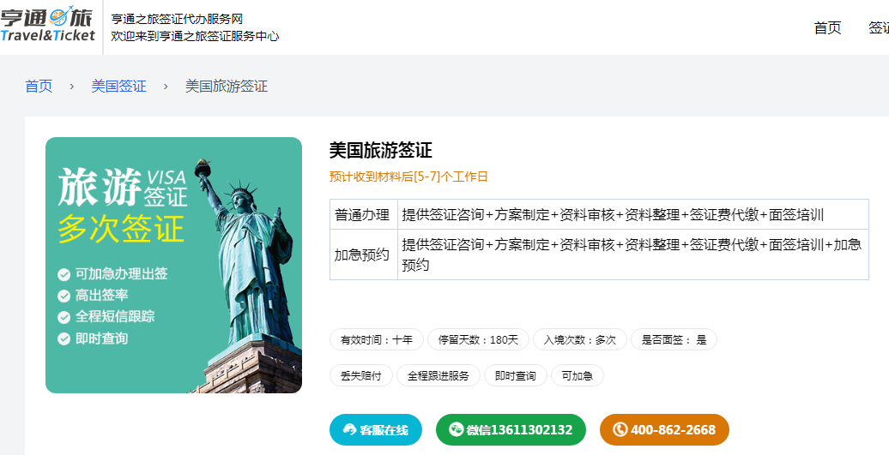

# 签证流程

1、可以报一个美国旅游签证代办

2、

美国旅游签证（B－2签证）：B－2签证颁发给赴美国旅游的申请人，包括：1.探亲访友；2.旅游观光；3.就医；4.处理[突发事件](https://baike.baidu.com/item/突发事件/4402?fromModule=lemma_inlink)亲属伤亡、财产纠纷等；5.参加儿女毕业典礼或婚礼；6.参加各种性质的社团活动；7.参加各种业余性的音乐会和运动会等。

B1签证颁发给赴美从事短期[商务活动](https://baike.baidu.com/item/商务活动/3153331?fromModule=lemma_inlink)的申请人, 活动包括协商签订合同、参加展览或会议、[短期培训](https://baike.baidu.com/item/短期培训/5473548?fromModule=lemma_inlink)或与供应商或客户洽谈业务等。B2签证颁发给赴美旅游的申请人，包括观光、探亲[访友](https://baike.baidu.com/item/访友/12550223?fromModule=lemma_inlink)及医疗治病等。B1和B2签证的[持有者](https://baike.baidu.com/item/持有者/3971387?fromModule=lemma_inlink)不能在美国就业。

### 所需材料

填妥的DS-160申请表 发自在美国的亲属或朋友的[邀请信](https://baike.baidu.com/item/邀请信/2196063?fromModule=lemma_inlink)，或证明参加了[旅游团](https://baike.baidu.com/item/旅游团/11020966?fromModule=lemma_inlink)或会议的信件。

（自2010年3月1日起，将全部启用DS-160在线申请表）

证明申请人经济能力或在美国亲友的经济能力的文件，如税单或I－134经济担保书。

如果申请人有任何[既往病史](https://baike.baidu.com/item/既往病史/3470728?fromModule=lemma_inlink)，申请人应该出示在赴美期间的旅游或[健康保险](https://baike.baidu.com/item/健康保险/3570030?fromModule=lemma_inlink)。

[二寸照片](https://baike.baidu.com/item/二寸照片/2596879?fromModule=lemma_inlink)2-4张 其它有关[证明材料](https://baike.baidu.com/item/证明材料/22908383?fromModule=lemma_inlink) · 有效护照(有效期半年以上) 能否获得签证，关键在与[美国领事馆](https://baike.baidu.com/item/美国领事馆/2601214?fromModule=lemma_inlink)的面谈。

01、申请人有效因私护照原件（确认有效期在半年以上，护照末页要有本人签名）。

02、申请人[身份证](https://baike.baidu.com/item/身份证/113951?fromModule=lemma_inlink)原件。

03、申请人[户口本](https://baike.baidu.com/item/户口本/5104621?fromModule=lemma_inlink)原件（全家页）。

04、申请人[结婚证](https://baike.baidu.com/item/结婚证?fromModule=lemma_inlink)或相关机构所开具的证明原件。

05、申请人本人或配偶名下由存款银行开据的[存折](https://baike.baidu.com/item/存折/2012786?fromModule=lemma_inlink)或[存单](https://baike.baidu.com/item/存单/8710671?fromModule=lemma_inlink)原件，建议存期一年以上，金额[人民币](https://baike.baidu.com/item/人民币/330794?fromModule=lemma_inlink)十万元以上。

06、申请人物产证明原件（如房产、车辆及证明[个人财产](https://baike.baidu.com/item/个人财产/5094793?fromModule=lemma_inlink)的相关证明材料）。

07、公司担保函：

A、申请人公司简介并加盖公章原件。

B、申请人在职证明信并加盖[公司公章](https://baike.baidu.com/item/公司公章/8831790?fromModule=lemma_inlink)原件。

C、申请人请提供月[收入证明](https://baike.baidu.com/item/收入证明/8275682?fromModule=lemma_inlink)原件如[工资单](https://baike.baidu.com/item/工资单/1493883?fromModule=lemma_inlink)需加盖公司公章或[工资卡](https://baike.baidu.com/item/工资卡/3980214?fromModule=lemma_inlink)请打印流水单并加盖银行公章。

08、申请人[全家福照片](https://baike.baidu.com/item/全家福照片/14474911?fromModule=lemma_inlink)原件。

09、申请人曾出访去过国家的签证页及在国外拍的3-5张照片原件(要有境外标志性建筑物的) 。

10、申请人公司营业执照原件或复印件加盖公司公章。

11、申请人51mm*51mm的免冠彩色白底相片2张原件（并在背面用铅笔签名）柯达店均有

12、申请人名片原件2张。

13、申请人曾使用的旧护照原件。

14、申请人详细填写的赴美申请表原件。

15、申请人若是十六岁以下孩子，需提供与父母关系的[公证书](https://baike.baidu.com/item/公证书/3691432?fromModule=lemma_inlink)。如一方带孩子去，需要第三方[委托公证书](https://baike.baidu.com/item/委托公证书/2594693?fromModule=lemma_inlink)

16、申请人的毕业证书、嘉奖证书等。

**签证提示**

1．申请人需要亲自到美国使馆面试；

2．为提高签证率，请务必最大限度提供对于签证有帮助的材料,如以上材料中有并不具备的,可不予准备,但须做好向[签证官](https://baike.baidu.com/item/签证官/9005014?fromModule=lemma_inlink)解释理由的准备;

3．具备以上材料并不保证获得美国签证,在办理过程中有可能因为材料提供[不准确](https://baike.baidu.com/item/不准确/596333?fromModule=lemma_inlink)、不清楚或别的方面原因要求补充相关材料；

4.凡申请过移民或[非移民签证](https://baike.baidu.com/item/非移民签证/818848?fromModule=lemma_inlink)的客人，无论其申请是否被批准，请如实说明。　所有申请人都必须在**面谈时提供下列材料**：

5.有效护照：B1/B2签证申请人的护照有效期必须比申请人预计在美停留的时间长至少六个月。如果申请人护照的有效期在申请人预计离开美国的时候将不满六个月、或申请人的护照已损坏、或护照上已无空白的签证签发页, 请申请人在面谈之前先申请一本新护照。

6.一张照片: 于6个月内拍摄的5.1厘米X5.1厘米见方白色背景的彩色正面照。请将照片用胶水粘贴在英文的DS-156申请表上，而不是用[订书钉](https://baike.baidu.com/item/订书钉/7996611?fromModule=lemma_inlink)。

7.签证[申请费](https://baike.baidu.com/item/申请费/5051730?fromModule=lemma_inlink)收据原件 申请人可以在[中信实业银行](https://baike.baidu.com/item/中信实业银行/635764?fromModule=lemma_inlink)在中国的任何分行支付签证申请费。请注意申请费一旦支付即无法退款，即便申请人被拒签或放弃申请。申请人必须在递交签证申请时出示申请费收据原件两联。只有符合[A-1](https://baike.baidu.com/item/A-1/2763455?fromModule=lemma_inlink), [A-2](https://baike.baidu.com/item/A-2/7254102?fromModule=lemma_inlink), G-1, G-2, G-3, G-4, [C-3](https://baike.baidu.com/item/C-3/3693593?fromModule=lemma_inlink), NATO和[美国政府](https://baike.baidu.com/item/美国政府/1157605?fromModule=lemma_inlink)赞助的签证申请人可以免交申请费。

### 申请地址

根据美国[大使馆](https://baike.baidu.com/item/大使馆/932195?fromModule=lemma_inlink)的要求，中国居民应该在其长期居住地所属领区的美国[使领馆](https://baike.baidu.com/item/使领馆/299408?fromModule=lemma_inlink)申请美国签证，与[户口所在地](https://baike.baidu.com/item/户口所在地/3466910?fromModule=lemma_inlink)是不同的概念。举例来说，如果申请人长期居住在北京领事辖区，申请人应该在美国驻北京大使馆申请签证，即使申请人的户口所在地在北京领区之外。

美国领事馆国内领区分布

北京大使馆：北京、天津、甘肃、河北、河南、湖北、湖南、[内蒙古](https://baike.baidu.com/item/内蒙古/173741?fromModule=lemma_inlink)、江西、[宁夏](https://baike.baidu.com/item/宁夏/15715?fromModule=lemma_inlink)、山东、陕西、山西、[青海](https://baike.baidu.com/item/青海/31638?fromModule=lemma_inlink)、新疆

成都总领馆：重庆、贵州、四川、[西藏](https://baike.baidu.com/item/西藏/130045?fromModule=lemma_inlink)、云南

广州总领馆：福建、广东、广西、[海南](https://baike.baidu.com/item/海南/13346?fromModule=lemma_inlink)

上海总领馆：安徽、江苏、上海、浙江

[沈阳](https://baike.baidu.com/item/沈阳/13034?fromModule=lemma_inlink)总领馆：黑龙江、吉林、[辽宁](https://baike.baidu.com/item/辽宁/121838?fromModule=lemma_inlink)

**面试时需带以下原件**

[营业执照副本](https://baike.baidu.com/item/营业执照副本/3539097?fromModule=lemma_inlink)(或复印件加盖公章)，名片两张

单位担保函，要加盖[公司公章](https://baike.baidu.com/item/公司公章/8831790?fromModule=lemma_inlink)

定期存款，股票及[有价证券](https://baike.baidu.com/item/有价证券/2064993?fromModule=lemma_inlink)原单据，房屋，车照原件。

有出国记录的老护照，签证复印件([因公护照](https://baike.baidu.com/item/因公护照/4739321?fromModule=lemma_inlink))，国外照片，身份证，户口本及结婚证，全家福照片等等(夫妻+子女)

护照，照片美国签证[报名照片](https://baike.baidu.com/item/报名照片/56828692?fromModule=lemma_inlink)(50MM*50MM)

**收费标准**

a.不需要预先获准的批文的签证类型，如：B1/B2（旅游、商务）：160美元（人民币1024元）

[中华人民共和国公民](https://baike.baidu.com/item/中华人民共和国公民/4950422?fromModule=lemma_inlink)在申请美国旅游签证需要缴纳以下所列的[额外费用](https://baike.baidu.com/item/额外费用/3971973?fromModule=lemma_inlink)：

c.120[美元](https://baike.baidu.com/item/美元/484146?fromModule=lemma_inlink)：每个L类型的签证申请都需要支付的签证对等费。每个申请[L类签证](https://baike.baidu.com/item/L类签证/5035591?fromModule=lemma_inlink)的申请人必须在[签证面谈](https://baike.baidu.com/item/签证面谈/19415720?fromModule=lemma_inlink)确定获签后，支付额外的120美元的费用。这意味着，打个比方说，如果一个L – 1签证主申请人另有两个申请L - 2签证的家庭成员，整个家庭必须支付的签证对等费共 360美元。

d.500美元：空白L-1费。如果主申请人是在“空白”L签证规定下的申请L - 1签证，还必须在签证面谈时支付500美元“欺诈预防和检测费”。

e.2,250美元 额外空白L-1费。[签证官](https://baike.baidu.com/item/签证官/9005014?fromModule=lemma_inlink)可以帮助申请人确定申请人的L类申请是否在有限的需要缴纳此费的范畴内

### 办理手续

1.填写签证申请表，并附彩色护照相一张

2.护照原件，有效期至少半年以上，并有空白页

3.机票[复印件](https://baike.baidu.com/item/复印件/53549949?fromModule=lemma_inlink)或预定单

4.如果持[第三国护照](https://baike.baidu.com/item/第三国护照/12011990?fromModule=lemma_inlink)，居住在[墨西哥](https://baike.baidu.com/item/墨西哥/255798?fromModule=lemma_inlink)，需提供在墨西哥居留许可的原件及复印件

5.[旅游签证](https://baike.baidu.com/item/旅游签证/2852527?fromModule=lemma_inlink)一般[不受理](https://baike.baidu.com/item/不受理/22465317?fromModule=lemma_inlink)[多次签证](https://baike.baidu.com/item/多次签证/13590637?fromModule=lemma_inlink)申请

6.[旅游签证保险](https://baike.baidu.com/item/旅游签证保险/8594259?fromModule=lemma_inlink)一份：[保险金额](https://baike.baidu.com/item/保险金额/3571906?fromModule=lemma_inlink)为三万欧元或三十万[人民币](https://baike.baidu.com/item/人民币/330794?fromModule=lemma_inlink)以上，需覆盖旅行全程的。

7.[户口簿](https://baike.baidu.com/item/户口簿/9800393?fromModule=lemma_inlink)：原件和复印件，有内容都需要翻译。

8.个人经济担保：工资、无冻结的[存款证明](https://baike.baidu.com/item/存款证明/8640710?fromModule=lemma_inlink)，或[房产证](https://baike.baidu.com/item/房产证/141961?fromModule=lemma_inlink)，或车辆购买等。需要原件和翻译件。

9.[身份证](https://baike.baidu.com/item/身份证/113951?fromModule=lemma_inlink)：需要原件及翻译件。

10.以上所有资料均需要1份原件，1份复印件。均要A4纸张，并按照以上顺序整理递交。

### 办理流程

所需要的材料

**一、护照**

1．有效期从美国离境时至少半年以上的护照原件，至少留有一整张空白页申请人护照原件；

2．护照首页复印件；

3．请在护照最后一页签名(中文姓名)；

4．持换发护照者，需同时提供所有旧护照原件。

**二、照片**

51X51毫米6个月之内彩色免冠照片2张（要求背景需为白色，且露出耳朵）。如果当地无条件拍摄，可于面试前一天到使馆附近的照相馆照。

**三、名片**

个人名片2张

四、[美国签证](https://baike.baidu.com/item/美国签证/4366485?fromModule=lemma_inlink)所需要的家庭证明

1．身份证复印件（要求身份证正反两面复印在[A4纸](https://baike.baidu.com/item/A4纸/5080411?fromModule=lemma_inlink)的同一面上）；

2．全家[户口本](https://baike.baidu.com/item/户口本/5104621?fromModule=lemma_inlink)原件、复印件（复印件包含户口本首页,户主页,本人页,配偶页）；

3．[结婚证](https://baike.baidu.com/item/结婚证/6626972?fromModule=lemma_inlink)原件（如证件丢失请提供[民政局](https://baike.baidu.com/item/民政局/2903040?fromModule=lemma_inlink)开具的丢失证明），复印件一份，[全家福照片](https://baike.baidu.com/item/全家福照片/14474911?fromModule=lemma_inlink)；

4．申请人[个人简历](https://baike.baidu.com/item/个人简历/136690?fromModule=lemma_inlink)[一式两份](https://baike.baidu.com/item/一式两份/1786506?fromModule=lemma_inlink)，中英文各一份。

五、美国签证所需要的[资产证明](https://baike.baidu.com/item/资产证明/7071471?fromModule=lemma_inlink)

1．（以下任何方式的原件，余额总和至少有10万元以上）

①银行[存折](https://baike.baidu.com/item/存折/2012786?fromModule=lemma_inlink)本原件（上有正常规律的存取记录）；

②定期银行[存单](https://baike.baidu.com/item/存单/8710671?fromModule=lemma_inlink)原件（请注意大额存钱时间须在至少3个月前）；

③银行[储蓄卡](https://baike.baidu.com/item/储蓄卡/266513?fromModule=lemma_inlink)、信用卡原件(建议：一并带上银行打印并盖章的3-6个月的流水帐)；

④[股票交割单](https://baike.baidu.com/item/股票交割单/5640393?fromModule=lemma_inlink)、[有价证券](https://baike.baidu.com/item/有价证券/2064993?fromModule=lemma_inlink)、[工资收入](https://baike.baidu.com/item/工资收入/15565202?fromModule=lemma_inlink)单；

⑤自己或配偶或其他[直系亲属](https://baike.baidu.com/item/直系亲属/1062060?fromModule=lemma_inlink)的房产证原件，汽车[行驶证](https://baike.baidu.com/item/行驶证/7169429?fromModule=lemma_inlink)（蓝本）原件（若有）；

⑥其他任何证明申请人财力的材料身份证复印件（要求身份证正反两面复印在A4纸的同一面上）。

2．不少于拾万(100,000元)"存款证明"原件，"存款证明"需为银行标准格式，有正确的英文译文，不可手写。

**六、营业执照**

所在单位为[企业单位](https://baike.baidu.com/item/企业单位/10171922?fromModule=lemma_inlink)的申请者，请提供[营业执照副本](https://baike.baidu.com/item/营业执照副本/3539097?fromModule=lemma_inlink)的清晰复印件，用A4纸复印，有年检记录，并在复印件上加盖单位[公章](https://baike.baidu.com/item/公章/10781999?fromModule=lemma_inlink)。

七、机构[代码证](https://baike.baidu.com/item/代码证/5023603?fromModule=lemma_inlink)

所在单位为事业单位的申请者，请提供[组织机构代码证](https://baike.baidu.com/item/组织机构代码证/6527570?fromModule=lemma_inlink)的清晰复印件，用A4纸复印，有年检记录，并在复印件上加盖单位公章。

**八、在职证明**

1．在职证明一式两份,中文一份,英文一份. 在职证明和[收入证明](https://baike.baidu.com/item/收入证明/8275682?fromModule=lemma_inlink)开在同一张抬头纸上；

2．在职证明必须使用公司正规抬头纸打印，并加盖公司红章；

3．在职证明内容需包括：单位名称、本人职务及收入、旅行时间、负责人职务、签字以及电话、传真，和单位的营业执照/企业机构代码证号。并需要注明担保申请人按期回国；

4．每人面签时都要提供担保原件。

**九、机票酒店订单**

1．机票订单一份

2．酒店订单一份

**十、派遣涵**

用[公司抬头纸](https://baike.baidu.com/item/公司抬头纸/5292930?fromModule=lemma_inlink)打印的公司派遣函一式两份，中英文各一份。

**十一、行程表**

[商务考察](https://baike.baidu.com/item/商务考察/1893385?fromModule=lemma_inlink)期间的行程表，中英文各一份，要求尽量详细。

十二、填写完整的DS-160[电子表](https://baike.baidu.com/item/电子表/5500035?fromModule=lemma_inlink)

网上填写完整的160表格，并打印签名。

十三、在任意一个[中信银行](https://baike.baidu.com/item/中信银行/900088?fromModule=lemma_inlink)网点购买的两联“MRV Fee Receipt”（美国签证[申请费](https://baike.baidu.com/item/申请费/5051730?fromModule=lemma_inlink)，246美金）。

十四、其他（可选）

1．在职公司彩色[宣传册](https://baike.baidu.com/item/宣传册/7614563?fromModule=lemma_inlink).

2．如证件丢失请提供民政局开具的丢失证明.

**十五．出国记录（可选）**

在国外拍摄的背景为当地[标志性建筑](https://baike.baidu.com/item/标志性建筑/4914453?fromModule=lemma_inlink)申请人纪念照数张。之前有出国记录的老护照原件（若有）。注：若老护照找不到或者是[公务护照](https://baike.baidu.com/item/公务护照/6785596?fromModule=lemma_inlink)（面试时不能提供），若有之前签证页的复印件也可。

若以上都无，请务必找到当时在国外拍摄的背景为当地标志性建筑本人纪念照以证明申请人出过国。

如申请人曾经访美，请提供相关文件给予证明。

**十六. 美国签证所需的学历证书原件。（可选）**

注：年轻未婚人士，面试时请尽量携带。

职称证明原件。（若有）

荣誉[资格证书](https://baike.baidu.com/item/资格证书/4579857?fromModule=lemma_inlink)原件。（若有）

专业从业资格证书原件（例如：教师，律师，医生，护士，会计，建筑师，工程师等专业人才公务员请提供[有效证件](https://baike.baidu.com/item/有效证件/7599278?fromModule=lemma_inlink)原件）。

**备注：上一个美国同一类型的签证失效不到一年的可以不面试。**

**十七.美国旅游签证照片要求**

[美国护照](https://baike.baidu.com/item/美国护照/178913?fromModule=lemma_inlink)申请人需提交2张相同的照片，美国签证申请人只需提交一张。照片必须满足下列基本要求，否则申请[不予受理](https://baike.baidu.com/item/不予受理/4323973?fromModule=lemma_inlink)。更多详情请参阅下列段落。

\1. 照片必须于6个月内拍摄

\2. 照片尺寸为 2x2英寸 （5x5 厘米）

\3. 申请者头部的垂直尺寸必须在1英寸到1 又3/8英寸（2.5 -3.5 厘米）之间

\4. 照片必须为白色背景。

\5. 必须正对照相机，露出双耳。

每位护照或签证申请人的照片必须为（6个月）无边框正面照片。“正面”照片指申请人拍照时要正对照相机。申请人不能向下看或斜视，面部需占整张照片的50%。尽管由于发型或头巾的不同（参见下文的讨论），很难严格对“面部”进行定义，但总的来说，是指申请人的头部，包括脸和头发，上下从头顶到下巴，左右至两边发际。 如露出耳朵则更佳。关键要求是通过照片可以清晰地辨别申请人。

照片的尺寸为2x2英寸（边长大约为50毫米的[正方形](https://baike.baidu.com/item/正方形/1019418?fromModule=lemma_inlink)）, 头像居于正中。头部（从头顶至下巴）在1英寸至1又3/8英寸之间（即25毫米至35毫米），眼睛到照片底部的距离为1又1/8英寸至1又3/8英寸（即28毫米至35毫米）。须为白色背景的彩色或[黑白照片](https://baike.baidu.com/item/黑白照片/515507?fromModule=lemma_inlink)。照片应无边框。照片应被订在或粘贴在 DS-82 (PDF-303KB)或DS-11(PDF-380KB)（美国护照申请）表格上，或相应的DS-156（[非移民签证](https://baike.baidu.com/item/非移民签证/818848?fromModule=lemma_inlink)申请）(PDF-159KB)表格上。如照片是被装订的，钉子必须尽量远离申请人脸部。如照片背景杂乱，有花纹或图案, 或呈深色, 将不予接受。

### 签证调整

1、推出免面谈代传递服务

2、调价：2012年，美国非移民签证申请费商务/旅游(B1/B2)已经由140美元上调为160美元，约折合人民币1024元。

3、其他举措：[美国驻广州总领事馆](https://baike.baidu.com/item/美国驻广州总领事馆/8582156?fromModule=lemma_inlink)提供免面谈代传递签证服务以加快符合条件的申请人的签证申请。在某些情况下，在审理了通过代传递业务代理递交的申请后，[大使馆](https://baike.baidu.com/item/大使馆/932195?fromModule=lemma_inlink)或领事馆会要求申请人本人前往进行[签证面谈](https://baike.baidu.com/item/签证面谈/19415720?fromModule=lemma_inlink)。同时，为了简化签证邮递手续和提高服务质量，美国驻广州总领事馆将通过[EMS](https://baike.baidu.com/item/EMS/1021?fromModule=lemma_inlink)到付方式把非移民签证[速递](https://baike.baidu.com/item/速递/4096829?fromModule=lemma_inlink)给申请人，申请人收到签证后再支付速递费。

### 最新政策

希拉里在[美国国务院](https://baike.baidu.com/item/美国国务院/3454696?fromModule=lemma_inlink)主持全球旅游暨观光会议时表示，台湾获得美国免签证待遇。预计最快11月起实施，届时台湾民众将可省下5千元[新台币](https://baike.baidu.com/item/新台币/5371849?fromModule=lemma_inlink)的[签证费](https://baike.baidu.com/item/签证费/22239878?fromModule=lemma_inlink)。不过，适用对象必须是持有晶片护照，而且是赴美观光或进行商务工作等目的的民众，才能享有90天的免签待遇。美国是在2012年，宣布台湾成为免签证计划的候选地区，[美国国土安全部](https://baike.baidu.com/item/美国国土安全部/7552497?fromModule=lemma_inlink)，2013年3月曾派人到台湾，检视[桃园机场](https://baike.baidu.com/item/桃园机场/616059?fromModule=lemma_inlink)护照安全及[出入境管理](https://baike.baidu.com/item/出入境管理/3181286?fromModule=lemma_inlink)等工作，到6月认为台湾已完成数字护照验证、安全测试等重要程序，于是给予免签待遇。

2013年2月20日，[美国驻华大使](https://baike.baidu.com/item/美国驻华大使/13012637?fromModule=lemma_inlink)[骆家辉](https://baike.baidu.com/item/骆家辉/223859?fromModule=lemma_inlink)在北京公布了新的签证政策，对多项[签证流程](https://baike.baidu.com/item/签证流程/15577430?fromModule=lemma_inlink)进行了简化，其中最令人关注的就是费用的减少和办理时间的缩短。新政将于3月16日正式启用。 新政取消了预约费和邮寄护照费用，将只收取160美元的申请费；原先电话预约面谈的方式将加入网上预约，有望将两个月的等待面谈时间缩短到一周。此外，新政还将新增两种收费方式，错过一次面谈机会可以免费重新预约，签证颁发后可以通过[邮件查询](https://baike.baidu.com/item/邮件查询/22534063?fromModule=lemma_inlink)护照状态。

自2013年2月13日起，一些合格的非移民签证申请人，如在他们之前持有的签证失效48个月(4年)之内续签，且签证种类同上次，则允许领事官员免去他们的面谈。在中国，之前持有B(临时商务及旅游访问者)、C1(过境)、D(机组、船组人员)、F(学生)、J(交流访问)、M(非学术学生)及O([特殊才能](https://baike.baidu.com/item/特殊才能/22559678?fromModule=lemma_inlink))签证的人员，如合资格可按此计划续签 [1] 。

## 其他信息

[编辑](javascript:;)[ 播报](javascript:;)

### 免面试的条件

（必须4个条件都符合）：

(1)上次申请的美国一年多次的签证,并且申请人持签证赴美国且在停留期内出境

(2)这一次申请的时间距签证失效日期的48个月之内,且申请人获得[美国签证](https://baike.baidu.com/item/美国签证/4366485?fromModule=lemma_inlink)后没有被美国拒签过

(3)上一次申请美国签证没有被[领馆](https://baike.baidu.com/item/领馆/2870157?fromModule=lemma_inlink)调查过

(4)两次申请的目的是一样的

备注：免面试的申请，如果领馆审核资料后要求面试，申请人必须去领馆面试。

备注：14岁以下小孩不用面试（但若小孩在入境美国那一天，已满14岁，就需前往领馆面谈，否则可能会在美国海关处因为没有按十指指纹而拒绝入境）。

### 特殊人群

1、暂住人员 需提供[暂住证](https://baike.baidu.com/item/暂住证/521590?fromModule=lemma_inlink)[复印件](https://baike.baidu.com/item/复印件/53549949?fromModule=lemma_inlink)(半年以前开始生效，如不足半年请提供旧暂住证或当地公安局、居委街道出具的[证明信](https://baike.baidu.com/item/证明信/3846168?fromModule=lemma_inlink)原件，具体国家具体要求，请咨询确认)。

2、退休人员 无需中方公司资料这一项，只需要提供[退休证](https://baike.baidu.com/item/退休证/2887410?fromModule=lemma_inlink)原件 （如尚未办理退休证必须提供原单位出具的内退证明）。

3、家庭主妇 需提供家庭主妇证明原件（当地居委会出具，证明其家庭主妇身份；一个签证一份）。

4、在校学生 需出具学校的准假证明书原件，1.使用学校正规抬头纸打印,内容全部为英文. 2.准假信内容需包括:学校名称,学生所在系或班级，旅行时间,系领导或校长的签字以及电话,传真并需注明担保申请人按期回国回校继续学业。

## 政策措施

[编辑](javascript:;)[ 播报](javascript:;)

2014年11月10日，美国总统奥巴马抵达北京[首都机场](https://baike.baidu.com/item/首都机场/646894?fromModule=lemma_inlink)，将参加APEC领导人非正式会议，并发表演讲。他表示，此次访问期间，美中两国同意作出新的签证安排，让学生、游客都受益。新的安排下，[学生签证](https://baike.baidu.com/item/学生签证/4374657?fromModule=lemma_inlink)有效期最长将延长至5年，[商业旅游签证](https://baike.baidu.com/item/商业旅游签证/16034774?fromModule=lemma_inlink)将延长到10年。 [2] 

[词条图册更多图册 ](https://baike.baidu.com/pic/美国旅游签证/4350436?fr=lemma)

