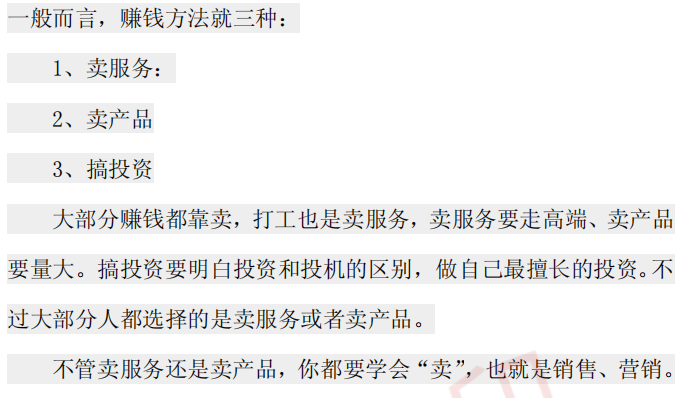
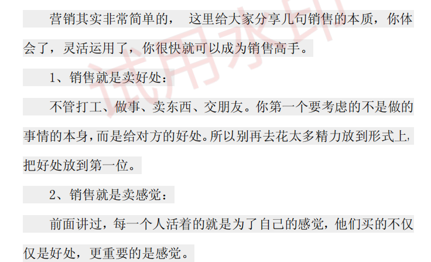
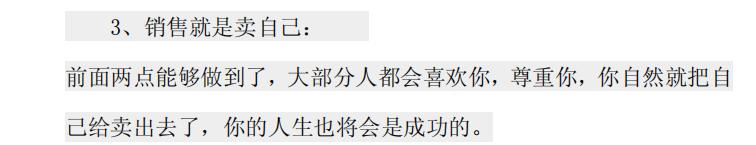
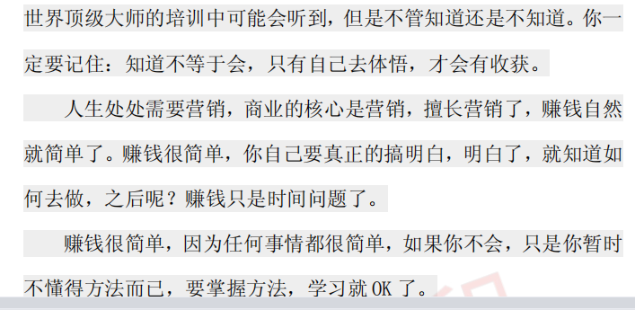

# 问题+规划

https://wdzs.gree.com/session/1296


时间+地点+事情


方向：

| 问题1：工作方面 | 1、工作地点   2、工作时间       |
| --------------- | ------------------------------- |
|                 |                                 |
| 问题2：生活方面 | 1、作息2、锻炼3、出行           |
|                 |                                 |
| 问题3：感情方面 | 1、情人节2、加深了解3、加入生活 |


静心、实践、快乐 

去了解自己


近期计划：

整理刷题、接着学习往后做项目，实践做学技术


短期计划：

找工作、新环境冲冲冲


长期计划：

搞钱，搞明白技术打工路到底行不行，不行去创业，找机会

能他人所不能。


万能安慰法

：共情、倾听、引导、解决


## 把自己当做公司

```
1、核心资源
我是谁
我拥有什么
：我的个性、兴趣、爱好、知识、技能、经验、人脉关系、其他有形或者无形的资产or资源


2、关键业务
我要做什么
基于我的核心资源
我想做什么？能做什么？擅长做什么？


3、客户群体
我能帮助谁
我所要做的这些事情，会对哪些人有帮助，哪些人会愿意为此买单（包括直接买单和间接买单）


4、价值主张
我怎样帮助他人
：我所做的这些事情。能给他人带来什么样的帮助、好处、价值


5、沟通渠道
怎样宣传自己和交付服务
如何让潜在用户知道我的存在？如何营销自己？如何向客户交付我的产品和服务


6、客户关系
怎样与对方打交道
我以什么样的方式和客户维持关系，是一锤子买卖还是长期持续性的服务？


7、重要合作
谁可以帮助我
哪些人可以是我的合伙伙伴，可以为我提供支持、帮助、资源


8、收入来源
硬收入：工资、奖金、提成、保险、养老金、补贴、
无形收入：满足感、成就感、资源
我能得到什么

9、成本结构
我要付出什么
硬成本：知识付费、交通费、培训费、社交费、
隐形成本：压力、情绪波动、时间、精力、健康..


```


个人优势：

敢于尝试

行动力强

投机能力


# 周计划

2023/03/27


1、学习测试思维，和实际运用      完成

学习运用测试用例方法    完成


2、学完后学习Django


3、学习摄影爱好方面

学习了基础，周三实践


4、学习英语能力


5、长线任务刷10套软考

中级


2023/4/3


2、学完后学习Django


3、学习摄影爱好方面

学习了基础，周三实践


4、学习英语能力


5、长线任务刷10套软考

中级


2023/04/10


学习Django      20

学习软考中级   10

短视频计划还得再找找方向，现阶段方向回报率基本为0，爆发性回报可能性也为0

找到一个可以吸引粉丝，可回报，有爆发性回报率的赛道-----零散时间

英语能力背单词句子提升4h

摄影能力，进行景物摄影，并进行学习相关书籍4h


2023/04/17

学习Django      39


（学习10篇博客吧）


学习英语


确定了目标--自由职业者（列出所有能想到的通道）

零散时间进行摄影练习


2023/04/25

学习完了点餐系统的Django


确定了自媒体赛道的方向---日常生活记录 + 文案分享（下班）


继续学习美多商场-学完美多商场继续往下学（只要不转行~）


学习英语吧


目标是什么有用学什么：


现在需要学PS、英语、编程技术（先学小程序吧，不行再回头学美多）~


经济学、心理学、法学底层规则掌控


针对互联网资源收费目前的形式简单总结一下：


1、不公开的资源要不就是需要关注公众号

2、要不就是等你下载完之后扫码支付给密码

3、要不就是得开一些网站的会员


但是有新的启发

尝试学习ai搭建一些新的工具


# 你在焦绿（狗叫）什么？

想去尝试各种不同的行业


# 20230526！


写blog


在细分市场里， 由信息不对称造成的信息壁垒可以让我们有较长远的生存和盈利空间。反之，在一个人人都知道是巨大机会的市场中，大量的资本和明星团队进入，前期靠信息不对称造成的壁垒消失，赢得战争，得靠一场又一场硬仗，如彼时的百团大战，此时的共享单车。


『我不盲目创新，微软、谷歌做的都是别人做过的东西。最聪明的方法肯定是学习最佳案例，然后再超越』。


『紧盯市场新热点，快速跟进优化，利用自己的流量优势实现整体替代』。


在进行这种工具类型的产品设计时，我会重点考虑这三点

> \1. 综合比较现有竞争对手，梳理它们已经呈现出来全部的功能点，根据自身能力和用户的需求做出功能点的取舍，设计产品。只需要体验好一点点就够了，比如界面上更清爽些，或者功能点上更贴心一点；2. 提前思考流量获取方法和流量变现方法，并在产品上体现出来。前置商业模式和流量的思考，这一点很重要，一个有运营思维的产品经理和没有运营思维的的产品经理在这里会有很大的差距；3. 一定不要重复造轮子。能在 github 上找到开源的代码的尽量用现成的。


1、找“生财有道”的文章、

这个就是为知识付费

up主就是一个营销大师，可以学一下他的营销，买就没必要了


2、学习英语，短时间学会的那种

先学基础-8000句和B站基础篇

周末冲刺背一个演讲


3、学习开发小程序


 个人优势：可利用的时间多


对超过6个excel 表单数据进行数据分析、结果运算，按照地区进行统计，按照模板生成word分析报告，并且支持用户随时修改模板，

开发自动化办公工具，替代大量的人工操作和重复计算。

要求要python开发

**预算可谈**


# 编程学习先暂停一下下

开始尝试开发

开发计划和方向


1、自动化办公工具

对超过6个excel 表单数据进行数据分析、结果运算，按照地区进行统计，按照模板生成word分析报告，并且支持用户随时修改模板，
开发自动化办公工具，替代大量的人工操作和重复计算。
要求要python开发
预算可谈

2、手机操作工具

3、Django项目

4、flask项目

5、微信小程序

6、AI系统


这个月先学英语再做一个自动化办公工具


学习新技能（、或者编程语言的方法）：

```

总结学自行车的方法
先行而后学，摔的很惨
总结纸上谈兵，只学而不实践啥也不是
需要知行合一

学英语知行合理

1、掌握基本规则--就是语法
2、尝试自己写翻译
英到中、中到英
3、英语目标：听书读写
口语流利

坚持练习、找自己感兴趣的内容
让学英语成为一种乐趣

1、学英标  1h
2、英语语法知识点  2h
3、听力  精听和泛听
听写 连读、弱读
1-2min 到5min
4、通过写作、口说输出英文表达

就是多练习输入输出
训练自己脑中的英语函数


感兴趣的可理解输入！！！1


```

# 学习编程现在出现了一个问题就是长期的分散快速学习，导致现在好像什么都学了、又仿佛什么都没学——所学的没有实践，学完一个技术，又忘了前一个技术该咋办？


解决：


只需要掌握基础，出现问题知道去哪里找文档，知道如何解决，但是要自己亲自动手写代码


# 复盘一下副业计划


1、

引流：csdn


粉丝：建立微信群


变现：知识星球、公众号带货


现在做啥：可以自己做小程序，把学的东西实践出来，找工作打工并不是长久之计


自己做一个和元岛一样的小程序

自己搭建一个微信返利机器人


**知行合一，不要想太多，走出一步先**

可复制

1 对多可裂变


# 从头开始，副业之路（2023不变之路）

创作别人感兴趣的项目

（或者自己感兴趣的）

1、制作个人主页

需要git 

html

css

js


2、制作个人简历


3、搭建个人blog

4、微信小程序

5、开发摸鱼小控件

eg：今天吃什么？

去哪里玩？

真心话大冒险？

美团卷分享

淘宝返利机器人


6、记录搭建从0开淘宝店


# 20230712-关于理想生活的思考


亦舒在《理想生活》中说——


什么叫做理想生活？不用吃得太好穿得太好住得太好，但必须自由自在，不感到任何压力，不做工作的奴隶，不受名利支配，有志同道合的伴侣，活泼可爱的孩子，丰衣足食，已经算是理想。


**有一部分人是这样想的，做真正的自己，有精神的自由，那就是理想的生活。**

老舍的理想的生活，不是房子车子和票子，**是一家人在一起，简简单单，健康快乐，外加，孩子还要说普通话。**

《人世间》的作者梁晓声写道:“人不一定非要成功，好的生活，是稳定而自适的。”


杨绛在书中也写道：据说，希望的事，迟早会实现，但是实现的希望，总是变了味儿的。


想要的：


1、

```
1、能够治愈自己

2、是生活，而不是拖累

3、满足我厨房、客厅、沙发、冰箱、空调

4、自己设计装修风格和布局

5、极简

6、满足个人办公计划

7、健身计划

8、统一色调

9、观影计划

10、酒柜

11、脏衣篮

12、置衣架

13、摄影桌子

14、小宠物屋

15、积木手办展示柜

16、衣帽间

17、大床

18、塌塌米屋

19、switch

20、阳台

21、摇椅
```


人性和长期发展


目前最优解：


找工作 / 发展副业做自己想做的事—— 学英语/出国——


7月 8月  找工作 发展副业  学习小程序


9月 10月 11月  软考中级  


12月考虑出国


回来之后打拼xxx


要开始只搞钱了

现在23年到28年 5年得把一辈子的本金搞到手


28年之前不考虑回老家


练神    调节呼吸、练习眼神

魄       练习魄力=练胆，人多时候上台演讲，超级显眼包

意     静心练意

魂		道德

志    俯卧撑最后几个超级痛苦当初享受












这就是职场。当你在某次晋升交锋中败下阵来的时候，往 

往并不是因为众所周知的某件事情做的不好，而是因为你一直 

以来大小事情表现的都不好，起码，你输在没有更好的读懂你 

的老大的心。 


就是他们有一套更加切合实际，由理 

念、习惯和方法组成的模式，在发挥着重要作用。这套系统 

的东西，在世家和精英圈子当中，有着一定的传承，并成为 

了一种常识。而普罗大众，恰恰对此知之甚少，一些理念似是而非，某些习惯令人生厌，很多方法不得要领。


# 成功背后有序 可循


##### 终于开始 慢慢突围，步入了良性循环，领悟的东西越来越多，领悟的 速度越来越快，算是暂先稳住了脚跟。


三、自己的责任 归自己 


其中隐藏着一个绝大多 数人都不愿意承认的现象

##### 我国过多的劳动者，能力结构和 职场竞争力，并没有随着年龄的增长而得到提升。


一方面 20~50 岁各 

个年龄段，都不同程度出现“就业难”，另一方面适应企业 

和社会发展需要的中高端劳动力，又较为匮乏，而这本应该 

是 35~50 岁之间劳动力，应当承担起来的重任。


不管以往如何，从现在开始，

##### 我们每一个人，都要对自 己负责，对家庭负责，对企业负责，对经济负责，对社会负 责，对民族负责，对国家负责，努力建立起一套切合实际的 事业发展“理念、习惯和方法”，大大提高自己事业成功的 概率。


##### 套用一 句老话，“自救者天救之”。 


# 四、事业成功之 全程管理


我的建议很明确，第一、自己熟悉的行业，容易切入并 

且成功概率很大，或者选择潜在的与老百姓日常生活密切相 

关的高成长领域；第二、30 万左右的资金，经不起折腾，短 

平快的项目看上去很美，但不适合他这样的人去做，很多领 

域太不懂行，这点钱可能还没怎么做就光了；第三、很多事 

情不是自己愿意不愿意做，而是客观上必须那么做，为了生 

存为了养家糊口，别无选择，在生存面前其他神马一切都是 

浮云。 


##### **一旦到了体制外，就不要再幻想稳定，应该利用有限的** **时间，快速积累和优化自己的能力结构与各种资源，做好应** **变的准备。**

真的有所准备，你朋友出于利益考虑，不一定会 

赶你走；即使走了你到同行还是能谋得一份不错的工作；或 

者完全可以自己另起炉灶，走上真正的经商之路。退一万步来讲，你们毕竟不是简单的老板和雇员关系，还是多少年的 

朋友，他不可能很粗暴直接赶你走，你再呆上一年左右的时 

间，作为过渡，准备一下退路，还是可以的。没有必要人家 

都没说你几次，你就匆匆忙忙辞职了。也不要怪你朋友无情， 

人性是非常复杂的，其中有掺杂着太多的利害关系，只是你 

对这些东西没有深入去想，犯了职场中的大忌。他又表示同 

意我的看法。 


跟对了人有肉吃，在中国，要入党，不入党，也要有体 

制内深刻背景，最少也要会练轮轮功 

在米国嘛，不知道没去过，不过跟着有钱人混，大概是 

通则吧

##### 不是简单跟对人那么容易，要想混的好，你自己身上必 须有别人认可的利用价值。这个利用价值可以体现为权、钱、 能力、学识或者其他方面的资源。

对于草根来说，要想成功， 

绝大多数人的路径只能是踏踏实实，一步一个脚印，靠能力 

和学识去体现你的利用价值

##### 首先，现在社会分工在不断细化，更多的细分领域会出 现，而这每一个领域都会出现一些成功者；

其次，本文谈的 

并不是成功学，而更多谈的是“失败学”，以及人才成长的 

规律；再次，我的东西属于经验和感悟分享性质的，至于效 

果怎么样，仁者见仁智者见智，我也不是靠这个卖钱来生存， 

也没有抢别人接受


（

001） 

——愤青们的惨痛代价

### 铁律之一：将更多时间浪费在抱怨当中，而没有用在实 际能力的锻炼、提高和结构优化方面，这会影响到自己专业 素养的持续和稳定提高。即使某天机会突然降临到头上，往 往也会由于水平不够，眼睁睁地看着它们从身边溜走，酿成 无边遗憾。 


人在本性当中，都或多或少有着浮躁的一面。迅速致富、 

平步青云、遇美得宝、功名速成、青春永驻，这些东西往往 

看起来不切实际，却是很多人在潜意识里面最想要的。满足 

这种心理需求的东西，也就永远是一大热门，而且往往价格 

不菲。


#### 商家只是满足现实需求而已，这本身跟 道德无关


等待具体的东西 

鄙人也有不少这方面的认


人在任何一方面投入精力太多，都会变得专业起来，水 

平日有所长。抱怨也不例外，经过循环往复的实战演练，一 

个非常独特和严密的理论系统就逐渐成型，以至于很难听进 

不同意见，甚至会强大到谁都难以驳倒的地步，非常专业的 

愤青也就从此炼成了。做到自成体系和自圆其说，在大多数 

人眼里不是什么坏事，但关键是看用在了什么方面。如果能 

够在行业把控、专业技能、资源储备领域达到这种程度，并 

且具有明显的工具性和实用性，你在职场当中的竞争力自然 

会得到很大幅度的提升。这样一来就可以努力在现有平台上 

寻求更多更好的发展机会，即使由于种种原因内部发展受限， 

也可以在外部找到适合自己的机会。常言道沙不埋金，但前 

提是你的确属于货真价实的金子，而非貌似金子的废铜。


时间和精力都是非常稀缺的资源，当你在某一方面投入 

过多的时候，势必会影响到其他领域的投入。


##### 赋予每个人的时间都是一样的。 好钢应当用在刀刃上


##### 机会永远属于准备充分之人。无论现在状况如何，都应 当多一份踏踏实实的锻炼，多一份结构合理的储备，少一些 于事无补的抱怨。只有这样，你才能极大提高自己把握机会 的能力，顺势而为，脱颖而出，出人头地。


### ——方法论比行动更重要 

## 铁律之二：无论是学习还是实践，我们都应当将方法论 

的掌握放在首位。解决了方法论的问题，你的行动才会更加富有成效，职业之路才能更为顺畅。当然，这里的方法论更 

多指的是解决各类具体问题过程中所用的手段、思路和模式。 


### ——善于打造成功案例体系 

### 铁律之三：在社会认同模式当中，你做过什么，效果如 何，远比你能做什么重要。在非常有限的条件下，如何最大 限度积累和完善自己的成功案例体系，并做到扬长避短，是 每一个力求上进的职场中人，都必须认真面对的重要课题。


还有很多人，由于受各种条件限制，很难有机会积累到 

高含金量的经验与成功案例。在这种情况下，如何才能扬长 

避短、突破限制，为自己积累到能被社会所认可的成功案例， 

使能力得以证明，并突破职业生涯方面的瓶颈，争得远大而 

又广阔的前程。在这个问题上，自然是蛇有蛇道、猫有猫道， 

八仙过海各显神通。我在这里介绍一种方式，以供大家参考。 

譬如你处于销售助理位置，从岗位职责上，基本上不太可能 

拥有区域销售和中高层管理的实战经验。但如果用心的话，还是能够观察到许许多多非常鲜活的案例和细节，在此基础 

上你可以一点一滴地去思考和消化，找出其中的原理、规律 

及其发展趋势，并能提出切实可行的合理化建议，当然不要 

忘记将此转化成文字材料。日久天长，终于所得。几年之后， 

你凭着这些沉淀去应聘销售经理或者行政经理的位置，尽管 

缺乏直接相关的历练，还是有较强竞争力的，成功转型的可 

能也就大大提高。 


### ——画地为牢与坐以待毙

### 铁律之四：勤奋与进步之间没有必然的联系，如果将自 己的注意力全身心地投入到老板给限定的二亩三分地中，而 不去关注相邻领域，即使你夜以继日，呕心沥血，也很难换 来升职机会，甚至组织内部一有风吹草动，你还会被淘汰出 局。

##### 成功是靠勤奋换来的，但勤奋并不会直接导致成功。

在 

现代社会经济中，组织规模越大分工也就越细，每个岗位的 

职责相对而言也就越简单，而基层岗位更是如此。譬如在现 

代化大生产中，制鞋厂工人，有人专门沾鞋垫，有人专门装 

拉链，有人专门钉鞋跟，即使你在这些岗位上再努力、再专 

业、生产效率再高，也顶多比别人多拿些奖金或者计件费， 

最终还是不能独立造出一只完整的鞋。再如，在很多企业的 

市场部当中，分工也特别细，有人专门写软文，有人专门联 

系媒介，有人专门负责活动执行，有人专门搜集市场信息， 

有人专门制作企业内刊，而且工作往往还都非常饱和。 


### ——要练手机会还是要浮名

### 铁律之五：在实践性较强的 领域，能否获得数量众多、结构合理的练手机会，对于 能力发展和专业素养提升，有着极为重要的意义。倘若 这样的机会争取不到、一再错过或者被封锁，即使你再 有潜力，三五年下来，自己的前途也基本被废掉


### ——人生就是要攀龙附凤 

### 铁律之六：婚姻不仅是两个人感情的结合，同时也意味 着两家社会资源的整合。与社会资源状况良好的伴侣结婚， 无疑是改变人生命运的一大契机。虽然一个人的发展最终还 是要靠自己，但扩充和优化人脉资源毕竟是锦上添花的事情。


——警惕垃圾工作和陷阱工作 

铁律之七：不管由于何种原因，垃圾和陷阱工作做多了， 

你在别人眼里也会渐渐地垃圾起来，自身价值也会被严重低 

估。在职场当中，要尽量不要被人利用去做这些事情，如果 

由于种种原因难以避免，可能离开就是最好的选择。


**——自我挑战事业才会更精彩** 

**铁律之八：要敢于接受适度超出自己能力范围的挑战。** 

**只有这样，别人才会将一些重要的事情交给你处理，你才能** 

**得到更多的锻炼机会，能力和职位才有可能快速成长，达到** 

**令人叹为观止的高度，真正做到年轻有为，并实现财富梦想。** 


**在职场当中，无论你如何计划、积累和储备，总会有很多事** 

**情超出你现有的经验和能力范围。遇到这种情况，是勇于接** 

**受挑战，还是直接选择放弃，对于很多人来说，都是一个难** 

**题，如果处理不当，就会对自己的职业发展造成伤害。**


倘若 

你接受挑战之后，连续做砸了三件事情，别人就会认为你不 

太稳重、非常浮躁，承担不了重任。假如你四平八稳，不愿 

接受挑战，连续推辞了三四次，也会给人留下过分保守、不 

敢承担责任的印象，以后的锻炼机会可能再也没有你的份儿 

了。假使你老是存在这种的心态，不敢接受任何挑战，此生 

注定是非常平庸的，不但难有发展空间，而且可能随时丢掉 

饭碗。人生本身就是一个不断面对挑战的征途，只有历经九 

九八十一难，才能取得真经，越在风险中磨炼，生命才越可 

能精彩


——思路上的先军主义

铁律之九：很多企业的领导都比较好学，在他们的思维 

当中，有些方面落后，有些方面超前，而且还会处于动态变 

化之中。你比他们超前，会受到批评，你跟不上思路，同样 

会受批。这就需要下属储备很多思路，选择合适的时机进行 

表达。


无论是国企、民企还是外企，这些年管理层的变化都非 

常大，注重学习和与时俱进，已经内化成为他们的一种精神 

品质。但每个人的精力都是有限的，每个人关注和擅长的方 

向都不相同。在领导们的思维结构中，某些方面落后，某些 

方面超前，某些方面的意识今天还较为落后，明天就突然超 

前，出现这种情况都是非常正常的，而且这种结构实际上是 

处于动态变化之中。当在某方面的理念比领导超前，他不太 

认同之时，你受批评是很自然的事情；当领导的很多思路一 

再超前，而你又跟不上去的时候，领导当然也会对你大发脾 

气，认为你工作敷衍了事，不太上进，甚至可能是愚不可教。


——跳槽与风险管理 

铁律之十：对于职业发展而言，跳槽是非常正常的一件 

事情。但在面试过程中，一定要对老板和管理团队做一个反 

向面试，对其项目状况、商业模式、管理风格、经营思路和 

发展前景做一个比较全面的评估，以最大限度规避职业风险。 

现有市场经济环境下，跳槽是在正常不过的一件事情了。 

假如被问及新东家什么东西最吸引你之时，答案往往会千差 

万别，比较常见的就有企业规模、品牌实力、业绩地位、技 

术含量、行业特性、薪酬待遇、发展机会、职业体面等原因。 

其实，以上因素固然重要，但站在个人角度，更为关键的却 

是能不能得到更好的生存和发展，倘若表面看起来非常光鲜 

的一份工作，过去之后不到一年就得走人，肯定并不是你自 

己所要的结果。为了有效提高跳槽质量，并出于职业生涯发 

展安全方面的考虑，在面试过程中一定要对新平台老板和管 

理团队进行反向面试，对项目运行情况、发展前景和岗位角 

色做一个较为系统的评估，防止自己掉入陷阱当中，从一个 

火坑跳到另一个火坑


——无中生有式的学习 

铁律之十一：职场上的学习，很多时候无老师、无教材、无标准答案，甚至连方向都没有。能否有效突破“三无”的 

限制，使自己能力得以快速提升，是职场中人必须面对的重 

要课题，其效果在很大程度上影响着一个人的发展高度。 

受竞争压力驱使，重视学习早已成为国人的一种常态， 

学习型社会已经由口号转变为现实。然而人们普遍迷惑的是， 

从大方向上来讲，学习是肯定没有问题的，但我究竟需要学什 

么呢，如何有助提升竞争力，自己努力方向对不对，其效果如 

何去测评？！这就引出了一个非常重要的课题，社会不同于学 

校，职场当中的我们，如何才能有效进行学习，进而能够发展 

的更好。


——聚焦特色才会有出路 

铁律之十二：要想出人头地，最忌讳的就是任何方面都 

比较平庸，必须在某方面拥有超常的能力和表现，或者具备 

独特资源，只有这样你才能进入伯乐们的法眼，拥有更好的 

发展机会。在现实当中，我们可以将自己某一方面的优势努 

力放大，直至形成强大竞争力。无论在什么国度，什么社会， 

什么时代，机遇总是一种稀缺资源。在芸芸众生中，为什么 

是他，而不是他成为幸运者，为什么总是有人能够实现成功 

一跃，背后的秘诀究竟是什么呢？抛开众多迷雾，其实我们 

可以发现，自己的命运很大程度上掌握在强势者手中，要想 

得到良好的发展，第一步应该能引起这些人的注意，否则你 

永远没有出人头地的机会


——利用价值是发展之母 

铁律之十三：职业生涯更多是建立在利益基础之上的， 

在与企业、同事和客户的关系上，没有永远的知己，也没有 

永远的对手，永远不变的就是相互之间利益关系的不断排列 

组合。要想永远立于不败之地，最重要的是使自己具有较好 

的利用价值。人性是非常复杂的，利益无疑是极为重要的一个方面， 

中国在企业管理和制度建设方面没有太大的突破，与人性研 

究禁区太多，未能建立深刻和精细的体系有很大关系。无论 

你以前接受的是什么教育，对人性持什么样的观点，要想在 

职场上混得顺风顺水，就必须认识到利益是人性当中非常核 

心的一个要素，而且必须对利益有个比较全面和正确的认识。 

如果不能在这个问题上获得突破，我们在实践当中就很容易 

陷入一些误区。 


——交易心态之下的陷阱 

铁律之十四：交易心态过于严重，处处强调付出与所得 

对等，是影响年轻人职业发展的毒药。因为这样一来，势必 

会影响到能力和经验的积累，而这两项对于一个人的职业前 

景来说非常关键，也只有通过脚踏实地的历练才能获得。 

在现实生活中，存在一类非常典型的现象，那就是不少 

人在做事情过程中，交易心态比较严重，几乎每做一件事情 

都要权衡成本和收益，如果感觉某件事情收益较差，就不太 

乐意去做。倘若老板让做这做那，心里就会想，你才给我多 

少钱，天天这么多事儿。或者是存在着将付出和收入对等， 

你给多少钱我干多少事，你给的多我就好好干，你给的少我 

就简单应付应付的心理。而这种心理比重最大的群体，一类 

是接受过中高等教育、出身社会没几年的年轻人，另一类则 

是年龄超过四十多岁、经历过很多风雨的老油子


——职业路径选择象限图 

铁律之十五：无论是社会还是组织，都存在着核心部门、 

非核心部门，核心岗位、非核心岗位，我们可以将这些向度 

变型成一个坐标系。事业上发展空间的大小，人生中获得资 

源的多少，在很大程度上取决于你处于哪一象限，以及象限 

中的具体位置。 

有一种调侃的说法，在中国人的事业发展观念中，最为 

核心的是“站队文化”。其大致意思是，虽然个人能力对职 

场发展具有非常重要的影响，但你处于啥样的平台，居于何 

种部门，追随哪个领导当小弟，显得更为关键；个人努力对 

职业生涯发展的高度影响不大，紧紧跟随单位和领导的发展 

步伐与节奏，平台竞争力提升了，老大飞黄腾达了，你自己 

自然会水涨船高。持这种说法的人，还能给你举出一大堆具体的例子，穿越历史，扫描身边，如数家珍，不一而足。说 

一千道一万，反正在社会上混，最重要的是“站好队，跟对 

人”。


——细节系统化才有冲击力 

铁律之十六：所谓工作经验，其实更多的就是一些细节 

性技巧，可能这些东西别人一说你就明白，做过以后都觉得 

非常简单，但是这些细节性技巧的数量如此之大，非有人指 

点或者经历过，没有三五年耐得住寂寞的积累，是难以形成 

系统的。

有人对某一细分领域的经验过分看重，认为任何事情都 

得深入其中才能体会，对此方面没有太深经历的人很看不上 

眼，大有非经历不能言的倾向。有人则对细分领域的经验不 

屑一顾，一句大同小异，足以扫平某些行业实践和经验的独 

特性。当然，这两种看法都有一定程度的正确成份，但相对 

来说又都是比较极端的看法。


——就是要容忍对方的不足 

铁律之十七：大多数人做事情，都不太符合规范，甚至 

还会存在各种各样的毛病，有悖于你自己的价值准则。在不 

影响核心利益之情况下，如果能够容忍对方的不足，习惯和 

适应其行为方式，我们就有可能从他们那里获得丰厚的利益。 


尽管社会上每件事情都有相应的规范，但非常真实的一 

个情况是，社会上绝大多数人做事情，在很多方面都是不太 

符合规范的，甚至还存在一些令人厌恶之处，比如约会迟到、 

办事拖拉、随地吐痰、说话粗口等等。但如果你仔细观察一 

下，实际上大多数人除了小节上存在一些毛病外，其他方面 

还是挺好的，在你需要的核心要素方面存在着价值。 


——为啥你比别人挣得少 

铁律之十八：职场当中，决定你能拿多少钱，并不在于 

你的学历，也并不在于你的背景，而在于你处于什么位置， 

你能做什么，你做了什么，你为谁做什么。能做什么，代表 

的是能力；你做了什么，代表的是方向和业绩；你为谁做什 

么，代表的是你的选择与机遇

。 

工作五六年之后，很多人在社会上的发展差距特别是收 

入，逐渐显露了出来。大学同学中，有人年薪可能已经飙升 

到四五十万，有人月薪可能还不到 2000 元。随着发展差距的逐渐扩大，一些人心理就很不平衡，不太愿意和大家相聚和 

联系，“恐聚族”和“拒联族”慢慢也就多了起来，好像在 

玩无线电静默


# 铁律之十九：在店面选址的时候，除了要关注位置和地 

段等重要因素之外，还须重点考虑其有效营业时间，由于人 

们思考问题往往是按照常理展开的，所以常会忽略一些非常 

关键的细节，特别是个人初次创业者，因经验缺乏更易掉进 

其中隐藏的陷阱。 

店面的租金和地段呈高度正相关，已经成为无人质疑的 

一个常识。因此在人们通常认为的好地段，比如车站、公园、 

步行街、高档小区、景点和商务区附近，租金都自然会价值 

不菲，而很多创业者也会想当然地认为，只要能在这些地段 

争得一席职位，就意味着项目成功了一半。这是一种典型的 

线性思维，一旦脱离更多细节，势必会使自己遇到很大麻烦


——要印象还是要真相 

铁律之十九：一个人的发展，固然自身能力和素质非常 

重要，但相关利害方特别是部分关键人对你的感知与评价更 

为重要。也许他们的印象与实际情况有很大出入，既不客观又不公正，甚至带有明显偏见，然而这足以影响到你职业前 

景。


从终极意义上来讲，人都是为自己活着，但不少人在理 

解上有一些偏差，认为人为自己或者就是我行我素。众所周 

知，人的最大属性就是社会性，每个人都不可避免地生活在 

各种群体之中，别人对你的感知和评价也就变得非常重要了。 

也许有人看来，一个人越强势、地位越高，也就越不用考虑 

别人的看法，太多注重他人看法，会令你活得不真实，越是 

不成功的人越关注这些东西。其实，别人的感知和评价，对 

于任何人都同样重要，只是不同身份和地位的人注重的程度、 

角度、层次不一样罢了。世界上最强势的莫过于古代帝王， 

尤其是以秦皇、汉武、唐宗、宋祖、成吉思汗最为典型，但 

即便是他们，也不能不去考虑存在直接利害关系的那些功臣 

良将对自己的态度和看法


——铁三角式的成功 

铁律之二十：事业上的成功，像是在酿造绝世美酒，一 

是需要平凡而又实际的点点滴滴，二是需要长年累月的升华 

和酝酿，三是需要有一颗平常心去默默地等待。这些方面结 

合起来就形成了一个铁三角，成功永远属于耐得住平淡和琐 

碎并不断修炼之人。 

当你问到一些明星、专家和老板成功秘诀的时候，他们 

往往会说，其实也没什么，就是在某一方面用心去做，时间 

长了，也就这样了。也许你会认为他们不太诚实，不愿意将 

自己的成功经验拿出来分享。其实，他们绝大多数人说的都 

是真实情况。大道至简，即使的确存在着方法和技巧，也需 

要用定力与时间来换取。在日常生活中，我们也可以观察的 

到，没有一定耐得住寂寞的沉淀，就算直接把一些很好的模 

式或窍门告诉你，也不会产生多大的实际效果。这就如同人 

体健康，固然蔬菜与水果非常重要，假如很少吃主食，缺乏 

大量的蛋白质补充，还是于事无补


——莫让高薪和加班废掉 

铁律之二十一：年轻的时候，一边工作一边给自己不断 

充电，是非常必要的。很多青年俊杰为了眼前的高薪，不惜 

加班加点、通宵达旦，几乎成了工作机器，连必要的休息都成了问题，结果透支了自己未来的发展空间，过早遇到职业 玻璃顶。


  

个人职业发展，在很大程度上同企业运营一样，除了需 

要眼下多赚一些钱之外，还必须立足长远，为自己谋取更好 

的发展前景。人性的一个重要弱点，就是更加热衷于触手可 

及的眼前利益，特别是这个利益具有足够诱惑力的时候，很 

难去考虑那些看似飘渺、遥不可及和存在太多不确定因素的 

长远利益。 


——良好的悟性源自磨炼 

铁律之二十二：书本上的知识往往是从实践中抽象和提 

炼出来的，并不能呈现更多细节，要想真正读懂，必须拥有 

相关实践经验，否则很难掌握深层次的东西，领悟也只能停 

留在表层，不但会给人留下夸夸其谈的印象，也很容易被别 

人忽悠。

能在书本上出现，或者能在口头上说出来的东西，我们 

通常称之为知识。但相对于实践而言，知识无论如何系统详 

尽，都无可避免的是一种抽象和概括，与客观情况还是存在 

一定差异的。从理论上讲，知识可以不断接近真相，但永远 

不会等于真相。不过我们也不能就此否定知识，特别是反应 

在书本之上知识的价值。书本知识的最大价值在于弥补个人 

实践经验的不足，并有利于人类共同非物质财富的传播和沉 

淀


——人脉之上的投资组合 

铁律之二十三：以一种投资组合的心态去拓展自己的人 

脉。有的付出会有回报，有的付出可能不会有回报，有 

的付出回报快，有的付出回报慢，有的付出回报大，有 

的付出回报小。无论如何，我们都要广泛付出，只要整 

体上的回报大于付出即可。 

常言道，在职场上发展，三十岁之前靠的是个人能力， 

三十岁之后靠的是人脉资源。这种说法之所以能在白领当中 

得到广泛流转，自然说明了它在实践当中的非凡价值。无可 

否认的是，每个人在拓展人脉资源方面，都具有非常强的功 

利性，希望通过此举来改变自己的发展状况。但不少人在人 

脉资源拓展问题上，存在着非常明确的投入产出核算，并将 

该指标推广到几乎每一个人脉身上，向每一笔投入要效益。


——人性的特洛伊木马 

铁律之二十四：人性最大的一个弱点就是经不起别人对 

自己好。只要你积极主动，并且次数足够多，绝大多数人都 

会产生不好意思的感觉，用他自己的方式来回报你。这是社 

会资源拓展的一大法宝，以一颗善心去认真实施，终会凯歌 

高奏、大有所获。 

不少朋友认为人性最大的弱点在于自私和惰性，其实经 

不起别人对自己好才是人性中最大的弱点。投其所好之所以 

会成为攻心秘笈，就是以此为前提的。无论是看文学作品， 

还是经典史迹，抑或我们自己身边，从来都不乏通过积极主 

动持续“对别人好”而达到目标的案例。而且无论对方是什 

么样的人，皇帝，权臣，美女，学者，将军，平民，也无论 

什么样的性格和年龄，也无论本质好坏，无论意志有多么坚 

定，无论什么肤色和种族，几乎无一例外会被这种方式搞定。也许有人不太认可本人的这种说法，那你就可以自己反问一 

下自己，看看能不能完全杜绝这一弱点


——人性的特洛伊木马 

铁律之二十四：人性最大的一个弱点就是经不起别人对 

自己好…… 

========== 

人非草木 孰能无情 但这个弱点对大多数人是有效的但 

让你能产生几何级增长的人估计对此绝缘 

\----------------------------- 

看以什么样的心态看待这个问题了，这本来是很中性的 

一个东西，只要你前提是不作恶即可。 

作者:e 路狂飙 日期:2012-10-25 11:15 

只要你持续不断主动给别人带来好处，对方往往就会很 

不好意思，感觉到他已经欠你很多，你在此基础上提出一些 

要求，只要不是太过分，基本上都会得到满足。在这里举一个十分常见的例子，某个男孩追求某个女孩，本来女孩并不 

喜欢他，但最终还是追到手，倘若日后女孩被问及原因的话， 

十有八九的回答是，感觉那个男孩对她最好，自己被感动了。 

在谍战片当中，那么多机要部门被渗透，其中很重要的一个 

原因，就是某些关键人员，在形形色色的攻势下，成为了谍 

报人员的俘虏。还有那么多腐败案件的发生，从案发后披露 

出来的细节的来看，不一定是某些人原本有多坏，而是败在 

了人性的这一弱点之上。而普通人之所以会上当受骗，很大 

程度上也跟此有关


——自我救赎才是天道 

铁律之二十五：很多人在职场上存在遇明主、靠大侠的 

思想，过分依赖于“他救”而不是“自救”，结果造就了自 

己碌碌无为和怀才不遇。自救者天救，才是真正的天道，努 

力靠提高素质、优化能力、业绩表现，和维护自己应有权利 

来获得发展，成功概率才会更大。 

在国人传统的意识当中，找伯乐、遇明主、靠大侠等思 

想还非常厉害，总是希望生命中能够出现某个贵人，自 

己的命运顷刻间发生改变。于是很多人天天幻想着奇迹 

能降临到自己身上。我们古往今来的很多文学作品也一 

再宣扬这样的情节，以至于人们一旦遇到困境，就期待 

伯乐、明主、大侠 

等“救世主”类型的人物出现，能够拯救自己于水火之中。 

作者:e 路狂飙 日期:2012-11-07 10:13 

@学习吧 70 后 691 楼 

明白交换法则 你要用别人就先想自己有什么可以给人用 

而且又正好是别人刚好用得上的 

----------------------------是，这个应该是放在首 

位的


——横向拓展你的职业历练 

铁律之二十六：职场生涯中，绝大多数人的苦恼和困惑 

惊人相似。如果我们能够经常与亲友同学们进行沟通，分享 

彼此心得体会，就可以横向拓展自己的人生阅历，少走很多 

弯路，事业发展也会像上了高速公路一样，前途自然能够光 

明和远大一些。 

倘若将人们在职场当中的苦恼和困惑进行梳理和归类的 

话，我们往往会发现，绝大多数人面临的问题都惊人的 

相似，特别是同龄人之间更是如此。如果将一些人的经 

验和教训进行提炼，对其他人或多或少都会有些帮助。 

为了达到这个目的，在客观上就要求我们与亲朋好友们能够相互分享各自酸甜苦辣和心得体会，借以横向拓展 

人生阅历，进而使自己的职业发展更为顺畅


——信息化时代的扁平式充电计划 

铁律之二十七：随着信息技术发展，高校、科研院所和 

藏书机构垄断知识的局面，正被日益打破。这就使得人们突 

破时空限制来获得自己所需的各种知识，成为一种可能。在 

新的形势下，对知识的检索、整合及挖潜能力，远比上研究 

生继续深造重要。 

尽管存在着各种各样的争议，但信息资源还是以前所未 

有的速度进行爆炸式扩散。只要你用些心，实际上就完全可 

以获得大量的免费公共资源。在目前的信息传播模式下，电视专题节目视频在互联网上可以供你随时随地进行观摩，互 

动百科是一个在线动态更新的强大知识库，社区和文档分享 

网站为你感受一流企业的培训材料提供了便利，各大门户网 

站的公开课使我们足不出户就可以分享世界顶级名校的课程， 

空前发达的出版业使得最前沿的理念和模式传播周期越来越 

短，各种虚拟圈子使五湖四海有着共同兴趣、爱好和志向的 

人聚在了一起。换而言之，信息传播越来越扁平化，整个世 

界变得越来越平坦


（

028） 

——兴趣的阶段性过程管理 

铁律之二十八：某领域取得很大成就之人，一般来说都 

对该领域有着一种近乎痴迷的状态。如果一个人对特定领域 

痴迷，即使表现的再懒，他在这方面实际上付出的努力要比 

其他人多好多倍，而且关注效率和领悟能力往往也要比别人 

高好多。

兴趣是最好的老师，当你对某方面产生浓厚兴趣的时候， 

你的潜能就能得到最大限度的释放，成名成家的概率也会大 

为提升。这一现象基本被社会所广泛认可，但却很少有人分 

析背后更深层次的东西。事实上，之所以会产生这种情况， 

主要有以下几个方面的原因。第一、由于存在非常大的兴趣， 

因此在关注这些东西的时候，你心情非常愉悦，注意力也会 

高度集中，消化和领悟的效果自然不同于你不太喜欢的领域。 

第二、当你一旦对某个领域产生巨大兴趣，你会不厌其烦地 

琢磨很多东西，在这方面所花的时间和精力，要数倍于其他领域，而产出数倍于其他领域，也是情理之中的事情了。第 

三、因为感兴趣，这个方向你更容易积极地坚持下去，铁棒 

磨成针功到自然成，时间、精力和智慧汇集在一起，终将酿 

就事业上的造诣。因此某领域取得很大成就之人，一般来说 

都对该领域有着一种近乎痴迷的状态。或者也可以说，当你 

对某个领域产生一种痴迷，你在这方面就比较容易出成就。 


——兴趣的阶段性过程管理 

铁律之二十八：某领域取得很大成就之人，一般来说都 

对该领域有着一种近乎痴迷的状态。如果一个人对特定领域 

痴迷，即使表现的再懒，他在这方面实际上付出的努力要比 

其他人多好多倍，而且关注效率和领悟能力往往也要比别人 

高好多。

兴趣是最好的老师，当你对某方面产生浓厚兴趣的时候， 

你的潜能就能得到最大限度的释放，成名成家的概率也会大 

为提升。这一现象基本被社会所广泛认可，但却很少有人分 

析背后更深层次的东西。事实上，之所以会产生这种情况， 

主要有以下几个方面的原因。第一、由于存在非常大的兴趣， 

因此在关注这些东西的时候，你心情非常愉悦，注意力也会 

高度集中，消化和领悟的效果自然不同于你不太喜欢的领域。 

第二、当你一旦对某个领域产生巨大兴趣，你会不厌其烦地 

琢磨很多东西，在这方面所花的时间和精力，要数倍于其他领域，而产出数倍于其他领域，也是情理之中的事情了。第 

三、因为感兴趣，这个方向你更容易积极地坚持下去，铁棒 

磨成针功到自然成，时间、精力和智慧汇集在一起，终将酿 

就事业上的造诣。因此某领域取得很大成就之人，一般来说 

都对该领域有着一种近乎痴迷的状态。或者也可以说，当你 

对某个领域产生一种痴迷，你在这方面就比较容易出成就。


——你究竟是偏才还是残废？ 

铁律之二十九：随着年轮的不断变化，你会在某个工作 

岗位上越来越专业，同时也会变成偏才，变得“残废”，除 

此之外什么都干不了。这个时候，应该去反思一下，看看需 

要补充一些什么营养，如何优化自己的能力结构，以确保职 

业生涯上的安全。 

人才和产品一样，尽管“细分”是非常必要的，但“细 

分过度”并不是什么好事。如果你的专业程度局限在某个工 

作岗位上，而不是某一相对宽泛的领域，就存在很大问题了。 

在内部发展，将你换到同级岗位，或者进行职位提拔，都会 

因为难以胜任不予考虑。即使在外部寻求机会，也会遇到同 

样的问题。而且组织结构一旦发生战略变革，你很有可能就 

是下岗对象。这并不是什么危言耸听，而是每天都在我们周围环境中上演的真是事情。在一些极端情况下，还发生在某 

些行业技术精英身上


——公平总是要屈从于规则铁律之三十：任何领域都有自己的江湖规则，这些看不 

见的东西可能十分不合理，也为世人所诟病，甚至还会给你 

带来很多不公平的待遇。但只要捅破那张若有若无的纸，犯 

了江湖中的规矩，你本人再也难以在这个圈子当中混下去了。 

不管表面的规则如何，任何行业和领域都有着比较独特 

的潜规则，也许这些东西跟正式的规则相左，也非常不公平 

与不合理，然而你一旦违背他就会付出沉痛的代价。比如， 

有的企业，尽管在字面上的企业文化中讲的很好，任人唯贤 

什么的，但在实质上却是典型的论资排辈，你作为新鲜人， 

如果非要挑战这种秩序，最终肯定只能是自己灰溜溜走人。 

还有同工同酬、解聘补偿等这些问题，从法律和道义角度来 

讲，我们确实应该主张自己应有的合法利益。但现在社会上 

管理不规范的公司太多了，如果你较真起来，恐怕非但问题 

解决不掉，纷争旷日持久，还会给自己留下“不良”记录， 

导致后来的一些公司不敢用你。再如，向有关部门检举公司 

或者领导的一些灰色情况，或者带头造老板的“反”，即使 

公司和老板存在着大的过错，也是犯职场大忌的。人在江湖 

上混，该受欺负的时候就得受欺负，该吃亏的时候就得吃亏， 

遭受一些不公平待遇之时，该忍气吞声就得忍气吞声，否则 

前面会有更大的挫折等着你。


——天大难题：说服别人与改变自己铁律之三十一：世界上最困难的两件事情就是改变自己 

和说服别人。任何人对观念的理解和接受，都需要一定的基 

础与过程。即使你说的确实是真理，也别奢求对方能够很快 

接受，以一颗平常心继续和他们进行沟通，慢慢渗透是非常 

必要的。

江山易改，本性难移，虽然在语意上说的有些夸张，但 

也揭露了一个基本事实，就是改变自己和说服别人是超高难 

度的事情。每个人在现实生活中或多或少都有所体验，我们 

苦口婆心、不厌其烦地开导某人，虽然打心眼儿里面是为人 

家好，到头来非但没有效果，最终还可能反目成仇；自己虽 

然明知很多习惯和行为不太好，但许多年下来还是改不掉。 


——知识的价值在于储备 

铁律之三十二：缺乏知识和能力储备先行的意识，认为 

以后还不一定会干啥，现在学的东西将来可能用不上，会做 

很多无用功，倒不如用的时候再去学习，这样才会更具针对 

性和效果性。事实上，倘若没有必要的提前储备，好机会基 

本跟你无缘，前途自然受限。 

当在职场当中比较迷茫的时候，很多人就走向两个极端。 

一个就是得病乱求医，见什么学什么，没有明确的方向，比 

如今天学习法学、明天看人力资源、后天阅读营销图书，再 

过一段时间又在琢磨互联网发展，总是想找一个能够承载自 

己理想的领域，但又找不到合适的领域，于是在学习和关注 

方向上出现漂移现象。另一个就是盲目淡定，认为所学和所 

用必须能够匹配，如果学非所用，就是一种非常典型的浪费， 

在不确定以后将干什么的情况下，尽量不要折腾，等到需要 

的时候再去学习，不但更具针对性，而且还会富有成效，此 

类人不但上大学的时候抱着这种心态去混文凭，出身社会之 

后还抱着同样的心态混日子。 


——要打通方法论上的价值链铁律之三十三：与其对所 

存在的问题进行抱怨和批评，倒不如找出切实可行的解 

决方案并予以严格执行。成功者和失败者的区别，往往 

并不在于是否对问题本身有一个清晰的认识，而在于能 

不能拿出切实的方案并转化为强大的执行力。 

在职场当中呆得久了，很多人就会发现一个非常有趣的 

现象。就是所有的环境你都能遇到高手，分析起来现状头头 

是道，也挑剔不出什么，水平也确实达到了一定的高度，但 

当你问及他们如何寻求解决之道的时候，大多数人又找这个 

原因那个理由，反正就两个字——无解。换而言之，在实现 

当中存在太多的“发现问题”和“分析问题”的高手，但一 

涉及到“解决问题”，其不足就开始暴露无遗，实战层面的 

解决问题暂且不谈，就是连相对可行的系统思路都没有。 

作者:e 路狂飙 日期:2013-05-04 08:28 

然而就是这样的“高手”，还会处处受到追捧，自己一 

副大彻大悟的样子，时间一长还真的把自己当成是高手了。 

但当这些高手被请过去解决具体事务的时候，结果往往是一 

筹莫展、铩羽而归，自己也郁闷的不得了，最终只剩下抱怨 

和批评。从人才发展角度来说，能够做到这步，已经相当不 

容易，我们也不否认他们的聪明才智，只是仅仅做到这一点 

还远远不够，需要继续向前努力


——当心领导示好中的陷阱 

铁律之三十四：很多时候，领导向你示好只是出于礼貌 

和管理技巧之需要，并不代表着着真的看好你，也不意味着 

他将你列入同一战线。对此我们必须有一个清醒的认识，以 

防错判形势，使自己处于非常不利的境地，进而给职业生涯 

带来伤害。 

士为知己者死，女为悦己者容，当领导的大多深谙此道，因此很容易有意无意地向你示好，单独对你说，好好干，我 

是很看好你的，甚至还找机会请你吃喝玩乐什么的，总之暗 

示你是他的人，你好好跟我当小弟就是了。我国根深蒂固的 

站队文化，也使得领导的此招屡试不爽，具有非常广阔的市 

场空间。


——挖掘职业沉淀的宝藏 

铁律之三十五：随着时光的流逝，我们总应该为自己沉 

淀一些东西，这可以是人脉关系，可以是工作经验，可以是 

资金储备，可以是自己的切身感悟。有了这些沉淀，我们还 

需要对其进行加工处理，将其转化为利于自己生存和发展的 

宝贵的财富。成功的职业生涯，总是和某方面资源的积累和沉淀联系 

在一起的，这些独特的东西也许是人脉、也许是资金、也许 

是能力、也许是经验，但总归需要厚积薄发、结构合理、持 

续提炼、深度整合。也许有人会讲，创业才需要搞这些东西， 

自己也就是在职场混口饭吃，何苦整得那么累，跟自己过意 

不去。其实，如果将职业生涯看成是一个项目的话，我们每 

个人都是在经营，都是在创业


——抬头望天与低头看路 

铁律之三十六：要使自己成为真正的人才，就必须做到 

“顶天立地”，即一方面要把握所处环境的整体格局、发展 

状况以及走势，另一方面要具备踏踏实实做具体细致工作的 

专业能力，并在实践中逐步领悟其中的精要。只有这样，才 

可以进退自如，游刃有余。 

数年之前，一位非常令人敬重的前辈对我说话一句话， 

职场中要想获得大的发展，就必须“顶天立地”，一方面要密切关注整个行业和公司上下大的发展状况，另一方面也要 

脚踏实地的做好自己的本职工作，并在能力结构上将二者很 

好的结合起来，只有“顶天”，才能发展长远，对工作有一 

个准确的把握，只有“立地”，做事情才能切合实际，下接 

地气，职业发展才有牢固的根基


——职业规划与动态管理 

铁律之三十七：职业生涯规划，最好是在准确把握自身 

特点的基础上，量身订制，切不可盲目跟风，追赶时髦。要 

不轻则浪费时间、遭受重创，重则一蹶不振、前途尽毁。一 

个人最为重要的是寻找适合自己发展的道路，而不是眼下看 

似前景辉煌之路。 

好的职业规划，是适合自身特点的规划。尽管这个道理 

近乎常识，但绝大多数人才的埋没，都与此有关。在现实当 

中，太多的人不考虑实际情况，盲目跟风，最终酿成了无边 

的遗憾。譬如，当年法学、外语、计算机、人力资源等专业 

热门之时，不管自己喜欢不喜欢，适合不适合，千军万马都往此处挤，能够顺利读上此类专业的兴高采烈，很有成就的， 

似乎自己就是人中龙凤，从此人生与众不同，没有挤上的， 

很多人垂头丧气，似乎低人一等，再四处想办法看如何补救。 

作者:e 路狂飙 日期:2013-09-10 10:35 


——抱团式集体成才的可行性 

铁律之三十八：在职业发展过程中，帮助身边同事和朋 

友们共同发展、集体成才，不失为一种非常明智的选择， 

一方面可以成就良好的人际关系以及和谐的成长氛围， 

另一方面又可以大幅提升和优化你的人脉资源结构，进 

而形成强大的势力。 

在职场当中，有一类非常有趣的现象，就是成才的精英 

当中，非常容易扎堆，很多人或者是发小，或者是亲友，或 

者是老乡，或者是同学，甚至包括存在一定渊源关系的同事。 

倘若您翻开我国浩如烟海的历史典籍，不难发现刘邦、刘秀、 

朱元璋、洪秀全、曾国藩他们核心团队当中，都有这么一帮 

人，从很早以前跟他们的关系就比较亲近。也许朱元璋身上 

显得更为典型，在开国勋臣当中，就有徐达、汤和和周德兴 

等人是他放牛娃时代的伙伴。 

不光政坛当中，即使在商界，这样的现象都屡见不鲜。 

历史上以太原和榆次等地人为代表的晋商垄断票号，明清浙江绍兴人垄断师爷行当，上世纪 90 年代以呼和浩特和赤峰等 

地人为代表的“蒙军”垄断保健品行业，还有时下福建周宁 

人垄断上海钢材贸易，河北盐山人垄断北京钢材贸易，钢铁 

和石化企业员工东北人比例较大，北京 e-Bay 外单销售以内 

蒙集宁人居多。同时我们也会发现，一旦有人在某个领域获 

得成功，他的很多亲友都会往这个方向挤。中国人是这样， 

如果细细观察，欧美国家也存在着类似的现象。 


——为什么缺憾主义会更加完美铁律之三十九：职场当中，别把事情做得太完美，不要 

和别人一点冲突也不发生。如果你表现得近乎完美，大家会 

对你敬而远之，相互之间永远会有隔阂。假如你故意留点瑕 

疵，并适当和别人发生一些冲突，大家就会感觉你属于性情 

中人，关系反而会亲近很多。 

从终极意义上讲，我们每个人都应该追求完美，只有这 

样，我们才会更不满足，不断奋进，成为高潜能人士。但这 

不应当成为职场上的直接表现，否则你的人际关系不会很好， 

职场发展也会受到很多限制。如果你在做事方面表现为一个 

完美主义者，你周围的人都会觉得很累。大家虽然崇拜和敬 

佩工作中的完美主义者，那也只限于远距离，如果让他近距 

离和此类人打交道，99.9%的不愿意。 

在我们的传统文化中，在做事方面表现非常完美的人， 

当属千古圣贤。几千年来，这样的人并不多，满打满算 

也就那么几个，而且主要的也就黄帝、尧、舜、禹、商 

汤、姬昌、孔子、孟子、朱熹和王阳明。这些圣人，是 

用来膜拜和供奉的，不是用来相处的。如果现实当中遇 

到这样的人，大家无形中会产生很大的心理压力，自然 

会产生潜意识的排斥。毕竟职场当中绝大多数都是凡夫 

俗子，不想让自己身边突出冒出一个仰为观之的人物。作者:e 路狂飙 日期:2014-01-22 20:20 


——八小时之外的经营 

铁律之四十：一个人的阅历光靠工作本身给你提供的机 

会是很难丰富的。要取得良好的历练，还需要把自己的八小 

时以外经营好，并大力拓展和优化人脉资源。当我们业余时间做的事情越多，认识的朋友越广，阅历和悟性与别人相比 

也自然会成倍增加。 

八小时是很难培养出人才的，这是流传很广的一个说法。 

大致意思是，在职场上要想获得成功，脱颖而出，除了在工 

作时间认真努力之外，还需要将业余时间有效利用起来，多 

学习和思考一些东西。一般这句话多出自老板和领导之口， 

为员工所厌恶。人们总是感觉资本家太贪得无厌了，工作时 

间你要牢牢控制倒也罢了，毕竟拿人钱财、替人消灾，连八 

小时之外都想控制，这种感受已经不能用无语来形容了。而 

且越年轻的员工越容易这么想。 

作者:e 路狂飙 日期:2014-01-26 09:45 


——职业生涯与接力赛跑 

铁律之四十一：职业生涯宛如一场接力赛，这一棒占先 

了，并不意味着下一棒一定占先，这一棒落后了，也并不意 

味着下一棒肯定没有机会，其考量的标准是最后所能达到的高度。奋斗的征程每一阶段同样重要，都需要你付出勤劳和 

汗水。

人往往会沉湎于一时的成功，比如上中学的时候一直名 

列前茅，上大学学校和专业都不错，踏入社会不到三年被提 

拔为主管。无论在哪个阶段上比别人靠前，当局者都感觉自 

己一定会变得很成功，踌躇满志，仿佛前途一片光明。但好 

像命运老爱捉弄人，前几年看起来还狗屁不是的家伙，现在 

突然出现在你面前，经意不经意得说他现在混得如何如何好， 

令很多人心中大为添堵。于是各种各样的感叹如约而至，一 

时间好像之前学习越差，将来就会混得越好，我们也经常听 

到揭示这种现象的段子。曾经的优等生，心中也可能会产生 

一种悔恨的情绪，自己怎么就不跟社会“接轨”，早早出去 

混呢，要不也不至于像现在这样平庸。 

作者:e 路狂飙 日期


——永远稳定是神马也是浮云


铁律之四十二：无论你处于什么样的环境，永远的稳定 

只是一个神话，未雨绸缪、暗练苦功非常必要。我们习得一 

技之长而不是半技之长，才能在江湖当中闯出一条血路。安 

于貌似平稳的现状，充当温水之蛙，是职业发展当中的大忌。 

职业安全感是绝大多数人追求的一个目标，社会竞争压 

力越大，人们这种愿望也就越强烈，当然这也与个人的风险 

偏好程度有关。也正是因为如此，这几年体制内单位，日益 

受到就业市场热捧。公务员和垄断国企岗位炙手可热自不待 

言，就连许多之前被看作冷衙门的事业单位，也越来越成为 

香饽饽。能够顺利上位者，趾高气扬，感觉自己捧了个铁饭 

碗，高人一等，不需要太努力，尽情享受体制带来的红利即 

可。很多不能顺利进入圈子的，对那些圈中人羡慕的眼睛都 

快要发红，只怪自己时运不济。就连当年那批下海的，都在 

想方设法上岸。 

作者:e 路狂飙 日期:2014-02-07 10:50 欢迎点 


——创造力的固化与提炼 

铁律之四十三：一定要逼迫自己养成善于观察和敏锐思 

考的习惯，并随时随地将你所见、所闻、所想记录下来，以 

此为素材定期进行梳理及提炼，进而不断系统化，这对你日 

后的发展具有非常重要的意义，这也是培养创造力的一种方 

法。

尽管很多人认为悟性和创造力是与生俱来的，但我不这 

么认为。事实上，这二者都必须建立在一定的积累和提炼的 

基础上。我们不难想象，没有素材与积累的悟性和创造力会 

是什么样的，它一定非常浮浅和低效，对于一个人的快速成 

长，以及将来取得很高成就，并没有多大的帮助。 

一个人的见识和对环境的领悟深度，与年龄自然有着很 

大的关系，但只要方法得当，其实在三十岁左右就可以达到 

一定高度，大致上也就大学毕业 7-10 年的时间。谈到这里， 

可以介绍一个算是规律性的东西。如果在一个岗位或者方向 

上努力沉淀，3 年基本是个入门时间，5 年大致已经学遍了岗 

位所有的新东西，而 7 年则是很多人豁然开朗，不被表象蒙 

蔽的一个时间点，而 10 年可以达到一个令人仰望的大师境界。


——人脉细胞开发过早更易失败 

铁律之四十四：要想在职业生涯中取得真正成功，脚踏 

实地积累丰富经验，培养过硬专业能力，以及拥有娴熟的人 

际关系技巧，都必不可少。但人际关系细胞开发过早，大多 

会影响到经验和能力的沉淀，与历练的质量，最终与理想状 

态俞行俞远。 

有一次，某位朋友跟我讲，说年过三十的老实人一旦开 

窍，深谙人情世故之后，往往会发展地相当好，而上学之时 

就非常世故的，最后大多发展的并不怎么样。他说观察到这 

个现象已经很久了，但百思不得其解，按道理说头脑灵光和 

老于世故的应该混得更好才对，怎么很多早早懂得人情世故的，反而混得不太理想呢？！我就和他胡诌瞎侃，反正也就 

是消磨时间嘛！没想到竟然诌出来一些灵感，侃出来一些道 

理来，这也许就是头脑风暴的妙处。我们现在可以把这些东 

西分享一下。 


——打破一统江湖的神话


铁律之四十五：在现实当中的任何环境，永远是“正式 

组织”和“非正式组织”共治天下，这是职场当中的一条潜 

规则，只有二者取得某种均衡，整个组织才可能正常运作下 

去，其中任何一方想独霸天下都不现实，容易引起大的混乱。 

有人的地方就有江湖，党内无派，千奇百怪。其实，在 

任何地方，正式组织内部，都会有各种各样的小团体，他们 

或明或暗，或紧凑或松散，或大或小，以一种非常适合自己 

的形态存续着。这样的现象不但存在于我国形形色色的机构 

中，其实在西方国家更为普遍。据说在我国的某著名美资企 

业，内部就分为“清华派”、“北大派”和“人大派”，如 

果你不在这三大主流派系当中，很多升迁和发展机会都与你 

无缘，而且这三派之间斗争也相当激烈。其程度堪比金庸武 

侠小说当中的日月神教，和岳不群执掌的华山派


——先就业再择业正确吗？ 

铁律之四十六：一个人职业生涯的发展，在很大程度上 

受制于第一份工作，其突破的难度相当大。无论你是出于什 

么原因进入那个领域，都会慢慢地形成路径依赖。面对这种 

情况，也许我们最好的选择就是努力在这个方向上积累经验 

和资源。

您的第一份工作，也许机缘巧合如你所愿，也许是稀里 

糊涂找上的，也许是不得已而为之。但无论是好是坏，你日 

后的发展将跟它之间存在着很大的因果关系，甚至一辈子都 

摆脱不了其中的影子。我个人体会，“男怕入错行，女怕嫁 

错郎”当中的“入错行”，很大程度上指的就是你第一份工 

作。可能有的朋友会认为，我说的有些言过其实。而实际上， 

还真的是这么回事儿。 

作者:e 路狂飙 日期:2014-04-03 10:07 


——定位行业，进退有据 

铁律之四十七：将自己定位于某一行业，而不是定位于 

某个企业，注重在行业内部竞争力的培养，才可能在职场当 

中进退有据。基于以上原因，不论你所处平台如何，都应该 

尽最大努力去了解这个行业，见证其风雨历程，若干年以后 

自己身价自然会倍增。 

站在企业和老板的角度，总是希望员工忠于自己，要求 

员工忠于职守。这个当然没有什么错，拿人钱财，替人消灾， 

是无可争辩的职场底线。当员工的，自然要做到这一点，但 

在理解上不应该出现偏差。忠于职守，忠于公司，并不是非 

得在某个企业当中一干到底，也并非只将发展眼光锁定在企 

业内部。但在这个问题上，相当多的朋友会走入误区，直至 

对职业生涯造成巨大伤害。


——信息的真正价值在于交互 

铁律之四十八：信息本身就有交互这层意思，如果从书 

本、网络或者其他渠道单向获取信息，得到再多的东西也没有多大意义，因为缺乏交互，你对信息的把握和领悟程度肯 

定会跟实际存在巨大偏差，得到的“信息”其实算不上真正 

的信息，还可能误入歧途。 

在目前社会当中，信息是一个非常时髦的词。但当你试 

图寻找定义的时候，至少会有数十种不同的说发展现在你的 

面前，可能不看还好，越看越糊涂，越不知道信息究竟是个 

什么玩意儿。我也不想太多纠缠那些概念的是是非非，而是 

先说明一下信息的几个特征。一、信息在某种程度上等同于 

知识，包括口头和书面两个向度，当然还包括其他很多表现 

形式，但终归要承载一些东西的。二、信息从另一个角度上 

讲，还等同于信号与消息，它会扩散和失真，三人为虎的现 

象就是这么发生的，很多人栽就栽在这个上面。三、信息具 

有交互或者反馈的属性，如果缺乏这个特征，信息就不能算 

是信息，因为你对它的理解很容易出现偏差。 


——为什么行业比专业更重要 

铁律之四十九：职场当中，在某一行业的积累比在某个 

专业的积累更为重要，同一专业在不同行业之间的差异，并 

不比不同专业之间的差异小多少。如果过分强调专业方向上 

的积累，而忽视行业沉淀，就如同只强调灵魂而忽视肉体一 

样。

无论你从事什么样的工作，都不可避免地受着两个向度 

的影响，其中一个是行业，另一个是专业。谈到这里，很多 

人就往往会问，究竟是行业重要还是专业重要。这个问题， 

不同的人在体验上，存在明显的差异，受岗位影响较大。比 

如，财务、法务和人力资源类岗位的感觉，就跟销售、市场、 

信息类岗不太一样，而后者的感觉又与技术类岗有着很大不 

同。即使技术类岗位之间，也会由于通用性的强弱，仍会存 

在大量差异。 

作者:e 路狂飙 日期


——缺乏步骤和措施的理想毫无意义


铁律之五十：职场 

上的一些人士，做事情往往过分强调目标，而忽视或根 

本就不懂得如何才能一步一步加以实现。缺乏一个详细 

且可行的步骤和措施来保证的理想，常常就像一个毫无 

根基的空中楼阁，事情从刚开始的时候就注定是要失败。 

我们的教育，一直以来就带有精英主义色彩，和口号主 

义倾向。反映在实践当中，就是我们从来不缺乏目标和理想， 

而是缺乏切实可行的步骤与方法，来实现这些东西。假如公 

司要求制定一个工作计划，只要没有提供比较细致的模板， 

大多数人写出来的“计划书”想都能想的出来。文不达意， 

系统性差，逻辑混乱，过分强调目标，缺乏对目标的分解和 

指标细化，没有具体的步骤、方法和日程安排，更谈不上什 

么可行性。就算是一些稍有点文采的秀才，写出的计划书， 

那里是计划书，简直就是表明姿态的保证书，或者是宣誓书。 

作者:e 路狂飙 日期:2014-05-27 22:43 

up


# 0726还是先写一遍元岛再开展后续，小程序开发可能得需要20*8 =160小时纯粹时间


