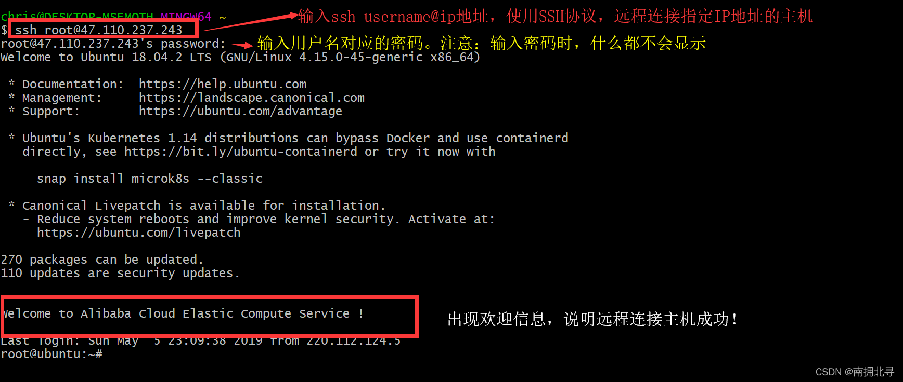
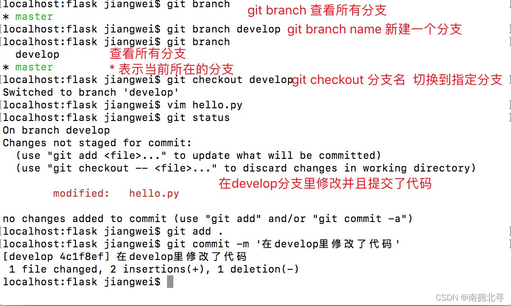
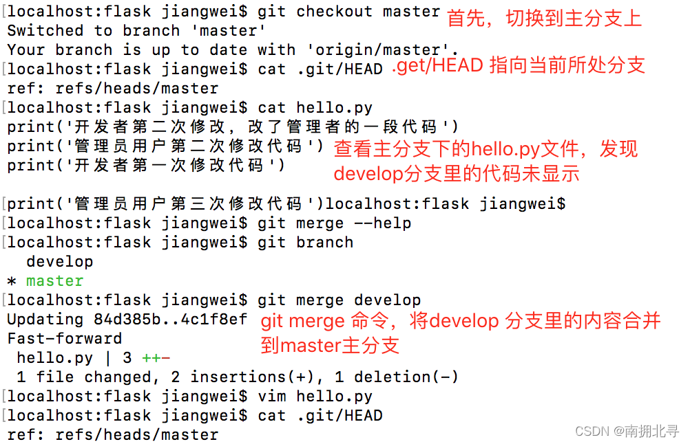

# 编程篇——背


## 目标

目标：

编程变现

分解:

编程基础+面试技巧 +互联网宣传自己

细化:

Python +Java +开发个人系统 +记忆面试技巧


## 路线

基础：

liunx

Python基础

测试基础


后端：

django

flask


前端：

html 

css

js

vue3

uniapp


实用工具：

爬虫

自动化测试

办公pdf、excel、txt、word

发邮件

自动点击器

## Liunx

SSH（Secure Shell）是一种安全通道协议，主要用来实现字符界面的远程登录、远程复制等功能
SSH协议对通信双方的数据传输进行了加密处理，其中包括用户登录时输入的用户口令。因此SSH协议具有很好的安全性

sshd 服务的默认配置文件是/etc/ssh/sshd_config

手动的在Ubuntu服务器上安装ssh服务

```
sudo yum install openssh
sudo systemctl start sshd
```

需要使用SSH工具来实现远程链接。常见的SSH工具有XShell,putty等，也可以直接使用git bash来实现远程链接。

git bash,它可以很方便的让我们在windows里执行Linux指令，实现SSH远程链接。



软件安装相关指令

指令的基本格式:

```less
命令 [选项] [参数]
ls -a /   # 表示列出根目录下所有的文件及文件夹
```

基于Debian平台的操作系统，使用dpkg和apt指令管理软件，

基于RedHat平台的操作系统，使用rpm和yum指令来管理软件。

```
命令行	作用	示例
rpm -ivh <.rpm file name>	  安装.rpm后缀名的软件，并显示安装详情   	rpm -ivh google-chrome-stable_current_x86_64.rpm
rpm -e <packagename>	  删除指定的软件	   rpm -r google-chrome-stable
rpm -qa	    列出电脑上安装的所有包	     rpm -qa


yum
yum（全称为 Yellow dog Updater, Modified）是一个在Fedora和RedHat以及CentOS中的Shell前端软件包管理器。基于RPM包管理，能够从指定的服务器自动下载RPM包并且安装，可以自动处理依赖性关系，并且一次安装所有依赖的软件包，无须繁琐地一次次下载、安装。

命令行	作用	示例
yum search <packagename>	   搜索软件包	       yum search python
yum list installed	         列出已经安装的软件包	    yum list installed
yum install <packagename>    用来安装指定的软件包	    yum install vim
yum remove	                 用来移除软件包	      yum remove vim
yum update <packagename>	 更新软件包	           yum updat tar
yum check-update	         检查更新	            yum check-update
yum info <packagename>	     列出指定软件包详情	     yum info python


yum是基于rpm的，它的功能更加强大。

场景	rpm	yum
离线的.rpm安装包  	能够安装，但是不能自动下载安装依赖	  能够安装，并且能够自动安装下载安装依赖
在线安装	          不支持，只能把安装包下载到本地安装	    支持在线下载安装
```


```
Linux里的文件系统

/	系统的根目录
/bin	包含了一些二进制文件，即可执行文件。我们在命令行里执行的指令，例如 ls,rm,cp,mv等，其实都是执行的这个目录里的二进制文件。
/boot	系统启动相关时所需的文件。(勿动)
/dev	设备文件，其中许多都是在启动时或运行时生成的。例如，如果你将新的网络摄像头连接到机器中，会自动弹出一个新的设备条目
/etc	用来存放所有的系统管理所需要的配置文件和子目录。(会经常使用)
/home	用户的主目录，每一个用户都有自己的目录，所有的用户都存放在home目录下。
/lib(64)	用来存放系统最基本的动态连接共享库，几乎所有的应用程序都需要用到这些共享库。
/lost+found	这个目录一般情况下是空的，当系统非法关机后，这里会存放一些没来得及保存的文件。
/media	Linux系统自动识别的一些设备，比如U盘、光驱等，当识别后，linux会把识别的设备挂载到这个目录下。
/mnt	系统提供该目录是为了让用户临时挂载别的文件系统的，我们可以将光盘挂载在/mnt/上，然后进入到该目录就可以查看光驱里的内容了。
mount /dev/cdrom /mnt/
umount /mnt/
/opt	给额外安装软件所摆放的目录。比如你安装一个ORACLE数据库就可以把它放到这个目录下
/proc	虚拟目录，它是系统内存的映射，可以通过直接访问这个目录来获取系统信息。
/proc/sys/net/ipv4/icmp_echo_ignore_all
/root	超级用户目录
/run	是一个临时文件，存储系统启动以来的信息，当系统重启时，这个目录下的文件会被删除。
/sbin	超级用户使用的命令存放目录
/srv	存放一些服务启动之后需要提取的数据
/sys	映射内核设备
/tmp	存放临时文件
/usr	非常重要的目录，用来存放用户安装的应用程序和用户文件。
/var	经常修改的数据，比如程序运行的日志文件

vim编辑器

sudo yum install vim

pwd：查看当前工作目录

cd:切换工作目录

.	当前目录
..	上一级目录
~	当前用户的家目录
-	表示上次切换之前的目录
/	表示根目录

alias：给命令起别名。

alias md=mkdir
alias   # 不添加任何参数，表示列出所有的别名
unalias md   # 删除别名

touch	新建文件，可以是多个
rm	删除文件或目录(删除目录时要传递'-r'选项)
cp	拷贝文件或目录(拷贝目录是要传递'-r'选项)
mv	移动文件或目录
mkdir	创建目录，可以是多个
rmdir	删除空目录
cat	从上到下，显示文件全部内容
tac	从下到上，显示文件全部内容
head	查看开头指定行数的内容，不指定时默认10行，如：head -20 filename
tail	查看文件末尾指定行数的内容，不指定时默认10行，如：tail -5 filename
nl	功能与cat相同，但是多显示了行号
wc	统计显示，内容：行数 单词数 字符数 文件名
more	一点一点查看内容
less	一点一点查看内容
whoami	查看当前登录的用户名
useradd	新建用户，-d指定家目录，-m创建家目录，-s指定shell
userdel	删除用户，-r会删除用户家目录
passwd	设置指定用户的密码，没有指定用户，是修改当前用户的密码
su -	切换用户，一定要加上'-'，否则只会切换家目录，但是环境没有切换，不指定用户时默认切换到root用户(记得先给root用户设置密码)
sudo	以指定用户(root)身份执行命令。
visudo	专门用于编辑/etc/sudoers文件的命令，需要将指定用户添加进去才可以使用sudo命令，如：test ALL=(ALL:ALL) ALL；使用sudo update-alternatives --config editor可以修改系统默认编辑器(nano)
groupadd	新建用户组
groupdel	删除用户组
gpasswd	向指定组添加/删除指定的用户，如：gpasswd -a/-d user group
groups	查看指定用户的组信息
chsh	修改指定用户的shell解析器，如：sudo chsh test -s /usr/sbin/nologin (禁止登陆)
chown	修改文件所属用户[及用户组]，如： sudo chown test[:test] 1.py，递归操作需要加'-R'选项
chgrp	修改文件所属用户组，如：sudo chgrp test 1.py
sudo chmod o+w 1.py，给其他用户添加可写的权限

压缩: 
    zip 123.zip *.txt   # 将所有的txt文件压缩成123.zip文件
    zip -r test.zip test # 将test文件夹打包成test.zip
解压: unzip 123.zip


压缩：  
    gzip 1.txt   # 将1.txt压缩成1.txt.gz
    gzip -r test # 将test文件夹里的每一个文件都打包成 .gz文件
解压: 
    gunzip 1.txt.gz
    gzip -d 1.txt.gz


压缩：  bzip2 1.txt # 将1.txt压缩成1.txt.bz2
解压：
    bunzip2 1.txt.bz2
    bzip2 -d 1.txt.bz2
    bzip2 -dk 1.txt.bz2 # 解压1.txt.bz2文件，并且保留1.txt.bz2这个文件


tar，打包解包工具，后缀名是tar.
选项:
    -c：创建新的打包文件
    -x: 解包。
    -t: 不解包查看文件。
    注意：以上三个选项不能同时使用，因为功能冲突。
    -v: 显示详细信息。
    -f: 指定操作文件。
    -z: 调用gzip/gunzip进行压缩解压操作，后缀名是.tar.gz
    -j: 调用bzip2/bunzip2进行压缩解压操作，后缀名是.tar.bz2


使用第三种方式，即源代码的形式安装软件

使用源代码安装软件的基本步骤:
配置:configure
编译：make
安装: make install

执行命令
cmd1; cmd2 # 执行完cmd1后，执行cmd2,无论cmd1指令是否执行成功
cmd1 || cmd2 # 先执行cmd1,cmd1执行失败以后才会执行cmd2
cmd1 && cmd2 # 先执行cdm1,cmd1执行成功以后，才会执行cmd2


```

#### 使用源码安装Nginx

```
使用源码安装Nginx
使用wget命令下载Nginx源码，下载地址: http://nginx.org/download/nginx-1.16.0.tar.gz

解压软件压缩包： tar -zxvf nginx-1.16.0.tar.gz

编译前执行配置文件: ./configure

—prefix:用来配置Nginx服务器的安装目录
配置出错多数是因为缺少相关的依赖库或者编译器
需要安装相关的依赖。sudo yum install gcc-c++ pcre pcre-devel zlib zlib-devel openssl openssl-devel

运行 make && make install 命令来编译并安装软件

Nginx介绍

进入到/usr/local/nginx/sbin 安装目录，使用 ./nginx 命令启动nginx
html：默认站点目录
测试：在浏览器中输入localhost，看到welcome to nginx即表示成功

```

`sys.path`可以查看python包和模块的存放路径。

```
import sys
print(sys.path)
```


#### 安装virtualenv

```
sudo pip install virtualenv

cd my_project  # 进入到工程的工作目录
virtualenv test  # 创建虚拟环境，并命名为test.此时会在my_project下多出一个test的文件夹
source test/bin/activate # 激活虚拟环境。此时，如果使用pip install安装的插件，都会被安装到当前虚拟环境
pip install flask  # 测试安装flask. flask会被安装到当前虚拟环境，而不是全局环境
Copy
```

#### 安装virtualenvwrapper

```
安装一个virtualenvwrapper工具，它可以更加方便的帮我们管理虚拟环境。
sudo pip install virtualenvwrapper

安装完成以后，在~/.bashrc文件下添加以下内容：
export VIRTUALENVWRAPPER_PYTHON=/usr/bin/python3
export WORKON_HOME=~/.envs
source /usr/local/bin/virtualenvwrapper.sh
保存以后，再执行以下指令:

source ~/.bashrc

mkvirtualenv test  # 创建并切换到test虚拟环境
deactivate  # 离开test虚拟环境
rmvirtualenv test # 删除test虚拟环境
workon demo # 切换到demo虚拟环境

virtual env
虚拟环境
virtual
adj.	(通过计算机软件，如在互联网上)模拟的，虚拟的; 几乎…的; 实际上的; 事实上的; 实质上的; 很接近的;
```

## 服务监听

```
netstat:用来监听网络连接状态。

参数:
-a 显示所有socket，包括正在监听的。
-n 以网络IP地址代替名称，显示出网络连接情形。
-o 显示与与网络计时器相关的信息
-t 显示TCP协议的连接情况
-u 显示UDP协议的连接情况
-p 显示建立相关连接的程序名和PID。

作用：查看进程信息
使用：
ps -ef
ps aux

pstree
作用：使用树形结构查看进程信息。

kill
作用：杀死进程
示例：kill -9 PID
说明：强制杀死指定进程
```

#### 管道和重定向

```
管道的操作符是 " | "，它只能处理经由前面一个指令传出的正确输出信息，然后传递给下一个命令，作为下一个命令的标准输入。例如ps -ef|more
```

### 重定向

```
标准输入(stdin)、标准输出(stdout)、标准错误(stderr)

在linux中，创建任意进程，系统会自动创建上面三个数据流，其实就是三个文件

三个文件的描述符分别是：0、1、2.其中，0默认指向键盘，1和2默认指向终端窗口。

重定向就是改变原来默认的表现位置。

演示：

输出重定向：
    ls > 1.txt        # 会新建文件，若文件已存在，会清空
    ls >> 1.txt        # 追加到文件末尾，若文件不存在则创建
错误重定向：
    ls /xxx 2> 1.txt    # 将标准错误重定向到1.txt
同时重定向输出和错误：
    ls /xxx /home &> 1.txt         # 将标准输出和错误同时重定向到1.txt文件

```

#### svn 和 git 区别

```
1.SVN 是集中式管理.就是版本控制都在服务器上. 缺点 : 万一服务器挂掉了,那么公司的多人协同开发和版本控制受阻

2.git 是分布式管理.服务器和客户端都有版本控制能力,都能进行代码的提交合并


sudo yum install git

创建本地项目文件

/Users/chris/Desktop/lisi

cd /Users/chris/Desktop/lisi
git init

在项目文件里面创建hello.py文件,用于版本控制演示

修改文件之后,查看修改之后和之前的比对

git diff
* 绿色表示新增,红色表示删除 / 修改

查看当前版本控制里面的文件状态
git status


* 红色表示新建文件或者新修改的文件,都在`工作区`.
* 绿色表示文件在`暂存区`
提示 : 终端命令 git add . 只是把文件从工作区添加到暂存区,此时还没有到本地仓库,要到本地仓库需要 commit .


在commit之前,需要设置个人信息。可以添加 --global 参数，给所有的git仓库添加一个统一的配置项。这个配置项保存在 ~/.gitconfig文件里
配置用户名 : git config --global user.name "李四"    (区分责任人)
配置邮箱 : git config --global user.email "lisi@163.com" (方便联系作者)


也可以给这一个Git仓指定自己的用户名和邮箱。会保存在当前仓库.git/config文件里
配置用户名 : git config  user.name "lisi"    (区分责任人)
配置邮箱 : git config user.email "ls@126.com" (方便联系作者)

git commit -m "操作描述"

git status

git commit -am "操作描述"

git reflog(可以看到被删除和回退过的提交记录)
或者
git log(不能看到已经删除和回退后的提交记录)

git reset --hard 版本号前6位

```






#### 二、Shell 脚本首行

```
在 Shell 脚本中,# 开头的文本是注释, 但第一句 #! 开头的这句话比较特殊, 他会告诉 Shell 应该使用哪个程序来执行当前脚本。
常见方式有:

#!/bin/sh
#!/bin/bash
#!/usr/bin/env bash
Python 脚本的第一句一般是 #!/usr/bin/env python

```

常用shell指令：

```
查询目录下的文件：ls（平铺）、ll（列表）

创建文件夹 mkdir

移动 mv

拷贝 cp

删除文件夹 rm -r(递归)f(不询问)

新建文件 touch

查看文件内容：cat （所有）、less 、more 、head、tail

编辑文件：vi、vim

ps：用来查看当前运行的进程状态，一次性查看。如果需要动态连续结果使用 top。

df：显示磁盘空间使用情况。获取硬盘被占用了多少空间，目前还剩下多少空间

等信息。

du：对文件和目录磁盘使用的空间的查看。

free：显示系统内存使用情况，包括物理内存、交互区内存(swap)和内核缓冲区内存。

netstat：显示各种网络相关信息。

chmod：控制文件或目录的访问权限。该命令有两种用法：一种是包含字母和操作符表达式的文字设定法；另一种是包含数字的数字设定法。

```

#### Linux远程登录

```
 Putty下载地址：http://www.putty.org/

 XShell下载地址：XShell - Download （支持文件传输，功能更强大）https://xshell.en.softonic.com/

```

XShell - Download [https://xshell.en.softonic.com/]


#### linux总结-常用命令

```
ls [选项] [目录/文件]
cd [目录名]
mkdir [选项] [参数]
rm [选项] [文件]
rmdir [选项] [目录]
mv [文件名] [文件名]
cp [选项] [参数]
du [选项] [文件或目录名称]
fdisk [必要参数][选择参数]
chgrp [选项] [属组名] [文件名]
chown [选项] [user][:[group]] [文件]
chmod [选项] [文件]
chmod 777 csc
777三位数分别表示属主、属组、及其他人的权限。
其中 r = 4, w = 2, x = 1。三种权限均开启则r+w+x=7。
chmod ugo+w csc
cat [选项] [文件]
more [选项] [文件]
less [选项] [文件] 


```


## 初识Python


Linux环境

```
安装依赖库（因为没有这些依赖库可能在源代码构件安装时因为缺失底层依赖库而失败）。
yum -y install wget gcc zlib-devel bzip2-devel openssl-devel ncurses-devel sqlite-devel readline-devel tk-devel gdbm-devel db4-devel libpcap-devel xz-devel libffi-devel

下载Python源代码并解压缩到指定目录。

wget https://www.python.org/ftp/python/3.7.6/Python-3.7.6.tar.xz
xz -d Python-3.7.6.tar.xz
tar -xvf Python-3.7.6.tar

切换至Python源代码目录并执行下面的命令进行配置和安装。
cd Python-3.7.6
./configure --prefix=/usr/local/python37 --enable-optimizations
make && make install


修改用户主目录下名为.bash_profile的文件，配置PATH环境变量并使其生效。
cd ~
vim .bash_profile

# ... 此处省略上面的代码 ...

export PATH=$PATH:/usr/local/python37/bin

# ... 此处省略下面的代码 ...

激活环境变量。
source .bash_profile

```

**确认Python的版本**

````
可以Windows的命令行提示符中键入下面的命令。

```
python --version
```

在Linux或macOS系统的终端中键入下面的命令。

```
python3 --version
```


当然也可以先输入`python`或`python3`进入交互式环境，再执行以下的代码检查Python的版本。

```
import sys

print(sys.version_info)
print(sys.version)
```


"""
第一个Python程序 - hello, world!
向伟大的Dennis M. Ritchie先生致敬

Version: 0.1
Author: 骆昊
"""
print('hello, world!')
# print("你好, 世界！")


````

**IPython - 更好的交互式编程工具**

```
pip3 install ipython

ipython命令启动IPython


```

