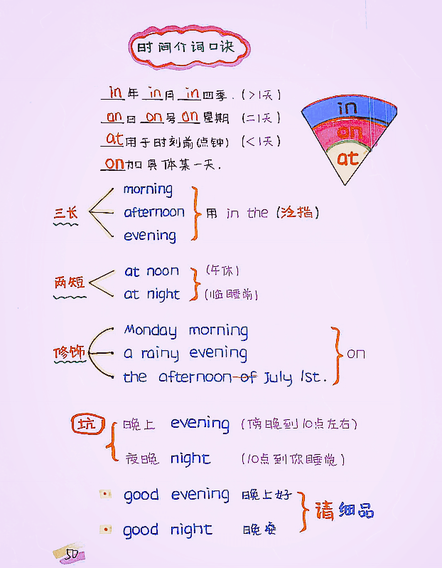
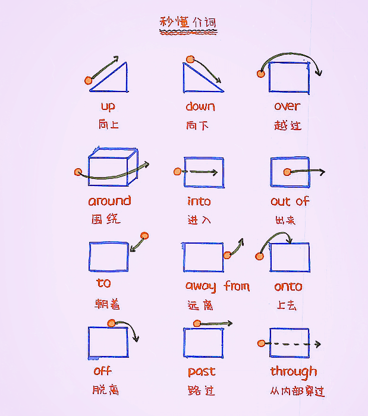

# 背 180927 hgx

## 自救者天救之

1、节约时间避免抱怨的时间浪费

2、方法论比行动更重要

3、善于打造成功案例

4、不可画地为牢与坐以待毙

5、要练手的机会还是浮名

6、人脉的攀龙附凤

7、警惕垃圾工作和陷阱工作

8、自我挑战的事业才会更精彩

9、思想上的先行军

10、跳槽与风险管理

11、无中生有式学习

12、聚焦特色才会有出路

13、利益是发展之母

14、交易心态之下的陷阱

15、职业路径选择象限图

16、细节系统化才有冲击力

17、就是要容忍对方的不足

18、能拿多少钱取决于你的位置

19、要印象还是真相

20、铁三角式成功  （平凡的点点滴滴、长年累月、平常心）

21、莫让高薪和加班废掉

22、良好的悟性源自磨炼 （多实践就会领悟）

23、人脉之上的投资组合

24、人性的特洛伊木马

25、自我救赎才是天道

26、横向扩展你的职业历练

27、信息化时代的扁平式计划

28、兴趣阶段性过程管理

29、偏才还是残废

30、公平总是屈从于规则

31、天大难题，说服自己与改变别人

32、知识的价值在于储备

33、打通方法论上的价值链

34、当心领导示好的陷阱

35、挖掘职业沉淀的宝藏

36、抬头看天于低头看路

37、职业规划与动态管理

38、抱团式集体成才的可能性

39、缺憾主义会更加完美

40、八小时之外的经营

41、职业生涯与接力赛跑

奋斗征程每一个阶段同样重要

42、永远稳定什么的都是浮云

需要一技之长

43、创造力的固化和提炼

44、人脉细胞开发过早更易失败

45、打破一统的江湖神话

46、第一份工作尤为重要

47、定位行业，进退有据

48、信息的真正价值在于交互

49、行业大于专业

50、缺乏步骤和措施的理想毫无意义

51、以义制利

52、君子重信才能维系人心

53、人中豪杰：行足以为仪表、智足以决嫌疑、信可以守约、廉可以分财

54、圆融的姿态要有方正的人格

55、见微知著，从细节处考察人才

56、所有负累都是对欲望的牵挂

57、节约是做人的智慧

58、经验是未来的导向

59、以变应变才能解开死结

60、做事前仔细谋划（多算胜、少算不胜）

61、能说会道，看似雕虫小技却能改变人生

62、用减法拨算生活，甩开欲望包袱

63、物质的快乐，不等于心灵的幸福

64、见小利时思大害

## 大目标分解

目标是：

冲外企、出国

编程变现

分解：

英语基础+口语能力

编程基础+面试技巧

细化：

英语音标+语法+时态  + 训练 +演讲

Python+Java +开发个人系统 +记忆面试技巧

实践：

1、完成资料整理 （学习内容 +重点需要记忆内容）

2、开始学习打卡 +重点一直背诵

3、开始实践输出

4、实战检验、查缺补漏

## 英语音标

## 语法 

S十V主谓结构     我跑

S十V十P主系表结构

S十V十O主谓宾结构

S十V十O1十O2 主谓双宾结构

S十V十O十C 主谓宾补结构

(说明：S＝主语；V＝谓语；P＝表语；O＝宾语；O1＝间接宾语；O2＝直接宾语；C＝补语)

主语就是                人称词

谓语 就是               动词

表语 就是               形容词

宾语就是                  对象

间接宾语 就是         另一个对象

部语就是                  限制条件

## 时态

| 时态翻译表   | 一般时态               | 进行时态                   | 完成时态【有另解】           | 完成进行时态                       |
| ------------ | ---------------------- | -------------------------- | ---------------------------- | ---------------------------------- |
| **现在**     | 做                     | 现在正在做                 | 现在已经做完了               | 到现在为止一直在做                 |
| **过去**     | 过去在做               | 过去正在做                 | 过去过去已经做完了           | 到过去为止一直在做                 |
| **将来**     | 将来要做               | 将来正在做                 | 将来将要做完了               | 到将来为止一直在做                 |
| **过去将来** | 过去的将来的某个时间做 | 过去的将来的某个时间正在做 | 过去的将来的某个时间将要做完 | 到过去的将来的某个时间为止一直在做 |

### 一般现在时用处

- 表示现在经常或者习惯的动作

> My sister wears glasses. 我妹妹戴眼镜。
>
> He often goes to the cinema. 他经常去看电影。

- 表示现在的情况或者状态

> Mother is ill. 母亲病了。
>
> He is always like that. 他总是那样。
>
> He likes living in the country. 他喜欢住在乡下。
>
> We need a lot of money. 我们需要一大笔钱。

- 表示能力、特征、职业等

> He sings well. 他唱歌唱得好。
>
> Mr. Smith teaches French. 史密斯先生教法语。

- 客观真理、科学定理、格言等不受时间限制的客观存在

> Summer follows spring. 春去夏来。
>
> Knowledge is power. 知识就是力量。
>
> The earth turns around the sun. 地球绕着太阳转。

## 一般过去时

翻译成：过去做

### 用法

* 表示过去发生的动作或存在的状态

> He bought the computer five years ago. 这电脑是他五年前买的。
>
> It was then a small fishing village．那时它只是一个小渔村。

* 表示过去经常性或习惯性的动作

> We often played together when we were children．我们小时候常在一起玩。
>
> 注：表过去习惯性的动词，也可用used to或would：
>
> He used to go to work by bus. 他过去常乘公共汽车去上班。

## 一般将来时

翻译成：将要做

### 基本构成

will/shall do sth. = be going to do sth. = be (about/due) to do sth. = be + 现在分词

> 关于最后一个`be + 现在分词`的例子：
>
> The students are leaving on Sunday. 学生们星期日出发。

### 用法

* 表示在现在看来即将要发生的动作或存在的状态

> What will you do this afternoon. 你今天下午干什么？
>
> We will have a meeting tomorrow. 我们明天要开会。
>
> He is going to study abroad next year. 明年他要出国学习。

## 一般过去将来时

翻译成：过去将要做

### 用法

* 表示过去将来要发生的情况或者动作

> It was six o’clock. The sun would soon set. 这时是六点钟，太阳即将落山。
>
> In Berlin, he first met the woman whom he would one day marry. 在柏林，他第一次遇见那个女人，后来他终于跟她结了婚。

* 表示过去的习惯或者倾向

> When I worked on a farm, I used to get up at 5 a.m. 我在农场劳动时，总是早上5点钟起床。
>
> Most often we would find him lying on a couch, reading. 我们经常看到他躺在一张长沙发上看书。
>
> 在该用法中，有时也可用used to代替would，但是当表示过去的状态或今昔对比时，只能用used to。如：
>
> She used to be a thin girl, but now she’s on the fatty side. 她曾是个苗条女孩，但现在却变得很胖。

* 

除了将will/shall 变成would以外，前面在一般将来时中说的各种结构都可以转变为一般过去将来时。

即将`will/shall do sth. = be going to do sth. = be (about/due) to do sth. = be + 现在分词`变成=>

`would do sth. = was/were going to do sth. = was/were (about/due) to do sth. = was/were + 现在分词`

### 一般将来时VS一般过去将来时

怎么区别呢？很简单，就是把时间对照点搞清楚。对于`现在`的`将要做`，就是`一般将来时`，是对于`过去`的`将要做`，就是`一般过去将来时`。

## 现在进行时

翻译成：正在做

### 用法

* 正在进行的事情

> Don’t take that ladder away. Your father’s using it. 别把梯子拿起，你父亲在用哩。
>
> He is writing on the desk. 他再课桌上写字。

* 短期内在进行的事情

> Her car has broken down. She’s going to work by bike. 她的汽车坏了，骑自行车上班。
>
> The professor is typing his own letters while his secretary is ill. 秘书生病时，教授自己打他的信。

* 计划或安排

> Are you working next week? 你下星期工作吗?
>
> We are having a few guests tonight. 今晚我们有几个客人来。
>
> She is buying a new bike soon. 她不久将买一辆新自行车。
>
> We’re spending next winter in Australia. 我们将要在澳大利亚度过明年冬天。
>
> 用arrive, come, go, leave, take off等动词的现在进行时描写行程安排，也通常有含有将来意义。如：
>
> He is arriving tomorrow morning on the 16:40 train. 他乘下午4:40的火车明天上午到。

## 过去进行时

翻译成：XXX时（过去的某时间）正在做

### 用法

* 表示在过去某一点时间或某一段时正在进行的动作

> I was having a bath when the phone rang. 我正在洗澡，突然电话铃响了。
>
> She was writing letters. I didn’t want to disturb her. 她在写信。我不想打扰她。

* 

## 将来进行时

翻译成：XXXXXXX时（将来的时间）将正在做

### 用法

* 表示将来某一时间正在进行的动作

> Hurry up!The guests will be arriving at any minute! 快! 客人就要来了!
>
> A space vehicle will be circling Jupiter in five years’ time. 航天器5年后将绕木星飞行。
>
> Don’t phone me between 5 and 6. We’ll be having dinner then. 五点至六点之间不要给我打电话，那时我们在吃饭。
>
> When I get home, my wife will probably be watching television. 当我到家时，我太太可能正在看电视。

* 将来进行时表示按时计划或安排要发生的动作

> I will be seeing you next week. 我下个星期来看你。
>
> I’ll be taking my holidays soon. 不久我将度假了。
>
> We shall be going to London next week. 下周我们要去伦敦。
>
> We’ll be spending the winter in Australia. (=we are spending) 我们将在澳大利亚过冬。
>
> Professor Craig will be giving a lecture on Etruscan pottery tomorrow evening. (=is giving) 克雷格教授明晚作关于伊特拉斯坎陶器的讲演。

## 过去将来进行时

翻译成：XXXXX时（这个时间点对于过去的某个时间点是将来）将正在做

> "对于过去的某个时间点是将来"应该怎么理解？
>
> 比如现在主句的时态是一般过去时，宾语从句要表示将来怎么怎么样，而且是过去的将来，而不是现在的将来，同时还要表达出`正在`的意思的话，就可以用过去将来进行时。

### 句中位置

* 用于宾语从句中

> I felt it would be presuming on our friendship to keep asking her for help. 我觉得不断要她帮忙是利用了我们的交情。
>
> We informed them by telegram that we would be arriving early. 我们打电报通知他们，我们将在早上到达。
>
> The announcer informed viewers that programmes would be running late. 播音员通知观众节目时间可能推后。
>
> It was thoughtless of her to have rushed out and not said where she would be going.  她这样冲出去又不说去哪里，真是太不为别人着想了。
>
> He announced that there would be more stringent controls on the possession of weapons.  他宣布将对武器的持有实行更严格的控制。
>
> A sixth sense told her that he would be waiting for her when she got home. 她有一种第六感觉，就是她到家时他一定在那儿等候她呢。
>
> She glanced about the hall, hoping against hope that Richard would be waiting for her.  她眼睛扫过大厅，对理查德会在那里等她仍怀有一丝希望。
>
> On May 18, the employee wrote to the council that he would be taking the doctor’s advice.  5月18日，这位雇员致信委员会，称他将遵照医嘱。

* 

## 现在完成时

翻译成：现已完成、现已做完

> 但是现在完成时不光可以表示做完了，具体来说，现在完成时有两个主要用法：
>
> 1. 表示已完成【即影响】：该用法的现在完成时表示一个过去发生的动作在过去已经完成，并且这个过去发生并完成的动作对现在有影响或结果，同时说话强调的或感兴趣的就是这个影响或结果，如汉语说“他已离开这个城市了”，其中的“离开”肯定发生了，它对现在的影响或结果就是“他现在已不在这个城市了”；又如汉语说“有人把窗户打破了”，显然“打破窗户”这一动作发生在过去，并且在过去已经完成了，但说话人强调的重点是打破窗户对现在的影响——窗户现在仍是破的。
>
> 2. 表示未完成【即持续】：该用法的现在完成时表示一个过去发生的动作或开始的状语在过去并未完成或结束，而是一直持续到现在，并且有可能继续下去(也可能到此结束)，如汉语说“他在我们教书已有30年了”，显然“他在我们学校教书”是从30年前开始，并且一直教到现在，已经持续了30年；又如汉语说“自上个星期以来他一直很忙”，显然“忙”是从上个星期开始的，并且这一“忙”就一直忙到现在。

### 用法

* 影响性用法实例分析

> I have lost my pen. 我把钢笔丢了。
>
> 根据句意可知，“丢钢笔”这个动作发生在过去，同时也在过去已经完成，但这个过过去发生和完成的动作对现在有影响——我现在无钢笔用，或我得去买支新的。
>
> We have finished the work. 我们已把工作干完了。
>
> 显然“完成工作”这个动作发生在过去，同时也在过去已经完成，但这个过过去发生和完成的动作对现在有影响——我们可以休息了，或可以回家了，或可以做别的事了。

* 持续性用法实例分析

> I’ve waited a week for your answer. 等你的答复我已等了一个星期。
>
> 根据句意可知，“等”这个动作发生在过去，但它在过去并没有完成，而是一直等到现在，已持续了一个星期。
>
> We have lived here quite a number of years. 我们在这里住了很多年了。
>
> 根据句意可知，“住在这儿”是从过去开始的，但它在过去并没有完成，而是一直等到现在，已持续了好几年。

> 怎么区分应该用具体哪一种完成时呢？
>
> 其实，这时需要区分一个概念，即动词的延续性与非延续性。一般用在现在完成时中如果动词是延续性的【即这个动作可以持续很久，比如住宿，等待】，则用表示持续的现在完成时；如果动词是非延续性的【即动作是一瞬间发生的，如丢失，完成】，则用表示影响的现在完成时。

### 重要考点

#### have been to与have gone to

have been to表示曾经去过某地，但现在不在那儿；have gone to表示现在已去某地，现在不在这儿。如：

> Have you ever been to Greece? 你去过希腊吗?
>
> The Smiths have gone to Canada for a holiday. 史密斯全家都到加拿大度假去了。
>
> 与表示次数的once, twice, three times等连用时，只能用have been to，不能用have gone to。如：
>
> She has been to Europe twice. 她到欧洲去过两次。

另外，have been to除可后接地点表示去过某地外，有时还可以接表示活动的名词，表示去参加过某种活动，或接动词原形(尤其是动词see)，表示去做过某事。如：

> She’s just been to a party. 她刚参加一个晚会回来。
>
> He has never been to see me since I have been ill. 我生病以来他从未来看过我。

#### 现在完成时的标志

* since

> since表示“自从……以来”时，无论是用作介词、连词还是副词，since都通常要与现在完成时连用。如：
>
> I’ve had nothing to eat since lunchtime. 从午饭时间到现在我什么都没吃。
>
> We’ve lost a lot of custom since our prices went up. 自从提价以后，我们失去了许多顾客的生意。
>
> 但是，当since从句的主句表示时间长度时，**主句谓语通常用一般现在时代替现在完成时**。如：
>
> It’s a long time since they left. 他们走后很久了。
>
> It is ten years since he left here. 他离开这儿已10年了。

* so far = up to now

> 当so far表示“到目前为止”时，它指的是从过去某时持续到现在的一段时间，因此通常与现在完成时连用。如：
>
> So far 500 people have died in the earthquake. 到现在为止，已有500人在地震中丧生。
>
> So far the work has been easy, but things may change. 到目前为止，这工作很容易，但情况可能有变化。
>
> 但是，当 so far 表示“到这种程度或范围”时，则不一定与现在完成时连用，**而是可以根据情况选用时态**。如：
>
> I can only help him so far. 我只能帮他到这种程度。

* in the last(past) five years = over the years

> I’ve seen little of her in the past few weeks. 近几周我很少见到她。
>
> We’ve planted thousands of trees in the past five years. 过去五年我们种了成千上万棵树。
>
> The house has changed hands three times in the last two years. 在过去两年中，这栋房子已转手三次。
>
> She’s brought us so much happiness over the years. 这些年来，她给我们带来了不少的幸福。
>
> We’ve had a few arguments over the years, but in general we get on very well. 最近几年来，我们争吵过几次，但总的说来，我们相处得很好。

## 过去完成时

翻译成：XXXXX时（相对于过去的某个时间点）已经做完

其实理解过去完成时只需要理解五个字`过去的过去`。

### 用法

* 对于过去发生的一件事，另一件事已经发生

> When the doctor arrived the patient had died. 医生到时病人已死了。
>
> 根据句意可知，“医生到达”为过去发生的动作，故用一般过去时；而当医生到时病人已死了，所以“病人死”就是过去的过去发生的情况，故用过去完成时。
>
> 
>
> She told me she had been with IBM for five years. 她告诉我说，她在国际商用机器公司已工作5年了。
>
> 根据句意可知，“她告诉我”为过去发生的情况，用一般过去时；而“她在国际商用机器公司工作5年”显然是“她告诉我”之前的事情，即属于过去的过去，所以用过去完成时。
>
> I woke up because I had had a bad dream. 我醒了，因为我做了个噩梦。
>
> “我醒了”为过去发生的情况，用一般过去时；我为什么醒了呢？是因为我做了个噩梦，显然“做噩梦”发生在“醒”之前，也就是说发生在过去的过去时间里，所以“做噩梦”要用过去完成时。
>
> When we got there the basketball match had already started. 我们到那里时，篮球赛已经开始了。
>
> “我们到达那里”为过去发生的情况，故用一般过去时；而我们到那里时篮球赛已经开始了，这说明“篮球赛开始”发生在“我们到达那里”这一过去时间之前，即属于过去的过去，所以“篮球赛开始”要用过去完成时。

* 表示过去未曾实现的想法

> 过去完成时除表示“过去的过去”外，还可表示过去未曾实现的想法和打算，通常连用的动词是 want, think, hope, plan, mean, expect, intend, suppose 等：
>
> I had meant to come, but something happened. 我本想来，但有事就没有来。
>
> I had hoped to send him a Christmas card, but I forgot to do so. 我本来希望寄给他一张圣诞卡的，但我忘了寄了。

## 将来完成时

翻译成：XXXXX时（将来的某个时间）将已完成

### 用法

* 表示“将来完成”，即表示到将来某个时间为止势必会完成或预计要完成的动作。如：

> When we get there, she’ll have gone to work. 我们到那里时她会已上班去了。
>
> I expect you will have changed your mind by tomorrow. 我预料到明天你就会改变主意了。

* 表示“持续”，即表示某种状况将一直持续到说话人所提及的某一将来时间。如：

> We will have been married a year on June 25th. 到6月25日我们俩结婚就满1年了。
>
> By this time next week, I will have been working for this company for 24 years. 到下星期此刻，我就已经为该公司干了24年了。

### 现在完成时、过去完成时与将来完成的区别

1. 现在完成时以现在时间为参照点，表示在“现在”以前完成的动作或持续到“现在”的状态；
2. 过去完成时则以过去时间为参照点，表示在“过去”某一时间以前发生的动作或持续到“过去”某一时间的状态；
3. 将来完成时则以将来时间为参照点，表示在“将来”某一时间为止已经完成的动作或持续到“将来”某一时间的状态。

## 过去将来完成时

翻译成：XXXXXX时（对于过去的未来的某个时间）将要完成

过去将来完成时表示从过去观点看将来某时某动作会业已完成。这个时态用得相对比较少，通常主要用于转述方面，即用于间接引语中。如：

> She said she’d have finished her exams by then. 她说那时她会已经考完试了。
>
> The party would have arrived by four o’clock. 这一行人将于4时前到达。
>
> She said she’d have finished her exams by then. 她说那时她会已经考完试了。

### 用法

* 表示从过去某一时间来看将来某时会已经完成的动作

> I thought Sophia would have told you something. 我想索菲娅会已告诉你一地情况。
>
> He knew by the time he arrived she would have gone home. 他知道他到时她会已经回家。
>
> The day was drawing near when we would have completed the reservoir. 我们建成水库的日子不远了。
>
> He said he would have done with my camera by the end of next month. 他说到下月底就不用我的照相机了。
>
> I guessed that Mother would have made some sandwiches by the time we got back. 我猜我们回来时妈妈已经做好一些三明治了。

## 现在完成进行时

某动作从过去某个时间开始，一直延续到现在，并且还有可能持续下去。

翻译成：一直在做

### 用法

* 表示“持续”：即表示一个从过去某时开始一直持续的动作，这动作可能刚刚停止，也可能还在进行。如：

> She has been pruning the roses. 她一直在修剪玫瑰。
>
> He’s been helping himself to my stationery. 他未经许可一直用我的文具。
>
> The children have been having a lot of fun. 孩子们一直玩得很开心。
>
> She is very tired. She’s been working all morning. 她很累。她干了一早晨了。
>
> Tom has been seeing about a work permit for you. 汤姆一直在想办法给你弄一个工作许可证。
>
> The tobacco industry has been trying to improve its image. 烟草行业一直在试图改善其形象。
>
> It has come to our knowledge that you have been cheating the company. 据我们了解你一直欺骗公司。
>
> The group has been living in a remote corner of the Cambodian jungle. 该部落一直居住在柬埔寨的丛林深处。

## 过去完成进行时

某动作从过去某个时间开始，一直延续到**过去的某个时间**，并且还有可能持续下去。与现在完成进行时的区别就是持续到了过去的某个时间，而不是现在的某个时间。

翻译成：（到过去的某个时间为止）一直在做

### 用法

* 过去完成进行时表示持续到过去某时的一个动作(可算是现在完成进行时的过去式)：

> The ground was wet. It had been raining. 地是湿的。此前一直在下雨。
>
> At last the bus came. I had been waiting for half an hour. 最后公共汽车来了，我已等了半小时。
>
> She was out of breath. She had been running. 她气喘吁吁，她一直在跑来着。
>
> He gave up smoking last year. He’d been smoking for twenty years. 去年他戒烟了。他抽烟已经二十年。

* 过去时间可用一个时间状语表示：

> When I first met her, she had been working in the company for ten years. 我第一次见到她时，她在那家公司已工作十年了。
>
> I had not been waiting long when a taxi drew up. 我没等多久就来了一辆出租车。
>
> She had been looking at the parcel for some time before she realized that it was for her mother. 这包裹她看了好一会儿才明白这是寄给她妈的。
>
> Until/Up till then she had been living with her daughter. 到那时为止她一直和她女儿一起住。

* 但在更多情况下过去时间由另一句子表示出来，毋需加上时间状语：

> Her eyes were red. It was obvious she had been crying. 她眼睛红红的，显然她是哭了。
>
> Jane was annoyed. Peter had been phoning her every night. 简很不高兴。彼得一直每晚给打电话。
>
> He was very tired. He had been working all day. 他很累。他干了一整天活。
>
> She couldn’t understand him. She hadn’t been learning English long. 她不懂他的话。她学语的时间还不长。

* 有时上下文可说明是谈过去的事，因此不需要时间状语：

> She had been watching TV all day. 她看了一天的电视。
>
> I had been reading your book. 我一直在看你写的书。
>
> The rain had been pouring all night. 倾盆大雨下了一整夜。
>
> We had been travelling in many countries. 我们一直在许多国家旅游。

* 这个时态也可用在某些从句中，这时从句的动作发生在主句的动作之前而对其有影响：

> I heard you’d been looking for me. 我听说你一直在找我。
>
> That was just the letter I had been expecting. 这正是我一直期待的信。
>
> That was exactly what we had been trying to do. 这正是我们一直想做的事。
>
> I wanted to know what had been going on. 我想知道一直在发生什么事。
>
> The drive increased the fatigue she had been feeling. 开车增加了她一直感到疲惫感觉。
>
> They said that they had been fighting for their rights all these years. 他们说这些年来他们一直在为他们的权利而斗争。

## 将来完成进行时

某动作从某个时间开始，一直延续到**将来的某个时间**，并且还有可能持续下去。与现在完成进行时的区别就是持续到了将来的某个时间，而不是现在的某个时间。

翻译成：（到将来的某个时间为止）一直在做

### 常见结构

* 将来完成进行时连用的时间状语，与将来完成进行时连用最多的时间状语时是“by+将来时间”，见上面的例子。当然除“by+将来时间”外，连用其他的时间状语也是可能的。如：

> He will have been working all day. 他整天将都在工作。
>
> She will have been having treatment all her life. 她将终生受到治疗。
>
> I’ll have been teaching for thirty years this winter. 到今年冬天我就已任教三十年了。

* 将来完成进行时的情态意义，“will / shall have been+现在分词”结构除表示将来完成进行时外，有时其中的 will 也可能是情态动词，具有情态意义，比较表示推测或猜想等。如：

> They will have been having a holiday yesterday. 他们昨天大概是在度假。
>
> You’ll have been wondering all this time how my invention works. 我想你这些时候一直想知道我的发明怎样会行得通的。

## 过去将来完成进行时

某动作从过去某个时间开始，一直延续到**对于过去是将来的某个时间**，并且还有可能持续下去。与现在完成进行时的区别就是持续到了对于过去是将来的某个时间，而不是现在的某个时间。

翻译成：（到对于过去是将来的某个时间为止）一直在做

### 常见结构

* 间接引语与过去将来完成进行时，在间接引语中，若主句为过去时态，则用于宾语从句中的间接引语则要把将来完成进行时改为过去将来完成进行时。如：

> I know by this time next week you’ll have been working here for 30 years.
>
> →I knew by that time he would have been working there for 30 years.
>
> She will have been teaching in this university for 20 years by this summer.
>
> →She told me she’d have been teaching in that university for 20 years by that summer.

## 时态翻译表（以`做`为例）

| 时态翻译表   | 一般时态                                                     | 进行时态                                                     | 完成时态【有另解】                           | 完成进行时态                                                 |
| ------------ | ------------------------------------------------------------ | ------------------------------------------------------------ | -------------------------------------------- | ------------------------------------------------------------ |
| **现在**     | 做                                                           | 现在正在做                                                   | 现在已经做完了                               | 到现在为止一直在做                                           |
| **过去**     | 过去在做                                                     | 过去正在做                                                   | 过去过去已经做完了                           | 到过去为止一直在做                                           |
| **将来**     | 将来要做                                                     | 将来正在做                                                   | 将来将要做完了                               | 到将来为止一直在做                                           |
| **过去将来** | 过去的将来的某个时间做                                       | 过去的将来的某个时间正在做                                   | 过去的将来的某个时间将要做完                 | 到过去的将来的某个时间为止一直在做                           |
|              | he is always like that                                       | he is writing on the desk                                    | i have lost my pen                           | she has been pruning the roses                               |
|              | it was then a small fishing village                          | it was having a bath when the phone rang                     | when the docter arrived the patient had died | the ground was wet.it had been raining                       |
|              | the student are leaving on sunday、  we will have a meeting tomorrow\will/shall do sth = be going to do sth = be(about/due)  to do sth =be +现在分词 | i will be seeing you next week                               | when we get there/she'll have gone to work   | he will have been working all day                            |
|              | will/shall do sth = be going to do sth = be(about/due)  to do sth =be +现在分词==would do sth = was/were going to do sth = was/were (about/due) to do sth = was/were + 现在分词、   he first met the women whom he would one day marry | i felt it would be presuming on our friendship to keep asking her for help\主句-过去，宾语从句-将来正在 | the party would have arrived by four o'clock | i know by that time he would have been working there for 30 years |

# 训练

周一到周五、B站词汇课、每日英语听力

周末 一篇演讲

The night before I was heading for Scotland, I was invited to host the final of "China's Got Talent" show in Shanghai with the 80,000 live audience in the stadium. Guess who was the performing guest? Susan Boyle. And I told her, "I'm going to Scotland the next day."

来苏格兰（做TED讲演）的前夜，我被邀请去上海做”中国达人秀“决赛的评委。在装有八万现场观众的演播厅里，在台上的表演嘉宾居然是（来自苏格兰的，因参加英国达人秀走红的）苏珊大妈（Susan Boyle)。我告诉她，“我明天就要启程去苏格兰。”

She sang beautifully, and she even managed to say a few words in Chinese. So it's not like "hello" or "thank you, " that ordinary stuff. It means "green onion for free." Why did she say that? Because it was a line from our Chinese parallel Susan Boyle — a 50-some year-old woman, a vegetable vendor in Shanghai, who loves singing Western opera, but she didn't understand any English or French or Italian, so she managed to fill in the lyrics with vegetable names in Chinese.

她唱得很动听，还对观众说了几句中文，她并没有说简单的"你好"或者"谢谢"，她说的是——“送你葱”（Song Ni Cong)。为什么？这句话其实来源于中国版的“苏珊大妈”——一位五十岁的以卖菜为生，却对西方歌剧有出奇爱好的上海中年妇女（蔡洪平）。这位中国的苏珊大 妈并不懂英文，法语或意大利文，所以她将歌剧中的词汇都换做中文中的蔬菜名，并且演唱出来。

(Laughter) And the last sentence of Nessun Dorma that she was singing in the stadium was "green onion for free." So as Susan Boyle was saying that, 80,000 live audience sang together. That was hilarious.

在她口中，歌剧《图兰朵》的最后一句便是“Song Ni Cong”。当真正的英国苏珊大妈唱出这一句“中文的”《图兰朵》时，全场的八万观众也一起高声歌唱，场面的确有些滑稽（hilarious)。

So I guess both Susan Boyle and this vegetable vendor in Shanghai belonged to otherness. They were the least expected to be successful in the business called entertainment, yet their courage and talent brought them through. And a show and a platform gave them the stage to realize their dreams. Well, being different is not that difficult. We are all different from different perspectives. But I think being different is good, because you present a different point of view. You may have the chance to make a difference.

我想Susan Boyle和这位上海的买菜农妇的确属于人群中的少数。她们是最不可能在演艺界成功的，而她们的勇气和才华让她们成功了，这个节目和舞台给予了她们一个实现个人梦想的机会。这样看来，与众不同好像没有那么难。从不同的方面审视，我们每个人都是不同的。但是我想，与众不同是一件好事，因为你代表了不一样的观点，你拥有了做改变的机会。

My generation has been very fortunate to witness and participate in the historic transformation of China that has made so many changes in the past 20, 30 years. I remember that in the year of 1990, when I was graduating from college, I was applying for a job in the sales department of the first five-star hotel in Beijing, Great Wall Sheraton — it's still there. So after being interrogated by this Japanese manager for a half an hour, he finally said, "So, Miss Yang, do you have any questions to ask me? " I summoned my courage and poise and said, "Yes, but could you let me know, what actually do you sell? " I didn't have a clue what a sales department was about in a five-star hotel. That was the first day I set my foot in a five-star hotel.

我这一代中国人很幸运的目睹并且参与了中国在过去二三十年中经历的巨变。我记得1990年，当我刚大学毕业时，我申请了当时北京的第一家五星级酒店--长城喜来登酒店的销售部门的工作。这家酒店现在仍在北京。当我被一位日 本籍经理面试了一个半小时之后，他问到，“杨小姐，你有什么想问我的吗？”我屏住呼吸，问道“是的，你能告诉我，具体我需要销售些什么吗？”当时的我，对五星级酒店的销售部门没有任何概念，事实上，那是我第一次进到一家五星级酒店。

Around the same time, I was going through an audition — the first ever open audition by national television in China — with another thousand college girls. The producer told us they were looking for some sweet, innocent and beautiful fresh face. So when it was my turn, I stood up and said, "Why [do] women's personalities on television always have to be beautiful, sweet, innocent and, you know, supportive? Why can't they have their own ideas and their own voice? " I thought I kind of offended them. But actually, they were impressed by my words. And so I was in the second round of competition, and then the third and the fourth. After seven rounds of competition, I was the last one to survive it. So I was on a national television prime-time show.

我当时也在参加另一场“面试”，中国国家电视台的首次公开试镜，与我一起参与选拔的还有另外1000名大学女毕业生。节目制作人说，他们希望找到一位甜美，无辜（LOL），漂亮的新鲜面孔。轮到我的时候，我问道“为什么在电视屏幕上，女性总应该表现出甜美漂亮，甚至是服从性的一面？为什么她们不能有她们自己的想法和声音？”我觉得我的问题甚至有点冒犯到了他。但实际上，他们对我的表现印象深刻。我进入了第二轮选拔，第三轮，第四轮，直至最后的第七场选拔，我是唯一一个走到最后的试镜者。

And believe it or not, that was the first show on Chinese television that allowed its hosts to speak out of their own minds without reading an approved script. (Applause) And my weekly audience at that time was between 200 to 300 million people.

我从此走上了国家电视台黄金时段的荧幕。你可能不相信，但在当时，我所主持的电视节目是中国第一个，不让主持人念已经审核过的稿件的节目（掌声）。我每周需要面对两亿到三亿左右的电视观众。

Well after a few years, I decided to go to the U. S. and Columbia University to pursue my postgraduate studies, and then started my own media company, which was unthought of during the years that I started my career. So we do a lot of things. I've interviewed more than a thousand people in the past. And sometimes I have young people approaching me say, "Lan, you changed my life, " and I feel proud of that. But then we are also so fortunate to witness the transformation of the whole country. I was in Beijing's bidding for the Olympic Games. I was representing the Shanghai Expo. I saw China embracing the world and vice versa. But then sometimes I'm thinking, what are today's young generation up to? How are they different, and what are the differences they are going to make to shape the future of China, or at large, the world?

几年以后，我决定来美国哥伦比亚大学继续深造，之后也开始运营自己的媒体公司，这也是我在职业生涯初始时所没有预料到的。我的公司做很多不同的业务，在过去这些年里，我访谈过一千多人。经常有年轻人对我说，“杨澜，你改变了我的人生”，我对此感到非常自豪。我也幸运的目睹了整个国家的转变：我参与了北京申奥和上海世博会。我看到中国在拥抱这个世界，而世界也进一步的接受中国。但有时我也在想，今天的年轻人的生活是什么样的？他们（与我们相比）有什么不同？他们将带给中国，甚至整个世界的未来一些怎样的变化？

So today I want to talk about young people through the platform of social media. First of all, who are they? What do they look like? Well this is a girl called Guo Meimei — 20 years old, beautiful. She showed off her expensive bags, clothes and car on her microblog, which is the Chinese version of Twitter. And she claimed to be the general manager of Red Cross at the Chamber of Commerce. She didn't realize that she stepped on a sensitive nerve and aroused national questioning, almost a turmoil, against the credibility of Red Cross. The controversy was so heated that the Red Cross had to open a press conference to clarify it, and the investigation is going on. So far, as of today, we know that she herself made up that title — probably because she feels proud to be associated with charity. All those expensive items were given to her as gifts by her boyfriend, who used to be a board member in a subdivision of Red Cross at Chamber of Commerce.

我想通过社交媒体来谈一谈中国的年轻人们。首先，他们是谁，他们是什么样子？这是一位叫郭美美的女孩儿，20岁，年轻漂亮。她在中国版的Twitter上——新浪微博上，炫耀她所拥有的奢侈品，衣服，包和车。她甚至宣称她是中国红十字会的工作人员。她没有意识到她的行为触及了中国民众极为敏感的神经，这引发了一场全民大讨论，民众开始质疑红十字会的公信力。中国红十字会为了平息这场争议甚至举办了一场记者会来澄清，直至今日，对于”郭美美事件“的调查仍在继续，但我们所知道的事实是，她谎报了她的头衔，可能是因为她的虚荣心，希望把自己和慈善机构联系起来。所有那些奢侈品都是她的男朋友给她买的，而那位”男朋友“的确曾经是红十字会的工作人员。

It's very complicated to explain. But anyway, the public still doesn't buy it. It is still boiling. It shows us a general mistrust of government or government-backed institutions, which lacked transparency in the past. And also it showed us the power and the impact of social media as microblog.

这解释起来很复杂，总之，公众对他们的解释仍然不满意，这仍然是在风口浪尖的一件事。这件事体现出（中国社会）对长期不透明的政府机关的不信任，同时也表现出社交媒体（微博）巨大的社会影响力。

Microblog boomed in the year of 2010, with visitors doubled and time spent on it tripled. Sina. com, a major news portal, alone has more than 140 million microbloggers. On Tencent, 200 million. The most popular blogger — it's not me — it's a movie star, and she has more than 9.5 million followers, or fans. About 80 percent of those microbloggers are young people, under 30 years old. And because, as you know, the traditional media is still heavily controlled by the government, social media offers an opening to let the steam out a little bit. But because you don't have many other openings, the heat coming out of this opening is sometimes very strong, active and even violent.

微博在2010年得到了爆炸性的增长，微博的访问用户增长了一倍，用户的访问时间是09年的三倍。新浪（Sina.com)，一个最主要的微博平台，拥有1.4亿的微博用户，而腾讯拥有两亿用户。（在中国）最有名的微博主——不是我——是一位电影明星，她拥有近九百五十万”粉丝“。接近80％的微博用户是年轻人，三十岁以下。因为传统媒体还在政府的强力控制之下，社交媒体提供了一个开放的平台进行了一些（民众观点的）分流。因为这样分流的渠道并不多，从这个平台上爆发出的能量往往非常强烈，有时候甚至过于强烈。

So through microblogging, we are able to understand Chinese youth even better. So how are they different? First of all, most of them were born in the 80s and 90s, under the one-child policy. And because of selected abortion by families who favored boys to girls, now we have ended up with 30 million more young men than women. That could pose a potential danger to the society, but who knows; we're in a globalized world, so they can look for girlfriends from other countries. Most of them have fairly good education. The illiteracy rate in China among this generation is under one percent. In cities, 80 percent of kids go to college. But they are facing an aging China with a population above 65 years old coming up with seven-point-some percent this year, and about to be 15 percent by the year of 2030. And you know we have the tradition that younger generations support the elders financially, and taking care of them when they're sick. So it means young couples will have to support four parents who have a life expectancy of 73 years old.

通过微博，我们可以更好的了解到中国的年轻一代。他们到底有什么特点呢？首先，他们中的大多数都出生在八零九零年代，在独生子女的生育政策的大背景下长大。因为偏好男孩的家庭会选择性的堕胎，现在（中国）的年轻男性的数量多过年轻女性三千万，这可能带来社会的不稳定（危险），但是我们知道，在这个全球化的社会中，他们可能可以去其他国家找女朋友。大多数人都拥有良好的教育。这一代中国人中的文盲率已经低于1％。在城市中，80％的孩子可以上大学，但他们将要面对的是一个，有接近7％的人口都是老年人的社会，这个数字会在2030年会增长到15%。在这个国家，传统是让年轻人来从经济上和医疗上来 支持老年人，这意味着，一对年轻的夫妻将需要支持四个平均年龄是73岁的老人。

So making a living is not that easy for young people. College graduates are not in short supply. In urban areas, college graduates find the starting salary is about 400 U. S. dollars a month, while the average rent is above $500. So what do they do? They have to share space — squeezed in very limited space to save money — and they call themselves "tribe of ants. " And for those who are ready to get married and buy their apartment, they figured out they have to work for 30 to 40 years to afford their first apartment. That ratio in America would only cost a couple five years to earn, but in China it's 30 to 40 years with the skyrocketing real estate price.

所以对于年轻人而言，生活并不是容易。本科毕业生也不在是紧缺资源。在城市中，本科生的月起薪通常是400美元（2500人民币），而公寓的平均月租金却是500美元。所以他们的解决方式是合租——挤在有限的空间中以节省开支，他们叫自己“蚁族。”对于那些准备好结婚并希望购买一套公寓的中国年轻夫妇而言，他们发现他们必须要不间断的工作30到40年才可以负担得起一套公寓。对于同样的美国年轻夫妇而言，他们只需要五年时间。而在房地产飞涨的中国，需要30到40年。

Among the 200 million migrant workers, 60 percent of them are young people. They find themselves sort of sandwiched between the urban areas and the rural areas. Most of them don't want to go back to the countryside, but they don't have the sense of belonging. They work for longer hours with less income, less social welfare. And they're more vulnerable to job losses, subject to inflation, tightening loans from banks, appreciation of the renminbi, or decline of demand from Europe or America for the products they produce. Last year, though, an appalling incident in a southern OEM manufacturing compound in China: 13 young workers in their late teens and early 20s committed suicide, just one by one like causing a contagious disease. But they died because of all different personal reasons. But this whole incident aroused a huge outcry from society about the isolation, both physical and mental, of these migrant workers.

在近两亿的涌入城市的农民工中，他们中的60％都是年轻人。他们发现自己被夹在了城市和农村中，大多数人不愿意回到农村，但他们在城市也找不到归属感。他们工作更长的时间却获得更少的薪水和社会福利。他们也更容易面临失业，受到通货膨胀，银行利率，人民币升值的影响，甚至美国和欧盟对于中国制造产品的抵制也会影响到他们。去年，在中国南方的一个制造工厂里，有十三位年轻的工人选择了结束自己的生命，一个接一个，像一场传染病。他们轻生的原因各有不同，但整个事件提醒了中国社会和政府，需要更多的关注这些在精神上和生理上都与外界脱节的年轻农民工人。

For those who do return back to the countryside, they find themselves very welcome locally, because with the knowledge, skills and networks they have learned in the cities, with the assistance of the Internet, they're able to create more jobs, upgrade local agriculture and create new business in the less developed market. So for the past few years, the coastal areas, they found themselves in a shortage of labor.

对于那些回到农村的年轻人，他们所经历的城市生活，所学到的知识，技巧和建立的社会网络，让他们通常更受欢迎。特别是在互联网的帮助下，他们更有 可能获得工作，提升农村的农业水平和发展新的商业机会。在过去的一些年中，一些沿海的城镇甚至出现了劳动力短缺。

These diagrams show a more general social background. The first one is the Engels coefficient, which explains that the cost of daily necessities has dropped its percentage all through the past decade, in terms of family income, to about 37-some percent. But then in the last two years, it goes up again to 39 percent, indicating a rising living cost. The Gini coefficient has already passed the dangerous line of 0.4. Now it's 0.5 — even worse than that in America — showing us the income inequality. And so you see this whole society getting frustrated about losing some of its mobility. And also, the bitterness and even resentment towards the rich and the powerful is quite widespread. So any accusations of corruption or backdoor dealings between authorities or business would arouse a social outcry or even unrest.

这些图片展现出整体的社会背景。第一张图片是恩格斯系数（食品支出占总消费支出的比例），可以看到在过去的十年中，食物和生活必需品在家庭消费中的比例有所下降（37％），然后在 过去的两年中，这项指数上升到39％，说明近两年中生活成本的攀升。基尼系数早已越过了危险的0.4，到达0.5——这甚至高过了美国——体现出极大的贫富差距，于是我们也看到了整个社会对于它的缺乏灵活性感到沮丧。同时，“仇富心态”也开始在整个社会蔓延，任何与腐败和走后门相关的政府或商业丑闻都会引发社会危机和不稳定。

So through some of the hottest topics on microblogging, we can see what young people care most about. Social justice and government accountability runs the first in what they demand. For the past decade or so, a massive urbanization and development have let us witness a lot of reports on the forced demolition of private property. And it has aroused huge anger and frustration among our young generation. Sometimes people get killed, and sometimes people set themselves on fire to protest. So when these incidents are reported more and more frequently on the Internet, people cry for the government to take actions to stop this.

通过微博上很火的话题，我们可以看到年轻人的关注点。社会公正和政府的公信力是他们首要需求的。在过去的十年中，急速的城市化让民众读到太多强制私人住户拆迁的新闻，这引发了年轻一代的愤怒和不理解。有时候，被拆迁的住户以自杀和自焚的方式来抗议（强制拆迁行为）。当这些事件越来越常在互联网上被揭露出来，人们期待政府可以采取一些更积极的制止行动。

So the good news is that earlier this year, the state council passed a new regulation on house requisition and demolition and passed the right to order forced demolition from local governments to the court. Similarly, many other issues concerning public safety is a hot topic on the Internet. We heard about polluted air, polluted water, poisoned food. And guess what, we have faked beef. They have sorts of ingredients that you brush on a piece of chicken or fish, and it turns it to look like beef. And then lately, people are very concerned about cooking oil, because thousands of people have been found refining cooking oil from restaurant slop. So all these things have aroused a huge outcry from the Internet. And fortunately, we have seen the government responding more timely and also more frequently to the public concerns.

好消息是，今年早些时候，人民代表大会通过了一项关于房屋征用和拆迁的新法规，将征用和拆迁的权利从当地政府移交到了法庭。相同的，很多其他与公共安全相关的问题也在互联网上被热烈讨论。我们听到有太多空气污染，水污染，有毒食品的报道。你甚至都想不到，我们还有假牛肉。人们用一种特殊的材料加入鸡肉和鱼肉中，然后以牛肉的价格进行出售。最近，人们对食用油也很担忧，大量的餐馆被发现在使用“地沟油“。所有这些事件引发了互联网上民众观点的大爆发。幸运的是，我们看到了政府正在更积极和更及时的对这些民众的质疑给予回应。

While young people seem to be very sure about their participation in public policy-making, but sometimes they're a little bit lost in terms of what they want for their personal life. China is soon to pass the U. S. as the number one market for luxury brands — that's not including the Chinese expenditures in Europe and elsewhere. But you know what, half of those consumers are earning a salary below 2,000 U. S. dollars. They're not rich at all. They're taking those bags and clothes as a sense of identity and social status. And this is a girl explicitly saying on a TV dating show that she would rather cry in a BMW than smile on a bicycle. But of course, we do have young people who would still prefer to smile, whether in a BMW or on a bicycle.

一方面，年轻人越来越积极的参与到公共事务中；另一方面，他们也在寻找或者说迷失与个人生活的价值和定位。中国很快就要超过美国，成为世界上第一大奢侈品消费国——这还不包括中国人在国外的消费。但你知道吗，超过半数中国的奢侈品消费者的（年）收入都低于两千美元。他们其实并不富裕，他们用那些奢侈品牌的服装和包体现身份和社会地位。这是一位在电视节目上公然表明，自己宁愿在宝马车里哭也不坐在自行车后笑的年轻女孩。当然，我们也有更多的年轻人，喜欢微笑，不管是在宝马还是在自行车上。

So in the next picture, you see a very popular phenomenon called "naked" wedding, or "naked" marriage. It does not mean they will wear nothing in the wedding, but it shows that these young couples are ready to get married without a house, without a car, without a diamond ring and without a wedding banquet, to show their commitment to true love. And also, people are doing good through social media. And the first picture showed us that a truck caging 500 homeless and kidnapped dogs for food processing was spotted and stopped on the highway with the whole country watching through microblogging. People were donating money, dog food and offering volunteer work to stop that truck. And after hours of negotiation, 500 dogs were rescued. And here also people are helping to find missing children. A father posted his son's picture onto the Internet. After thousands of [unclear], the child was found, and we witnessed the reunion of the family through microblogging.

在下一幅图中，你看到的是现在非常流行的”裸婚“，这并不代表这“裸露出席婚礼”，这体现的是年轻人愿意接受结婚不买房，不买车，不买钻戒，甚至不办婚宴的这个现实，作为对纯朴的真爱的致敬。但同时，人们也在通过社交媒体做一些善事。这副图片里，这辆车上装有500只被”绑架“来，准备被送去屠宰的狗，这辆车被网友们发现后，人们开始通过微博关注事态的进展，并且通过捐钱，捐食物和做义工来试图拦截该车。在几个小时的周旋后，这500条狗获救并被放生。有更多的人在通过微博寻找丢失的孩子。一位父亲将他失散的儿子的照片发布到微博上，在几千条”转发“之后，他的儿子被找到，家庭的团聚也在微博上被报道出来。

So happiness is the most popular word we have heard through the past two years. Happiness is not only related to personal experiences and personal values, but also, it's about the environment. People are thinking about the following questions: Are we going to sacrifice our environment further to produce higher GDP? How are we going to perform our social and political reform to keep pace with economic growth, to keep sustainability and stability? And also, how capable is the system of self-correctness to keep more people content with all sorts of friction going on at the same time?

“幸福（感）”是近两年中国的流行词汇。幸福感不仅仅与个人体验和价值观相关，更多的，它与环境息息相关。人们在思考：我们是否要牺牲环境来提升GDP？我们要怎样进行社会和政治体制的改革来应对经济的发展，保持稳定性和可持续性发展？同时，这个系统的自我修正能力是否足够强大，是否能够让生活在其中的人民接受在前进过程中的各种压力和困难？

I guess these are the questions people are going to answer. And our younger generation are going to transform this country while at the same time being transformed themselves. Thank you very much.

我想这些都是中国人民需要回答的问题,而中国的年轻一代将在改变这个国家的过程中也改变自己。谢谢大家！

would - 百度翻译
将
常见释义
英[wʊd , wəd]
美[wʊd , wəd]
modal	将; （表达愿望）会，将会; 可以，能够( = could); （用于第一人称时表示说话者的意愿；用于第二、第三人称时表示在特定条件下会产生的结果）就，该; 总是，爱，好，就; （表示婉转的请求）请; 当然，应该( = should); （表示设想、推测、可能性）也许，大概; 总是，老是; （表示疑惑、不定）竟会，倒会; （表示可能发生的事情没有发生，是因为之前另一件事没有发生）就会; （说明动机）; （will的过去式，用于转述）将会; 带出想象的结果;
v.	希望; 愿意; 想要; 想要（某事发生）; 喜欢; 决心，决意; 立定志向; 立遗嘱将（财产等）赠与（某人）;
[例句]It was announced that new speed restrictions would be introduced.
据宣布，将有新的限速规定出台

how - 百度翻译
怎样
常见释义
英[haʊ]
美[haʊ]
adv.	（指方式、方法）怎样，怎么，如何; （指数量、程度）多少，多么; （指原因、目的）怎么，为什么; （请求对方加以说明）什么; （用于感叹句中）多么，何等; （指状态、情况）怎么样; 价钱多少; 不管用什么方法（或方式）;
n.	方式，方法; 关于方式（或方法）的问题;
conj.	不管如何，无论怎样;
int.	〈美〉好哇！（原为印第安人的问候语，现亦被其他人诙谐地模仿使用）;
[例句]How will I ever get on top of all this work?
我究竟怎样才处理得了这么多的工作？
进行更多翻译

ever - 百度翻译
曾经
常见释义
英[ˈevə(r)]
美[ˈevər]
adv.	曾经; (进行比较时用以加强语气)以往任何时候; 总是; 始终; 究竟，到底; 不断地; (用于否定句和疑问句，或与if连用的句子)在任何时候;
[例句]Why did I ever get mixed up with you?
我怎么会曾经跟你混在一起呢？

on top of - 百度翻译
在上面
常见释义
英[ɒn tɒp ɒv]
美[ɑːn tɑːp əv]
[词典]	在上面，在…之上; 掌握（情况等）; 胜任（工作等）; 除…之外（还有其他问题）; 完全控制某事物，对某事物摸得一清二楚; （危险或威胁）非常接近某人，逼近某人;
[例句]They move around and then everybody piled on top of that? Oh yeah
他们出门然后每个人都挤着堆在上面吗哦是的

with - 百度翻译
具有
常见释义
英[wɪð]
美[wɪð]
prep.	具有; 和; 用; 有; 以; 跟; 同; 带有; 使用; 和…在一起; 借; 与…对立; 关于; 包括; 因为; 由于; 与…方向一致; 由…持有; 为…工作; 虽然; 作为…的成员，为…所雇用; 具有，有，带有; 在…身上，在…身边; 由于，因; 在…那里，在…看来;
[例句]She is a doctor with a strong sense of vocation.
她是一位具有强烈使命感的医生。

