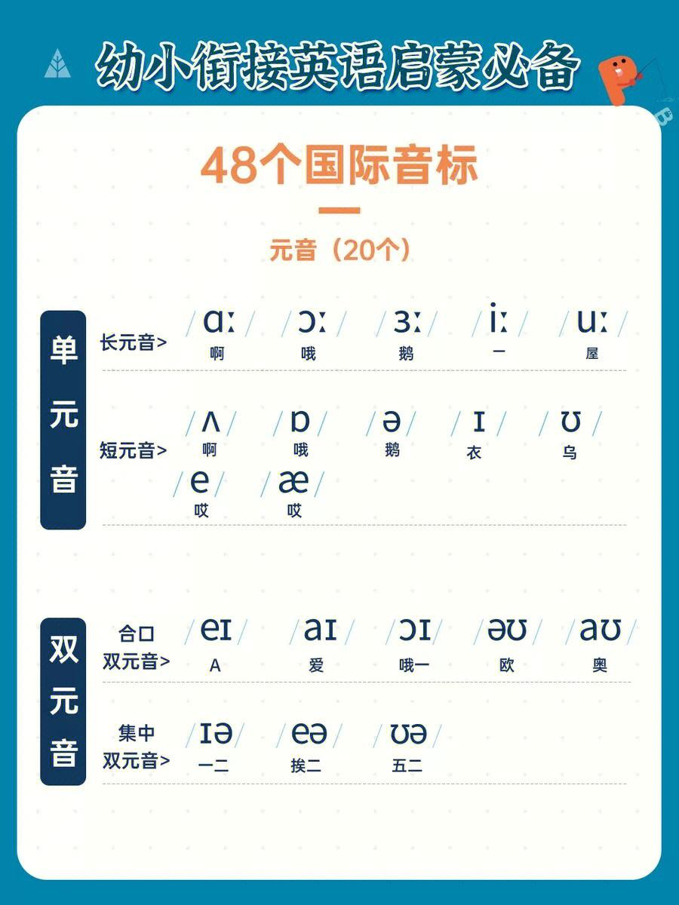
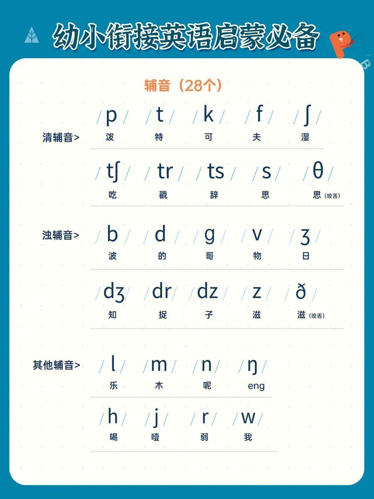
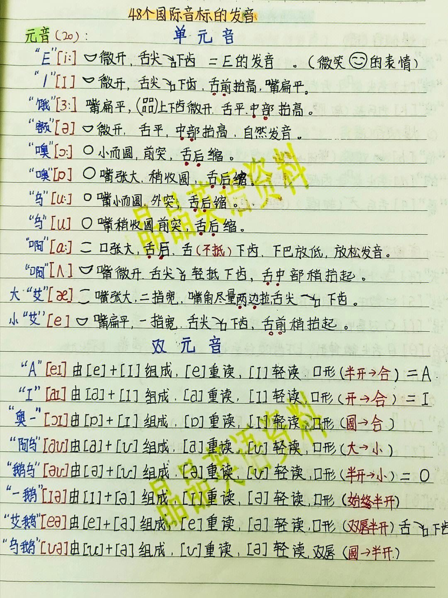
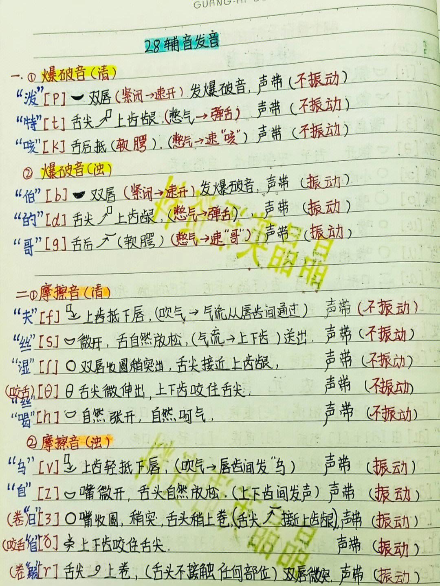
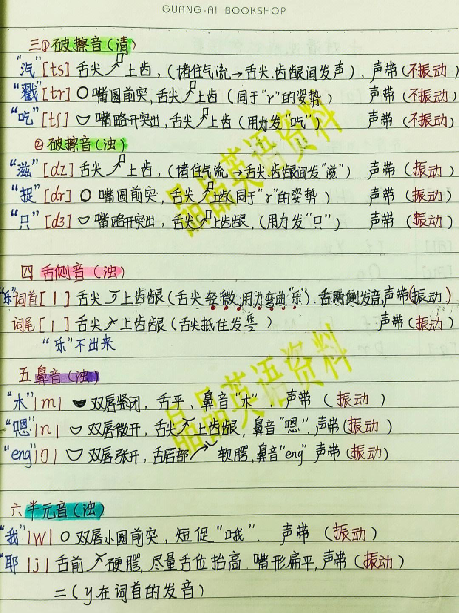

# Day2 英语情景对话：签证面试

补充音标　














```

[i:]  sheep
[i]   fish
[e]   egg
[ae]  apple
[3:]  person
[o)]   doller
[^]   cup
[u:]  tooth
[u]   book
[):]  draw
[1)]  watch
[(1:] car
[ei]  eight
[ai]  eye
[)i]  boy
[au]  cloud
[o)u]  coat
[io)]  ear
[eo)]  bear
[uo)]  poor

[p]  map


/i:/ - see, heat, meat

/ɪ/ - sit, pin, big

/e/ - bed, head, said

/æ/ - cat, hat, sad

/ɑ:/ - car, start, hard

/ɔ:/ - door, more, four

/ʊ/ - put, foot, good

/u:/ - blue, true, food

/ə/ - about, mother, taken

/ɜ:/ - bird, heard, learn

/eə/ - hair, where, air

/ʊə/ - poor, tour, sure

/ɔɪ/ - boy, toy, enjoy

/aɪ/ - eye, my, buy

/aʊ/ - now, how, cow

/p/ - pen, spin, happy

/b/ - boy, web, rub

/t/ - tea, stop, late

/d/ - day, made, ride

/k/ - cat, skill, make

/g/ - game, gig, big

/f/ - fish, leaf, photo

/v/ - view, love, have

/θ/ - thin, with, math

/ð/ - then, father, breathe

/s/ - sun, house, miss

/z/ - zoo, rose, jazz

/ʃ/ - ship, push, wish

/ʒ/ - measure, pleasure, vision

/h/ - heat, hello, ahead

/m/ - map, time, team

/n/ - no, fun, sign

/ŋ/ - sing, ring, long

/l/ - love, well, silly

/r/ - run, red, rain

/j/ - yes, you, use

/w/ - we, will, now

/iə/ - here, fear, beer

/eɪ/ - day, rain, say

/aɪə/ - higher, buyer, fire

/ɔɪə/ - lawyer, employer, loyal

/aʊə/ - power, flower, shower

/ti:/ - tea, eat, meet

/si:/ - see, sea, ceiling

/ʃi:/ - she, sheep, sugar

/tʃ/ - chat, choose, catch

/dʒ/ - joy, jump, large

/hw/ - when, where, why


/p/ 对应 "pat"

/b/ 对应 "bat"

/t/ 对应 "top"

/d/ 对应 "dog"

/k/ 对应 "kick"

/g/ 对应 "go"

/f/ 对应 "fan"

/v/ 对应 "van"

/θ/ 对应 "think"

/ð/ 对应 "this"

/s/ 对应 "sit"

/z/ 对应 "zip"

/ʃ/ 对应 "she"

/ʒ/ 对应 "vision"

/h/ 对应 "hat"

/m/ 对应 "man"

/n/ 对应 "not"

/ŋ/ 对应 "sing"

/l/ 对应 "love"

/r/ 对应 "red"

/j/ 对应 "yellow"

/w/ 对应 "wet"

/aɪ/ 对应 "high"

/aʊ/ 对应 "house"

/ɔɪ/ 对应 "boy"

/e/ 对应 "bed"

/ɜ:/ 对应 "bird"

/ə/ 对应 "ago"

/u:/ 对应 "boot"

/ʌ/ 对应 "cup"

/ɪ/ 对应 "bit"

/i:/ 对应 "bee"

/eɪ/ 对应 "day"

/əʊ/ 对应 "go"

/a:/ 对应 "car"

/ɔ:/ 对应 "law"

/ju:/ 对应 "cute"

/ɑ:/ 对应 "father"

/ɒ/ 对应 "not"

/eə/ 对应 "hair"

/ɪə/ 对应 "here"

/ʊə/ 对应 "tour"

/dʒ/ 对应 "jam"

/tʃ/ 对应 "chin"

/ər/ 对应 "butter"

/ɔɪ/ 对应 "boy"

/aɪə/ 对应 "hire"

/eɪə/ 对应 "player"
```


　A：Hi. Today, I am the interviewer for your visa application.


　　**你好。今天我负责对你的签证申请进行面试。**

　　B：OK. Here is my application form and all the documents.

　　**好的，这是我的申请表和申请资料。**

　　A：Can you tell me why do you want a visa to America?

　　**能告诉我你为什么想要申请美国的签证吗?**

　　B：Because I want to have a view of the exotic landscapes to extend my views and understanding of the world.

　　**因为我一直想要领略一下异域风光，以扩展自己的`视野，增进对世界的了解。**

　　A：OK. Do you plan to go to America all by yourself or with your family?

　　**好的，你打算自己去还是和家人一起去呢?**

　　B：Myself.

　　**我打算一个人去。**

　　A：Have you finished all you preparation?

　　**那你对你的行程都准备好了吗?**

　　B：Yes. Everything is ready.

　　**是的，都准备好了。**

　　It’s the most feared question during any job interview: Can you tell me about yourself? Before I share a list of 10 memorable answers, consider the two essential elements behind the answers:

　　“你可以介绍一下自己吗?”此题乃是面试无法回避的可怕存在。在阅读我的建议之前，先了解一下回答背后的重要逻辑。

　　The medium is the message. The interviewer cares less about your answer to this question and more about the confidence, enthusiasm and passion with which you answer it. The speed of the response is the response. The biggest mistake you could make is pausing, stalling or fumbling at the onset of your answer, thus demonstrating a lack of self-awareness and self-esteem.

　　**信息只是媒介。比起你给出的答卷，面试官更在意你回答时的自信、热忱和激情，你回答的速度本身就是答案。而你可能犯的最严重失误就是支支吾吾的样子，这就坐实了你缺乏自信，和自我认知。**


　　**立即抓住眼球**

　　“I can summarize who I am in three words.” Grabs their attention immediately. Demonstrates your ability to be concise, creative and compelling.


　　**座右铭**

　　“The quotation I live my life by is…” Proves that personal development is an essential part of your growth plan. Also shows your ability to motivate yourself.

　　**人生观**

　　“My personal philosophy is…” Companies hire athletes – not shortstops. This line indicates your position as a thinker, not just an employee.

　　**自我认知**

　　“People who know me best say that I’m…” This response offers insight into your own level of self-awareness.

　　**“今早我百度了一下自己的名字，结果发现了这个….. ”**

　　“Well, I googled myself this morning, and here’s what I found…” Tech-savvy, fun, cool people would say this. Unexpected and memorable.

　　**你热爱什么?**

　　“My passion is…” People don’t care what you do – people care who you are. And what you’re passionate about is who you are. Plus, passion unearths enthusiasm.

　　**“我从7岁开始就…”**

　　“When I was seven years old, I always wanted to be…” An answer like this shows that you’ve been preparing for this job your whole life, not just the night before.

　　**“如果把我的人生拍成电影，那名字应该是…”**

　　“If Hollywood made a move about my life, it would be called…” Engaging, interesting and entertaining.

　　**让自己从口袋里跳出来!**

　　“Can I show you, instead of tell you?” Then, pull something out of your pocket that represents who you are. Who could resist this answer? Who could forget this answer?

　　**“朋友们一般这么夸我”**

　　“The compliment people give me most frequently is…” Almost like a testimonial, this response also indicates self-awareness and openness to feedback.

　　Keep in mind that these examples are just the opener. The secret is thinking how you will follow up each answer with relevant, interesting and concise explanations that make the already bored interviewer look up from his stale coffee and think, “Wow! That’s the best answer I’ve heard all day!”

　　**我的例子只是帮你打开脑洞，请自行举一反三。成功的诀窍就是如何切题、有趣、简洁地阐述你的回答，让那些已经昏昏欲睡的面试官惊喜地想：这就是今天的最佳答案!**

　　I understand your fear with such answers. Responses like these are risky, unexpected and unorthodox. And that’s exactly why they work. When people ask you to tell them about yourself, make them glad they asked.

　　你看到以上答案也许会觉得不敢照着做，因为太冒险、出乎意料，不循规蹈矩。而这恰恰是它能奏效的原因。当有人让你自我介绍时，惊艳他们!

## 150句超实用英语口语对话精选，机场出入境必备！


出国的第一步就是乘坐飞机，以下是在机场常用到的英语：


**1、I have a bag to check.**


我有行李需要转运。


**2、Here is my passport.**


这是我的护照。


**3、I have a stopover in Bangkok.**


我需要在曼谷转机。


**4、Is the flight delayed?** 


航班延误了吗？


**5、The flight will be put off.** 


飞机要延误了。


**6、Due to bad weather condition.** 


因为航空管制。


**7、My flight has been delayed.** 


我的航班延误了。


**8、Will this flight get there on time?**


 

航班准点到达吗？


**9、What's the cause of the delay?** 


飞机延误的原因是什么？


**10、How long will the flight be delayed?** 


飞机将要延误多久？


**11、When is the new boarding time？**


新登机时间是什么时候？


**12、The flight will take four hours.** 


此次飞行将需要四个小时。


**13、When is the next flight available?**


下一班还有空位的班机几点？


**14、Where can I get my baggage?**


我要去哪里取行李？


**15、I can’ find my baggage.**


我找不到我的行李。


**16、Could you please check it urgently?**


是否可麻烦紧急查询?


**17、I'd like to reconfirm my flight.**


我想要再确认班机。


**18、I'd like to make sure of the time it leaves.**


我想要确认班机时间没有改变。


**19、Where is the tourist information?**


旅游咨询中心在哪里？


**20、Is there an airport bus to the city?**


是否有机场巴士可到市区？


**21、Where is the bus stop(taxi stand)?**


巴士站牌(出租车招呼站)在哪里?


二、过海关

 

到了目的地，就是过海关啦。在过海关的时候，都有哪些常用的英语呢？


**1、Where will the customs procedure take place?**


海关手续在哪儿办理？


**2、May I have a customs declaration form, please?**


请给我一份海关审报表，好吗？


**3、Which way shall I go to immigration?**


我应该在哪里办理入境手续?


**4、Where is the immigrantion office?**


入境管理处在哪里?


**5、Can you tell me how to fill in this declaration form?**


你能告诉我怎样填这申请表吗?


**6、May I have a look at your custom declaration?**


我可以看一下你的入境申请表吗？


**7、You go ahead with the formalities. I'll see to the heavy luggage.**


您先去办手续，我来帮您照看大件行李。


**8、Our baggage has cleared customs.**


我们的行李已经通过了安全检查。


**9、I have a tourist visa.**


我办的是旅游签证。


**10、I’m going to stay here for a week as a tourist**


我将以游客的身份在此逗留一个星期。


**11、I plan to stay for about 10 days.**


我预计停留约10天


**12、I‘m staying at the Benson Hotel.**


我住在本森饭店。


**13、Have you filled in the baggage declaration?**


 

你的行李申请单填好了吗？


**14、Do you have anything to declare for customs?**


你有什么要申报的么？


**15、What's the maximum amount of wine you're allowed to take through customs duty-free?**


海关允许你携带酒品的最高免税额是多少？


**16、Is that all for customs formalities?**


海关检查就这些了吗？


**17、All my bags are checked in. I guess I'm all set to go.**


我的行李都检查完了，看来我可以走了。


三、兑换外币

 

到了国外，还有一件重要的事就是兑换外币。那么，在兑换外币时我们要如何用英语沟通呢？


**1、Do you handle foreign exchange here**

你们这里办理外汇业务吗？


**2、I'd like to cash some traveller's checks here.**

 我想在这儿兑换一些旅行支票。


**3、What's the exchange rate today？**

今天的兑换比率是多少？


**4、Where's the exchange rate list?** 

汇率表在哪儿？


1. **5、May I have a look at the exchange rate list?** 

   

   我可以看一下汇率表吗？

   

   

   **6、Five hundred dollars, please. And could you give me ten dollars in small change?**

   

   

2. 请换500美元。再另外能否给我10元的小面额零钱？

   

   

   **7、What should I do if I want to exchange RMB for Canadian dollars?**

    

   

3. 如果我想把人民币换成加元该怎么做呢？

   

   

   **8、WIll it take long?**

   

4.  要很久吗？

   

   

   **9、I'd like to convert some RMB yuan to US dollar, please.**

   

   

5. 请将我的一些人民币换成美元。

   

   

   **10、How many RMB to the US dollar?** 

   

6. 多少人民币可以换一美元？

   

   

   **11、Will the rate still go down tomorrow?** 

   

7. 汇率明天还会跌吗？

   

   

   **12、Please cash this check.**

    

   

8. 请兑现这张支票。

   

   

   **13、Can you change me some money, please?**

   

   

9. 能否请你给我兑换一些钱？

   

   

   **14、Five twenties and ten singles, please.**

   

   

10. 请给我5张20元和10张一元的。

    

    

    **15、Could you give me some small notes?**

    

    

11. 给我一些小票好吗？

    


四、出租车** 

出了机场，接下来就是坐车去酒店啦。那么，打车的时候有哪些常用英语呢？


**1、Where can I catch a taxi?**


1. 我在哪里可以叫到出租车？

   

   

   **2、The taxi zone is right on the left corner over there.**

    

   

2. 出租车站台就在左边转角处。

   

   **3、Drive me to XXX.**

   

3. 载我到XXX。

   

   

   **4、Please drive me to this address.**

   

4. 请把我开到这个地方。

   

   

   **5、How much does it cost to the city centre by taxi?**

   

   

5. 打车到市中心需要多少钱？

   

   

   **6、Please open the trunk.**

   

   

6. 可以帮我打开后备箱吗？

   

   

   **7、Let me check the metre out.**

   

   

7. 让我看一下计价器。

   

   **8、By meter,please.** 

   

8. 请打表。

   

   

   **9、By the way, when can we arrive there?**

   

9. 顺便问一下，我们多久可以到那儿？

   

   

   **10、May I open the window?**

    

   

10. 我可以开窗户吗？

    

    

    **11、Could you mind not smoking?**

    

    

11. 请不要吸烟。

    

    

    **12、Please drive slowly.**

    

    

12. 请开慢一点。

    

13. **13、Can you go a little faster?** 

    

14. 你能开快一点吗？

    

    

    **14、How much will it cost?**

    

15. 需要多少钱?

    

    

    **15、Here you are. You can keep the change.**

    

    

16. 给你钱，零钱不用找了。

    

    

    **16、Take me to the railway station.**

    

    

17. 载我到火车站

    

    

    **17、Shall we take the expressway?** 

    

18. 我们走高速吗？

    

    

    **18、Take me back.**

    

19. 载我回去

    

    

    **19、What is the charge for that?**

    

    

20. 那要多少钱？

    

    

    **20、How much extra do I have to pay for that?**

    

21. 我还要另外付多少？

    

    

    **21、The change is yours.**

    

22. 找回的钱给你。

    

    

    **22、I need a receipt, please.**

    

23. 请给我一张发票。

    

 

五、公交车

 

如果你不想打的，那就试试公交车吧。以下是公交车上常用的英语：


**1、Is this the bus that goes by the mall?**

这班公交车经过商业街吗？


**2、You can transfer from this bus to bus number 2.**


你可以搭乘这班车，然后转乘2路车。


1. **3、Will it cost for the transfer?**

   

2. 转车需要钱吗？

   

3. 

   **4、Please get me off at XXX.**

   

4. 请在XXX让我下车

   

5. 

   **5、Where can I put the coin?**

   

6. 硬币要放在哪里？

   

7. 

   **6、I can take the bus free of change with my ID card.**

   

8. 我可以凭证件免费乘车。

   

   

   **7、Please come here and take my seat.**

   

9. 

   

   （

   

   让座）请过来坐我的位置。

   

10. 

    **8、Excuse me. Is this seat taken?**

    

    

11. 对不起，这座位有人坐吗？

    

12. 

    **9、I'm afraid this seat is taken.**

    

    

13. 恐怕已经有人坐了。

    

14. **10、How long does it take?**

    

    

15. 要花多久时间？

    

16. 

    **11、How much is the fare?**

    

17. 车费是多少？

    

18. 

    **12、A ticket to XX, please.**

    

19. 我要一张去XX的票。

    

20. 

    **13、You still owe me one yuan.**

    

21. 你少找我1元钱。

    

    

    **14、Do I need to change somewhere?**

    

    我需要在哪里转车吗？

    

    **15、How many stops before I get off?**

    

    到我下车前共有多少站呢？

    

    

    **16、What is the next stop?**

    

    下一站是哪儿？

    

    

22. 

    **17、Excuse me, am I on the right platform?**

    

23. 对不起，请问我是否走对月台了？

    

24. **18、Would you please let me know when we get to the stop?**

    

25. 到站请告诉我好吗？

    

26. **19、I missed my st**

    **o**

    **p!**

    

    我坐过站了！

    

27. **20、Where is the ticket booth?**

    

28. 售票亭在哪里？

    

    

    


 

六、住酒店

 

到了目的地，接着就是入住酒店啦。那么，入住酒店又有哪些常用英语呢？

1. 

   **1、I**

    **reserved a room for tonight.**

   

2. 我预定了个今晚的房间。

   

3. 

   **2、I have a reservation for [name].**

   

   我用……的名字预订了房间。

   

4. 

   **3、I have no reservation. Do you have a single room available?**

   我没有预定，请问还有单人间吗？（twin room=双人间、双床房，double room=大床房）

   

5. 

   **4、I would like to stay for…nights, please.**

   

   我要住……晚。

   

6. 

   **5、How much is this room per night?**

   

   

7. 每晚多少钱？

   

   

   **6、I’d like a key to room 202,please.**

   

8. 请给我202房间的钥匙。

   

9. 

   **7、Is there a room available for tonight?**

   

10. 今晚有空房间吗？

    

11. 

    **8、Can you help me with this form?**

    

12. 你能帮我填这张表吗？

    

    

    **9、Could you point me in the right direction?**

    

13. 你能告诉我要往哪里走吗？

    

    

    **10、What time does the dining room open?**

    

14. 餐厅什么时候营业？

    

15. 

    **11、When will it be ready?**

    

16. 什么时候能准备好？

    

    

    **12、Can you keep my valuables?**

    

17. 你能帮我保管贵重物品吗？

    

18. 

    **13、Does my room have a bathroom?**

    

19. 房间里有浴室吗?

    

    **（an iron /a**

    **hairdryer**

     **/ telephone / mini-bar=**

    熨斗、吹风机、电话、小冰柜)

    

20. 

    **14、Does the hotel have a swimming pool?**

    

    

21. 你们酒店有游泳池吗？

    

22. 

    **15、Please bring me a pot of boiled water?**

    

23. 请送一壶热水.

    

    

    **16、May I have a wake-up call?**

    

24. 早晨能叫醒我吗？

    

25. 

    **17、A wake-up call, please.**

    

26. 请提供叫醒服务。

    

27. 

    **18、Hello. I'm calling from Room 202.**

    

28. 喂，我是202房间住客。

    

29. 

    **19、What is the check-out time?**

    

    

    退房时间是几点？

    

    

    **20、I'm ready to check out** 

    **n**

    **ow**

    **.**

    

30. 我要退房结账了。

    

31. 

    **21、May I check it?**

    

    

32. 我可以核对一下吗？

    

    

    **22、What is this charge here?**

    

    

33. 这是什么费用？

    

    

    **23、Is a credit card OK?**

    

    

34. 用信用卡支付可以吗？

    

    

    **24、Could you recommend a nice restaurant near here?**

    

    

35. 是否可介绍一家附近口碑不错的餐厅?

    

    


七、租车

 

如果你想要租车游玩。那么，学会下面几句英语还是很有必要的：


**1、Where can I rent a car?** 

我能在哪里租车？


**2、I would like to rent a car.**

1. 我想要租车。

   

2. 

   **3、I want to make a reservation.**

   

3. 我想预定一部。

   

4. 

   **4、What size do you have?**

   

5. 你们有哪些尺寸的车？

   

   

   **5、Compact, sedan, van or a coupe？**

   

6. 小轿车、家庭房车、货车还是双门跑车？

   

7. 

   **6、I want to pick up the car tomorrow morning at seven. Are you open then?**

   

   我想在明天早上7点提车，你们那时开门了吗？

   

8. 

   **7、What's the rental fee?**

   

9. 租金是多少?

   

10. 

    **8、May I pay in cash?**

    

    可以付现金吗？

    

11. 

    **9、How much is it for 2 days rental? Any special rate for weekly rental?**

    

    租两天多少钱？周末租车有什么优惠吗？

    

12. 

    **10、Where can I pick it up(drop it off)?**

    

    我可以在哪里提车（还车）？

    

13. 

    **11、Do I have to return the car here?**

    

    我一定要到这里来还车吗？

    

14. 

    **12、Automatic or stick shift？**

    

    自动档还是手动档？

    

15. 

    **13、I have my own license and an international license.**

    

    我有一张自己的(本地的)和一张国际的驾驶执照。

    

16. 

    **14、What should I do if something happens to the car?**

    

    如果车子有什么问题我该怎么办？

    

17. 

    **15、I think these tires need some air.**

    

    我想这些轮胎要打点气。

    

    

    **16、Will it (insurance) cover the rental car?**

    

    租车包括保险吗？

    


八、报团

 

不会开车怎么办？那么，报个当地旅游团也是个不错的选择。下面是一些报团常用的英语：


**1、Are there any tours for the Grand Canyon?**

有到大峡谷的旅游团吗？


**2、Where do I go to sign up for that tour?**

我需要到哪里报名参加呢？


**3、Would you mind telling me what the climate is like in California?**

您能告诉我加利福尼亚的气候怎么样么？


**4、Is it true that it's full of wonders there?**

那里充满了奇异的景观，是真的吗？


**5、Could you give me some information on your European tours?**

你可以给我一些你们经办的有关欧洲旅游的资料吗？


**6、I would be interested in a ten-day trip around Christmas time.**

我有兴趣在圣诞节前后去玩10天。


**7、I'd like to leave on August 17 and return on August 29****.**

我想要8月17日出发，8月29日回来。


**8、What is the cost?**

费用是多少？


**9、What does it include?**

这包含了什么？


**10、Could we have** **you make all the necessary plane, hotel, and tour** **reservations?**

我们能让你们安排预订必要的飞机、饭店和旅程吗？


**11、Let me think it over, and I'll call you back to make reservations.**

让我考虑一下，我会再打电话预定。


九、问路

 

如果你不喜欢报团，而是更偏爱自由行，那么在旅游的过程中，势必会遇到需要问路的情况。下面就是问路时会用到的几句英语啦：


**1、Excuse me. May I ask where we are now?**

打扰了，请问我们现在是在什么地方？


**2、Which way shall I take? I want to go back to BJ Hotel.**

我想回北京宾馆，我该走哪条路？


**3、How long will it take to get there?**

去那儿得多长时间？


**4、How can I get there?**

我要怎样到那里？


**5、Are there any landmarks on the way?**

路上有什么路标吗？


**6、Can you tell me where I can get on the subway?**

可否告诉我在哪儿搭地铁？


**7、I want to go to the railway station. Could you show me the way?**

我想去火车站，你能带我去么？


**8、Does the bus go there?**

有公车到那儿吗？


**9、Where can I find the police station?**

我在哪里可以找到警察局？


**10、Is there a toilet near here?**

这附近有洗手间吗？


**11、Where's this place in the map?**

这里在地图的哪个位置？


**12、Is this the right way to the station?**

往车站走这条路对吗？


**13、How far is it from here?**

从这儿到那里远吗？


**14、What floor is it on?**

它在哪层楼？


**15、What’s the best way to the airport?**

去机场最好怎么走？


## 一、海关常用英语口语：入境

Officer: Show me your passport.Please

工作人员:我可以看一下您的护照吗？

Traveler: Here you are.

游客：给。

Officer: how long will you be in England?

工作人员：你在英国呆了多久了？

Traveler: three weeks.I am here to travel.

有三个星期，我是来旅游的。

Officer: have a good time at Bertin.

工作人员:祝你玩的开心。


## 二、海关常用英语口语：签证

Wang Mei: Are you a visa officer?

王梅：您是签证官吗？

Visa Officer: Yes.Would you please sit down and go to New York?

签证官：是的，请坐。你要去纽约对吧？

Wang Mei: yes.My uncle lived there.He wants to transfer ownership of property to me.I would appreciate it if you would let me go through all the legal formalities.

王梅：是的，我叔叔住在那儿。他要把财产转让给我。我需要到那边办理法律手续，若果你让让我过去，我将不胜感激。

Visa officer: OK.What kind of infectious disease have you had?

签证官:好的。你曾经有传染病吗?

Wang Mei: None.

王梅：从来没有

Visa officer: when are you going to leave?

签证官：你什么时候出发？

Wang Mei: a period of time in the middle of the next month or at the end.

王梅：下个月中旬或下个月底。

Visa officer: OK.We will complete your entry visa for your trip to New York as soon as possible.We will let you know once through.

签证官：好的，我们会尽快为您办理去纽约的入境签证手续。完事后我们会通知你的。

Wang Mei: thank you very much.

王梅：太谢谢了。

Visa officer: you are welcome.

签证官：不客气。


## 三、海关常用英语口语：填表

姓：Family name，Surname

名：First Name，Given name

性别：sex，gender

男：male；女：female

Nationality, nationality country

Place of origin: country of origin

护照号码：护照号码

前往国：destination country

Departure city: the city, you go up

Shenyang

签发日期：date of issue

出生日期：出生日期

年：year；月：month；日：day

签名：signature

职业：occupation

护照：Passport；签证：Visa

登机、启程：Embarkation

登岸：Disembarkation

商务签证：Business Visa

观光签证：Tourist Visa