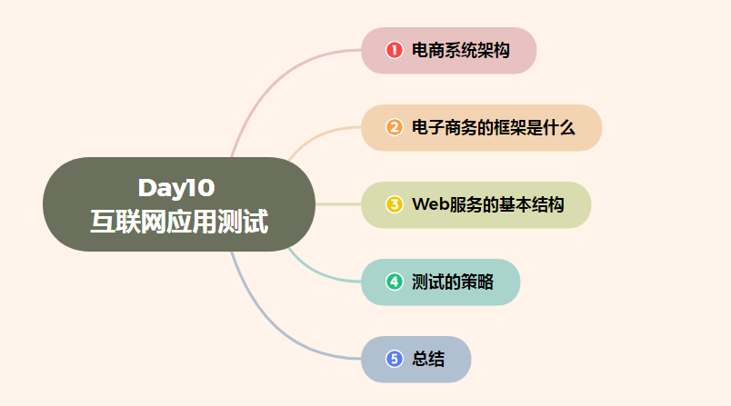

# Day10 互联网应用测试——电商架构、电子商务框架、测试的挑战、测试的策略、表示层测试、业务层测试、数据层测试

[TOC]

# 电商系统架构

## 电子商务系统包括哪几个组成部分

电子商务应用层结构（简称应用层）和支持应用实现的基础结构（三层），基础结构一般包括三个层次和两个支柱。

三个层次自下而上分别为网络层、传输层和服务层，两个支柱分别是安全协议与技术标准、公共政策与法律规范。前三个层次为基础层次，其上就是各种特定的电子商务应用，可见三个基础层次和两个支柱是电子商务应用的条件。**-电商系统架构**

因特网本身所具有的开放性、全球性、低成本、高效率的特点，也成为电子商务的内在特征，并使得电子商务大大超越了作为一种新的贸易形式所具有的价值，它不仅会改变企业本身的生产、经营、管理活动，而且将影响到整个社会的经济运行与结构。**-电商系统架构**

> 基础结构一般包括三个层次和两个支柱。
>
> 三个层次自下而上分别为网络层、传输层和服务层，两个支柱分别是安全协议与技术标准、公共政策与法律规范。

**扩展资料**

电子商务即使在各国或不同的领域有不同的定义，但其关键依然是依靠着电子设备和网络技术进行的商业模式，随着电子商务的高速发展，它已不仅仅包括其购物的主要内涵，还应包括了物流配送等附带服务等。

电子商务系统在Internet和其他网络的基础上，以实现企业电子商务活动的目标，满足企业生产、销售、服务等生产和管理的需要，支持企业的对外业务协作，从运作、管理和决策等层次全面提高企业信息化水平，为企业提供具备商业智能的计算机网络系统。**-电商系统架构**

## 电子商务的三层结构模型是什么

　　1、电子商务的三层结构模型，是指在客户端与数据库之间加入了一个“中间层”，也叫组件层。并不是指物理上的三层，不是简单地放置三台机器就是三层体系结构，也不仅仅有B/S应用才是三层体系结构。三层是指逻辑上的三层，即使这三个层放置到一台机器上。三层体系的应用程序将业务规则、数据访问、合法性校验等工作放到了中间层进行处理。通常情况下，客户端不直接与数据库进行交互，而是通过COM/DCOM通讯与中间层建立连接，再经由中间层与数据库进行交互。

　　2、1998年，SUN公司将电子商务体系结构被分解成表达层、应用（逻辑）层和数据层。
　　（1）表达层。表达层以Web服务器为基础，负责信息的发布，用于显示数据和接收用户输入的数据，为用户提供一种交互式操作的界面。
　　（2）应用层。应用层是系统架构中最体现核心架构的部分，处于数据层与表示层之间，起到了数据交换中承上启下的作用。根据分层的思想，对于数据层而言，应用层是调用者，对于表达层而言，应用层是被调用者，应用层负责体系架构中所有核心业务逻辑的处理。
　　（3）数据层。数据层的基础是DBMS，负责数据库的访问，可以访问数据库系统、二进制文件、文本文档或是XML文档。

## 电商组织架构及职责

总负责人：应该就是你
其余分成两个大板块
内容产出与内容发布两个板块
内容产出：

文案策划，1人！

推广物料，1人！

视频输出，1人！

这三个人主要负责拍摄剪辑文案编写页面制作软文编辑（就是内容产出）

广告投放1人，负责把制作出来的内容发布到对应内容平台上即可！

这就是最简单的配置！

## 电子商务系统由哪几部分组成

负荷均衡、事务管理、网站管理、数据管理、安全管理等。

1、负荷均衡

负荷均衡是指如何使电子商务系统服务器的处理能力和承受能力的压力保持均衡 。

负荷均衡还可以对服务器集群结构中的各个服务器性能进行动态调整和负荷分配。它使电子商务系统中硬件性能得到有效的均衡，避免特定的设备或系统软件由于压力过大而出现崩溃和拒绝服务的现象。这样在一定程度上能够提高系统的可靠性。

2、事务管理

电子商务系统支持的商务活动涉及到大量的联机事务处理OLTP和OLAP，这就要求系统具备很强的事务处理性能。事务管理的作用包括量方面，一是保证分布式环境下事务的完整性、一致性和原子性；二时缩短系统的响应时间，提高交易过程的实时性。

3、网站管理

网站是电子商务系统的客户服务接口，用于表达系统商务逻辑的处理结果。所以，在电子商务系统中，网站具有重要的地位。

4、数据管理

通常该部分利用支持WEB的数据库管理系统实现。但是与传统的DBMS相比，该部分与WEB的接口方式更加丰富，例如支持API、JDBC、ODBC等接口方式，而且对多媒体数据的支持能力更强。

除利用传统的DBMS实现数据管理外，目前也又一种做法是将WEB和DBMS更紧密的结合起来，构造所谓的WebDB。例如，在CA公司的产品Justme-I中，就将应用平台和数据库集成为一体。

5、安全管理

该部分为电子商务系统提供安全可靠的运行环境、防止或减少系统被攻击的可能、提高系统抗拒非法入侵或攻击的能力、保障联机交易过程的安全。

## 电子商务网站常用的系统架构哪些

**前台系统包括：**商品展示，内容展示，订单确认，支付系统，用户中心四大模块

**一. 商品展示**

- 站内搜索(搜索提示，搜索规则，搜索成功页，搜索不成功页，相似推荐)
- 导航(频道导航，其他导航如销售排行，广告位，推荐位，文字链，also buy等)
- 商品分类(品牌分类，品类分类，属性分类如剪裁形式)
- 登陆页(商品列表页，商品详细页，商品活动页)

**这里的访问逻辑是：**a /b/c分流消费者去往相对个性化的页面，由登陆页体现商家的核心诉求和价值传递，完成call-to-action的第一步。

**二. 内容展示：**内容展示较为简单，对纯购物品牌而言包括：

- 公告区
- 帮助中心
- 论坛(如需商城与论坛发生交互，则需自行开发，否则可集成discuz做同步登陆即可)

**三. 订单确认**

订单确认，就是帮助消费者正确提交订单信息的环节，看似简单，实则非常复杂，需要对很多信息逻辑判断和处理，一般由2个部分组成：

- 购物车
- 订单提交(返回购物车，收货地址&地址薄，支付方式判断，配送方式，发票，订单标记，实付金额计算等等)

**四. 支付系统**

与一般的想象不同，支付系统其实并不简单等于第三方支付工具接入：

- 外部支付系统(支付宝将接口，财付通接口，网银直联端口，信用卡分期端口)
- 内部支付系统(账户余额，积分，礼品卡，优惠券)

支付系统的逻辑设计不但需要考虑到各种极端情况的发生(如一张订单先用礼品卡，再用积分，最后网银支付)，还要预留财务做账所需的相关字段，并充分考虑订单取消之后如何回滚各类内部账户。

**五. 用户中心** 

用户中心的实质是用户自助功能的dashboard，一般4个部分组成：

- 注册&登陆(快速注册，完整注册，注册有礼，推荐注册，密码找回，主站id登陆，open-id登陆如qq，新浪微博等)
- 订单中心(历史订单状态，中间状态订单修改，物流追踪)
- 服务中心(各类自助服务如退款申请，退换货申请，建议与投诉等)
- 信息管理(用户基本信息管理和账户信息管理)

**后台系统包括：**商品&促销，crm，订单处理，wms，采购管理，财务管理，报表管理，系统设置，wa系统9大模块

**一. 商品&促销**

- 商品管理(品类管理，品牌管理，单品管理)
- 促销管理(活动管理和自定义活动模板管理)

在上述模块中，最重要的是2个部分：单品管理中的批量产品生成的自动程序和活动管理中“共享与互斥”管理。前者用于大幅提升上新速度，后者避免促销活动失控。

**二. crm ：**crm是对b2c核心资源—会员的管理，服务与再营销系统，包括如下部分：

- 会员管理(会员信息的增删改查和到其他系统的链接)
- 用户关怀(条件触发和人工触发相关edm &短信& ob)
- 定向营销(会员分组和营销活动管理)
- 客服管理(内容非常多，集成所有需前台与后台交互的功能，详情还是看图吧)
- 呼叫中心(ivr，坐席管理，统计报表，参数传递与窗口嵌入)

值得注意的，edm和短信通道市面上已经有成熟的外包服务商，一般都会外包；呼叫中心和在线客服自行开发成本太高，特别是呼叫中心系统，业务初期也都是外包的。

**三. 订单处理：**订单处理是在订单未正式进入仓储部门处理之前，对订单的前置性处理环节。

- 订单录入(电话订购，网上下单，外部团购订单，无金额订单录入如礼品单)
- 订单审核(自动审核和人工审核)
- rma处理(rma申请单和rma处理单)

**四. wms(warehouse management system仓库管理系统)**

- wms的流程很长，功能模块也很多，大致分为入库管理，库存管理，出库管理和票据管理4个模块四个模块

**五. 采购管理**

- 供应商管理(供应商信息管理，合同发票管理)
- 采购单管理(po单管理，负po单管理)
- 库存管理(库存查询，库存占用单，库存变动log)

**六 .财务管理：**b2c的财务管理，主要是对供应商，渠道和内部费用支出的成本控制。

- 供应商结算
- 渠道结算
- 配送结算
- 内部结算

**七. 报表管理：** 报表是b2c业务的宏观表现，理论上说，每个部门的kpi都应该从中找到。

- 搜索报表(站内搜索量查询)
- 销售报表(多个维度销量查询，优惠券使用情况，报表导出)
- 财务报表
- 客服报表(客服日报和坐席报表)，前者反映与消费者发生的日常交互(包括正常与异常)，后者考核客服的工作绩效
- 仓储物流报表，这几块报表，是业务运作的核心，涉及到公司机密，就不能写的太细了，见谅。

**八. 系统设置：**这块大家都知道是干嘛的，也就不多说了，分成三块。

- 基础设置(和业务有关的一些字段值)
- 权限设置(不同账号的操作权限和操作记录)
- 其他设置

**九. wa系统(web analytcis**)

网站分析系统，几乎全是外购，很少有能够自建的，即使自建，最多做几个简单的模块。用于实战的，要么是免费的ga(google analytics)，要么是昂贵的omniture。

# 电子商务的框架是什么

电子商务套件是电子商务时代，基于ERPII思想的管理软件，主要强调的是企业在整个产业链中的协同商务能力，以物流为基础，物流、信息流、资金流、商务流四流合一，串起ERP、SCM、CRM、DRP等企业信息化应用的各个部分，是电子商务套件的显著特征。目前主流的电子商务套，国外以Oracle11i为代表，国内以博科的Open9000为代表。
本文以国内外主流的电子商务套件为例，讲述电子商务套件的框架及设计理念。

## 一、产品框架

1、什么是电子商务套件

电子商务套件是旨在增强整个价值链竞争优势，采用基于活动管理的技术来评估各种业务流程，消除重复（即不增值）的活动；强调内部协作和外部协同；以物流管理为基础，功能涵盖ERP、CRM、SCM、DRP等企业信息化应用，同时支持企业间的协同商务。通过标准化的咨询、实施和服务，为企业分阶段快速部署行业化解决方案，在开放、集成的平台基础之上，可以灵活地满足用户个性的需求及企业业务不断变化的要求。
对于需要管理创新的中国企业来说，电子商务套件不单是软件产品，而是为企业引进一种先进的管理思想，导入一套成熟的经营管理模式、管理方法和手段。
2、电子商务套件应用框架

电子商务套件为企业信息化搭建起一个战略框架，在这个框架指导下，企业可以根据自身的实际需求迅速构筑信息平台，同时可以灵活、动态地、有效地管理，并实现电子化的商业事务处理的能力，使企业可以持续保持在IT投入上的竞争力，在提供的专业、贴身的服务下塑造自己的独特竞争优势。在这一灵活弹性的框架下，电子商务套件供应商给出了在供应市场、消费市场、资本市场、知识市场具体应用解决方案，体现了作业层、管理层和决策层等不同层次的应用，真正实现物流、资金流、信息流、商务流四流合一。实现了企业的集成管理，使企业产、供、销、人、财、物各个环节联结成一个紧密衔接的有机整体，同时也为进一步实现产业链级的协同商务提供了保证。

电子商务套件主要的应用框架特点：
◆ 全面集成、功能完整应用解决方案
◆ 弹性、灵活、可成长
◆ 开放的体系，集成第三方应用
◆ 基于价值链，面向电子商务及产业级协同商务
◆ 标准化服务、快速实施

3、子商务套件主要特点

电子商务套件针对不同企业的规模，不同企业的类型以及不同管理模式与管理流程，均能够实现功能可裁剪性、系统可配置性、流程可重构性、平台可移植性。

主要特点：

◆ 基于架构式平台技术，开放、集成，可成长
◆ 跨平台操作，支持多种大型数据库
◆ 先进的工作流技术，工作流程可自由定义
◆ 国际化应用，多语言、多币种及多会计制度
◆ 协同商务，实现全程物流管理
◆ OLAP技术，实现多维多点智能分析
◆ 全面的预算管理，完善的KPI绩效考核
◆ 支持多种生产管理模式，灵活的计划应变功能
◆ 全面电子化的实时企业内部审计
◆ 支持移动计算技术，实现移动商务

4、电子商务套件的主要功能部件

国外电子商务套件产品，以Oracle 11i为例，主要的功能部件或者模块包括：
◆ 市场营销
◆ 销售
◆ 服务
◆ 合同
◆ 财务
◆ 人力资源
◆ 供应链管理
◆ 定单管理
◆ 项目管理
◆ 采购
◆ 资产管理
◆ 生产制造
国内电子商务套件产品，以博科Open9000为例，主要的功能部件或者模块包括：
◆ 财务管理
◆ 生产制造
◆ 购销链管理
◆ 客户关系管理
◆ 物流配送系统
◆ 零售系统
◆ 工作流及知识管理
◆ 企业内审
◆ 集团管理
◆ 商业智能
◆ 企业信息门户

## 二、设计理念

电子商务套件的产品核心理念，主要包括：技术平台化，功能套件化，应用协同化。
以博科电子商务套件Open9000为例，产品理念的详细情况阐述如下：
1、技术平台化
架构式平台技术是企业级应用软件开发技术的一种趋势，博科的Open9000平台是基于软件构件技术，完全集成和开放的“通用对象化内核+客户端界面”体系架构（构件应用框架），是目前国内在技术上居于领先的，最具规模的大型企业管理平台。构件应用框架，它常是针对特定应用领域的，表示构件复用所需的软件结构架构，说明构件是如何组装成应用系统的，以及它们是如何相互交互的，框架既反映了一个应用领域共性的功能和基本的支撑服务，代表更大、更高层次的设计复用模式，另外，它又具备灵活性和可扩充性，允许客户根据特定应用需要，在一些可变的插入点上，接入所需特定功能的构件，进行客户化。“通用对象化内核”是一个群件化结构的用于数据处理的构件仓库，它包含了企业管理中各类基本业务内容和业务逻辑规则。在内核的基础上，针对不同行业企业处理的特点和需求，抽取不同的构件进行组合。
博科电子商务套件正是基于这一软件工程思想，基于这一平台技术实现的，并在此基础上快速孵化出各种行业版本的解决方案。
平台技术的优势：
◆ 可以使企业方便地、快速地、平滑地增加新的功能，新的构件同原有的构件可以集成在一起可靠地工作
◆ 可以特别灵活地、动态地重新配置，将一个构件替换为升级的新版本不必考虑对其它构件的适配
◆ 允许对给定的任务采用不同的软件开发供货商提供的软件，企业在实现它的解决方案时具有选择产品的充分自由
◆ 企业可以容易地、灵活地将为企业特别设计的构件与整个系统集成使用，从而实现企业的特殊需求
◆ 基于构件的解决方案能够为进一步方便地扩展系统功能提供方便，因为定制的构件的接口也可以由用户特殊构件的使用
2、功能套件化
对于ERP软件来说，集成是第一位的。由于国内管理软件起步较晚以及在产品发展规划方面缺乏远见，没有考虑到不同产品的集成，甚至依靠收购的方式来增加完善功能，结果导致用户在使用过程中形成了一个个信息孤岛，无法发挥信息整合的作用。同时用户可能面临对于相同的基础资料要分别维护，数据需要重复输入之类的问题，一方面带来无效劳动；另外为了得到想要的数据，不得不做大量的二次开发工作，这不但增加项目实施的难度，还会使预算大大超过计划。这些都给企业信息化设置了陷阱。
博科是国内第一家倡导套件概念的软件厂商，博科电子商务套件基于博科Open9000平台实现了大型企业应用程序的全面集成，其十一大功能部件涵盖了公司的前台和后台办公系统，不同的功能模块均能互连互通，还提供了无缝实时的商业智能。
3、应用协同化
企业运作效率越来越依赖于各部门、各类不同应用的协同，而不是单一部门、单一应用的水平。由于电子商务的出现，人们开始从单纯关注交易这一节点向关注商务全过程转移，这将使协作扩大到整个供应链上企业业务之间的协作。在企业内部，有各部门之间的业务协同、不同的业务指标和目标之间的协同以及各种资源约束的协同。如协同的生产管理能根据现有可调配的人力、物力和设备能力等资源进行优化排产，以便实现按期交货。而在企业之间，业务间的协同变得更为重要，也更难实现。在供应链上，企业为了满足客户和市场的需求，通常需要有三个层次的计划：需求计划、供应计划、满足需求计划，通过实施这三个计划来完成需求与供给的匹配，在相应执行层次上提供支持功能。

# web服务的基本结构

表示层：提供GUI（图形用户接口）
业务层：模拟业务流程，功能包括事务处理，用户身份鉴定，数据确认，程序日志等
数据层：存储供应用系统使用的或从最终用户收集来的数据

# 测试的挑战

1）用户群庞大且五花八门
2）业务环境，考虑业务场景
3）用户地点
4）安全性
5）测试环境
表示层，业务层和数据层测试的例子：
表示层：不同浏览器测试；检查图像以确保分辨率和大小正确；检查交互性操作的用户友好度和体验一致性；检查行业特定术语与风格使用
业务层：确保提出的响应时间，吞吐率等性能指标得到了满足；验证事务正确完成；确保失败事务回滚正确；确保正确采集数据
数据层：确保数据库操作满足性能要求；验证数据存储适当且正确；验证可使用当前备份来恢复；测试故障处理和冗余功能；测试数据加密和安全性；测试后端数据输入与管理功能的可用性和准确性

# 测试的策略

测试内容： 可用性/人机界面；性能；业务规则；事务准确性；数据的有效性与完整性；系统可靠性；网络结构

## 表示层的测试

1）内容测试：包括整体审美，字体，色彩，拼写，内容准确性和默认值
2）web站点结构：包含无效的连接或图片
3）用户环境：包含web浏览器版本和操作系统配置
如果应用高度依赖客户端的脚本处理，用户环境测试就变得更加复杂。每一个浏览器都有不同的脚本引擎或虚拟机在客户计算机上运行脚本和代码。如果使用了以下任意一项，就应特别关注浏览器的兼容性问题：ActiveX控件,HTML5,JavaScript,Adobe Flash,VBS cript,PHP,Java applets

## 业务层测试：

1）性能：测试目的在于检查应用系统是否满足书面的性能规格说明（通常定义为响应时间和吞吐率）
2）数据有效性：测试的目的在于发现从客户那里采集到的数据中的错误
3）事务：测试的目的在于发现事务处理过程中的错误

## 数据层测试：

1）响应实践：应量化结构化查询语言SQL语句的消耗时间
2）数据完整性：验证数据存储适当且正确
3）容错性和可恢复性：最大化MTBF，最小化MTTR（出错间隔时间长，恢复时间短），有故障处理机制

# 总结：

> 如果是走电商测试方向需要对本篇着重了解
>
> 个人学习推荐主要学习web服务的基本结构及后面的内容

