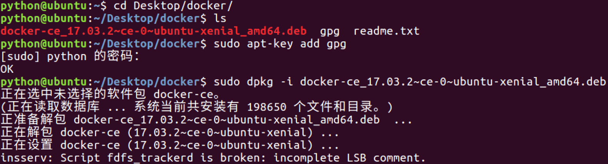
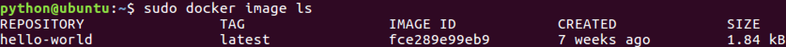
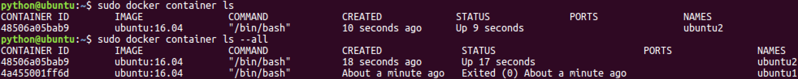
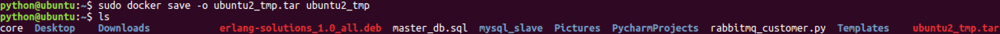

# Day100 Docker

## 什么是Docker?

**简介**：Docker是一个开源的引擎，可以轻松的为任何应用创建一个轻量级的、可移植的、自给自足的容器。开发者在笔记本上编译测试通过的容器可以批量地在生产环境中部署，包括VMs（虚拟机）、bare metal、OpenStack 集群和其他的基础应用平台。

Docker是一个开源的引擎，可以轻松的为任何应用创建一个轻量级的、可移植的、自给自足的容器。开发者在笔记本上编译测试通过的容器可以批量地在生产环境中部署，包括VMs（虚拟机）、 [bare metal](http://www.whatis.com.cn/word_5275.htm)、OpenStack 集群和其他的基础应用平台。 

#### Docker通常用于如下场景：

- web应用的自动化打包和发布；
- 自动化测试和持续集成、发布；
- 在服务型环境中部署和调整数据库或其他的后台应用；
- 从头编译或者扩展现有的OpenShift或Cloud Foundry平台来搭建自己的PaaS环境。

## 准备


**简介**：Docker系统有两个程序：docker服务端和docker客户端。其中docker服务端是一个服务进程，管理着所有的容器。

- [准备开始](https://www.docker.org.cn/book/docker/prepare-docker-5.html#0)
- [目标：](https://www.docker.org.cn/book/docker/prepare-docker-5.html#1)
- [提示：](https://www.docker.org.cn/book/docker/prepare-docker-5.html#2)
- [正确的命令：](https://www.docker.org.cn/book/docker/prepare-docker-5.html#3)

#### 准备开始

Docker系统有两个程序：docker服务端和docker客户端。其中docker服务端是一个服务进程，管理着所有的容器。docker客户端则扮演着docker服务端的远程控制器，可以用来控制docker的服务端进程。大部分情况下，docker服务端和客户端运行在一台机器上。

#### 目标：

检查docker的版本，这样可以用来确认docker服务在运行并可通过客户端链接。

#### 提示： 

可以通过在终端输入docker命令来查看所有的参数。

官网的在线模拟器只提供了有限的命令，无法保证所有的命令可以正确执行。

#### 正确的命令：

**$ docker version** **
**


**关键词** ：docker,version


## 搜索可用docker镜像


**简介**：这一步的目标是学会使用docker search命令来检索可用镜像。

- [搜索可用的docker镜像](https://www.docker.org.cn/book/docker/docker-search-image-6.html#0)
- [目标：](https://www.docker.org.cn/book/docker/docker-search-image-6.html#1)
- [提示：](https://www.docker.org.cn/book/docker/docker-search-image-6.html#2)
- [正确的命令：](https://www.docker.org.cn/book/docker/docker-search-image-6.html#3)

#### 搜索可用的docker镜像

使用docker最简单的方式莫过于从现有的容器镜像开始。Docker官方网站专门有一个页面来存储所有可用的镜像，网址是： [index.docker.io](http://index.docker.io/)。你可以通过浏览这个网页来查找你想要使用的镜像，或者使用命令行的工具来检索。

#### 目标：

学会使用命令行的工具来检索名字叫做tutorial的镜像。

#### 提示：

命令行的格式为：docker search 镜像名字

#### 正确的命令：

$ **docker search tutorial**

******
**


**关键词** ：docker,tutorial,docker中文手册

## 下载容器镜像


**简介**：学会使用docker pull命令下载一个镜像。

- [学会使用docker命令来下载镜像](https://www.docker.org.cn/book/docker/docker-download-image-7.html#0)
- [目标：](https://www.docker.org.cn/book/docker/docker-download-image-7.html#1)
- [提示：](https://www.docker.org.cn/book/docker/docker-download-image-7.html#2)
- [正确的命令：](https://www.docker.org.cn/book/docker/docker-download-image-7.html#3)

#### 学会使用docker命令来下载镜像

下载镜像的命令非常简单，使用docker pull命令即可。(译者按：docker命令和git有一些类似的地方）。在docker的镜像索引网站上面，镜像都是按照 **用户名/** **镜像名**的方式来存储的。有一组比较特殊的镜像，比如ubuntu这类基础镜像，经过官方的验证，值得信任，可以直接用 **镜像名**来检索到。

#### 目标：

通过docker命令下载tutorial镜像。

#### 提示：

执行pull命令的时候要写完整的名字，比如"learn/tutorial"。

#### 正确的命令：

$ **docker pull learn/tutorial**


## 在docker容器中运行hello world!

#### 在docker容器中运行hello world!

docker容器可以理解为在沙盒中运行的进程。这个沙盒包含了该进程运行所必须的资源，包括文件系统、系统类库、shell 环境等等。但这个沙盒默认是不会运行任何程序的。你需要在沙盒中运行一个进程来启动某一个容器。这个进程是该容器的唯一进程，所以当该进程结束的时候，容器也会完全的停止。

#### 目标：

在我们刚刚下载的镜像中输出"hello word"。为了达到这个目的，我们需要在这个容器中运行"echo"命令，输出"hello word"。

#### 提示：

docker run命令有两个参数，一个是镜像名，一个是要在镜像中运行的命令。

#### 正确的命令：

$ **docker run learn/tutorial echo "hello word"**


**关键词** ：docker,run


## 在容器中安装新的程序

**简介**：在docker容器中安装新的程序。

- [在容器中安装新的程序](https://www.docker.org.cn/book/docker/docker-install-package-9.html#0)
- [目标：](https://www.docker.org.cn/book/docker/docker-install-package-9.html#1)
- [提示：](https://www.docker.org.cn/book/docker/docker-install-package-9.html#2)
- [正确的命令：](https://www.docker.org.cn/book/docker/docker-install-package-9.html#3)

#### 在容器中安装新的程序

下一步我们要做的事情是在容器里面安装一个简单的程序(ping)。我们之前下载的tutorial镜像是基于ubuntu的，所以你可以使用ubuntu的apt-get命令来安装ping程序： **apt-get install -y ping**。

备注：apt-get 命令执行完毕之后，容器就会停止，但对容器的改动不会丢失。

#### 目标：

在learn/tutorial镜像里面安装ping程序。

#### 提示：

在执行apt-get 命令的时候，要带上-y参数。如果不指定-y参数的话，apt-get命令会进入交互模式，需要用户输入命令来进行确认，但在docker环境中是无法响应这种交互的。

#### 正确的命令：

**$docker run learn/tutorial apt-get install -y ping**


## 保存对容器的修改


**简介**：通过docker commit命令保存对容器的修改

- [保存对容器的修改](https://www.docker.org.cn/book/docker/docer-save-changes-10.html#0)
- [目标：](https://www.docker.org.cn/book/docker/docer-save-changes-10.html#1)
- [提示：](https://www.docker.org.cn/book/docker/docer-save-changes-10.html#2)
- [正确的命令：](https://www.docker.org.cn/book/docker/docer-save-changes-10.html#3)

#### 保存对容器的修改

当你对某一个容器做了修改之后（通过在容器中运行某一个命令），可以把对容器的修改保存下来，这样下次可以从保存后的最新状态运行该容器。docker中保存状态的过程称之为committing，它保存的新旧状态之间的区别，从而产生一个新的版本。

#### 目标：

首先使用 **docker ps -l**命令获得安装完ping命令之后容器的id。然后把这个镜像保存为learn/ping。

#### 提示：

\1. 运行docker commit，可以查看该命令的参数列表。

\2. 你需要指定要提交保存容器的ID。(译者按：通过docker ps -l 命令获得)

\3. 无需拷贝完整的id，通常来讲最开始的三至四个字母即可区分。（译者按：非常类似git里面的版本号)

#### 正确的命令：

$ **docker commit 698 learn/ping**


执行完docker commit命令之后，会返回新版本镜像的id号。


**关键词** ：docker保存修改,docker,commit


#### 行新的镜像

ok，到现在为止，你已经建立了一个完整的、自成体系的docker环境，并且安装了ping命令在里面。它可以在任何支持docker环境的系统中运行啦！(译者按：是不是很神奇呢？)让我们来体验一下吧！

#### 目标：

在新的镜像中运行ping www.google.com命令。

#### 提示：

一定要使用新的镜像名 **learn/ping**来运行ping命令。(译者按：最开始下载的learn/tutorial镜像中是没有ping命令的)

#### 正确的命令：

**$ docker run lean/ping ping www.google.com**

**
**


**关键词** ：docker镜像


#### 检查运行中的镜像

现在你已经运行了一个docker容器，让我们来看下正在运行的容器。

使用 docker ps命令可以查看所有正在运行中的容器列表，使用 docker inspect命令我们可以查看更详细的关于某一个容器的信息。

#### 目标：

查找某一个运行中容器的id，然后使用docker inspect命令查看容器的信息。

#### 提示：

可以使用镜像id的前面部分，不需要完整的id。

正确的命令：

$ **docker inspect efe**


**关键词** ：docker,inspect

- 


## 发布自己的镜像


**简介**：我们也可以把我们自己编译的镜像发布到索引页面，一方面可以自己重用，另一方面也可以分享给其他人使用。

- [发布docker镜像](https://www.docker.org.cn/book/docker/docker-push-image-13.html#0)
- [目标：](https://www.docker.org.cn/book/docker/docker-push-image-13.html#1)
- [提示：](https://www.docker.org.cn/book/docker/docker-push-image-13.html#2)
- [预期的命令：](https://www.docker.org.cn/book/docker/docker-push-image-13.html#3)

#### 发布docker镜像

现在我们已经验证了新镜像可以正常工作，下一步我们可以将其发布到官方的索引网站。还记得我们最开始下载的learn/tutorial镜像吧，我们也可以把我们自己编译的镜像发布到索引页面，一方面可以自己重用，另一方面也可以分享给其他人使用。

#### 目标：

把learn/ping镜像发布到docker的index网站。

#### 提示：

\1. docker images命令可以列出所有安装过的镜像。

\2. docker push命令可以将某一个镜像发布到官方网站。

\3. 你只能将镜像发布到自己的空间下面。这个模拟器登录的是learn帐号。

#### 预期的命令：

**$ docker push learn/ping**


**关键词** ：docker发布镜像,docker,push

# 容器化方案Docker

> 思考：
>
> - FastDFS的安装步骤非常的多，涉及的依赖包也很多，当新的机器需要安装FastDFS时，是否需要从头开始安装。
> - 我们在学习时拿到ubuntu系统的镜像，在VM虚拟机中运行这个镜像后，为什么就可以直接进行开发，而不需要重新搭建开发环境。
> - 在工作中，如何高效的保证开发人员写代码的开发环境与应用程序要部署的生产环境一致性。如果要部署一台新的机器，是否需要从头开始部署。
>
> 结论：
>
> - 上述思考的问题，都涉及到**相同的工作是否需要重复做**。
> - 避免相同的工作重复做是容器化技术应用之一。
>
> 容器化方案:
>
> - **Docker**
> - Docker的目标之一就是缩短代码从开发、测试到部署、上线运行的周期，让我们的应用程序具备可移植性、易于构建、并易于协作。

### 1. Docker介绍

- [Docker中文社区文档](http://www.docker.org.cn/index.html)

- Docker 是一个开源的软件部署解决方案。

- Docker 也是轻量级的应用容器框架。

- Docker 可以打包、发布、运行任何的应用。

- Docker 就像一个盒子，里面可以装很多物件，如果需要某些物件，可以直接将该盒子拿走，而不需要从该盒子中一件一件的取。

- Docker 是一个

  ```
  客户端-服务端(C/S)
  ```

  架构程序。

  - 客户端只需要向服务端发出请求，服务端处理完请求后会返回结果。

> Docker 包括三个基本概念:

- 镜像（Image）
  - Docker的镜像概念类似于虚拟机里的镜像，是一个只读的模板，一个独立的文件系统，包括运行容器所需的数据，可以用来创建新的容器。
  - 例如：一个镜像可以包含一个完整的 ubuntu 操作系统环境，里面仅安装了MySQL或用户需要的其它应用程序。
- 容器（Container）
  - Docker容器是由Docker镜像创建的运行实例，类似VM虚拟机，支持启动，停止，删除等。
  - 每个容器间是相互隔离的，容器中会运行特定的应用，包含特定应用的代码及所需的依赖文件。
- [仓库（Repository）](https://hub.docker.com/)
  - Docker的仓库功能类似于Github，是用于托管镜像的。

### 2. Docker安装（ubuntu 16.04）

> **1.源码安装Docker CE**

```bash
$ cd docker源码目录
$ sudo apt-key add gpg
$ sudo dpkg -i docker-ce_17.03.2~ce-0~ubuntu-xenial_amd64.deb
```



> **2.检查Docker CE是否安装正确**

```bash
$ sudo docker run hello-world
```

出现如下信息，表示安装成功


> **3.启动与停止**
>
> - 安装完成Docker后，默认已经启动了docker服务。

```bash
# 启动docker
$ sudo service docker start
# 重启docker
$ sudo service docker restart
# 停止docker
$ sudo service docker stop
```

### 3. Docker镜像操作

> **1.镜像列表**

```bash
$ sudo docker image ls
```



```
* REPOSITORY：镜像所在的仓库名称 
* TAG：镜像标签 
* IMAGEID：镜像ID 
* CREATED：镜像的创建日期(不是获取该镜像的日期) 
* SIZE：镜像大小
```

> **2.从仓库拉取镜像**

```bash
# 官方镜像
$ sudo docker image pull 镜像名称 或者 sudo docker image pull library/镜像名称
$ sudo docker image pull ubuntu 或者 sudo docker image pull library/ubuntu
$ sudo docker image pull ubuntu:16.04 或者 sudo docker image pull library/ubuntu:16.04

# 个人镜像
$ sudo docker image pull 仓库名称/镜像名称
$ sudo docker image pull itcast/fastdfs
```

  

> **3.删除镜像**

```bash
$ sudo docker image rm 镜像名或镜像ID
$ sudo docker image rm hello-world
$ sudo docker image rm fce289e99eb9
```


### 4. Docker容器操作

> **1.容器列表**

```bash
# 查看正在运行的容器
$ sudo docker container ls
# 查看所有的容器
$ sudo docker container ls --all
```



> **2.创建容器**

```bash
$ sudo docker run [option] 镜像名 [向启动容器中传入的命令]
常用可选参数说明：
* -i 表示以《交互模式》运行容器。
* -t 表示容器启动后会进入其命令行。加入这两个参数后，容器创建就能登录进去。即分配一个伪终端。
* --name 为创建的容器命名。
* -v 表示目录映射关系，即宿主机目录:容器中目录。注意:最好做目录映射，在宿主机上做修改，然后共享到容器上。 
* -d 会创建一个守护式容器在后台运行(这样创建容器后不会自动登录容器)。 
* -p 表示端口映射，即宿主机端口:容器中端口。
* --network=host 表示将主机的网络环境映射到容器中，使容器的网络与主机相同。
```

> **3.交互式容器**

```bash
$ sudo docker run -it --name=ubuntu1 ubuntu /bin/bash
```

 

```
在容器中可以随意执行linux命令，就是一个ubuntu的环境。
当执行 exit 命令退出时，该容器随之停止。
```

> **4.守护式容器**

```bash
# 开启守护式容器
$ sudo docker run -dit --name=ubuntu2 ubuntu
```


```bash
# 进入到容器内部交互环境
$ sudo docker exec -it 容器名或容器id 进入后执行的第一个命令
$ sudo docker exec -it ubuntu2 /bin/bash
```


```
如果对于一个需要长期运行的容器来说，我们可以创建一个守护式容器。
在容器内部执行 exit 命令退出时，该容器也随之停止。
```

> **5.停止和启动容器**

```bash
# 停止容器
$ sudo docker container stop 容器名或容器id
# kill掉容器
$ sudo docker container kill 容器名或容器id
# 启动容器
$ sudo docker container start 容器名或容器id
```


> **6.删除容器**
>
> - 正在运行的容器无法直接删除。

```bash
$ sudo docker container rm 容器名或容器id
```


> **7.容器制作成镜像**
>
> - 为保证已经配置完成的环境可以重复利用，我们可以将容器制作成镜像。

```bash
# 将容器制作成镜像
$ sudo docker commit 容器名 镜像名
```


```bash
# 镜像打包备份
$ sudo docker save -o 保存的文件名 镜像名
```



```bash
# 镜像解压
$ sudo docker load -i 文件路径/备份文件
```


本文将演示如何安装Docker，构建Docker镜像，以及如何使用Docker运行应用程序。

    随着云计算和DevOps的普及，容器技术已经成为了IT行业中的一个热门话题。容器技术是一种操作系统级别的虚拟化技术，它可以让开发者将应用程序及其依赖打包到一个可移植的容器中，从而实现快速部署、跨平台运行和弹性伸缩。
    
    从技术上来说，容器技术是基于Linux内核的一种虚拟化技术，它利用了Linux内核中的namespace、cgroup等特性，将应用程序与依赖打包到一个文件中，并且给出了相应的运行环境和限制条件。这样，任何支持容器技术的机器都可以运行这个容器，就像运行一个小型的虚拟机一样。不同的容器可以运行在同一个主机上，也可以分布部署在不同的主机上，实现了应用程序的隔离和运行环境的标准化。
    
    容器技术最大的优势是可以快速部署和启动应用程序，有效地解决了传统部署方式的“依赖地狱”问题。同时，容器技术还可以轻松实现弹性伸缩，只需要添加或删除容器即可实现应用程序的水平扩展，并最大化地利用资源。
    
    容器技术的发展历经了多年，现在有多种容器解决方案可供选择，如Docker、Kubernetes等。其中，Docker是目前最为流行的容器解决方案，它提供了完整的容器生命周期管理和持续集成/部署（CI/CD）工具链。Kubernetes则是一个开源的容器集群管理系统，它可以自动化地管理容器的调度、水平伸缩、负载均衡等操作。

1.安装Docker

首先，我们需要在Linux系统中安装Docker。以下是在Ubuntu系统上安装Docker的步骤：

$ sudo apt-get update
$ sudo apt-get install docker.io
安装完成后，我们可以运行以下命令来检查Docker是否已经成功安装：

$ sudo docker version
2.构建Docker镜像

一旦我们安装好了Docker，接下来就可以开始构建Docker镜像了。Docker镜像是一个可执行的软件包，它包含了应用程序和所有的依赖项。我们可以使用Dockerfile文件来定义如何构建Docker镜像。以下是一个示例Dockerfile文件

FROM ubuntu:latest
RUN apt-get update
RUN apt-get install -y nginx
CMD ["nginx", "-g", "daemon off;"]
这个Dockerfile文件定义了一个基于最新版Ubuntu操作系统的镜像，然后安装了Nginx Web服务器。最后，它定义了一个命令，以便在容器启动时运行Nginx服务器。现在我们可以使用以下命令来构建Docker镜像：

$ sudo docker build -t mynginx .
这个命令将会在当前目录下构建一个名为mynginx的Docker镜像。注意最后的"."表示当前目录。构建过程可能会花费一些时间，具体时间取决于镜像的大小和系统的性能。

3.运行Docker容器

一旦我们构建好了Docker镜像，接下来就可以运行Docker容器了。以下是一个示例命令：

$ sudo docker run -d -p 80:80 mynginx
这个命令将会在后台运行一个名为mynginx的容器，并将容器的80端口映射到主机的80端口。现在，我们可以在Web浏览器中打开http://localhost/,来查看Nginx服务器是否成功运行。

4.维护Docker容器

一旦我们运行了Docker容器，我们可能需要对容器进行一些维护工作。以下是一些常用的Docker容器管理命令：

列出所有正在运行的容器：

$ sudo docker ps
停止运行中的容器：

$ sudo docker stop <container_id>
启动已停止的容器：

$ sudo docker start <container_id>
删除容器：

$ sudo docker rm <container_id>
5.推送Docker镜像到仓库

一旦我们构建好了Docker镜像，我们可以将其推送到Docker镜像仓库，以便其他人可以使用它。

$ sudo docker login 
$ sudo docker tag mynginx <username>/mynginx 
$ sudo docker push <username>/mynginx
首先，我们需要使用docker login命令登录到Docker镜像仓库。然后，我们可以使用docker tag命令将本地的mynginx镜像标记为<username>/mynginx。最后，我们可以使用docker push命令将标记的镜像推送到Docker镜像仓库。

6.从仓库拉取Docker镜像

如果我们想要从Docker镜像仓库中拉取镜像，可以使用以下命令：

$ sudo docker pull <username>/mynginx
这个命令将会从Docker镜像仓库中拉取名为<username>/mynginx的镜像。

7.使用Docker Compose管理多个容

$ sudo docker-compose up -d
这个命令将会在后台启动两个容器，并将它们连接到同一个网络中。

总结
至此，一个简单的 Docker 应用就完成了搭建。当修改了代码之后，只需要重新运行构建镜像和启动容器的命令即可更新应用。
————————————————
版权声明：本文为CSDN博主「不鲁诺」的原创文章，遵循CC 4.0 BY-SA版权协议，转载请附上原文出处链接及本声明。
原文链接：https://blog.csdn.net/sendohlib/article/details/130344544


# 详解Docker！

[大侠学Python](javascript:void(0);) *2023-07-10 13:30* *发表于江苏*

来源丨网络


本次分享Docker学习教程，有点长～

目录


> **1 容器简介**
> 1.1 什么是 Linux 容器
> 1.2 容器不就是虚拟化吗
> 1.3 容器发展简史
> **2 什么是 Docker？**
> 2.1 Docker 如何工作？
> 2.2 Docker 技术是否与传统的 Linux 容器相同？
> 2.3 docker的目标
> **3 安装Docker
> **3.1 Docker基础命令操作
> 3.2 启动第一个容器
> 3.3 Docker镜像生命周期
> **4 docker镜像相关操作
> **4.1 搜索官方仓库镜像
> 4.2 获取镜像
> 4.3 导出镜像
> 4.4 删除镜像
> 4.5 导入镜像
> 4.6 查看镜像的详细信息
> **5 容器的日常管理
> **5.1 容器的起/停
> 5.2 进入容器方法
> 5.3 删除所有容器
> 5.4 启动时进行端口映射
> 6 Docker 数据卷的管理
> 6.1 挂载时创建卷
> 6.2 创建卷后挂载
> 6.3 手动将容器保存为镜像
> **7 Dockerfile自动构建docker镜像
> **7.1 Dockerfile指令集
> 7.2 创建一个Dockerfile
> 7.3 使用Dcokerfile安装kodexplorer
> **8 Docker中的镜像分层
> **8.1 Docker 镜像为什么分层
> 8.2 可写的容器层
> 8.3 容器层的细节说明
> **9 使用docker运行zabbix-server
> **9.1 容器间的互联
> 9.2 启动zabbix容器
> 9.3 关于zabbix API
> **10 docker 仓库（registry）**
> 10.1 创建一个普通仓库
> 10.2 带basic认证的仓库
> **11 docker-compose编排工具
> **11.1 安装docker-compose
> 11.2 编排启动镜像
> 11.3 haproxy代理后端docker容器
> 11.4 安装socat 直接操作socket控制haproxy
> **12 重启docker服务，容器全部退出的解决办法
> **12.1 在启动是指定自动重启
> 12.2 修改docker默认配置文件
> **13 Docker网络类型
> **13.1 docker的网络类型
> 13.2 不为容器配置网络功能
> 13.3 与其他容器共享网络配置(Container）
> 13.4 使用宿主机网络
> 13.5 查看网络列表
> 13.6 用PIPEWORK为docker容器配置独立IP
> 13.7 Docker跨主机通信之macvlan
> **14 docker企业级镜像仓库harbor
> **14.1 使用容器的建议
> 14.2 关于Docker容器的监控
> **15 参考文献
> **

## 1 容器简介

### 1.1 什么是 Linux 容器

Linux容器是与系统其他部分隔离开的一系列进程，从另一个镜像运行，并由该镜像提供支持进程所需的全部文件。容器提供的镜像包含了应用的所有依赖项，因而在从开发到测试再到生产的整个过程中，它都具有可移植性和一致性。


> - 更加详细地来说，请您假定您在开发一个应用。您使用的是一台笔记本电脑，而且您的开发环境具有特定的配置。其他开发人员身处的环境配置可能稍有不同。您正在开发的应用依赖于您当前的配置，还要依赖于某些特定文件。与此同时，您的企业还拥有标准化的测试和生产环境，且具有自身的配置和一系列支持文件。您希望尽可能多在本地模拟这些环境，而不产生重新创建服务器环境的开销。
> - 因此，您要如何确保应用能够在这些环境中运行和通过质量检测，并且在部署过程中不出现令人头疼的问题，也无需重新编写代码和进行故障修复？答案就是使用容器。容器可以确保您的应用拥有必需的配置和文件，使得这些应用能够在从开发到测试、再到生产的整个流程中顺利运行，而不出现任何不良问题。这样可以避免危机，做到皆大欢喜。

虽然这只是简化的示例，但在需要很高的可移植性、可配置性和隔离的情况下，我们可以利用 Linux 容器通过很多方式解决难题。无论基础架构是在企业内部还是在云端，或者混合使用两者，容器都能满足您的需求。

### 1.2 容器不就是虚拟化吗

是，但也不竟然。我们用一种简单方式来思考一下：

虚拟化使得许多操作系统可同时在单个系统上运行。

容器则可共享同一个操作系统内核，将应用进程与系统其他部分隔离开。

图-普通虚拟化技术和Docker的对比

这意味着什么？首先，让多个操作系统在单个虚拟机监控程序上运行以实现虚拟化，并不能达成和使用容器同等的轻量级效果。事实上，在仅拥有容量有限的有限资源时，您需要能够可以进行密集部署的轻量级应用。Linux 容器可从单个操作系统运行，在所有容器中共享该操作系统，因此应用和服务能够保持轻量级，并行快速运行。

### 1.3 容器发展简史


我们现在称为容器技术的概念最初出现在 2000 年，当时称为 FreeBSD jail，这种技术可将 FreeBSD 系统分区为多个子系统（也称为 Jail）。Jail 是作为安全环境而开发的，系统管理员可与企业内部或外部的多个用户共享这些 Jail。

Jail 的目的是让进程在经过修改的 *chroot* 环境中创建，而不会脱离和影响整个系统 — 在 chroot 环境中，对文件系统、网络和用户的访问都实现了虚拟化。尽管 Jail 在实施方面存在局限性，但最终人们找到了脱离这种隔离环境的方法。

但这个概念非常有吸引力。

2001 年，通过 Jacques Gélinas 的 VServer 项目，隔离环境的实施进入了 Linux 领域。正如 Gélinas 所说，这项工作的目的是“在高度独立且安全的单一环境中运行多个通用 Linux 服务器 [sic]。” 在完成了这项针对 Linux 中多个受控制用户空间的基础性工作后，Linux 容器开始逐渐成形并最终发展成了现在的模样。

## 2 什么是 Docker？

“Docker” 一词指代多种事物，包括开源社区项目、开源项目使用的工具、主导支持此类项目的公司 Docker Inc. 以及该公司官方支持的工具。技术产品和公司使用同一名称，的确让人有点困惑。

我们来简单说明一下：

> - IT 软件中所说的 “Docker” ，是指容器化技术，用于支持创建和使用 Linux 容器。
> - 开源 Docker 社区致力于改进这类技术，并免费提供给所有用户，使之获益。
> - Docker Inc. 公司凭借 Docker 社区产品起家，它主要负责提升社区版本的安全性，并将改进后的版本与更广泛的技术社区分享。此外，它还专门对这些技术产品进行完善和安全固化，以服务于企业客户。

借助 Docker ，您可将容器当做重量轻、模块化的虚拟机使用。同时，您还将获得高度的灵活性，从而实现对容器的高效创建、部署及复制，并能将其从一个环境顺利迁移至另一个环境。

### 2.1 Docker 如何工作？

Docker 技术使用 Linux 内核和内核功能（例如 *Cgroups* *和 namespaces*）来分隔进程，以便各进程相互独立运行。这种独立性正是采用容器的目的所在；它可以独立运行多种进程、多个应用程序，更加充分地发挥基础设施的作用，同时保持各个独立系统的安全性。

容器工具（包括 Docker）可提供基于镜像的部署模式。这使得它能够轻松跨多种环境，与其依赖程序共享应用或服务组。Docker 还可在这一容器环境中自动部署应用程序（或者合并多种流程，以构建单个应用程序）。

此外，由于这些工具基于 Linux 容器构建，使得 Docker 既易于使用，又别具一格 —— 它可为用户提供前所未有的高度应用程访问权限、快速部署以及版本控制和分发能力。

### 2.2 Docker 技术是否与传统的 Linux 容器相同？

否。Docker 技术最初是基于 LXC 技术构建（大多数人都会将这一技术与“传统的” Linux 容器联系在一起），但后来它逐渐摆脱了对这种技术的依赖。

就轻量级虚拟化这一功能来看，LXC 非常有用，但它无法提供出色的开发人员或用户体验。除了运行容器之外，Docker 技术还具备其他多项功能，包括简化用于构建容器、传输镜像以及控制镜像版本的流程。


传统的 Linux 容器使用 init 系统来管理多种进程。这意味着，所有应用程序都作为一个整体运行。与此相反，Docker 技术鼓励应用程序各自独立运行其进程，并提供相应工具以实现这一功能。这种精细化运作模式自有其优势。

### 2.3 docker的目标

docker的主要目标是"Build,Ship and Run any App,Angwhere",构建，运输，处处运行

**构建**：做一个docker镜像

**运输**：docker pull

**运行**：启动一个容器

每一个容器，他都有自己的文件系统rootfs.

## 3 安装Docker

环境说明

```
# 需要两台几点进行安装
[root@docker01 ~]# cat /etc/redhat-release 
CentOS Linux release 7.2.1511 (Core) 
[root@docker01 ~]# uname  -r 
3.10.0-327.el7.x86_64
[root@docker01 ~]# hostname -I
10.0.0.100172.16.1.100
[root@docker02 ~]# hostname -I
10.0.0.101172.16.1.101
```

在**两个节点**上都进行操作

```
wget -O /etc/yum.repos.d/docker-ce.repo https://mirrors.ustc.edu.cn/docker-ce/linux/centos/docker-ce.repo
sed -i 's#download.docker.com#mirrors.ustc.edu.cn/docker-ce#g' /etc/yum.repos.d/docker-ce.repo
yum install docker-ce -y
```

修改在`docker01`配置：

```
# 修改启动文件，监听远程端口
vim /usr/lib/systemd/system/docker.service
ExecStart\=/usr/bin/dockerd -H unix:///var/run/docker.sock -H tcp://10.0.0.100:2375 
systemctl daemon\-reload
systemctl enable docker.service 
systemctl restart docker.service 
# ps -ef检查进行，是否启动
```

在`docker02`测试

```
[root@docker02 ~]# docker -H 10.0.0.100 info
Containers: 0
 Running: 0
 Paused: 0
 Stopped: 0
Images: 0
Server Version: 17.12.0-ce
Storage Driver: devicemapper
···
```

### 3.1 Docker基础命令操作

查看docker相关信息

```
[root@docker01 ~]#  docker version  
Client:
 Version:    17.12.0-ce
 API version:    1.35
 Go version:    go1.9.2
 Git commit:    c97c6d6
 Built:    Wed Dec 2720:10:142017
 OS/Arch:    linux/amd64
Server:
 Engine:
  Version:    17.12.0-ce
  API version:    1.35 (minimum version 1.12)
  Go version:    go1.9.2
  Git commit:    c97c6d6
  Built:    Wed Dec 2720:12:462017
  OS/Arch:    linux/amd64
  Experimental:    false
```

配置docker镜像加速

```
vi /etc/docker/daemon.json
{ "registry-mirrors": ["https://registry.docker-cn.com"]
}
```

### 3.2 启动第一个容器

```
[root@docker01 ~]# docker run -d -p 80:80 nginx
Unable to find image 'nginx:latest' locally
latest: Pulling from library/nginx
e7bb522d92ff: Pull complete 
6edc05228666: Pull complete 
cd866a17e81f: Pull complete 
Digest: sha256:285b49d42c703fdf257d1e2422765c4ba9d3e37768d6ea83d7fe2043dad6e63d
Status: Downloaded newer image for nginx:latest
8d8f81da12b5c10af6ba1a5d07f4abc041cb95b01f3d632c3d638922800b0b4d 
# 容器启动后，在浏览器进行访问测试
```

参数说明

| **参数**  | **说明**           |
| --------- | ------------------ |
| **run**   | 创建并运行一个容器 |
| **-d**    | 放入后台           |
| **-p**    | 端口映射           |
| **nginx** | 镜像名称           |

### 3.3 Docker镜像生命周期


## 4 docker镜像相关操作

### 4.1 搜索官方仓库镜像

```
[root@docker01 ~]#  docker search centos
NAME                      DESCRIPTION                    STARS    OFFICIAL               AUTOMATED
centos                    The official build of CentOS.  3992     [OK]      
ansible/centos7-ansible   Ansible on Centos7             105
```

列表说明

| **参数**        | **说明**         |
| --------------- | ---------------- |
| **NAME**        | 镜像名称         |
| **DESCRIPTION** | 镜像说明         |
| **STARS**       | 点赞数量         |
| **OFFICIAL**    | 是否是官方的     |
| **AUTOMATED**   | 是否是自动构建的 |

### 4.2 获取镜像

根据镜像名称拉取镜像

```
[root@docker01 ~]# docker pull centos
Using default tag: latest
latest: Pulling from library/centos
af4b0a2388c6: Downloading  34.65MB/73.67MB
```

查看当前主机镜像列表

```
[root@docker01 ~]# docker image list 
REPOSITORY          TAG                 IMAGE ID            CREATED             SIZE
centos              latest              ff426288ea90        3 weeks ago         207MB
nginx               latest              3f8a4339aadd        5 weeks ago         108MB
```

拉第三方镜像方法

```
docker pull index.tenxcloud.com/tenxcloud/httpd
```

### 4.3 导出镜像

```
[root@docker01 ~]# docker image list 
REPOSITORY          TAG                 IMAGE ID            CREATED             SIZE
centos              latest              ff426288ea90        3 weeks ago         207MB
nginx               latest              3f8a4339aadd        5 weeks ago         108MB
# 导出
[root@docker01 ~]# docker image save centos > docker-centos.tar.gz
```

### 4.4 删除镜像

```
[root@docker01 ~]# docker image rm centos:latest
[root@docker01 ~]# docker image list 
REPOSITORY          TAG                 IMAGE ID            CREATED             SIZE
nginx               latest              3f8a4339aadd        5 weeks ago         108MB
```

### 4.5 导入镜像

```
[root@docker01 ~]# docker image load -i docker-centos.tar.gz  
e15afa4858b6: Loading layer  215.8MB/215.8MB
Loaded image: centos:latest
[root@docker01 ~]# docker image list 
REPOSITORY          TAG                 IMAGE ID            CREATED             SIZE
centos              latest              ff426288ea90        3 weeks ago         207MB
nginx               latest              3f8a4339aadd        5 weeks ago         108MB
```

### 4.6 查看镜像的详细信息

```
[root@docker01 ~]# docker image inspect centos
```

## 5 容器的日常管理

### 5.1 容器的起/停

最简单的运行一个容器

```
[root@docker01 ~]# docker run nginx
```

创建容器，两步走（不常用）

```
[root@docker01 ~]# docker create centos:latest  /bin/bash
bb7f32368ecf0492adb59e20032ab2e6cf6a563a0e6751e58930ee5f7aaef204
[root@docker01 ~]# docker start stupefied_nobel
stupefied_nobel
```

快速启动容器方法

```
[root@docker01 ~]# docker run  centos:latest  /usr/bin/sleep 20;
```

**容器内的第一个进程必须一直处于运行的状态，否则这个容器，就会处于退出状态！**

查看正在运行的容器

```
[root@docker01 ~]# docker container ls
    或
[root@docker01 ~]# docker ps 
CONTAINER ID        IMAGE               COMMAND                  CREATED             STATUS              PORTS               NAMES
8708e93fd767        nginx               "nginx -g 'daemon of…"6 seconds ago       Up 4 seconds        80/tcp              keen_lewin
```

查看你容器详细信息/ip

```
[root@docker01 ~]# docker container  inspect  容器名称/id
```

查看你所有容器（包括未运行的）

```
root@docker01 ~]# docker ps -a
CONTAINER ID        IMAGE               COMMAND                  CREATED             STATUS                      PORTS               NAMES
8708e93fd767        nginx               "nginx -g 'daemon of…"4minutes ago       Exited (0) 59 seconds ago                       keen_lewin
f9f3e6af7508        nginx               "nginx -g 'daemon of…"   5 minutes ago       Exited (0) 5 minutes ago                        optimistic_haibt
8d8f81da12b5        nginx               "nginx -g 'daemon of…"   3 hours ago         Exited (0) 3 hours ago                          lucid_bohr
```

停止容器

```
[root@docker01 ~]# docker stop 容器名称/id 
或
[root@docker01 ~]# docker container  kill  容器名称/id
```

### 5.2 进入容器方法

**启动时进去方法**

```
[root@docker01 ~]# docker run -it #参数：-it 可交互终端
[root@docker01 ~]# docker run -it nginx:latest  /bin/bash
root@79241093859e:/#
```

退出/离开容器

```
1 | ctrl+p & ctrl+q
```

**启动后进入容器的方法**

启动一个docker

```
[root@docker01 ~]# docker run -it centos:latest 
[root@1bf0f43c4d2f /]# ps -ef 
UID         PID   PPID  C STIME TTY          TIME CMD
root          10015:47 pts/000:00:00 /bin/bash
root         131015:47 pts/000:00:00 ps -ef
```

attach进入容器，使用pts/0 ，会让所用通过此方法进如放入用户看到同样的操作。

```
[root@docker01 ~]# docker attach 1bf0f43c4d2f
[root@1bf0f43c4d2f /]# ps -ef 
UID         PID   PPID  C STIME TTY          TIME CMD
root          10015:47 pts/000:00:00 /bin/bash
root         141015:49 pts/000:00:00 ps -ef
```

自命名启动一个容器 --name

```
[root@docker01 ~]# docker attach 1bf0f43c4d2f
[root@1bf0f43c4d2f /]# ps -ef 
UID         PID   PPID  C STIME TTY          TIME CMD
root          10015:47 pts/000:00:00 /bin/bash
root         141015:49 pts/000:00:00 ps -ef
```

**exrc 进入容器方法（推荐使用）**

```
[root@docker01 ~]# docker exec -it clsn1  /bin/bash 
[root@b20fa75b4b40 /]# 重新分配一个终端
[root@b20fa75b4b40 /]# ps -ef 
UID         PID   PPID  C STIME TTY          TIME CMD
root          10016:11 pts/000:00:00 /bin/bash
root         130016:14 pts/100:00:00 /bin/bash
root         2613016:14 pts/100:00:00 ps -ef
```

### 5.3 删除所有容器

```
[root@docker01 ~]# docker rm -f  `docker ps -a -q`
# -f 强制删除
```

### 5.4 启动时进行端口映射

-p参数端口映射

```
[root@docker01 ~]# docker run -d -p 8888:80  nginx:latest 
287bec5c60263166c03e1fc5b0b8262fe76507be3dfae4ce5cd2ee2d1e8a89a9
```

不同指定映射方法

| **参数**                          | **说明**                           |
| --------------------------------- | ---------------------------------- |
| **-p hostPort:containerPort**     | 端口映射 -p 8080:80                |
| **-p ip:hostPort:containerPort**  | 配置监听地址 -p 10.0.0.100:8080:80 |
| **-p ip::containerPort**          | 随机分配端口 -p 10.0.0.100::80     |
| **-p hostPort:containerPort:udp** | 指定协议 -p 8080:80:tcp            |
| **-p 81:80 –p 443:443**           | 指定多个                           |

随机映射

```
docker run -P （大P）# 需要镜像支持
```

## 6 Docker 数据卷的管理

### 6.1 挂载时创建卷

挂载卷

```
[root@docker01 ~]# docker run -d -p 80:80 -v /data:/usr/share/nginx/html nginx:latest
079786c1e297b5c5031e7a841160c74e91d4ad06516505043c60dbb78a259d09
```

容器内站点目录: /usr/share/nginx/html

在宿主机写入数据，查看

```
[root@docker01 ~]# echo "http://www.nmtui.com" >/data/index.html
[root@docker01 ~]# curl 10.0.0.100
http://www.nmtui.com
```

设置共享卷，使用同一个卷启动一个新的容器

```
[root@docker01 ~]# docker run -d -p 8080:80 -v /data:/usr/share/nginx/html nginx:latest 
351f0bd78d273604bd0971b186979aa0f3cbf45247274493d2490527babb4e42
[root@docker01 ~]# curl 10.0.0.100:8080
http://www.nmtui.com
```

查看卷列表

```
[root@docker01 ~]# docker volume ls
DRIVER              VOLUME NAME
```

### 6.2 创建卷后挂载

创建一个卷

```
[root@docker01 ~]# docker volume create 
f3b95f7bd17da220e63d4e70850b8d7fb3e20f8ad02043423a39fdd072b83521
[root@docker01 ~]# docker volume ls 
DRIVER              VOLUME NAME
local               f3b95f7bd17da220e63d4e70850b8d7fb3e20f8ad02043423a39fdd072b83521
```

指定卷名

```
[root@docker01 ~]# docker volume ls 
DRIVER              VOLUME NAME
local               clsn
local               f3b95f7bd17da220e63d4e70850b8d7fb3e20f8ad02043423a39fdd072b83521
```

查看卷路径

```
[root@docker01 ~]# docker volume inspect clsn 
[
    {
        "CreatedAt": "2018-02-01T00:39:25+08:00",
        "Driver": "local",
        "Labels": {},
        "Mountpoint": "/var/lib/docker/volumes/clsn/_data",
        "Name": "clsn",
        "Options": {},
        "Scope": "local"
    }
]
```

使用卷创建

```
[root@docker01 ~]# docker run -d -p 9000:80 -v clsn:/usr/share/nginx/html nginx:latest 
1434559cff996162da7ce71820ed8f5937fb7c02113bbc84e965845c219d3503
# 宿主机测试
[root@docker01 ~]# echo 'blog.nmtui.com' >/var/lib/docker/volumes/clsn/_data/index.html 
[root@docker01 ~]# curl 10.0.0.100:9000
blog.nmtui.com
```

设置卷

```
[root@docker01 ~]# docker run  -d  -P  --volumes-from 079786c1e297 nginx:latest 
b54b9c9930b417ab3257c6e4a8280b54fae57043c0b76b9dc60b4788e92369fb
```

查看使用的端口

```
[root@docker01 ~]# netstat -lntup 
Active Internet connections (only servers)
Proto Recv-Q Send-Q Local Address           Foreign Address         State       PID/Program name    
tcp        0      0 0.0.0.0:22              0.0.0.0:*               LISTEN      1400/sshd           
tcp        0      0 10.0.0.100:2375         0.0.0.0:*               LISTEN      26218/dockerd       
tcp6       0      0 :::9000                 :::*                    LISTEN      32015/docker-proxy  
tcp6       0      0 :::8080                 :::*                    LISTEN      31853/docker-proxy  
tcp6       0      0 :::80                   :::*                    LISTEN      31752/docker-proxy  
tcp6       0      0 :::22                   :::*                    LISTEN      1400/sshd           
tcp6       0      0 :::32769                :::*                    LISTEN      32300/docker-proxy  
[root@docker01 ~]# curl 10.0.0.100:32769
http://www.nmtui.com
```

### 6.3 手动将容器保存为镜像

本次是基于docker官方centos 6.8 镜像创建

官方镜像列表：https://hub.docker.com/explore/

启动一个centos6.8的镜像

```
[root@docker01 ~]# docker pull  centos:6.8
[root@docker01 ~]# docker run -it -p 1022:22 centos:6.8  /bin/bash
# 在容器种安装sshd服务，并修改系统密码
[root@582051b2b92b ~]# yum install  openssh-server -y 
[root@582051b2b92b ~]# echo "root:123456" |chpasswd
[root@582051b2b92b ~]#  /etc/init.d/sshd start
```

启动完成后镜像ssh连接测试

将容器提交为镜像

```
[root@docker01 ~]# docker commit brave_mcclintock  centos6-ssh
```

使用新的镜像启动容器

```
[root@docker01 ~]# docker run -d  -p 1122:22  centos6-ssh:latest  /usr/sbin/sshd -D 
5b8161fda2a9f2c39c196c67e2eb9274977e7723fe51c4f08a0190217ae93094
```

在容器安装httpd服务

```
[root@5b8161fda2a9 /]#  yum install httpd -y
```

编写启动脚本脚本

```
[root@5b8161fda2a9 /]# cat  init.sh 
#!/bin/bash 
/etc/init.d/httpd start 
/usr/sbin/sshd -D
[root@5b8161fda2a9 /]# chmod +x init.sh 
# 注意执行权限
```

# 注意执行权限

再次提交为新的镜像

```
[root@docker01 ~]# docker commit  5b8161fda2a9 centos6-httpd 
sha256:705d67a786cac040800b8485cf046fd57b1828b805c515377fc3e9cea3a481c1
```

启动镜像，做好端口映射。并在浏览器中测试访问

```
[root@docker01 ~]# docker run -d -p 1222:22 -p 80:80  centos6-httpd /init.sh 
46fa6a06644e31701dc019fb3a8c3b6ef008d4c2c10d46662a97664f838d8c2c
```

## 7 Dockerfile自动构建docker镜像

官方构建dockerffile文件参考:https://github.com/CentOS/CentOS-Dockerfiles

### 7.1 Dockerfile指令集

dockerfile主要组成部分：

> ```
>  基础镜像信息 FROM centos:6.8
> 
>  制作镜像操作指令RUN yum insatll openssh-server \-y
> 
>  容器启动时执行指令 CMD \["/bin/bash"\]
> ```

dockerfile常用指令：

> ```
>  FROM 这个镜像的妈妈是谁？（指定基础镜像）
> 
>  MAINTAINER 告诉别人，谁负责养它？（指定维护者信息，可以没有）
> 
>  RUN 你想让它干啥（在命令前面加上RUN即可）
> 
>  ADD 给它点创业资金（COPY文件，会自动解压）
> 
>  WORKDIR 我是cd,今天刚化了妆（设置当前工作目录）
> 
>  VOLUME 给它一个存放行李的地方（设置卷，挂载主机目录）
> 
>  EXPOSE 它要打开的门是啥（指定对外的端口）
> 
>  CMD 奔跑吧，兄弟！（指定容器启动后的要干的事情）
> ```

dockerfile其他指令：

> ```
> COPY 复制文件
> 
> ENV  环境变量
> 
> ENTRYPOINT  容器启动后执行的命令
> ```

### 7.2 创建一个Dockerfile

创建第一个Dockerfile文件

```
# 创建目录
[root@docker01 base]# cd /opt/base
# 创建Dcokerfile文件，注意大小写
[root@docker01 base]# vim Dockerfile
FROM centos:6.8
RUN yum install openssh-server -y 
RUN echo "root:123456" |chpasswd
RUN /etc/init.d/sshd start 
CMD ["/usr/sbin/sshd","-D"]
```

构建docker镜像

```
[root@docker01 base]# docker image build  -t centos6.8-ssh . 
-t 为镜像标签打标签  . 表示当前路径
```

使用自构建的镜像启动

```
[root@docker01 base]# docker run  -d -p 2022:22 centos6.8-ssh-b 
dc3027d3c15dac881e8e2aeff80724216f3ac725f142daa66484f7cb5d074e7a
```

### 7.3 使用Dcokerfile安装kodexplorer

Dockerfile文件内容

```
FROM centos:6.8
RUN yum install wget unzip php php-gd php-mbstring -y && yum clean all
# 设置工作目录，之后的操作都在这个目录中
WORKDIR /var/www/html/
RUN wget -c http://static.kodcloud.com/update/download/kodexplorer4.25.zip
RUN unzip kodexplorer4.25.zip && rm -f kodexplorer4.25.zip
RUN chown -R apache.apache .
CMD ["/usr/sbin/apachectl","-D","FOREGROUND"]
```

更多的Dockerfile可以参考官方方法。

## 8 Docker中的镜像分层

参考文档：http://www.maiziedu.com/wiki/cloud/dockerimage

Docker 支持通过扩展现有镜像，创建新的镜像。实际上，Docker Hub 中 99% 的镜像都是通过在 base 镜像中安装和配置需要的软件构建出来的。

' fill='%23FFFFFF'%3E%3Crect x='249' y='126' width='1' height='1'%3E%3C/rect%3E%3C/g%3E%3C/g%3E%3C/svg%3E)

从上图可以看到，新镜像是从 base 镜像一层一层叠加生成的。每安装一个软件，就在现有镜像的基础上增加一层。

### 8.1 Docker 镜像为什么分层

镜像分层最大的一个好处就是共享资源。

比如说有多个镜像都从相同的 base 镜像构建而来，那么 Docker Host 只需在磁盘上保存一份 base 镜像；同时内存中也只需加载一份 base 镜像，就可以为所有容器服务了。而且镜像的每一层都可以被共享。

如果多个容器共享一份基础镜像，当某个容器修改了基础镜像的内容，比如 /etc 下的文件，这时其他容器的 /etc 是不会被修改的，修改只会被限制在单个容器内。这就是容器 **Copy-on-Write** 特性。

### 8.2 可写的容器层

当容器启动时，一个新的可写层被加载到镜像的顶部。这一层通常被称作“容器层”，“容器层”之下的都叫“镜像层”。

' fill='%23FFFFFF'%3E%3Crect x='249' y='126' width='1' height='1'%3E%3C/rect%3E%3C/g%3E%3C/g%3E%3C/svg%3E)

所有对容器的改动 - 无论添加、删除、还是修改文件都只会发生在容器层中。只有**容器层是可写的，容器层下面的所有镜像层都是只读的**。

### 8.3 容器层的细节说明

镜像层数量可能会很多，所有镜像层会联合在一起组成一个统一的文件系统。如果不同层中有一个相同路径的文件，比如 /a，上层的 /a 会覆盖下层的 /a，也就是说用户只能访问到上层中的文件 /a。在容器层中，用户看到的是一个叠加之后的文件系统。

文件操作说明

| **文件操作** | **说明**                                                     |
| ------------ | ------------------------------------------------------------ |
| **添加文件** | 在容器中创建文件时，新文件被添加到容器层中。                 |
| **读取文件** | 在容器中读取某个文件时，Docker 会从上往下依次在各镜像层中查找此文件。一旦找到，立即将其复制到容器层，然后打开并读入内存。 |
| **修改文件** | 在容器中修改已存在的文件时，Docker 会从上往下依次在各镜像层中查找此文件。一旦找到，立即将其复制到容器层，然后修改之。 |
| **删除文件** | 在容器中删除文件时，Docker 也是从上往下依次在镜像层中查找此文件。找到后，会在容器层中**记录下此删除操作**。（只是记录删除操作） |

只有当需要修改时才复制一份数据，这种特性被称作 Copy-on-Write。可见，容器层保存的是镜像变化的部分，不会对镜像本身进行任何修改。

这样就解释了我们前面提出的问题：容器层记录对镜像的修改，所有镜像层都是只读的，不会被容器修改，所以镜像可以被多个容器共享。

## 9 使用docker运行zabbix-server

### 9.1 容器间的互联

在运行zabbix之前务必要了解容器间互联的方法

```
# 创建一个nginx容器
docker run -d -p 80:80 nginx
# 创建容器，做link，并进入容器中
docker run -it --link quirky_brown:web01 centos-ssh /bin/bash
# 在容器中访问nginx容器可以ping通
ping web01
```

命令执行过程

```
# 启动apache容器
[root@docker01 ~]# docker run -d httpd:2.4  
3f1f7fc554720424327286bd2b04aeab1b084a3fb011a785b0deab6a34e56955
^[[A[root@docker01 docker ps -a
CONTAINER ID        IMAGE               COMMAND              CREATED             STATUS              PORTS               NAMES
3f1f7fc55472        httpd:2.4"httpd-foreground"6 seconds ago       Up 5 seconds        80/tcp              determined_clarke
# 拉取一个busybox 镜像
[root@docker01 ~]# docker pull busybox 
# 启动容器
[root@docker01 ~]# docker run -it  --link determined_clarke:web busybox:latest   /bin/sh 
/ # 
# 使用新的容器访问最初的web容器
/ # ping web 
PING web (172.17.0.2): 56 data bytes
64 bytes from 172.17.0.2: seq=0 ttl=64 time=0.058 ms
^C
--- web ping statistics ---
1 packets transmitted, 1 packets received, 0% packet loss
round-trip min/avg/max = 0.058/0.058/0.058 ms
```

### 9.2 启动zabbix容器

1、启动一个mysql的容器

```
docker run --name mysql-server -t \
      -e MYSQL_DATABASE="zabbix" \
      -e MYSQL_USER="zabbix" \
      -e MYSQL_PASSWORD="zabbix_pwd" \
      -e MYSQL_ROOT_PASSWORD="root_pwd" \
      -d mysql:5.7 \
      --character-set-server=utf8 --collation-server=utf8_bin
```

2、启动java-gateway容器监控java服务

```
docker run --name zabbix-java-gateway -t \
      -d zabbix/zabbix-java-gateway:latest
```

3、启动zabbix-mysql容器使用link连接mysql与java-gateway。

```
docker run --name zabbix-server-mysql -t \
      -e DB_SERVER_HOST="mysql-server" \
      -e MYSQL_DATABASE="zabbix" \
      -e MYSQL_USER="zabbix" \
      -e MYSQL_PASSWORD="zabbix_pwd" \
      -e MYSQL_ROOT_PASSWORD="root_pwd" \
      -e ZBX_JAVAGATEWAY="zabbix-java-gateway" \
      --link mysql-server:mysql \
      --link zabbix-java-gateway:zabbix-java-gateway \
      -p 10051:10051 \
      -d zabbix/zabbix-server-mysql:latest
```

4、启动zabbix web显示，使用link连接zabbix-mysql与mysql。

```
docker run --name zabbix-web-nginx-mysql -t \
      -e DB_SERVER_HOST="mysql-server" \
      -e MYSQL_DATABASE="zabbix" \
      -e MYSQL_USER="zabbix" \
      -e MYSQL_PASSWORD="zabbix_pwd" \
      -e MYSQL_ROOT_PASSWORD="root_pwd" \
      --link mysql-server:mysql \
      --link zabbix-server-mysql:zabbix-server \
      -p 80:80 \
      -d zabbix/zabbix-web-nginx-mysql:latest
```

### 9.3 关于zabbix API

关于zabbix API可以参考官方文档：https://www.zabbix.com/documentation/3.4/zh/manual/api

获取token方法

```
# 获取token
[root@docker02 ~]# curl -s -X POST -H 'Content-Type:application/json' -d '
{
"jsonrpc": "2.0",
"method": "user.login",
"params": {
"user": "Admin",
"password": "zabbix"
},
"id": 1
}' http://10.0.0.100/api_jsonrpc.php
{"jsonrpc":"2.0","result":"d3be707f9e866ec5d0d1c242292cbebd","id":1}
```

## 10 docker 仓库（registry）

### 10.1 创建一个普通仓库

1、创建仓库

```
docker run -d -p 5000:5000 --restart=always --name registry -v /opt/myregistry:/var/lib/registry  registry
```

2、修改配置文件，使之支持http

```
[root@docker01 ~]# cat  /etc/docker/daemon.json 
{
  "registry-mirrors": ["https://registry.docker-cn.com"],
  "insecure-registries": ["10.0.0.100:5000"]
}
```

重启docker让修改生效

```
[root@docker01 ~]# systemctl restart  docker.service
```

3、修改镜像标签

```
[root@docker01 ~]# docker tag  busybox:latest  10.0.0.100:5000/clsn/busybox:1.0
[root@docker01 ~]# docker images
REPOSITORY                      TAG                 IMAGE ID            CREATED             SIZE
centos6-ssh                     latest              3c2b1e57a0f5        18 hours ago        393MB
httpd                           2.42e202f453940        6 days ago          179MB
10.0.0.100:5000/clsn/busybox    1.05b0d59026729        8 days ago          1.15MB
```

4、将新打标签的镜像上传镜像到仓库

```
[root@docker01 ~]# docker push   10.0.0.100:5000/clsn/busybox
```

### 10.2 带basic认证的仓库

1、安装加密工具

```
[root@docker01 clsn]# yum install httpd-tools  -y
```

2、设置认证密码

```
mkdir /opt/registry-var/auth/ -p
htpasswd \-Bbn clsn 123456  > /opt/registry-var/auth/htpasswd
```

3、启动容器，在启动时传入认证参数

```
docker run -d -p 5000:5000 -v /opt/registry-var/auth/:/auth/ -e "REGISTRY_AUTH=htpasswd" -e "REGISTRY_AUTH_HTPASSWD_REALM=Registry Realm" -e REGISTRY_AUTH_HTPASSWD_PATH=/auth/htpasswd registry
```

4、使用验证用户测试

```
# 登陆用户
[root@docker01 ~]# docker login 10.0.0.100:5000 
Username: clsn  
Password: 123456
Login Succeeded
# 推送镜像到仓库
[root@docker01 ~]# docker push 10.0.0.100:5000/clsn/busybox 
The push refers to repository [10.0.0.100:5000/clsn/busybox]
4febd3792a1f: Pushed 
1.0: digest: sha256:4cee1979ba0bf7db9fc5d28fb7b798ca69ae95a47c5fecf46327720df4ff352d size: 527
#认证文件的保存位置
[root@docker01 ~]# cat .docker/config.json 
{
    "auths": {
        "10.0.0.100:5000": {
            "auth": "Y2xzbjoxMjM0NTY="
        },
        "https://index.docker.io/v1/": {
            "auth": "Y2xzbjpIenNAMTk5Ng=="
        }
    },
    "HttpHeaders": {
        "User-Agent": "Docker-Client/17.12.0-ce (linux)"
    }
}
```

至此，一个简单的docker镜像仓库搭建完成

## 11 docker-compose编排工具

### 11.1 安装docker-compose

安装docker-compose

```
# 下载pip软件
yum install -y python2-pip
# 下载 docker-compose
pip install docker-compose
```

国内开启pip 下载加速：http://mirrors.aliyun.com/help/pypi

```
mkdir ~/.pip/
cat > ~/.pip/pip.conf <<'EOF'
[global]
index-url = https://mirrors.aliyun.com/pypi/simple/
[install]
trusted-host=mirrors.aliyun.com
EOF
```

### 11.2 编排启动镜像

1、创建文件目录

```
[root@docker01 ~]# mkdir /opt/my_wordpress/
[root@docker01 ~]# cd /opt/my_wordpress/
```

2、编写编排文件

```
[root@docker01 my_wordpress]# vim docker-compose.yml
version: '3'
services:
   db:
     image: mysql:5.7
     volumes:
       - /data/db_data:/var/lib/mysql
     restart: always
     environment:
       MYSQL_ROOT_PASSWORD: somewordpress
       MYSQL_DATABASE: wordpress
       MYSQL_USER: wordpress
       MYSQL_PASSWORD: wordpress
   wordpress:
     depends_on:
       - db
     image: wordpress:latest
     volumes:
       - /data/web_data:/var/www/html
     ports: 
       - "8000:80"
     restart: always
     environment:
       WORDPRESS_DB_HOST: db:3306
       WORDPRESS_DB_USER: wordpress
       WORDPRESS_DB_PASSWORD: wordpress
```

3、启动

```
[root@docker01 my_wordpress]# docker-compose up
　　#启动方法：docker-compose up
　　#后台启动方法：docker-compose up -d
```

4、浏览器上访问http://10.0.0.100:8000

**进行wordpress的安装即可**

### 11.3 haproxy代理后端docker容器

1、修改编排脚本

```
[root@docker01 my_wordpress]# cat docker-compose.yml 
version: '3'
services:
   db:
     image: mysql:5.7
     volumes:
       - /data/db_data:/var/lib/mysql
     restart: always
     environment:
       MYSQL_ROOT_PASSWORD: somewordpress
       MYSQL_DATABASE: wordpress
       MYSQL_USER: wordpress
       MYSQL_PASSWORD: wordpress
   wordpress:
     depends_on:
       - db
     image: wordpress:latest
     volumes:
       - /data/web_data:/var/www/html
     ports: 
       - "80"
     restart: always
     environment:
       WORDPRESS_DB_HOST: db:3306
       WORDPRESS_DB_USER: wordpress
       WORDPRESS_DB_PASSWORD: wordpress
```

2、同时启动**两台**wordpress

```
[root@docker01 my_wordpress]# docker-compose scale wordpress=2 
WARNING: The scale command is deprecated. Use the up command with the --scale flag instead.
Starting mywordpress_wordpress_1 ... done
Creating mywordpress_wordpress_2 ... done
```

3、安装haproxy

```
[root@docker01 ~]# yum install haproxy -y
```

4、修改haproxy配置文件

关于配置文件的详细说明，参考：https://www.cnblogs.com/MacoLee/p/5853413.html

```
[root@docker01 ~]#cp /etc/haproxy/haproxy.cfg{,.bak}
[root@docker01 ~]# vim /etc/haproxy/haproxy.cfg
global
    log127.0.0.1 local2
    chroot      /var/lib/haproxy
    pidfile     /var/run/haproxy.pid
    maxconn     4000
    user        haproxy
    group       haproxy
    daemon
    stats socket /var/lib/haproxy/stats level admin  #支持命令行控制
defaults
    mode                    http
    log                     global
    option                  httplog
    option                  dontlognull
    option http-server-close
    option forwardfor       except 127.0.0.0/8
    option                  redispatch
    retries                 3
    timeout http-request    10s
    timeout queue1m
    timeout connect         10s
    timeout client          1m
    timeout server          1m
    timeout http-keep-alive 10s
    timeout check           10s
    maxconn                 3000
listen stats
    mode http
    bind 0.0.0.0:8888
    stats enable
    stats uri     /haproxy-status 
    stats auth    admin:123456
frontend frontend_www_example_com
    bind 10.0.0.100:8000
    mode http
    option httplog
    log global
    default_backend backend_www_example_com
backend backend_www_example_com
    option forwardfor header X-REAL-IP
    option httpchk HEAD / HTTP/1.0
    balance roundrobin
    server web-node1  10.0.0.100:32768 check inter 2000 rise 30 fall 15
    server web-node2  10.0.0.100:32769 check inter 2000 rise 30 fall 15
```

5、启动haproxy

```
systemctl start haproxy
systemctl enable haproxy
```

6、使用浏览器访问hapeoxy监听的8000端口可以看到负载的情况

' fill='%23FFFFFF'%3E%3Crect x='249' y='126' width='1' height='1'%3E%3C/rect%3E%3C/g%3E%3C/g%3E%3C/svg%3E)

7、使用浏览器访问 http://10.0.0.100:8888/haproxy-status

可以看到后端节点的监控状况，

' fill='%23FFFFFF'%3E%3Crect x='249' y='126' width='1' height='1'%3E%3C/rect%3E%3C/g%3E%3C/g%3E%3C/svg%3E)

### 11.4 安装socat 直接操作socket控制haproxy

1、安装软件

```
yum install socat.x86\_64 -y
```

2、查看帮助

```
[root@docker01 web_data]# echo "help"|socat stdio /var/lib/haproxy/stats
```

3、下线后端节点

```
echo "disable server backend_www_example_com/web-node2"|socat stdio /var/lib/haproxy/stats
```

4、上线后端节点

```
echo "enable server backend_www_example_com/web-node3"|socat stdio /var/lib/haproxy/stats
```

5、编写php测试页，放到/data/web_data下，在浏览器中访问可以查看当前的节点

```
[root@docker01 web_data]# vim check.php
<html>
    <head>
        <title>PHP测试</title>
    </head>
    <body>
        <?php  echo '<p>Hello World </p>'; ?>
        <?php  echo "访问的服务器地址是:"."<fontcolor=red>".$_SERVER['SERVER_ADDR']."</font>"."<br>";
        echo"访问的服务器域名是:"."<fontcolor=red>".$_SERVER['SERVER_NAME']."</font>"."<br>";
        ?>
    </body>
</html>
```

## 12 重启docker服务，容器全部退出的解决办法

### 12.1 在启动是指定自动重启

```
docker run  --restart=always
```

### 12.2 修改docker默认配置文件

```
# 添加上下面这行
"live-restore": true
```

docker server配置文件/etc/docker/daemon.json参考

```
[root@docker02 ~]# cat  /etc/docker/daemon.json 
{
  "registry-mirrors": ["https://registry.docker-cn.com"],
  "graph": "/opt/mydocker", # 修改数据的存放目录到/opt/mydocker/，原/var/lib/docker/
  "insecure-registries": ["10.0.0.100:5000"],
  "live-restore": true
}
```

重启生效，只对在此之后启动的容器生效

```
[root@docker01 ~]# systemctl restart  docker.service
```

## 13 Docker网络类型

' fill='%23FFFFFF'%3E%3Crect x='249' y='126' width='1' height='1'%3E%3C/rect%3E%3C/g%3E%3C/g%3E%3C/svg%3E)

### 13.1 docker的网络类型

| **类型**      | **说明**                                                     |
| ------------- | ------------------------------------------------------------ |
| **None**      | 不为容器配置任何网络功能，没有网络 --net=none                |
| **Container** | 与另一个运行中的容器共享Network Namespace，--net=container:containerID |
| **Host**      | 与主机共享Network Namespace，--net=host                      |
| **Bridge**    | Docker设计的NAT网络模型**（默认类型）**                      |

**Bridge**默认docker网络隔离基于网络命名空间，在物理机上创建docker容器时会为每一个docker容器分配网络命名空间，并且把容器IP桥接到物理机的虚拟网桥上。

### 13.2 不为容器配置网络功能

此模式下创建容器是不会为容器配置任何网络参数的，如：容器网卡、IP、通信路由等，全部需要自己去配置。

```
[root@docker01 ~]# docker run  -it --network none busybox:latest  /bin/sh 
/ # ip a
1: lo: <LOOPBACK,UP,LOWER_UP> mtu 65536 qdisc noqueue 
    link/loopback 00:00:00:00:00:00 brd 00:00:00:00:00:00
    inet 127.0.0.1/8 scope host lo
       valid_lft forever preferred_lft forever
```

### 13.3 与其他容器共享网络配置(Container）

此模式和host模式很类似，只是此模式创建容器共享的是其他容器的IP和端口而不是物理机，此模式容器自身是不会配置网络和端口，创建此模式容器进去后，你会发现里边的IP是你所指定的那个容器IP并且端口也是共享的，而且其它还是**互相隔离**的，如进程等。

```
[root@docker01 ~]# docker run  -it --network container:mywordpress_db_1  busybox:latest  /bin/sh 
/ # ip a
1: lo: <LOOPBACK,UP,LOWER_UP> mtu 65536 qdisc noqueue 
    link/loopback 00:00:00:00:00:00 brd 00:00:00:00:00:00
    inet 127.0.0.1/8 scope host lo
       valid_lft forever preferred_lft forever
105: eth0@if106: <BROADCAST,MULTICAST,UP,LOWER_UP,M-DOWN> mtu 1500 qdisc noqueue 
    link/ether 02:42:ac:12:00:03 brd ff:ff:ff:ff:ff:ff
    inet 172.18.0.3/16 brd 172.18.255.255 scope global eth0
       valid_lft forever preferred_lft forever
```

### 13.4 使用宿主机网络

此模式创建的容器没有自己独立的网络命名空间，是和物理机共享一个Network Namespace，并且共享物理机的所有端口与IP，并且这个模式认为是不安全的。

```
[root@docker01 ~]# docker run  -it --network host  busybox:latest  /bin/sh
```

### 13.5 查看网络列表

```
[root@docker01 ~]# docker network list 
NETWORK ID          NAME                  DRIVER              SCOPE
b15e8a720d3b        bridge                bridge              local
345d65b4c2a0        host                  host                local
bc5e2a32bb55        mywordpress_default   bridge              local
ebf76eea91bb        none                  null                local
```

### 13.6 用PIPEWORK为docker容器配置独立IP

参考文档：http://blog.csdn.net/design321/article/details/48264825

官方网站：https://github.com/jpetazzo/pipework

宿主环境：centos7.2

**1、安装pipework**

```
wget https://github.com/jpetazzo/pipework/archive/master.zip
unzip master.zip 
cp pipework-master/pipework  /usr/local/bin/
chmod +x /usr/local/bin/pipework
```

**2、配置桥接网卡**

安装桥接工具

```
yum install bridge-utils.x86\_64 -y
```

修改网卡配置，实现桥接

```
# 修改eth0配置，让br0实现桥接
[root@docker01 ~]# cat /etc/sysconfig/network-scripts/ifcfg-eth0 
TYPE=Ethernet
BOOTPROTO=static
NAME=eth0
DEVICE=eth0
ONBOOT=yes
BRIDGE=br0
[root@docker01 ~]# cat /etc/sysconfig/network-scripts/ifcfg-br0 
TYPE=Bridge
BOOTPROTO=static
NAME=br0
DEVICE=br0
ONBOOT=yes
IPADDR=10.0.0.100
NETMASK=255.255.255.0
GATEWAY=10.0.0.254
DNS1=223.5.5.5
# 重启网络
[root@docker01 ~]# /etc/init.d/network restart
```

**3、运行一个容器镜像测试：**

```
pipework br0 \$\(docker run -d -it -p 6880:80 --name  httpd\_pw httpd\) 10.0.0.220/24\@10.0.0.254
```

在其他主机上测试端口及连通性

```
[root@docker01 ~]# curl 10.0.0.220
<html><body><h1>It works!</h1></body></html>
[root@docker01 ~]# ping 10.0.0.220 -c 1
PING 10.0.0.220 (10.0.0.220) 56(84) bytes of data.
64 bytes from 10.0.0.220: icmp_seq=1 ttl=64 time=0.043 ms
```

**4、再运行一个容器，设置网路类型为none：**

```
pipework br0 $(docker run -d -it --net=none --name test httpd:2.4) 10.0.0.221/24@10.0.0.254
```

进行访问测试

```
[root@docker01 ~]# curl 10.0.0.221
<html><body><h1>It works!</h1></body></html>
```

**5、重启容器后需要再次指定：**

```
pipework br0 testduliip  172.16.146.113/24\@172.16.146.1 pipework br0 testduliip01 172.16.146.112/24\@172.16.146.1
```

Dcoker跨主机通信之overlay可以参考：

http://www.cnblogs.com/CloudMan6/p/7270551.html

### 1.13.7 Docker跨主机通信之macvlan

创建网络

```
[root@docker01 ~]# docker network  create --driver macvlan  --subnet 10.1.0.0/24 --gateway 10.1.0.254 -o parent=eth0  macvlan_1
33a1f41dcc074f91b5bd45e7dfedabfb2b8ec82db16542f05213839a119b62ca
```

设置网卡为混杂模式

```
ip link set eth0 promisc on
```

创建使用macvlan网络容器

```
[root@docker02 ~]# docker run  -it --network macvlan_1  --ip=10.1.0.222 busybox /bin/sh
```

## 14 docker企业级镜像仓库harbor

**容器管理**

```
[root@docker01 harbor]# pwd
/opt/harbor
[root@docker01 harbor]# docker-compose stop
```

1、安装docker、docker-compose

下载 harbor

```
cd /opt && https://storage.googleapis.com/harbor-releases/harbor-offline-installer-v1.3.0.tgz
tar xf harbor-offline-installer-v1.3.0.tgz
```

2、修改主机及web界面密码

```
[root@docker01 harbor]# vim harbor.cfg 
    ···
    hostname = 10.0.0.100
    harbor_admin_password = Harbor12345
    ···
```

3、执行安装脚本

```
[root@docker01 harbor]# ./install.sh
```

浏览器访问 http://10.0.0.11

' fill='%23FFFFFF'%3E%3Crect x='249' y='126' width='1' height='1'%3E%3C/rect%3E%3C/g%3E%3C/g%3E%3C/svg%3E)

添加一个项目

' fill='%23FFFFFF'%3E%3Crect x='249' y='126' width='1' height='1'%3E%3C/rect%3E%3C/g%3E%3C/g%3E%3C/svg%3E)

4、镜像推送到仓库的指定项目

```
[root@docker02 ~]# docker  tag centos:6.8  10.0.0.100/clsn/centos6.8:1.0
[root@docker02 ~]#  
[root@docker02 ~]# docker images 
REPOSITORY                  TAG                 IMAGE ID            CREATED             SIZE
busybox                     latest              5b0d59026729        8 days ago          1.15MB
10.0.0.100/clsn/centos6.81.06704d778b3ba        2 months ago        195MB
centos                      6.86704d778b3ba        2 months ago        195MB
[root@docker02 ~]# docker login 10.0.0.100
Username: admin
Password: 
Login Succeeded
```

5、推送镜像

```
[root@docker02 ~]# docker push 10.0.0.100/clsn/centos6.8 
The push refers to repository [10.0.0.100/clsn/centos6.8]
e00c9229b481: Pushing  13.53MB/194.5MB
```

6、在web界面里查看

' fill='%23FFFFFF'%3E%3Crect x='249' y='126' width='1' height='1'%3E%3C/rect%3E%3C/g%3E%3C/g%3E%3C/svg%3E)

### 14.1 使用容器的建议

1. 不要以拆分方式进行应用程序发布
2. 不要创建大型镜像
3. 不要在单个容器中运行多个进程
4. 不要再镜像内保存凭证，不要依赖IP地址
5. 以非root用户运行进程
6. 不要使用“最新”标签
7. 不要利用运行中的容器创建镜像
8. 不要使用单层镜像
9. 不要将数据存放在容器内

### 14.2 关于Docker容器的监控

**容器的基本信息**

包括容器的数量、ID、名称、镜像、启动命令、端口等信息

**容器的运行状态**

统计各状态的容器的数量，包括运行中、暂停、停止及异常退出

**容器的用量信息**

统计容器的CPU使用率、内存使用量、块设备I/O使用量、网络使用情况等资源的使用情况

## 15 参考文献

[1] https://www.redhat.com/zh/topics/containers/whats-a-linux-container
[2] https://www.redhat.com/zh/topics/containers/what-is-docker
[3] http://blog.51cto.com/dihaifeng/1713512
[4] https://www.cnblogs.com/Bourbon-tian/p/6867796.html
[5] https://www.cnblogs.com/CloudMan6/p/6806193.html

作者 | 惨绿少年 来源 | https://www.cnblogs.com/clsn/p/8410309.html

阅读 2668


大侠学Python

分享收藏18


复制搜一搜分享收藏划线