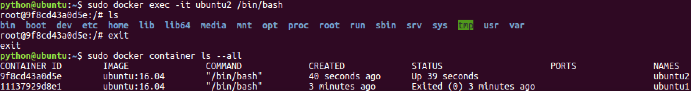
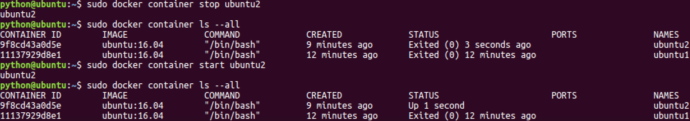
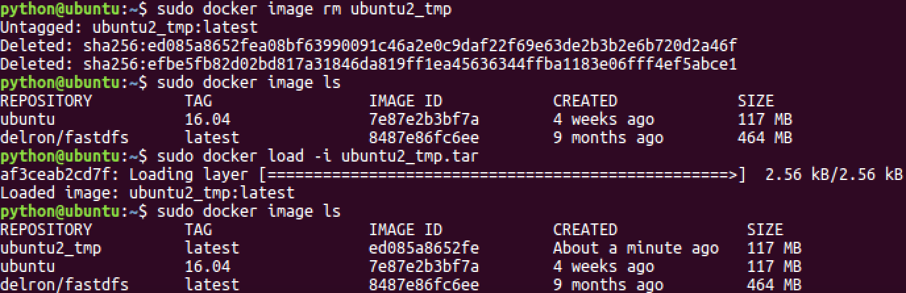

# Day100 Docker

## 什么是Docker?

**简介**：Docker是一个开源的引擎，可以轻松的为任何应用创建一个轻量级的、可移植的、自给自足的容器。开发者在笔记本上编译测试通过的容器可以批量地在生产环境中部署，包括VMs（虚拟机）、bare metal、OpenStack 集群和其他的基础应用平台。

Docker是一个开源的引擎，可以轻松的为任何应用创建一个轻量级的、可移植的、自给自足的容器。开发者在笔记本上编译测试通过的容器可以批量地在生产环境中部署，包括VMs（虚拟机）、 [bare metal](http://www.whatis.com.cn/word_5275.htm)、OpenStack 集群和其他的基础应用平台。 

#### Docker通常用于如下场景：

- web应用的自动化打包和发布；
- 自动化测试和持续集成、发布；
- 在服务型环境中部署和调整数据库或其他的后台应用；
- 从头编译或者扩展现有的OpenShift或Cloud Foundry平台来搭建自己的PaaS环境。

## 准备


**简介**：Docker系统有两个程序：docker服务端和docker客户端。其中docker服务端是一个服务进程，管理着所有的容器。

- [准备开始](https://www.docker.org.cn/book/docker/prepare-docker-5.html#0)
- [目标：](https://www.docker.org.cn/book/docker/prepare-docker-5.html#1)
- [提示：](https://www.docker.org.cn/book/docker/prepare-docker-5.html#2)
- [正确的命令：](https://www.docker.org.cn/book/docker/prepare-docker-5.html#3)

#### 准备开始

Docker系统有两个程序：docker服务端和docker客户端。其中docker服务端是一个服务进程，管理着所有的容器。docker客户端则扮演着docker服务端的远程控制器，可以用来控制docker的服务端进程。大部分情况下，docker服务端和客户端运行在一台机器上。

#### 目标：

检查docker的版本，这样可以用来确认docker服务在运行并可通过客户端链接。

#### 提示： 

可以通过在终端输入docker命令来查看所有的参数。

官网的在线模拟器只提供了有限的命令，无法保证所有的命令可以正确执行。

#### 正确的命令：

**$ docker version** **
**


**关键词** ：docker,version


## 搜索可用docker镜像


**简介**：这一步的目标是学会使用docker search命令来检索可用镜像。

- [搜索可用的docker镜像](https://www.docker.org.cn/book/docker/docker-search-image-6.html#0)
- [目标：](https://www.docker.org.cn/book/docker/docker-search-image-6.html#1)
- [提示：](https://www.docker.org.cn/book/docker/docker-search-image-6.html#2)
- [正确的命令：](https://www.docker.org.cn/book/docker/docker-search-image-6.html#3)

#### 搜索可用的docker镜像

使用docker最简单的方式莫过于从现有的容器镜像开始。Docker官方网站专门有一个页面来存储所有可用的镜像，网址是： [index.docker.io](http://index.docker.io/)。你可以通过浏览这个网页来查找你想要使用的镜像，或者使用命令行的工具来检索。

#### 目标：

学会使用命令行的工具来检索名字叫做tutorial的镜像。

#### 提示：

命令行的格式为：docker search 镜像名字

#### 正确的命令：

$ **docker search tutorial**

******
**


**关键词** ：docker,tutorial,docker中文手册

## 下载容器镜像


**简介**：学会使用docker pull命令下载一个镜像。

- [学会使用docker命令来下载镜像](https://www.docker.org.cn/book/docker/docker-download-image-7.html#0)
- [目标：](https://www.docker.org.cn/book/docker/docker-download-image-7.html#1)
- [提示：](https://www.docker.org.cn/book/docker/docker-download-image-7.html#2)
- [正确的命令：](https://www.docker.org.cn/book/docker/docker-download-image-7.html#3)

#### 学会使用docker命令来下载镜像

下载镜像的命令非常简单，使用docker pull命令即可。(译者按：docker命令和git有一些类似的地方）。在docker的镜像索引网站上面，镜像都是按照 **用户名/** **镜像名**的方式来存储的。有一组比较特殊的镜像，比如ubuntu这类基础镜像，经过官方的验证，值得信任，可以直接用 **镜像名**来检索到。

#### 目标：

通过docker命令下载tutorial镜像。

#### 提示：

执行pull命令的时候要写完整的名字，比如"learn/tutorial"。

#### 正确的命令：

$ **docker pull learn/tutorial**


## 在docker容器中运行hello world!

#### 在docker容器中运行hello world!

docker容器可以理解为在沙盒中运行的进程。这个沙盒包含了该进程运行所必须的资源，包括文件系统、系统类库、shell 环境等等。但这个沙盒默认是不会运行任何程序的。你需要在沙盒中运行一个进程来启动某一个容器。这个进程是该容器的唯一进程，所以当该进程结束的时候，容器也会完全的停止。

#### 目标：

在我们刚刚下载的镜像中输出"hello word"。为了达到这个目的，我们需要在这个容器中运行"echo"命令，输出"hello word"。

#### 提示：

docker run命令有两个参数，一个是镜像名，一个是要在镜像中运行的命令。

#### 正确的命令：

$ **docker run learn/tutorial echo "hello word"**


**关键词** ：docker,run


## 在容器中安装新的程序

**简介**：在docker容器中安装新的程序。

- [在容器中安装新的程序](https://www.docker.org.cn/book/docker/docker-install-package-9.html#0)
- [目标：](https://www.docker.org.cn/book/docker/docker-install-package-9.html#1)
- [提示：](https://www.docker.org.cn/book/docker/docker-install-package-9.html#2)
- [正确的命令：](https://www.docker.org.cn/book/docker/docker-install-package-9.html#3)

#### 在容器中安装新的程序

下一步我们要做的事情是在容器里面安装一个简单的程序(ping)。我们之前下载的tutorial镜像是基于ubuntu的，所以你可以使用ubuntu的apt-get命令来安装ping程序： **apt-get install -y ping**。

备注：apt-get 命令执行完毕之后，容器就会停止，但对容器的改动不会丢失。

#### 目标：

在learn/tutorial镜像里面安装ping程序。

#### 提示：

在执行apt-get 命令的时候，要带上-y参数。如果不指定-y参数的话，apt-get命令会进入交互模式，需要用户输入命令来进行确认，但在docker环境中是无法响应这种交互的。

#### 正确的命令：

**$docker run learn/tutorial apt-get install -y ping**


## 保存对容器的修改


**简介**：通过docker commit命令保存对容器的修改

- [保存对容器的修改](https://www.docker.org.cn/book/docker/docer-save-changes-10.html#0)
- [目标：](https://www.docker.org.cn/book/docker/docer-save-changes-10.html#1)
- [提示：](https://www.docker.org.cn/book/docker/docer-save-changes-10.html#2)
- [正确的命令：](https://www.docker.org.cn/book/docker/docer-save-changes-10.html#3)

#### 保存对容器的修改

当你对某一个容器做了修改之后（通过在容器中运行某一个命令），可以把对容器的修改保存下来，这样下次可以从保存后的最新状态运行该容器。docker中保存状态的过程称之为committing，它保存的新旧状态之间的区别，从而产生一个新的版本。

#### 目标：

首先使用 **docker ps -l**命令获得安装完ping命令之后容器的id。然后把这个镜像保存为learn/ping。

#### 提示：

\1. 运行docker commit，可以查看该命令的参数列表。

\2. 你需要指定要提交保存容器的ID。(译者按：通过docker ps -l 命令获得)

\3. 无需拷贝完整的id，通常来讲最开始的三至四个字母即可区分。（译者按：非常类似git里面的版本号)

#### 正确的命令：

$ **docker commit 698 learn/ping**


执行完docker commit命令之后，会返回新版本镜像的id号。


**关键词** ：docker保存修改,docker,commit


#### 行新的镜像

ok，到现在为止，你已经建立了一个完整的、自成体系的docker环境，并且安装了ping命令在里面。它可以在任何支持docker环境的系统中运行啦！(译者按：是不是很神奇呢？)让我们来体验一下吧！

#### 目标：

在新的镜像中运行ping www.google.com命令。

#### 提示：

一定要使用新的镜像名 **learn/ping**来运行ping命令。(译者按：最开始下载的learn/tutorial镜像中是没有ping命令的)

#### 正确的命令：

**$ docker run lean/ping ping www.google.com**

**
**


**关键词** ：docker镜像


#### 检查运行中的镜像

现在你已经运行了一个docker容器，让我们来看下正在运行的容器。

使用 docker ps命令可以查看所有正在运行中的容器列表，使用 docker inspect命令我们可以查看更详细的关于某一个容器的信息。

#### 目标：

查找某一个运行中容器的id，然后使用docker inspect命令查看容器的信息。

#### 提示：

可以使用镜像id的前面部分，不需要完整的id。

正确的命令：

$ **docker inspect efe**


**关键词** ：docker,inspect

- 


## 发布自己的镜像


**简介**：我们也可以把我们自己编译的镜像发布到索引页面，一方面可以自己重用，另一方面也可以分享给其他人使用。

- [发布docker镜像](https://www.docker.org.cn/book/docker/docker-push-image-13.html#0)
- [目标：](https://www.docker.org.cn/book/docker/docker-push-image-13.html#1)
- [提示：](https://www.docker.org.cn/book/docker/docker-push-image-13.html#2)
- [预期的命令：](https://www.docker.org.cn/book/docker/docker-push-image-13.html#3)

#### 发布docker镜像

现在我们已经验证了新镜像可以正常工作，下一步我们可以将其发布到官方的索引网站。还记得我们最开始下载的learn/tutorial镜像吧，我们也可以把我们自己编译的镜像发布到索引页面，一方面可以自己重用，另一方面也可以分享给其他人使用。

#### 目标：

把learn/ping镜像发布到docker的index网站。

#### 提示：

\1. docker images命令可以列出所有安装过的镜像。

\2. docker push命令可以将某一个镜像发布到官方网站。

\3. 你只能将镜像发布到自己的空间下面。这个模拟器登录的是learn帐号。

#### 预期的命令：

**$ docker push learn/ping**


**关键词** ：docker发布镜像,docker,push

# 容器化方案Docker

> 思考：
>
> - FastDFS的安装步骤非常的多，涉及的依赖包也很多，当新的机器需要安装FastDFS时，是否需要从头开始安装。
> - 我们在学习时拿到ubuntu系统的镜像，在VM虚拟机中运行这个镜像后，为什么就可以直接进行开发，而不需要重新搭建开发环境。
> - 在工作中，如何高效的保证开发人员写代码的开发环境与应用程序要部署的生产环境一致性。如果要部署一台新的机器，是否需要从头开始部署。
>
> 结论：
>
> - 上述思考的问题，都涉及到**相同的工作是否需要重复做**。
> - 避免相同的工作重复做是容器化技术应用之一。
>
> 容器化方案:
>
> - **Docker**
> - Docker的目标之一就是缩短代码从开发、测试到部署、上线运行的周期，让我们的应用程序具备可移植性、易于构建、并易于协作。

### 1. Docker介绍

- [Docker中文社区文档](http://www.docker.org.cn/index.html)

- Docker 是一个开源的软件部署解决方案。

- Docker 也是轻量级的应用容器框架。

- Docker 可以打包、发布、运行任何的应用。

- Docker 就像一个盒子，里面可以装很多物件，如果需要某些物件，可以直接将该盒子拿走，而不需要从该盒子中一件一件的取。

- Docker 是一个

  ```
  客户端-服务端(C/S)
  ```

  架构程序。

  - 客户端只需要向服务端发出请求，服务端处理完请求后会返回结果。

> Docker 包括三个基本概念:

- 镜像（Image）
  - Docker的镜像概念类似于虚拟机里的镜像，是一个只读的模板，一个独立的文件系统，包括运行容器所需的数据，可以用来创建新的容器。
  - 例如：一个镜像可以包含一个完整的 ubuntu 操作系统环境，里面仅安装了MySQL或用户需要的其它应用程序。
- 容器（Container）
  - Docker容器是由Docker镜像创建的运行实例，类似VM虚拟机，支持启动，停止，删除等。
  - 每个容器间是相互隔离的，容器中会运行特定的应用，包含特定应用的代码及所需的依赖文件。
- [仓库（Repository）](https://hub.docker.com/)
  - Docker的仓库功能类似于Github，是用于托管镜像的。

### 2. Docker安装（ubuntu 16.04）

> **1.源码安装Docker CE**

```bash
$ cd docker源码目录
$ sudo apt-key add gpg
$ sudo dpkg -i docker-ce_17.03.2~ce-0~ubuntu-xenial_amd64.deb
```


> **2.检查Docker CE是否安装正确**

```bash
$ sudo docker run hello-world
```

出现如下信息，表示安装成功


> **3.启动与停止**
>
> - 安装完成Docker后，默认已经启动了docker服务。

```bash
# 启动docker
$ sudo service docker start
# 重启docker
$ sudo service docker restart
# 停止docker
$ sudo service docker stop
```

### 3. Docker镜像操作

> **1.镜像列表**

```bash
$ sudo docker image ls
```


```
* REPOSITORY：镜像所在的仓库名称 
* TAG：镜像标签 
* IMAGEID：镜像ID 
* CREATED：镜像的创建日期(不是获取该镜像的日期) 
* SIZE：镜像大小
```

> **2.从仓库拉取镜像**

```bash
# 官方镜像
$ sudo docker image pull 镜像名称 或者 sudo docker image pull library/镜像名称
$ sudo docker image pull ubuntu 或者 sudo docker image pull library/ubuntu
$ sudo docker image pull ubuntu:16.04 或者 sudo docker image pull library/ubuntu:16.04

# 个人镜像
$ sudo docker image pull 仓库名称/镜像名称
$ sudo docker image pull itcast/fastdfs
```

  

> **3.删除镜像**

```bash
$ sudo docker image rm 镜像名或镜像ID
$ sudo docker image rm hello-world
$ sudo docker image rm fce289e99eb9
```


### 4. Docker容器操作

> **1.容器列表**

```bash
# 查看正在运行的容器
$ sudo docker container ls
# 查看所有的容器
$ sudo docker container ls --all
```


> **2.创建容器**

```bash
$ sudo docker run [option] 镜像名 [向启动容器中传入的命令]
常用可选参数说明：
* -i 表示以《交互模式》运行容器。
* -t 表示容器启动后会进入其命令行。加入这两个参数后，容器创建就能登录进去。即分配一个伪终端。
* --name 为创建的容器命名。
* -v 表示目录映射关系，即宿主机目录:容器中目录。注意:最好做目录映射，在宿主机上做修改，然后共享到容器上。 
* -d 会创建一个守护式容器在后台运行(这样创建容器后不会自动登录容器)。 
* -p 表示端口映射，即宿主机端口:容器中端口。
* --network=host 表示将主机的网络环境映射到容器中，使容器的网络与主机相同。
```

> **3.交互式容器**

```bash
$ sudo docker run -it --name=ubuntu1 ubuntu /bin/bash
```

 

```
在容器中可以随意执行linux命令，就是一个ubuntu的环境。
当执行 exit 命令退出时，该容器随之停止。
```

> **4.守护式容器**

```bash
# 开启守护式容器
$ sudo docker run -dit --name=ubuntu2 ubuntu
```


```bash
# 进入到容器内部交互环境
$ sudo docker exec -it 容器名或容器id 进入后执行的第一个命令
$ sudo docker exec -it ubuntu2 /bin/bash
```



```
如果对于一个需要长期运行的容器来说，我们可以创建一个守护式容器。
在容器内部执行 exit 命令退出时，该容器也随之停止。
```

> **5.停止和启动容器**

```bash
# 停止容器
$ sudo docker container stop 容器名或容器id
# kill掉容器
$ sudo docker container kill 容器名或容器id
# 启动容器
$ sudo docker container start 容器名或容器id
```



> **6.删除容器**
>
> - 正在运行的容器无法直接删除。

```bash
$ sudo docker container rm 容器名或容器id
```


> **7.容器制作成镜像**
>
> - 为保证已经配置完成的环境可以重复利用，我们可以将容器制作成镜像。

```bash
# 将容器制作成镜像
$ sudo docker commit 容器名 镜像名
```


```bash
# 镜像打包备份
$ sudo docker save -o 保存的文件名 镜像名
```


```bash
# 镜像解压
$ sudo docker load -i 文件路径/备份文件
```




本文将演示如何安装Docker，构建Docker镜像，以及如何使用Docker运行应用程序。

    随着云计算和DevOps的普及，容器技术已经成为了IT行业中的一个热门话题。容器技术是一种操作系统级别的虚拟化技术，它可以让开发者将应用程序及其依赖打包到一个可移植的容器中，从而实现快速部署、跨平台运行和弹性伸缩。
    
    从技术上来说，容器技术是基于Linux内核的一种虚拟化技术，它利用了Linux内核中的namespace、cgroup等特性，将应用程序与依赖打包到一个文件中，并且给出了相应的运行环境和限制条件。这样，任何支持容器技术的机器都可以运行这个容器，就像运行一个小型的虚拟机一样。不同的容器可以运行在同一个主机上，也可以分布部署在不同的主机上，实现了应用程序的隔离和运行环境的标准化。
    
    容器技术最大的优势是可以快速部署和启动应用程序，有效地解决了传统部署方式的“依赖地狱”问题。同时，容器技术还可以轻松实现弹性伸缩，只需要添加或删除容器即可实现应用程序的水平扩展，并最大化地利用资源。
    
    容器技术的发展历经了多年，现在有多种容器解决方案可供选择，如Docker、Kubernetes等。其中，Docker是目前最为流行的容器解决方案，它提供了完整的容器生命周期管理和持续集成/部署（CI/CD）工具链。Kubernetes则是一个开源的容器集群管理系统，它可以自动化地管理容器的调度、水平伸缩、负载均衡等操作。

1.安装Docker

首先，我们需要在Linux系统中安装Docker。以下是在Ubuntu系统上安装Docker的步骤：

$ sudo apt-get update
$ sudo apt-get install docker.io
安装完成后，我们可以运行以下命令来检查Docker是否已经成功安装：

$ sudo docker version
2.构建Docker镜像

一旦我们安装好了Docker，接下来就可以开始构建Docker镜像了。Docker镜像是一个可执行的软件包，它包含了应用程序和所有的依赖项。我们可以使用Dockerfile文件来定义如何构建Docker镜像。以下是一个示例Dockerfile文件

FROM ubuntu:latest
RUN apt-get update
RUN apt-get install -y nginx
CMD ["nginx", "-g", "daemon off;"]
这个Dockerfile文件定义了一个基于最新版Ubuntu操作系统的镜像，然后安装了Nginx Web服务器。最后，它定义了一个命令，以便在容器启动时运行Nginx服务器。现在我们可以使用以下命令来构建Docker镜像：

$ sudo docker build -t mynginx .
这个命令将会在当前目录下构建一个名为mynginx的Docker镜像。注意最后的"."表示当前目录。构建过程可能会花费一些时间，具体时间取决于镜像的大小和系统的性能。

3.运行Docker容器

一旦我们构建好了Docker镜像，接下来就可以运行Docker容器了。以下是一个示例命令：

$ sudo docker run -d -p 80:80 mynginx
这个命令将会在后台运行一个名为mynginx的容器，并将容器的80端口映射到主机的80端口。现在，我们可以在Web浏览器中打开http://localhost/,来查看Nginx服务器是否成功运行。

4.维护Docker容器

一旦我们运行了Docker容器，我们可能需要对容器进行一些维护工作。以下是一些常用的Docker容器管理命令：

列出所有正在运行的容器：

$ sudo docker ps
停止运行中的容器：

$ sudo docker stop <container_id>
启动已停止的容器：

$ sudo docker start <container_id>
删除容器：

$ sudo docker rm <container_id>
5.推送Docker镜像到仓库

一旦我们构建好了Docker镜像，我们可以将其推送到Docker镜像仓库，以便其他人可以使用它。

$ sudo docker login 
$ sudo docker tag mynginx <username>/mynginx 
$ sudo docker push <username>/mynginx
首先，我们需要使用docker login命令登录到Docker镜像仓库。然后，我们可以使用docker tag命令将本地的mynginx镜像标记为<username>/mynginx。最后，我们可以使用docker push命令将标记的镜像推送到Docker镜像仓库。

6.从仓库拉取Docker镜像

如果我们想要从Docker镜像仓库中拉取镜像，可以使用以下命令：

$ sudo docker pull <username>/mynginx
这个命令将会从Docker镜像仓库中拉取名为<username>/mynginx的镜像。

7.使用Docker Compose管理多个容

$ sudo docker-compose up -d
这个命令将会在后台启动两个容器，并将它们连接到同一个网络中。

总结
至此，一个简单的 Docker 应用就完成了搭建。当修改了代码之后，只需要重新运行构建镜像和启动容器的命令即可更新应用。
————————————————
版权声明：本文为CSDN博主「不鲁诺」的原创文章，遵循CC 4.0 BY-SA版权协议，转载请附上原文出处链接及本声明。
原文链接：https://blog.csdn.net/sendohlib/article/details/130344544