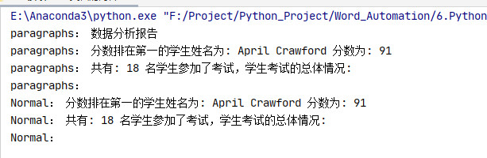

# Day109  Python办公自动化之Word文档自动化

### 环境安装 

使用Python操作word大部分情况都是写操作，也有少许情况会用到读操作，在本次教程中都会进行讲解，本次课程主要用到以下4个库，请大家提前安装。

升级pip（便于安装最新库）

```
python -m pip install -U pip setuptools
```


python-docx（我们大部分操作都是使用此库）

安装方法：

```
pip install python-docx
```


使用方法：

```
from docx import Document
from docx.shared import Inches
```

官方文档：

https://python-docx.readthedocs.io/en/latest/index.html

win32com（主要用作doc转docx格式转换用）

安装方法：

```
pip install pypiwin32
```


使用方法：

```
import win32com
from win32com.client import Dispatch, constants
```

官方文档：

https://docs.microsoft.com/en-us/dotnet/api/microsoft.office.interop.word?view=word-pia

mailmerge（用作按照模板生成大量同类型文档）

安装方法：

```
pip install docx-mailmerge
```


使用方法：

```
from mailmerge import MailMerge
```

官方文档：

https://pypi.org/project/docx-mailmerge/

matplotlib（Python 的绘图库，本期简单讲解，后期会有专门的课程）

安装方法：

```
pip install matplotlib
```


使用方法：

```
import matplotlib.pyplot as plt
```

官方文档：

https://matplotlib.org/3.2.2/tutorials/introductory/sample_plots.html


### Python-docx 新建文档

示例代码1：

```
from docx import Document
document = Document()
document.save('new.docx')
```

效果如下：


示例代码 0.1 Python-docx新建文档.py：

```
from docx import Document

def GenerateNewWord(filename):
    document = Document()
    document.save(filename)

if __name__ == "__main__":
    print("大家好！我们今天开始学习word文档自动化")
    print("我们先来直接生成一个名为‘new.docx’的文档")
    document = Document()
    document.save('new.docx')

    print("没错，里面什么都没有")

    # 我是华丽的分隔符

    print("我们使用函数生成一个word文档试试")
    newname = '使用函数生成的文档.docx'
    GenerateNewWord(newname)
```

效果如下：


### Python-docx 编辑已存在文档

我们很多时候需要在已存在的word文档上添加自己的内容，那么我们赶紧看看应该怎样操作吧~

旧文档：


```
from docx import Document
document = Document('exist.docx')
document.save('new.docx')
```

也许你会说，没有没搞错，就这三句话？是的，就这三句，你就完成了旧文档的复制，如果你想修改，直接添加内容就行了呢！

效果如下：


### win32com 将 doc 转为 docx

旧文档：


示例代码：

```
import os
from win32com import client as wc

def TransDocToDocx(oldDocName,newDocxName):
    print("我是 TransDocToDocx 函数")
    # 打开word应用程序
    word = wc.Dispatch('Word.Application')

    # 打开 旧word 文件
    doc = word.Documents.Open(oldDocName)

    # 保存为 新word 文件,其中参数 12 表示的是docx文件
    doc.SaveAs(newDocxName, 12)

    # 关闭word文档
    doc.Close()
    word.Quit()

    print("生成完毕！")

if __name__ == "__main__":
    # 获取当前目录完整路径
    currentPath = os.getcwd()
    print("当前路径为：",currentPath)

    # 获取 旧doc格式word文件绝对路径名
    docName = os.path.join(currentPath,'旧doc格式文档.doc')
    print("docFilePath = ", docName)

    # 设置新docx格式文档文件名
    docxName = os.path.join(currentPath,'新生成docx格式文档.docx')

    TransDocToDocx(docName,docxName)
```

效果如下：


### win32com 操作 word

打开新的word文档并添加内容

示例代码：

```
import win32com
from win32com.client import Dispatch, constants
import os

# 创建新的word文档
def funOpenNewFile():
    word = Dispatch('Word.Application')
    # 或者使用下面的方法，使用启动独立的进程：
    # word = DispatchEx('Word.Application')

    # 如果不声明以下属性，运行的时候会显示的打开word
    word.Visible = 1  # 0:后台运行 1:前台运行(可见)
    word.DisplayAlerts = 0  # 不显示，不警告

    # 创建新的word文档
    doc = word.Documents.Add()

    # 在文档开头添加内容
    myRange1 = doc.Range(0, 0)
    myRange1.InsertBefore('Hello word\n')

    # 在文档末尾添加内容
    myRange2 = doc.Range()
    myRange2.InsertAfter('Bye word\n')

    # 在文档i指定位置添加内容
    i = 0
    myRange3 = doc.Range(0, i)
    myRange3.InsertAfter("what's up, bro?\n")

    # doc.Save()  # 保存
    doc.SaveAs(os.getcwd() + "\\funOpenNewFile.docx")  # 另存为
    doc.Close()  # 关闭 word 文档
    word.Quit()  # 关闭 office


if __name__ == '__main__':

    print("当前文件路径名：",os.getcwd())

    print("调用funOpenNewFile()")
    funOpenNewFile()
```

效果如下：


打开已存在word文档并添加内容

前提条件：


示例代码：

```
import win32com
from win32com.client import Dispatch, constants
import os

# 打开已存在的word文件
def funOpenExistFile():
    word = Dispatch('Word.Application')
    # 或者使用下面的方法，使用启动独立的进程：
    # word = DispatchEx('Word.Application')

    # 如果不声明以下属性，运行的时候会显示的打开word
    word.Visible = 1  # 0:后台运行 1:前台运行(可见)
    word.DisplayAlerts = 0  # 不显示，不警告

    doc = word.Documents.Open(os.getcwd() + "\\3.1 win32com测试.docx") # 打开一个已有的word文档

    # 在文档开头添加内容
    myRange1 = doc.Range(0, 0)
    myRange1.InsertBefore('Hello word\n')

    # 在文档末尾添加内容
    myRange2 = doc.Range()
    myRange2.InsertAfter('Bye word\n')

    # 在文档i指定位置添加内容
    i = 0
    myRange3 = doc.Range(0, i)
    myRange3.InsertAfter("what's up, bro?\n")

    # doc.Save()  # 保存
    doc.SaveAs(os.getcwd() + "\\funOpenExistFile.docx")  # 另存为
    doc.Close()  # 关闭 word 文档
    word.Quit()  # 关闭 office

if __name__ == '__main__':
    print("当前文件路径名：",os.getcwd())

    print("调用funOpenExistFile()")
    funOpenExistFile()
```

效果如下：


转换word为pdf

示例代码：

```
import win32com
from win32com.client import Dispatch, constants
import os

# 生成Pdf文件
def funGeneratePDF():
    word = Dispatch("Word.Application")
    word.Visible = 0  # 后台运行，不显示
    word.DisplayAlerts = 0  # 不警告
    doc = word.Documents.Open(os.getcwd() + "\\3.3 win32com转换word为pdf等格式.docx") # 打开一个已有的word文档
    doc.SaveAs(os.getcwd() + "\\3.3 win32com转换word为pdf等格式.pdf", 17)  # txt=4, html=10, docx=16， pdf=17
    doc.Close()
    word.Quit()

if __name__ == '__main__':
    funGeneratePDF()
```

效果如下：


### Python-docx 操作 word

官方文档：（最权威指南，没有之一）

https://python-docx.readthedocs.io/en/latest/

Python-docx官方例程

前提条件：


示例代码：

```
from docx import Document
from docx.shared import Inches

document = Document()

document.add_heading('Document Title', 0)

p = document.add_paragraph('A plain paragraph having some ')
p.add_run('bold').bold = True
p.add_run(' and some ')
p.add_run('italic.').italic = True

document.add_heading('Heading, level 1', level=1)
document.add_paragraph('Intense quote', style='Intense Quote')

document.add_paragraph(
    'first item in unordered list', style='List Bullet'
)
document.add_paragraph(
    'first item in ordered list', style='List Number'
)

document.add_picture('countrygarden.png', width=Inches(1.25))

records = (
    (3, '101', 'Spam'),
    (7, '422', 'Eggs'),
    (4, '631', 'Spam, spam, eggs, and spam')
)

table = document.add_table(rows=1, cols=3)
hdr_cells = table.rows[0].cells
hdr_cells[0].text = 'Qty'
hdr_cells[1].text = 'Id'
hdr_cells[2].text = 'Desc'
for qty, id, desc in records:
    row_cells = table.add_row().cells
    row_cells[0].text = str(qty)
    row_cells[1].text = id
    row_cells[2].text = desc

document.add_page_break()

document.save('4.1 Python-docx官方例程.docx')
```

最终效果：


Python-docx官方例程解析


导入库操作

```
from docx import Document
```

导入英寸单位操作（可用于指定图片大小、表格宽高等）


```
from docx.shared import Inches
```

新建一个文档

```
document = Document()
```

加载旧文档（用于修改或添加内容）

```
document = Document('exist.docx')
```

添加标题段落

```
document.add_heading('Document Title', 0)
```


添加段落操作

段落在 Word 中是基本内容。它们用于正文文本，也用于标题和项目列表（如项目符号）。

```
p = document.add_paragraph('A plain paragraph having some ')
```

在指定段落上添加内容

```
p.add_run('bold').bold = True   # 添加粗体文字
p.add_run(' and some ')     # 添加默认格式文字
p.add_run('italic.').italic = True  # 添加斜体文字
```


添加标题操作

等级1-9 也就是标题1-标题9，我们可以在旧文档中将标题格式设置好，使用Python-docx打开旧文档，再添加相应等级标题即可。

```
document.add_heading('Heading, level 1', level=1)
```


添加指定样式段落

样式详情：

https://python-docx.readthedocs.io/en/latest/user/styles-understanding.html#understanding-styles

```
document.add_paragraph('Intense quote', style='Intense Quote')

# 以下两句的含义等同于上面一句
p = document.add_paragraph('Intense quote')
p.style = 'Intense Quote'
```

添加无序列表操作

```
document.add_paragraph( 'first item in unordered list', style='List Bullet')
```

添加有序列表操作

```
document.add_paragraph( 'first item in ordered list', style='List Number')
```


添加图片操作

第一个参数为图片路径，需要正确无误

第二个参数为图片大小，单位英寸

```
document.add_picture('countrygarden.png', width=Inches(1.25))
```


新建表格操作

```
table = document.add_table(rows=1, cols=3)
```

填充标题行操作

```
hdr_cells = table.rows[0].cells
hdr_cells[0].text = 'Qty'
hdr_cells[1].text = 'Id'
hdr_cells[2].text = 'Desc'
```

为每组内容添加数据行并填充

```
for qty, id, desc in records:
    row_cells = table.add_row().cells
    row_cells[0].text = str(qty)
    row_cells[1].text = id
    row_cells[2].text = desc
```

设置标题样式操作

```
table.style = 'LightShading-Accent1'
```


添加分页符操作

```
document.add_page_break()
```

保存当前文档操作

```
document.save('4.1 Python-docx官方例程.docx')
```

Python-docx 表格样式设置

表格样式设置代码：

```
from docx import *
document = Document()

table = document.add_table(3, 3, style="Medium Grid 1 Accent 1")
heading_cells = table.rows[0].cells
heading_cells[0].text = '第一列内容'
heading_cells[1].text = '第二列内容'
heading_cells[2].text = '第三列内容'

document.save("demo.docx")
```

遍历所有样式：

```
from docx.enum.style import WD_STYLE_TYPE
from docx import Document

document = Document()
styles = document.styles

# 生成所有表样式
for s in styles:
    if s.type == WD_STYLE_TYPE.TABLE:
        document.add_paragraph("表格样式 :  " + s.name)
        table = document.add_table(3, 3, style=s)
        heading_cells = table.rows[0].cells
        heading_cells[0].text = '第一列内容'
        heading_cells[1].text = '第二列内容'
        heading_cells[2].text = '第三列内容'
        document.add_paragraph("\n")

document.save('4.3 所有表格样式.docx')
```

效果如下（大家按照喜欢的样式添加即可）：


### docx&matplotlib 自动生成数据分析报告

最终效果


数据获取

我们这里使用xlrd作为数据获取所使用的库，简单回顾一下：

```
import xlrd

xlsx = xlrd.open_workbook('./3_1 xlrd 读取 操作练习.xlsx')

# 通过sheet名查找：xlsx.sheet_by_name("sheet1")
# 通过索引查找：xlsx.sheet_by_index(3)
table = xlsx.sheet_by_index(0)

# 获取单个表格值 (2,1)表示获取第3行第2列单元格的值
value = table.cell_value(2, 1)
print("第3行2列值为",value)

# 获取表格行数
nrows = table.nrows
print("表格一共有",nrows,"行")

# 获取第4列所有值（列表生成式）
name_list = [str(table.cell_value(i, 3)) for i in range(1, nrows)]
print("第4列所有的值：",name_list)
```

表格内容：

```
from docx.shared import Inches
```

新建一个文档

```
document = Document()
```

加载旧文档（用于修改或添加内容）

```
document = Document('exist.docx')
```

添加标题段落

```
document.add_heading('Document Title', 0)
```


添加段落操作

段落在 Word 中是基本内容。它们用于正文文本，也用于标题和项目列表（如项目符号）。

```
p = document.add_paragraph('A plain paragraph having some ')
```

在指定段落上添加内容

```
p.add_run('bold').bold = True   # 添加粗体文字
p.add_run(' and some ')     # 添加默认格式文字
p.add_run('italic.').italic = True  # 添加斜体文字
```


添加标题操作

等级1-9 也就是标题1-标题9，我们可以在旧文档中将标题格式设置好，使用Python-docx打开旧文档，再添加相应等级标题即可。

```
document.add_heading('Heading, level 1', level=1)
```


添加指定样式段落

样式详情：

https://python-docx.readthedocs.io/en/latest/user/styles-understanding.html#understanding-styles

```
document.add_paragraph('Intense quote', style='Intense Quote')

# 以下两句的含义等同于上面一句
p = document.add_paragraph('Intense quote')
p.style = 'Intense Quote'
```

添加无序列表操作

```
document.add_paragraph( 'first item in unordered list', style='List Bullet')
```

添加有序列表操作

```
document.add_paragraph( 'first item in ordered list', style='List Number')
```


添加图片操作

第一个参数为图片路径，需要正确无误

第二个参数为图片大小，单位英寸

```
document.add_picture('countrygarden.png', width=Inches(1.25))
```


新建表格操作

```
table = document.add_table(rows=1, cols=3)
```

填充标题行操作

```
hdr_cells = table.rows[0].cells
hdr_cells[0].text = 'Qty'
hdr_cells[1].text = 'Id'
hdr_cells[2].text = 'Desc'
```

为每组内容添加数据行并填充

```
for qty, id, desc in records:
    row_cells = table.add_row().cells
    row_cells[0].text = str(qty)
    row_cells[1].text = id
    row_cells[2].text = desc
```

设置标题样式操作

```
table.style = 'LightShading-Accent1'
```


添加分页符操作

```
document.add_page_break()
```

保存当前文档操作

```
document.save('4.1 Python-docx官方例程.docx')
```

Python-docx 表格样式设置

表格样式设置代码：

```
from docx import *
document = Document()

table = document.add_table(3, 3, style="Medium Grid 1 Accent 1")
heading_cells = table.rows[0].cells
heading_cells[0].text = '第一列内容'
heading_cells[1].text = '第二列内容'
heading_cells[2].text = '第三列内容'

document.save("demo.docx")
```

遍历所有样式：

```
from docx.enum.style import WD_STYLE_TYPE
from docx import Document

document = Document()
styles = document.styles

# 生成所有表样式
for s in styles:
    if s.type == WD_STYLE_TYPE.TABLE:
        document.add_paragraph("表格样式 :  " + s.name)
        table = document.add_table(3, 3, style=s)
        heading_cells = table.rows[0].cells
        heading_cells[0].text = '第一列内容'
        heading_cells[1].text = '第二列内容'
        heading_cells[2].text = '第三列内容'
        document.add_paragraph("\n")

document.save('4.3 所有表格样式.docx')
```

效果如下（大家按照喜欢的样式添加即可）：


### docx&matplotlib 自动生成数据分析报告

最终效果


数据获取

我们这里使用xlrd作为数据获取所使用的库，简单回顾一下：

```
import xlrd

xlsx = xlrd.open_workbook('./3_1 xlrd 读取 操作练习.xlsx')

# 通过sheet名查找：xlsx.sheet_by_name("sheet1")
# 通过索引查找：xlsx.sheet_by_index(3)
table = xlsx.sheet_by_index(0)

# 获取单个表格值 (2,1)表示获取第3行第2列单元格的值
value = table.cell_value(2, 1)
print("第3行2列值为",value)

# 获取表格行数
nrows = table.nrows
print("表格一共有",nrows,"行")

# 获取第4列所有值（列表生成式）
name_list = [str(table.cell_value(i, 3)) for i in range(1, nrows)]
print("第4列所有的值：",name_list)
```

表格内容：

表格内容：


编写数据获取代码：

我们这里只获取用户姓名和，分数，并将它们保存到列表中，看代码。

```
# 获取学习成绩信息
def GetExcelInfo():
    print("开始获取表格内容信息")

    # 打开指定文档
    xlsx = xlrd.open_workbook('学生成绩表格.xlsx')

    # 获取sheet
    sheet = xlsx.sheet_by_index(0)

    # 获取表格行数
    nrows = sheet.nrows
    print("一共 ",nrows," 行数据")

    # 获取第2列，和第4列 所有值（列表生成式）,从第2行开始获取
    nameList = [str(sheet.cell_value(i, 1)) for i in range(1, nrows)]
    scoreList = [int(sheet.cell_value(i, 3)) for i in range(1, nrows)]

    # 返回名字列表和分数列表
    return nameList,scoreList
```

获取结果：


柱状图生成

我们先将获取的姓名和成绩使用 字典 数据结构关联起来，再对其排序：

```
# 将名字和分数列表合并成字典(将学生姓名和分数关联起来)
scoreDictionary = dict(zip(nameList, scoreList))
print("dictionary:",scoreDictionary)

# 对字典进行值排序，高分在前,reverse=True 代表降序排列
scoreOrder = sorted(scoreDictionary.items(), key=lambda x: x[1], reverse=True)
print("scoreOrder",scoreOrder)
```

效果如下：

```
# 合成的字典
dictionary: {'Dillon Miller': 41, 'Laura Robinson': 48, 'Gabrilla Rogers': 28, 'Carlos Chen': 54, 'Leonard Humphrey': 44, 'John Hall': 63, 'Miranda Nelson': 74, 'Jessica Morgan': 34, 'April Lawrence': 67, 'Cindy Brown': 52, 'Cassandra Fernan': 29, 'April Crawford': 91, 'Jennifer Arias': 61, 'Philip Walsh': 58, 'Christina Hill P': 14, 'Justin Dunlap': 56, 'Brian Lynch': 84, 'Michael Brown': 68}

# 排序后，再次转换成列表
scoreOrder [('April Crawford', 91), ('Brian Lynch', 84), ('Miranda Nelson', 74), ('Michael Brown', 68), ('April Lawrence', 67), ('John Hall', 63), ('Jennifer Arias', 61), ('Philip Walsh', 58), ('Justin Dunlap', 56), ('Carlos Chen', 54), ('Cindy Brown', 52), ('Laura Robinson', 48), ('Leonard Humphrey', 44), ('Dillon Miller', 41), ('Jessica Morgan', 34), ('Cassandra Fernan', 29), ('Gabrilla Rogers', 28), ('Christina Hill P', 14)]
```


使用 matplotlib 生成柱状图：

```
# 生成学生成绩柱状图（使用matplotlib）
# 会生成一张名为"studentScore.jpg"的图片
def GenerateScorePic(scoreList):
    # 解析成绩列表，生成横纵坐标列表
    xNameList = [str(studentInfo[0]) for studentInfo in scoreList]
    yScoreList = [int(studentInfo[1]) for studentInfo in scoreList]
    print("xNameList",xNameList)
    print("yScoreList",yScoreList)

    # 设置字体格式
    matplotlib.rcParams['font.sans-serif'] = ['SimHei']  # 用黑体显示中文

    # 设置绘图尺寸
    plt.figure(figsize=(10,5))

    # 绘制图像
    plt.bar(x=xNameList, height=yScoreList, label='学生成绩', color='steelblue', alpha=0.8)

    # 在柱状图上显示具体数值, ha参数控制水平对齐方式, va控制垂直对齐方式
    for x1, yy in scoreList:
        plt.text(x1, yy + 1, str(yy), ha='center', va='bottom', fontsize=16, rotation=0)

    # 设置标题
    plt.title("学生成绩柱状图")

    # 为两条坐标轴设置名称
    plt.xlabel("学生姓名")
    plt.ylabel("学生成绩")

    # 显示图例
    plt.legend()

    # 坐标轴旋转
    plt.xticks(rotation=90)

    # 设置底部比例，防止横坐标显示不全
    plt.gcf().subplots_adjust(bottom=0.25)

    # 保存为图片
    plt.savefig("studentScore.jpg")

    # 直接显示
    plt.show()
```

效果如下：


生成最终报告

表格内容：


编写数据获取代码：

我们这里只获取用户姓名和，分数，并将它们保存到列表中，看代码。

```
# 获取学习成绩信息
def GetExcelInfo():
    print("开始获取表格内容信息")

    # 打开指定文档
    xlsx = xlrd.open_workbook('学生成绩表格.xlsx')

    # 获取sheet
    sheet = xlsx.sheet_by_index(0)

    # 获取表格行数
    nrows = sheet.nrows
    print("一共 ",nrows," 行数据")

    # 获取第2列，和第4列 所有值（列表生成式）,从第2行开始获取
    nameList = [str(sheet.cell_value(i, 1)) for i in range(1, nrows)]
    scoreList = [int(sheet.cell_value(i, 3)) for i in range(1, nrows)]

    # 返回名字列表和分数列表
    return nameList,scoreList
```

获取结果：


柱状图生成

我们先将获取的姓名和成绩使用 字典 数据结构关联起来，再对其排序：

```
# 将名字和分数列表合并成字典(将学生姓名和分数关联起来)
scoreDictionary = dict(zip(nameList, scoreList))
print("dictionary:",scoreDictionary)

# 对字典进行值排序，高分在前,reverse=True 代表降序排列
scoreOrder = sorted(scoreDictionary.items(), key=lambda x: x[1], reverse=True)
print("scoreOrder",scoreOrder)
```

效果如下：

```
# 合成的字典
dictionary: {'Dillon Miller': 41, 'Laura Robinson': 48, 'Gabrilla Rogers': 28, 'Carlos Chen': 54, 'Leonard Humphrey': 44, 'John Hall': 63, 'Miranda Nelson': 74, 'Jessica Morgan': 34, 'April Lawrence': 67, 'Cindy Brown': 52, 'Cassandra Fernan': 29, 'April Crawford': 91, 'Jennifer Arias': 61, 'Philip Walsh': 58, 'Christina Hill P': 14, 'Justin Dunlap': 56, 'Brian Lynch': 84, 'Michael Brown': 68}

# 排序后，再次转换成列表
scoreOrder [('April Crawford', 91), ('Brian Lynch', 84), ('Miranda Nelson', 74), ('Michael Brown', 68), ('April Lawrence', 67), ('John Hall', 63), ('Jennifer Arias', 61), ('Philip Walsh', 58), ('Justin Dunlap', 56), ('Carlos Chen', 54), ('Cindy Brown', 52), ('Laura Robinson', 48), ('Leonard Humphrey', 44), ('Dillon Miller', 41), ('Jessica Morgan', 34), ('Cassandra Fernan', 29), ('Gabrilla Rogers', 28), ('Christina Hill P', 14)]
```


使用 matplotlib 生成柱状图：

```
# 生成学生成绩柱状图（使用matplotlib）
# 会生成一张名为"studentScore.jpg"的图片
def GenerateScorePic(scoreList):
    # 解析成绩列表，生成横纵坐标列表
    xNameList = [str(studentInfo[0]) for studentInfo in scoreList]
    yScoreList = [int(studentInfo[1]) for studentInfo in scoreList]
    print("xNameList",xNameList)
    print("yScoreList",yScoreList)

    # 设置字体格式
    matplotlib.rcParams['font.sans-serif'] = ['SimHei']  # 用黑体显示中文

    # 设置绘图尺寸
    plt.figure(figsize=(10,5))

    # 绘制图像
    plt.bar(x=xNameList, height=yScoreList, label='学生成绩', color='steelblue', alpha=0.8)

    # 在柱状图上显示具体数值, ha参数控制水平对齐方式, va控制垂直对齐方式
    for x1, yy in scoreList:
        plt.text(x1, yy + 1, str(yy), ha='center', va='bottom', fontsize=16, rotation=0)

    # 设置标题
    plt.title("学生成绩柱状图")

    # 为两条坐标轴设置名称
    plt.xlabel("学生姓名")
    plt.ylabel("学生成绩")

    # 显示图例
    plt.legend()

    # 坐标轴旋转
    plt.xticks(rotation=90)

    # 设置底部比例，防止横坐标显示不全
    plt.gcf().subplots_adjust(bottom=0.25)

    # 保存为图片
    plt.savefig("studentScore.jpg")

    # 直接显示
    plt.show()
```

效果如下：


生成最终报告

示例代码：

```
from docx import Document


if __name__ == "__main__":
    document = Document('6 学生成绩报告.docx')

    # 读取 word 中所有内容
    for p in document.paragraphs:
        print("paragraphs：",p.text)

    # 读取 word 中所有一级标题
    for p in document.paragraphs:
        if p.style.name == 'Heading 1':
            print("Heading 1：",p.text)

    # 读取 word 中所有二级标题
    for p in document.paragraphs:
        if p.style.name == 'Heading 2':
            print("Heading 2：", p.text)

    # 读取 word 中所有正文
    for p in document.paragraphs:
        if p.style.name == 'Normal':
            print("Normal：", p.text)

    document.save('修改后的报告.docx')
```

效果如下：




读取docx中表格内容

示例代码：

```
from docx import Document


if __name__ == "__main__":
    document = Document('6 学生成绩报告.docx')

    # 读取表格内容
    for tb in document.tables:
        for i,row in enumerate(tb.rows):
            for j,cell in enumerate(row.cells):
                text = ''
                for p in cell.paragraphs:
                    text += p.text

                print(f'第{i}行，第{j}列的内容{text}')

    document.save('修改后的报告.docx')
```

效果如下：


修改word中的内容

示例代码：

```
from docx import Document

if __name__ == "__main__":
    document = Document('6 学生成绩报告.docx')

    # 修改 word 中所有内容
    for p in document.paragraphs:
        p.text = "修改后的段落内容"

    # 修改表格内容
    for tb in document.tables:
        for i,row in enumerate(tb.rows):
            for j,cell in enumerate(row.cells):
                text = ''
                for p in cell.paragraphs:
                    p.text = ("第",str(i),"行",str(j),"列")

                print(f'第{i}行，第{j}列的内容{text}')

    document.save('6.4 修改后的报告.docx')
```

效果如下：


### docx-mailmerge 自动生成万份劳动合同

创建合同模板

添加内容框架


创建一个域


设置域名


依次全部添加


生成1份证明

示例代码：

```
from mailmerge import MailMerge

template = '薪资证明模板.docx'

document = MailMerge(template)

document.merge(name = '唐星',
               id = '1010101010',
               year = '2020',
               salary = '99999',
               job = '嵌入式软件开发工程师')

document.write('生成的1份证明.docx')
```

效果如下：


哈哈哈哈！！月入10万，走向人生巅峰~

生成10000份证明

示例代码：

```
from mailmerge import MailMerge
from datetime import datetime

# 生成单份合同
def GenerateCertify(templateName,newName):
    # 打开模板
    document = MailMerge(templateName)

    # 替换内容
    document.merge(name='唐星',
                   id='1010101010',
                   year='2020',
                   salary='99999',
                   job='嵌入式软件开发工程师')

    # 保存文件
    document.write(newName)

if __name__ == "__main__":
    templateName = '薪资证明模板.docx'

    # 获得开始时间
    startTime = datetime.now()

    # 开始生成
    for i in range(10000):
        newName = f'./10000份证明/薪资证明{i}.docx'
        GenerateCertify(templateName,newName)

    # 获取结束时间
    endTime = datetime.now()

    # 计算时间差
    allSeconds = (endTime - startTime).seconds
    print("生成10000份合同一共用时: ",str(allSeconds)," 秒")

    print("程序结束！")
```

效果如下：


只花了89秒，平均不到 0.01 就能生成一个！！快


阅读 508