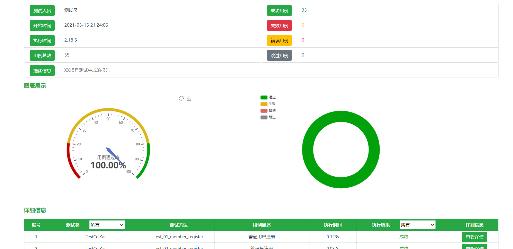
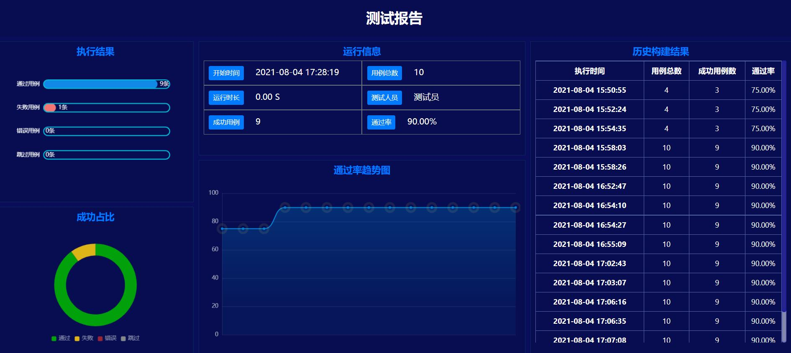
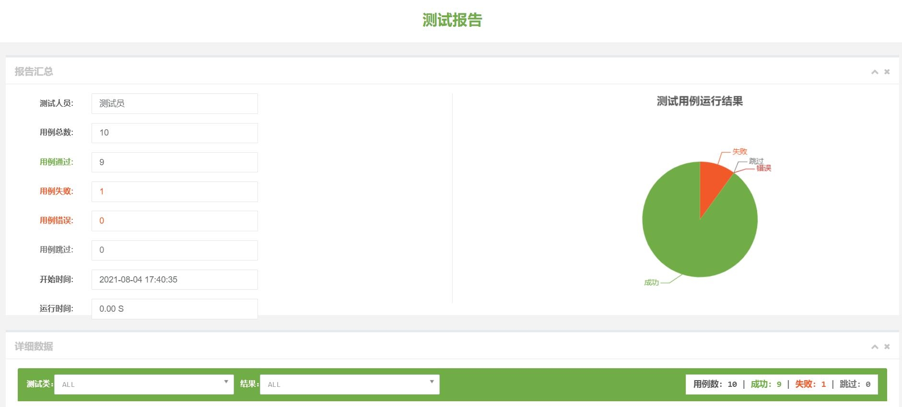

# Day115 unittestreport-自动化测试报告生成

[TOC]


#### 前言

对于自动化测试来说，如何能把测试结果更直观更有效的展示出来一直是测试人员的一块心病。目前主流的有很多生成测试报告的第三方库，例如，`HTMLTestRunner`、`BeautifulReport`、`Allure`，等等。不过这些库使用起来各有利弊，总之没有一个库能既满足实用又满足美观。

最近看到一个unittest框架配套的测试报告生成插件，可以做到与unittest框架无缝衔接，并且支持多种格式的自动化测试报告。

#### 什么是unittestreport？

`unittestreport`是基于unittest开发的一个功能扩展库，开发之初，开发人员只是计划开发一个unittest生成html测试报告的模块，因此命名为`unittestreport`(听起来很接地气，有没有...😌)。目前已经迭代了数个版本，其提供的功能也越来越丰富。目前已经支持的功能有：

- HTML测试报告生成
- unittest数据驱动
- 失败用例rerun
- 多线程并发
- 测试结果推送(邮箱、钉钉、企业微信)

#### 安装


```bash
pip install unittestreport

pip install pytest-testreport   # 支持pytest生成报告
```

#### 生成测试报告

`unittestreport`中封装了一个`TestRunner`类，可以用来代替unittest中的`TextTestRunner`来执行测试用例，执行完测试用例后会自动生成测试报告。并且支持各种测试报告的风格。

❕❕不过实际测试发现，PyCharm中执行的用例不会生成测试报告，只有在终端执行的测试用例会生成测试报告。


```python
import unittest
from unittestreport import TestRunner

class MyTestCase(unittest.TestCase):

    def setUp(self):
        """用例初始化等操作"""
        self.num1 = 24
        self.num2 = 2

    def tearDown(self):
        """恢复用例执行环境"""

    def test_div(self):
        self.assertEqual(self.num1 / self.num2, 12)

    def test_add(self):
        self.assertEqual(self.num1 + self.num2, 22)

    def test_any(self):
        self.assertEqual(self.num1 % self.num2, 5)


if __name__ == '__main__':
    case = unittest.defaultTestLoader.discover("./")
    runner = TestRunner(case)
    runner.run()
```

`TestRunner`类创建测试报告时，可以通过指定测试参数生成自定义的测试报告。

- `suites`：测试用例套，测试集
- `filename`：测试报告文件名
- `report_dir`：测试报告存放路径
- `title`：测试报告的标题名称
- `templates`：指定生成测试报告的模板类型(etc: 1、2、3)
  - 测试报告类型1


测试报告模板类型1.png

- 测试报告类型2


测试报告模板类型2.png

- 测试报告类型3


测试报告模板类型3.png

- `tester`： 测试人员名称


```python
suite = unittest.defaultTestLoader.discover(r'C:\project\open_class\Py0507\testcase')

# 2、创建一个用例运行程序
runner = unittestreport.TestRunner(suite,
                                   tester='测试人员—小柠檬',
                                   filename="test",
                                   report_dir=".",
                                   title='这里设置报告标题',
                                   desc='项目测试生成的报告描述',
                                   templates=2
                                   )

# 3、运行测试用例
runner.run()
```

#### 失败用例rerun

新的`unittestreport`中对`rerun`方法进行了优化，测试时指定`count`和`interval`即可将执行失败的用例多次执行。

- `count`：指定用例失败后重新运行的次数
- `interval`：指定每次重新执行用例的时间间隔


```python
runner = TestRunner(suite=suite)
runner.run(count=3, interval=2)
```

#### 测试报告发送邮件

目前邮件接口只支持`465`和`25`两个端口

#### 数据驱动

> 数据驱动的目的是将测试数据和用例逻辑进行分离，提高代码的重用率，以及用例的维护.

使用方法


```python
from unittestreport import ddt, list_data,json_data,yaml_data
```

关于数据驱动本，unittestreport.dataDriver模块中实现了三个使用方法，支持使用列表(可迭代对象)、json文件、yaml文件来生成测试用例.

- List_data：用例数据保存在可迭代对象（列表）中时使用

  

  ```python
  from unittestreport import ddt, list_data
  @ddt
  class TestClass(unittest.TestCase):
      cases = [{'title': '用例1', 'data': '用例参数', 'expected': '预期结果'}, 
               {'title': '用例2', 'data': '用例参数', 'expected': '预期结果'},
               {'title': '用例3', 'data': '用例参数', 'expected': '预期结果'}]
      
      @list_data(cases)
      def test_case(self, data):
          pass
  ```

- Json_data：用例数据保存在json文件中时使用

  

  ```python
  from unittestreport import ddt,json_data
  
  @ddt
  class TestClass(unittest.TestCase):
      @json_data('C:/xxx/xxx.json')
      def test_case(self, data):
          pass
  ```

- Yaml_data：用例数据保存在json文件中时使用

  

  ```python
  from unittestreport import ddt,yaml_data
  
  @ddt
  class TestClass(unittest.TestCase):
      @yaml_data("C:/xxxx/xxx/cases.yaml")
      def test_case(self, data):
          pass
  ```

##### 注意点：

- 关于使用ddt的时候进行数据驱动，指定测试报告中的用例描述：
- 测试报告中的用例描述默认使用的是用例方法的文档字符串注释，
- 如果要给每一条用例添加用例描述，需要在用例数据中添加title或者desc字段，字段对应的数据会自动设置为测试报告中用例的描述

#### 并发执行用例

`unittestreport`中同样提供了对并发执行用例的支持，使用`TestRunner.run()`方法执行测试用例时，加上`thread_count`参数即可执行运行用例时开启的线程数量。


```python
runner = TestRunner(suite=suite)
runner.run(thread_count=3)
```

:warning: 使用并发方式执行用例时，需要考虑以下几个问题

- 用例执行之间是否有依赖关系
- 用例之间是否会有修改公共资源(全局变量)的情况


作者：归源
链接：https://www.jianshu.com/p/476d3ebb69e4
来源：简书
著作权归作者所有。商业转载请联系作者获得授权，非商业转载请注明出处。


# [测试报告--unittestreport 使用文档](https://www.cnblogs.com/xingzhifeng/p/16107802.html)

一、安装和介绍

1、什么是unittestreport：

　　unittestreport是基于unittest开发的的一个功能扩展库，关于unittestreport最初在开发的时候，最初只是计划开发一个unittest生成html测试报告的模块，所以起名叫做unittestreport。在开发的过程中结合使用者的反馈，慢慢的扩展了更多的功能进去。后续还会持续的扩展和开发一些新的功能，目前实现了以下功能：

- HTML测试报告生成
- unittest数据驱动
- 测试用例失败重运行
- 多线程并发执行用例
- 发送测试结果及报告到邮箱
- 测试结果推送到钉钉
- 测试结构推送到企业微信

2、安装unittestreport：

　　unittestreport是基于python3.6开发的，安装前请确认你的python版本>3.6

- 安装命令
- pip install unittestreport

3、pytest的支持

　　能不能让unittestreport支持pytest生成报告，所以就加上了这个功能。pytest生成unittestreport风格的报告，安装如下插件即可,详细教程见

- pytest插件安装命令： pip install pytest-testreport

 

二、HTML测试报告生成

　　unittestteport中封装了一个TestRunner类，可以用来代替unittest中的TextTestRunner来执行测试用例，执行完测试用例之后会自动生成测试报告。并且有多种报告风格可选

 

1、使用案例

[](javascript:void(0);)

```
from unittestteport import TestRunner
# 加载用例到测试套件
suite = unittest.defaultTestLoader.discover('用例所在目录路径')
# 创建测试运行程序
runner = TestRunner(test_suite)
# 运行用例，生成测试报告
runner.run()
```

[](javascript:void(0);)

运行上述代码，就会自动生成一个report.html的报告文件

 

2、报告样式展示：



3、关于TestRunner初始化参数：

 

　　在使用TestRunner创建测试运行程序时，可以通过以下参数来，自定义报告的相关内容

- suites: 测试套件（必传）
- filename: 指定报告文件名
- report_dir: 指定存放报告路径
- title: 指定测试报告的标题
- templates: 可以指定1，2，3三个风格的模板
- tester: 测试人员名称

[](javascript:void(0);)

```
import unittestreport
# 1、加载测试用例到套件中
suite = unittest.defaultTestLoader.discover(r'C:\project\open_class\Py0507\testcase')
# 2、创建一个用例运行程序
runner = unittestreport.TestRunner(suite,
                                   tester='测试人员—小柠檬',
                                   filename="C:\project\",
                                   report_dir=".",
                                   title='这里设置报告标题',
                                   desc='小柠檬项目测试生成的报告描述',
                                   templates=2
                                   )
# 3、运行测试用例
runner.run()
```

[](javascript:void(0);)

4、更多的报告样式

 

　　templates: 指定1，2，3三个风格的模板样式分别如下

 

报告样式一： 


报告样式二： 



报告样式三：是基于BeautifulReport的报告优化而来 



 

三、测试用例失败重运行

 

　　关于unittest重运行机制，unittestreport最新得版本中做了优化，直接使用TestRunner.run（之前的版本是TestRunner.rerun_run方法），传入相关的参数即可实现重运行，具体的使用如下

案例

运行时加上参数，即可实现用例失败重运行

```
import unittestreport
# 1、加载测试用例到套件中
suite = unittest.defaultTestLoader.discover(r'C:\project\open_class\Py0507\testcase')
runner = TestRunner(suite=suite)
runner.run(count=3, interval=2)
```

参数说明：

- count：用来指定用例失败重运行的次数
- interval：指定每次重运行的时间间隔

四、邮件发送测试报告

　　unittestreport内部实现了推送测试结果到邮箱的方法，执行完测试用例之后调用发送测试报告的方法即可。发邮件的方法介绍：TestRunner类中实现了send_email方法，可以方便用户，快速发送邮件。

 

1、使用案例

[](javascript:void(0);)

```
suite = unittest.defaultTestLoader.discover(r'C:\project\open_class\Py0507\testcase')
runner = TestRunner(suite)
runner.run()
runner.send_email(host="smtp.qq.com",
                  port=465,
                  user="musen_nmb@qq.com",
                  password="alg123412bab",
                  to_addrs="324666668@qq.com")
```

[](javascript:void(0);)

 

**2、参数介绍**

- **host： smtp服务器地址**
- **port：端口**
- **user：邮箱账号**
- **password：smtp服务授权码**
- **to_addrs：收件人邮箱地址（一个收件人传字符串，多个收件人传列表）**

注意：目前发送邮件只支持465和25端口

 

五、数据驱动的使用

 

1、使用介绍

　　关于数据驱动这边就不给大家做过多的介绍了，数据驱动的目的是将测试数据和用例逻辑进行分离，提高代码的重用率，以及用例的维护，关于数据驱动本，unittestreport.dataDriver模块中实现了三个使用方法，支持使用列表(可迭代对象)、json文件、yaml文件来生成测试用例，接来分别给大家介绍一下使用方法：

```
from unittestreport import ddt, list_data,json_data,yaml_data
```

　　第一步：使用ddt装饰测试用例类

　　第二步：根据数据存储的方式，选择对应的方法进行传入用例数据

 

2、list_data的使用

　　用例数据保存在可迭代对象中（如列表），则可以使用list_data来实现数据

[](javascript:void(0);)

```
from unittestreport import ddt, list_data
@ddt
class TestClass(unittest.TestCase):
    cases = [{'title': '用例1', 'data': '用例参数', 'expected': '预期结果'}, 
             {'title': '用例2', 'data': '用例参数', 'expected': '预期结果'},
             {'title': '用例3', 'data': '用例参数', 'expected': '预期结果'}]
    @list_data(cases)
    def test_case(self, data):
        pass
```

[](javascript:void(0);)

用例数据的格式:列表嵌套字典

3、json_data

　　用例保存在json文件中，则可以使用json_data来实现数据驱动，使用json_data时，直接传入json文件的路径即可

[](javascript:void(0);)

```
from unittestreport import ddt,json_data

@ddt
class TestClass(unittest.TestCase):
    @json_data('C:/xxx/xxx.json')
    def test_case(self, data):
        pass
```

[](javascript:void(0);)

json文件中的数据格式如下：

[](javascript:void(0);)

```
[
  {
    "title": "用例1",
    "data": "用例参数",
    "expected": "预期结果"
  },
  {
    "title": "用例2",
    "data": "用例参数",
    "expected": "预期结果"
  },
  {
    "title": "用例3",
    "data": "用例参数",
    "expected": "预期结果"
  }
]
```

[](javascript:void(0);)

4、yaml_data

　　用例保存在json文件中，则可以使用json_data来实现数据驱动，使用json_data时，直接传入json文件的路径即可

[](javascript:void(0);)

```
from unittestreport import ddt,yaml_data

@ddt
class TestClass(unittest.TestCase):
    @yaml_data("C:/xxxx/xxx/cases.yaml")
    def test_case(self, data):
        pass
```

[](javascript:void(0);)

yaml文件中的数据展示

[](javascript:void(0);)

```
- title: 用例1
  data: 用例参数
  expected: 预期结果

- title: 用例2
  data: 用例参数
  expected: 预期结果

- title: 用例4
  data: 用例参数
  expected: 预期结果
```

[](javascript:void(0);)

5、注意点：

- 关于使用ddt的时候进行数据驱动，指定测试报告中的用例描述：
- 测试报告中的用例描述默认使用的是用例方法的文档字符串注释，
- 如果要给每一条用例添加用例描述，需要在用例数据中添加title或者desc字段，字段对应的数据会自动设置为测试报告中用例的描述


 

六、推送测试结果到钉钉

 

　　关于把测试结果推送到钉钉群，unittestreport里面进行了封装。执行完用例之后，调用TestRunner对象的dingtalk_notice方法即可。

 

1、参数介绍

　　关于dingtalk_notice这个方法的参数如下，大家可以根据使用需求来进行选择。

- url: 钉钉机器人的Webhook地址
- key: （非必传：str类型）如果钉钉机器人安全设置了关键字，则需要传入对应的关键字
- secret:（非必传:str类型）如果钉钉机器人安全设置了签名，则需要传入对应的密钥
- atMobiles: （非必传，list类型）发送通知钉钉中要@人的手机号列表，如：[137xxx,188xxx]
- isatall: 是否@所有人，默认为False,设为True则会@所有人
- except_info:是否发送未通过用例的详细信息，默认为False，设为True则会发送失败用例的详细信息

2、案例代码：

[](javascript:void(0);)

```
import unittest
from unittestreport import TestRunner

# 收集用例到套件
suite = unittest.defaultTestLoader.discover(CASE_DIR)
runner = TestRunner(suite)
# 执行用例
runner.run()

url = "https://oapi.dingtalk.com/robot/send?access_token=6e2a63c2b9d870ee878335b5ce6d5d10bb1218b8e64a4e2b55f96a6d116aaf50"
# 发送钉钉通知  
runner.dingtalk_notice(url=url, key='钉钉安全设置的关键字',secret='钉钉安全设置签名的秘钥')
```

[](javascript:void(0);)

 

七、推送测试结果到企业微信

　　目前也有不少的公司使用企业微信办公，自动化跑完之后，测试结果需要推送到企业微信群，所以把这个功能做了一下集成（其实大家自己去些也没多少代码)。执行完用例之后，调用TestRunner对象的weixin_notice方法即可将测试结果推送到企业微信群。

 

1、参数介绍

- chatid： 企业微信群id
- access_token：调用企业微信API接口的凭证
- corpid：企业ID
- corpsecret：应用的凭证密钥

2、案例代码

[](javascript:void(0);)

```
import unittest
from tests.test_case import TestClass
from unittestreport import TestRunner
# 加载用例
suite = unittest.defaultTestLoader.loadTestsFromTestCase(TestClass)
runner = TestRunner(suite=suite)
# 运行用例
runner.run()

# 推送测试结果到企业微信
# 方式一：
runner.weixin_notice(chatid="企业微信群id", access_token="调用企业微信API接口的凭证")
# 方式二：
runner.weixin_notice(chatid="企业微信群id",corpid='企业ID', corpsecret='应用的凭证密钥')
```

[](javascript:void(0);)

 

八、并发执行用例

　　unittestreport中实现了对并发执行用例的支持，在使用TestRunner.run方法执行用例时，通过参数thread_count即可指定运行用例时开启的线程数量。

 

1、使用案例

[](javascript:void(0);)

```
import unittestreport
# 1、加载测试用例到套件中
suite = unittest.defaultTestLoader.discover(r'C:\project\open_class\Py0507\testcase')
runner = TestRunner(suite=suite)
# 2、设置5个线程去执行用例
runner.run(thread_count=5)
```

[](javascript:void(0);)

 

2、注意点

　　**用例执行的顺序问题：**

 　　在执行自动化用例的过程中，如果用例之间有数据依赖的关系，那么在执行时就必须按照先后顺序去执行。为了解决这个问题，unittestreport中多线程并发执行时，默认以测试类为单位开启线程执行，就是说同一个测试类中的用例，在执行的过程中执行的先后顺序能够得到保证。不同的测试类中在执行的过程中是一个并发执行的状态，执行的先后顺序是不确定的。因此在使用多线程执行的时候，要注意下面这两点：

　　**不同的测试类之间，不能有数据依赖，因为多线程并发没办法保证执行的先后顺序**

　　多线程全局变量共享的问题

　　多线程是共享全局变量的，如果要以多线程执行用例，还需要考虑全局资源竞争的问题，就是用例在执行的过程中不能修改多个测试类中共用的全局数据(资源)。否则会影响其他的用例执行。

 

九、pytest的支持

 

1、pytest-testreport介绍

使用pytest生成unittestreport的html报告,写了个pytest生成报告的插件，于是在代码的基础上实现了pytest生产unittestreport报告。也就是pytest-testreport这个插件。

pytest-testreport是一个针对pytest的生成html报告的插件，使用起来非常简单，只需要再pytest.ini文件中做简单的配置即可实现html报告的生成

2、安装pytest-testreport

pytest-testreport是基于python3.6开发的，安装前请确认你的python版本>3.6

安装命令

```
pip install pytest-testreport
```

 3、使用方式：

 注意点：如果安装了pytest-html这个插件，请先卸载，不然会有冲突

 *命令行执行*

```
运行测试时加上参数--report 指定报告文件名` `pytest --report=musen.html` `其他配置参数``--title=指定报告标题``--tester=指定报告中的测试者``--desc = 指定报告中的项目描述``--template = 指定报告模板样式（1 or 2）` `同时使用多个参数``pytest --report=musen.html --title=测试报告 --tester=测试菜鸟 --desc=项目描述 --template=2
```

*pytest.main执行*

```
import pytest` `pytest.main([``'--report=musen.html'``,``       ``'--title=测试报告标题'``,``       ``'--tester=木森'``,``       ``'--desc=报告描述信息'``,``       ``'--template=2'``])
```

本文来自博客园，作者：[刑之风](https://www.cnblogs.com/xingzhifeng/)，转载请注明原文链接：https://www.cnblogs.com/xingzhifeng/p/16107802.html