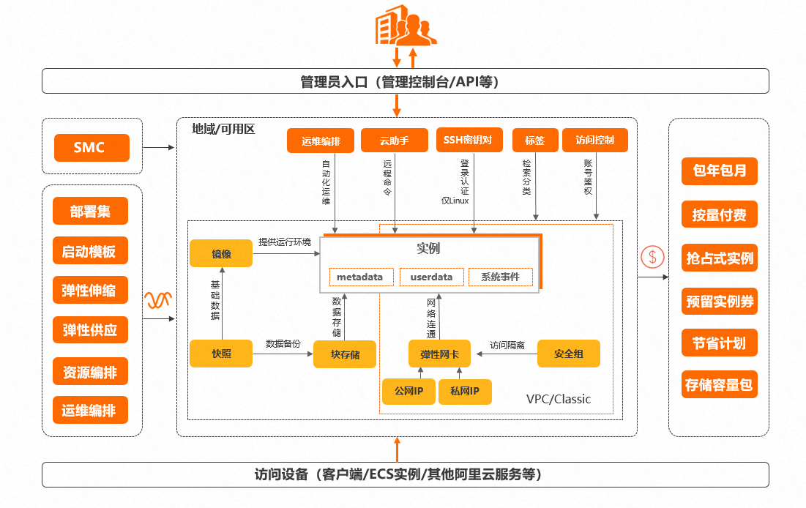

# Day116 搭建个人服务器


plan1 

> 把自己的WiFi ip 地址设置为公网 ip  
>
> （打电话给客服改）
>
> 本地搭建网站


### plan2 

> 1、购买云服务器
>
> 2、申请域名并解析
>
> 3、开发自己的程序部署


**免费试用**

https://free.aliyun.com/?crowd=personal&spm=5176.28055625.J_5831864660.2.1c07154ao7qEHz&scm=20140722.M_9916822.P_141.MO_1806-ID_9916822-MID_9916822-CID_30623-ST_8336-V_1

**玩转3个月免费试用攻略**

https://help.aliyun.com/zh/ecs/3-month-free-trial


CentOS和Ubuntu：两大流行Linux发行版的区别与选择指南

https://www.duokaiyun.com/news/1010.html

云服务器ECS控制台

https://ecs.console.aliyun.com/server/region/cn-guangzhou?__refreshToken=1695352780253


[CentOS7下部署Django项目详细操作步骤](https://www.django.cn/article/show-4.html)


使用Nginx+uWSGI部署Django项目

https://help.aliyun.com/zh/ecs/use-cases/use-nginx-and-uwsgi-to-deploy-a-django-project?spm=a2c4g.11186623.0.0.42c32845Eq94Ck


阿里云ecs服务器无法用公网ip

https://www.56dr.com/news/content/15635.html


在不同linux  系统上安装nginx

https://nginx.org/en/linux_packages.html#RHEL


>
>
>1、背linux命令
>
>2、centos和unbuntu的区别
>
>3、先阅读云服务器ecs的说明书
>
>4、学习nginx  （背命令、记原理、知改错）
>
>5、学习uwsgi
>
>6、云服务器ecs如何加端口
>
>

## 1、背linux命令

ll 是 ls -l 的别名


一、linux管理和目录命令
pwd 显示当前路径地址
cd 改变当前用户的目录
ls 查看当前文件夹下的文件
mkdir  新建文件夹目录
rmdir  删除文件夹目录
touch  新建文件
cat    查看文本内容
mv     移动
cp	复制
rm	删除
grep	字符串查找

二、线上查找
man 查看当前或者一个命令的使用方法
locate 根据一个关键字或者关键词定位
whatis 查看某个命令的含义
三、文件阅读命令
head	从头开始查看
tail 	从尾开始查看
more	分页查看
四、文件或目录的压缩和解压缩
tar 
gzip
bizip2
gunzip
bunzip
五权限管理
chmod	修改权限
useradd	用户添加
userdel 用户删除
su	切换用户
passwd	修改密码
chgrp	修改文件所在组
chown	用来修改文件的所有者
六、文件的定位和查找
which  定位
whereis	查找
七、磁盘操作
df 查看文件系统使用情况
du 查看文件磁盘占用情况
八、系统命令
reboot重启
shutdown 关机
halt	关机
ps	进程
toop	进程
date	日期
cal	日历
exit	退出
kill	结束进程
九网络
ipconfig 显示网络状态
ping	监测主机
netstat	知道整个linux系统的网络情况或显示网络状态
free 查看内存使用情况

## Linux

1、查找文件
 find  /目录 -name filename.txt
2、查看一个程序是否运行   				ps         -ef|grep     进程名字
指令： ps
作用： 主要是查看服务器的进程信息
选项含义：
-e：等价于 ‘-A’ ，表示列出全部的进程
-f：显示全部的列（显示全字段）
grep 命令的基本格式			 grep [选项] 模式 文件
3、终止线程							kill  -9  进程
4、查看文件包含的隐藏文件    		ls  -al 
6、复制文件包含其子文件到自定义目录			cp 	 -r	sourceFolder   targetFolder
7、创建目录						mkdir	newfolder
8、删除目录					rmdir  【 】 documents    -v显示详细执行过程   -p 删除指定目录及子空目录
9、删除文件包括其子文件		rm 		-rf 		deletefile
10、移动文件 		mv  	/temp/movefile		/targetfolder 	+		mv  oldnamefile	newnamefile
11、切换用户 		su 	-usernam
12、修改文件权限		chmod	777   	file        -rwxrwxrwx
13、压缩文件		tar		-czf		test.tar.gz  	/test1/test2
14、列出压缩文件列表	tar 	-tzf	test.tar.g
15、解压文件			tar 	-xvzf		test.tar.gz
16、查看文件头10行		head		-n		10		example.txt
17、查看文件尾10行		tail			-n		10	example.txt
18、查看日志文件 			tail			-f		example.log 	
 19 、启动vi编辑器			vi
23、grep 		grep [选项] 模式 文件名	grep CLERK emp.data
如果只想知道职位为 CLERK 的员工的人数，可以使用“-c”选项，执行命令如下：grep -c CLERK emp.data
搜索 emp.data 文件，使用正则表达式找出以 78 开头的数据行，执行命令如下：grep ^78     emp.data
29.ps  -a     ps  -ef

30. netstat -a      # 列出所有端口
    netstat -at     # 列出所有TCP端口
    netstat -au    # 列出所有UDP端口
    netstat -ax    # 列出所有unix端口
    netstat -atnlp    # 直接使用ip地址列出所有处理监听状态的TCP端口，且加上程序名


```
使用Nginx+uWSGI部署Django项目
which python3 
ll /usr/bin/python*
sudo yum -y install nginx

启动并查看Nginx服务状态。
sudo systemctl start nginx  
sudo systemctl status nginx
回显信息中出现Active: active (running)，表示Nginx服务已启动。


```

## 2、centos和unbuntu的区别

1、centos基于EHEL开发，而ubuntu基于Debian开发；

2、centos使用rpm和flatpak软件包，而ubuntu使用deb和snap的软件包；

3、centos使用yum来更新，而ubuntu使用apt来更新。

CentOS 看起来会更稳定，因为它不会像 Ubuntu 那样对包做常规性更新，但这并不意味着 Ubuntu 就不比 CentOS 安全;


### 3、先阅读云服务器ecs的说明书

https://help.aliyun.com/zh/ecs/3-month-free-trial





## 4、学习nginx  （背命令、记原理、知改错）

WSGI（Web Server Gateway Interface） python Web 应用程序与 Web 服务器之间的**接口规范**

`uWSGI`：uWSGI 是一个 **Web 服务器**

`uwsgi`：**uwsgi 是一个与 uWSGI 服务器相关的协议**。


# 个人操作

```
https://www.django.cn/article/show-4.html

source /data/env/pyweb/bin/activate

cd /data/wwwroot/mysite

uwsgi  --ini  uwsgi.ini


#uwsgi有没有启动成功,可以用下面的命令查看
ps -ef|grep uwsgi
#如果想重启uwsgi,先使用下面的命令杀掉进程,再启动uwsgi
killall -9 uwsgi

#停止运行uwsgi，通过包含主进程编号的文件设置停止项目
uwsgi --stop uwsgi.pid

#重启uwsgi
uwsgi --reload uwsgi.pid


sudo vim /etc/nginx/nginx.conf


uwsgi  --ini  uwsgi.ini

ps -ef|grep uwsgi


nginx -s reload


cd /home/myblog/uwsgi_project2

```

