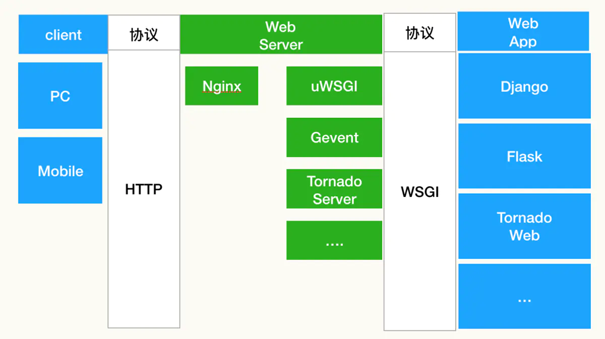
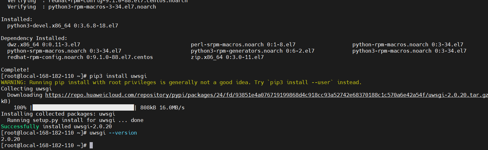
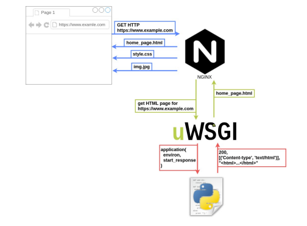
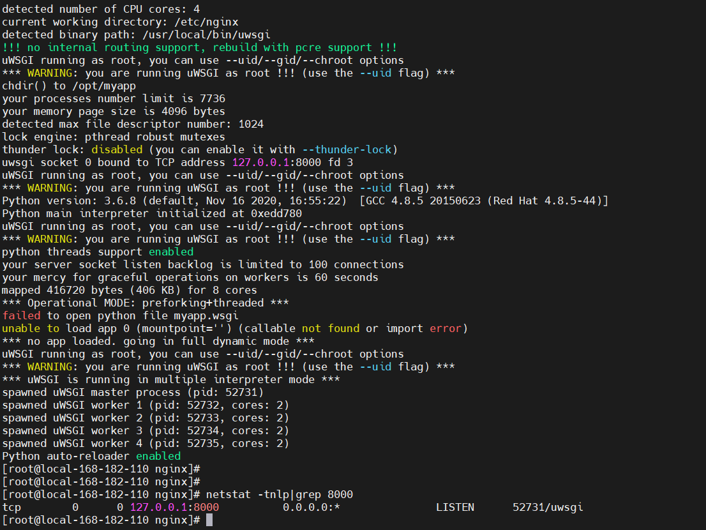

# Day117 uwsgi详解

[TOC]


目录

- [一、概述](https://www.cnblogs.com/liugp/p/17153418.html#一概述)
- 二、安装 uwsgi 模块
  - [1）配置pip源](https://www.cnblogs.com/liugp/p/17153418.html#1配置pip源)
  - [2）安装 uwsgi 模块](https://www.cnblogs.com/liugp/p/17153418.html#2安装-uwsgi-模块)
- 三、示例演示（uWSGI + Nginx 配置）
  - [1）安装 nginx](https://www.cnblogs.com/liugp/p/17153418.html#1安装-nginx)
  - [2）创建 app.py 文件](https://www.cnblogs.com/liugp/p/17153418.html#2创建-apppy-文件)
  - [3）创建 uWSGI 配置文件](https://www.cnblogs.com/liugp/p/17153418.html#3创建-uwsgi-配置文件)
  - [4）启动 uWSGI](https://www.cnblogs.com/liugp/p/17153418.html#4启动-uwsgi)
  - [5）配置 Web 服务器](https://www.cnblogs.com/liugp/p/17153418.html#5配置-web-服务器)
  - [6）重启 Web 服务器](https://www.cnblogs.com/liugp/p/17153418.html#6重启-web-服务器)
  - 7）Nginx upstream 负载均衡
    - [1、轮询（默认）](https://www.cnblogs.com/liugp/p/17153418.html#1轮询默认)
    - [2、权重（weight）](https://www.cnblogs.com/liugp/p/17153418.html#2权重weight)
    - [3、IP散列（ip_hash）](https://www.cnblogs.com/liugp/p/17153418.html#3ip散列ip_hash)
  - [8）http、http-socket 和 socket 区别](https://www.cnblogs.com/liugp/p/17153418.html#8httphttp-socket-和-socket-区别)
  - [9）TCP 与 uinx 区别](https://www.cnblogs.com/liugp/p/17153418.html#9tcp-与-uinx-区别)


## 一、概述

WSGI 、uWSGI 和 uwsgi 是三个相关的概念，它们是在 Web 应用程序开发中使用的不同的工具和协议。下面是它们的详细介绍：

- `WSGI（Web Server Gateway Interface）`：WSGI 是一个 Python Web 应用程序与 Web 服务器之间的**接口规范**，它定义了应用程序和服务器之间的标准接口，使得应用程序可以在不同的 Web 服务器上运行。WSGI 规范规定了应用程序必须实现的接口方法和服务器需要支持的方法。**WSGI 协议**使得不同的 Python Web 框架（例如 Flask、Django 等）能够在不同的 Web 服务器上运行，这些服务器可以是 Apache、Nginx 等。
- `uWSGI`：uWSGI 是一个 **Web 服务器**，它是一个用 C 语言编写的 Web 应用程序容器，支持运行 Python、Ruby、Perl 等多种编程语言。uWSGI 服务器可以作为一个独立的应用服务器，也可以与其他 Web 服务器（如 Nginx、Apache）一起使用，通过 WSGI 协议与 Python 应用程序通信。
- `uwsgi`：**uwsgi 是一个与 uWSGI 服务器相关的协议**。uwsgi 协议是一种二进制协议，它定义了 uWSGI 服务器与应用程序之间的通信协议。使用 uwsgi 协议，uWSGI 服务器可以与 Python 应用程序通信，而不需要像 CGI 那样启动一个新的进程来处理每个请求。uwsgi 协议允许 uWSGI 服务器与应用程序之间进行双向通信，从而提高了性能。

因此，uWSGI 是一个 Web 服务器，可以通过 WSGI 协议与 Python 应用程序通信，并使用 uwsgi 协议进行通信。WSGI 是 Python Web 应用程序与 Web 服务器之间的接口规范，定义了应用程序和服务器之间的标准接口。而 uwsgi 则是 uWSGI 服务器与应用程序之间的二进制通信协议。



## 二、安装 uwsgi 模块

uWSGI 是一种 Web 服务器网关接口（Web Server Gateway Interface），它可以用于将 Python Web 应用程序与 Web 服务器（如 Nginx 或 Apache）集成在一起。

- 在使用uWSGI模块时，需要安装`uwsgi`模块，并在Python Web应用程序中导入`uwsgi`模块，并使用uwsgi模块提供的函数来配置和管理Web应用程序的运行。常见的uwsgi模块函数包括uwsgi.optin()、uwsgi.route()、uwsgi.applications()等。
- 另外，uWSGI模块还提供了一些高级特性，如Master/Worker模式、进程管理、负载均衡、自动扩展等，使得Web应用程序可以更好地适应高并发和大流量的情况。

### 1）配置pip源

国内源地址：

- pypi 清华大学源：https://pypi.tuna.tsinghua.edu.cn/simple
- pypi 腾讯源：http://mirrors.cloud.tencent.com/pypi/simple
- pypi 阿里源：https://mirrors.aliyun.com/pypi/simple/

```bash
mkdir  ~/.pip/
cat >~/.pip/pip.conf<<EOF
[global]
index-url = https://repo.huaweicloud.com/repository/pypi/simple
trusted-host = repo.huaweicloud.com
timeout = 120
EOF
```

### 2）安装 uwsgi 模块

```bash
# 安装python3
yum -y install python3

yum -y install gcc-c++ -y 
yum -y install python3-devel -y

# 安装 uwsgi flask 模块
pip3 install uwsgi flask

# 查看版本
uwsgi --version
```



## 三、示例演示（uWSGI + Nginx 配置）



### 1）安装 nginx

```bash
yum update -y
yum install epel-release
yum -y install nginx
```

### 2）创建 app.py 文件

创建一个名为 `app.py` 的文件，添加以下代码：

```python
from flask import Flask
app = Flask(__name__)

@app.route('/')
def hello():
    return 'Hello, World!'

if __name__ == '__main__':
    app.run()
```

### 3）创建 uWSGI 配置文件

创建一个 uWSGI 配置文件，例如 `uwsgi.ini`，其中包含以下信息：

```bash
[uwsgi]
module = app:app 
# 相当于命令下面两行
#wsgi-file = app.py # 项目入口文件
#callable = app #  flask应用对象
# 支持http+socket两种方式，这里选用socket，也可以选择http-socket，下面会讲解这三种区别
# http = 127.0.0.1:8000
socket = 0.0.0.0:8000
# 也可以使用socket文件，在nginx配置文件中配置也对应，仅限本机通信，一般也很少使用
# socket = /app/myapp.sock

# 注意记得提前创建目录
chdir = /opt/myapp
pidfile=/opt/myapp/myapp.pid
processes = 4
threads = 2
master = true
vacuum = true
py-autoreload = 1
daemonize = /tmp/uwsgi.log
```

uwsgi.ini常用配置参数详解：

- `chdir`=/xxx/xxx # 指定项目目录， 这里写上程序根目录(即`app.py`文件所在目录)对应上述目录结构为`src`
- `home`=/xxx/xxx # 指定虚拟环境变量
- `wsgi-file`=xxx # 指定加载WSGI文件
- `socket`=xxx # 指定uwsgi的客户端将要连接的socket的路径（使用UNIX socket的情况）或者地址（使用网络地址的情况）。#socket协议，用于和nginx通讯,端口可配置成别的端口；如果有nginx在uwsgi之前作为代理的话应该配socket 如：socket=0.0.0.0:5000。当然也可以使用`http-socket` #而如果客户端请求不经过(不搭建)Nginx代理服务器,服务请求直接到uwsgi服务器的话那么就配http。如：http=0.0.0.0:5000;IP和端口与项目启动文件app.py中一致; 127.0.0.1虽然是表示本地IP，但想要在网络上访问必须设置host=0.0.0.0才不受IP限制。
- `callable`=app # 这个 app 指的是 flask 项目启动程序中定义的 flask **name** 的名字，我的启动程序是 app.py , 里面定义的 flask 的名字是 app 。
- `module` = mysite.wsgi # 加载一个WSGI模块,这里加载mysite/wsgi.py这个模块
- `master=true # 指定启动主进程
- `processes=4 # 设置工作进程的数量
- `threads`=2 # 设置每个工作进程的线程数
- `vacuum`=true # 当服务器退出时自动删除unix socket文件和pid文件
- `logfile-chmod`=644 # 指定日志文件的权限
- `daemonize`=%(chdir)/xxx.log # 进程在后台运行，并将日志打印到指定文件
- `pidfile`=%(chdir)/xxx.pid # 在失去权限前，将主进程pid写到指定的文件
- `uid`=xxx # uWSGI服务器运行时的用户id
- `gid`=xxx # uWSGI服务器运行时的用户组id
- `procname-prefix-spaced`=xxx # 指定工作进程名称的前缀
- `chdir`=/xxx/xxx # 指定项目目录， 这里写上程序根目录(即`app.py`文件所在目录)对应上述目录结构为`/opt/uwsgi/`
- `listen` = 120 # 设置socket的监听队列大小（默认：100）

### 4）启动 uWSGI

在命令行中启动 uWSGI：

```bash
uwsgi --ini uwsgi.ini
###或者
uwsgi uwsgi.ini

### 重启
uwsgi --reload /opt/myapp/myapp.pid
###关闭
uwsgi --stop /opt/myapp/myapp.pid
```



> 【温馨提示】其实也可以通过一条命令带上对应的参数即可启动，但是不推荐，测试可以。一般使用配置文件的方式启动服务。

使用http协议启动uwsgi的命令为：

```bash
uwsgi --http :8000 --ini uwsgi_conf.ini -d ./uwsgi.log --pidfile=uwsgi.pid
```

- `--http` 指定用5800端口启动http协议
- `--ini` 指定上述的启动配置文件
- `-d` 指定uwsgi的log，方便我们调试
- `--pidfile` 将启动的进程号写到`uwsgi.pid`文件中，方便我们在需要停止服务器时kill掉。

### 5）配置 Web 服务器

将 Web 服务器配置为反向代理 uWSGI，例如，在 Nginx 中，可以使用以下配置文件：

```bash
# vi /etc/nginx/conf.d/myapp.conf
server {
        listen 8080;
        server_name myapp.com;
        location / {
           include uwsgi_params;
           uwsgi_pass 127.0.0.1:8000;
        }
}
```

其中，`uwsgi_params` 文件包含以下内容：cat

```bash
uwsgi_param  QUERY_STRING       $query_string;
uwsgi_param  REQUEST_METHOD     $request_method;
uwsgi_param  CONTENT_TYPE       $content_type;
uwsgi_param  CONTENT_LENGTH     $content_length;

uwsgi_param  REQUEST_URI        $request_uri;
uwsgi_param  PATH_INFO          $document_uri;
uwsgi_param  DOCUMENT_ROOT      $document_root;
uwsgi_param  SERVER_PROTOCOL    $server_protocol;
uwsgi_param  REQUEST_SCHEME     $scheme;
uwsgi_param  HTTPS              $https if_not_empty;

uwsgi_param  REMOTE_ADDR        $remote_addr;
uwsgi_param  REMOTE_PORT        $remote_port;
uwsgi_param  SERVER_PORT        $server_port;
uwsgi_param  SERVER_NAME        $server_name;
```


> 【特别注意】`uwsgi_params` 在nginx conf文件夹下自带，uwsgi_pass一定要跟uwsgi_conf.ini中写的地址完全一致。

### 6）重启 Web 服务器

重启 Web 服务器以使配置生效。

```bash
# 重启
systemctl restart nginx

# 如果是之前nginx服务已经存在，只是修改了配置，可建议使用reload加载
nginx -t && nginx -s reload
# 或者
systemctl reload nginx
```

访问（浏览器访问，curl访问也行）


### 7）Nginx upstream 负载均衡

> Nginx上游（upstream）是指一组后端服务器，Nginx可以与其通信并将客户端请求转发到这些服务器。换句话说，上游服务器是Nginx代理请求的后端服务器。

Nginx的upstream支持5种 分配方式，其中 **轮询（默认）**、**权重**、**IP散列**这三种为Nginx原生支持的分配方式，`fair` 和 `url_hash` 为第三方支持的分配方式。

#### 1、轮询（默认）

轮询是`upstream`的**默认分配方式**，即每个请求按照时间顺序轮流分配到不同的后端服务器，如果某个后端服务器 down 掉后，能自动剔除。

```bash
upstream backend {
    server 192.168.182.110:8000;
    server 192.168.182.111:8000;
}
```

#### 2、权重（weight）

轮询的加强版，既可以指定轮询比率，**weight 和访问几率成正比**，主要应用于后端服务器异质的场景下。

```bash
upstream backend {
    server 192.168.182.110:8000 weight=1;
    server 192.168.182.111:8000 weight=2;
}
```

#### 3、IP散列（ip_hash）

每个请求按照访问 Ip（即Nginx的前置服务器或客户端IP）的 hash结果分配，这样**每个访客会固定访问一个后端服务器**，可以解决 session 一致问题。

```bash
upstream backend {
    ip_hash;
    server 192.168.182.110:8000 weight=1;
    server 192.168.182.111:8000 weight=2;
}
```

先在另外一个节点上再起一个uWSGI服务，将上面示例配置修改：

```bash
# vi /etc/nginx/conf.d/myapp.conf
upstream backend {
    server 192.168.182.110:8000;
    server 192.168.182.111:8000;
}

server {
        listen 8080;
        server_name myapp.com;
        location / {
           include uwsgi_params;
           uwsgi_pass backend;
        }
}
```

192.168.182.110 节点 `app.py`

```bash
from flask import Flask
app = Flask(__name__)

@app.route('/')
def hello():
    return 'Hello, World 192.168.182.110!\n'

if __name__ == '__main__':
    app.run()
```

192.168.182.111 节点 `app.py`

```bash
from flask import Flask
app = Flask(__name__)

@app.route('/')
def hello():
    return 'Hello, World 192.168.182.111!\n'

if __name__ == '__main__':
    app.run()
```

验证

```bash
curl  127.0.0.1:8080
```


从上图可知，请求轮询调度，这才是企业一般想要的效果，负载均衡。

### 8）http、http-socket 和 socket 区别

- `http`和`http-socket`的区别在于，如果我们想**直接将uwsgi用作服务器**（例如Apache和nginx那样）直接暴露在公网那么就使用`http`；
- 如果有单独的服务器（例如Apache或者nginx），由服务器将请求转发给uwsgi处理，并且使用`http`协议，那么此时使用`http-socket`。
- `http`: 自己会产生一个http进程(可以认为与nginx同一层)负责路由`http`请求给`worker`, `http`进程和`worker`之间使用的是uwsgi协议。
- `http-socket`: 不会产生http进程, 一般用于在前端webserver不支持`uwsgi`而仅支持http时使用, 他产生的worker使用的是http协议。
- 因此, `http` 一般是作为独立部署的选项; `http-socket` 在前端webserver不支持uwsgi时使用, 如果前端webserver支持uwsgi, 则直接使用socket即可(tcp or unix)。

【1】`socket` 示例（uwsgi.ini）：

```bash
[uwsgi]
module = app:app
#socket = 127.0.0.1:8000
socket = 0.0.0.0:8000

chdir = /opt/myapp
pidfile=/opt/myapp/myapp.pid
processes = 4
threads = 2
master = true
vacuum = true
py-autoreload = 1
daemonize = /tmp/uwsgi.log
```

nginx配置

```bash
upstream backend {
    server 192.168.182.110:8000;
    server 192.168.182.111:8000;
}

server {
        listen 8080;
        server_name myapp.com;
        location / {
           include uwsgi_params;
           uwsgi_pass backend;
        }
}
```

【2】`http` 示例（uwsgi.ini）：

```bash
[uwsgi]
module = app:app
socket = 0.0.0.0:8000

chdir = /opt/myapp
pidfile=/opt/myapp/myapp.pid
processes = 4
threads = 2
master = true
vacuum = true
py-autoreload = 1
daemonize = /tmp/uwsgi.log
```

nginx配置

```bash
upstream backend {
    server 192.168.182.110:8000;
    server 192.168.182.111:8000;
}

server {
        listen 8080;
        server_name myapp.com;
        location / {
           include uwsgi_params;
           proxy_pass http://backend;
        }
}
```

【3】`http-socket` 示例（uwsgi.ini）：

```bash
[uwsgi]
module = app:app
http = 0.0.0.0:8000

chdir = /opt/myapp
pidfile=/opt/myapp/myapp.pid
processes = 4
threads = 2
master = true
vacuum = true
py-autoreload = 1
daemonize = /tmp/uwsgi.log
```

nginx配置

```bash
upstream backend {
    server 192.168.182.110:8000;
    server 192.168.182.111:8000;
}

server {
        listen 8080;
        server_name myapp.com;
        location / {
           include uwsgi_params;
           proxy_pass http://backend;
        }
}
```

### 9）TCP 与 uinx 区别

TCP和Unix套接字（Unix domain socket）是两种不同类型的套接字。

- TCP套接字是基于TCP/IP协议的网络套接字，用于在网络上进行进程间通信。TCP套接字需要指定IP地址和端口号，以便其他进程可以连接到该套接字进行通信。TCP套接字是一种跨网络边界的套接字，可以在不同的计算机之间进行通信。TCP套接字常用于客户端/服务器架构中，如Web服务器、数据库服务器等。
- Unix套接字是基于Unix域套接字（Unix domain socket）的本地套接字，用于在同一台计算机上进行进程间通信。Unix套接字只需要指定一个文件路径，而不需要使用IP地址和端口号。Unix套接字是一种进程间通信（IPC）机制，它提供了高效、可靠和安全的进程间通信方式。Unix套接字通常用于本地服务器和本地客户端之间的通信，例如X Window系统中的客户端和服务器。

因此，TCP套接字用于在网络上进行通信，而Unix套接字用于在同一台计算机上进行通信。虽然TCP套接字可以通过网络连接到不同的计算机，但是Unix套接字提供了更高效的进程间通信机制，并且更适合于需要在同一台计算机上运行的进程间通信。

【TCP 示例】常用
`uwsgi.ini`：

```bash
[uwsgi]
module = app:app
socket = 127.0.0.1:8000

chdir = /opt/myapp
pidfile=/opt/myapp/myapp.pid
processes = 4
threads = 2
master = true
vacuum = true
py-autoreload = 1
daemonize = /tmp/uwsgi.log
```

【unix 示例】仅限于本机通信，很少使用。
`uwsgi.ini`：

```bash
[uwsgi]
module = app:app
socket = /opt/myapp/myapp.socket

chdir = /opt/myapp
pidfile=/opt/myapp/myapp.pid
processes = 4
threads = 2
master = true
vacuum = true
py-autoreload = 1
daemonize = /tmp/uwsgi.log
```

nginx配置

```bash
server {
        listen 8080;
        server_name myapp.com;
        location / {
           include uwsgi_params;
           proxy_pass unix:///opt/myapp/myapp.sock;
        }
}
```

Python 中 web开发中的 WSGI、uWSGI 和 uwsgi 三者介绍就先到这里了，有任何疑问欢迎给我留言或私信，也可关注我的公众号【大数据与云原生技术分享】深入技术交流~


目录

- uwsgi 快速入门
  - 一、 概述
    - [1、 简单介绍](https://www.cnblogs.com/liuzhongkun/p/17047749.html#tid-fCnsD3)
    - [2、 环境配置](https://www.cnblogs.com/liuzhongkun/p/17047749.html#tid-PrkSiB)
  - 二、 第一个 WSGI 应用
    - [1、 运行](https://www.cnblogs.com/liuzhongkun/p/17047749.html#tid-PTG3HF)
    - [2、 添加并发](https://www.cnblogs.com/liuzhongkun/p/17047749.html#tid-mSxkGZ)
  - 三、 结合 Web 服务器使用
    - [1、 Flask](https://www.cnblogs.com/liuzhongkun/p/17047749.html#tid-AfihA8)
    - [2、 Django](https://www.cnblogs.com/liuzhongkun/p/17047749.html#tid-fBQh3z)
    - [3、 Nginx配置](https://www.cnblogs.com/liuzhongkun/p/17047749.html#tid-WbYjiM)


# uwsgi 快速入门

## 一、 概述

### 1、 简单介绍

WSGI（Web Server Gateway Interface），定义了web服务器（nginx、apache、iis等）和 web应用（或者将web框架，flask、django等）之间的接口规范。也就是说，只要 web服务器和 web应用都遵守WSGI协议，那么 web服务器和 web应用就可以随意的组合。


uwsgi的启动可以把参数加载命令行中，也可以是配置文件 .ini, .xml, .yaml 配置文件中，个人用的比较多得是 .ini 文件。

通过`uwsgi --help`可以查看得到：

```lua
-x|--xmlconfig                         load config from xml file
-x|--xml                               load config from xml file
--ini                                  load config from ini file
-y|--yaml                              load config from yaml file
-y|--yml                               load config from yaml file
```

### 2、 环境配置

使用 pip 进行安装

```shell
pip install uwsgi
```

## 二、 第一个 WSGI 应用

### 1、 运行

让我们从一个简单的 "Hello World" 开始，创建文件 index.py，代码如下：

```python
def application(env, start_response):
    start_response('200 OK', [('Content-Type','text/html')])
    return [b"Hello World"]
```

WSGI Python 加载器将会搜索的默认函数 **application** 。

接下来我们启动 uWSGI 来运行一个 HTTP 服务器，将程序部署在HTTP端口 8080上：

```shell
uwsgi --http :8080 --wsgi-file index.py
```

### 2、 添加并发

默认情况下，uWSGI 启动一个单一的进程和一个单一的线程。

你可以用 **--processes** 选项添加更多的进程，或者使用 **--threads** 选项添加更多的线程 ，也可以两者同时使用。

```shell
uwsgi --http :9090 --wsgi-file index.py --master --processes 4 --threads 2
```

以上命令将会生成 4 个进程, 每个进程有 2 个线程。

如果你要执行监控任务，可以使用 stats 子系统，监控的数据格式是 JSON：

```shell
uwsgi --http :9090 --wsgi-file foobar.py --master --processes 4 --threads 2 --stats 127.0.0.1:9191
```

> 我们可以安装 uwsgitop（类似 Linux top 命令） 来查看监控数据：
>
> ```shell
> pip install uwsgitop
> ```

## 三、 结合 Web 服务器使用

### 1、 Flask

这里可以使用配置文件来支持 Flask 运行。

```ini
[uwsgi]
# 监听的端口号
socket = localhost:5000   
# 开启主进程
master = true
# 项目文件路径
chdir = /root/www/          
# 项目启动文件
wsgi-file = app.py      
# flask 实例名称
callable = app 
# 项目的进场数量
processes = 4 
# 项目的线程数量
threads = 2   
# 查看监控数据
stats = localhost:9191    
# 主进程的 pid  # 如：uwsgi --reload uwsgi
pidfile = uwsgi.pid        
# 日志文件
daemonize = /var/log/uwsgi/uwsgi.log 
# 允许用内嵌的语言启动线程，这将允许你在app程序中产生一个子线程
enable-threads = true
# socket 权限
chmod-socket = 666
# 指定虚拟环境位置
home = .venv
```

启动运行：

```shell
uwsgi -d --ini yourfile.ini  # 开启服务
```

### 2、 Django

uwsgi 的配置文件

```ini
[uwsgi]
socket = localhost:5000
master = true
chdir = /root/temp/django/CRM
wsgi-file = /root/temp/django/CRM/CRM/wsgi.py
processes = 4
threads = 2
daemonize = /var/log/uwsgi/uwsgi.log 
pidfile = uwsgi.pid
chmod-socket = 666
enable-threads = true
stats = localhost:9191  
home = .venv
```

启动运行：

```shell
uwsgi -d --ini yourfile.ini  # 开启服务
```

### 3、 Nginx配置

这里使用 flask 的为一个示例

```nginx
user root;
worker_processes auto;
error_log /var/log/nginx/error.log;
pid /run/nginx.pid;
 
include /usr/share/nginx/modules/*.conf;
 
events {
    worker_connections 1024;
}
 
http {
    log_format  main  '$remote_addr - $remote_user [$time_local] "$request" '
                      '$status $body_bytes_sent "$http_referer" '
                      '"$http_user_agent" "$http_x_forwarded_for"';
 
    access_log  /var/log/nginx/access.log  main;
 
    sendfile            on;
    tcp_nopush          on;
    tcp_nodelay         on;
    keepalive_timeout   65;
    types_hash_max_size 4096;
 
    include             /etc/nginx/mime.types;
    default_type        application/octet-stream;
 
    include /etc/nginx/conf.d/*.conf;
    upstream flaskservice{
    	server localhost:5000;
	}
    	 
    server {
		#SSL 默认访问端口号为 443
        listen 443 ssl;
        #请填写绑定证书的域名
        server_name steve1.cn;
        #请填写证书文件的相对路径或绝对路径
        ssl_certificate  cert/steve1.cn_bundle.crt;           
        #请填写私钥文件的相对路径或绝对路径
        ssl_certificate_key cert/steve1.cn.key;           
        ssl_session_timeout 5m;
        #请按照以下套件配置，配置加密套件，写法遵循 openssl 标准。
        ssl_ciphers ECDHE-RSA-AES128-GCM-SHA256:ECDHE:ECDH:AES:HIGH:!NULL:!aNULL:!MD5:!ADH:!RC4;
        #请按照以下协议配置
        ssl_protocols TLSv1.2 TLSv1.3;
        ssl_prefer_server_ciphers on;
		# 实现下载站点
        location /download {
            root /root/www;
            autoindex on;
            autoindex_localtime on;
        }
        # 静态资源通过 Nginx 来分发
        location ~/.*\.(html|htm|js|css|ico|png|jpg|gif|svg|txt) {
           root /root/www/static;
 
        }
        # 动态资源通过 Flask 来分发，同时使用了 uwsgi
        location / {
            include uwsgi_params;
            uwsgi_pass flaskservice; 
        }
 
        # 错误页面
        error_page   500 502 503 504  /50x.html;
        location = /50x.html {
            root   html;
        }
    }
    server {
        listen 80;
        #请填写绑定证书的域名
        server_name steve1.cn; 
        # 把http的域名请求转成https
        location / {
            rewrite ^/ https://$host$request_uri permanent;
        }
    }
}
```