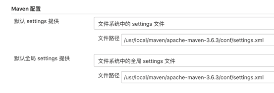
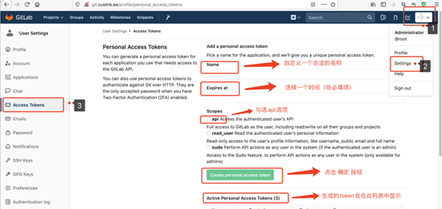
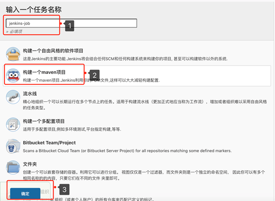
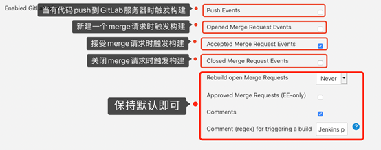
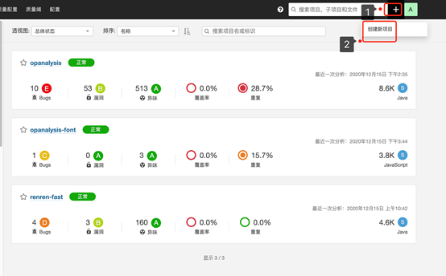
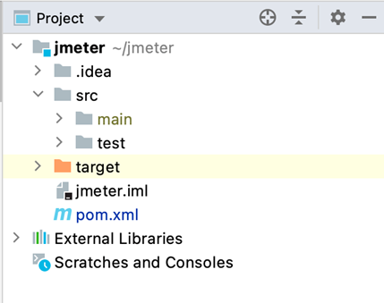

# Day119 jenkies


# 

## 一、持续集成相关概念

### 1.1、什么是持续集成？

随着软件开发复杂度的不断提高,团队开发成员间如何更好的协同工作以确保软件开发的质量已经成为开发过程中不可回避的问题。尤其是近年来敏捷开发在软件领域越来越火，如何能在不间断变化的需求中快速适应和保证软件的质量显得尤其重要。持续集成正是针对这一问题的一种软件开发实践。它倡导团队开发成员必须经常集成他们的工作，甚至每天都可能发生多次集成。而每次集成都是通过自动化的构建来验证，包括自动编译、发布和测试，从而尽快地发现集成错误，让团队能更快的开发内聚的软件。

### 1.2、持续集成的原则

- 需要版本控制工具来保障团队成员提交的代码不会导致集成失败。常用的版本控制工具有cvs、subversion、git、sourcesafe等；
- 开发人员需要及时向版本控制库中提交代码，也需要经常性地从版本控制库中更新代码到本地；
- 需要有专门的集成服务器来执行集成构建。根据项目的实际情况，集成构建可以通过代码仓库中代码的变动（如push事件、merge事件等）来自动触发构建，也可以定时启动构建，如每半小时构建一次；
- 必须保证构建的成功。如果构建失败，则修复构建过程中的错误将是优先级最高的工作。一旦修复，需手动启动一次构建。
- 一个自动构建过程，包括自动编译、分发、部署和测试等；
- 一个代码仓库，即需要版本控制工具来保障代码的可维护性，同时作为构建过程的素材库；
- 一个持续集成服务器。即将介绍的Jenkins就是一个配置简单和使用方便的持续集成服务器。

### 1.3、持续集成系统的组成

## 二、Jenkins简介和插件

### 2.1、Jenkins简介

Jenkins是一个开源项目，提供了一种易于使用的持续集成系统，使开发者从繁杂的集成中解脱出来，专注于更重要的业务逻辑实现上。同时Jenkins能实时监控集成中存在的错误，提供详细的日志文件和提醒功能，还能用图表的形式形象的展示项目构建的趋势和稳定性。

### 2.2、插件介绍

Jenkins提供了大量的插件，这些插件使Jenkins能实现很多复杂的功能。下面列出了部分持续集成所需的插件：

- Email Extension Plugin，邮件通知插件。例如，构建失败或成功后可以发送相关信息到指定的邮箱；
- Publish Over SSH ，用于远程服务器发布，将编译生成的jar、war等文件推送到远程服务器中指定的目录；
- Maven Integration plugin ，Maven集成插件，缺少此插件则新建任务时没有Maven Project选项；
- GitLab，用于从指定的代码仓库中拉取需要构建的代码；
- Sonar scanner，用于构建前或构建后对代码进行扫描；
- Git parameter，基于Git的参数化构建；
- HTML Publisher plugin，用于在Jenkins中配置HTML格式的报告；
- Groovy Label Assignment plugin，用于执行Groovy代码；
- NodeJS plugin，配置JavaScript的运行环境，作为前端代码的打包工具或构建工具；

### 2.3、插件安装

安装插件的步骤：在面板界面左侧的导航栏中选择Manager Jenkins ---> System Configuration ---> Manager Plugins，在插件管理页面中点击“可选插件”选项卡，然后在输入框中填写需要安装的插件名字。

## 三、全局工具配置

全局工具配置主要对一些常用工具的名称、版本、路径和配置文件进行设定。在面板左侧的导航栏中点击“系统管理”，进入到“管理Jenkins”界面，选择界面中的System Configuration ---> Global Tool Configuration后进入到“全局工具配置”界面，依次对Maven配置、JDK、Git、Maven、NodeJS、Sonar Scanner等进行配置。

### 3.1、Maven配置

主要用于Maven的主配置文件settings.xml的设定。settings.xml包含仓库镜像、本地镜像和认证信息等。一般默认的路径有两种：Global Maven Settings --- ${M2_HOME}/conf/settings.xml；User Maven Settings --- ${user.HOME}/.m2/settings.xml。如果两个文件都存在，会对内容进行合并，优先应用当前目录下settings.xml中的设定。

 [](https://img2020.cnblogs.com/blog/2281865/202109/2281865-20210924105046978-1775007201.png)

### 3.2、JDK

如果已经安装过JDK，这里需要配置JDK的JAVA_HOME。

[](https://img2020.cnblogs.com/blog/2281865/202109/2281865-20210924105101671-791320617.png)

### 3.3、Git

Git的配置也很重要，因为大多数的任务都要获取Git仓库中的代码，所以这里需要配置Git的执行路径。

 [](https://img2020.cnblogs.com/blog/2281865/202109/2281865-20210924105143851-1553579452.png)

### 3.4、Maven

主要用于配置Maven的主目录，可以添加多个，用Name来区分。如果系统中已经安装Maven，这里直接填写MAVEN_HOME对应的路径，Jenkins会在Master节点上进行检查，查看该目录是否有效。

 [](https://img2020.cnblogs.com/blog/2281865/202109/2281865-20210924105156647-1072477193.png)

### 3.5、SonarQube Scanner

SonarQube Scanner用于代码的静态质量扫描，可以自动安装，也可以手动将其安装在Master服务器上。这里采用的是自动安装，在“版本”下拉选框中选择所要安装的版本号即可。

[](https://img2020.cnblogs.com/blog/2281865/202109/2281865-20210924105213956-1431257972.png)

### 3.6、NodeJS

NodeJS是一个JavaScript的运行环境，作为打包工具或者构建工具。如果要在Jenkins中实现编译、打包前端代码，则需要安装此软件。

 [](https://img2020.cnblogs.com/blog/2281865/202109/2281865-20210924105231774-392835785.png)

## 四、系统配置

在Jenkins主面板左侧的导航栏中选择“系统管理”，进入到“管理Jenkins”界面，点击此界面中“系统配置”模块下的“系统配置”选项，进入到“配置”界面。

### 4.1、Jenkins Location

此项是可选的，指定安装Jenkins的HTTP地址。这个值用来在邮件中生产Jenkins链接。此项是有必要的，因为Jenkins无法探测到自己的URL地址。

[](https://img2020.cnblogs.com/blog/2281865/202109/2281865-20210924105249115-485766108.png)

### 4.2、SonarQube servers

配置SonarQube所在服务器的信息，建立Jenkins和SonarQube之间的通信。

**Name****：**自定义一个适合的名字；

**Server URL****：**SonarQube所在服务器的URL（IP或域名加端口，端口号默认为9000）；

**Server authentication token****：**这里填写SonarQube服务器当前用户的令牌。

[](https://img2020.cnblogs.com/blog/2281865/202109/2281865-20210924105317852-1709622024.png)

**SonarQube****令牌的生成方法：**登陆SonarQube服务器，选择“头像”--->“我的账号”--->“安全”--->在“生成令牌”文本框中输入自定义的名称，然后点击“生成”按钮。生成的令牌ID只会显示一次，所以如果有需要，可以进行备份

[](https://img2020.cnblogs.com/blog/2281865/202109/2281865-20210924105341793-429959655.png)

生成SonarQube当前用户的令牌ID后，回到Jenkins的系统配置界面，并定位到“SonarQube servers”模块，点击“Server authentication token”选项的“添加”按钮，选择“Jenkins”，进入到“添加凭据”窗口。

[](https://img2020.cnblogs.com/blog/2281865/202109/2281865-20210924105403425-1919608499.png)

**类型：**选择Secret text；

**Secret****：**填入SonarQube当前用户生成的令牌ID；

**ID****：**自定义一个名称。

填写完毕后，点击“添加”按钮，然后在“Server authentication token”的下拉选框中选择相应的凭据即可。

### 4.3、GitLab

配置将要构建的代码所在的GitLab服务器信息，建立Jenkins和GitLab服务器之间的通信。

[](https://img2020.cnblogs.com/blog/2281865/202109/2281865-20210924105420090-246951388.png)

**Connection name****：**自定义一个名称；

**Gitlab host URL****：**GItLab所在服务器的HTTP地址；

**Credentials****：**添加GitLab API token，该token由GItLab生成。

**GitLab API token****的生成方法：**进入GitLab主页，点击页面右上角的头像，在出现的悬框中点击“Settings”，进入到设置界面。在设置界面左侧的导航栏中点击“Access Token”，进入“Access Token”界面。

[](https://img2020.cnblogs.com/blog/2281865/202109/2281865-20210924105436839-1532843016.png)

**Name****：**自定义一个名称；

**Expires at****：**添加生成token的时间（非必填项）；

**Scopes****：**勾选api复选框；

**Create personal access token****：**点击此按钮后会生成一个token，且生成的token会展示在“Active Personal Access Tokens”列表中。

生成GitLab API token后，回到Jenkins的系统配置界面，并定位到GitLab模块。点击Credentials的“添加”按钮，选择“jenkins”，进入到“添加凭据”窗口。

[](https://img2020.cnblogs.com/blog/2281865/202109/2281865-20210924105451751-1796806753.png)

**类型：**选择GitLab API token；

**API token****：**填入在GitLab中生成的API token；

**ID****：**自定义一个名称（非必填项）。

所需的信息配置完毕后，点击“Test Connection”按钮，测试Jenkins和GitLab之间的连接是否成功。

[](https://img2020.cnblogs.com/blog/2281865/202109/2281865-20210924105507756-1284216623.png)

### 4.4、Publish over SSH

若要将构建后生成的jar包（后端）或dist目录文件（前端）推送到远程服务器中，需配置此模块。在此我们选择用户名和密码来连接远程服务器。

[](https://img2020.cnblogs.com/blog/2281865/202109/2281865-20210924105532784-678933402.png)

**Name****：**自定义一个名称。在Job中使用Publish over SSH插件时，此名称将出现在“SSH Server”中“Name”选项的下拉列表中；

**Hostname****：**服务器的主机名或IP地址；

**Username****：**服务器的用户名；

**Remote Directory****：**远程服务器上真实存在的目录，而且“Username”指定的用户要有访问此文件夹的权限，插件将把文件推送到此目录下；

**Use password authentication, or use a different key****：**勾选此选项，并在“Passphrase / Password”中输入与Username匹配的密码。

配置完后点击“Test Configuration”，测试是否可以连接成功。

 [](https://img2020.cnblogs.com/blog/2281865/202109/2281865-20210924105548202-44460103.png)

### 4.5、Extended E-mail Notification

在Jenkins的使用中邮件提醒是一个常用功能，Jenkins默认安装了 [Mailer Plugin](http://blog.csdn.net/houyefeng/article/details/50914582)插件用于实现此功能，但 [Mailer Plugin](http://blog.csdn.net/houyefeng/article/details/50914582)功能简单不能满足一些复杂需求，如：自定义邮件标题、内容等。Extended E-mail Notification(ext mail)是一个功能更为齐全，使用也更为复杂的插件。下面对此插件的配置做简要的说明。

 [](https://img2020.cnblogs.com/blog/2281865/202109/2281865-20210924105602503-2132527957.png)

[](https://img2020.cnblogs.com/blog/2281865/202109/2281865-20210924105609720-909415807.png)

**SMTP Server****：**SMTP服务器的地址；

**SMPT Port****：**SMTP的端口号，默认为25；

**SMTP Username****：**即在Jenkins Location模块中填写的“系统管理员邮件地址”；

**SMTP Password****：**“系统管理员邮件地址”所对应的密码；

**Default user E-mail suffix****：**默认的邮箱后缀；

**Default Content Type****：**默认的邮件内容格式；

**Default Recipients****：**默认收件人的邮箱地址（可填写多个，中间用英文逗号隔开即可）；

**Default Subject****：**邮件标题。例如，$PROJECT_NAME - Build # $BUILD_NUMBER - $BUILD_STATUS!。其中，$PROJECT_NAME为构建项目名称，$BUILD_NUMBER为构建编号，$BUILD_STATUS为构建状态；

Default Content：邮件内容；


```
 1 <!DOCTYPE html>  
 2 <html>  
 3 <head>  
 4 <meta charset="UTF-8">  
 5 <title>${ENV, var="JOB_NAME"}-第${BUILD_NUMBER}次构建日志</title>  
 6 </head>  
 7    
 8 <body leftmargin="8" marginwidth="0" topmargin="8" marginheight="4"  
 9     offset="0">  
10     <table width="95%" cellpadding="0" cellspacing="0"  
11         style="font-size: 11pt; font-family: Tahoma, Arial, Helvetica, sans-serif">  
12         <tr>  
13             <td>(本邮件由Jenkins系统自动发布，请勿回复！)</td>  
14         </tr>  
15         <tr>  
16             <td><h2>  
17                     <font color="#0000FF">构建结果 - ${BUILD_STATUS}</font>  
18                 </h2></td>  
19         </tr>  
20         <tr>  
21             <td><br />  
22             <b><font color="#0B610B">构建信息</font></b>  
23             <hr size="2" width="100%" align="center" /></td>  
24         </tr>  
25         <tr>  
26             <td>  
27                 <ul>  
28                     <li>项目名称： ${PROJECT_NAME}</li>  
29                     <li>构建编号： 第${BUILD_NUMBER}次构建</li>  
30                     <li>构建状态： ${BUILD_STATUS}</li>  
31                     <li>触发原因： ${CAUSE}</li>  
32                     <li>构建日志： <a href="${BUILD_URL}console">${BUILD_URL}console</a></li>  
33                     <li>构建  Url ： <a href="${BUILD_URL}">${BUILD_URL}</a></li>  
34                     <li>工作目录 ： <a href="${PROJECT_URL}ws">${PROJECT_URL}ws</a></li>  
35                     <li>项目  Url ： <a href="${PROJECT_URL}">${PROJECT_URL}</a></li>  
36                 </ul>  
37             </td>  
38         </tr>  
39         <tr>  
40             <td><b><font color="#0B610B">Changes Since Last  
41                         Successful Build:</font></b>  
42             <hr size="2" width="100%" align="center" /></td>  
43         </tr>  
44         <tr>  
45             <td>  
46                 <ul>  
47                     <li>历史变更记录 : <a href="${PROJECT_URL}changes">${PROJECT_URL}changes</a></li>  
48                 </ul> ${CHANGES_SINCE_LAST_SUCCESS,reverse=true, format="Changes for Build #%n:<br />%c<br />",showPaths=true,changesFormat="<pre>[%a]<br />%m</pre>",pathFormat="    %p"}  
49             </td>  
50         </tr>  
51         <tr>  
52             <td><b>Failed Test Results</b>  
53             <hr size="2" width="100%" align="center" /></td>  
54         </tr>  
55         <tr>  
56             <td><pre style="font-size: 11pt; font-family: Tahoma, Arial, Helvetica, sans-serif">$FAILED_TESTS</pre>  
57                 <br /></td>  
58         </tr>  
59         <tr>  
60             <td><b><font color="#0B610B">构建日志 (最后 100行):</font></b>  
61             <hr size="2" width="100%" align="center" /></td>  
62         </tr>  
63         <!-- <tr>  
64             <td>Test Logs (if test has ran): <a  
65                 href="${PROJECT_URL}ws/TestResult/archive_logs/Log-Build-${BUILD_NUMBER}.zip">${PROJECT_URL}/ws/TestResult/archive_logs/Log-Build-${BUILD_NUMBER}.zip</a>  
66                 <br />  
67             <br />  
68             </td>  
69         </tr> -->  
70         <tr>  
71             <td><textarea cols="80" rows="30" readonly="readonly"  
72                     style="font-family:Courier New">${BUILD_LOG, maxLines=100}  
```

 

## 五、创建Maven项目

### 5.1、新建任务

首先进入Jenkins主界面，在面板左侧的导航栏中点击“新建任务”，进入“新建任务”界面。

 [](https://img2020.cnblogs.com/blog/2281865/202109/2281865-20210924105848211-797073306.png)

进入“新建任务”界面后，在“任务名称”文本框中输入一个合法的名称（该名称最好能简短、清晰地描述所要构建的项目，且不能与已有的任务名称重合），然后选择“构建一个Maven项目”，点击左下角的“确定”按钮，进入任务配置界面。

[](https://img2020.cnblogs.com/blog/2281865/202109/2281865-20210924105858218-1508989699.png)

### 5.2、General

在“General”选项卡下勾选“丢弃旧的构建”，填写需要保留的构建天数和构建的最大个数。若不及时清理旧的构建，则会消耗服务器的磁盘空间。

 [](https://img2020.cnblogs.com/blog/2281865/202109/2281865-20210924105913859-1257279126.png)

### 5.3、源码管理

在“源码管理”模块中选择Git。无论是GitHub还是私有的GitLab，一般都支持两种模式：SSH模式和HTTP模式。

#### 5.3.1 HTTP模式

 [](https://img2020.cnblogs.com/blog/2281865/202109/2281865-20210924105930109-1250779267.png)

**Repository URL****：**要构建的项目在GitLab中的HTTP地址。首先进入到所要构建的项目在GitLab中的主界面，在项目的URL下拉选框中选择“HTTP”，并点击右侧的“复制”按钮，将复制的HTTP地址粘贴到“Repository URL”文本框中即可。

 [](https://img2020.cnblogs.com/blog/2281865/202109/2281865-20210924105944131-1268950796.png)

**Credentials****：**点击右侧的“添加”按钮，选择“Jenkins”选项后会弹出一个“添加凭据”弹窗。

 [](https://img2020.cnblogs.com/blog/2281865/202109/2281865-20210924105958404-974926790.png)

添加凭据时，类型选择“Username with password”，然后在“用户名”文本框中输入GitLab的登陆账户，“密码”文本框中输入与账户相匹配的密码，“ID”文本框中填入自定义的名称，但不能与已有的凭据ID重合。填写完毕后，点击“添加”按钮，所添加的凭据就会出现在“Credentials”的下拉选框中，在选框中选择相应的凭据即可。

[](https://img2020.cnblogs.com/blog/2281865/202109/2281865-20210924110012564-1440754574.png)

#### 5.3.2 SSH模式

首先登陆Jenkins所在的master服务器，检查在~/.ssh目录下是否有已生成的公钥和私钥。其中，公钥的文件名为id_rsa.pub，私钥的文件名为id_rsa。若公钥和私钥都存在，则将公钥拷贝到GitLab中，私钥拷贝到Jenkins中。

**1）****将公钥拷贝到****GitLab**

首先登陆到GitLab中，点击页面右上角的头像，选择Settings-->SSH Keys，进入到“SSH Keys”界面。

**Key****：**将Jenkins所在master服务器上的公钥（id_rsa.pub）拷贝到此文本框中；

**Title****：**填写一个适合的名称；

**Add key****：**点击此按钮将公钥添加到GitLab中；

**Your SSH keys****：**添加到GitLab的公钥会显示在此列表中。

[](https://img2020.cnblogs.com/blog/2281865/202109/2281865-20210924110034072-419630622.png)

**2****）添加****Jenkins****全局凭据**

首先登陆到Jenkins中，选择系统管理-->Manager Credentials-->全局凭据-->添加凭据，进入到“添加凭据”界面。

 [](https://img2020.cnblogs.com/blog/2281865/202109/2281865-20210924110050075-2103134983.png)[](https://img2020.cnblogs.com/blog/2281865/202109/2281865-20210924110054849-2012311823.png)

[](https://img2020.cnblogs.com/blog/2281865/202109/2281865-20210924110120253-974129517.png)

[](https://img2020.cnblogs.com/blog/2281865/202109/2281865-20210924110139400-2014396492.png)

**类型：**选择“SSH Username with private key”；

**ID****：**填写一个独一无二的名称；

**描述：**简短、清晰的描述此凭据的作用；

**Username****：**填写Master服务器的用户名，如root；

**Private Key****：**将Master服务器上的私钥（id_rsa）拷贝到此文本框中。

设置好全局凭据后，将GitLab中项目的SSH地址复制到Jenkins中相应job配置页面的“源码管理”模块中。在“Credentials”中选择相应的全局凭据。

[](https://img2020.cnblogs.com/blog/2281865/202109/2281865-20210924110209709-1187547085.png)

[](https://img2020.cnblogs.com/blog/2281865/202109/2281865-20210924110220803-574273690.png)

**Branches to build****：**要构建的代码在Git仓库中的分支名。由于我们要将dev分支（开发分支代码，具体名称视Gitlab中的情况而定）的代码merge到test分支（测试分支代码，具体名称视Gitlab中的情况而定）上，所以此处填写dev。若不需要在构建前执行merge操作，则此处填写实际要构建的代码分支名称即可。

[](https://img2020.cnblogs.com/blog/2281865/202109/2281865-20210924110246039-1346891836.png)

#### 5.3.3 Additional Behaviours

**1****）****Merge before build**

由于我们要在构建前将dev分支的代码merge到test分支上，因此要在“Additional Behaviours”中新增一个“Merge before build”模块。若不需要在构建前执行merge操作，则可省略此步骤。

[](https://img2020.cnblogs.com/blog/2281865/202109/2281865-20210924110305454-1473749797.png)

[](https://img2020.cnblogs.com/blog/2281865/202109/2281865-20210924110311414-927860491.png)

**Name of repository****：**远程代码仓库的名称，即所要构建的代码分支所在的仓库，默认填写origin即可；

**Branch to merge to****：**代码将要merge到的分支。由于我们要将dev分支的代码merge到test分支，因此该处填写test；

**Merge strategy****：**默认选择default即可；

**Fast-forward mode****：**默认选择--ff即可。

**2）****Custom user name/e-mail address**

当在任务中配置了“Merge before build”或向远程Git仓库中push版本标签时，会出现无法识别用户的情况，如下图所示：

[](https://img2020.cnblogs.com/blog/2281865/202109/2281865-20210924110344298-674295059.png)

要解决这个问题，需要在“Additional Behaviours”的“新增”下拉选框中选择“Custom user name/e-mail address”选项，添加Gitlab用户名和对应的电子邮箱。

[](https://img2020.cnblogs.com/blog/2281865/202109/2281865-20210924110358848-293618508.png)

**查看****Gitlab****用户名和电子邮箱的方法：**进入到Gitlab主页，点击右上角的头像，在出现的下拉选框中选择“Settings”进入到设置界面。在设置界面中即可看到用户名和对应的邮箱。然后将用户名和邮箱粘贴到“Custom user name/e-mail address”中相应的文本框中即可。

[](https://img2020.cnblogs.com/blog/2281865/202109/2281865-20210924110417811-966267244.png)

[](https://img2020.cnblogs.com/blog/2281865/202109/2281865-20210924110427692-1045544688.png)

### 5.4、构建触发器

若不需要自动触发项目进行构建，可忽略此步骤。

#### 5.4.1 Git事件触发构建

定位到 “构建触发器”模块，勾选“Build when a change is pushed to GitLab.”，并记下这一选项末尾的“GitLab webhook URL”。

[](https://img2020.cnblogs.com/blog/2281865/202109/2281865-20210924110502477-1300475494.png)

此外，还要点击该选项中的“高级”按钮，随后点击“Secret token”项的 “Generate” ，生成 Secret token。保存这里生成的 Secret token，它将用于后面 GitLab 的配置。

 [](https://img2020.cnblogs.com/blog/2281865/202109/2281865-20210924110516337-532220051.png)

下面对各项进行简要介绍：

**1****）****Enabled GitLab triggers**

**[](https://img2020.cnblogs.com/blog/2281865/202109/2281865-20210924110534329-730377639.png)**

**Push Events****：**当有代码Push到Git仓库时，自动触发Jenkins构建；

**Opened Merge Request Events****：**当在Git中新建一个Merge请求时，自动触发Jenkins构建；

**Accepted Merge Request Events****：**当在GitLab中建立的Merge请求被接受后，自动触发Jenkins构建。例如，在GItLab中，当dev01分支的代码请求merge到dev分支时，若此请求被成功处理，就会触发Jenkins自动构建，Jenkins会将dev分支的代码merge到test分支；

**Closed Merge Request Events****：**当在GitLab中建立的Merge请求被关闭时，自动触发Jenkins构建。

**2****）****保持默认选项**

[](https://img2020.cnblogs.com/blog/2281865/202109/2281865-20210924110553494-1896202007.png)

**3****）****Allowed branches**

此项用于筛选可以触发任务自动构建的代码分支。勾选“Filter branches by name”，在“inclued”文本框中填写允许自动触发任务构建的代码分支名称，名称之间用英文逗号分隔。

[](https://img2020.cnblogs.com/blog/2281865/202109/2281865-20210924110613769-1796789077.png)

**配置****GitLab****：**此处以merge触发为例，即当Git仓库中发生Merge事件时，触发Jenkins自动构建。打开GItLab，进入到相应的项目页面中，在页面左侧的导航栏中选择Settings--->Integrations，进入到“[Integrations Settings](http://git.cuslink.ee/root/test-project/settings/integrations)”界面。在该界面中，在“URL”文本框中输入“GitLab webhook URL”尾部的HTTP地址；在“Secret Token”中输入在Jenkins中生成的Secret token；在“Trigger”中勾选“Merge Request events”，然后点击“Add Webhook”按钮。

[](https://img2020.cnblogs.com/blog/2281865/202109/2281865-20210924110626393-334924877.png)

点击“Add webhook”按钮后，添加的webhook会出现在“webhooks”列表中。在列表中选择新添加的webhook，在其右边的“Test”下拉列表中选择相应的Trigger（即Merge requests events），点击后在页面上方如果出现“Hook executed successfully：HTTP 200”的提示，则表明配置成功。

[](https://img2020.cnblogs.com/blog/2281865/202109/2281865-20210924110641752-1855081733.png)

**在****GitLab****中建立****Merge****请求。**首先，登陆GitLab服务器，选择相应的项目并进入到该项目页面，在页面左侧的导航栏中选择“Merge Requests”，进入到“Merge Requests”界面。在该界面的右上角点击“New Merge Request”，新建一个Merge请求。

[](https://img2020.cnblogs.com/blog/2281865/202109/2281865-20210924110654762-1724554535.png)

在Merge请求页面中，选择相应的源项目、目标项目，以及源分支和目标分支。

 [](https://img2020.cnblogs.com/blog/2281865/202109/2281865-20210924110708274-2036934678.png)

点击“Compare branches and continue”，会进入到下一个页面，在此页面中可以填写更为详细的merge requests信息。

[](https://img2020.cnblogs.com/blog/2281865/202109/2281865-20210924110722327-1375302108.png)

点击“Submit合并请求”按钮，进入下一个页面，在该页面中可以编辑或关闭此次merge请求。

[](https://img2020.cnblogs.com/blog/2281865/202109/2281865-20210924110738823-1866396405.png)

当所指定的源分支中的代码发生更改后（即执行了git commit命令），在此页面中会出现一个“Merge”按钮。点击此按钮后，源分支上的代码就会被merge到目标分支上。同时，会触发Jenkins自动执行构建任务，将dev分支上的代码merge到test分支上。

[](https://img2020.cnblogs.com/blog/2281865/202109/2281865-20210924110754776-1180842358.png)

#### 5.4.2 定时构建

定时构建的选项包括“轮询SCM”和“定时构建”。定时构建适用于每日构建或每周构建的任务，可以通过设定具体的时间点和时间段来执行指定的任务。构建任务的内容填写在“日程表”文本框中，而且填写完毕后下方还会提示上次运行和下次运行的时间点，用于验证配置是否正确。

[](https://img2020.cnblogs.com/blog/2281865/202109/2281865-20210924110809738-675133882.png)

**定时构建的语法是***** \* \* \* \*****。**

- 第一个*表示分钟，取值范围是0~59。例如，5 * * * *表示每个小时的第5分钟会构建一次；H/15 * * * *或*/15 * * * *表示每隔15分钟构建一次；
- 第2个*表示小时，取值范围是0~23。例如，H 8 * * *表示每天8点构建一次；H 8-18/2 * * *表示每天8到18点每隔2个小时构建一次；H 8,12,22 * * *表示每天8点、12点、22点分别构建一次；
- 第3个*表示每月的第几天，取值范围是1~31。H 8 4 * * 表示在每个月第4天的第8点构建一次；
- 第4个*表示第几个月，取值范围是1~12。H 8 4 3 *表示在每年3月的第4天的8点构建一次；
- 第5个*表示一周中的第几天，取值范围是0~7，其中0和7表示的都是周日。例如，H 8-18/2 * * 1-5表示周一到周五每天8点~18点每隔两小时构建一次。

#### 5.4.3 其它工程构建后触发

当所要构建的两个或多个项目之间存在关联时，可以勾选此选项。在“关注的项目”文本框中可以填写多个已存在的项目，项目之间用英文的逗号分隔。例如，任务B要在任务A构建成功后自动构建，可在“关注的项目”文本框中填写A，同时选择“只有构建稳定时触发”，即只有项目A成功构建才会自动触发B构建。

[](https://img2020.cnblogs.com/blog/2281865/202109/2281865-20210924110829464-936662418.png)

### 5.5、构建环境

#### 5.5.1 构建前清理工作空间

若要在构建前清理工作空间，以免工作空间中的内容对本次构建产生影响和及时清理磁盘空间，可勾选“Delete workspace before build starts”选项。

[](https://img2020.cnblogs.com/blog/2281865/202109/2281865-20210924110845534-17061885.png)

#### 5.5.2 生成格式化的版本号

Jenkins默认的构建版本号只是简单的构建总次数，不包含有年月日及当日构建次数等信息，可勾选“Create a formatted version number”选项自定义所需要的构建版本号。

[](https://img2020.cnblogs.com/blog/2281865/202109/2281865-20210924110858141-1772261847.png)

**Environment Variable Name****：**填写一个合适的名称，此名称可作为全局环境变量被引用；

**Version Number Format String****：**填写自定义的格式化构建版本号，如${JOB_NAME}_${BUILD_DATE_FORMATTED, "yyyyMMdd"}_${BUILDS_TODAY}，其中，${JOB_NAME}为项目名称，${BUILD_DATE_FORMATTED, "yyyyMMdd"}为格式化后的日期，${BUILDS_TODAY}为今日构建次数；

**Skip Builds worse than****：**当本次构建任务的状态比此处所选的还要糟糕时，则本次构建不计入构建总次数。例如，此处选择“SUCCESS”，但本次任务的构建状态为“FAILURE”，则本次构建不计入今日（或周、月、年）构建总次数；

**Build Display Name****：**当勾选“Use the formatted version number for build display name”时，自定义的构建版本号会替代原来的“#XXX”显示在任务栏中，如下图所示。

[](https://img2020.cnblogs.com/blog/2281865/202109/2281865-20210924110918063-604085530.png)

其他选项保持默认即可。

### 5.6、Pre Build

若构建前要利用Sonar Scanner对代码执行静态质量扫描操作，则需要在“Add pre-build step”下拉选框中选择“Execute SonarQube Scanner”选项。

 [](https://img2020.cnblogs.com/blog/2281865/202109/2281865-20210924110934309-1951115771.png)

[](https://img2020.cnblogs.com/blog/2281865/202109/2281865-20210924110940547-322455329.png)

**下面对** **“Execute SonarQube Scanner”****各项做简要的介绍：**

**Task to run****：**自定义一个名称（非必填项）；

**JDK****：**在 JDK 选择框中选择 SonarQube Scanner 使用的 JDK（注意这里必须是 JDK 不能是 JRE）；

**Path to project properties****：**非必填项。这里可以指定一个 sonar-project.properties 文件，如果不指定的话会使用项目默认的 properties 文件；

**Analysis properties****：**这里需要输入一些配置参数用来传递给 SonarQube，这里的参数优先级高于sonar-project.properties文件里面的参数，所以可以在这里来配置所有的参数以替代 sonar-project.properties 文件。下面介绍一些常用的参数：

- sonar.login=admin：sonarqube用户名，默认为admin；
- sonar.password=admin：与sonarqube用户名相匹配的密码，默认为admin；
- sonar.projectKey=opanalysis：在sonarqube界面中创建项目时填写的“项目标识”；
- sonar.projectName=opanalysis：在sonarqube界面中创建项目时填写的“显示名”；
- sonar.language=java：指定要分析的开发语言（特定的开发语言对应了特定的规则）；
- sonar.projectVersion=$BUILD_VERSION：项目版本，可使用Jenkins环境变量；
- sonar.sourceEncoding=UTF-8：源码的编码格式；
- sonar.sources=$WORKSPACE：指定需要分析的源码位置。这里的$WORKSPACE 所指示的是当前Jenkins项目的目录，即相对于jenkins的workspace路径；
- sonar.java.binaries=$WORKSPACE：指定需要分析的代码编译后生成的class文件的位置，相对于jenkins的workspace路径。

**Additional arguments****：**非必填项。此输入框中可以输入一些附加的参数，示例中的-X意思是进入SonarQube Scanner的Debug模式，这样会输出更多的日志信息；

**JVM Options****：**非必填项。可以输入在执行 SonarQube Scanner 时需要的JVM参数。

**projectKey****和****projectName****的生成方法：**生成sonar.projectKey和sonar.projectName时需要登陆SonarQube界面。在SonarQube界面中新建一个项目时，会要求输入“项目标识”和“显示名”，“项目标识”即“sonar.projectKey”，“显示名”即“sonar.projectName”。

**在****SonarQube****界面中新建项目的步骤：**

 [](https://img2020.cnblogs.com/blog/2281865/202109/2281865-20210924111014742-949692923.png)

 [](https://img2020.cnblogs.com/blog/2281865/202109/2281865-20210924111021617-1301489368.png) 

 [](https://img2020.cnblogs.com/blog/2281865/202109/2281865-20210924111035412-1645770866.png)

[](https://img2020.cnblogs.com/blog/2281865/202109/2281865-20210924111045371-1289656799.png)

### 5.7、Build

**Root POM****：**最上层pom.xml文件的路径，这里是相对于${WORKSPACE}的路径。如果不做设置，默认是在工作目录的根目录下，填写pom.xml即可。如果不是默认路径，例如，在${WORKSPACE}/my-project/pom.xml下，这里写上/my-project/pom.xml。

**Goals and options****：**这里就是mvn指令后面的部分，如clean package，也可以带参数。比如，要跳过单元测试，就使用-Dmaven.test.skip=true。

[](https://img2020.cnblogs.com/blog/2281865/202109/2281865-20210924111134565-407242216.png)

### 5.8、构建后操作

在“构建后操作步骤”中添加“Git Publisher”和“Send build artifacts over SSH”。其中，“Git Publisher”的作用是将在Jenkins中merge后的代码push到远程仓库中相应的分支。“Send build artifacts over SSH”的作用是将编译打包后的文件（如war包、jar包）推送到远程服务器。

 [](https://img2020.cnblogs.com/blog/2281865/202109/2281865-20210924111150702-1573098181.png)

#### 5.8.1 Git Publisher

**Branch to push****：**代码merge成功后要push到的分支的名称。在我们的示例中，Jenkins在执行构建任务时，将dev分支上的代码merge到了test分支上。merge成功后，还需要将合并后的代码push到远程仓库中指定的分支上。此处我们将合并后的代码push到了test分支上；

**Target remote name****：**远程代码仓库的名称，即上面所填写的代码分支所在的Git仓库。

[](https://img2020.cnblogs.com/blog/2281865/202109/2281865-20210924111204906-1136535353.png)

**Tags****：**在将merge后的代码push到远程仓库中指定的分支时，还可以为此次提交的代码打上一个tag，此tag也会同时被push到远程仓库中。点击“Add Tags”按钮，填写相应的配置信息。

[](https://img2020.cnblogs.com/blog/2281865/202109/2281865-20210924111217924-1678297599.png)

#### 5.8.2 Send build artifacts over SSH

在这个模块中配置相应的信息，将构建后编译生成的jar包推送到远程服务器上指定的目录。也可编写shell脚本，对应用进行部署。

**Name****：**选择在Jenkins“系统管理--->系统设置”中设置的SSH Server的名字；

**Source files****：**拷贝到远程服务器上的文件。需要上传的文件必须位于当前的workspace中，否则会上传失败。如果只执行命令而不需要传输文件时，此处可为空；

**Remove prefix****：**在“Source files”配置的路径中要移除的前缀。在Source files文本框中填入的地址，会默认在服务器下创建相同的目录，所以要将我们不需要的前缀在这里剔除掉，只传输XXX.jar；

**Remote directory****：**远程服务器接收文件的目录，此目录是相对于“SSH Server”中的“Remote directory”的，如果不存在将会自动创建；

**Exec command****：**文件传输任务执行完毕后，在远程服务器上执行的脚本（可填写脚本所在目录）。

[](https://img2020.cnblogs.com/blog/2281865/202109/2281865-20210924111234974-411252089.png)

Exec command中的脚本：


```
 1 #! /bin/bash
 2 #!/bin/bash
 3 export PROJECT_HOME="/opt/opanalysis"
 4 export JAR_HOME="$PROJECT_HOME/new-jar"
 5 export BACKUP_HOME="$PROJECT_HOME/backup-jar"
 6 export ANALYSIS=op-analysis.jar
 7 export TEAMBITION=op-teambition.jar
 8 export CAS=op-cas.jar
 9 export GATEWAY=op-gateway.jar
10 export LOG_HOME="/opt/opanalysis/logs"
11 export ANALYSIS_log="$LOG_HOME/op-analysis.log"
12 export TEAMBITION_log="$LOG_HOME/op-teambition.log"
13 export CAS_log="$LOG_HOME/op-cas.log"
14 export GATEWAY_log="$LOG_HOME/op-gateway.log"
15 BACKUP_FILE=v${BUILD_VERSION}_$(date +%Y-%m-%d_%H:%M:%S)
16 echo "****** Backup old jar ******"
17 mkdir $BACKUP_HOME/$BACKUP_FILE
18 cp $JAR_HOME/*.jar $BACKUP_HOME/$BACKUP_FILE
19 echo "****** Remove old jar ******"
20 find $JAR_HOME -type f -name "*.jar" -print0 | xargs -0 rm -rf
21 echo "****** Copy new jar ******"
22 cp $PROJECT_HOME/op-analysis/target/$ANALYSIS $JAR_HOME
23 cp $PROJECT_HOME/op-teambition/target/$TEAMBITION $JAR_HOME
24 cp $PROJECT_HOME/op-cas/target/$CAS $JAR_HOME
25 cp $PROJECT_HOME/op-gateway/target/$GATEWAY $JAR_HOME
26 if [ -e $JAR_HOME/$ANALYSIS -a -e $JAR_HOME/$TEAMBITION -a -e $JAR_HOME/$CAS -a -e $JAR_HOME/$GATEWAY ]; then
27     echo "The new jars were successfully replicated"
28 else
29     echo "The new jars replication failed"
30     exit 1
31 fi
32 echo "****** Stop the old processes ******"
33 P_ID=$(ps -ef | grep -w $ANALYSIS | grep -v "grep" | awk '{print $2}')
34 if [ "$P_ID" == "" ]; then
35     echo "$ANALYSIS process does not exist or has stopped successfully"
36 else
37     kill -9 $P_ID
38     echo "$ANALYSIS was successfully killed"
39 fi      
40 P_ID=$(ps -ef | grep -w $TEAMBITION | grep -v "grep" | awk '{print $2}')
41 if [ "$P_ID" == "" ]; then
42     echo "$TEAMBITION process does not exist or has stopped successfully"
43 else
44     kill -9 $P_ID
45     echo "$TEAMBITION was successfully killed"
46 fi      
47 P_ID=$(ps -ef | grep -w $CAS | grep -v "grep" | awk '{print $2}')
48 if [ "$P_ID" == "" ]; then
49     echo "$CAS process does not exist or has stopped successfully"
50 else
51     kill -9 $P_ID
52     echo "$CAS was successfully killed"
53 fi     
54 P_ID=$(ps -ef | grep -w $GATEWAY | grep -v "grep" | awk '{print $2}')
55 if [ "$P_ID" == "" ]; then
56     echo "$GATEWAY process does not exist or has stopped successfully"
57 else
58     kill -9 $P_ID
59     echo "$GATEWAY was successfully killed"
60 fi
61 echo "****** Old processes stop success ******"
62 echo "****** Start op-analysis.jar... ******"
63 nohup java -jar $JAR_HOME/$ANALYSIS > $ANALYSIS_log 2>&1 &
64 EXEXUTE_STATUS_ANALYSIS=$?
65 sleep 10
66 if [ $EXEXUTE_STATUS_ANALYSIS -eq 0 -a $(ps -ef | grep -w $ANALYSIS | grep -v "grep" | wc -l) -ne 0 ]; then
67     echo "$ANALYSIS started successfully"
68 else
69     echo "$ANALYSIS failed to start"
70 fi
71 echo "****** Start op-teambition.jar... ******"
72 nohup java -jar $JAR_HOME/$TEAMBITION > $TEAMBITION_log 2>&1 &
73 EXECUTE_STATUS_TEAMBITION=$?
74 sleep 10
75 if [ $EXECUTE_STATUS_TEAMBITION -eq 0 -a $(ps -ef | grep -w $TEAMBITION | grep -v "grep" | wc -l) -ne 0 ]; then
76     echo "$TEAMBITION started successfully"
77 else
78     echo "$TEAMBITION failed to start"
79 fi
80 echo "****** Start op-cas.jar... ******"
81 nohup java -jar $JAR_HOME/$CAS > $CAS_log 2>&1 &
82 EXECUTE_STATUS_CAS=$?
83 sleep 10
84 if [ $EXECUTE_STATUS_CAS -eq 0 -a $(ps -ef | grep -w $CAS | grep -v "grep" | wc -l) -ne 0 ]; then
85     echo "$CAS started successfully"
86 else
87     echo "$CAS failed to start"
88 fi
89 echo "****** Start op-gateway.jar... ******"
90 nohup java -jar $JAR_HOME/$GATEWAY > $GATEWAY_log 2>&1 &
91 EXECUTE_STATUS_GATEWAY=$?
92 sleep 10
93 if [ $EXECUTE_STATUS_GATEWAY -eq 0 -a $(ps -ef | grep -w $GATEWAY | grep -v "grep" | wc -l) -ne 0 ]; then
94     echo "$GATEWAY started successfully"
95 else
96     echo "$GATEWAY failed to start"
97 fi
98 echo "****** Over ******" 
```

#### 5.8.3 Editable Email Notification

在“增加构建后操作步骤”下拉选框中选择“Editable Email Notification”，选择后会在“构建后操作”中出现“Editable Email Notification”模块。

 [](https://img2020.cnblogs.com/blog/2281865/202109/2281865-20210924111402887-1634171048.png)

 [](https://img2020.cnblogs.com/blog/2281865/202109/2281865-20210924111407016-226307949.png)

 [](https://img2020.cnblogs.com/blog/2281865/202109/2281865-20210924111414049-994451819.png)

[](https://img2020.cnblogs.com/blog/2281865/202109/2281865-20210924111421217-1551464021.png)

## 六、分布式构建

### 6.1、Jenkins运行模式--Master/Slave

Jenkins支持Master/Slave这种分布式运行模式。将安装Jenkins的机器作为Master节点，然后用户通过界面配置来添加Slave节点。在用户配置具体任务的时候可以选择Master机器本身或者某个Slave节点来运行。Jenkins在实际运行任务的时候，将作业分布到指定的Master或Slave节点上，使得单个节点安装的Jenkins服务器能够管理多个节点，运行大批量的任务，以及为它们提供不同的系统环境和配置。

### 6.2、通过界面添加Slave节点

创建和配置Jenkins Slave节点。选择 系统管理-->节点管理--->新建节点 选项，可以创建全新的Slave节点，也可以从已有的Jenkins节点复制。

[](https://img2020.cnblogs.com/blog/2281865/202109/2281865-20210924111501201-1308557720.png)

#### 6.2.1 配置节点的一些基本信息

[](https://img2020.cnblogs.com/blog/2281865/202109/2281865-20210924111512450-877898846.png)

**名称：**节点独一无二的名称，自行命名；

**描述：**节点的描述；

**执行器数量：**在该节点可以并行运行的最大任务数量，建议和CPU的内核数相等，这里设置的值太高会导致节点负荷过大，在运行多个任务时，任务执行耗时过长；

**远程工作目录：**指定Slave节点的workspace目录，但是一些重要的数据会保存在Master节点上，一些源码和文件会直接放置在运行的Slave节点上，因此这里需要指定一个目录；

**标签：**用来表示节点的群组。例如，如果节点都是Windows系统的节点，可以提供“Windows Node”作为标签，在配置任务时可以不用指定具体的节点，而指定对应的群组；

**用法：**节点有两种使用模式。默认是Use this node as much as possible。在这种模式下，如果任务没有指定具体的运行节点，那么会随机指派一个可用节点。当节点配置为这种模式时，在需要的时候可以被Jenkins随机调用。还有一种模式是Only build jobs with label expressions matching this node。在这种模式下，只有当任务指定使用该节点时，才会使用该节点，可以用于资源受严格控制的场景及专门用于某些任务。

#### 6.2.2 Master节点和Slave节点的连接方式

这里主要介绍Launch slave agents via SSH连接方式（配置节点前必须安装SSH Agent Plugin插件，否则不能出现Launch slave agents via SSH选项）。

[](https://img2020.cnblogs.com/blog/2281865/202109/2281865-20210924111529390-439760319.png)

**启动方式：**选择Launch slave agents via SSH；

**主机：**填写Slave机器的IP地址；

**Credentials****：**添加凭证信息

[](https://img2020.cnblogs.com/blog/2281865/202109/2281865-20210924111543882-1874235039.png)

类型：选择SSH Username with private key；

ID：填写一个独一无二的ID名；

描述：填写能清楚描述此凭证的信息；

Username：填写Master节点所在服务器的用户名；

Private Key：填写Master节点所在服务器的私钥。

在配置Slave节点信息之前，需要将Master节点服务器上的公钥推送到Slave节点服务器上：


```
 1 # 生成公钥和私钥
 2 ssh-keygen -t rsa
 3 # 进入到公钥和私钥所在的目录  
 4 cd ~/.ssh  
 5 # 查看生成的公钥
 6 cat id_rsa.pub
 7 # 查看生成的私钥 
 8 cat id_rsa
 9 # 将公钥推送到Slave节点服务器上
10 ssh-copy-id -i ~/.ssh/id_rsa.pub root@172.16.239.51  
```

若没有登陆Master节点服务器的权限，可以在Slave节点所在服务器的～/.ssh目录下新建一个authorized_keys的文件，并将Master节点服务器的公钥粘贴在此文件中。

### 6.3、配置节点的工具执行路径

在系统的全局配置中，我们会设定一些工具的执行路径。如果在Slave节点上工具的执行路径与全局配置不同，就需要重新选择工具名称，给予新的路径，覆盖全局配置中的默认路径。建议在系统的全局工具配置中已有的工具都要在Slave节点所在的服务器上安装，否则构建任务的时候会出错。

[](https://img2020.cnblogs.com/blog/2281865/202109/2281865-20210924111647004-2124729166.png)

### 6.4、在Slave节点上运行任务

选择一个要在Slave节点上运行的任务，进入到其设置界面，定位到界面中的General模块，勾选“限制项目的运行节点”，在出现的文本框中输入Slave节点的名称，应用并保存该配置，当构建该任务时，会自动在该Slave节点上运行。

[](https://img2020.cnblogs.com/blog/2281865/202109/2281865-20210924111700712-901196664.png)

### 6.5、构建过程中可能出现的问题

（1）无法从远程Git仓库中拉取代码

需要将GitLab所在服务器的IP地址和对应的域名添加到Slave服务器的hosts文件中：


```
# 编辑hosts文件
vim /etc/hosts  
```

[](https://img2020.cnblogs.com/blog/2281865/202109/2281865-20210924111743785-1094546391.png)

（2）无法将Sonar Scanner的代码扫描结果发送到Sonar Qube上进行展示

需要将Sonar Qube的用户名和对应的登陆密码添加到Analysis properties中：

[](https://img2020.cnblogs.com/blog/2281865/202109/2281865-20210924111810723-1623531603.png)

（3）无法找到Maven的配置文件

在slave服务器中，maven的配置文件（settings.xml）的路径需要和master服务器上的路径一致，否则构建时会出错。

[](https://img2020.cnblogs.com/blog/2281865/202109/2281865-20210924111825846-1244082180.png)

## 七、前端项目构建和部署

在对前端项目进行构建之前，需要在Jenkins的Master服务器上安装NodeJs、在Jenkins上安装NodeJS插件。此外还要在测试服务器上安装Nginx。

进入到测试服务器，在nginx的安装目录下找到nginx.conf文件，并使用vim命令对该文件进行编辑。

[](https://img2020.cnblogs.com/blog/2281865/202109/2281865-20210924111843874-665630531.png)

[](https://img2020.cnblogs.com/blog/2281865/202109/2281865-20210924111850458-2019413673.png)

### 7.1、新建任务

首先进入Jenkins主界面，在面板左侧的导航栏中点击“新建任务”，进入“新建任务”界面。

 [](https://img2020.cnblogs.com/blog/2281865/202109/2281865-20210924111913470-2099345352.png)

进入“新建任务”界面后，在“任务名称”文本框中输入一个合法的名称（该名称最好能简短、清晰地描述所要构建的项目，且不能与已有的任务名称重合），然后选择“构建一个自由风格的软件项目”，点击左下角的“确定”按钮，进入任务配置界面。

[](https://img2020.cnblogs.com/blog/2281865/202109/2281865-20210924111927692-1689064693.png)

### 7.2、General

请参考5.2节

### 7.3、源码管理

请参考5.3节

### 7.4、构建触发器

请参考5.4节

### 7.5、构建环境

前端代码在构建时需要NodeJS进行编译、打包，所以要在“构建环境”中配置NodeJS环境。安装NodeJS插件后，会在“构建环境”模块中出现“Provide Node & npm bin/ folder to PATH“选项，勾选此选项。

[](https://img2020.cnblogs.com/blog/2281865/202109/2281865-20210924112018135-1556703105.png)

**NodeJS Installation****：**在“全局工具配置”界面中指定NodeJS安装路径时所填写的名称会出现在此下拉列表中，在列表中选择所需的名称即可；

**npmrc file****：**选择“- use system default –”；

**Cache location****：**选择“Default (~/.npm or %APP_DATA%\npm-cache)”。

“构建环境”模块中的其他选项配置请参考5.5节。

### 7.6、构建

#### 7.6.1 执行shell

在“构建”模块的“增加构建步骤”下拉选框中选择“执行shell”选项，然后在“执行shell”的“命令”文本框中输入编译、打包前端代码的命令。

[](https://img2020.cnblogs.com/blog/2281865/202109/2281865-20210924112042511-513996823.png)

[](https://img2020.cnblogs.com/blog/2281865/202109/2281865-20210924112059582-253374599.png)

命令如下：


```
 1 #!/bin/bash
 2 export WORKSPACE_HOME="/var/lib/jenkins/workspace/operation-analysis-front"
 3 # 进入项目的工作空间  
 4 cd $WORKSPACE_HOME
 5 # 执行npm install后，npm会根据在package.json中对各种依赖的定义去安装这些依赖  
 6 npm install
 7 # 打包项目代码。打包完成后会生成一个dist目录，所要部署的文件就存放在dist目录下  
 8 npm run test
 9 # 进入到dist目录 
10 cd $WORKSPACE_HOME/dist
11 # 删除旧的压缩文件  
12 rm -f dist.tar.gz
13 # 对新的部署文件进行打包压缩  
14 tar -zcvf dist.tar.gz *  
```

#### 7.6.2 Execute SonarQube Scanner

请参考5.6节。不同的是前端代码的扫描对象为JavaScript，因此代码语言要设置成js，即sonar.language=js。

[](https://img2020.cnblogs.com/blog/2281865/202109/2281865-20210924112344451-186611554.png)

### 7.7、构建后操作

#### 7.7.1 Git Publisher

请参考5.8.1节

#### 7.7.2 Send build artifacts over SSH

在这个模块中配置相应的信息，将构建后编译生成的dist目录下的部署文件推送到远程服务器上指定的目录。

**Name****：**选择在Jenkins“系统管理--->系统设置”中设置的SSH Server的名字；

**Source files****：**拷贝到远程服务器上的文件。需要上传的文件必须位于当前的workspace中，否则会上传失败。可填写相对于workspace的路径名。例如，由于我们将dist目录下的文件打包成了一个压缩包，所以此处填写dist/dist.tar.gz即可；

**Remove prefix****：**在“Source files”配置的路径中要移除的前缀。在Source files文本框中填入的地址，会默认在服务器中创建相同的目录，所以要将我们不需要的前缀在这里剔除掉，例如，去掉dist；

**Remote directory****：**远程服务器接收文件的目录，此目录是相对于“SSH Server”中的“Remote directory”的，如果不存在将会自动创建；

**Exec command****：**文件传输任务执行完毕后，在远程服务器上执行的脚本（可填写脚本所在目录）。

[](https://img2020.cnblogs.com/blog/2281865/202109/2281865-20210924112411033-902994404.png)

Exec command中的脚本如下：


```
 1 #!/bin/bash  
 2 export PROJECT_HOME="/usr/local/operation_analysis/op-web-package"  
 3 export DIST_HOME="$PROJECT_HOME/dist"  
 4 export BACKUP_HOME="$PROJECT_HOME/backup-dist"  
 5 export TARGET_HOME="/opt/opanalysis-front"  
 6 BACKUP_FILE="v${BUILD_VERSION}_$(date +%Y-%m-%d_%H:%M:%S)"  
 7 echo "****** Backup old dist ******"  
 8 mkdir $BACKUP_HOME/$BACKUP_FILE  
 9 cp -r $DIST_HOME $BACKUP_HOME/$BACKUP_FILE  
10 echo "****** Remove old dist ******"  
11 rm -rf $DIST_HOME/*
12 echo "****** Copy new dist ******"  
13 mv $TARGET_HOME/dist.tar.gz $DIST_HOME  
14 tar -zxvf $DIST_HOME/dist.tar.gz -C $DIST_HOME  
15 rm -rf $DIST_HOME/dist.tar.gz  
```

## 八、SonarQube的安装

### 1、配置JDK


```
useradd java
passwd java
cd /home/java
wget https://www.oracle.com/webapps/redirect/signon?nexturl=https://download.oracle.com/otn/java/jdk/8u271-b09/61ae65e088624f5aaa0b1d2d801acb16/jdk-8u271-linux-x64.tar.gz
tar -zxvf jdk-8u271-linux-x64.tar.gz  
vim /etc/profile  
export JAVA_HOME=/home/java/jdk1.8.0_271  
export PATH=$JAVA_HOME/bin:$PATH  
source /etc/profile  
java -version
ln -s /home/java/jdk1.8.0_271/bin/java /usr/bin/java
```

### 2、下载并安装SonarQube


```
wget https://binaries.sonarsource.com/Distribution/sonarqube/sonarqube-7.6.zip
cp sonarqube-7.6 /opt  
cd /opt/sonarqube/conf
# 修改sonar的配置文件
vim sonar.properties 
sonar.jdbc.username=sonar  
sonar.jdbc.password=sonar
sonar.login=admin
sonar.password=admin  
sonar.jdbc.url=jdbc:mysql://localhost:3306/sonar?useUnicode=true&characterEncoding=utf8&rewriteBatchedStatements=true&useConfigs=maxPerformance&useSSL=false
# 添加sonar用户（必须以非root用户启动sonarqube）
useradd sonar
passwd sonar  
chown -R sonar:sonar /opt/sonarqube/
chmod -R 755 /opt/sonarqube
su sonar
# 启动sonarqube
cd /opt/sonarqube/bin/linux-x86-64/  
./sonar.sh console
```

安装过程中可能会出现的问题：

1）Encounteredanerrorrunningmain:java.nio.file.AccessDeniedExcepti

解决办法：删除sonarqube/temp、sonarqube/logs目录下的所有文件即可；

2）java.sql.SQLException:CannotcreatePoolableConnectionFactory(Accessdenied)

数据库账号授权有问题。

解决办法：删除sonar的库表，账号，重新进行建表与授权。

安装sonar-scanner：

cd /usr/local

\# 下载sonar scanner

wget https://binaries.sonarsource.com/Distribution/sonar-scanner-cli/sonar-scanner-cli-4.4.0.2170-linux.zip

\# 解压

tar -zxvf sonar-scanner-cli-4.4.0.2170-linux.zip

\# 进入到配置文件目录下

cd sonar-scanner-4.4.0.2170-linux/conf

\# 修改sonar-scanner.properties文件：

sonar.host.url=http://localhost:9000（localhost修改为sonarqube所在的IP地址）

 

## 九、安装MySQL


```
[root@localhost /]# rpm -qa | grep mysql  
# 若已安装了MySQL，执行删除命令  
[root@localhost /]# rpm -e --nodeps mysql-libs-5.1.73-5.el6_6.x86_64  
# 再次执行查询命令，查看是否删除成功  
[root@localhost /]# rpm -qa | grep mysql  
# 查询所有MySQL对应的文件夹  
[root@localhost /]# whereis mysql  
mysql: /usr/bin/mysql /usr/include/mysql  
[root@localhost lib]# find / -name mysql  
/data/mysql  
/data/mysql/mysql  
# 删除相关目录或文件  
[root@localhost /]#  rm -rf /usr/bin/mysql /usr/include/mysql /data/mysql /data/mysql/mysql   
# 验证是否删除完毕  
[root@localhost /]# whereis mysql  
mysql:  
[root@localhost /]# find / -name mysql  
[root@localhost /]#   
# 检查MySQL用户和用户组是否存在，如果没有则创建  
[root@localhost /]# cat /etc/group | grep mysql  
[root@localhost /]# cat /etc/passwd | grep mysql  
[root@localhost /]# groupadd mysql  
[root@localhost /]# useradd -r -g mysql mysql  
# 下载MySQL  
[root@localhost /]#  wget https://dev.mysql.com/get/Downloads/MySQL-5.7/mysql-5.7.24-linux-glibc2.12-x86_64.tar.gz  
# 执行解压缩命令  
[root@localhost /]#  tar xzvf mysql-5.7.24-linux-glibc2.12-x86_64.tar.gz  
[root@localhost /]# ls  
mysql-5.7.24-linux-glibc2.12-x86_64  
mysql-5.7.24-linux-glibc2.12-x86_64.tar.gz  
[root@localhost /]# mv mysql-5.7.24-linux-glibc2.12-x86_64 /usr/local/  
[root@localhost /]# cd /usr/local/  
[root@localhost /]# mv mysql-5.7.24-linux-glibc2.12-x86_64 mysql  
[root@localhost /]# mkdir /usr/local/mysql/data  
# 更改mysql目录下所有的目录及文件所属的用户和用户组，以及权限  
[root@localhost /]# chown -R mysql:mysql /usr/local/mysql  
[root@localhost /]# chmod -R 755 /usr/local/mysql  
# 编译安装并初始化mysql,务必记住初始化输出日志末尾的密码（数据库管理员临时密码）  
[root@localhost /]# cd /usr/local/mysql/bin  
[root@localhost bin]# ./mysqld --initialize --user=mysql --datadir=/usr/local/mysql/data --basedir=/usr/local/mysql  
# 测试启动mysql服务器  
[root@localhost /]# /usr/local/mysql/support-files/mysql.server start  
# 添加软连接，并重启mysql服务  
[root@localhost /]#  ln -s /usr/local/mysql/support-files/mysql.server /etc/init.d/mysql   
[root@localhost /]#  ln -s /usr/local/mysql/bin/mysql /usr/bin/mysql  
[root@localhost /]#  service mysql restart  
#登陆mysql，修改密码（密码为初始化mysql时生成的临时密码）  
[root@localhost /]#  mysql -u root -p  
Enter password:  
mysql>set password for root@localhost = password('yourpass');  
# 设置开机自启动  
[root@localhost /]# cp /usr/local/mysql/support-files/mysql.server /etc/init.d/mysqld  
[root@localhost /]# chmod +x /etc/init.d/mysqld  
[root@localhost /]# chkconfig --add mysqld  
[root@localhost /]# chkconfig --list  
```

## 十、安装Jenkins


```
# yum的repos中默认是没有Jenkins的，需要先将Jenkins存储库添加到yum repos  
sudo wget -O /etc/yum.repos.d/jenkins.repo https://pkg.jenkins.io/redhat-stable/jenkins.repo  
sudo rpm --import https://pkg.jenkins.io/redhat-stable/jenkins.io.key  
yum install jenkins  
#安装完毕后进入jenkins配置文件  
vi /etc/sysconfig/jenkins  
JENKINS_USER="root"  
JENKINS_PORT="8081"  
service jenkins start  
```

## 十一、安装NodeJS


```
#下载压缩包
cd /usr/local
wget https://nodejs.org/dist/latest-v12.x/node-v12.19.0-linux-x64.tar.xz
tar -xvf node-v12.19.0-linux-x64.tar.xz
mv node-12.19.0 node
#进入到node目录的bin中，检查是否安装成功
cd node/bin
./node -v
#配置软链接，使全局都可以使用node命令
ln -s /usr/local/node/bin/node /usr/bin/node  
ln -s /usr/local/node/bin/npm /usr/bin/npm
#配置node文件安装路径
cd /usr/local/node
mkdir node_global
mkdir node_cache
npm config set prefix “node_global”
npm config set cache “node_cache”
#在全局下查看node和npm版本
node -v
npm -v
```

## 十二、安装Nginx


```
 1 #环境安装
 2 yum -y install gcc gcc-c++ autoconf automake make  
 3 yum -y install make zlib-devel gcc-c++ libtool openssl openssl-devel
 4 #下载压缩包
 5 cd /usr/local  
 6 wget http://nginx.org/download/nginx-1.9.9.tar.gz  
 7 #解压压缩包
 8 tar -zxvf nginx-1.9.9.tar.gz
 9 #进入nginx目录
10 cd nginx-1.9.9  
11 #设置安装目录为/usr/local/nginx
12 ./configure --prefix=/usr/local/nginx
13 #编译、安装
14 make
15 make install
16 #启动nginx服务 
17 cd /usr/local/nginx/sbin
18 ./nginx
```

修改Nginx配置文件:


```
 1 cd /usr/local/nginx/conf  
 2 vim nginx.conf  
 3 server {  
 4         listen 8801;  
 5         root   /usr/share/nginx/html;  
 6   
 7         # Load configuration files for the default server block.  
 8         include /etc/nginx/default.d/*.conf;  
 9   
10         location / {  
11              root /usr/local/operation_analysis/op-web-package/dist;  
12         }  
13   
14         location /op-analysis {  
15              proxy_pass http://172.16.239.51:8101/op-analysis;  
16         }  
17   
18         error_page 404 /404.html;  
19             location = /40x.html {  
20         }  
21   
22         error_page 500 502 503 504 /50x.html;  
23             location = /50x.html {  
24         }  
25     }  
```

## 十三、接口自动化集成

### 13.1、安装JDK


```
 1 useradd java  #添加java用户
 2 passwd java
 3 cd /home/java
 4 wget https://www.oracle.com/webapps/redirect/signon?nexturl=https://download.oracle.com/otn/java/jdk/8u271-b09/61ae65e088624f5aaa0b1d2d801acb16/jdk-8u271-linux-x64.tar.gz
 5 tar -zxvf jdk-8u271-linux-x64.tar.gz  
 6 vim /etc/profile  
 7 export JAVA_HOME=/home/java/jdk1.8.0_271  
 8 export PATH=$JAVA_HOME/bin:$PATH  
 9 source /etc/profile  
10 java -version
11 ln -s /home/java/jdk1.8.0_271/bin/java /usr/bin/java 
```

### 13.2、安装Maven

官网下载地址：http://maven.apache.org/download.cgi


```
1 tar -zxvf apache-maven-3.6.3-bin.tar.gz -C /usr/local/maven  
2 vim /etc/profile  
3 export M2_HOME=/usr/local/maven/apache-maven-3.6.3  
4 export PATH=$PATH:$M2_HOME/bin  
5 source /etc/profile  
6 mven -version  
```

### 13.3、Maven工程构建

[](https://img2020.cnblogs.com/blog/2281865/202109/2281865-20210924113143310-2034282620.png)

### 13.4、Maven工程子目录创建

**创建****maven****工程后，在工程目录下创建如下所需的文件夹**

 src/test/resources：存放报告模板文件

 src/test/jmeter：存放jmeter配置文件及测试脚本

说明：

1）这里的resources下放的是报告模板文件：jmeter-results-report-apitest.xsl等，以及模板用到的资源文件：collapse.png和expand.png (从 apache-jmeter-3.3\extras下复制而来)；

2）jmeter.properties等是jmeter配置文件(从apache-jmeter-3.3\bin下复制而来)，后缀.jmx为jmeter脚本（后续只需要把本地调试通过的jmeter脚本放入如图这个目录就可以了）；

3）如果properties文件有过更改，则把相关的propertie文件也复制到jmeter文件夹里，否则系统会使用默认的jmeter配置文件。

[](https://img2020.cnblogs.com/blog/2281865/202109/2281865-20210924113238978-1573373032.png)

### 13.5、JMeter配置文件修改

jmeter执行结果文件默认保存的不是xml格式，无法转化成html格式。

jmeter执行结果文件默认有很多执行数据是不保存的，而测试报告需要这些数据。

打开jmeter.properti文件，做如下修改：

1）去掉注释（#），修改csv为xml。

[](https://img2020.cnblogs.com/blog/2281865/202109/2281865-20210924113259653-696966683.png)

\2) 添加jtl文件结果参数


```
 1 jmeter.save.saveservice.data_type=true  
 2 jmeter.save.saveservice.label=true  
 3 jmeter.save.saveservice.response_code=true  
 4 # response_data is not currently supported for CSV output  
 5 jmeter.save.saveservice.response_data=true  
 6 # Save ResponseData for failed samples  
 7 jmeter.save.saveservice.response_data.on_error=false  
 8 jmeter.save.saveservice.response_message=true  
 9 jmeter.save.saveservice.successful=true  
10 jmeter.save.saveservice.thread_name=true  
11 jmeter.save.saveservice.time=true  
12 jmeter.save.saveservice.subresults=true  
13 jmeter.save.saveservice.assertions=true  
14 jmeter.save.saveservice.latency=true  
15 jmeter.save.saveservice.connect_time=true  
16 jmeter.save.saveservice.samplerData=true  
17 jmeter.save.saveservice.responseHeaders=true  
18 jmeter.save.saveservice.requestHeaders=true  
19 jmeter.save.saveservice.encoding=false  
20 jmeter.save.saveservice.bytes=true  
21 jmeter.save.saveservice.url=true  
22 jmeter.save.saveservice.filename=true  
23 jmeter.save.saveservice.hostname=true  
24 jmeter.save.saveservice.thread_counts=true  
25 jmeter.save.saveservice.sample_count=true  
26 jmeter.save.saveservice.idle_time=true  
```

### 13.6、编辑pom.xml文件


```
  1 <project xmlns="http://maven.apache.org/POM/4.0.0"  
  2          xmlns:xsi="http://www.w3.org/2001/XMLSchema-instance"  
  3          xsi:schemaLocation="http://maven.apache.org/POM/4.0.0 http://maven.apache.org/maven-v4_0_0.xsd">  
  4     <modelVersion>4.0.0</modelVersion>  
  5   
  6     <groupId>APITest</groupId>  
  7     <artifactId>JMeter</artifactId>  
  8     <version>0.0.1-SNAPSHOT</version>  
  9   
 10     <name>JMeterTest</name>  
 11     <url>http://maven.apache.org</url>  
 12     <dependencies>  
 13         <dependency>  
 14             <groupId>junit</groupId>  
 15             <artifactId>junit</artifactId>  
 16             <version>3.8.1</version>  
 17             <scope>test</scope>  
 18         </dependency>  
 19         <dependency>  
 20             <groupId>javax.servlet</groupId>  
 21             <artifactId>servlet-api</artifactId>  
 22             <version>3.0-alpha-1</version>  
 23         </dependency>  
 24         <dependency>  
 25             <groupId>mysql</groupId>  
 26             <artifactId>mysql-connector-java</artifactId>  
 27             <version>5.1.13</version>  
 28         </dependency>  
 29         <!-- <dependency> <groupId>org.apache.jmeter</groupId> <artifactId>ApacheJMeter_jdbc</artifactId>  
 30             <version>2.11</version> </dependency> <dependency> <groupId>com.oracle</groupId>  
 31             <artifactId>ojdbc14</artifactId> <version>10.2.0.5</version> </dependency> -->  
 32         <!-- MySql 5.5 Connector -->  
 33     </dependencies>  
 34     <properties>  
 35         <jmeter.result.jtl.dir>${project.build.directory}\jmeter\results</jmeter.result.jtl.dir>  
 36         <jmeter.result.html.dir>${project.build.directory}\jmeter\html</jmeter.result.html.dir>  
 37         <jmeter.result.html.dir1>${project.build.directory}\jmeter\html1</jmeter.result.html.dir1>  
 38         <jmeter.result.html.dir2>${project.build.directory}\jmeter\html2</jmeter.result.html.dir2>  
 39         <ReportName>TestReport</ReportName>  
 40     </properties>  
 41     <pluginRepositories>  
 42         <pluginRepository>  
 43             <id>Codehaus repository</id>  
 44             <url>http://repository.codehaus.org/</url>  
 45             <releases>  
 46                 <enabled>true</enabled>  
 47                 <updatePolicy>always</updatePolicy>  
 48             </releases>  
 49             <snapshots>  
 50                 <enabled>true</enabled>  
 51                 <updatePolicy>always</updatePolicy>  
 52             </snapshots>  
 53         </pluginRepository>  
 54     </pluginRepositories>  
 55     <build>  
 56         <finalName>vet2</finalName>  
 57         <plugins>  
 58             <plugin>
 59         <!—核心插件，用来执行jmx脚本，注意版本号-->
 60                 <groupId>com.lazerycode.jmeter</groupId>  
 61                 <artifactId>jmeter-maven-plugin</artifactId>  
 62                 <version>2.7.0</version>  
 63                 <executions>  
 64                     <execution>  
 65                         <id>test</id>  
 66                         <phase>verify</phase>  
 67                         <goals>  
 68                             <goal>jmeter</goal>  
 69                         </goals>  
 70                         <!-- <configuration> <resultsFileFormat>csv</resultsFileFormat> </configuration> -->  
 71                     </execution>  
 72                 </executions>  
 73                 <configuration>
 74           <!-- 设置jmeter生成结果文件格式 -->
 75                     <resultsFileFormat>xml</resultsFileFormat>
 76           <!-- 设置忽略失败是否停止运行 -->  
 77                     <ignoreResultFailures>true</ignoreResultFailures>
 78           <!-- 设置结果是否有时间戳 -->  
 79                     <testResultsTimestamp>flase</testResultsTimestamp>  
 80                     <generateReports>false</generateReports>  
 81                     <testFilesIncluded>
 82             <!-- 指定运行的jmeter脚本 -->  
 83                         <jMeterTestFile>*.jmx</jMeterTestFile>  
 84                     </testFilesIncluded>  
 85                 </configuration>  
 86             </plugin>  
 87             <!-- <plugin> <groupId>org.apache.jmeter</groupId> <artifactId>ApacheJMeter_jdbc</artifactId>  
 88                 <version>2.11</version> </plugin> -->  
 89   
 90             <plugin>  
 91                 <artifactId>maven-compiler-plugin</artifactId>  
 92                 <configuration>  
 93                     <source>1.8</source>  
 94                     <target>1.8</target>  
 95                     <encoding>UTF-8</encoding>  
 96                     <compilerArguments>  
 97                         <extdirs>src\test\jmeter\lib</extdirs>  
 98                     </compilerArguments>  
 99                 </configuration>  
100             </plugin>  
101   
102             <plugin>
103         <!--根据xsl模版把jtl文件转换成html，官网地址： http://www.mojohaus.org/xml-maven-plugin/examples/transform-saxon.html--> 
104                 <groupId>org.codehaus.mojo</groupId>  
105                 <artifactId>xml-maven-plugin</artifactId>  
106                 <version>1.0.2</version>  
107                 <executions>  
108                     <execution>  
109                         <phase>verify</phase>  
110                         <goals>  
111                             <goal>transform</goal>  
112                         </goals>  
113                     </execution>  
114                 </executions>  
115                 <configuration>  
116                     <transformationSets>  
117                         <transformationSet>  
118                             <dir>${jmeter.result.jtl.dir}</dir>  
119                             <stylesheet>src/test/resources/jmeter-results-detail-report_21.xsl</stylesheet>  
120                             <outputDir>${jmeter.result.html.dir}</outputDir>  
121                             <fileMappers>  
122                                 <fileMapper  
123                                         implementation="org.codehaus.plexus.components.io.filemappers.FileExtensionMapper">  
124                                     <targetExtension>html</targetExtension>  
125                                 </fileMapper>  
126                             </fileMappers>  
127                         </transformationSet>  
128                         <transformationSet>
129               <!-- 可以根据不同的模版，同时生成多个html报告 -->  
130                             <dir>${jmeter.result.jtl.dir}</dir>  
131                             <stylesheet>src/test/resources/jmeter.results.shanhe.me.xsl</stylesheet>  
132                             <outputDir>${jmeter.result.html.dir1}</outputDir>  
133                             <fileMappers>  
134                                 <fileMapper  
135                                         implementation="org.codehaus.plexus.components.io.filemappers.FileExtensionMapper">  
136                                     <targetExtension>html</targetExtension>  
137                                 </fileMapper>  
138                             </fileMappers>  
139                         </transformationSet>  
140                         <transformationSet>  
141                             <dir>${jmeter.result.jtl.dir}</dir>  
142                             <stylesheet>src/test/resources/jmeter-results-report-apitest.xsl</stylesheet>  
143                             <outputDir>${jmeter.result.html.dir2}</outputDir>  
144                             <fileMappers>  
145                                 <fileMapper  
146                                         implementation="org.codehaus.plexus.components.io.filemappers.FileExtensionMapper">  
147                                     <targetExtension>html</targetExtension>  
148                                 </fileMapper>  
149                             </fileMappers>  
150                         </transformationSet>  
151                     </transformationSets>  
152                 </configuration>  
153             </plugin>  
154             <plugin>  
155                 <groupId>org.apache.maven.plugins</groupId>  
156                 <artifactId>maven-dependency-plugin</artifactId>  
157                 <executions>  
158                     <execution>  
159                         <id>copy-dependencies</id>  
160                         <phase>prepare-package</phase>  
161                         <goals>  
162                             <goal>copy-dependencies</goal>  
163                         </goals>  
164                         <configuration>  
165                             <outputDirectory>${project.build.directory}/jmeter/lib</outputDirectory>  
166                             <overWriteReleases>false</overWriteReleases>  
167                             <overWriteSnapshots>false</overWriteSnapshots>  
168                             <overWriteIfNewer>true</overWriteIfNewer>  
169                         </configuration>  
170                     </execution>  
171                 </executions>  
172             </plugin>  
173             <plugin>  
174                 <groupId>org.apache.maven.plugins</groupId>  
175                 <artifactId>maven-jar-plugin</artifactId>  
176                 <configuration>  
177                     <archive>  
178                         <manifest>  
179                             <addClasspath>true</addClasspath>  
180                             <classpathPrefix>lib/</classpathPrefix>  
181                             <mainClass>theMainClass</mainClass>  
182                         </manifest>  
183                     </archive>  
184                 </configuration>  
185             </plugin>  
186             <!-- 把resources文件夹下面的文件拷贝到jmeter/html目录下 -->  
187             <plugin>  
188                 <artifactId>maven-resources-plugin</artifactId>  
189                 <executions>  
190                     <execution>  
191                         <id>copy-resources-html</id>  
192                         <phase>compile</phase>  
193                         <goals>  
194                             <goal>copy-resources</goal>  
195                         </goals>  
196                         <configuration>  
197                             <!-- test可以在环境变量中定义，也可以将下面写成绝对地址 -->  
198                             <outputDirectory>${project.build.directory}/jmeter/html</outputDirectory>  
199                             <resources>  
200                                 <resource>  
201                                     <!-- basedir标识所有工程 -->  
202                                     <directory>${basedir}/src/test/resources</directory>  
203                                     <filtering>true</filtering>  
204                                 </resource>  
205                             </resources>  
206                         </configuration>  
207                     </execution>  
208                 </executions>  
209             </plugin>  
210             <!-- 把resources文件夹下面的文件拷贝到jmeter/lib/ext目录下 -->  
211             <plugin>  
212                 <artifactId>maven-resources-plugin</artifactId>  
213                 <executions>  
214                     <execution>  
215                         <id>copy-resources-lib</id>  
216                         <phase>compile</phase>  
217                         <goals>  
218                             <goal>copy-resources</goal>  
219                         </goals>  
220                         <configuration>  
221                             <!-- test可以在环境变量中定义，也可以将下面写成绝对地址 -->  
222                             <outputDirectory>${project.build.directory}/jmeter/lib/ext</outputDirectory>  
223                             <resources>  
224                                 <resource>  
225                                     <!-- basedir标识所有工程 -->  
226                                     <directory>${basedir}/src/test/lib</directory>  
227                                     <filtering>false</filtering>  
228                                 </resource>  
229                             </resources>  
230                         </configuration>  
231                     </execution>  
232                 </executions>  
233             </plugin>  
234   
235         </plugins>  
236         <defaultGoal>clean</defaultGoal>  
237     </build>  
238 </project>  
```

**Maven****配置说明：**

jmeter.result.jtl.dir：生成.jtl格式的测试报告路径

jmeter.result.html.dir：生成.html格式的测试报告路径

jmeter-maven-plugin：jmeter执行jmx脚本核心插件

jmeterExtensions：配置jmeter扩展依赖包

kg.apc:jmeter-plugins-json:2.6：jmeter用来做json数据断言用的插件

testFilesDirectory：指定jmx文件夹

testFilesIncluded：指定可执行测试脚本

testFilesExcluded：指定不可执行测试脚本

### 13.7、插件安装

需要安装的插件：HTML Publisher plugin、Groovy Label Assignment plugin。

因为Jenkins安全默认把如下功能都关闭了，需要 Groovy 插件执行 Groovy 脚本开启：

1、javascript
2、html上的内置插件
3、内置css或从其它网站的css
4、从其它网站的图片
5、AJAX

构建配置时，填写如下Groovy脚本，每次构建后执行这段脚本开启如上功能：

System.setProperty("hudson.model.DirectoryBrowserSupport.CSP", "")。

### 13.8、Jenkins构建任务

1）构建一个maven项目。

[](https://img2020.cnblogs.com/blog/2281865/202109/2281865-20210924113532798-1630932577.png)

 

2）在General模块中勾选“Groovy script to restrict where this project can be run”，并在“Groovy Script”中输入上述的代码。

[](https://img2020.cnblogs.com/blog/2281865/202109/2281865-20210924113628018-866547305.png)

 

3）源码管理

[](https://img2020.cnblogs.com/blog/2281865/202109/2281865-20210924113642093-1692986971.png)

4）构建配置

[](https://img2020.cnblogs.com/blog/2281865/202109/2281865-20210924113655142-340977975.png)

5）构建后操作

[](https://img2020.cnblogs.com/blog/2281865/202109/2281865-20210924113706742-911745145.png)

## 十四、git相关知识

### 14.1、创建版本库

[](https://img2020.cnblogs.com/blog/2281865/202109/2281865-20210924113728235-1342610318.png)

首先需要创建一个版本库，用于存储该项目本身及其历史。为此，我们需要在该项目目录中使用**init**命令。对于一个带版本库的项目目录，我们通常称之为工作区：

**>cd d:/projects/first-steps**

**>git init**

**Init**命令会在上述目录中创建一个名为.git的隐藏目录，并在其中创建一个版本库。

[](https://img2020.cnblogs.com/blog/2281865/202109/2281865-20210924113751965-1374100724.png)

接下来，我们需要将foo.txt和bar.txt这两个文件添加到版本库中去。第一步，我们要先用**add**命令来确定哪些文件应被包含在下次提交中。第二步，再用**commit**命令将修改传送到版本库中：

**>git add bar.txt foo.txt**

**>git commit --meaasge “Sample project imported”**

如果我们对工作区中的文件进行了修改，**status**命令会显示出该项目自上次提交以来所发生的所有修改:

**>git status**

如果我们还想看到更多细节性的内容，也可以通过**diff**命令来显示其每个被修改的行：

**>git diff foo.txt**

所有的修改都必须要先被归档成一次新的提交。我们要对修改过的文件和新文件执行**add**命令，并对要删除的文件使用**rm**命令：

**>git add foo.txt bar.html**

**>git rm bar.txt**

现在再次调用**status**命令，我们会看到所有的修改已经被纳入了下一次提交中：

**>git status**

然后用commit命令提交这些修改：

**>git commit –message “Some changes”**

**log**命令可用来显示项目的历史，所有的提交都会按时间顺序被降序排列出来：

**>git log**

在Git中，每个开发者拥有的是一个属于他/她自己的、自带独立版本库的工作区，因此这已经是一个不依赖于中央服务器的、完整的版本控制系统了。开发者们可以通过交换各自版本库中的提交来实现项目合作。

### 14.2、克隆版本库

新开发者首先要有一个属于他/她自己的版本库副本（也称为克隆体）。该副本中包含了所有的原始信息与整个项目的历史信息。下面，我们用**clone**命令来创建一个克隆体：

**>git clone d:/projects/first-steps d:/projects/first-steps-clone**

现在的项目结构为：

[](https://img2020.cnblogs.com/blog/2281865/202109/2281865-20210924113812455-1791099519.png)

现在我们来修改一下first-steps/foo.txt文件，并执行以下操作来创建一次新提交：

**> cd d:/projects/first-steps**

**> git add foo.txt**

**> git commit --message "A change in the original."**

现在，新的提交已经被存入了我们原来的first-steps版本库中，但其克隆版本库（first-stepsclone）中依然缺失这次提交。我们再来修改克隆版本库中的first-steps-clone/bar.html文件，并执行以下操作：

**> cd d:/projects/first-steps-clone**

**> git add bar.html**

**> git commit --message "A change in the clone."**

现在，我们在两个版本库中各做了一次新的提交。接下来，我们要用**pull**命令将原版本库中的新提交传递给它的克隆体。由于之前我们在创建克隆版本库时，原版本库的路径就已经被存储在了它的克隆体中，因此**pull**命令知道该从哪里去取回新的提交。

**> cd d:/projects/first-steps-clone**

**> git pull**

**pull**命令从原版本库中取回了新的修改，将它们与克隆体中的本地修改进行了对比，并在工作区中合并了两边的修改，创建了一次新的提交。这个过程就是所谓的合并**（****merge****）**。

在拉回（pull）、合并(merge)的过程完成之后，我们可以用一个新的log命令来查看结果：

**> git log --graph**

在没有参数的情况下，**pull**命令只在克隆版本库中能发挥作用，因为只有该克隆体中有默认的原版本库的连接。当我们执行**pull**操作时，也可以用参数来指定任意版本库的路径，以便从某一特定开发分支中提取相关修改。下面的指令能让我们将克隆体中的修改**pull**到原版本库中：

**> cd /projects/first-steps  #****切换到原版本库**

**> git pull /projects/first-steps-clone master  #****将克隆体中的修改****pull****到原版本中**

### 14.3、分支

在一个Git版本库中，总是唯一存在着一个活动分支。我们可以用**branch**命令（不带选项）来列出当前所有的分支。其中用**星号（*********）**凸显的就是当前的活跃分支：

**> git branch**

 **a-branch**

*** master** 

 **still-a-branch**

一般情况下，活动分支将会被继续用于接受所有新的提交，并将分支指针移动至最近的那次提交。当然，我们也可以用**checkout**命令来改变当前的活跃分支：

**> git checkout a-branch**

下面，我们来创建一个新的分支

1）为当前提交创建分支：

**>git branch a-branch**

2）切换到新分支：

**>git checkout a-branch**

快捷方式，创建并切换分支：

**>git checkout -b a-branch**

通常情况下，我们可以用**checkout**命令在分支之间来回切换。但是，如果这时候工作区还存在着一些修改，我们就必须要先决定好如何处理这部分修改。

我们可以通过**branch -d**命令来删除分支：

1）删除一个已被终止的分支：

**>git branch -d a-branch**

2）删除一个打开的分支：

如果我们在试图删除一个分支时自己还未转移到不同的分支（例如master分支）上，Git就会给出一个警告，并拒绝该删除操作。如果你坚持要删除该分支的话，就需要在命令中使用**-D**选项：

**> git brach -D a-branch**

### 14.4、合并分支

使用**merge**命令来进行分支合并是Git中最重要的操作之一。我们可以通过指定分支名称来选择待合并修改的分支。然后，Git会基于合并的内容来创建一次新的提交。

`**git merge**`命令用于合并指定分支到当前分支：

**>git checkout test  #** **切换到****test****分支**

**>git merge dev  #** **将****dev****分支合并到****test****分支**

### 14.5、创建标签

1）创建一个普通的标签

在下面的例子中，我们会为master分支上的当前版本创建一个名为1.2.3.4的标签，并将其注释为“Freshly built.”：

**> git tag 1.2.3.4 master -m "Freshly built."**

2）推送某单一标签

推送操作通常不会自动传送标签。但如果我们明确指定了某个标签名，该标签就可以被传送了：

**> git push origin V1.0.0**

3）将标签传送到指定的分支（test）上：

**>git push origin test V1.0.0**

### 14.6、git常用命令

**1****、远程仓库相关命令**

检出仓库：$ git clone git://github.com/jquery/jquery.git
查看远程仓库：$ git remote -v
添加远程仓库：$ git remote add [name] [url]
删除远程仓库：$ git remote rm [name]
修改远程仓库：$ git remote set -url --push [name] [newUrl]
拉取远程仓库：$ git pull [remoteName] [localBranchName]
推送远程仓库：$ git push [remoteName] [localBranchName]

*如果想把本地的某个分支**test**提交到远程仓库，并作为远程仓库的**master**分支，或者作为另外一个名叫**test**的分支，如下：*

$git push origin test:master // 提交本地test分支作为远程的master分支
$git push origin test:test // 提交本地test分支作为远程的test分支

**2****、分支****(branch)****操作相关命令**

查看本地分支：$ git branch

查看远程分支：$ git branch -r

创建本地分支：**$ git branch [name]** ----注意新分支创建后不会自动切换为当前分支

切换分支：**$ git checkout [name]**

创建新分支并立即切换到新分支：**$ git checkout -b [name]**

删除分支：**$ git branch -d [name]** ---- -d选项只能删除已经参与了合并的分支，对于未有合并的分支是无法删除的。如果想强制删除一个分支，可以使用-D选项：$git branch -D [name]

合并分支：**$ git merge [name]** ----将名称为[name]的分支与当前分支合并

创建远程分支(本地分支push到远程)：$ git push origin [name]

**3****、版本****(tag)****操作相关命令**

查看版本：**$ git tag**

创建版本：**$ git tag [name]**                                              

删除版本：**$ git tag -d [name]**

查看远程版本：**$ git tag -r**

合并远程仓库的tag到本地：$ git pull origin --tags

上传本地tag到远程仓库：$ git push origin --tags

创建带注释的tag：**$ git tag -a [name] -m 'yourMessage'**

对指定的commit ID创建版本：**$ git tag -a [name] [commit ID] -m ‘yourMessage’**

查看版本的详细信息：**$ git show [name]**

**4****、其它命令**

改变文件名字：$ git mv old-filename new-filename

删除文件：$ git rm filename

**查看本地目录和暂存区之间文件的差异：****$ git diff filename**

**查看暂存区和本地仓库之间文件的差异：****$ git diff --cached filename**

[](https://img2020.cnblogs.com/blog/2281865/202109/2281865-20210924113847295-1120464869.png)

查看提交日志：$ git log、$ git log --oneline、$ git log -n

**本地文件误操作回退：**

使用暂存区内容覆盖本地目录：$ git checkout filename

**本地文件提交至暂存区后的回退操作：**

1）本地仓库覆盖暂存区：$ git reset HEAD filename

2）暂存区覆盖本地目录：$ git checkout -- filename

**多次提交后会回退到某个版本：**

**$ git log --oneline #****查看版本号**

**$ git reset --hard <****版本号****> #****回退到指定的版本号**

## 十五、分支管理模式

#### 15.1、开发阶段

\1)    除了`master`分支创建一个供所有开发人员开发的`dev`分支；

\2)    开发人员在`dev`分支上进行工作，随时随地`commit`，每天`push`一次到服务器；

\3)    `push`代码前需要进行`pull`操作，因为有可能在之前有别的成员先进行了`push`操作，如果有冲突还需要进行冲突解决；

\4)    每天上班后所有成员对`dev`进行`pull`操作，获取所有成员`push`的代码，有冲突需要解决；

\5)    团队Leader每天将`dev`合并一次到`master`。

### 15.2、测试阶段

\1)    测试进入后就需要添加`test`分支；

\2)    在开发人员将代码`push`到`dev`分支后，可以在`dev`基础上创建`test`分支，测试人员以`test`分支搭建测试环境，开始测试；

\3)    开发人员在接收到`bug`后，直接在测试分支上修改，然后让测试人员进行验证；

\4)    每天团队Leader将测试分支上修改的`bug`合并到`dev`分支上，这样所有团队成员当天修复的`bug`都会在第二天被团队其他人`pull`下来；

\5)    团队Leader每天将`dev`合并一次到`master`。

### 15.3、上线阶段

\1)   系统上线后试运行阶段会存在两种改动：`bug`和优化需求，`bug`通常当天解决晚上部署，优化需求通常周末部署；

\2)   `bug`当天能修复的就直接在`test`分支上修复，然后进行测试，验证通过后合并到`master`；

\3)   `bug`当天不能修复的就针对该`bug`创建一个分支，修复完后合并到`test`分支进行测试，验证通过后合并到`master`；

\4)   每个优化需求都以`master`分支为基础创建一个`feature`分支，完成后合并到`dev`分支，开发人员可以先交叉测试，然后将`dev`合并到`test`进行测试，验证通过后合并到`master`；

\5)   `master`始终是一个干净的，可发布的分支。

### 15.4、merge request模式

[](https://img2020.cnblogs.com/blog/2281865/202109/2281865-20210924113906014-901233653.png)

\1)   需求或是`Bug`都是用`Issue`来表示；

\2)   虽然`Issue`不支持多层级，但结合里程碑、标签等还是可以很好的对任务和`Bug`进行管理；

\3)   管理员和团队成员都可以进行`Issue`的创建；

\4)   任务的接收者对`Issue`创建`Merge Request`；

\5)   完成任务后推送代码到`Merge Request`对应的分支；

\6)   管理员对代码进行`Merge`。

### 15.5、merge request工作流程

1）设置重要分支受保护

[](https://img2020.cnblogs.com/blog/2281865/202109/2281865-20210924113921405-1873287338.png)

2）创建issue

[](https://img2020.cnblogs.com/blog/2281865/202109/2281865-20210924113932131-366069319.png)

 

 

3）任务创建后，开发人员就可以根据该任务创建`Merge Request`了

[](https://img2020.cnblogs.com/blog/2281865/202109/2281865-20210924113941371-1528530636.png)

－－－－－－－－－－－－－－－－－－－－－－－－－－－－－－

初始化版本库，并提交到远程服务器端

mkdir WebApp

cd WebApp

git init本地初始化

touch README

git add README添加文件

git commit -m 'first commit'

git remote add origin [git@github.com](https://link.jianshu.com/?t=mailto:git@github.com):daixu/WebApp.git增加一个远程服务器端

上面的命令会增加URL地址为'[git@github.com](https://link.jianshu.com/?t=mailto:git@github.com):daixu/WebApp.git'，名称为origin的远程服务器库，以后提交代码的时候只需要使用origin别名即可。

 


__EOF__[](https://images.cnblogs.com/cnblogs_com/blogs/691266/galleries/2162503/t_220517120838_微信图片_20220517200822.jpg)**本文作者：** [葛老头](https://www.cnblogs.com/gltou)**本文链接：** https://www.cnblogs.com/gltou/p/15329634.html**关于博主：** 评论和私信会在第一时间回复。或者[直接私信](https://msg.cnblogs.com/msg/send/gltou)我。**版权声明：** 本博客所有文章除特别声明外，均采用 [BY-NC-SA](https://creativecommons.org/licenses/by-nc-nd/4.0/) 许可协议。转载请注明出处！**声援博主：** 如果您觉得文章对您有帮助，可以点击文章右下角**【[推荐](javascript:void(0);)】**一下。

分类: [测试工程师常用插件](https://www.cnblogs.com/gltou/category/1994075.html) , [测试进阶-技能篇](https://www.cnblogs.com/gltou/category/1995615.html) , [测试高级进阶 - Jenkins](https://www.cnblogs.com/gltou/category/2016471.html)

标签: [Jenkins](https://www.cnblogs.com/gltou/tag/Jenkins/)

推荐该文 关注博主关注博主 收藏本文 分享微信

[](https://home.cnblogs.com/u/gltou/)

[葛老头](https://home.cnblogs.com/u/gltou/)
[粉丝 - 137](https://home.cnblogs.com/u/gltou/followers/) [关注 - 3](https://home.cnblogs.com/u/gltou/followees/)

[+加关注](javascript:void(0);)

21

1

[升级成为会员](https://cnblogs.vip/)

[« ](https://www.cnblogs.com/gltou/p/15318240.html)上一篇： [Java面向对象系列（11）- instanceof和类型转换](https://www.cnblogs.com/gltou/p/15318240.html)
[» ](https://www.cnblogs.com/gltou/p/15330876.html)下一篇： [Java面向对象系列（12）- Static关键字讲解](https://www.cnblogs.com/gltou/p/15330876.html)

posted @ 2021-09-24 11:42 [葛老头](https://www.cnblogs.com/gltou/) 阅读(10862) 评论(11) [编辑](https://i.cnblogs.com/EditPosts.aspx?postid=15329634) [收藏](javascript:void(0)) [举报](javascript:void(0))


登录后才能查看或发表评论，立即 [登录](javascript:void(0);) 或者 [逛逛](https://www.cnblogs.com/) 博客园首页

[【推荐】中国亚运历史首金影像感动上映，49年前珍贵瞬间，一起用AI重现](https://developer.aliyun.com/topic/aiforgames?utm_content=g_1000380884)
[【推荐】阿里云-云服务器省钱攻略 ：五种权益，限时发放，不容错过](https://click.aliyun.com/m/1000376076/)

**编辑推荐：**
· [一次提高接口并发的经历](https://www.cnblogs.com/ljy-1471914707/p/17725280.html)
· [从内核世界透视 mmap 内存映射的本质（原理篇）](https://www.cnblogs.com/binlovetech/p/17712761.html)
· [［.NET8］访问私有成员新姿势 UnsafeAccessor（下）](https://www.cnblogs.com/InCerry/p/dotnet8-access-private-member-new-method-2.html)
· [[MAUI\]实现动态拖拽排序网格](https://www.cnblogs.com/jevonsflash/p/17712687.html)
· [我是如何写一篇技术文的？](https://www.cnblogs.com/zzyang/p/17714480.html)

**阅读排行：**
· [广告满园飞：中国亚运历史首金影像感动上映](https://www.cnblogs.com/cmt/p/17725731.html)
· [呕血回顾一次提高接口并发的经历，很实用](https://www.cnblogs.com/ljy-1471914707/p/17725280.html)
· [【c#版本Openfeign】Net8 自带OpenFeign实现远程接口调用](https://www.cnblogs.com/1996-Chinese-Chen/p/17724792.html)
· [C#开源、功能强大、免费的Windows系统优化工具 - Optimizer](https://www.cnblogs.com/Can-daydayup/p/17726833.html)
· [.NET反编译神器ILSpy怎么用？](https://www.cnblogs.com/Can-daydayup/p/17724033.html)

# Jenkins操作手册 - 巨详细，一篇足矣！ 


**21/09/24 11:4210862112154843109:41 ~ 182:48**

[测试工程师常用插件](https://www.cnblogs.com/gltou/category/1994075.html)[测试进阶-技能篇](https://www.cnblogs.com/gltou/category/1995615.html)[测试高级进阶 - JENKINS](https://www.cnblogs.com/gltou/category/2016471.html)[JENKINS](https://www.cnblogs.com/gltou/tag/Jenkins/)


[ 好好学习 天天向上 ]

This blog has running : 983 d 3 h 30 m 50 s ღゝ◡╹)ノ♡

Copyright © 2023 葛老头 Powered by .NET 7.0 on Kubernetes