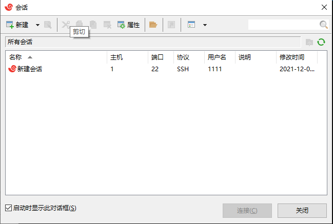
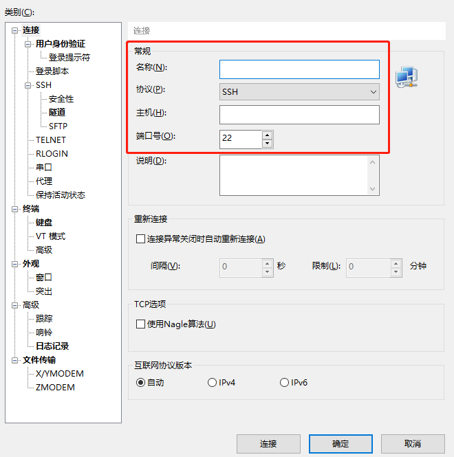
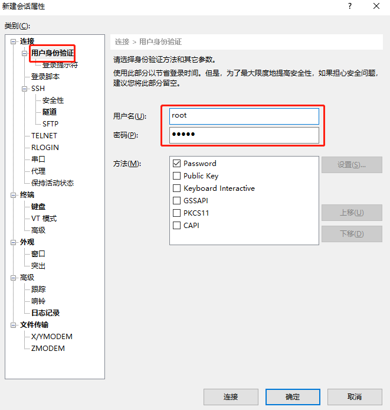
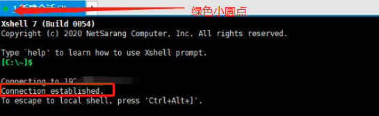
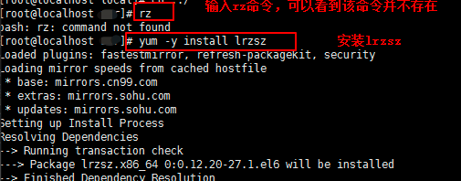
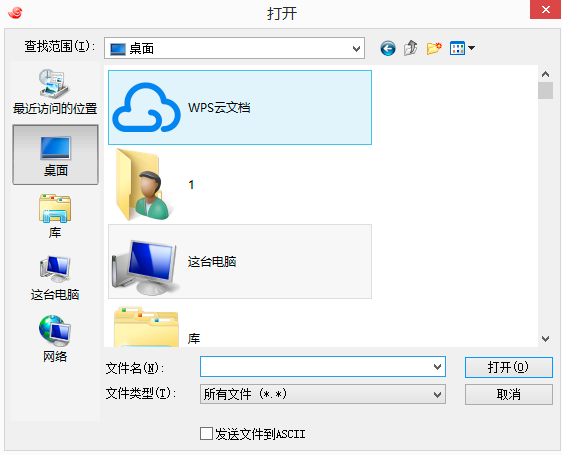
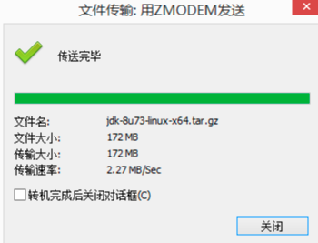

# Day121 xshell怎么上传文件到linux服务器

Windows系统中常见的远程登录客户端有：Putty，SecureCRT，SSH Secure Shell等（文中以Putty为示例）

 Putty下载地址：http://www.putty.org/

 XShell下载地址：XShell - Download [https://xshell.en.softonic.com/]（支持文件传输，功能更强大）

 

对于开发、测试、运维及网络工程师来说，xshell是一款实用的linux远程连接工具，它可以安全快速地建立起连接，实现对服务器的远程控制。在使用xshell时，常常会遇到传输文件的需求，那xshell怎么上传文件到linux服务器？下面小编就和大家分享操作方法。

**一、新建连接**

上传文件前，要成功建立起本机与服务器的连接。具体步骤如下：

1、运行软件，就会弹出会话窗口，如果会话已创建，选择会话，点击连接即可。

图1：查看会话

2、如果会话未创建，需要点击新建按钮。然后会弹出新建会话对话框。在对话框中填写名称和主机IP，协议和端口号保持默认即可。

图2：填写常规信息

3、点击用户身份验证，然后填写正确的身份信息。

图3：输入验证信息

4、点击连接，软件就会向服务器发起连接请求。如果连接成功，会话窗口的名称前会有绿色小圆点，会话窗口中会出现“Connection established”字样。否则会话窗口名称前就是红色小圆点，窗口中也会显示错误信息。

图4：连接成功

**二、上传文件**

连接上服务器后，就可以上传文件了。上传文件的步骤如下：

1、先查看上传文件的命令rz是否安装。终端中输入rz，如果提示找不到该命令，就要先执行yum -y install lrzsz命令。

图5：安装rz命令

2、在终端中执行rpm -qa|grep lrzsz，查看命令是否安装成功。如果安装成功，就会显示命令的版本信息。否则就不会显示任何内容。

图6：查看是否安装成功

3、安装成功后，可以先切换到保存文件的目录，切换目录的命令是cd。比如我想上传文件到usr目录下，就可以执行命令cd /usr。

4、切换目录后，在终端中输入rz命令，就会弹出对话框。

图7：选择文件

5、选择需要上传到服务器的文件，点击打开就会开始传输。在窗口中如果出现了“传送完毕”字样，就表示文件上传成功。

图8：上传成功

6、在终端中执行ls命令，就可以看到已经上传的文件。

xshell怎么上传文件到linux服务器就介绍到这里了。如果大家想了解关于软件的更多功能，可以前往[xshell](https://www.xshellcn.com/xiazai.html)软件网站查阅相关内容。

打开已安装的Putty后，进入连接界面。

Linux系统中是通过ssh服务实现的远程登录功能，默认ssh服务端口号为 22。

于下图第三步骤时填入服务器的外网ip地址即可（外网ip地址可于服务器供应商提供的后台服务器管理列表中获得）

同时也可以通过设置一个别名将上述配置存储，便于下次使用时快速登录，无需再次填写外网ip地址。

点击Open后即成功登录服务器，接下来提示输入账号（云服务器默认账号名一般为：root）

接着就是输入密码

验证密码后成功登录Linux服务器

Linux系统启动过程

