# Day15 工具篇——C站最全postman讲解、简介、请求、响应、运行Collections、Postman（深入学习+GitHubAPI练习）、附录--HTTP 状态码详解

[TOC]


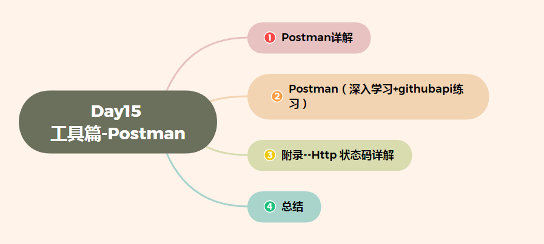


# Postman 详解

## 一、 简介

**特点：**

- **创建 + 测试：**创建和发送任何的`HTTP`请求，请求可以保存到历史中再次执行
- **Organize:**使用`Postman Collections`为更有效的测试及集成工作流管理和组织`APIs`
- **document:**依据你创建的`Clollections`自动生成`API`文档,并将其发布成规范的格式
- **collarorate:**通过同步连接你的`team`和你的`api`，以及权限控制，`API`库

## 二 、请求

- **postman界面分为两部分：**左边的`sidebar`右边的`request builder：`快速创建几乎所有的请求

  

- **HTTP请求的4部分:** `URL`，请求的`method`，`headers`，`body`。

  

- URL 首先需要设置的就是URL

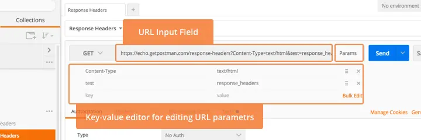

***注意：\***如果在输入参数时，没有自动decode到URL中，则可以选中参数右键后，选择EncodeURIComponent（一般都会自动填充的）：


同样也可以`decode`，将参数生成`dictionary`的形式（一般都会自动填充的）：

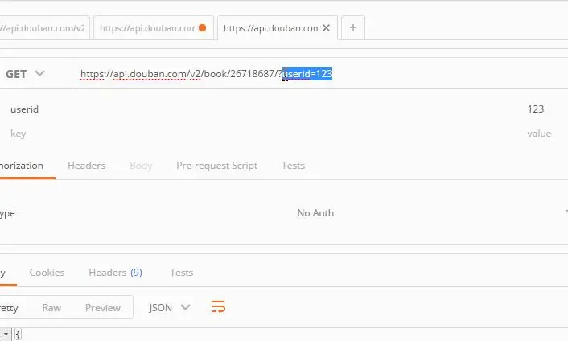

有的`URL`中有`path`变量，`postman`可以自动提取该`path`变量为一个`key`

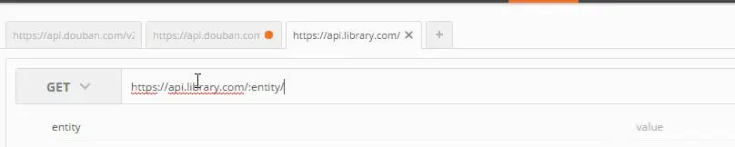

点击`headers toggle：`

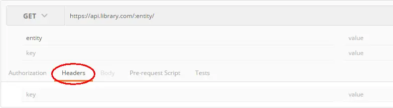

image

输入`key-value`时，会有自动提示的下拉面板：


有些`headers`和`cookies`是保密的，如：


```jsx
Accept-Charset
Accept-Encoding 
Access-Control-Request-Headers
Access-Control-Request-Method
Connection
Content-Length
Cookie
Cookie 
Content-Transfer-Encoding
Date
Expect
Host
Keep-Alive
Origin
Referer
TE
Trailer
Transfer-Encoding
Upgrade
User-Agent
Via
```

`postman 0.9.6`版本后，这些限制可以解除：

点击右上角的`Interceptor` 安装这个：


### cookies

- 分开打包的应用程序运行在沙箱浏览器,它不能访问`cookie`设置浏览器内。这种限制也可以使用拦截器扩展。

### Method

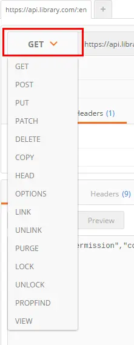

### Request body

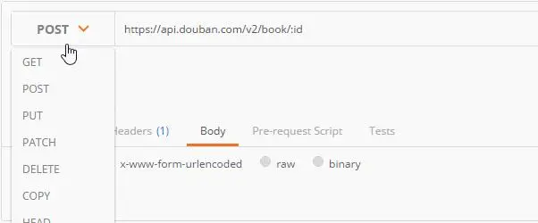

**不同的body editor 分为4个区域,根据body类型有不同的控制。**


```cpp

```

**mutipart/form-data是网页表单用来传输数据的默认格式。可以模拟填写表单，并且提交表单。**

- 可以上传一个文件作为`key`的`value`提交(如上传文件)。但该文件不会作为历史保存，只能在每次需要发送请求的时候，重新添加文件。

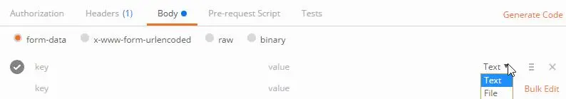

### urlencoded

- 同前面一样，注意,你不能上传文件通过这个编码模式。该模式和表单模式会容易混淆。`urlencoded`中的`key-value`会写入`URL`，`form-data`模式的`key-value`不明显写入`URL`，而是直接提交。

### raw

- `raw request`可以包含任何东西。所有填写的`text`都会随着请求发送。

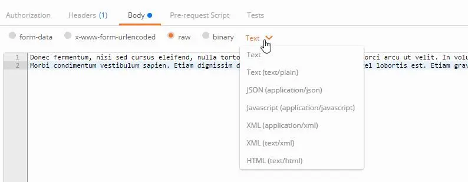

### binary

- `image`,`audio or video files.text files` 。 也不能保存历史，每次选择文件，提交。

## 三、 响应

> 保证`API`响应的正确性，就是你需要做的大部分工作。`postman`的`response viewer`部分会协助你完成该工作且使其变得简单。一个`API`的响应包含`body`,`headers`,响应状态码。`postman`将`body`和`headers`放在不同的`tabs`中。响应码和响应时间显示在`tabs`的旁边。将鼠标悬停在响应码上面可以查看更详细的信息。

### 1 保存responses

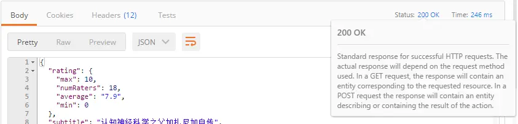

### 2 查看responses

**三种视图查看body：**

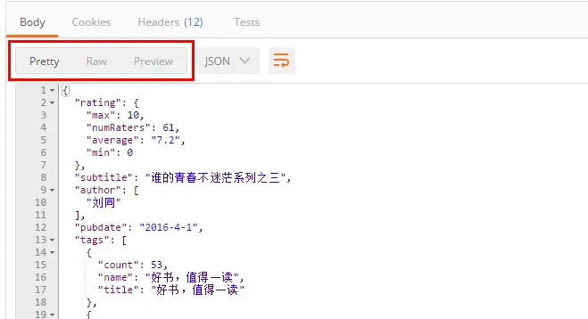

#### Pretty

- 格式化了`JSON`和`XML`，方便查看。 点击里面的`URL`，`postman`会创建一个`request`：

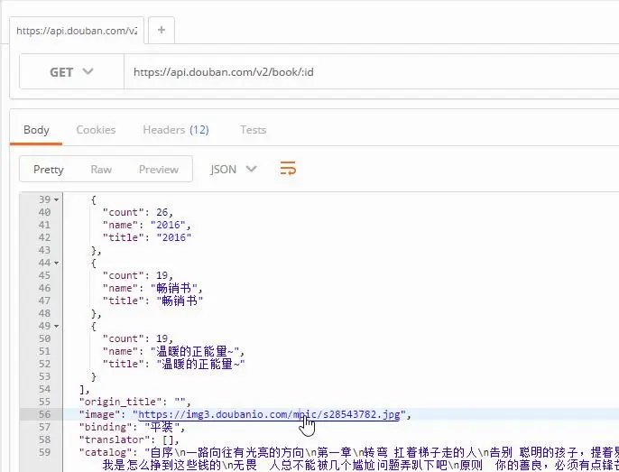

点击左边的三角可以折叠展开：

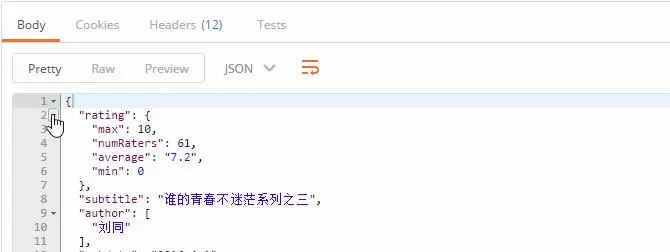

`postman`自动格式化`body`必须保证返回了正确的`Content-Type`如果`API`没有返回，则可以点击”`Force JSON`“来设置。

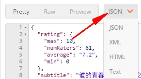

#### Raw

是`text`

#### preview

- 有的浏览器会返回`HTML`的错误，对于找问题比较方便。由于`sandbox`的限制，`js`和图片不会显示在这里的`iframe`中。你可以`maximize`该`body`窗口方便查看结果。
- `Headers key-value`形式展示。鼠标悬停在`headers`标签上，有详细的`HTTP`说明。

#### cookies

- 可以显示`browser` `cookies`，需要开启`Interceptor`。

#### 身份验证Authentication

- `postman`有一个`helpers`可以帮助我们简化一些重复和复杂的任务。当前的一套`helpers`可以帮助你解决一些`authentication` `protocols`的问题。

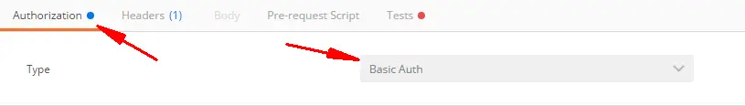

#### Basic Auth

- 填写用户名和密码，点击`Refresh headers`

#### Digest Auth

- 要比`Basic Auth`复杂的多。使用当前填写的值生成`authorization header`。所以在生成header之前要确保设置的正确性。如果当前的`header`已经存在，`postman`会移除之前的`header`。

#### OAuth 1.0a

`postman`的`OAuth helper`让你签署支持`OAuth 1.0`基于身份验证的请求。`OAuth`不用获取`access token`,你需要去`API`提供者获取的。`OAuth 1.0`可以在header或者查询参数中设置`value`。

#### OAuth 2.0

- `postman`支持获得`OAuth 2.0 token`并添加到`requests`中。

四 、Writting Test

- `Postman`的`Tests`标签可以用来写测试：

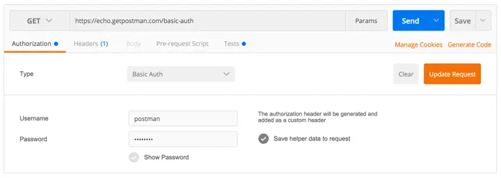

- 本质上是`javascript code`，可以为`tests object`设置`values`。这里使用描述性文字作为`key`，检验`body`中的各种情况，当然你可以创建任意多的`key`，这取决于你需要测试多少点。 `tests`也会随着`request`保存到`collection`中。`api`测试保证前端后台都能正常的于`api`协作工作，而不用在出错时猜测是哪里的问题。 需要在`request`的`test`中创建了`test`后，再进行`request`，`test`的结果在`body`的`test`中查看。

***注意：\***
1.这里的`key`描述必须是唯一的，否则相同描述只会执行第一个。
2.这里的`key`可以使用中文。 例子： `tests[“Body contains user_id”] = responseBody.has(“user_id”)`
这里描述性的`key`为：`Body contains user_id`。检测点为：`responseBody.has(“user_id”)`，意思是检测返回的`body`中是否包含”`user_id`”这个字段。

- 查看`responses`中的`Tests`结果：记过显示每个`key`,也就是我们测试点的具体结果，是否通过。


#### Testing Sandbox

- `postman`的测试是运行在沙箱环境，是与`app`独立的。查看什么在沙箱中是可用的，参见`Sandbox documentation`

#### Snippets

- 用于快速添加常用的测试代码。可以自定义`snippets`。


#### Viewing results

- `postman`每次执行`request`的时候，会执行`tests`。测试结果会在`tests`的`tab`上面显示一个通过的数量。

#### Testing Sandbox

#### Testing examples

测试代码会在发送`request`并且接收到`responses`后执行。

- 1.设置环境变量`postman.setEnvironmentVariable("key", "value");`
- 2.设置全局变量 `postman.setGlobalVariable("key", "value");`
- 3.检查`response body`中是否包含某个`string tests["Body matches string"] =responseBody.has ("string_you_want_to_search");`
- 4.检测`JSON`中的某个值是否等于预期的值


```kotlin
var data = JSON.parse(responseBody);
tests["Your test name"] = data.value === 100;
```

`JSON.parse()`方法，把json字符串转化为对象。`parse()`会进行`json`格式的检查是一个安全的函数。 如：检查`json`中某个数组元素的个数(这里检测`programs`的长度)


```kotlin
var data = JSON.parse(responseBody);
tests["program's lenght"] = data.programs.length === 5;
```

- 5.转换`XML body`为`JSON`对象`var jsonObject = xml2Json(responseBody);`
- 6.检查`response body`是否与某个`string`相等`tests["Body is correct"] = responseBody === "response_body_string";`
- 7.测试`response Headers`中的某个元素是否存在(如:`Content-Type`)


```cpp
tests["Content-Type is present"] = postman.getResponseHeader("Content-Type"); //getResponseHeader()
```

方法会返回`header`的值，如果该值存在或者：


```bash
tests["Content-Type is present"] = responseHeaders.hasOwnProperty("Content-Type");
```

上面的方法，不区分大小写。下面的方法，要区分大小写。

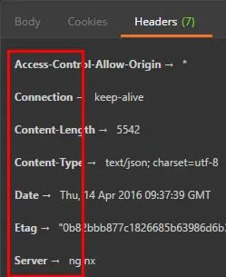

- 8.验证`Status code`的值 `tests["Status code is 200"] = responseCode.code === 200;`
- 9.验证`Response time`是否小于某个值`tests["Response time is less than 200ms"] = responseTime < 200;`
- 10.`name`是否包含某个值`tests["Status code name has string"] = responseCode.name.has("Created");`
- 11.`POST` 请求的状态响应码是否是某个值`tests["Successful POST request"] = responseCode.code === 201 || responseCode.code === 202;`
- 12.很小的`JSON`数据验证器


```jsx
var schema = { 
"items": { 
  "type": "boolean" 
}
};
var data1 = [true, false];
var data2 = [true, 123];
console.log(tv4.error);
tests["Valid Data1"] = tv4.validate(data1, schema);
tests["Valid Data2"] = tv4.validate(data2, schema);
```

结果：

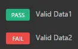

## 五 、运行Collections

- `postman`允许你运行`collection`，你可以运行任意的次数。 最后会给出一个整体运行的结果。会保存每一次运行的结果，提供给你比较每一次运行解雇的不同。
  选择`collection`，选择环境。点击运行按钮。

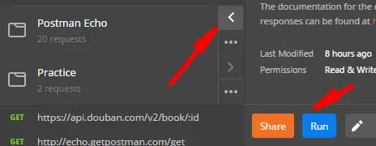

在需要`csv`和`json`文件的地方记得添加。
运行`collection`测试会在另一个窗口运行。如果需要在`main`窗口修改东西，在新窗口能正常读取。


### postman-实现简单的接口测试

下面说下postman如何来测试接口

1.下载postman插件，网址http://chromecj.com/web-development/2014-09/60/download.html

2.chrom 浏览器设置中-更多工具-扩展程序中找到postman插件，找到postman，点击启动按钮，打开postman

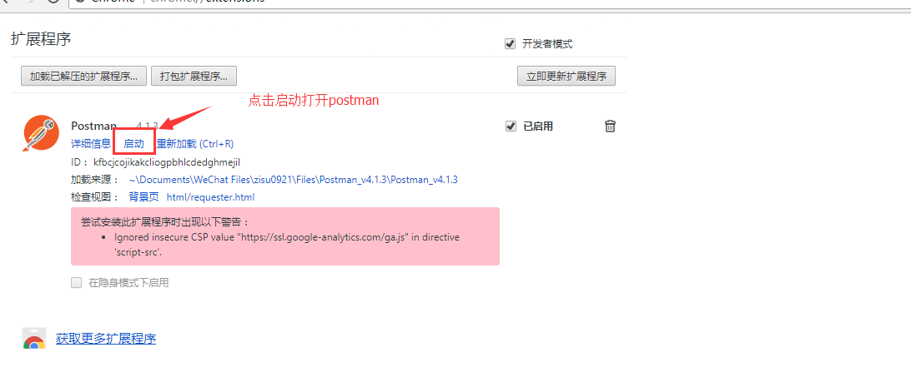

 

 

 

3.postman页面详细介绍

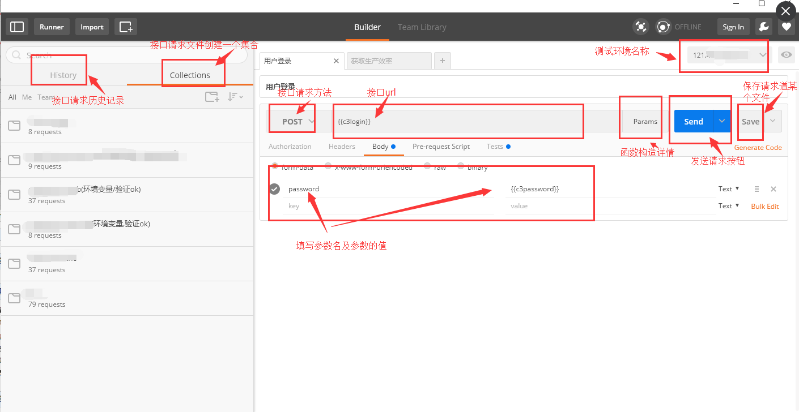

 

4.postman 实现简单的post请求

a.填写url

b.body中天下参数名及参数值

c.点击send按钮

d.查看返回的结果数据与预期是否一致

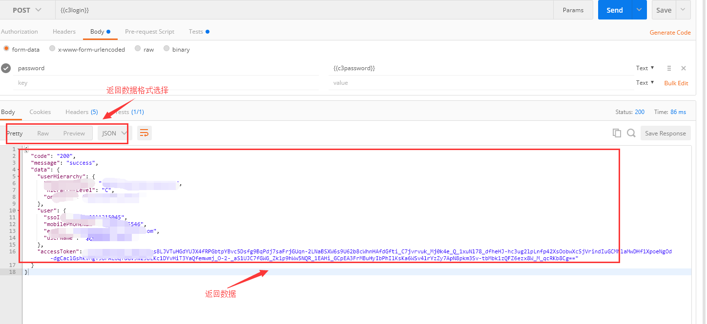

 


###  postman简单教程，如何在请求中引用上次请求返回的值

做接口测试，一定会遇到这种情况，需要拿上次请求的值在本次请求中使用，比如，我们去测试一个东西，要去登录才能做其他的操作，需要拿到登录返回数据中的某些字段，比如，token啊等。。。

如果发一次请求，就去粘贴复制一次，，会很伐木累。。。，而且token 有时候还会过期，每次都要再操作一次，再粘贴复制，真的真的好伐木累，。。。本君不会说，70多个接口，我真的是每次都手动粘贴复制，真的很伐木累啊；所以**在请求中引用上次请求返回的值真的很必要！！！！下面开始讲如何引用上次请求的值，需要结合上篇文章我们讲的环境变量来实现，直接上栗子讲吧，，**

**1，先发送登录，查看需要引用的返回值**

**2、postman -tests模块中设置需要引用的值为环境变量**

**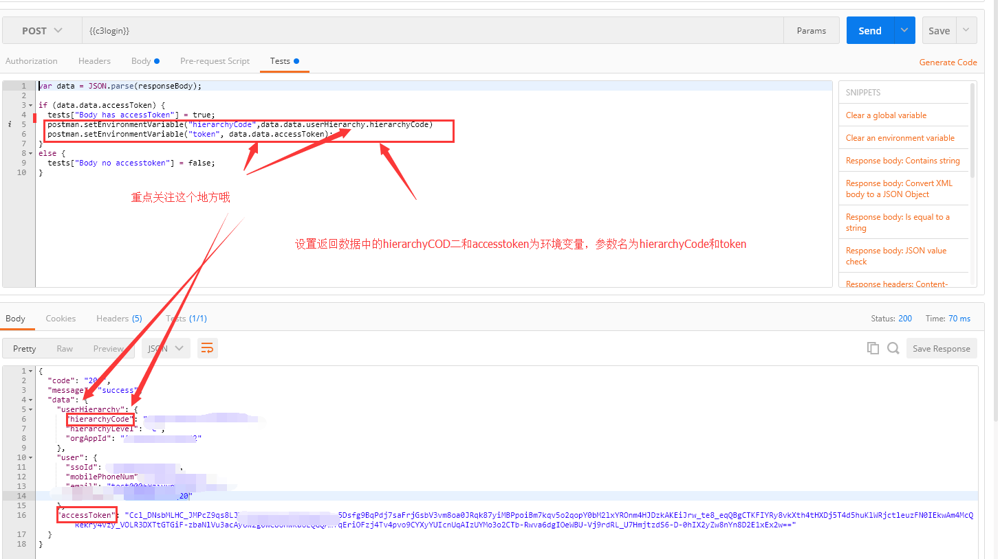**

 

3.下一个请求中引用我们设置的环境变量

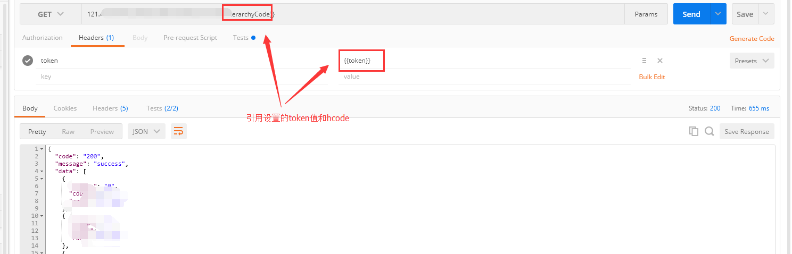

 


### postman简单教程，使用tests模块来验证接口时是否通过

接口测试醉重要的就是返回数据的检查，一个简单的接口，我们可以肉眼检查返回数据，但接口一旦多起来且复杂，每次的检查都会很费劲，此时我们就需要postman 的tests模块来代替

概念:

Postman的test本质上是JavaScript代码，通过我们编写测试代码，每一个tests返回True,或是False。

每一个tests实际上就是一个测试用例

 test验证方式：

内置脚本说明：

```mipsasm
1. 清除一个全局变量
     Clear a global variable
    对应脚本：
    postman.clearGlobalVariable("variable_key");
    参数：需要清除的变量的key

2.清除一个环境变量
    Clear an environment variable
    对应脚本：
    postman.clearEnvironmentVariable("variable_key");
    参数：需要清除的环境变量的key

3.response包含内容
    Response body:Contains string
    对应脚本：
    tests["Body matches string"] =responseBody.has("string_you_want_to_search");
    参数：预期内容

4.将xml格式的response转换成son格式
    Response body:Convert XML body to a JSON Object
    对应脚本：
    var jsonObject = xml2Json(responseBody);
    参数：（默认不需要设置参数,为接口的response）需要转换的xml

5.response等于预期内容
    Response body:Is equal to a string
    对应脚本：
    tests["Body is correct"] = responseBody === "response_body_string";
    参数：预期response

6.json解析key的值进行校验
    Response body:JSON value check
    对应脚本：
    tests["Args key contains argument passed as url parameter"] = 'test' in responseJSON.args
    参数：test替换被测的值，args替换被测的key

7.检查response的header信息是否有被测字段
    Response headers:Content-Type header check
    对应脚本：
    tests["Content-Type is present"] = postman.getResponseHeader("Content-Type");
    参数：预期header

8.响应时间判断
    Response time is less than 200ms
    对应脚本：
    tests["Response time is less than 200ms"] = responseTime < 200;
    参数：响应时间

9.设置全局变量
      Set an global variable
      对应脚本：
      postman.setGlobalVariable("variable_key", "variable_value");
      参数：全局变量的键值

10.设置环境变量
      Set an environment variable
      对应脚本：
      postman.setEnvironmentVariable("variable_key", "variable_value");
      参数：环境变量的键值

11.判断状态码
      Status code:Code is 200
      对应脚本：
      tests["Status code is 200"] = responseCode.code != 400;
      参数：状态码

12.检查code name 是否包含内容
      Status code:Code name has string
      对应脚本：
      tests["Status code name has string"] = responseCode.name.has("Created");
      参数：预期code name包含字符串

13.成功的post请求
      Status code:Successful POST request
      对应脚本：
      tests["Successful POST request"] = responseCode.code === 201 || responseCode.code === 202;

14.微小验证器
       Use Tiny Validator for JSON data            
       对应脚本： 
        var schema = {
         "items": {
         "type": "boolean"
             }
         };
        var data1 = [true, false];
        var data2 = [true, 123];
        console.log(tv4.error);
        tests["Valid Data1"] = tv4.validate(data1, schema);
        tests["Valid Data2"] = tv4.validate(data2, schema);
        参数：可以修改items里面的键值对来对应验证json的参数
```


# Postman（深入学习+GitHubAPI练习）

### 前言

在开始这个教程之前，先聊一下为什么接口测试在现软件行业如此重要？ 为什么我们要学习 Postman？

现代软件行业已经从传统的万维网发展到移动互联网，云计算，如今更进入到万物互联时代。软件和网络会连接我们生活的方方面面，不同的设备，不同的软件系统之间存在各式各样的联系。而接口就是不同设备、系统之间联系的桥梁，所以接口在现今和未来的软硬件产业当中都具有越来越高的重要性和地位。

### 什么是接口？

IT 行业从 WWW 万维网时代 的 C/S、B/S 架构，到移动互联网时代的大前端时代，发展到云计算时代以 IaaS（基础架构即服务），PaaS（平台即服务），SaaS（软件即服务）为代表的云端架构，如今更是进入到万物互联的物联网时代，网络连接着我们生活的方方面面，而承载这些连接的连接点，就是网络接口，接口是不同网络应用之间联系、交互、相互作用的入口和桥梁。

如下图，是接口在软件系统中所处位置的示意图： 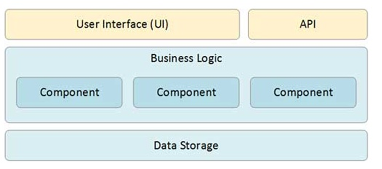这里 UI 接口和 API 接口分别代表用户交互接口和应用程序接口。

### 接口测试

了解了接口的概念，我们再看什么是接口测试？

以下是百度百科中给出的定义:

> 接口测试是测试系统组件间接口的一种测试。接口测试主要用于检测外部系统与系统之间以及内部各个子系统之间的交互点。测试的重点是要检查数据的交换，传递和控制管理过程，以及系统间的相互逻辑依赖关系等。

可以看到，在针对接口定义阐述后，也说明了接口测试的重点包括交互的数据、过程以及背后的业务逻辑。

再进一步看更常用的API测试的定义，这个百度没有收录，可以看下 Wiki 百科的定义：

> API testing is a type of software testing that involves testing application programming interfaces (APIs) directly and as part of integration testing to determine if they meet expectations for functionality, reliability, performance, and security.[1] Since APIs lack a GUI, API testing is performed at the message layer.[2] API testing is now considered critical for automating testing because APIs now serve as the primary interface to application logic and because GUI tests are difficult to maintain with the short release cycles and frequent changes commonly used with Agile software development and DevOps.[3][4]

它是直接针对 API 进行测试的一类集成测试，注意 wiki 把接口测试归类在集成测试阶段。也就是说它更多是在系统集成时实施。然后也说明了接口测试不单纯是功能测试，还需考虑可靠性、安全、性能等。API 接口测试和 GUI 测试不同，更多体现在消息层，并且因为 GUI 层在自动化测试上的先天劣势，API 自动化目前是自动化测试领域以及敏捷、DevOps 等研发模式的关键实践。

下图是著名的测试金字塔，它根据不同测试类型对软件测试进行了分层，底层是针对的代码层面的单元测试，中间是 service 服务测试，而现今的应用服务更多是 API 形式来体现，服务测试也可以理解为 API 的测试，上层则是针对用户界面的 GUI 测试。

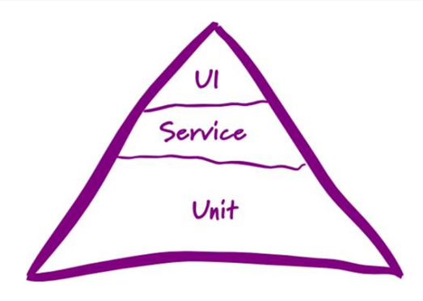

这个模型体现出在自动化测试中，越底层的自动化测试所占比重应该越大，才有更好的投入产出比。中间这一层的 API 测试它既不像 UI 层那样维护成本巨大，很难跟上快速迭代的要求，同时它又比单元测试更能在业务逻辑上进行质量验证。所以现在一般认为API测试是自动化测试实施上的优先选择

### HTTP 协议基础

在正式开始 Postman 的功能介绍前，首先还是要介绍 Postman 的测试对象。Postman 主要是针对 HTTP 协议接口的测试工具，所以本章首先介绍一下 HTTP 协议的基础知识。

> HTTP，即超文本传输协议（HyperText Transfer Protocol)，是互联网上应用最为广泛的一种网络协议，目前主要使用的 1.1 版本，基于 TCP/IP 通信协议来传递数据（HTML、文件、数据、API 接口消息等）。

HTTP 协议工作于客户端-服务器即 C/S 架构上 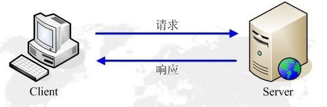

### HTTP 消息组成

客户端发送一个 HTTP 请求到服务器，请求消息包括以下格式：

请求行（request line）、请求头部（header）、空行和请求数据四个部分。如图

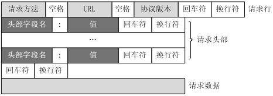

如下是一个请求百度首页的请求示例：

```shell
Request URL: https://www.baidu.com/
Request Method: GET
Status Code: 200 OK

Accept: text/html,application/xhtml+xml,application/xml;q=0.9,image/avif,image/webp,image/apng,*/*;q=0.8,application/signed-exchange;v=b3;q=0.9
Accept-Encoding: gzip, deflate, br
Accept-Language: zh-CN,zh;q=0.9
Cache-Control: max-age=0
Connection: keep-alive
Cookie: PSTM=1686536494; BAIDUID=96D6939E207D38C9AF213AD2F9D84D2E:FG=1; BD_UPN=12314753; BIDUPSID=5630DE52139C696F657F88D9DAE4EA09; BA_HECTOR=21ak852k058g2l802k042lfg1i8d09i1n; BAIDUID_BFESS=96D6939E207D38C9AF213AD2F9D84D2E:FG=1; ZFY=NvdyFDLhxxOvQfvFG:AQCJUyR2zThCHaU:AtVPnRJ:ApCg:C; BDORZ=B490B5EBF6F3CD402E515D22BCDA1598; channel=baidusearch; BD_HOME=1; H_PS_PSSID=38516_36547_38686_38798_38767_38844_38832_38793_38813_38838_38640_38868_26350; BD_CK_SAM=1; PSINO=7; delPer=0; ab_sr=1.0.1_YmYzNDg0NzBlZWE0YmQ2Y2VlNWYzZTIwOGU0MmUzOWI2ZGJiNDExZTYzYzU3NDdiOTcyZWVkZjE4NjAxYzc4Y2I2MDQxYmE0Njg3ZjlkZWVmOGU5Y2Q3ZWJkMTRkNmFjMjgyMTI3ZTBlM2ZjNDBhN2M4M2I2NGVlYmEyMmZjNjgwN2JhMGRiYmQzYTM0YWJiZDYxYWI5ZDc0OTMzMTY5Ng==; H_PS_645EC=42d5i76nbzUdigDijOuYXHqnUl1bHk2wrmbthBuZ5mPEHmLSShYhVb0f7Pk; baikeVisitId=69f76140-95f4-4bac-be1c-8873346a4a97
Host: www.baidu.com
Referer: https://www.baidu.com/link?url=dDYjw2oSAQzt8xRnkLkpb_Bmjk6T4c-mit7A97NroNa&wd=&eqid=98c791f500008cc80000000664868bc2
sec-ch-ua: "Google Chrome";v="107", "Chromium";v="107", "Not=A?Brand";v="24"
sec-ch-ua-mobile: ?0
sec-ch-ua-platform: "Windows"
Sec-Fetch-Dest: document
Sec-Fetch-Mode: navigate
Sec-Fetch-Site: same-origin
Sec-Fetch-User: ?1
Upgrade-Insecure-Requests: 1
User-Agent: Mozilla/5.0 (Windows NT 10.0; Win64; x64) AppleWebKit/537.36 (KHTML, like Gecko) Chrome/107.0.0.0 Safari/537.36
```

服务器接收并处理客户端发过来的请求，返回一个 HTTP 的响应消息。也由四个部分组成，分别是：

响应状态行、消息报头、空行和响应正文。 如图

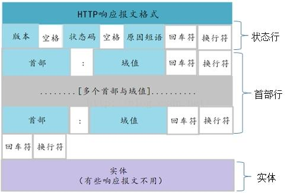

如下是百度首页的响应示例

```shell
Bdpagetype: 1
Bdqid: 0x8fb53e6500011f1a
Connection: keep-alive
Content-Encoding: gzip
Content-Security-Policy: frame-ancestors 'self' https://chat.baidu.com http://mirror-chat.baidu.com https://fj-chat.baidu.com https://hba-chat.baidu.com https://hbe-chat.baidu.com https://njjs-chat.baidu.com https://nj-chat.baidu.com https://hna-chat.baidu.com https://hnb-chat.baidu.com http://debug.baidu-int.com;
Content-Type: text/html; charset=utf-8
Date: Mon, 12 Jun 2023 03:06:57 GMT
Server: BWS/1.1
Set-Cookie: BDSVRTM=0; path=/
Set-Cookie: BD_HOME=1; path=/
Set-Cookie: H_PS_PSSID=38516_36547_38686_38798_38767_38844_38832_38793_38813_38838_38640_38868_26350; path=/; domain=.baidu.com
Strict-Transport-Security: max-age=172800
Traceid: 1686539217055630106610355251521721016090
Transfer-Encoding: chunked
X-Ua-Compatible: IE=Edge,chrome=1
```

### HTTP 方法

HTTP 方法是请求消息中携带的关键信息，告知服务器本次请求希望进行的操作类型。目前在 HTTP1.1 版本中常见以下方法：

| No.  | 方法    | 描述                                                         |
| ---- | ------- | ------------------------------------------------------------ |
| 1    | GET     | 请求指定的页面信息，并返回实体主体。                         |
| 2    | HEAD    | 类似于get请求，只不过返回的响应中没有具体的内容，用于获取报头 |
| 3    | POST    | 向指定资源提交数据进行处理请求（例如提交表单或者上传文件）。数据被包含在请求体中。POST请求可能会导致新的资源的建立和/或已有资源的修改。 |
| 4    | PUT     | 从客户端向服务器传送的数据取代指定的文档的内容。             |
| 5    | DELETE  | 请求服务器删除指定的页面。                                   |
| 6    | CONNECT | HTTP/1.1协议中预留给能够将连接改为管道方式的代理服务器。     |
| 7    | TRACE   | 回显服务器收到的请求，主要用于测试或诊断。                   |
| 8    | PATCH   | 从客户端向服务器传送数据，取代指定文档的部分内容             |

### HTTP 状态码

HTTP 状态码定义了服务器端处理 HTTP 请求的结果信息，主要包含以下五类：

| 状态码 | 描述                     |
| ------ | ------------------------ |
| 1XX    | 已接收，待处理           |
| 2XX    | 请求处理成功             |
| 3XX    | 重定向，资源位置发生变化 |
| 4XX    | 客户端请求信息错误       |
| 5XX    | 服务端处理发生错误       |

#### 1xx 消息

这一类型的状态码，代表请求已被接受，需要继续处理。这类响应是临时响应，只包含状态行和某些可选的响应头信息，并以空行结束。由于 HTTP/1.0 协议中没有定义任何 1xx 状态码，所以除非在某些试验条件下，服务器禁止向此类客户端发送 1xx 响应。这些状态码代表的响应都是信息性的，标示客户应该采取的其他行动。

#### 2xx 成功

这一类型的状态码，代表请求已成功被服务器接收、理解、并接受。

#### 3xx 重定向

这类状态码代表需要客户端采取进一步的操作才能完成请求。通常，这些状态码用来重定向，后续的请求地址（重定向目标）在本次响应的 Location 域中指明。

#### 4xx 客户端错误

这类的状态码代表了客户端看起来可能发生了错误，妨碍了服务器的处理。除非响应的是一个 HEAD 请求，否则服务器就应该返回一个解释当前错误状况的实体，以及这是临时的还是永久性的状况。这些状态码适用于任何请求方法。浏览器应当向用户显示任何包含在此类错误响应中的实体内容

#### 5xx 服务器错误

表示服务器无法完成明显有效的请求。这类状态码代表了服务器在处理请求的过程中有错误或者异常状态发生，也有可能是服务器意识到以当前的软硬件资源无法完成对请求的处理。除非这是一个 HEAD 请求，否则服务器应当包含一个解释当前错误状态以及这个状况是临时的还是永久的解释信息实体。浏览器应当向用户展示任何在当前响应中被包含的实体。这些状态码适用于任何响应方法。

*详细的状态码清单可参见附录*

### GitHub API

后面会有针对 github API 的实例，此处简要介绍下 Github 网站以及 Github API。

GitHub 是一个面向开源及私有软件项目的托管平台，因为只支持 Git 作为唯一的版本库格式进行托管，故名 GitHub。也是目前全球最大的代码托管平台，可以说是程序员的圣地，号称全球最大的同性交友平台。

### github 中的一些主要概念

1. 提交（commit）：提交更改到仓库（注意本地 Gi t仓库与 GitHub 仓库不同）。
2. 提交信息（commit message）：每次提交的时候，描述这次提交内容的信息。
3. 分支（branch）：像树状图一样，每个独立的分支都可看作是项目的一个版本
4. 主分支（master branch）：所有的 Git 项目在最初创建时，都会默认创建出一个主分支。在开发中，写一个新功能的时候，一般都是先建立一个分支，在该分支上完成功能，发布时 merge 到主分支。
5. 功能分支（feature branch）：一般的功能开发分支
6. 发布分支（release branch）：每次正式发布时，可以拉出一个 release 分支来冻结当前 release 的代码。
7. 合并（merge）：merge 可以将一个分支上的全部内容归并到另一个分支上
8. 标签（tag）：常用于记录发布版本，在版本发布的时候，给一个 tag，便于管理和查询
9. 导出（check out）：从某一分支上查看内容记录。
10. 拉取（pull request）：一般用来从远程仓库拉取分支中的代码到本地，也可以从本地仓库中拉取分支代码到当前工程中。
11. 提出问题（issue）：GitHub 的提出问题的功能，一般遇到问题，可以将出现问题的场合，通过 issue 的方式记录。
12. 维基（WIKI）：一个轻量级的知识库，创建的 Web 页面之间可以通过链接互相联系。GitHub 中的项目通常使用 WIKi 进行文档记录。
13. 克隆（clone）：从 GitHub 上下载一个副本到本地，操作后可以 pull 上去。
14. 分叉（fork）：A 复制一个 B 的项目到自己的账户下，修改后再提交，B 能看到 A 修改的内容，但是 B 原本的项目是不会有变动的。

### github 主界面功能

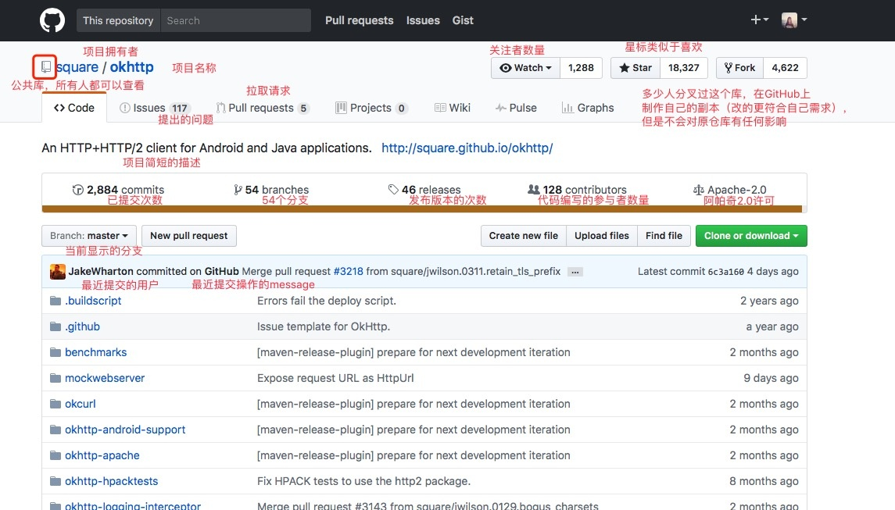图片来自[网络](http://blog.csdn.net/android_zyf/article/details/64175941)

### Github API

目前 Github API 最新的 V4 版本是基于 GraphQL 的 API，但最常用的还是 V3 的 [Restful API。](https://developer.github.com/v3/)

#### Github API 中几类主要资源及对应操作

User 资源

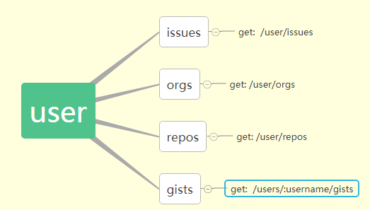

Repo 操作

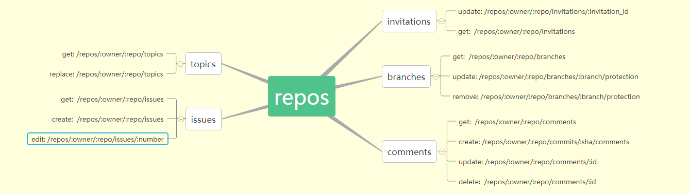

issue 操作

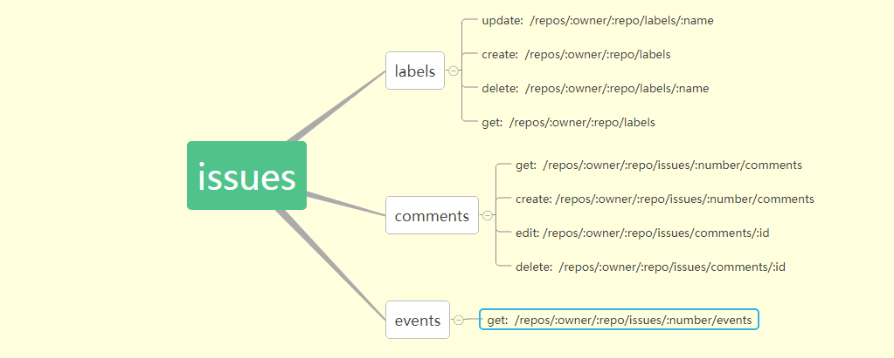

*图片来自[网络](https://blog.csdn.net/woshinannan741/article/details/78541029)*

#### Github 中的时间格式

Github 中时间格式如下：

> YYYY-MM-DDTHH:MM:SSZ

#### Github 限流规则

Github 为包含服务端负载压力，会对请求流量进行限制。在每个 Github 的响应消息头中都会携带 Github 的限流设置。

| 头参数                | 含义                                                       |
| --------------------- | ---------------------------------------------------------- |
| X-RateLimit-Limit     | 当前每小时最大请求限制，一般未鉴权请求60次，鉴权请求5000次 |
| X-RateLimit-Remaining | 当前剩余请求次数                                           |
| X-RateLimit-Reset     | 剩余限制重置时间，毫秒                                     |

#### 请求参数与分页

请求中可以携带参数，一般包含两种参数: 路径参数和查询参数。 

Github API中还默认支持两个分页参数：

- page 当前显示页数；
- per_page 每页显示结果数。

### Postman 基础

可以用于 Rest 接口测试的测试工具非常多，常见的有 soapUI、Jmeter、fiddler 等都经常用来做接口测试。但是目前在接口测试人员中最流行，最常见还是本文向大家介绍的 Postman。

#### Postman 的安装

Postman 最早的版本，以及很长一段时间都是以 Chrome 插件的形式存在的。以至很多人甚至认为 Postman 就是 Google 的官方工具插件，我们目前能看到的很多资料也还是基于 Chrome 的插件形式来进行介绍的。

但是目前 Postman 其实已经推出了独立的本地App程序，并且官方已经宣布不再支持 Chrome 的插件形式。虽然插件版本现在还能使用，可是毕竟相比 Native 版本，受限于 Chrome 浏览器的功能，很多功能在插件版本中是欠缺的，比如 cookie 的内建支持，代理功能，控制台功能等等。所以此处就不再介绍插件版本的安装。

本地版本的安装，其实也非常简单。从官网根据自己操作系统的类型选择相应的版本下载即可。 

这里还有一点要注意下，在 Postman 的官网，我们最好注册一个账号，后续在使用 Postman 的时候很多高级功能需要用这个账号登录后才可以使用。

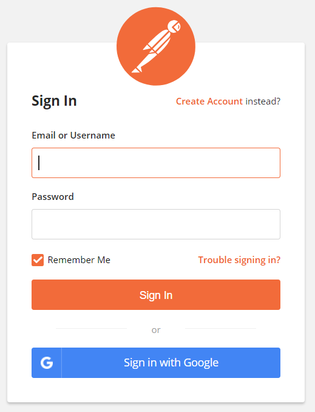

安装完成，在桌面上出现 Postman 那个 pose 很帅的小人图标，则安装完成。

#### Postman 主界面

打开 Postman 进入，首次会提示选择希望创建的任务类型。

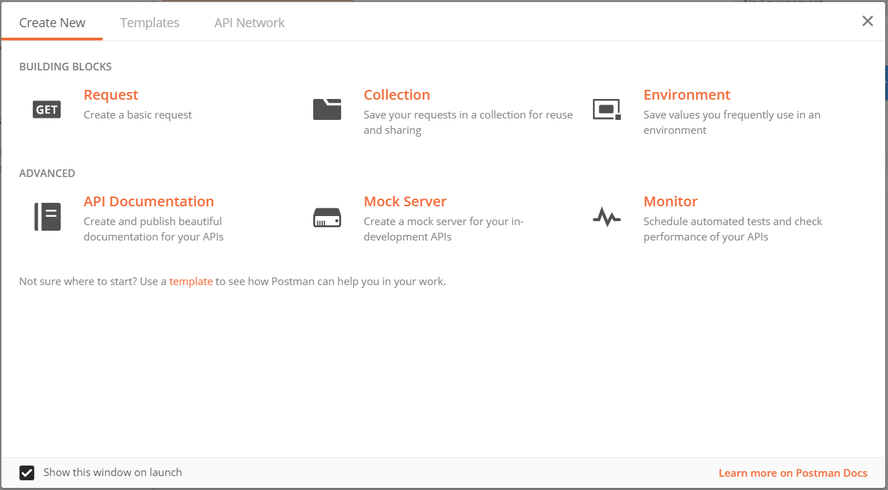这里有六种任务类型，这里先简单说明一下：

- Request是 Postman 软件的基础和核心，也就是通过这个功能来创建 request 请求，完成接口测试的核心工作；
- Collection其实是个集合，我们可以认为是一批 Request 请求的集合，或者说测试集。它也是 Postman 一些进阶功能的基本单位；
- Environment 字面理解就是环境，其实可以认为是一些配置变量的集合，实际应用中可以起到通过不同配置区分不同测试环境的效果 后面这三个都是 Postman 的高级功能；
- API documention 是通过我们调试通过的 request 来自动生成接口文档，便于团队的共享和接口的交付；
- Mock server 在我们进行接口测试或开发的时候，很多时候是需要模拟对端的接口服务器的，Mock server 就起到的模拟服务器端的作用；
- Monitor 这是个监控功能，通过 monitor 我可以监控我的接口是不是正常。说白了，这其实就是个定时的接口执行功能。

以上大致了解了几种不同的任务类型，下面我们再来看看主界面的功能区。 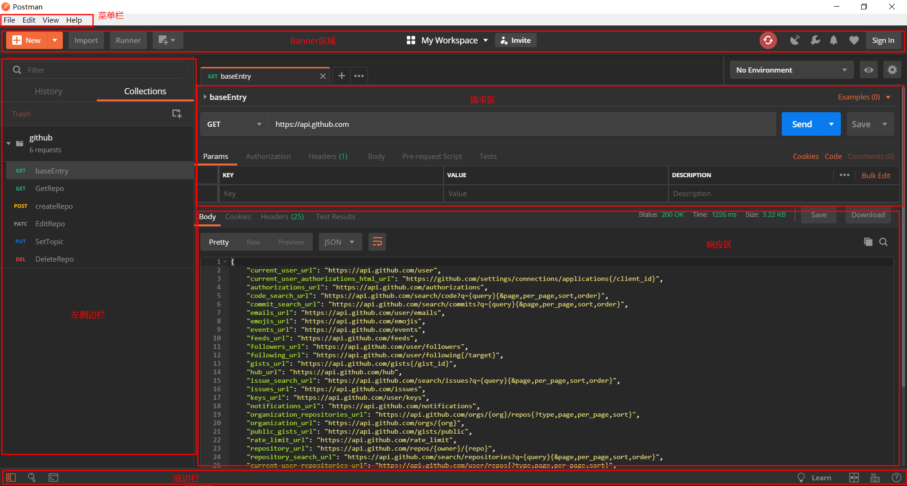

#### Banner 区域

首先是上面的菜单栏，对应功能区的各项功能，在菜单栏上都能找到对应的菜单。然后是下面的 banner 区域。

从左到右依次介绍：

会打开启动时的创建窗口，用于创建六种类型的任务。

按钮，可以用于导入外部文件，外部文件可以是 postman 的 Collection 格式文件，数据文件，以及其他的 API 定义文件。

则会启动 Collection runner，它是一个运行器，用于运行已经建立的测试任务，我们后面会有详细介绍。

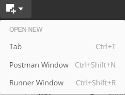第四个按钮，可以新建 tab，或者多开一个 postman 程序，或者 runer 程序。

中间是选择使用的 workspace，但这个需要账号登录，会同步云端的 workspace 设置。每个账号会有一个默认的 workspace，workspace 它是一个工作空间，大家可以理解成类似项目或者工程。

banner 条右侧还有几个按钮： 

- 第一个是同步，也是在有账号的情况下，可以在多个电脑间同步 workspace 内的相关接口测试设计；
- 第二个 proxy，则类似前面介绍过的 fiddler，提供代理抓取 API 功能。当然这个功能 postman 不像 Fiddler 那样丰富；
- 第三个按钮包括 setting 以及文档指南。 setting 里是软件的本地配置
- 第四个按钮是消息通知，很好理解，会显示一些提醒信息；
- 然后是 postman 的 Twitter，在墙后面就不要去看了；
- 最后是登录，可以用 postman 的账号的登录。

#### Setting 设置

Postman 工具的使用属性和应用设置我们可以在 Setting 中国进行设置。以下分别说明：

##### General

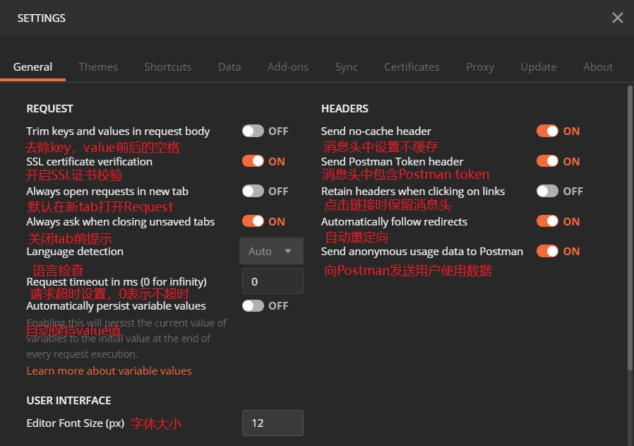

##### Themes

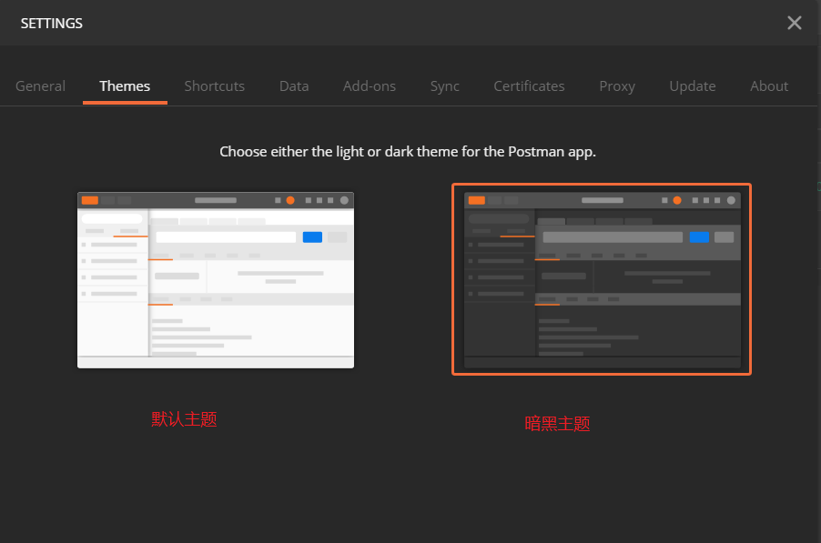

##### Shortcuts

工具快捷键 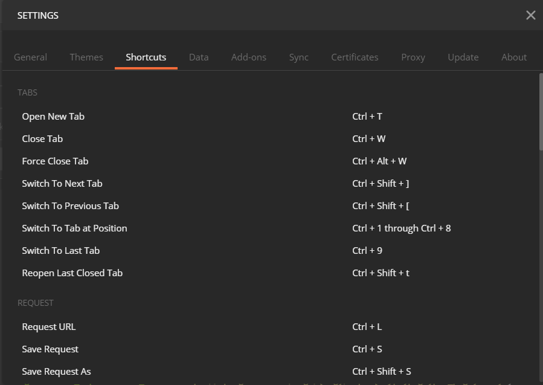

##### Data

工具数据导入导出 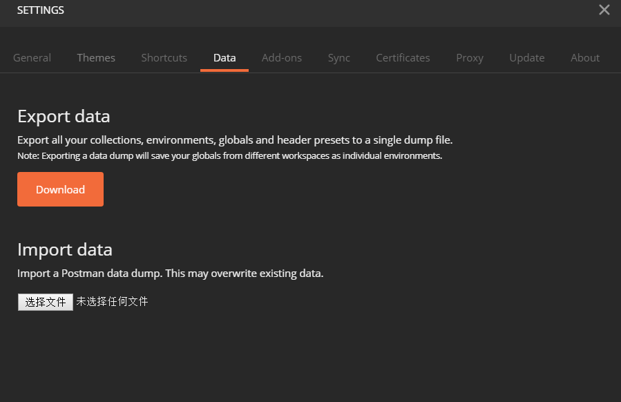

##### add-ons

Newman 插件下载方法 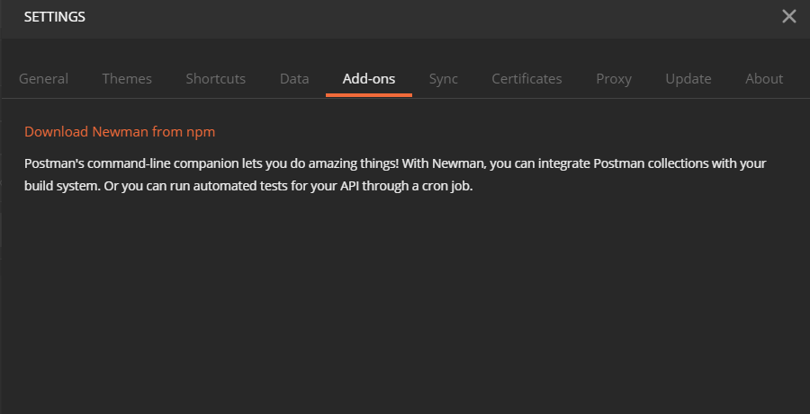

##### Sync

同步设置 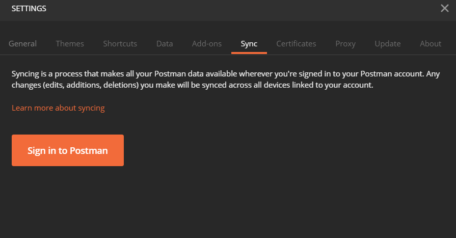

##### certificates

本地证书设置 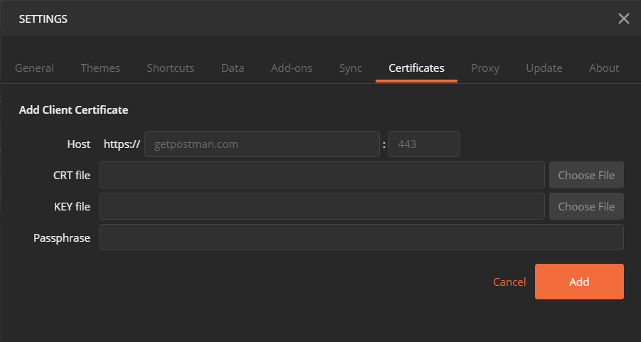

##### Proxy

本地网络代理设置 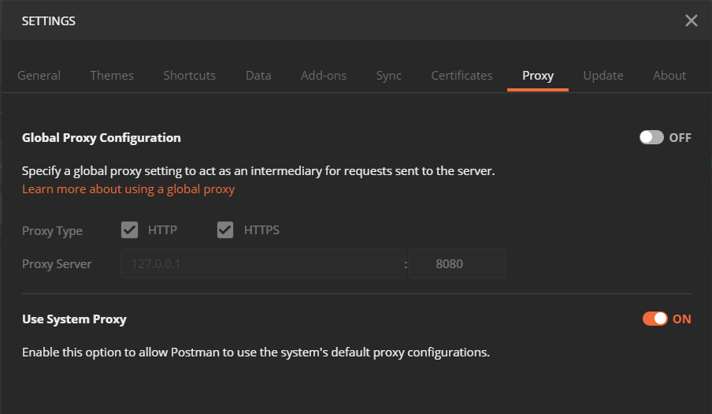

##### update

升级设置 

##### about

工具 关于... 等版本信息 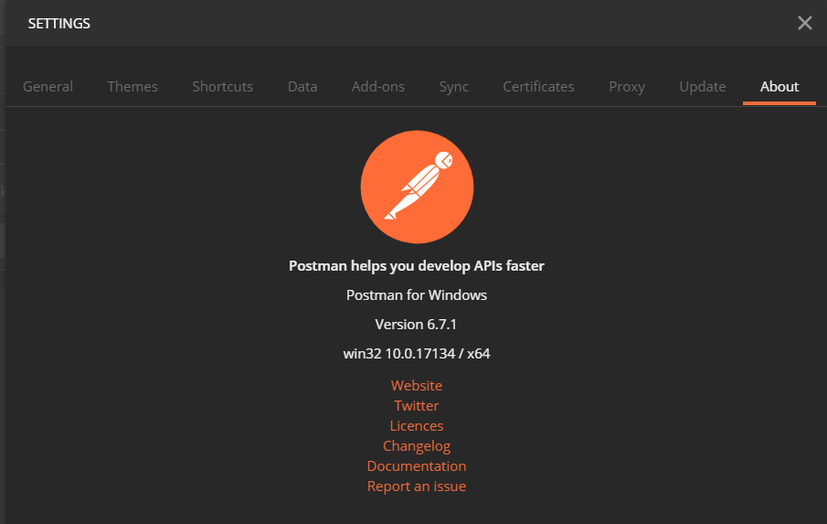

#### 左侧边栏

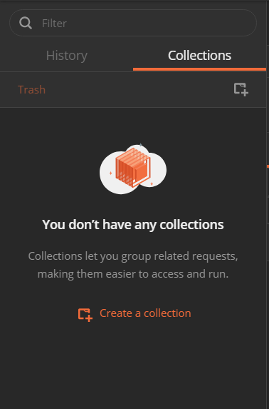

- filter 筛选栏，筛选显示不同的消息
- history 是操作消息记录清单
- collection 如前面介绍，显示请求集合

#### 底边状态栏


- 最左面，显示和关闭左侧边栏
- 然后是搜索功能，这个容易理解
- 第三个是控制台，可以在这里看到消息相互的详细信息


- 用户指南
- 调整功能区显示样式
- 快捷键清单参考
- 帮助相关的连接

#### 主功能区

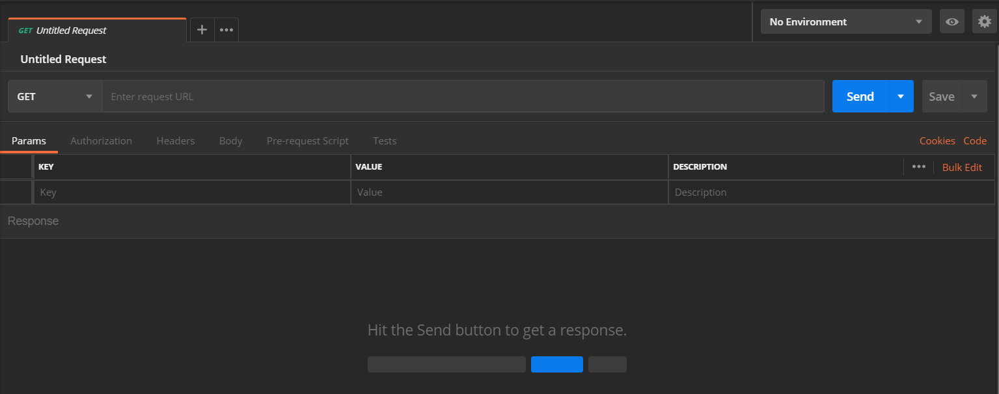

主要包括上下两部分，上面是 request 区，下面是 response 区。也可以分成左右显示。

##### Request 区域

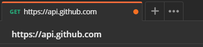

request 部分默认开启了一个选项卡，可以新开多个选项卡便于同时编辑。

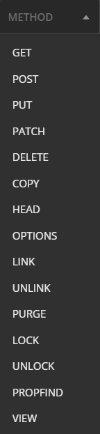

默认使用的是 GET 方法，这也是使用最多的 HTTP 方法，下拉可以选择其他的方法，常用的还有哪些？ POST、PUT、Delete 等。

URL 部分输入请求的地址。比如我们输入 Github API 的根地址。

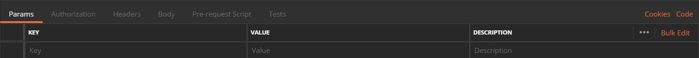param 是参数管理界面，在这里我们可以添加参数（有 key-value，块编辑模式）。


Send 发送请求，小箭头下 send and download，会在发送以后把响应消息导出成 json 保存。旁边的 save，保存功能，其实是把这个 request 作为一个 case 保存到 collection 里。

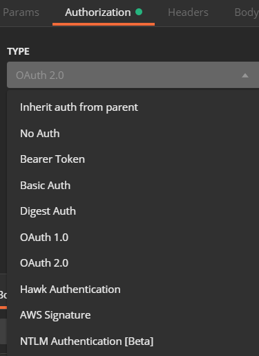

鉴权部分，虽然 request 编辑器已经足够强大可以处理鉴权消息，但是很多时候鉴权是个使用频率很高的功能，所以 Postman 单独把鉴权部分抽取出来，并且封装了目前的绝大部分鉴权方式

- 继承，默认鉴权方式

- 不鉴权

- bearer token 鉴权，一般也叫 Json web token，其实就是发送一个 json 格式的 token 令牌，服务端会针对 token 进行解密验证

- Basic Auth 基础验证，提供用户名密码验证，postman 会自动生成 authorization，常用鉴权方式

- digest auth，摘要式认证。在基本身份认证上面扩展了安全性，服务器为每一个连接生成一个唯一的随机数，客户端用这个随机数对密码进行 MD5 加密，然后返回服务器，服务器也用这个随机数对密码进行加密，然后和客户端传送过来的加密数据进行比较,如果一致就返回结果。

  它是一个二次验证的过程，会有两次认证交互消息。客户端请求资源->服务器返回认证标示->客户端发送认证信息->服务器查验认证。

- Oauth，一般用于第三方认证，有1,2两个版本，需要提供的信息不太一样。也是常用的鉴权方式

- Hawk 认证，是另一种认证方案，采用的叫消息码认证算法，和 Digest 认证类似，它也是需要二次交互的

- AWS 签名认证，是针对亚马逊的 AWS 公有云用户签名的认证方式

- NTLM 是微软的局域网管理认证协议

一般比较常用的就是 Basic 以及 OAuth2 了。

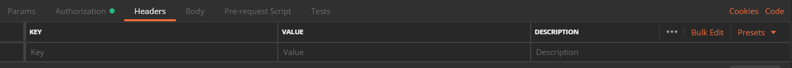

header 就是消息头管理，可以定义头部信息。

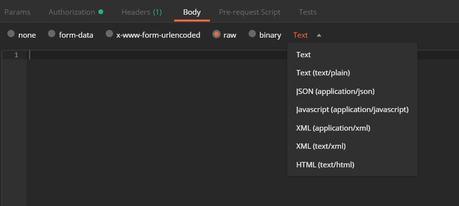Body，请求消息体。一般 Post、put、patch 等会更新内容的请求才会携带消息体，

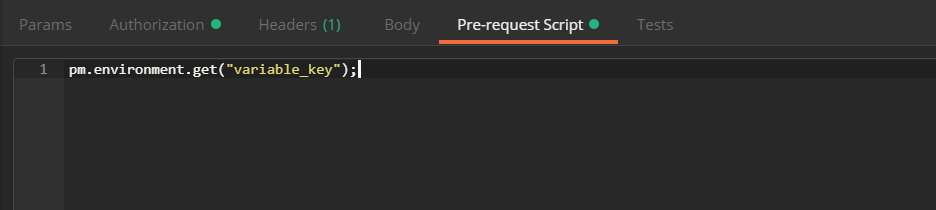

旁边 pre-script，是指在请求发送前，可以做一些预处理的工作，类似 junit 等单元测试框架中的 setup 方法，支持 js 脚本语法

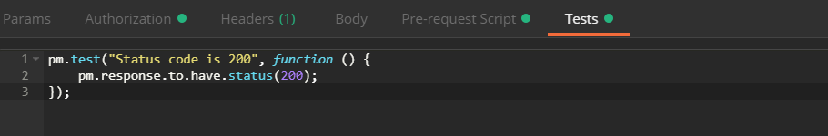Test 则是在响应以后，对响应进行校验或其他处理的，类似 junit 框架中的 teardown 方法，同样支持 js 脚本语法

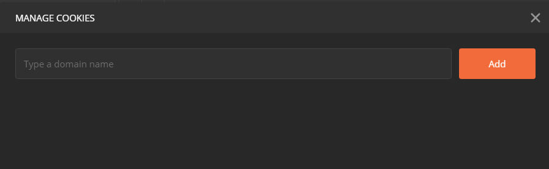

cookie 管理 postman 本地 cookie 信息

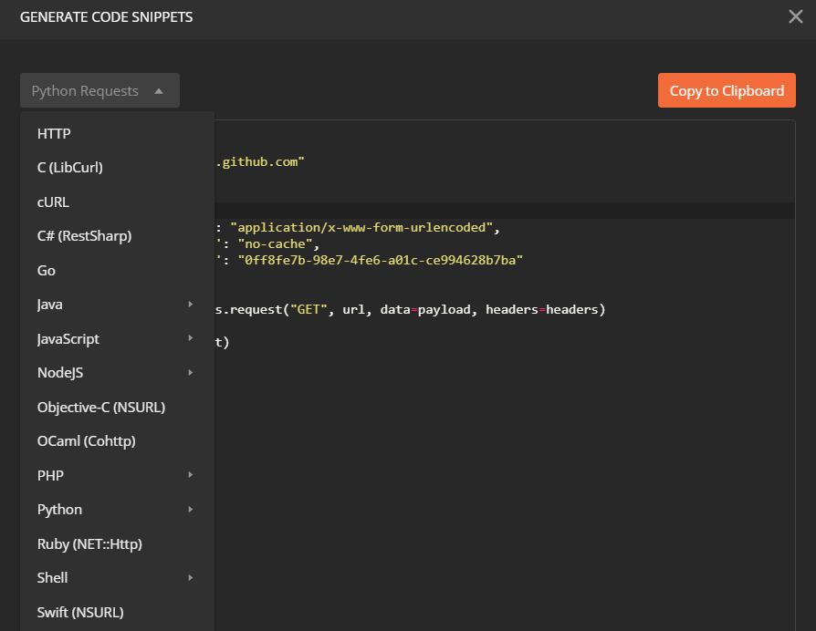code 是一个方便程序员的功能，可以自动将接口请求转化成相关语言编码，可以看到支持的语言非常丰富，基本涵盖了各种主流编程语言。

##### Response 区域


响应消息右上角是状态码，悬停可以看到详细解释。另外是响应时间（从发出请求到返回客户端接收的时间），以及消息大小（含消息头和消息体）。

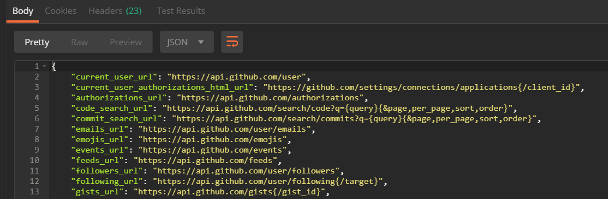响应 body 部分，即消息体。包括以下几个按钮

- pretty，可以根据表现类型进行格式化显示，默认 json，如果是其他格式类型，可以选择对应形式进行格式化。
- Raw 是未格式化的形式
- preview 是预览，就是在浏览器里渲染后呈现的样子，如果返回的是 html 格式就会很直观。
- 再旁边是自动换行按钮。

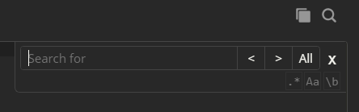

右边是拷贝到剪切板和查询按钮（支持正则，大小写敏感、全词匹配等设置）。

其他的几个 tab：

- cookie：响应消息的 cookie 信息
- header：响应消息的 header 头部信息
- Test Results：在请求中添加 test Script 后，这里会显示测试脚本的校验结果 

### Postman 中完成 Github 鉴权

下面结合 Github API 看下如何在 Postman 中进行接口测试。从 Github API 文档中，我们可以看到 Github API 支持多种鉴权方式。

- Basic authentication

```undefined

```

这是基本鉴权方式

- OAuth2 token (sent in a header)

```undefined

```

也支持通过在 Header 中携带 Oauth2 的 token 进行鉴权。在 Github 用户设置中可以生成这个 token。

个人设置 > Settings > Developer settings > Personal access tokens 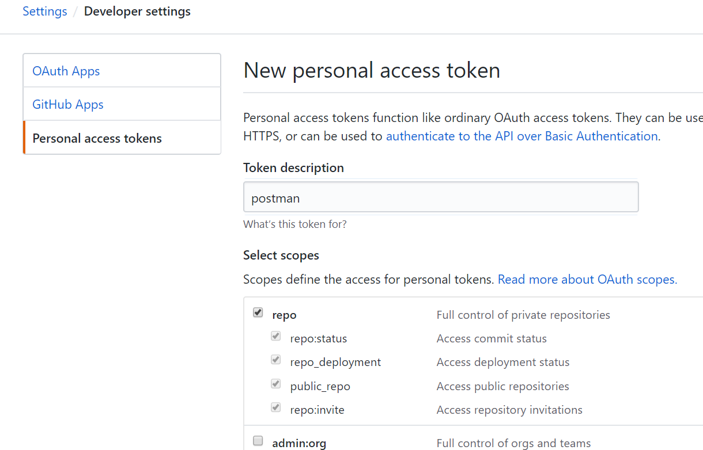生成后会获得一个 token 字串 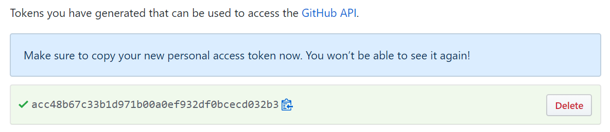

- OAuth2 token (sent as a parameter)

```undefined

```

或者通过在 URL 中携带 token 参数鉴权。

Postman 中，可以在 Collection 中设置鉴权 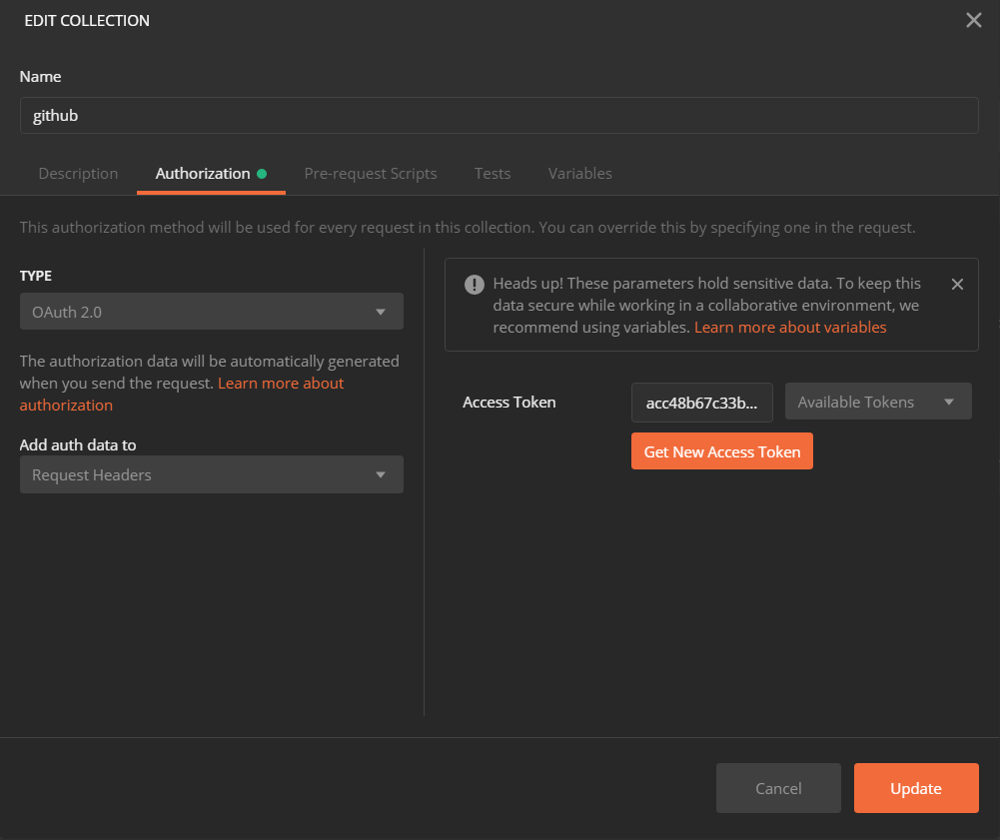在具体的请求消息中，可以选择 Inherit auth from parent，即继承上一层的鉴权。发送请求后，可以看到已经在 header 中携带了鉴权的 token 信息。 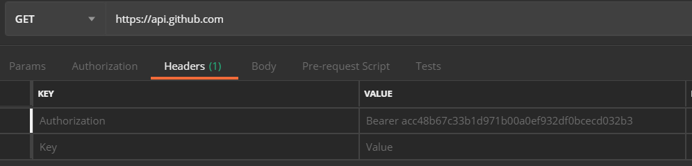

根据 [Github API 的定义](https://developer.github.com/v3/#rate-limiting)，对于请求有访问限制，即未鉴权的请求限制访问为每分钟 60 次，对于已鉴权的请求访问每分钟 5000 次。

我们从响应消息的消息头中可以看到这个设置，如：

```sql

```

### Postman 实现基本 HTTP 方法

再来看如何在 Postman 中实现常用的 HTTP 方法。还是以 Github API 为例：

#### GET 方法 - 获取 Repo 信息

> GET /repos/:owner/:repo

这里是[获取 Github上 Repo 信息的 API](https://developer.github.com/v3/repos/#get)，这里有两个路径参数，owner 代表用户账号，repo 指需要获取的 repo 信息。

如图是在 Postman 中设置路径参数的方法。 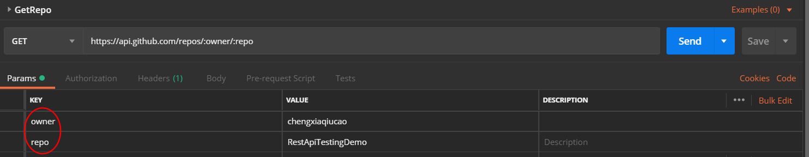

#### POST 方法 - 创建 Repo

创建 Repo 的示例(https://developer.github.com/v3/repos/#create)

> POST /user/repos

这里是一个创建 hello world 的 Repo 的请求消息体示例

```json

```

这里 name 是必填字段，其他是 repo 的属性设置。 在 Postman 中如图提交，返回状态码 201 created，即可创建一个 Hello world 的 Repo。 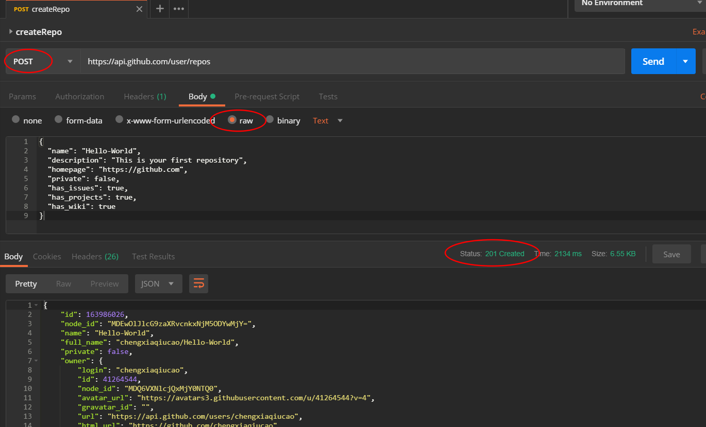

在 Github 中，可以看到账号下新增了一个 hello world 的 repo，并且包含有已设置的 issue、projects、Wiki 这几个栏目。 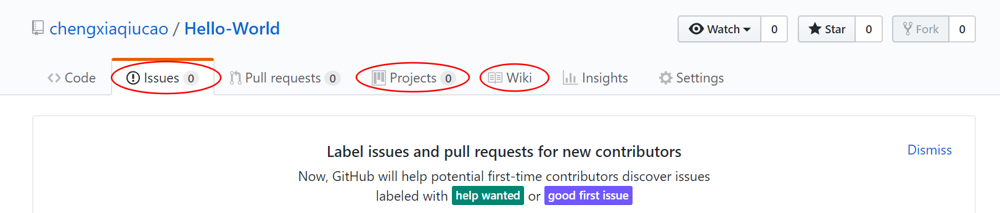

#### PATCH 方法 - 修改 Repo

GitHub 可以[通过 PATCH 方法来对 Repo 进行修改](https://developer.github.com/v3/repos/#edit)。PATCH 方法和 PUT 方法都是 update 的修改方法，但 PATCH 方法更多用在部分修改的场景下，PUT 方法则更多是整体替换。

> PATCH /repos/:owner/:repo

比如上例中 hello world 这个 Repo 修改 Repo 中的部分信息，可以去除 projects 和 Wiki 这两个栏目。

消息体：

```json

```

Postman 中如图： 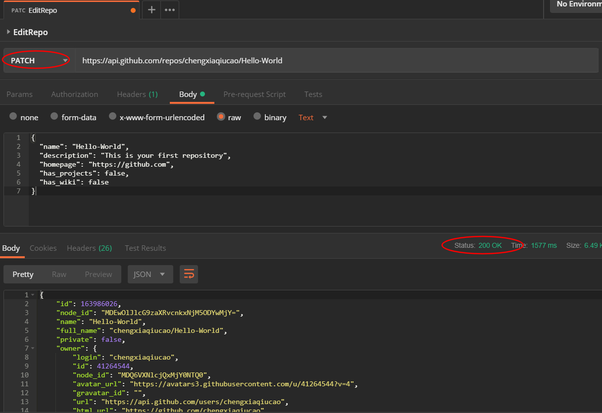

回到 Github，可以看到 Repo 中对应的栏目已经不见了。 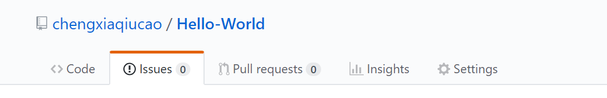

#### PUT 方法 - 设置或替换 Topic

Topic 是 Github 上 Repo 的搜索关键字，便于用户进行 Repo 查询。

> PUT /repos/:owner/:repo/topics

Github API 设置 topic 的 API 是使用 put 方法提交一个 topic 数组，如

```json

```

这时在 Postman 中提交，会发现有如下报错： 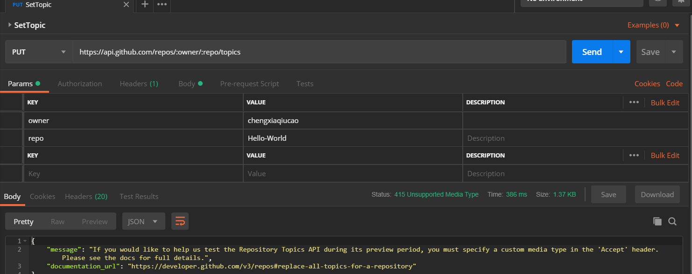

这是因为 Github API 要求设置 topic 时，需要在 header 中设置 accept 字段，取值：

> application/vnd.github.mercy-preview+json

正确设置后，则可以看到设置成功，返回 200。 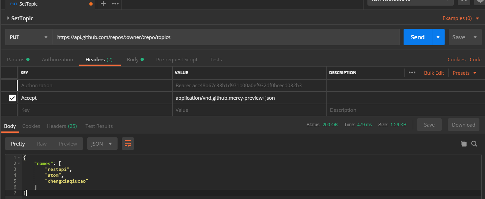

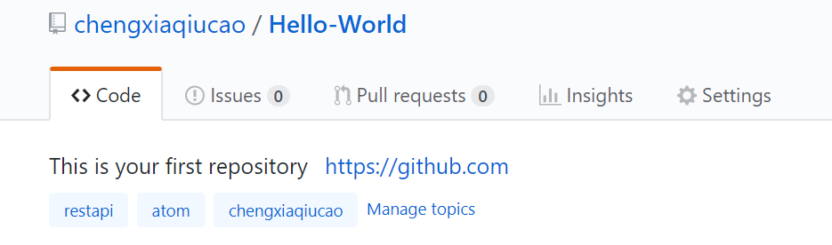

大家可能会发现一个小 bug，当设置的 topic 存在大写字符时，会出现格式报错。比如大家参照官方示例设置"API"这样的 topic，会发现设置不成功。大家可以尝试一下。

#### DELETE 方法 - 删除 Repo

Github API 中，使用 delete 方法可以删除 repo。

> DELETE /repos/:owner/:repo

删除成功后，返回 204。 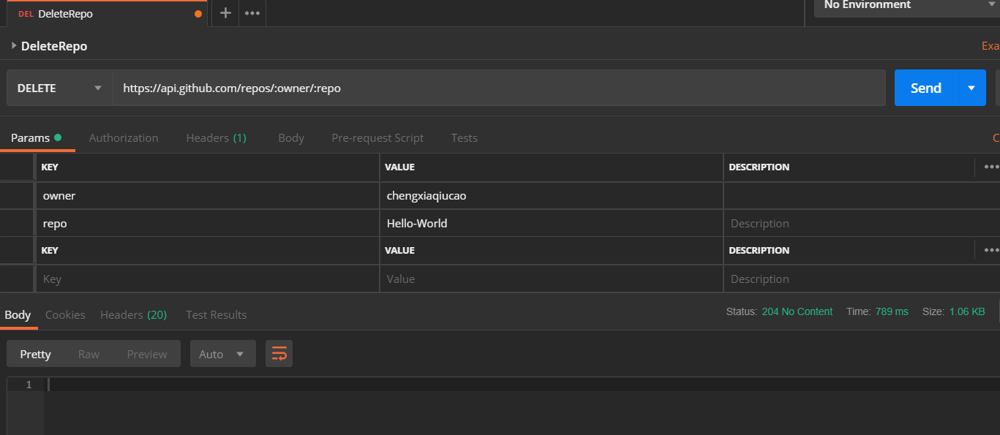此时再查询账号，应该发现 Hello-World 这个 repo 已经被删除了


# 附录--HTTP 状态码详解

HTTP 状态码详解（译自 Wiki 百科，目前所见最全面的解释）。

#### 1xx 消息

这一类型的状态码，代表请求已被接受，需要继续处理。这类响应是临时响应，只包含状态行和某些可选的响应头信息，并以空行结束。由于 HTTP/1.0 协议中没有定义任何 1xx 状态码，所以除非在某些试验条件下，服务器禁止向此类客户端发送 1xx 响应。这些状态码代表的响应都是信息性的，标示客户应该采取的其他行动。

##### 100 Continue

服务器已经接收到请求头，并且客户端应继续发送请求主体（在需要发送身体的请求的情况下：例如，POST 请求），或者如果请求已经完成，忽略这个响应。服务器必须在请求完成后向客户端发送一个最终响应。要使服务器检查请求的头部，客户端必须在其初始请求中发送 Expect: 100-continue 作为头部，并在发送正文之前接收 100 Continue 状态代码。响应代码 417 期望失败表示请求不应继续。

##### 101 Switching Protocols

服务器已经理解了客户端的请求，并将通过 Upgrade 消息头通知客户端采用不同的协议来完成这个请求。在发送完这个响应最后的空行后，服务器将会切换到在 Upgrade 消息头中定义的那些协议。

只有在切换新的协议更有好处的时候才应该采取类似措施。例如，切换到新的 HTTP 版本（如 HTTP/2）比旧版本更有优势，或者切换到一个实时且同步的协议（如 WebSocket）以传送利用此类特性的资源。

##### 102 Processing（WebDAV；RFC 2518）

WebDAV 请求可能包含许多涉及文件操作的子请求，需要很长时间才能完成请求。该代码表示服务器已经收到并正在处理请求，但无响应可用。这样可以防止客户端超时，并假设请求丢失。

#### 2xx 成功

这一类型的状态码，代表请求已成功被服务器接收、理解、并接受。

##### 200 OK

请求已成功，请求所希望的响应头或数据体将随此响应返回。实际的响应将取决于所使用的请求方法。在 GET 请求中，响应将包含与请求的资源相对应的实体。在 POST 请求中，响应将包含描述或操作结果的实体。

##### 201 Created

请求已经被实现，而且有一个新的资源已经依据请求的需要而创建，且其 URI 已经随 Location 头信息返回。假如需要的资源无法及时创建的话，应当返回 '202 Accepted'。

##### 202 Accepted

服务器已接受请求，但尚未处理。最终该请求可能会也可能不会被执行，并且可能在处理发生时被禁止。

##### 203 Non-Authoritative Information（自 HTTP / 1.1 起）

服务器是一个转换代理服务器（transforming proxy，例如网络加速器），以 200 OK 状态码为起源，但回应了原始响应的修改版本。

##### 204 No Content

服务器成功处理了请求，没有返回任何内容。

##### 205 Reset Content

服务器成功处理了请求，但没有返回任何内容。与 204 响应不同，此响应要求请求者重置文档视图。

##### 206 Partial Content（RFC 7233）

服务器已经成功处理了部分GET请求。类似于FlashGet或者迅雷这类的HTTP 下载工具都是使用此类响应实现断点续传或者将一个大文档分解为多个下载段同时下载。

##### 207 Multi-Status（WebDAV；RFC 4918）

代表之后的消息体将是一个 XML 消息，并且可能依照之前子请求数量的不同，包含一系列独立的响应代码。

##### 208 Already Reported （WebDAV；RFC 5842）

DAV 绑定的成员已经在（多状态）响应之前的部分被列举，且未被再次包含。

##### 226 IM Used （RFC 3229）

服务器已经满足了对资源的请求，对实体请求的一个或多个实体操作的结果表示。

#### 3xx 重定向

这类状态码代表需要客户端采取进一步的操作才能完成请求。通常，这些状态码用来重定向，后续的请求地址（重定向目标）在本次响应的 Location 域中指明。

当且仅当后续的请求所使用的方法是 GET 或者 HEAD 时，用户浏览器才可以在没有用户介入的情况下自动提交所需要的后续请求。客户端应当自动监测无限循环重定向（例如：A→B→C→……→A 或 A→A），因为这会导致服务器和客户端大量不必要的资源消耗。按照 HTTP/1.0 版规范的建议，浏览器不应自动访问超过 5 次的重定向。

##### 300 Multiple Choices

被请求的资源有一系列可供选择的回馈信息，每个都有自己特定的地址和浏览器驱动的商议信息。用户或浏览器能够自行选择一个首选的地址进行重定向。

除非这是一个 HEAD 请求，否则该响应应当包括一个资源特性及地址的列表的实体，以便用户或浏览器从中选择最合适的重定向地址。这个实体的格式由 Content-Type 定义的格式所决定。浏览器可能根据响应的格式以及浏览器自身能力，自动作出最合适的选择。当然，RFC 2616 规范并没有规定这样的自动选择该如何进行。

如果服务器本身已经有了首选的回馈选择，那么在 Location 中应当指明这个回馈的 URI；浏览器可能会将这个 Location 值作为自动重定向的地址。此外，除非额外指定，否则这个响应也是可缓存的。

##### 301 Moved Permanently

被请求的资源已永久移动到新位置，并且将来任何对此资源的引用都应该使用本响应返回的若干个 URI 之一。如果可能，拥有链接编辑功能的客户端应当自动把请求的地址修改为从服务器反馈回来的地址。除非额外指定，否则这个响应也是可缓存的。

新的永久性的 URI 应当在响应的 Location 域中返回。除非这是一个 HEAD 请求，否则响应的实体中应当包含指向新的 URI 的超链接及简短说明。 如果这不是一个 GET 或者 HEAD 请求，因此浏览器禁止自动进行重定向，除非得到用户的确认，因为请求的条件可能因此发生变化。

注意：对于某些使用 HTTP/1.0 协议的浏览器，当它们发送的 POST 请求得到了一个 301 响应的话，接下来的重定向请求将会变成 GET 方式。

##### 302 Found

要求客户端执行临时重定向（原始描述短语为“Moved Temporarily”）。由于这样的重定向是临时的，客户端应当继续向原有地址发送以后的请求。只有在 Cache-Control 或 Expires 中进行了指定的情况下，这个响应才是可缓存的。

新的临时性的 URI 应当在响应的 Location 域中返回。除非这是一个 HEAD 请求，否则响应的实体中应当包含指向新的 URI 的超链接及简短说明。 如果这不是一个 GET 或者 HEAD 请求，那么浏览器禁止自动进行重定向，除非得到用户的确认，因为请求的条件可能因此发生变化。

注意：虽然 RFC 1945 和 RFC 2068 规范不允许客户端在重定向时改变请求的方法，但是很多现存的浏览器将 302 响应视作为 303 响应，并且使用 GET 方式访问在 Location 中规定的 URI，而无视原先请求的方法。因此状态码 303 和 307 被添加了进来，用以明确服务器期待客户端进行何种反应。

##### 303 See Other

对应当前请求的响应可以在另一个 URI 上被找到，当响应于 POST（或 PUT / DELETE）接收到响应时，客户端应该假定服务器已经收到数据，并且应该使用单独的 GET 消息发出重定向。这个方法的存在主要是为了允许由脚本激活的 POST 请求输出重定向到一个新的资源。这个新的 URI 不是原始资源的替代引用。同时，303 响应禁止被缓存。当然，第二个请求（重定向）可能被缓存。

新的 URI 应当在响应的 Location 域中返回。除非这是一个 HEAD 请求，否则响应的实体中应当包含指向新的 URI 的超链接及简短说明。

注意：许多 HTTP/1.1 版以前的浏览器不能正确理解 303 状态。如果需要考虑与这些浏览器之间的互动，302 状态码应该可以胜任，因为大多数的浏览器处理 302 响应时的方式恰恰就是上述规范要求客户端处理 303 响应时应当做的。

##### 304 Not Modified

表示资源未被修改，因为请求头指定的版本 If-Modified-Since 或 If-None-Match。在这种情况下，由于客户端仍然具有以前下载的副本，因此不需要重新传输资源。

##### 305 Use Proxy

被请求的资源必须通过指定的代理才能被访问。Location 域中将给出指定的代理所在的 URI 信息，接收者需要重复发送一个单独的请求，通过这个代理才能访问相应资源。只有原始服务器才能创建 305 响应。许多 HTTP 客户端（像是 Mozilla 和 Internet Explorer）都没有正确处理这种状态代码的响应，主要是出于安全考虑。

注意：RFC 2068 中没有明确 305 响应是为了重定向一个单独的请求，而且只能被原始服务器建立。忽视这些限制可能导致严重的安全后果。

##### 306 Switch Proxy

在最新版的规范中，306 状态码已经不再被使用。最初是指“后续请求应使用指定的代理”。

##### 307 Temporary Redirect

在这种情况下，请求应该与另一个 URI 重复，但后续的请求应仍使用原始的 URI。 与 302 相反，当重新发出原始请求时，不允许更改请求方法。 例如，应该使用另一个 POST 请求来重复 POST 请求。

##### 308 Permanent Redirect (RFC 7538)

请求和所有将来的请求应该使用另一个 URI 重复。 307 和 308 重复 302 和 301 的行为，但不允许 HTTP 方法更改。 例如，将表单提交给永久重定向的资源可能会顺利进行。

#### 4xx 客户端错误

这类的状态码代表了客户端看起来可能发生了错误，妨碍了服务器的处理。除非响应的是一个 HEAD 请求，否则服务器就应该返回一个解释当前错误状况的实体，以及这是临时的还是永久性的状况。这些状态码适用于任何请求方法。浏览器应当向用户显示任何包含在此类错误响应中的实体内容。

如果错误发生时客户端正在传送数据，那么使用 TCP 的服务器实现应当仔细确保在关闭客户端与服务器之间的连接之前，客户端已经收到了包含错误信息的数据包。如果客户端在收到错误信息后继续向服务器发送数据，服务器的 TCP 栈将向客户端发送一个重置数据包，以清除该客户端所有还未识别的输入缓冲，以免这些数据被服务器上的应用程序读取并干扰后者。

##### 400 Bad Request

由于明显的客户端错误（例如，格式错误的请求语法，太大的大小，无效的请求消息或欺骗性路由请求），服务器不能或不会处理该请求。

##### 401 Unauthorized（RFC 7235）

参见：HTTP 基本认证、HTTP 摘要认证。

类似于 403 Forbidden，401 语义即“未认证”，即用户没有必要的凭据。该状态码表示当前请求需要用户验证。该响应必须包含一个适用于被请求资源的 WWW-Authenticate 信息头用以询问用户信息。客户端可以重复提交一个包含恰当的 Authorization 头信息的请求。如果当前请求已经包含了 Authorization 证书，那么 401 响应代表着服务器验证已经拒绝了那些证书。如果 401 响应包含了与前一个响应相同的身份验证询问，且浏览器已经至少尝试了一次验证，那么浏览器应当向用户展示响应中包含的实体信息，因为这个实体信息中可能包含了相关诊断信息。

注意：当网站（通常是网站域名）禁止 IP 地址时，有些网站状态码显示的 401，表示该特定地址被拒绝访问网站。

##### 402 Payment Required

该状态码是为了将来可能的需求而预留的。该状态码最初的意图可能被用作某种形式的数字现金或在线支付方案的一部分，但几乎没有哪家服务商使用，而且这个状态码通常不被使用。如果特定开发人员已超过请求的每日限制，Google Developers API 会使用此状态码。

##### 403 Forbidden

主条目：HTTP 403

服务器已经理解请求，但是拒绝执行它。与 401 响应不同的是，身份验证并不能提供任何帮助，而且这个请求也不应该被重复提交。如果这不是一个 HEAD 请求，而且服务器希望能够讲清楚为何请求不能被执行，那么就应该在实体内描述拒绝的原因。当然服务器也可以返回一个 404 响应，假如它不希望让客户端获得任何信息。

##### 404 Not Found

主条目：HTTP 404

请求失败，请求所希望得到的资源未被在服务器上发现，但允许用户的后续请求。没有信息能够告诉用户这个状况到底是暂时的还是永久的。假如服务器知道情况的话，应当使用 410 状态码来告知旧资源因为某些内部的配置机制问题，已经永久的不可用，而且没有任何可以跳转的地址。404 这个状态码被广泛应用于当服务器不想揭示到底为何请求被拒绝或者没有其他适合的响应可用的情况下。

##### 405 Method Not Allowed

请求行中指定的请求方法不能被用于请求相应的资源。该响应必须返回一个 Allow 头信息用以表示出当前资源能够接受的请求方法的列表。例如，需要通过 POST 呈现数据的表单上的GET请求，或只读资源上的 PUT 请求。

鉴于 PUT，DELETE 方法会对服务器上的资源进行写操作，因而绝大部分的网页服务器都不支持或者在默认配置下不允许上述请求方法，对于此类请求均会返回 405 错误。

##### 406 Not Acceptable

参见：内容协商

请求的资源的内容特性无法满足请求头中的条件，因而无法生成响应实体，该请求不可接受。

除非这是一个 HEAD 请求，否则该响应就应当返回一个包含可以让用户或者浏览器从中选择最合适的实体特性以及地址列表的实体。实体的格式由 Content-Type 头中定义的媒体类型决定。浏览器可以根据格式及自身能力自行作出最佳选择。但是，规范中并没有定义任何作出此类自动选择的标准。

##### 407 Proxy Authentication Required（RFC 2617）

与 401 响应类似，只不过客户端必须在代理服务器上进行身份验证。代理服务器必须返回一个 Proxy-Authenticate 用以进行身份询问。客户端可以返回一个 Proxy-Authorization 信息头用以验证。

##### 408 Request Timeout

请求超时。根据 HTTP 规范，客户端没有在服务器预备等待的时间内完成一个请求的发送，客户端可以随时再次提交这一请求而无需进行任何更改。

##### 409 Conflict

表示因为请求存在冲突无法处理该请求，例如多个同步更新之间的编辑冲突。

##### 410 Gone

表示所请求的资源不再可用，将不再可用。当资源被有意地删除并且资源应被清除时，应该使用这个。在收到 410 状态码后，用户应停止再次请求资源。但大多数服务端不会使用此状态码，而是直接使用 404 状态码。

##### 411 Length Required

服务器拒绝在没有定义 Content-Length 头的情况下接受请求。在添加了表明请求消息体长度的有效 Content-Length 头之后，客户端可以再次提交该请求。

##### 412 Precondition Failed（RFC 7232）

服务器在验证在请求的头字段中给出先决条件时，没能满足其中的一个或多个。这个状态码允许客户端在获取资源时在请求的元信息（请求头字段数据）中设置先决条件，以此避免该请求方法被应用到其希望的内容以外的资源上。

##### 413 Request Entity Too Large（RFC 7231）

前称“Request Entity Too Large”，表示服务器拒绝处理当前请求，因为该请求提交的实体数据大小超过了服务器愿意或者能够处理的范围。此种情况下，服务器可以关闭连接以免客户端继续发送此请求。

如果这个状况是临时的，服务器应当返回一个 Retry-After 的响应头，以告知客户端可以在多少时间以后重新尝试。

##### 414 Request-URI Too Long（RFC 7231）

前称“Request-URI Too Long”，表示请求的 URI 长度超过了服务器能够解释的长度，因此服务器拒绝对该请求提供服务。通常将太多数据的结果编码为GET请求的查询字符串，在这种情况下，应将其转换为 POST 请求。这比较少见，通常的情况包括：

本应使用 POST 方法的表单提交变成了 GET 方法，导致查询字符串过长。

重定向 URI“黑洞”，例如每次重定向把旧的 URI 作为新的 URI 的一部分，导致在若干次重定向后 URI 超长。

客户端正在尝试利用某些服务器中存在的安全漏洞攻击服务器。这类服务器使用固定长度的缓冲读取或操作请求的 URI，当 GET 后的参数超过某个数值后，可能会产生缓冲区溢出，导致任意代码被执行。没有此类漏洞的服务器，应当返回 414 状态码。

##### 415 Unsupported Media Type

对于当前请求的方法和所请求的资源，请求中提交的互联网媒体类型并不是服务器中所支持的格式，因此请求被拒绝。例如，客户端将图像上传格式为 svg，但服务器要求图像使用上传格式为 jpg。

##### 416 Requested Range Not Satisfiable（RFC 7233）

前称“Requested Range Not Satisfiable”。客户端已经要求文件的一部分（Byte serving），但服务器不能提供该部分。例如，如果客户端要求文件的一部分超出文件尾端。

##### 417 Expectation Failed

在请求头 Expect 中指定的预期内容无法被服务器满足，或者这个服务器是一个代理服显的证据证明在当前路由的下一个节点上，Expect 的内容无法被满足。

##### 418 I'm a teapot（RFC 2324）

本操作码是在 1998 年作为 IETF 的传统愚人节笑话, 在 RFC 2324 超文本咖啡壶控制协议中定义的，并不需要在真实的 HTTP 服务器中定义。当一个控制茶壶的 HTCPCP 收到 BREW 或 POST 指令要求其煮咖啡时应当回传此错误。这个 HTTP 状态码在某些网站（包括 Google.com）与项目（如 Node.js、ASP.NET 和 Go 语言）中用作彩蛋。

##### 420 Enhance Your Caim

Twitter Search 与 Trends API 在客户端被限速的情况下返回。

##### 421 Misdirected Request （RFC 7540）

该请求针对的是无法产生响应的服务器（例如因为连接重用）。

##### 422 Unprocessable Entity（WebDAV；RFC 4918 ）

请求格式正确，但是由于含有语义错误，无法响应。

##### 423 Locked（WebDAV；RFC 4918）

当前资源被锁定。

##### 424 Failed Dependency（WebDAV；RFC 4918）

由于之前的某个请求发生的错误，导致当前请求失败，例如 PROPPATCH。

##### 425 Unordered Collection

在 WebDAV Advanced Collections Protocol 中定义，但 Web Distributed Authoring and Versioning (WebDAV) Ordered Collections Protocol 中并不存在。

##### 426 Upgrade Required（RFC 2817）

客户端应当切换到TLS/1.0，并在HTTP/1.1 Upgrade header中给出。

##### 428 Precondition Required (RFC 6585)

原服务器要求该请求满足一定条件。这是为了防止“‘未更新’问题，即客户端读取（GET）一个资源的状态，更改它，并将它写（PUT）回服务器，但这期间第三方已经在服务器上更改了该资源的状态，因此导致了冲突。”

##### 429 Too Many Requests （RFC 6585）

用户在给定的时间内发送了太多的请求。旨在用于网络限速。

##### 431 Request Header Fields Too Large （RFC 6585）

服务器不愿处理请求，因为一个或多个头字段过大。

##### 444 No Response

Nginx 上 HTTP 服务器扩展。服务器不向客户端返回任何信息，并关闭连接（有助于阻止恶意软件）。

##### 450 Blocked by Windows Parental Controls

这是一个由 Windows 家庭控制（Microsoft）HTTP 阻止的 450 状态代码的示例，用于信息和测试。

##### 451 Unavailable For Legal Reasons

该访问因法律的要求而被拒绝，由 IETF 在 2015 核准后新增加。

##### 494 Request Header Too Large

在错误代码 431 提出之前 Nginx 上使用的扩展 HTTP 代码。

#### 5xx 服务器错误

表示服务器无法完成明显有效的请求。这类状态码代表了服务器在处理请求的过程中有错误或者异常状态发生，也有可能是服务器意识到以当前的软硬件资源无法完成对请求的处理。除非这是一个 HEAD 请求，否则服务器应当包含一个解释当前错误状态以及这个状况是临时的还是永久的解释信息实体。浏览器应当向用户展示任何在当前响应中被包含的实体。这些状态码适用于任何响应方法。

##### 500 Internal Server Error

通用错误消息，服务器遇到了一个未曾预料的状况，导致了它无法完成对请求的处理。没有给出具体错误信息。

##### 501 Not Implemented

服务器不支持当前请求所需要的某个功能。当服务器无法识别请求的方法，并且无法支持其对任何资源的请求。（例如，网络服务API的新功能）

##### 502 Bad Gateway

作为网关或者代理工作的服务器尝试执行请求时，从上游服务器接收到无效的响应。

##### 503 Service Unavailable

由于临时的服务器维护或者过载，服务器当前无法处理请求。这个状况是暂时的，并且将在一段时间以后恢复。如果能够预计延迟时间，那么响应中可以包含一个 Retry-After 头用以标明这个延迟时间。如果没有给出这个 Retry-After 信息，那么客户端应当以处理 500 响应的方式处理它。

##### 504 Gateway Timeout

作为网关或者代理工作的服务器尝试执行请求时，未能及时从上游服务器（URI 标识出的服务器，例如 HTTP、FTP、LDAP）或者辅助服务器（例如 DNS）收到响应。

注意：某些代理服务器在 DNS 查询超时时会返回 400 或者 500 错误。

##### 505 HTTP Version Not Supported

服务器不支持，或者拒绝支持在请求中使用的 HTTP 版本。这暗示着服务器不能或不愿使用与客户端相同的版本。响应中应当包含一个描述了为何版本不被支持以及服务器支持哪些协议的实体。

##### 506 Variant Also Negotiates（RFC 2295）

由《透明内容协商协议》（RFC 2295）扩展，代表服务器存在内部配置错误，被请求的协商变元资源被配置为在透明内容协商中使用自己，因此在一个协商处理中不是一个合适的重点。

##### 507 Insufficient Storage（WebDAV；RFC 4918）

服务器无法存储完成请求所必须的内容。这个状况被认为是临时的。

##### 508 Loop Detected （WebDAV；RFC 5842）

服务器在处理请求时陷入死循环。 （可代替 208 状态码）

##### 510 Not Extended（RFC 2774）

获取资源所需要的策略并没有被满足。

##### 511 Network Authentication Required （RFC 6585）

客户端需要进行身份验证才能获得网络访问权限，旨在限制用户群访问特定网络（例如连接 WiFi 热点时的强制网络门户）。


# 总结

> 学完Postman就可以愉快的进行接口测试了~
>
> 如有不懂欢迎留言~

