# Day18 工具篇——C站最全jmeter讲解（3）

[TOC]

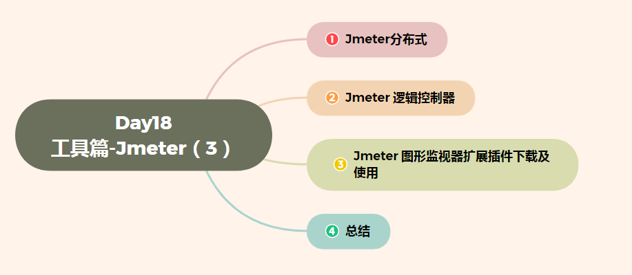


# 一、Jmeter分布式

## 1.  为什么使用Jmter分布式测试

### 1.1 需求

```
对学院接口(查询学院-所有)进行1000用户并发访问，测试服务器处理批量请求能力
```

### 1.2 现状

```
我们单台电脑由于配置(CPU、内存)问题，最模拟500用户时，就出现卡死现象
```

> 按照一般的压力机配置，jmeter的GUI模式下（Windows），**最多支**持300左右的模拟请求线程**，再大的话，容易造成卡顿、无响应等情况，这是限于jmeter其本身的机制和硬件配置。
>
> 有时候为了尽量模拟业务场景，需要模拟大量的并发请求，这个时候单台压力机就显得有心无力。针对这个情况，jmeter的解决方案是支持分布式压测，即将大量的模拟并发分配给多台压力机，来满足这种大流量的并发请求场景。

## 2. 分布式测试

### 2.1 分布式测试原理

> 注意：各个测试机的Jmeter版本要一致、csv文件等相对位置要相同

```
1. 一台电脑作为控制机(Controller)，其它电脑做为执行机(Agent);
2. 执行时，控制机会把脚本发送到每台执行机上，执行机拿到脚本后就开始执行
3. 执行机执行时不需要启动Jmeter界面，可以理解它是通过命令行模式执行的
4. 执行完成后，执行机会把结果回传给控制机，控制机会收集所有执行机的信息并汇总
```

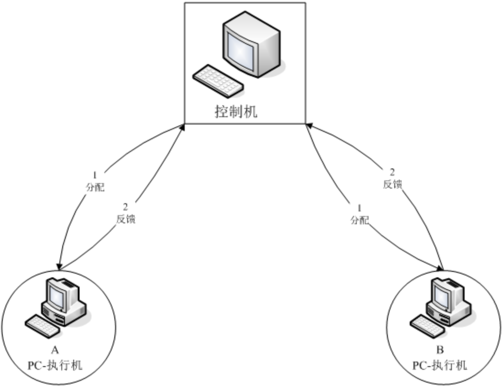

### 2.2 执行方案分析

```
1. 1台电脑(控制机)分发执行任务
2. 2台电脑(执行机)执行任务
3. 在执行机上启动监听服务程序
4. 在控制机上启动运行
5. 测试计划->聚合报告
```

### 2.3 技术难点分析

```
1. 执行机-jmeter.properties设置
2. 控制机jmeter.properties设置
3. 执行机启动分布式监听服务程序
3. 2台执行机,用户数如何设置
```

### 2.4 执行机Jmeter.properties配置图

```
1. 分别打开执行机下jmeter安装文件下的bin目录:jmeter.properties, 找到server_port
2. server_Port=1099.    1099为执行机自定义端口号
3. 注意:
	- 要取消注释符号 #
	- 自定义的端口号,要选择未被占用的端口号

```

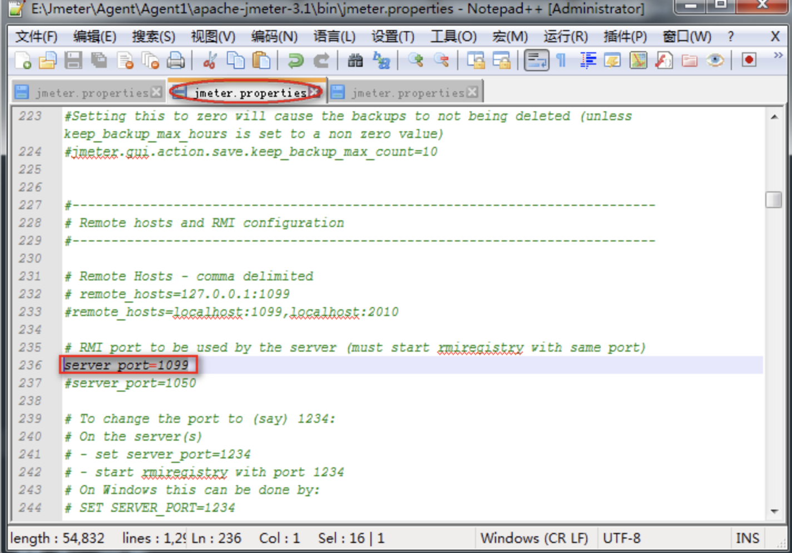

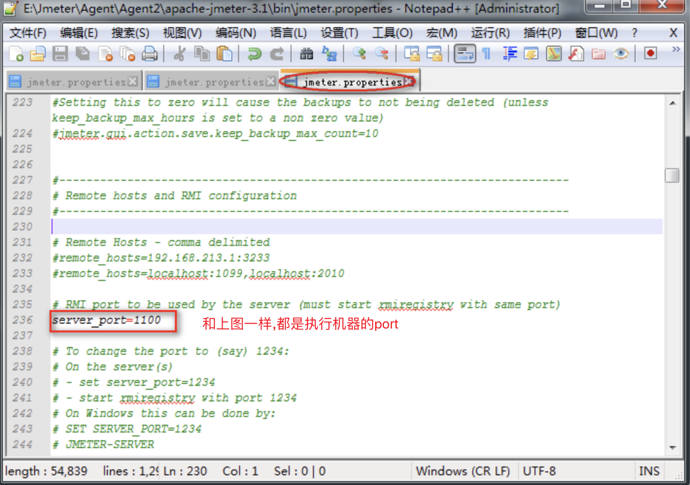

### 2.5 控制机jmeter.properties配置图

```
1.打开控制机下jmeter安装文件下的bin目录:jmeter.properties,找搭配remote_hosts
2. remote_hosts=127.0.0.1:1099,127.0.0.1:1100
3. 注意事项:
   - 多个执行机的ip间要用全英文的半角逗号隔开 
```

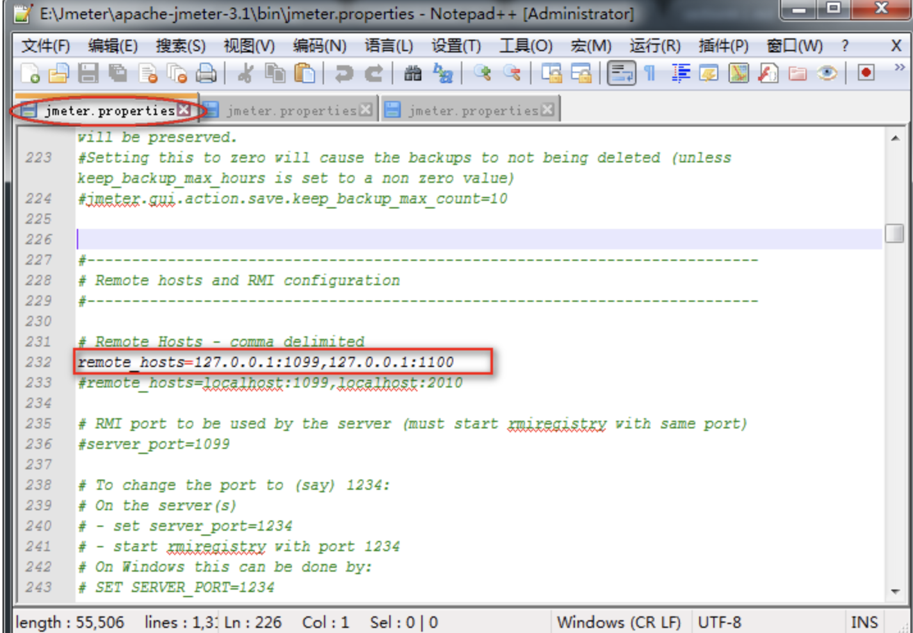

### 2.6 执行机启动分布式监听效果图

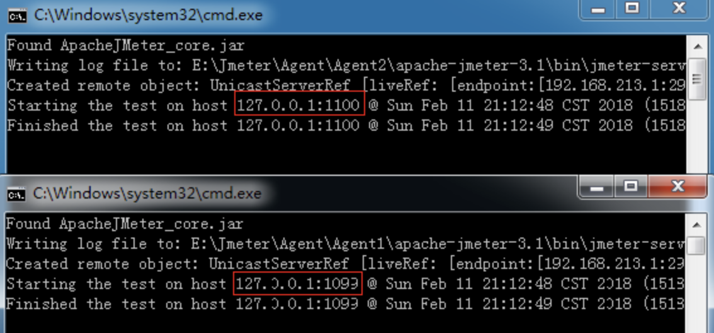

```
1. 运行bin目录下jmeter-server.bat
2. 运行后勿关闭黑色窗口
```

### 2.7 控制机-线程数设置

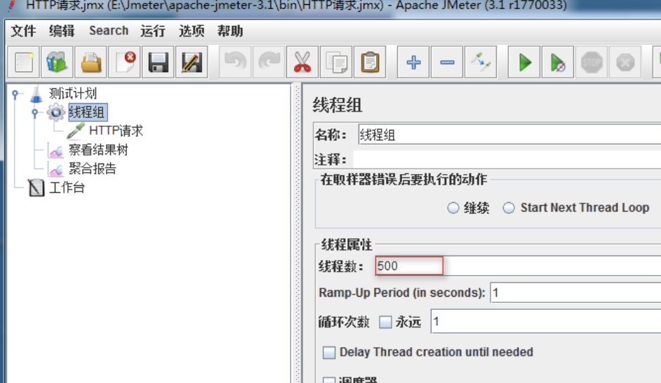

>  **注意:**
>
>  需求1000用户,两台执行机同时接受控制机脚本去执行然后反馈给控制机，所以线程数设置500

### 2.8 控制机-运行效果图

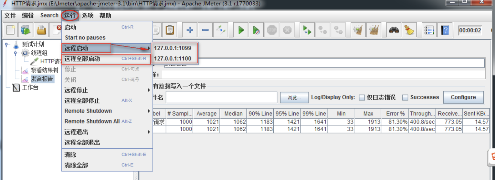

```
1. 菜单-运行->选择全部启动
2. 快捷键->Ctrl+Shift+R
```

### 2.9 提示

```
1. 修改完端口要重启Jmeter.bat
2. 控制机和执行机分开(为了方便教学,这里采用控制机和代理机在1台机器上)
   1). 由于控制机需要发送信息给执行机并且会接受执行机回传的测试数据所以控制机自身会有消耗
3. 参数文件：如果使用csv进行参数化，那么需要把参数文件在每台执行机上拷一份且路径需要设置成一样的；
4. 每台机器上安装的Jmeter版本和插件最好都一致，否则会出一些意外的问题；
5. 执行机上Jmeter也许需要配置JDK环境变量；
```

### 2.10 分布式-总结

```
1. 分布式概念
2. 分布式原理
3. 执行机配置文件设置
4. 控制机配置文件设置
5. 控制机线程数设置
```


# 二、Jmeter 逻辑控制器


## 1 为什么要学习逻辑控制器？

### 1.1 需求

```
1. name=['百度','京东','淘宝']
2. name=百度,线程组执行请求百度；name=京东,线程组执行请求京东；name=淘宝,线程组执行请求淘宝;
```

### 1.2 问题

```
1. Jmeter目前学习的知识无法使用判断语句去控制HTTP取样器
```

------

## 2. 什么是逻辑控制器？

```
概念：Jmeter逻辑控制器是可以控制采样器(Sampler)的执行顺序，它由多个逻辑控制语句封装成不同功能的组件组成
```

### 2.1 逻辑控制器作用域

```
作用域：只对其子节点的sampler有效。
```

### 2.2 逻辑控制器分类

```
1. 控制类：控制采样器执行顺序类
2. 分组类：对采样器进行分组类
```

------

## 3. 常用(控制类)逻辑控制器

```
1. 如果（If）控制器
2. ForEach控制器
3. 交替控制器
4. 循环控制器
5. 仅一次控制器
6. 随机控制器
7. 随机顺序控制器
8. While Controller  
9. Switch Controller
```

### 3.1 如果（If）控制器

```
作用：条件成真,则执行控制器下所有取样器
```

#### 解决方案分析

```
1. 测试计划->线程组
1. 测试计划->用户自定义变量
2. 线程组->如果（If）控制器
3. 如果（If）控制器->HTTP请求
4. 测试计划-察看结果树
```

#### 技术难点分析

```
如果（If）控制器 参数设置
```

#### 如果（If）控制器参数配置图

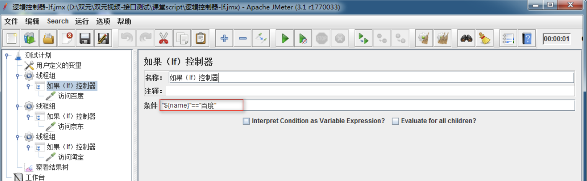

```
1. 条件:"${name}"=="百度"
2. 注意：
    1) 引用变量格式${name}需要被双引号括起来
    2) 两个等号
    3) 值需要被双引号括起来 
```

#### 如果(If)控制器-总结

```
1. 作用
2. 作用域
3. 条件格式
```

------

### 3.2 ForEach控制器

```
作用：ForEach控制器一般和用户定义的变量一起使用，在用户自定义变量中读取一系列相关的变量。
```

#### 案例1

```
使用ForEach组件读取自定义变量,作为请求(查询学院-所有)的user变量值使用
```

#### 操作分析

```
1. 测试计划->线程组
2. 线程组->用户定义的变量
3. 线程组->ForEach控制器
4. ForEach控制器->HTTP请求
5. 测试计划->察看结果树
```

#### 技术难点分析

```
1. ForEach控制器参数设置
2. 用户定义的变量书写格式(前缀+_+数字)
```

#### ForEach控制器参数配置图

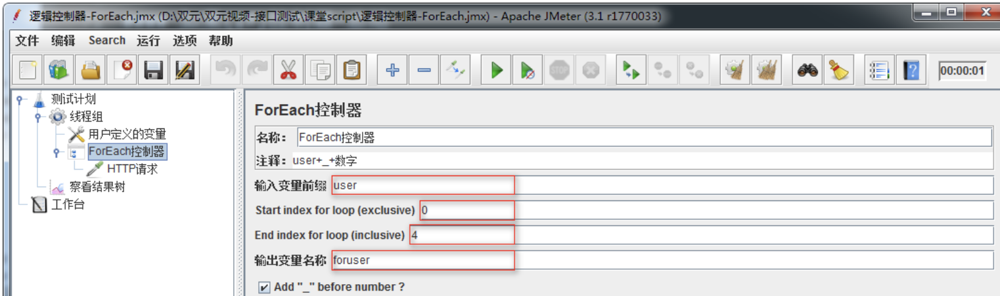

```
1. 输入前缀变量：输入要遍历变量前缀
2. Start index for loop(exclusive):遍历变量开始的索引(从0开始)
3. End index for loop(inclusive):遍历变量结束的索引(不包括结束索引)
4. 输出变量名称:定义要被引用的变量名称
```

#### ForEach控制器-总结

```
1. 作用
2. 使用ForEach读取用户定义的变量时，变量格式
3. ForEach参数设置
```

------

### 3.3 交替控制器

```
作用：交替控制，该控制器包含的所有取样器，步骤交错执行在每个循环中；
```

#### 案例2

```
使用交替控制器,运行脚本完成2次请求：
第一次请求(查询学院-所有)和(查询学院-指定)
第二次请求(查询学院-所有)和(查询学院-id_list)
```

#### 操作步骤分析

```
1. 测试计划->线程组
2. 线程组->HTTP请求(查询学院-所有)
3. 线程组->交替控制器
4. 交替控制器->HTTP请求(查询学院-指定)
5. 交替控制器->HTTP请求(查询学院-id_list)
```

#### 交替控制器使用图

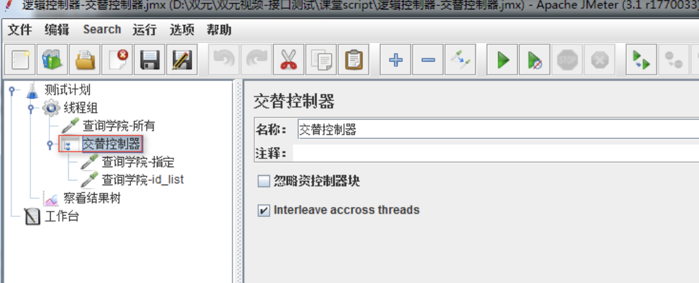

#### 交替控制器-总结

```
1. 作用
2. 使用方法
```

------

### 3.4 循环控制器

```
作用：指定循环控制器内取样器的执行次数
```

#### 案例3

```
使用循环控制器执行(查询学院-所有)接口10次
```

#### 操作步骤分析

```
1. 测试计划->线程组
2. 线程组->循环控制器
3. 循环控制器->HTTP请求(查询学院-所有)
4. 测试计划->察看结果树
```

#### 循环控制器配置图

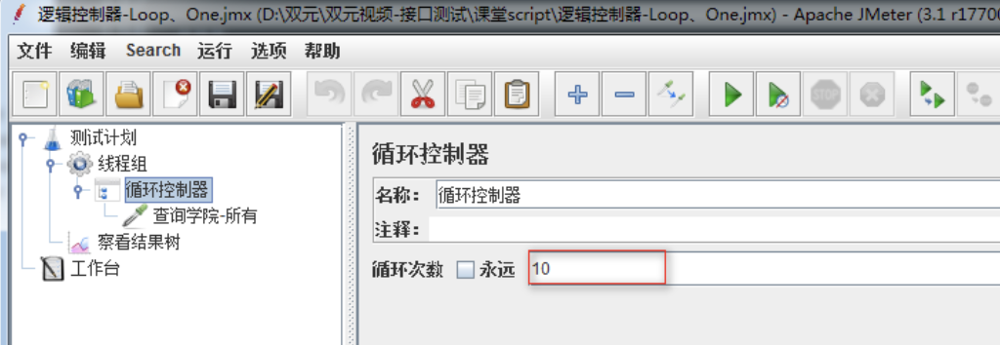

```
1. 循环次数：要执行的次数
```

#### 循环控制器-总结

```
1. 作用
```

------

### 3.5 仅一次控制器

```
作用：该控制器下取样器只执行1次；
```

#### 案例4

```
基于案例3循环控制器中执行10次（查询学院-所有），执行1次（查询学院-指定）
```

#### 操作分析

```
1. 循环控制器->仅一次控制器
2. 仅一次控制器->HTTP请求(查询学院-指定)
```

#### 仅一次控制器使用图


#### 仅一次控制器-总结

```
1. 作用
```

------

### 3.6 随机控制器

```
作用：随机执行其下的所某个请求
```

#### 案例5

```
线程组下有3个查询学院请求[所有、指定、条件]，使用随机控制器随机执行其中1个请求
```

#### 操作步骤

```
1. 测试计划->线程组
2. 线程组->逻辑控制器->随机控制器
3. 随机控制器->HTTP请求(查询学院-所有)
4. 随机控制器->HTTP请求(查询学院-指定)
5. 随机控制器->HTTP请求(查询学院-条件)
6. 测试计划->察看结果树
```

#### 随机控制器使用图

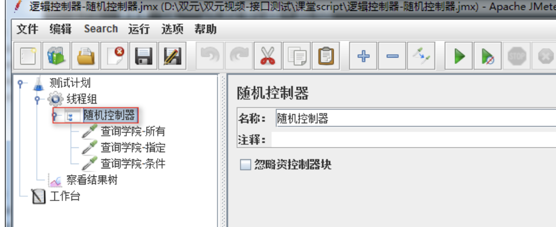

#### 随机控制器-总结

```
1. 作用
```

------

### 3.7 随机顺序控制器

```
作用：对控制器下所有采样器,随机产生1个执行顺序，进行执行
```

#### 案例6

```
线程组下有3个查询学院请求[所有、指定、条件]，使用随机顺序控制器，随机产生一个执行顺序
```

#### 操作步骤

```
1. 测试计划->线程组
2. 线程组->逻辑控制器->随机顺序控制器
3. 随机控制器->HTTP请求(查询学院-所有)
4. 随机控制器->HTTP请求(查询学院-指定)
5. 随机控制器->HTTP请求(查询学院-条件)
6. 测试计划->察看结果树
```

#### 随机顺序控制器使用图


#### 随机顺序控制器-总结

```
1. 作用
2. 随机顺序控制器与随机控制器的区别
```

------

### 3.8 While Controller

```
作用：循环执行控制器内所有采样器，直到条件为假时，停止循环
```

#### 案例7

```
线程组下有3个查询学院请求[所有、指定、条件]，使用While控制器无限循环执行下去。
```

#### 操作步骤：

```
1. 测试计划->线程组
2. 线程组->逻辑控制器->While Controller
3. 随机控制器->HTTP请求(查询学院-所有)
4. 随机控制器->HTTP请求(查询学院-指定)
5. 随机控制器->HTTP请求(查询学院-条件)
6. 测试计划->察看结果树
```

#### While Controller控制器使用配置图

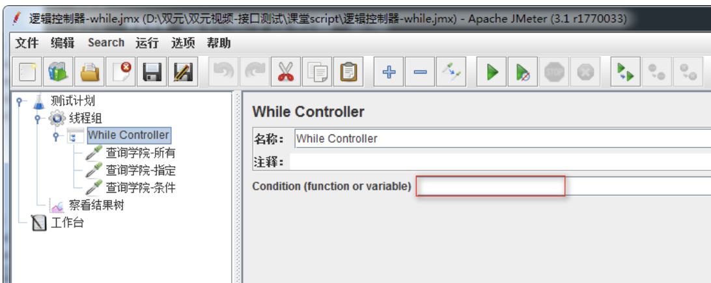

```
1. 为空：最后一个请求失败，停止循环；(如果不是最后一个请求执行失败，则继续循环)
2. LAST：
    1) 与为空相同之处：最后一个请求失败，停止循环；(如果不是最后一个请求执行失败，则继续循环)
    2) 与为空不同之处：测试计划在执行while控制器之前如果有请求失败，则不会执行while控制器
3. 表达式：表达式为false退出循环；
    例如：
        1) ${VAR}:当参数VAR的值被设置成false时退出循环
        2) ${__javascript(“${VAR}”==”User1”)}:当参数VAR的值部位User1时退出循环
```

#### While Controller-总结

```
1. 作用
2. 取值为空和LAST区别;
```

------

### 3.9 Switch Controller控制器

```
作用：通过给该控制器中的value赋值，来指定运行哪个取样器;
```

#### 案例8

```
线程组下有3个查询学院请求[所有、指定、条件]，使用Switch控制器控制执行指定请求。
```

#### 操作步骤：

```
1. 测试计划->线程组
2. 线程组->逻辑控制器->Switch Controller
3. 随机控制器->HTTP请求(查询学院-所有)
4. 随机控制器->HTTP请求(查询学院-指定)
5. 随机控制器->HTTP请求(查询学院-条件)
6. 测试计划->察看结果树
```

#### Switch Controller控制器配置图

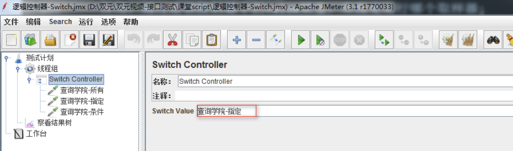

```
1. Switch Value：为采样器名称；执行采样器名称相应的请求
2. Switch Value：为空；默认为执行第一个
3. Switch Value：为索引；第一个为0
```

#### Switch Controller-总结

```
1. 作用
2. 取值
```

------

## 4. 常用(分组类)

```
1. 简单控制器
2. 事务控制器   
```

### 4.1 简单控制器

```
作用：只做分组使用，犹如打隔断；
备注：
    添加简单控制器修改(查询学院)，把(查询学院-所有、查询学院-指定)接口存放到此控制器下 
```

### 简单控制器使用图

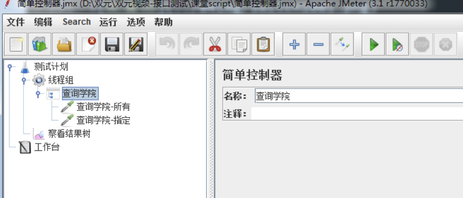

### 4.2 事务控制器

```
作用：生成一个额外的采样器来测量其下测试元素的总体时间； 
      值得注意的是，这个时间包含该控制器范围内的所有处理时间，而不仅仅是采样器的;
```

### 操作步骤分析

```
1. 测试计划->线程组
2. 线程组->逻辑控制器->事务控制器
3. 事务控制器->HTPP请求(查询所有、查询指定)
4. 测试计划->监听器->聚合报告
```

### 事务控制器使用图


### 事务控制器-总结：

```
1. 概念
2. 如何查看事务取样时间
```

------

## 5. 逻辑控制器-总结

```

1. 如果（If）控制器
2. ForEach控制器
3. 交替控制器
4. 循环控制器
5. 仅一次控制器
6. 随机控制器
7. 随机顺序控制器
8. While Controller  
9. Switch Controller
```


# 三、Jmeter 图形监视器扩展插件下载及使用

## 目标

- 了解如何在客户端下载安装第三方插件

------

## 1. 为什么要下载图形监视器扩展插件？

### 1.1 需求

```
请求(查询学院-所有)接口1000次的时候如何在客户端Jmeter工具中查看服务器(CPU、内存、网络、磁盘)的使用信息
```

### 1.2 问题

```
1. Jmeter工具打开监听器，没有监控服务器资源的组件
2. 服务器也没有启动被监听资源的服务程序
```

------

## 2. 图形监视器扩展插件有什么用？

```
作用：提供客户端与服务器交互时各种图形报告
```

### 2.1 解决方案分析

```
1. 服务器：下载服务器端监听服务程序(ServerAgent-2.2.1)
2. 客户端：下载标准扩展插件(JMeterPlugins-Standard-1.4.0.zip)
3. 启动服务器监听器程序(ServerAgent-2.2.1.zip)
4. 客户端加载监听服务器组件图表(jp@gc - PerfMon Metrics Collector)
```

### 2.2 插件下载

客户端：标准插件下载地址：<https://jmeter-plugins.org/downloads/old/>

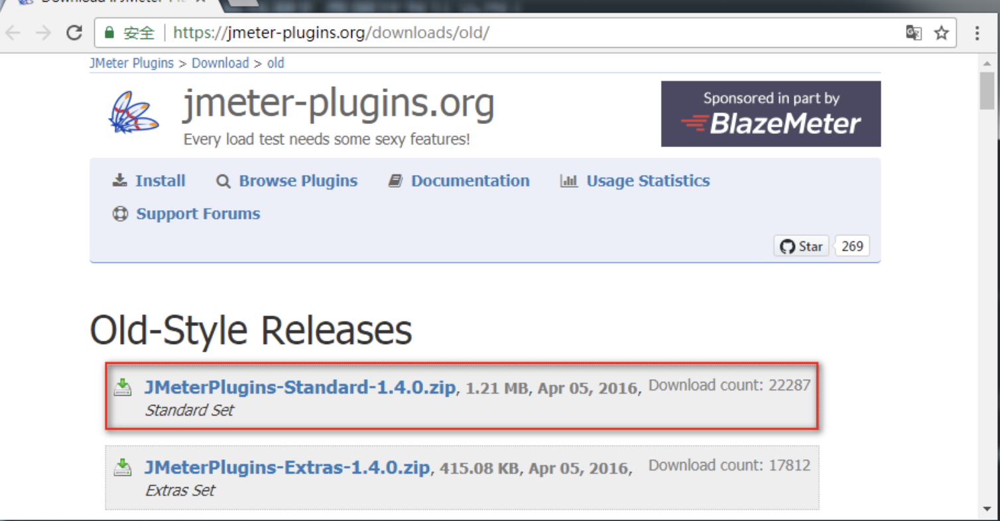

```
使用：
    1) 解压文件后，复制JMeterPlugins-Standard.jar文件
    2) 将JMeterPlugins-Standard.jar粘贴到Jmeter的Lib目录下面的ext目录
    3) 重启Jmeter
```

服务器：性能监控插件下载地址：<https://jmeter-plugins.org/wiki/PerfMonAgent/>


```
1. 解压到服务器任意目录
```

### 2.3 服务器端监听服务程序图


```
运行：
    1) Windows启动startAgent.bat
    2) Linux启动startAgent.sh
```

### 2.4 客户端监听图表插件图


```
1. Host/IP：服务器IP地址
2. Port：默认4444(4444为启动服务器监听服务程序时的端口号)
3. Metric to collect：选择要收集的指标（CPU、内存、网络、磁盘）
```

### 2.5 插件-总结

```
1. 服务器端下载监听服务程序
2. 客户端下载标准插件包
3. 标准插件包位置
4. 启动服务监听服务程序
```


# 四、总结


> 学习目标：
>
> 理解分布式测试原理
>
> 掌握如何进行分布式测试
>
> 掌握第三方插件使用
>
> 了解Jmeter的应用场景
>
> 掌握Jmeter分布式环境部署


