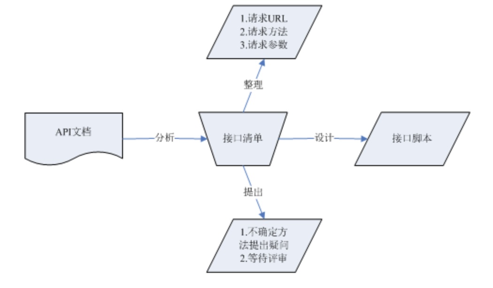
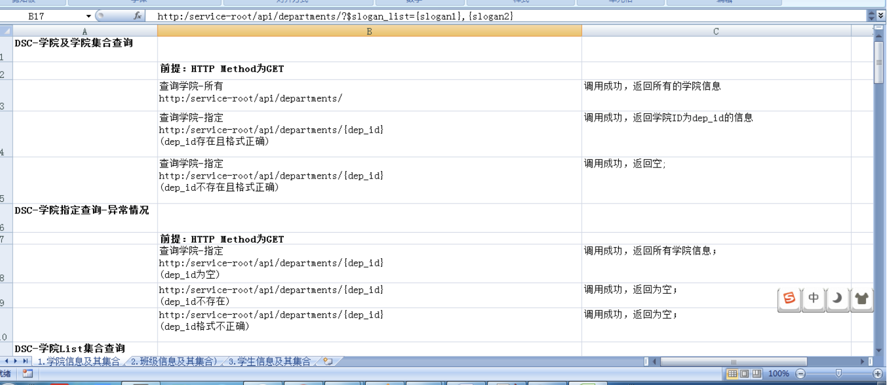

# Day19 工具篇——C站最全jmeter讲解（4）--学会看懂API文档、接口功能脚本设计、接口用例设计、测试用例中测试数据-参数化

[TOC]


#  学会看懂API文档

------

## 目标

- 学会看项目API文档
- 学会根据API文档整理出接口清单
- 学会对API文档中有不清楚的业务该如何在API接口清单内体现

------

## 为什么要分析API文档？

## 回顾

首先回顾下之前讲过的API文档由来和作用图

### API文档由来：


### API文档作用:




## 1. API文档解析：

#### 1.1 href节点：

```
作用：href节：为资源的请求地址；-(请求资源集合时的请求地址要与**href相符**)  
      "href":" http://127.0.0.1:8000/api/departments/"
```

#### 1.2 items节点：

```
作用：为服务器响应数据时返回的资源属性；
         (请求接口时，返回的资源属性要与items里的属性相符)
"items": [
              {
                "href": "/T01",
                "data": {
                            "dep_id": "T01",
                            "dep_name": "Test学院",
                            "master_name": "Test-Master",
                            "slogan": "Here is Slogan"
                        }
             }
         ]
```

#### 1.3 Links节点：

```
作用：为在当下资源下能连接到的直属下一资源
    (比如：A资源直接包含或关联着B、C两个资源，如果访问到A资源时，Links应定为到B和C)   
"links": [
            {
            "rel":"classes",
            "href":"http://127.0.0.1:8000/api/departments/T01/classes/ ",
            "prompt": "班级集合"
            }
         ]
```

#### 1.4 templates节点：

```
作用：为新增和更新资源时所需要的属性
      (新增和更新资源时所需要的JSON报文属性)
"templates": {
                "data": [
                          {
                            "dep_id": "T01",
                            "dep_name": "Test学院",
                            "master_name": "Test-Master",
                            "slogan": "Here is Slogan"
                          }
                        ]
              }
```

#### 1.5 queries节点：

```
作用：为资源支持的查询列表参数名和查询条件
      (资源支持哪些属性可以list查询;支持做查询条件的属性)   
"queries": [
             {
                "rel": "search",
                "href":" http://127.0.0.1:8000/api/departments/",
                "prompt": "列表查询",
                "data": [
                            {
                                "name": "$dep_id_list",
                                "value": ""
                            },
                            {
                                 "name": “$dep_name_list”,
                                 "value": ""
                             },
                             {
                                "name": "$master_name_list",
                                "value": ""
                              },
                              {
                                "name": "$slogan_list",
                                "value": ""
                              }
                        ]
                },
                   {
                    "rel": "condition",
                    "href":" http://127.0.0.1:8000/api/departments/",
                    "prompt": "条件查询（名称、简称）",
                    "data": [
                                {
                                    "name": " dep_name",
                                    "value": ""
                                },
                                {
                                    "name": " master_name",
                                    "value": ""
                                },
                                {
                                    "name": " slogan",
                                    "value": ""
                                 }
                              ]   
                }
            ]
```

##### 1). 总结list列表查询

```
调用格式如：href/?$def_if_list=id1,id2
1. $dep_id_list
2. $dep_name_list
3. $master_name_list
4. $slogan_list   
```

##### 2). 总结条件查询

```
调用格式如：href/?dep_name=name&master_name=masterName&slogan=slogan
dep_name
master_name
slogan   
(注：查询条件支持单个使用和组合使用)
```

------

#### 1.6 error节点作用说明：

```
出现错误时，返回的报文格式和属性
(如果请求资源有误，在响应数据时应在error节内体现)   
"error": {
            "status_code": "",
            "detail": ""
         }
```


## 接口清单整理：

#### 一、 接口清单(学院)示例：

```
一、查询
    1.1学院-查询所有
        请求方法：GET
        请求地址：http://127.0.0.1:8000/api/departments/
    1.2学院-查询指定
        请求方法：GET
        请求地址：http://127.0.0.1:8000/api/departments/T02/
        （注：1为学院ID；）
    1.3学院-List-$dep_id_list查询
        请求方法：GET
        请求地址：http://127.0.0.1:8000/api/departments/?$dep_id_list=T01,T02,T03 
        (注：$dep_id_list：为参数名称;T01,T02,T03为:学院ID;)
    1.4学院-List-$master_name_list查询
        请求方法：GET
        请求地址：http://127.0.0.1:8000/api/departments/?$master_name_list=Java-Master,Test-Master
        (注：$master_name_list：为参数名称;a,b,c为:院长名称;)
    1.5学院-List-$slogan_list查询
        请求方法：GET
        请求地址：http://127.0.0.1:8000/api/departments/?$slogan_list=Here is Slogan
        (注：$slogan_list：为参数名称;a,b,c为:学院口号;)
    1.6学院-List-$dep_name_list
        请求方法：GET
        请求地址：http://127.0.0.1:8000/api/departments/?$dep_name_list=Test学院,Java2学院
        (注：$dep_name_list为参数名称;Test学院为：学院名称;)
    1.7学院-模糊 -BUG
        请求方法：GET
        请求地址：http://127.0.0.1:8000/api/departments/?blur=1&dep_name=C
        (注:blur：为开启模糊查询参数1为开启；name：为参数名称；C：学院名称包含字符；)
    1.8学院-组合
        请求方法：GET
        请求地址：http://127.0.0.1:8000/api/departments/?slogan=Here is Slogan&master_name=Test-Master&dep_name=Test学院
        (注:dep_name：学院名称；master_name：为院长名称；slogan：学院口号；三个条件可随意组合或单独使用)

        1.以上方法是否有遗漏？
        答：

        2.以上请求资源格式和参数格式是否正确？
        答：
二、新增
    2.1学院-新增
        1) 请求方法：POST
        2) 请求地址：http://127.0.0.1:8000/api/departments/
        3) 请求JOSN报文：
        4) 调用传入的json串如下（可新增多条，之间用,隔开）：
            {
                "data": [
                        {
                            "dep_id": "T01",
                            "dep_name": "Test学院",
                            "master_name": "Test-Master",
                            "slogan": "Here is Slogan"
                        }
                  ]
            }

        1.以上请求新增资源URI是否正确？
        答：

        2.以上JSON报文格式是否正确？
        答：
三、更新
    3.1学院-更新
    1). 请求方法：PUT
    2). 请求地址：http://127.0.0.1:8000/api/departments/T03/
        (注：1：为学院ID)
    3). 请求JOSN报文：
            {
                "data": [
                        {
                            "dep_id": "T03",
                            "dep_name": "C++/学院",
                            "master_name": "C++-Master",
                            "slogan": "Here is Slogan"
                        }
                  ]
            }

    1.以上更新资源URI是否正确？
    答：

    2.以上更新JSON报文格式和属性是否正确？
    答：

四、删除
    4.1学院-删除单个
    请求方法：DELETE
    请求地址：http://127.0.0.1:8000/api/departments/T03/
    (注:10为学院ID)
    4.2学院-删除多个
    请求方法：DELETE
    请求地址：http://127.0.0.1:8000/api/departments/?$dep_id_list=8,9,11
    (注:$dep_id_list：为参数名称；8,9,11：为学院ID)

    1.以上删除资源URI是否正确？
    答：

    2.以上删除方法是否有遗漏？
```

#### 二、接口清单(班级)示例：

```
一、查询
    1.1班级-查询所有
        请求方法：GET
        请求地址：http://127.0.0.1:8000/api/departments/T01/classes/
        （注：T01：为班级ID）
    1.2班级-查询指定
        请求方法：GET
        请求地址：http://127.0.0.1:8000/api/departments/T01/classes/2017T01C02/
        （注：TO1：为班级ID；2017T01C02为班级ID；）
    1.3班级-List-$cls_id_list查询
        请求方法：GET
        请求地址：http://127.0.0.1:8000/api/departments/T01/classes/?$cls_id_list=2017T01C03,2017T01C04
        (注：T01:为班级ID；$cls_id_list：为参数名称;2017T01C03,2017T01C04为:班级ID;)
    1.4班级-List-$master_name_list查询
        请求方法：GET
        请求地址：http://127.0.0.1:8000/api/departments/T02/classes/?$master_name_list=Master15,Master16
        (注：T02：为班级ID；$master_name_list：为参数名称;Master15,Master16为:班主任名称;)
    1.5班级-List-$cls_name_list查询
        请求方法：GET
        请求地址：http://127.0.0.1:8000/api/departments/T01/classes/?$cls_name_list=2017级Test学院T01班,2017级Test学院T02班
        (注：T01：为班级ID;$cls_name_list：为参数名称;2017级Test班级T01班,2017级Test班级T02班为:班级名称;)
    1.6班级-List-$slogan_list查询
        请求方法：GET
        请求地址：http://127.0.0.1:8000/api/departments/T02/classes/?$slogan_list=slogan15,slogan16
        (注：T02：为班级ID;$slogan_list：为参数名称;slogan15,slogan16为:班级口号;)
    1.7班级-组合
        请求方法：GET
        请求地址：http://127.0.0.1:8000/api/departments/T01/classes/?cls_name=2018级Test学院T01班&master_name=Master&slogan=sloganSlogan&dep_name=Test班级
        (注:T01：学院ID；cls_name,master_name,dep_name：为参数名称；)

        1.以上方法是否有遗漏？
        答：

        2.以上请求资源格式和参数格式是否正确？
        答：
二、新增
    2.1班级-新增
        1) 请求方法：POST
        2) 请求地址：http://127.0.0.1:8000/api/departments/T02/classes/
                    (T02:为学院ID)
        3) 请求JOSN报文：
        4) 调用传入的json串如下（可新增多条，之间用,隔开）：
             {
                "data": [
                            {
                                "cls_id": "2018T01C015",
                                "cls_name": "2018级Test学院T10班",
                                "master_name": "Master15",
                                "slogan": "slogan15"
                            }
                        ]
              }


        1.以上请求新增资源URI是否正确？
        答：

        2.以上JSON报文格式是否正确？
        答：
三、更新
    3.1班级-更新
    1). 请求方法：PUT
    2). 请求地址：http://127.0.0.1:8000/api/departments/T01/classes/2017T01C05/
        (注：T01：学院ID；2017T01C05：为班级ID)
    3). 请求JOSN报文：
             {
                "data": [
                            {
                              "cls_id":"2017T01C05",
                              "dep_id":"T01",
                              "cls_name":"2018级Test学院T01班",
                              "master_name":"Master",
                              "slogan":"slogan"
                            }
                        ]
              }


    1.以上更新资源URI是否正确？
    答：

    2.以上更新JSON报文格式和属性是否正确？
    答：

四、删除
    4.1班级-删除单个
    请求方法：DELETE
    请求地址：http://127.0.0.1:8000/api/departments/T01/classes/2018T01C08/
    (注:T01：为学院ID；2018T01C08：为班级ID)
    4.2班级-删除多个
    请求方法：DELETE
    请求地址：http://127.0.0.1:8000/api/departments/T01/classes/?$cls_id_list=2018T01C010,2018T01C011
    (注:T01：学院Id；cls_id_list:为参数名称；2018T01C010,2018T01C011：为班级ID)

    1.以上删除资源URI是否正确？
    答：

    2.以上删除方法是否有遗漏？
```

#### 三、 接口清单(学生)示例:

```
一、查询
    1.1学生-查询所有
        请求方法：GET
        请求地址：http://127.0.0.1:8000/api/departments/T01/classes/2017T01C01/students/
    1.2学生-查询指定
        请求方法：GET
        请求地址：http://127.0.0.1:8000/api/departments/T01/classes/2017T01C01/students/2017T01C01001/
        (注:TO1：学院ID；2017T01C01：班级Id；2017T01C01001：学生id)
    1.3学生-List-$stu_id_list查询
        请求方法：GET
        请求地址：http://127.0.0.1:8000/api/departments/T01/classes/2017T01C01/students/?$stu_id_list=2017T01C01001,2017T01C010013
        (注:TO1：学院ID；2017T01C01：班级Id；$stu_id_list：参数名称；2017T01C01001,2017T01C010013：学生id)
    1.4学生-List-$stu_name_list查询
        请求方法：GET
        请求地址：http://127.0.0.1:8000/api/departments/T01/classes/2017T01C01/students/?$stu_name_list=张三,李四
        (注:TO1：学院ID；2017T01C01：班级Id；$stu_name_list：参数名称；张三,李四：学生姓名)
    1.5学生-条件
        请求方法：GET
        请求地址：http://127.0.0.1:8000/api/departments/T01/classes/2017T01C01/students/?stu_name=学生姓名
        (注:TO1：学院ID；2017T01C01：班级Id；stu_name：参数名称；学生姓名：参数值（学生姓名）)

        1.以上方法是否有遗漏？
        答：

        2.以上请求资源格式和参数格式是否正确？
        答：
二、新增
    2.1学生-新增
        1) 请求方法：POST
        2) 请求地址：http://127.0.0.1:8000/api/departments/T01/classes/2017T01C01/students/
                    (注:TO1：学院ID；2017T01C01：班级Id；)
        3) 请求JOSN报文：
        4) 调用传入的json串如下（可新增多条，之间用,隔开）：
            {
                "data": [
                        {
                               "stu_id": "2017T01C01002",
                               "stu_name": "王二New",
                               "gender": "0",
                               "birthday": "2018-01-01",
                               "native": "北京",
                               "phone_number": "",
                               "address": "",
                               "zipcode": "",
                               "email": "",
                               "note": ""
                         }

                  ]
            }

        1.以上请求新增资源URI是否正确？
        答：

        2.以上JSON报文格式是否正确？
        答：
三、更新
    3.1学生-更新
    1). 请求方法：PUT
    2). 请求地址：http://127.0.0.1:8000/api/departments/T01/classes/2017T01C01/students/2017T01C01001/
                    (注:TO1：学院ID；2017T01C01：为班级Id；班级Id；2017T01C01001：学生id)
    3). 请求JOSN报文：
            {
                "data": [
                        {
                          "stu_id":"2017T01C01001",
                          "dep_id":"T01",
                          "cls_id":"2017T01C01",
                          "stu_name":"王二",
                          "gender":false,
                          "birthday":"2018-01-01",
                          "native":"北京",
                          "phone_number":"",
                          "address":"",
                          "zipcode":"",
                          "email":"",
                          "note":""
                        }
                  ]
            }

    1.以上更新资源URI是否正确？
    答：

    2.以上更新JSON报文格式和属性是否正确？
    答：

四、删除
    4.1学生-删除单个
    请求方法：DELETE
    请求地址：http://127.0.0.1:8000/api/departments/T01/classes/2017T01C01/students/2017T01C010016/
                (注:TO1：学院ID；2017T01C01：为班级Id；2017T01C010016：学生id)

    1.以上删除资源URI是否正确？
    答：

    2.以上删除方法是否有遗漏？
```

## Jmeter 附件-API文档

### 文档内浏览项目API文档

------

```
API- Meta Model
版本 1.0
2018-1-11
```

### 修订记录

| 修订日期 | 章节索引 | 修订摘要 | 提出人 | 修订人 |
| -------- | -------- | -------- | ------ | ------ |
|          |          |          |        |        |
|          |          |          |        |        |
|          |          |          |        |        |

```
1.    服务版本
API- Meta Model 1.0
2.    项目说明
学生信息管理系统的功能是收集学生的个人信息，以便向老师提供每个学生在校或毕业生学籍的情况，还可以让学生用自己的学号去查看自己在校期间的表现。
2.1    学院信息（Department）及其集合（Departments）
描述
    学院信息集合
```

### 属性

| 属性        | 属性描述       | 是否必填   | 备注      |
| ----------- | -------------- | ---------- | --------- |
| dep_id      | 学院编号，主键 | 新增时必填 |           |
| dep_name    | 学院名称       | 是         | 最长20位  |
| master_name | 院长名称       | 是         | 最长20位  |
| Slogan      | 口号           | 否         | 最长100位 |

```
资源描述
{
  "collection": {
"version": "1.0",
"href":" http://127.0.0.1:8000/api/departments/",
"links": [ ],
"items": [
      {
        "href": "/T01",
        "data": {
            "dep_id": "T01",
            "dep_name": "Test学院",
            "master_name": "Test-Master",
            "slogan": "Here is Slogan"
        },
"links": [
{
"rel":"classes",
"href":"http://127.0.0.1:8000/api/departments/T01/classes/ ",
"prompt": "班级集合"
}
                ]
            }
       ],
        "templates": {
"data": [
          {
            "dep_id": "T01",
            "dep_name": "Test学院",
            "master_name": "Test-Master",
            "slogan": "Here is Slogan"
        }
  ]
 },
"queries": [
      {
"rel": "search",
"href":" http://127.0.0.1:8000/api/departments/",
"prompt": "列表查询",
"data": [
{
"name": "$dep_id_list",
"value": ""
},{
                  "name": “$dep_name_list”,
                  "value": ""
      },{
"name": "$master_name_list",
"value": ""
          },{
"name": "$slogan_list",
"value": ""
  }
]
},{
"rel": "condition",
"href":" http://127.0.0.1:8000/api/departments/",
"prompt": "条件查询（名称、简称）",
"data": [
{
"name": " dep_name",
"value": ""
},{
"name": " master_name",
"value": ""
},{
"name": " slogan",
"value": ""
  }
       ]   
}
],
"error": {
"status_code": "",
"detail": ""
    }
  }
}
```

### Queries释义

| 查询方法     | 参数规则                         | 值规则                                   |
| ------------ | -------------------------------- | ---------------------------------------- |
| 列表集合查询 | $字段名_list，如”$dep_id_list”   | 使用英文逗号分隔多个值                   |
| 单查询       | 字段名称(除主键外)，如”dep_name” |                                          |
| 模糊查询     | Blur                             | 默认不开启模糊查询，blur=1将开启模糊查询 |

```
2.2    班级信息（Class）及其集合（Classes）
描述
    学院下的班级信息集合
```

### 属性

| 属性        | 属性描述       | 是否必填   | 备注      |
| ----------- | -------------- | ---------- | --------- |
| cls_id      | 班级编号，主键 | 新增时必填 |           |
| cls_name    | 班级名称       | 是         | 最长20位  |
| master_name | 班主任名称     | 是         | 最长20位  |
| slogan      | 口号           | 否         | 最长100位 |
| dep_id      | 所属学院编号   | 是         |           |

```
资源描述
    {
  "collection": {
"version": "1.0",
"href":" http://127.0.0.1:8000/api/departments/T01/classes/",
"links": [ ],
"items": [
      {
        "href": "/2017T01C01",
        "data": {
            "cls_id": "2017T01C01",
            "dep_id": "T01",
            "cls_name": "2017级Test学院C01班",
            "master_name": "Master",
            "slogan": "slogan"
        },
"links": [
{
"rel":"students",
"href":"http://127.0.0.1:8000/api/departments/T01/classes/2017T01C01/students/ ",
"prompt": "学生集合"
}
                ]
            }
       ],
        "templates": {
"data": [
           {
            "cls_id": "2017T01C01",
            "cls_name": "2017级Test学院T01班",
            "master_name": "Master",
            "slogan": "slogan"
   }
  ]
 },
"queries": [
      {
"rel": "search",
"href":"http://127.0.0.1:8000/api/departments/T01/classes/",
"prompt": "列表查询",
"data": [
{
"name": "$cls_id_list",
"value": ""
},{
                  "name": “$cls_name_list”,
                  "value": ""
      },{
"name": "$master_name_list",
"value": ""
          },{
"name": "$slogan_list",
"value": ""
            }
]
},{
"rel": "condition",
"href":"http://127.0.0.1:8000/api/departments/T01/classes/",
"prompt": "条件查询（名称、简称）",
"data": [
{
"name": " cls_name",
"value": ""
},{
"name": " master_name",
"value": ""
},{
"name": " slogan",
"value": ""
  }
       ]   
}
],
"error": {
"status_code": "",
"detail": ""
    }
  }
}
```

### Queries释义

| 查询方法     | 参数规则                         | 值规则                 |
| ------------ | -------------------------------- | ---------------------- |
| 列表集合查询 | $字段名_list，如”$cls_id_list”   | 使用英文逗号分隔多个值 |
| 单查询       | 字段名称(除主键外)，如”cls_name” |                        |

```
2.3    学生个人信息（Student）及其集合（Students）
描述
    学生个人信息集合
```


### 属性

| 属性         | 属性描述         | 是否必填   | 备注                   |
| ------------ | ---------------- | ---------- | ---------------------- |
| stu_id       | 学号、主键       | 新增时必填 |                        |
| stu_name     | 学生姓名         | 是         | 最长20位               |
| gender       | 性别             | 是         | 值只能是0\1\false\true |
| birthday     | 出生日期         | 是         | YYYYMMDD\YYYY-MM-DD    |
| native       | 籍贯             | 是         | 最长20位               |
| cls_id       | 所属班级id、外键 | 新增时必填 |                        |
| dep_id       | 所属学院id、外键 | 新增时必填 |                        |
| phone_number | 联系方式         | 最长100位  |                        |
| address      | 住址             | 最长20位   |                        |
| zipcode      | 邮编             | 最长8位    |                        |
| email        | 邮箱             | 最长20位   |                        |
| note         | 备注说明         | 最长200位  |                        |

````

资源描述
    {
  "collection": {
"version": "1.0",
"href":"http://127.0.0.1:8000/api/departments/T01/classes/2017T01C01/students/",
"links": [ ],
"items": [
      {
        "href": "/2017T01C01001",
        "data": {
            "stu_id": "2017T01C01001",
            "dep_id": "T01",
            "cls_id": "C01",
            "stu_name": "学生姓名",
            "gender": "男",
            "birthday": "2018-01-01",
            "native": "北京",
            "phone_number": "",
            "address": "",
            "zipcode": "",
            "email": "",
            "note": ""
        },
"links": []
       ],
        "templates": {
"data": [
          {

            "dep_id": "T01",
            "cls_id": "C01",
            "stu_id": "2017T01C01001",
            "stu_name": "学生姓名",
            "gender": "男",
            "birthday": "2018-01-01",
            "native": "北京",
            "phone_number": "",
            "address": "",
            "zipcode": "",
            "email": "",
            "note": ""
 }
  ]
 },
"queries": [
      {
"rel": "search",
"href":"http://127.0.0.1:8000/api/departments/T01/classes/2017T01C01/students/",
"prompt": "列表查询",
"data": [
{
"name": "$stu_id_list",
"value": ""
},{
                  "name": “$stu_name_list”,
                  "value": ""
      }
]
},{
"rel": "condition",
"href":"http://127.0.0.1:8000/api/departments/T01/classes/2017T01C01/students/",
"prompt": "条件查询（名称、简称）",
"data": [
{
"name": " stu_name",
"value": ""
}
       ]   
}
],
"error": {
"status_code": "",
"detail": ""
    }
  }
}
```


````

### Queries释义

| 查询方法     | 参数规则                         | 值规则                 |
| ------------ | -------------------------------- | ---------------------- |
| 列表集合查询 | $字段名_list，如”$stu_id_list”   | 使用英文逗号分隔多个值 |
| 单查询       | 字段名称(除主键外)，如”stu_name” |                        |


# 接口功能脚本设计

**基于Jmeter设计学生信息管理系统-接口功能脚本**

------

### 1. 配置元件分析

```
1. HTTP信息头管理器
2. HTTP请求默认值
3. CSV Data Set Config
```

### 2. 请求方法

```
1. 查询使用方法(GET)
2. 新增使用方法(POST)
3. 更新使用方法(PUT)
4. 删除使用方法(DELETE)
```

### 3. 其他

```
1. 参数文件使用Nodepad++ UTF-8无BOM格式
   2. 每个接口为一个线程组,例如：(查询所有、查询指定、新增、更新、删除)
```

### 4. 配置示例图

#### 4.1 信息头管理器设置图：


#### 4.2 HTTP请求默认值设置图：


#### 4.3 CSV Data Set Config设置图


#### 4.4 HTTP请求设置图：


#### 4.5 nodepad++ UTF-8无BOM格式


#### 4.6 功能脚本示例图：


# 接口用例设计

------

## 目标

- 掌握接口用例设计技巧
- 理解接口用例设计时划分颗粒度

------

## 1. 用例设计原则

```
1. 覆盖所有的必选参数
2. 组合可选参数
3. 参数边界值
4. 如果参数的取值范围是枚举变量，需要覆盖所有枚举值    
5. 空数据
6. 包含特殊的字符
7. 越界的数据
8. 错误的数据    
```

## 2. 用例格式

| 用例编号 | 用例名称 | 方法 | 测试步骤 | 预期结果 | 是否通过 | 备注 |
| -------- | -------- | ---- | -------- | -------- | -------- | ---- |
|          |          |      |          |          |          |      |

## 3. 用例实现示例：

### 3.1 查询

#### 查询指定-正向

```
1. 传入参数（格式正确且存在）
2. 传入参数（格式正确）  
```

#### 查询-逆向

```
1. 校验-为空
2. 校验-格式不正确  
```

#### 查询List 正向

```
1. list参数全部存在且格式正确
2. list有一个以上存在且格式正确  
```

#### 查询List 逆向

```
1. list参数都为空
2. list都不存在  
```

#### 查询-组合 正向

```
1. 传入全部条件存在且格式正确  
2. 单个条件或部分条件组合（存在且格式正确）
```

#### 查询-组合 逆向

```
1. 全部为空
2. 一个以上不存在或格式不正确  
```

#### 查询-模糊 正向

```
1. 传入模糊参数或全部参数
```

------

### 3.2 新增

#### 新增正向

```
1. 传入新增全部参数，格式正确
2. 传入新增必填参数，其他为空  
```

#### 新增逆向

```
1. 传入已存在id，唯一不重复字段校验
2. 类型校验（时间日期、布尔、指定范围值0/1） 
3. 格式不正确校验 
```

------

### 3.3 更新

#### 更新正向

```
1. 传入更新全部参数，格式正确
2. 软入更新必填参数，其他为空  
```

#### 更新逆向

```
1. 传入id不存在
2. 类型校验（时间日期、布尔、指定范围值0/1） 
3. 格式不正确校验
```

### 3.4 删除

#### 删除正向-指定

```
1. 传入正确ID且存在
```

#### 删除逆向-指定

```
1. 传入ID不正确
```

#### 删除正向-list

```
1. 传入全部正确id
2. 传入部分正确id
```

#### 删除逆向

```
1. 传入全部不存在id
2. 传入id为空
```

------

## 4. 接口用例效果图




# 测试用例中测试数据-参数化

------

## 目标

- 给测试用例设计测试数据

------

## 测试数据分类

- 正向：(根据测试用例覆盖面设计正向测试数据)
- 逆向: (根据测试用例覆盖面设计逆向测试数据)

### 正向方法：

```
1. 传入所有可传属性，且格式正确
2. 传入必填属性，且格式正确
```

### 校验方法：

```
1) 为空校验
2) 为空格校验
3) 前后含空格校验
4) 超长校验
5) 类型校验
6) 含特殊字符校验
7) 删除引用校验
8) 唯一不重复属性校验
```

------

## 参数化示例：

### 学院-组合查询参数化示例：

```
Here is Slogan,Test-Master,Test学院,----正向数据
,Test-Master,Test学院,----两个条件组合
,,Test学院,----单个条件
Here is Slogan,,,----正向数据
,Test-Master,,----正向数据
 Here is Slogan ,Test-Master,Test学院,----Here is Slogan前后含空格
Here is Slogan, Test-Master ,Test学院,----Test-Master前后含空格
Here is Slogan,Test-Master, Test学院 ,----Test学院前后含空格
 ,Test-Master,Test学院,----为空格
Here is Slogan, ,Test学院,----为空格
Here is Slogan,Test-Master, ,----为空格
Here is Slogan222,Test-Master,Test学院,----一个条件不存在
Here is Slogan,Test-Master22222222222222222222222222222,Test学院,----超长
Here is Slogan,Test-Master,Test%%%%%%%%%%%%%院,----含特殊字符
,,,----全部为空
```

### 学院-list删除参数化示例：

```
T07,T08,---正确数据
,T08,---一个为空
T07,,---一个为空
T07,T0888,---一个为正常，一个为不存在
 ,T08,---一个为空格
T07, ,---一个为空格
 T07 , T08 ,---前后含空格 
T07%,T08,---一个为格式不正确
T07,T0888888888888888,---一个为超长

`
```

### 学院新增参数化示例：

```
T09,Test学院,Test-Master,Here is Slogan,-----正向数据
---ID存在校验
T09,Test学院,Test-Master,Here is Slogan,-----ID已存在
---为空校验
,Test学院,Test-Master,Here is Slogan,-----depid为空
T09,,Test-Master,Here is Slogan,-----depname为空
T09,Test学院,,Here is Slogan,-----mastername为空
T09,Test学院,Test-Master,,-----slogan为空
---为空格校验
 ,Test学院,Test-Master,Here is Slogan,-----depid为空格
T09, ,Test-Master,Here is Slogan,-----depname为空格
T09,Test学院, ,Here is Slogan,-----mastername为空格
T09,Test学院,Test-Master, ,-----slogan为空格
---含前后空格
 T09 ,Test学院,Test-Master,Here is Slogan,-----depid含前后空格
T09, Test学院 ,Test-Master,Here is Slogan,-----depname含前后空格
T09,Test学院, Test-Master ,Here is Slogan,-----mastername含前后空格
T09,Test学院,Test-Master, Here is Slogan ,-----slogan含前后空格
---含前后#
#T09#,Test学院,Test-Master,Here#is#Slogan,-----depid含前后#
T09,#Test学院#,Test-Master,Here#is#Slogan,-----depname含前后#
T09,Test学院,#Test-Master#,Here#is#Slogan,-----mastername含前后#
T09,Test学院,Test-Master,#Here#is#Slogan#,-----slogan含前后#
---含前后@
@T09@,Test学院,Test-Master,Here@is@Slogan,-----depid含前后@
T09,@Test学院@,Test-Master,Here@is@Slogan,-----depname含前后@
T09,Test学院,@Test-Master@,Here@is@Slogan,-----mastername含前后@
T09,Test学院,Test-Master,@Here@is@Slogan@,-----slogan含前后@
---含前后%
%T09%,Test学院,Test-Master,Here%is%Slogan,-----depid含前后%
T09,%Test学院%,Test-Master,Here%is%Slogan,-----depname含前后%
T09,Test学院,%Test-Master%,Here%is%Slogan,-----mastername含前后%
T09,Test学院,Test-Master,%Here%is%Slogan%,-----slogan含前后%
---超长校验
T091111111111111111111111122222222222222,Test学院,Test-Master,Here%is%Slogan,-----depid含超长
T09,Test学院222222222222222222222,Test-Master,HereisSlogan,-----depname含超长
T09,Test学院,%Test-Master1111111111111111111111,HereisSlogan,-----mastername超长
T09,Test学院,Test-Master,HereisSlogan11111111111111111111,-----slogan超长
```


# 总结


**重点提要：**

学会看项目API文档

学会根据API文档整理出接口清单

学会对API文档中有不清楚的业务该如何在API接口清单内体现

会针对API文档设计接口用例

结合前几期Jmeter内容写出jmeter测试脚本

**接口用例设计原则**

```
1. 覆盖所有的必选参数
2. 组合可选参数
3. 参数边界值
4. 如果参数的取值范围是枚举变量，需要覆盖所有枚举值    
5. 空数据
6. 包含特殊的字符
7. 越界的数据
8. 错误的数据    
```


